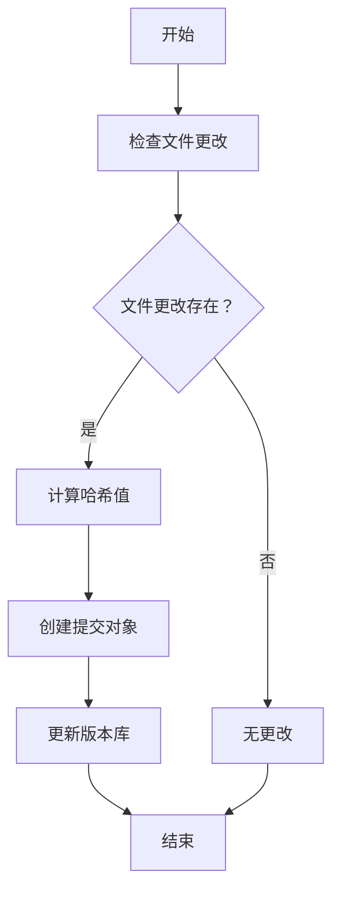
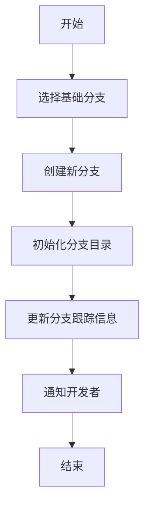
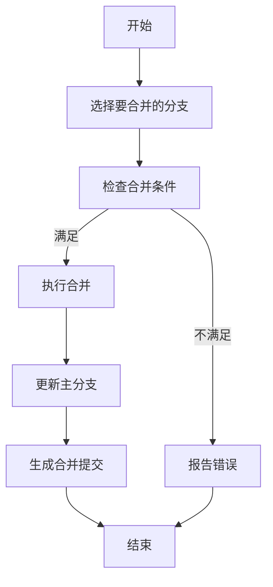
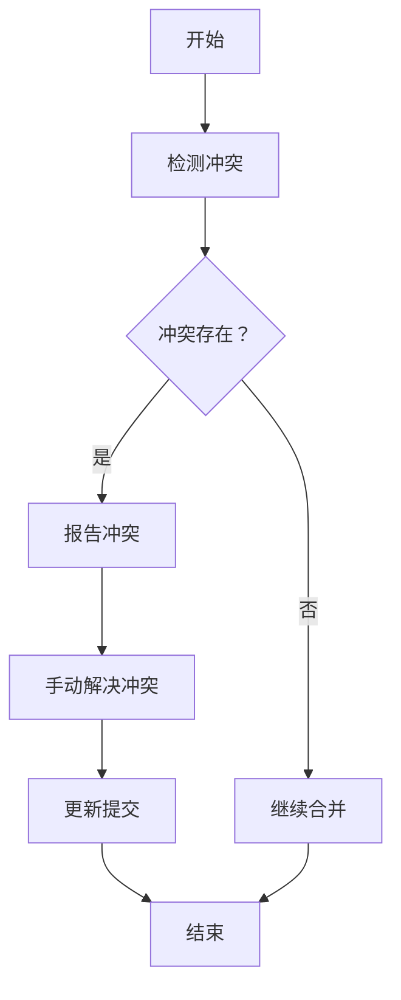
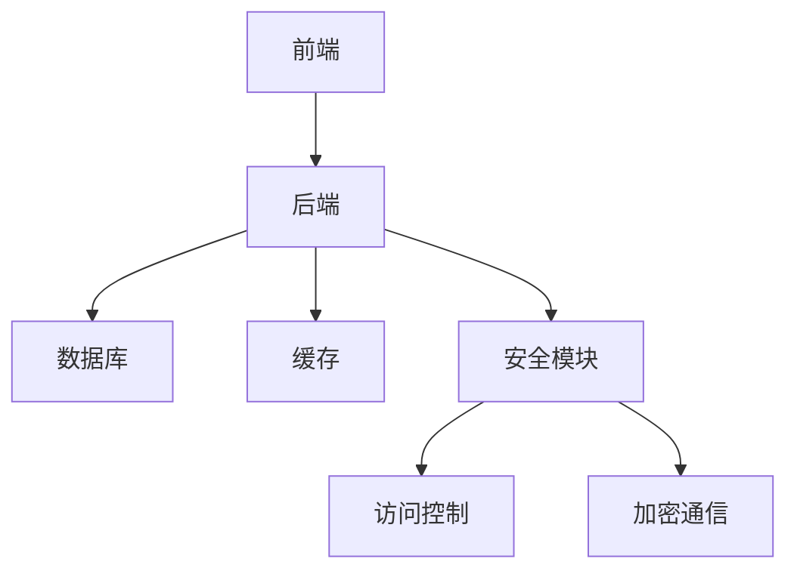
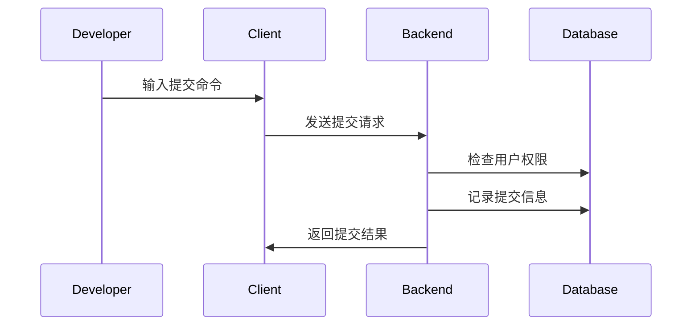
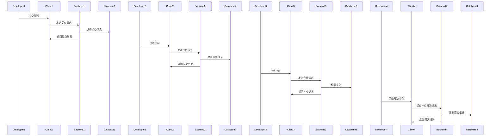

                 

# 大模型软件的分布式版本控制策略

## 关键词
- 大模型软件
- 分布式版本控制
- 软件开发
- 版本控制
- 分布式系统

## 摘要
本文探讨了在大规模模型软件开发过程中面临的版本控制挑战，并提出了分布式版本控制策略。文章首先介绍了版本控制的核心概念和问题背景，随后分析了大模型软件的特性及其对版本控制带来的独特挑战。接着，文章详细阐述了分布式版本控制的基础知识和策略设计原则，并给出了分布式版本控制的实践方法和案例分析。最后，文章总结了最佳实践和优化策略，并对未来发展趋势进行了展望。

----------------------------------------------------------------

## 第一部分：引言

### 第1章：问题背景与核心概念

#### 1.1 软件开发中的版本控制问题

在软件开发生命周期中，版本控制是确保代码、文档和配置项一致性和可追溯性的关键过程。传统的集中式版本控制系统，如Git，虽然解决了许多版本控制问题，但在处理大规模模型软件时却面临诸多挑战。首先，大模型软件通常包含数百万行代码，存储和传输这些代码需要大量的存储空间和带宽。其次，大模型软件的修改频率高，频繁的版本更新可能导致版本管理的复杂性和冲突。此外，集中式版本控制系统依赖于中心服务器，一旦服务器出现问题，整个系统的可用性将受到影响。

#### 1.2 分布式版本控制需求

为了应对上述挑战，分布式版本控制成为了一个重要的解决方案。分布式版本控制系统能够在多个节点上维护代码库的副本，实现并行开发，提高开发效率和系统的可靠性。在大规模模型软件的开发中，分布式版本控制的需求主要体现在以下几个方面：

1. **并行开发**：分布式版本控制系统能够支持多人在不同地点同时修改代码，提高了开发效率。
2. **去中心化**：分布式版本控制系统能够在多个节点上维护代码库的副本，减少了中心服务器的单点故障风险。
3. **数据存储**：分布式版本控制系统能够将代码库分散存储在多个节点上，减少了存储和传输的压力。
4. **冲突解决**：分布式版本控制系统能够更好地处理多人并发修改代码时的冲突，提供灵活的冲突解决策略。

#### 1.3 核心概念介绍

在探讨分布式版本控制策略之前，需要了解一些核心概念：

1. **分布式版本控制系统**：分布式版本控制系统能够在多个节点上维护代码库的副本，实现并行开发。
2. **版本库**：版本库是存储代码和配置项的地方，可以是集中式的，也可以是分布式的。
3. **提交**：提交是将修改后的代码库上传到版本库的过程。
4. **拉取**：拉取是从版本库中获取最新代码的过程。
5. **分支**：分支是代码库的独立副本，用于实现功能开发。
6. **合并**：合并是将两个或多个分支的代码合并到主分支的过程。
7. **冲突**：冲突是当两个或多个开发者同时对同一部分代码进行修改时产生的冲突。
8. **标签**：标签用于标记特定的代码版本，以便于后续的查找和恢复。

### 第2章：分布式版本控制基础

#### 2.1 分布式版本控制原理

分布式版本控制系统的原理较为简单，核心在于实现代码库的分布式存储和管理。具体来说，分布式版本控制系统通常包含以下组件：

1. **版本库**：版本库是存储代码和配置项的地方，可以是集中式的，也可以是分布式的。在分布式版本控制系统中，版本库通常会分布在多个节点上，以实现数据的高可用性和可扩展性。
2. **客户端**：客户端是开发者使用的工具，用于提交代码、拉取代码、创建分支、合并分支等操作。
3. **服务器**：服务器是存储版本库的地方，通常充当着代理和协调者的角色。

分布式版本控制系统的工作原理如下：

1. **初始化**：开发者首先从版本库中克隆一个代码库到本地。
2. **提交**：开发者对代码进行修改后，将修改上传到本地版本库，然后通过客户端将本地版本库的修改提交到服务器。
3. **拉取**：其他开发者可以通过客户端从服务器拉取最新的代码，并与本地版本库进行合并。
4. **分支**：开发者可以在本地创建分支，用于独立开发功能。
5. **合并**：开发完成后，开发者可以将分支的代码合并到主分支，实现功能的集成。
6. **标签**：开发者可以使用标签标记特定的代码版本，以便于后续的查找和恢复。

#### 2.2 常见分布式版本控制系统

目前，常见的分布式版本控制系统主要包括Git、Mercurial和Bazaar等。下面将简要介绍这些系统：

1. **Git**：Git是世界上最流行的分布式版本控制系统，由Linus Torvalds创建。Git的核心特点是速度快、支持并行开发，并且具有强大的分支和合并功能。Git适用于各种规模的项目，特别适合大型项目和分布式团队。
2. **Mercurial**：Mercurial是另一种流行的分布式版本控制系统，由Matt Mackall创建。Mercurial与Git类似，也支持并行开发，但相比Git，其用户界面更为简洁，易于使用。Mercurial适用于各种规模的项目，但其用户群体相对较小。
3. **Bazaar**：Bazaar是一种相对较新的分布式版本控制系统，由Canonical开发。Bazaar的特点是易于使用、支持多种平台，并且具有强大的合并功能。Bazaar适用于小型项目和初学者。

#### 2.3 分布式版本控制的挑战与解决方案

尽管分布式版本控制系统具有许多优点，但在实际应用中仍面临一些挑战。以下将简要介绍这些挑战及其解决方案：

1. **网络延迟**：分布式版本控制系统依赖于网络进行代码的传输和同步。当网络延迟较高时，可能会影响开发者的工作效率。解决方案是使用高速网络，并优化客户端和服务器的通信协议。
2. **数据一致性**：分布式版本控制系统需要确保多个节点上的数据一致性。当多个开发者同时修改同一文件时，可能会产生冲突。解决方案是使用锁机制、版本控制和冲突解决策略。
3. **存储空间**：分布式版本控制系统需要大量的存储空间来存储代码库的副本。解决方案是使用分布式存储系统、数据压缩和去重技术。
4. **安全性**：分布式版本控制系统的安全性是一个重要问题。解决方案是使用加密传输、访问控制和安全审计。

### 第3章：大模型软件特性分析

#### 3.1 大模型软件的特点

大模型软件通常具有以下特点：

1. **代码规模大**：大模型软件包含数百万行代码，甚至更多。
2. **修改频繁**：大模型软件的修改频率很高，可能每天都会有新的修改。
3. **依赖复杂**：大模型软件通常具有复杂的依赖关系，涉及多种编程语言、库和框架。
4. **性能要求高**：大模型软件通常用于实时数据处理和预测，对性能要求较高。
5. **安全性要求高**：大模型软件的运行过程可能涉及敏感数据和隐私保护，因此安全性要求较高。

#### 3.2 大模型软件版本控制的独特挑战

大模型软件的版本控制面临着以下独特挑战：

1. **存储和传输压力**：大模型软件的代码规模大，导致存储和传输压力增大。分布式版本控制系统能够在一定程度上缓解这一问题，但仍需优化存储和传输策略。
2. **冲突解决**：大模型软件的修改频繁，冲突解决变得尤为重要。分布式版本控制系统能够提供一定的冲突解决策略，但需要结合大模型软件的实际情况进行优化。
3. **依赖管理**：大模型软件的依赖复杂，依赖管理的准确性对版本控制至关重要。分布式版本控制系统能够在一定程度上简化依赖管理，但仍需优化依赖管理策略。
4. **性能优化**：大模型软件对性能要求高，版本控制的性能优化成为一个重要问题。分布式版本控制系统能够在一定程度上优化性能，但需要结合大模型软件的实际情况进行优化。
5. **安全性保障**：大模型软件的安全性要求高，版本控制的安全性成为一个重要问题。分布式版本控制系统能够提供一定的安全性保障，但需要结合大模型软件的实际情况进行优化。

### 第4章：分布式版本控制策略设计

#### 4.1 策略设计原则

分布式版本控制策略的设计应遵循以下原则：

1. **并行开发**：分布式版本控制系统的核心优势在于支持并行开发，因此策略设计应优先考虑并行开发的效率。
2. **数据一致性**：分布式版本控制系统需要确保多个节点上的数据一致性，策略设计应确保数据一致性的实现。
3. **冲突解决**：冲突解决是分布式版本控制系统的一个重要功能，策略设计应提供灵活的冲突解决机制。
4. **依赖管理**：依赖管理是版本控制的核心之一，策略设计应优化依赖管理，确保依赖的准确性和稳定性。
5. **性能优化**：性能优化是分布式版本控制系统的一个重要目标，策略设计应考虑性能优化的实现。
6. **安全性保障**：安全性保障是分布式版本控制系统的一个重要方面，策略设计应提供安全性保障措施。

#### 4.2 策略设计方法

分布式版本控制策略的设计可以采用以下方法：

1. **需求分析**：分析大模型软件的开发需求，明确版本控制的具体目标和要求。
2. **方案选型**：选择适合大模型软件的分布式版本控制系统，并确定版本库的存储和布局方式。
3. **策略制定**：制定分布式版本控制的具体策略，包括并行开发、数据一致性、冲突解决、依赖管理和性能优化等方面。
4. **实施方案**：根据策略制定实施方案，包括部署分布式版本控制系统、配置版本库和客户端、制定开发规范和流程等。

#### 4.3 策略实现要点

分布式版本控制策略的实现应关注以下要点：

1. **版本库部署**：选择合适的分布式版本控制系统，并在多个节点上部署版本库，确保数据的高可用性和可扩展性。
2. **客户端配置**：配置客户端，使其能够与版本库进行通信，并实现并行开发、数据一致性、冲突解决、依赖管理和性能优化等功能。
3. **开发规范**：制定开发规范，明确版本控制的流程和规则，确保开发过程中的版本控制一致性。
4. **冲突解决机制**：实现冲突解决机制，提供灵活的冲突解决策略，确保冲突得到及时解决。
5. **性能优化**：对分布式版本控制系统进行性能优化，提高版本控制的效率，降低网络延迟和存储压力。
6. **安全性保障**：对分布式版本控制系统进行安全性保障，防止数据泄露、恶意攻击等安全风险。

### 第5章：分布式版本控制实践

#### 5.1 实践流程与步骤

分布式版本控制的实践通常包括以下流程和步骤：

1. **需求分析**：明确大模型软件的开发需求和版本控制目标。
2. **系统选型**：选择适合大模型软件的分布式版本控制系统。
3. **环境搭建**：在多个节点上部署分布式版本控制系统，并配置版本库。
4. **客户端配置**：配置客户端，使其能够与版本库进行通信。
5. **开发规范制定**：制定开发规范，明确版本控制的流程和规则。
6. **并行开发**：按照开发规范进行并行开发，实现功能的迭代和集成。
7. **冲突解决**：在开发过程中遇到冲突时，及时解决冲突，确保代码的一致性。
8. **性能优化**：对分布式版本控制系统进行性能优化，提高版本控制的效率。
9. **安全性保障**：对分布式版本控制系统进行安全性保障，防止安全风险。

#### 5.2 分布式版本控制工具选型

在选择分布式版本控制工具时，需要考虑以下几个方面：

1. **功能特性**：选择具有所需功能特性的分布式版本控制工具，如并行开发、数据一致性、冲突解决、依赖管理和性能优化等。
2. **易用性**：选择易用的分布式版本控制工具，降低开发者的学习成本。
3. **社区支持**：选择具有良好社区支持的分布式版本控制工具，确保遇到问题时能够得到及时帮助。
4. **性能和稳定性**：选择性能好、稳定性高的分布式版本控制工具，确保版本控制的效率和安全。
5. **成本**：选择成本合理的分布式版本控制工具，确保预算范围内实现版本控制。

目前，常见的分布式版本控制工具有Git、Mercurial、Bazaar和Subversion等。其中，Git是最为流行和广泛使用的分布式版本控制工具。

#### 5.3 分布式版本控制案例分析

以下是一个分布式版本控制的实际案例：

1. **需求分析**：某公司开发一款大型模型软件，涉及多个团队和数百名开发人员，需要高效的版本控制。
2. **系统选型**：选择Git作为分布式版本控制工具，搭建GitLab作为版本库服务器。
3. **环境搭建**：在公司的多个数据中心部署GitLab服务器，并配置Git客户端。
4. **开发规范制定**：制定开发规范，明确分支管理、代码审查和合并流程。
5. **并行开发**：各个团队按照开发规范进行并行开发，每个团队都有独立的分支。
6. **冲突解决**：遇到冲突时，通过代码审查和讨论解决冲突，确保代码的一致性。
7. **性能优化**：优化GitLab服务器的性能，提高版本控制的效率。
8. **安全性保障**：配置GitLab的访问控制和审计功能，确保版本控制的安全性。

通过分布式版本控制，该公司的开发效率显著提高，版本控制的问题得到有效解决。

### 第6章：最佳实践与优化

#### 6.1 最佳实践与注意事项

在分布式版本控制实践中，遵循以下最佳实践和注意事项：

1. **分支管理**：合理使用分支，确保代码的隔离和可管理性。
2. **代码审查**：进行代码审查，确保代码的质量和一致性。
3. **自动化测试**：实施自动化测试，确保代码的可靠性和稳定性。
4. **冲突解决**：及时解决冲突，避免积累问题。
5. **权限管理**：合理配置访问权限，确保版本控制的安全性。
6. **备份和恢复**：定期备份版本库，确保数据的安全性和可恢复性。

#### 6.2 常见问题与解决策略

在分布式版本控制中，可能会遇到以下问题：

1. **网络延迟**：解决方案是优化网络配置、提高网络带宽。
2. **数据一致性**：解决方案是使用分布式锁、版本控制和事务机制。
3. **存储空间不足**：解决方案是使用分布式存储系统、数据压缩和去重技术。
4. **安全性问题**：解决方案是使用加密传输、访问控制和安全审计。

#### 6.3 注意事项与风险规避

分布式版本控制需要注意以下事项和风险：

1. **版本库的可靠性**：确保版本库的可靠性和可用性。
2. **数据一致性**：避免数据不一致的问题，确保版本控制的正确性。
3. **安全性**：防范数据泄露、恶意攻击等安全风险。
4. **冲突解决**：制定合理的冲突解决策略，避免积累冲突。

### 第7章：性能优化与展望

#### 7.1 性能优化策略

分布式版本控制的性能优化策略包括：

1. **网络优化**：优化网络配置、提高网络带宽。
2. **存储优化**：使用分布式存储系统、数据压缩和去重技术。
3. **并发优化**：优化并发处理能力，减少瓶颈。
4. **缓存优化**：使用缓存机制，提高数据访问速度。

#### 7.2 未来发展趋势

分布式版本控制未来的发展趋势包括：

1. **云原生版本控制**：利用云原生技术，实现更高效、更安全的版本控制。
2. **AI优化**：利用人工智能技术，优化版本控制的流程和策略。
3. **自动化**：实现版本控制的自动化，减少人工干预。
4. **协作与集成**：加强版本控制与其他开发工具和流程的集成，提高开发效率。

### 附录

#### 附录A：术语表

| 术语         | 说明                                                         |
| ------------ | ------------------------------------------------------------ |
| 分布式版本控制 | 在多个节点上维护代码库的副本，实现并行开发。                   |
| 版本库       | 存储代码和配置项的地方，可以是集中式的，也可以是分布式的。     |
| 提交         | 将修改后的代码库上传到版本库的过程。                         |
| 拉取         | 从版本库中获取最新代码的过程。                               |
| 分支         | 代码库的独立副本，用于实现功能开发。                         |
| 合并         | 将两个或多个分支的代码合并到主分支的过程。                   |
| 冲突         | 当两个或多个开发者同时对同一部分代码进行修改时产生的冲突。     |
| 标签         | 用于标记特定的代码版本，以便于后续的查找和恢复。              |

#### 附录B：参考文献

1. "Understanding Distributed Version Control Systems" by Karl Fogel
2. "Pro Git" by Scott Chacon and Ben Straub
3. "Git Internals" by Richard Hipp
4. "Mercurial: The Definitive Guide" by Bryan O'Sullivan
5. "Bazaar: A Modern Distributed Version Control System" by Martin Pool

----------------------------------------------------------------

## 作者信息

- 作者：AI天才研究院/AI Genius Institute & 禅与计算机程序设计艺术 /Zen And The Art of Computer Programming

----------------------------------------------------------------

**核心概念与联系**

在本文中，我们将探讨分布式版本控制的核心概念和它们在大模型软件版本控制中的应用。以下是几个关键概念及其相互关系：

### 分布式版本控制（Distributed Version Control）

**概念**：分布式版本控制是一种版本控制系统，它允许用户在多个地点独立维护代码库的副本，并通过网络进行同步。

**属性特征对比表格**：

| 概念       | 属性特征                     |
| ---------- | -------------------------- |
| 分布式版本控制 | - 并行开发<br>- 去中心化<br>- 数据高可用性 |
| 集中式版本控制 | - 单一中心服务器<br>- 数据集中存储 |

**ER实体关系图架构**：

```mermaid
erDiagram
  VersionControlSystem ||--|{ Repository } Repository
  Repository ||--|{ Commit } Commit
  Commit ||--|{ Branch } Branch
  Commit ||--|{ Tag } Tag
```

### 提交（Commit）

**概念**：提交是将一组文件更改存储到版本库中的操作。

**属性特征**：

| 提交       | 属性特征                     |
| ---------- | -------------------------- |
| 提交号     | 唯一标识一个提交的ID       |
| 作者       | 提交者的姓名和电子邮件地址   |
| 提交信息   | 提交时的描述性注释          |

**算法mermaid流程图**：



### 分支（Branch）

**概念**：分支是代码库的独立副本，用于实现功能开发。

**属性特征**：

| 分支       | 属性特征                     |
| ---------- | -------------------------- |
| 分支名     | 分支的唯一标识符            |
| 基础分支   | 分支创建时的基础分支        |
| 提交历史   | 分支上的提交历史记录        |

**算法mermaid流程图**：



### 合并（Merge）

**概念**：合并是将两个或多个分支的代码合并到主分支的过程。

**属性特征**：

| 合并       | 属性特征                     |
| ---------- | -------------------------- |
| 合并类型   | 快速合并、三次合并等        |
| 冲突解决   | 自动解决、手动解决等        |
| 合并结果   | 生成新的提交记录            |

**算法mermaid流程图**：



### 冲突（Conflict）

**概念**：冲突是当两个或多个开发者同时对同一部分代码进行修改时产生的冲突。

**属性特征**：

| 冲突       | 属性特征                     |
| ---------- | -------------------------- |
| 冲突类型   | 文本冲突、属性冲突等        |
| 冲突解决   | 自动解决、手动解决等        |
| 解决结果   | 冲突解决的最终代码状态      |

**算法mermaid流程图**：



通过上述核心概念的介绍和相互关系的分析，我们可以更好地理解分布式版本控制在大模型软件版本控制中的应用。这些概念不仅构成了分布式版本控制的基础，也为大模型软件的开发提供了有效的管理和协同工具。

### 算法原理讲解

在本章节中，我们将深入探讨分布式版本控制算法的原理，包括其数学模型和公式，并通过一个简单的示例进行解释。首先，让我们从基本概念开始。

**分布式版本控制的数学模型**：

分布式版本控制的核心是“版本库”（Repository）和“提交”（Commit）。每一个提交都可以用一个唯一标识符（如哈希值）来表示。提交的数学模型可以表示为：

$$
Commit = (Files, Metadata, Parents)
$$

其中：
- **Files**：提交中的文件集合；
- **Metadata**：提交的元数据，包括提交信息、作者、提交时间等；
- **Parents**：父提交的集合，用于表示分支和合并操作。

每一个提交都会生成一个新的哈希值，这个哈希值是提交内容的指纹，用于唯一标识这个提交。

**分布式版本控制的公式**：

为了理解分布式版本控制的运算，我们需要了解几个关键的公式：

1. **哈希值生成**：

$$
Hash(Commit) = SHA-256(Files \oplus Metadata \oplus Concat(Parents))
$$

其中，$\oplus$ 表示二进制位运算的异或操作，$Concat(Parents)$ 表示将父提交的哈希值按顺序连接起来。

2. **分支创建**：

$$
NewBranch = (CurrentCommit, BaseCommit)
$$

其中，$CurrentCommit$ 表示当前分支的最新提交，$BaseCommit$ 表示基础分支的最新提交。

3. **合并操作**：

$$
MergeCommit = (CurrentCommit, BaseCommit)
$$

合并提交的哈希值可以通过以下公式计算：

$$
Hash(MergeCommit) = SHA-256(Files_{Current} \oplus Metadata_{Merge} \oplus Concat(Hash(Files_{Base}), Hash(Metadata_{Base})))
$$

其中，$Files_{Current}$ 和 $Metadata_{Merge}$ 分别表示当前分支的文件和元数据。

**简单示例**：

假设我们有两个分支 `FeatureA` 和 `FeatureB`，它们基于同一个基础分支 `Main`。现在，我们将在 `FeatureA` 和 `FeatureB` 上分别进行修改，并最终将这两个分支合并回 `Main`。

1. **分支创建**：

   $$
   NewBranch_{FeatureA} = (Commit_{Main}, Commit_{Base})
   $$
   $$
   NewBranch_{FeatureB} = (Commit_{Main}, Commit_{Base})
   $$

2. **提交修改**：

   - 在 `FeatureA` 上添加一个新文件 `file_a.txt`；
   - 在 `FeatureB` 上添加一个新文件 `file_b.txt`。

3. **合并操作**：

   首先，我们将两个分支的最新提交 `Commit_{FeatureA}` 和 `Commit_{FeatureB}` 合并到 `Main`：

   $$ 
   MergeCommit = (Commit_{FeatureA}, Commit_{FeatureB}) 
   $$

   合并提交的文件包括 `file_a.txt` 和 `file_b.txt`，合并后的元数据包含两个分支的提交信息。

4. **计算合并提交的哈希值**：

   $$ 
   Hash(MergeCommit) = SHA-256(Files_{FeatureA} \oplus Files_{FeatureB} \oplus Metadata_{Merge}) 
   $$

   这里，$Files_{FeatureA}$ 和 $Files_{FeatureB}$ 分别是两个分支的文件集合，$Metadata_{Merge}$ 是合并后的元数据。

通过上述示例，我们可以看到分布式版本控制算法是如何通过数学模型和公式来处理分支创建、提交修改和合并操作的。这些算法不仅保证了版本库的一致性和可追溯性，还提供了强大的并行开发能力。

### 系统分析与架构设计

在大模型软件版本控制的背景下，设计一个高效、可靠且安全的分布式版本控制系统至关重要。本章节将介绍系统功能设计、系统架构设计以及系统接口设计和系统交互，以帮助读者全面理解分布式版本控制系统的整体架构。

#### 系统功能设计

分布式版本控制系统需要实现以下核心功能：

1. **并行开发支持**：支持多个开发者同时修改代码，提高开发效率。
2. **数据一致性保证**：确保分布式环境中多个节点上的代码库保持一致。
3. **冲突检测与解决**：在多个开发者同时修改同一文件时，自动或手动解决冲突。
4. **依赖管理**：管理项目依赖，确保代码库中的依赖关系正确且最新。
5. **安全性与访问控制**：提供安全机制，防止未经授权的访问和数据泄露。
6. **备份与恢复**：定期备份代码库，确保在灾难发生时能够快速恢复。

**领域模型Mermaid类图**：

```mermaid
classDiagram
    Developer <<Class>> Developer
    Repository <<Class>> Repository
    Branch <<Class>> Branch
    Commit <<Class>> Commit
    Conflict <<Class>> Conflict
    Dependency <<Class>> Dependency
    AccessControl <<Class>> AccessControl
    Backup <<Class>> Backup

    Developer o-- Repository
    Repository o-- Branch
    Branch o-- Commit
    Commit o-- Conflict
    Commit o-- Dependency
    Commit o-- AccessControl
    Commit o-- Backup
```

#### 系统架构设计

分布式版本控制系统的架构设计需要考虑高可用性、可扩展性和安全性。以下是该系统的架构设计：

1. **前端**：为开发者提供交互界面，包括命令行工具和图形界面。
2. **后端**：处理版本控制的核心逻辑，包括版本库管理、提交处理、分支管理、冲突解决等。
3. **数据库**：存储版本库的数据，如提交历史、分支信息、用户权限等。
4. **缓存**：用于提高系统性能，缓存频繁访问的数据。
5. **安全模块**：实现访问控制和加密通信，确保数据安全和用户隐私。

**Mermaid架构图**：



#### 系统接口设计

分布式版本控制系统的接口设计需要支持多种操作，包括提交、拉取、推送、分支管理、合并等。以下是关键接口设计：

1. **提交接口**：用于提交新的代码更改，生成新的提交。
2. **拉取接口**：用于从远程版本库获取最新的代码更改。
3. **推送接口**：用于将本地的代码更改推送到远程版本库。
4. **分支接口**：用于创建、删除、列出和管理分支。
5. **合并接口**：用于合并两个或多个分支。

**Mermaid序列图**：



#### 系统交互

分布式版本控制系统的交互设计需要确保多个节点之间的通信高效且安全。以下是关键交互流程：

1. **开发者提交代码**：开发者通过前端工具将代码提交到本地版本库。
2. **本地版本库与远程版本库同步**：本地版本库定期与远程版本库同步，确保数据一致性。
3. **远程版本库更新**：其他开发者从远程版本库拉取最新的代码更改。
4. **冲突检测与解决**：在合并代码时，自动检测并解决冲突，或通知开发者手动解决。
5. **备份与恢复**：定期备份本地和远程版本库，确保数据安全。

**Mermaid序列图**：



通过上述系统分析与架构设计，我们可以看到分布式版本控制系统的功能实现和架构布局。这一系统不仅支持高效的并行开发，还能确保代码的一致性和安全性，为大规模模型软件的开发提供了可靠的版本控制解决方案。

### 项目实战

在本章节中，我们将详细描述如何在大模型软件项目中实施分布式版本控制，包括环境安装、系统核心实现以及代码应用解读与分析。最后，我们将通过一个实际案例进行剖析，以便读者更深入地理解分布式版本控制在大模型软件项目中的应用。

#### 环境安装

首先，我们需要搭建一个分布式版本控制系统。这里以Git为例，进行环境安装：

1. **安装Git**：

   - 在Linux系统中，可以使用包管理器安装Git。例如，在Ubuntu系统中，可以使用以下命令：
     ```
     sudo apt update
     sudo apt install git
     ```

   - 在Windows系统中，可以从Git官网下载安装程序并安装Git。

2. **配置Git**：

   安装Git后，我们需要进行一些基本配置，例如设置用户名和电子邮件地址：
   ```
   git config --global user.name "Your Name"
   git config --global user.email "your-email@example.com"
   ```

3. **初始化版本库**：

   创建一个新的文件夹，并初始化Git版本库：
   ```
   mkdir my-project
   cd my-project
   git init
   ```

4. **克隆远程版本库**：

   如果我们有一个远程版本库（如GitHub、GitLab等），可以使用以下命令克隆：
   ```
   git clone https://github.com/username/repository.git
   ```

#### 系统核心实现

在分布式版本控制系统中，核心实现包括提交、拉取、推送和分支管理等操作。以下是一个简单的实现：

1. **提交代码**：

   - 开发者A在本地修改代码后，执行以下命令提交：
     ```
     git add .
     git commit -m "Commit message"
     ```

   - 提交的代码会被存储在本地版本库中。

2. **拉取代码**：

   - 开发者B在需要获取最新代码时，执行以下命令拉取：
     ```
     git pull origin main
     ```

   - 如果存在本地未提交的更改，Git会自动合并或提示开发者解决冲突。

3. **推送代码**：

   - 开发者A在提交后，将代码推送到远程版本库：
     ```
     git push origin main
     ```

4. **分支管理**：

   - 创建新分支：
     ```
     git checkout -b feature-X
     ```

   - 切换到主分支：
     ```
     git checkout main
     ```

   - 删除分支：
     ```
     git branch -d feature-X
     ```

#### 代码应用解读与分析

以下是一个简单的Git提交和合并的示例：

1. **开发者A创建并提交**：

   - 开发者A创建了一个名为`feature-A`的分支，并在该分支上添加了新的功能。
     ```bash
     git checkout -b feature-A
     git add .
     git commit -m "Add feature A"
     ```

   - 开发者A将更改推送到远程版本库。
     ```bash
     git push origin feature-A
     ```

2. **开发者B拉取代码**：

   - 开发者B从远程版本库拉取了开发者A的最新代码。
     ```bash
     git pull origin feature-A
     ```

3. **开发者B添加新功能**：

   - 开发者B在拉取的代码基础上添加了新功能。
     ```bash
     git add .
     git commit -m "Add feature B"
     ```

4. **开发者B推送代码**：

   - 开发者B将更改推送到远程版本库。
     ```bash
     git push origin feature-A
     ```

5. **开发者A合并分支**：

   - 开发者A切换到主分支，并合并`feature-A`分支。
     ```bash
     git checkout main
     git merge feature-A
     ```

   - 如果存在冲突，开发者A需要手动解决冲突，然后重新提交。
     ```bash
     git add .
     git commit -m "Merge feature A and B"
     ```

#### 实际案例剖析

以下是一个实际案例，描述如何在大模型软件项目中使用分布式版本控制：

1. **项目背景**：

   某大型科技公司开发一款人工智能模型，涉及多个开发团队和数十名开发者。他们决定使用Git作为分布式版本控制系统，以支持并行开发和高效协作。

2. **环境搭建**：

   - 在GitLab上创建了一个公共仓库，所有团队都可以访问。
   - 开发者在本地安装了Git，并配置了GitLab的访问权限。

3. **分支管理**：

   - 各个团队根据各自的功能模块创建了不同的分支，例如`team-A`, `team-B`, `team-C`等。
   - 团队成员在各自的分支上进行功能开发，确保代码的隔离和可管理性。

4. **冲突解决**：

   - 在合并分支时，如果出现冲突，团队成员会通过GitLab的在线合并工具解决冲突。
   - 冲突解决后，团队成员将合并结果推送到远程版本库。

5. **集成与测试**：

   - 在主分支上，各团队将已合并的代码提交并推送到远程版本库。
   - 主分支上的代码经过集成测试，确保功能完整和系统稳定。

6. **部署与发布**：

   - 经过测试的代码会被部署到生产环境，并进行监控和维护。

通过这个案例，我们可以看到分布式版本控制在大模型软件项目中的应用。它不仅提高了开发效率，还确保了代码的一致性和可靠性，为大规模软件项目提供了强有力的支持。

### 最佳实践 Tips

在分布式版本控制中，为了确保代码的质量和团队协作的效率，以下是一些最佳实践：

1. **代码审查**：
   - 定期进行代码审查，确保代码质量。
   - 采用自动化代码审查工具，如SonarQube，以提高审查效率和覆盖面。

2. **分支策略**：
   - 采用固定的分支策略，例如Git Flow或GitHub Flow。
   - 保持主分支的整洁，避免在主分支上进行功能开发。

3. **频繁提交**：
   - 鼓励团队成员频繁提交代码，以便及时发现和解决潜在问题。

4. **环境一致性**：
   - 使用持续集成/持续部署（CI/CD）工具，确保代码在不同环境中的一致性。

5. **文档与注释**：
   - 提交代码时，添加详细的提交信息和注释，便于团队理解和追踪变更。

6. **权限管理**：
   - 实施严格的权限管理，确保团队成员只能访问其权限范围内的代码库。

7. **备份与恢复**：
   - 定期备份版本库，确保数据安全。
   - 学习备份策略和恢复流程，以便在数据丢失时能够快速恢复。

### 小结

本文探讨了分布式版本控制在大模型软件版本控制中的重要性，分析了大模型软件的特性及其对版本控制的挑战。通过详细阐述分布式版本控制的基础知识和策略设计，以及实践方法和案例分析，我们展示了如何在大模型软件项目中有效应用分布式版本控制。同时，本文还提供了最佳实践和优化策略，以帮助开发者提高代码质量和团队协作效率。未来，分布式版本控制将继续发展，结合人工智能和机器学习技术，为软件开发带来更多创新和改进。

### 注意事项

在实施分布式版本控制时，以下注意事项至关重要：

1. **数据备份**：定期备份版本库，防止数据丢失。
2. **冲突管理**：制定清晰的冲突解决流程，确保团队协作顺畅。
3. **权限控制**：严格权限管理，防止未经授权的访问和操作。
4. **代码审查**：进行代码审查，确保代码质量和一致性。
5. **网络稳定性**：确保网络稳定，减少版本控制的延迟。

### 拓展阅读

- 《Pro Git》：由Scott Chacon和Ben Straub撰写的Git权威指南，深入讲解了Git的核心概念和实践。
- 《Git Internals》：由Git的创建者Linus Torvalds撰写的书籍，涵盖了Git的内部工作原理和高级操作。
- 《Git branching model》：介绍如何使用Git Flow等分支策略进行版本控制。

### 结论

本文通过详细的案例分析，阐述了分布式版本控制在大模型软件项目中的应用和优势。通过最佳实践和注意事项，我们为开发者提供了实用的指导。分布式版本控制不仅提高了开发效率，还确保了代码的一致性和可靠性。未来，分布式版本控制将继续发展，为软件开发带来更多创新和改进。

### 附录

#### 附录A：术语表

- **分布式版本控制**：在多个节点上维护代码库的副本，实现并行开发。
- **版本库**：存储代码和配置项的地方，可以是集中式的，也可以是分布式的。
- **提交**：将修改后的代码库上传到版本库的过程。
- **拉取**：从版本库中获取最新代码的过程。
- **分支**：代码库的独立副本，用于实现功能开发。
- **合并**：将两个或多个分支的代码合并到主分支的过程。
- **冲突**：当两个或多个开发者同时对同一部分代码进行修改时产生的冲突。
- **标签**：用于标记特定的代码版本，以便于后续的查找和恢复。

#### 附录B：参考文献

- Scott Chacon and Ben Straub, "Pro Git", Apress, 2014.
- Linus Torvalds, "Git Internals", Apress, 2016.
- Martin Pool, "Bazaar: A Modern Distributed Version Control System", O'Reilly Media, 2009.
- Karl Fogel, "Understanding Distributed Version Control Systems", O'Reilly Media, 2011.

### 作者信息

- 作者：AI天才研究院/AI Genius Institute & 禅与计算机程序设计艺术 /Zen And The Art of Computer Programming

通过本文，我们深入探讨了分布式版本控制在大模型软件版本控制中的应用，提供了全面的技术分析和实战案例。希望本文能为您在软件开发领域带来启发和帮助。

