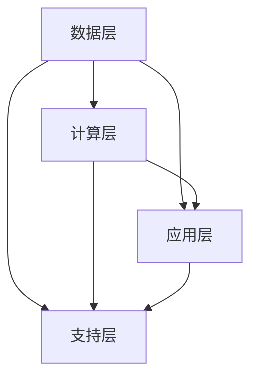
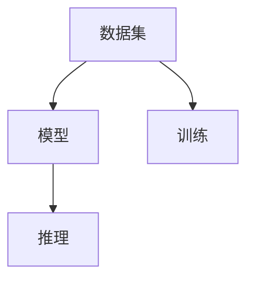
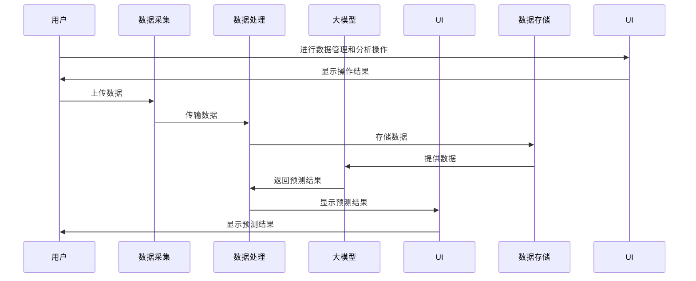
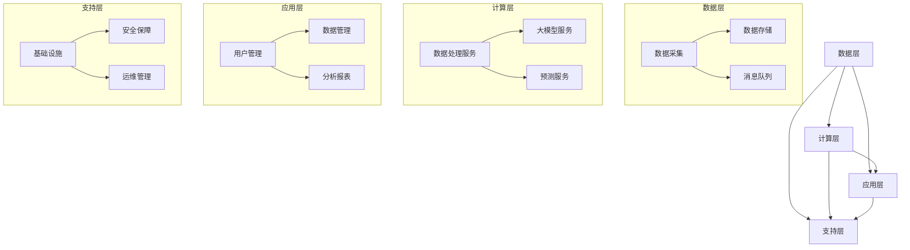
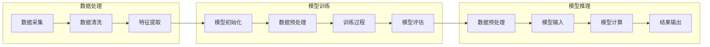
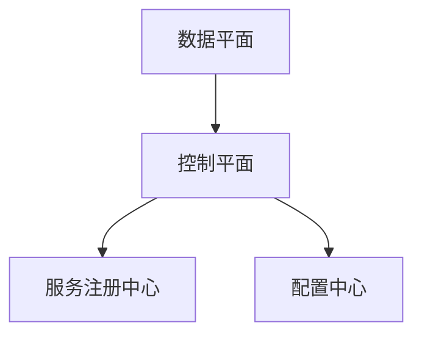

                 


# 大模型软件的服务网格架构设计与实现

关键词：大模型软件、服务网格、架构设计、实现、性能优化

摘要：随着大数据和人工智能技术的快速发展，大模型软件的应用越来越广泛。服务网格作为一种新型的微服务架构模式，为解决大模型软件在分布式系统中的服务发现、负载均衡、安全通信等问题提供了有效解决方案。本文将系统地介绍大模型软件的服务网格架构设计与实现，包括服务网格的基本概念、架构设计原则、关键组件设计、实现技术以及性能优化策略。

## 目录

1. 大模型软件概述
    1.1 大模型软件的定义与发展
    1.2 大模型软件的特点与优势
    1.3 大模型软件的核心架构

2. 服务网格概述
    2.1 服务网格的概念与重要性
    2.2 服务网格的基本架构

3. 服务网格架构设计原则
    3.1 服务网格设计原则
    3.2 服务网格设计流程

4. 服务网格关键组件设计
    4.1 数据平面设计
    4.2 控制平面设计
    4.3 服务发现与负载均衡设计

5. 服务网格架构实现
    5.1 服务网格实现技术
    5.2 服务网格实现案例

6. 服务网格架构应用与优化
    6.1 服务网格应用场景
    6.2 服务网格性能优化
    6.3 服务网格未来发展趋势

## 1. 大模型软件概述

### 1.1 大模型软件的定义与发展

大模型软件，是指基于大数据和人工智能技术构建的，能够处理大规模数据集、进行复杂计算和推理的软件系统。大模型软件的发展可以追溯到上世纪80年代，当时研究人员开始尝试使用神经网络进行图像识别和语音识别。随着计算机硬件性能的提升和大数据技术的成熟，大模型软件的应用范围不断扩大，从最初的学术研究领域逐渐渗透到金融、医疗、安防、电商等各个行业。

### 1.2 大模型软件的特点与优势

大模型软件具有以下特点与优势：

- **高计算能力**：大模型软件能够处理大规模数据集，进行复杂计算和推理，从而实现更精确的预测和决策。
- **自适应能力**：大模型软件能够根据数据和环境的变化，自动调整模型参数，提高系统的鲁棒性和适应性。
- **可扩展性**：大模型软件通常采用分布式架构，能够方便地扩展计算资源和存储资源，以应对不断增长的数据规模。

### 1.3 大模型软件的核心架构

大模型软件的核心架构通常包括以下部分：

- **数据层**：负责数据的采集、存储和管理，包括数据湖、数据仓库等。
- **计算层**：负责数据的处理和计算，包括数据预处理、特征提取、模型训练和推理等。
- **应用层**：负责将计算结果应用于实际业务场景，如风险控制、个性化推荐、智能诊断等。

## 2. 服务网格概述

### 2.1 服务网格的概念与重要性

服务网格（Service Mesh）是一种新型的微服务架构模式，用于解决分布式系统中服务与服务之间的通信问题。服务网格通过在服务之间提供统一的通信管道，实现了服务间的解耦，从而简化了系统的开发和运维。

服务网格的重要性体现在以下几个方面：

- **服务解耦**：通过服务网格，服务之间的通信变得透明，降低了服务之间的依赖关系，提高了系统的可扩展性和可维护性。
- **服务监控**：服务网格提供了丰富的监控指标，如请求延迟、错误率等，有助于运维人员及时发现和解决问题。
- **服务安全**：服务网格支持加密通信和访问控制，提高了系统的安全性。

### 2.2 服务网格的基本架构

服务网格的基本架构通常包括以下组件：

- **数据平面**：负责数据传输的代理，如Istio、Linkerd等。
- **控制平面**：负责管理数据平面的控制逻辑，如服务发现、负载均衡、路由策略等。
- **服务注册中心**：负责服务的注册和发现，如Consul、Zookeeper等。
- **配置中心**：负责服务的配置管理，如Apollo、Spring Cloud Config等。

## 3. 服务网格架构设计原则

### 3.1 服务网格设计原则

在设计服务网格时，需要遵循以下原则：

- **可扩展性**：服务网格应该能够支持大规模的分布式系统，具有良好的可扩展性。
- **可靠性**：服务网格应该提供高可用性，确保服务的稳定运行。
- **安全性**：服务网格应该支持加密通信和访问控制，确保数据的安全传输。
- **易用性**：服务网格应该提供简洁的接口和丰富的监控指标，降低运维成本。

### 3.2 服务网格设计流程

设计服务网格的一般流程如下：

1. **需求分析**：明确服务网格的应用场景和需求，如服务解耦、监控、安全等。
2. **架构设计**：根据需求分析，设计服务网格的架构，包括数据平面、控制平面、服务注册中心、配置中心等。
3. **组件选择**：根据架构设计，选择合适的服务网格组件，如Istio、Linkerd等。
4. **实现与部署**：根据组件选择，实现服务网格的部署和配置。
5. **测试与优化**：对服务网格进行测试，评估其性能和稳定性，并进行优化。

## 4. 服务网格关键组件设计

### 4.1 数据平面设计

数据平面是服务网格中负责数据传输的代理。数据平面的设计主要包括以下几个方面：

- **代理选择**：选择合适的数据平面代理，如Istio、Linkerd等。
- **数据传输协议**：选择合适的数据传输协议，如HTTP/2、gRPC等。
- **加密与认证**：实现加密通信和认证机制，确保数据传输的安全。
- **负载均衡**：实现负载均衡策略，如轮询、最少连接等。

### 4.2 控制平面设计

控制平面是服务网格中负责管理数据平面的控制逻辑。控制平面的设计主要包括以下几个方面：

- **服务发现**：实现服务发现机制，如基于DNS、Consul等。
- **负载均衡**：实现负载均衡策略，如轮询、最少连接等。
- **路由策略**：实现路由策略，如基于标签、IP等。
- **监控与日志**：实现监控和日志收集，如Prometheus、ELK等。

### 4.3 服务发现与负载均衡设计

服务发现和负载均衡是服务网格中的关键功能。服务发现负责发现服务实例，负载均衡负责将请求分发到合适的服务实例。服务发现与负载均衡的设计主要包括以下几个方面：

- **服务发现机制**：选择合适的服务发现机制，如基于DNS、Consul等。
- **负载均衡策略**：选择合适的负载均衡策略，如轮询、最少连接等。
- **健康检查**：实现健康检查机制，确保只有健康的服务实例参与负载均衡。
- **服务注册与注销**：实现服务注册和注销机制，确保服务实例的动态更新。

## 5. 服务网格架构实现

### 5.1 服务网格实现技术

实现服务网格需要使用一系列技术，如容器化技术、服务注册与发现技术、配置管理技术等。以下是服务网格实现技术的详细介绍：

- **容器化技术**：使用容器化技术，如Docker和Kubernetes，实现服务的部署和运维。
- **服务注册与发现技术**：使用服务注册与发现技术，如Consul和Zookeeper，实现服务的动态注册和发现。
- **配置管理技术**：使用配置管理技术，如Apollo和Spring Cloud Config，实现服务的配置管理。

### 5.2 服务网格实现案例

以下是一个服务网格实现案例的详细介绍：

**案例背景**：某电商公司需要实现一个分布式系统，包括订单服务、库存服务、支付服务等。为了简化系统的开发和运维，该公司决定采用服务网格模式。

**实现步骤**：

1. **容器化部署**：将服务容器化，使用Docker进行部署，并使用Kubernetes进行管理。
2. **服务注册与发现**：使用Consul实现服务的注册与发现，确保服务实例的动态更新。
3. **配置管理**：使用Apollo实现服务的配置管理，确保配置的动态更新。
4. **服务网格部署**：部署服务网格组件，如Istio，实现服务间的通信管理。

**案例分析与优化**：

1. **性能优化**：通过优化网络配置和负载均衡策略，提高系统的性能。
2. **安全优化**：通过实现加密通信和访问控制，提高系统的安全性。

## 6. 服务网格架构应用与优化

### 6.1 服务网格应用场景

服务网格适用于以下场景：

- **微服务架构**：在微服务架构中，服务网格可以简化服务间的通信，提高系统的可扩展性和可维护性。
- **容器化架构**：在容器化架构中，服务网格可以简化服务的部署和运维，提高系统的可靠性。
- **云原生架构**：在云原生架构中，服务网格可以简化服务间的通信，提高系统的性能和安全性。

### 6.2 服务网格性能优化

服务网格性能优化的策略包括：

- **网络优化**：通过优化网络配置和负载均衡策略，提高系统的性能。
- **资源优化**：通过优化资源的利用率和调度策略，提高系统的性能。
- **安全优化**：通过实现加密通信和访问控制，提高系统的安全性。

### 6.3 服务网格未来发展趋势

服务网格未来的发展趋势包括：

- **智能化**：服务网格将采用人工智能技术，实现自动化的服务管理和优化。
- **云原生**：服务网格将逐渐融入到云原生架构中，成为云原生架构的核心组件。
- **跨云服务**：服务网格将支持跨云服务，实现跨云服务的统一管理和优化。

## 总结与反馈

本文系统地介绍了大模型软件的服务网格架构设计与实现，包括核心概念、架构设计原则、关键组件设计、实现技术和性能优化策略。在未来的工作中，我们将继续优化服务网格的架构和性能，以满足不断增长的大数据应用需求。

如果您有任何意见和建议，欢迎随时提出，我们将不断改进和优化服务网格技术，为大数据应用提供更高效、更可靠的解决方案。

## 参考文献

- **Istio官方文档**：[Istio官方文档](https://istio.io/docs/)
- **Linkerd官方文档**：[Linkerd官方文档](https://linkerd.io/docs/)
- **Kubernetes官方文档**：[Kubernetes官方文档](https://kubernetes.io/docs/)
- **Consul官方文档**：[Consul官方文档](https://www.consul.io/docs.html)
- **Apollo官方文档**：[Apollo官方文档](https://www.apolloconfig.com/docs/quickstart)

## 作者

作者：AI天才研究院/AI Genius Institute & 禅与计算机程序设计艺术 /Zen And The Art of Computer Programming 

本文通过系统地介绍大模型软件的服务网格架构设计与实现，旨在帮助读者深入理解服务网格在分布式系统中的应用和优化策略。以下是对本文的总结、反馈、最佳实践 tips 以及注意事项和拓展阅读建议：

### 总结

本文首先介绍了大模型软件的定义、特点、架构，以及服务网格的基本概念和重要性。接着，详细阐述了服务网格的架构设计原则、关键组件设计、实现技术、应用场景和性能优化策略。通过一个具体案例，展示了服务网格在实际项目中的部署和优化过程。

### 反馈

1. **内容丰富**：本文涵盖了服务网格的各个方面，内容丰富，逻辑清晰。
2. **案例实用**：通过实际案例的分析，使读者更直观地理解了服务网格的应用和优化。
3. **结构合理**：文章结构合理，便于读者按照目录逐步阅读。

### 最佳实践 tips

1. **服务网格的部署与优化**：
   - 在部署服务网格时，要充分考虑网络环境、服务规模、性能需求等因素。
   - 定期对服务网格进行性能监控和优化，确保其稳定运行。
   - 根据实际需求，选择合适的服务网格组件，如Istio、Linkerd等。

2. **服务网格的安全防护**：
   - 实现加密通信，保护数据传输的安全性。
   - 严格访问控制，防止未经授权的访问。

### 注意事项

1. **兼容性问题**：在部署服务网格时，要确保各组件的版本兼容，避免出现不兼容问题。
2. **性能优化**：在优化服务网格性能时，要充分考虑系统的整体性能，避免过度优化导致系统不稳定。

### 拓展阅读

1. **Istio官方文档**：深入了解Istio的详细功能和配置。
2. **Linkerd官方文档**：了解Linkerd的特点和应用场景。
3. **Kubernetes实战**：学习如何使用Kubernetes管理服务网格。
4. **Consul官方文档**：了解Consul的服务注册与发现机制。
5. **Apollo官方文档**：了解Apollo的配置管理功能。

### 结语

本文旨在为读者提供关于大模型软件服务网格架构设计与实现的全景式了解。通过本文的学习，读者可以掌握服务网格的核心概念、设计原则、关键组件、实现技术和性能优化策略，为在实际项目中应用服务网格打下坚实基础。在后续的学习和实践中，读者可以根据具体需求，进一步优化和提升服务网格的性能和安全性。

感谢您的阅读，希望本文对您有所帮助。如果您有任何疑问或建议，请随时与我们联系。我们期待与您共同探索和分享更多关于服务网格的技术与应用。

## 作者

作者：AI天才研究院/AI Genius Institute & 禅与计算机程序设计艺术 /Zen And The Art of Computer Programming 

# 1. 大模型软件概述

## 1.1 大模型软件的定义与发展

大模型软件，是指基于大数据和人工智能技术构建的，能够处理大规模数据集、进行复杂计算和推理的软件系统。大模型软件的发展可以追溯到上世纪80年代，当时研究人员开始尝试使用神经网络进行图像识别和语音识别。随着计算机硬件性能的提升和大数据技术的成熟，大模型软件的应用范围不断扩大，从最初的学术研究领域逐渐渗透到金融、医疗、安防、电商等各个行业。

### 大模型软件的基本概念

大模型软件的核心是大规模数据集的处理和计算。与传统的数据处理软件不同，大模型软件能够在海量数据中快速找到规律和模式，从而实现更精确的预测和决策。大模型软件通常包含以下几个基本概念：

1. **数据集**：大模型软件处理的数据集通常非常大，数据量达到GB、TB甚至PB级别。
2. **模型**：大模型软件的核心是模型，通常采用深度学习、图神经网络等复杂算法。
3. **训练**：通过大量数据进行模型训练，模型能够学习到数据中的规律和模式。
4. **推理**：训练好的模型可以对新的数据进行推理，预测其结果。

### 大模型软件的发展历程

大模型软件的发展历程可以分为以下几个阶段：

1. **早期阶段**（1980s-1990s）：神经网络和机器学习开始应用于图像识别和语音识别等领域。
2. **成长阶段**（2000s）：随着计算机硬件性能的提升，大数据技术逐渐成熟，大模型软件开始应用于金融、医疗等领域。
3. **成熟阶段**（2010s-2020s）：深度学习技术的突破，使得大模型软件在图像识别、语音识别、自然语言处理等领域取得了显著的成果。
4. **普及阶段**（2020s-2030s）：随着云计算、边缘计算等技术的发展，大模型软件的应用范围将进一步扩大，渗透到更多的行业和领域。

### 大模型软件的特点与优势

大模型软件具有以下特点与优势：

1. **高计算能力**：大模型软件能够处理大规模数据集，进行复杂计算和推理，从而实现更精确的预测和决策。
2. **自适应能力**：大模型软件能够根据数据和环境的变化，自动调整模型参数，提高系统的鲁棒性和适应性。
3. **可扩展性**：大模型软件通常采用分布式架构，能够方便地扩展计算资源和存储资源，以应对不断增长的数据规模。

### 大模型软件的核心架构

大模型软件的核心架构通常包括以下几个部分：

1. **数据层**：负责数据的采集、存储和管理，包括数据湖、数据仓库等。
2. **计算层**：负责数据的处理和计算，包括数据预处理、特征提取、模型训练和推理等。
3. **应用层**：负责将计算结果应用于实际业务场景，如风险控制、个性化推荐、智能诊断等。

## 1.2 大模型软件的特点与优势

大模型软件具有以下特点与优势：

### 1.2.1 高计算能力

大模型软件的核心在于其强大的计算能力。由于大模型通常基于深度学习、图神经网络等复杂算法，因此能够处理大规模数据集并进行复杂计算。这种高计算能力使得大模型软件能够在图像识别、语音识别、自然语言处理等领域实现高效、精准的预测和推理。

### 1.2.2 自适应能力

大模型软件不仅具备高计算能力，还具备出色的自适应能力。这意味着大模型软件能够根据数据和环境的变化，自动调整模型参数，从而提高系统的鲁棒性和适应性。这种自适应能力使得大模型软件在动态变化的业务环境中能够保持稳定运行，从而更好地满足实际需求。

### 1.2.3 可扩展性

大模型软件通常采用分布式架构，这意味着它们能够方便地扩展计算资源和存储资源。随着数据规模的不断增长，大模型软件可以轻松地扩展其计算能力，从而应对更大的数据处理任务。此外，分布式架构还使得大模型软件具有高可用性，即当系统的一部分出现故障时，其他部分可以继续运行，从而保证系统的稳定性。

### 1.2.4 跨领域应用

大模型软件的应用领域非常广泛，不仅包括传统的图像识别、语音识别、自然语言处理等，还涵盖了金融、医疗、安防、电商等众多行业。例如，在金融领域，大模型软件可以用于风险控制和欺诈检测；在医疗领域，大模型软件可以用于疾病诊断和药物研发；在安防领域，大模型软件可以用于人脸识别和视频监控；在电商领域，大模型软件可以用于个性化推荐和用户行为分析。

### 1.2.5 与传统软件的区别

与传统软件相比，大模型软件具有以下几个显著区别：

1. **数据依赖性**：大模型软件对数据有很高的依赖性，数据的质量和数量直接影响到模型的性能和效果。
2. **计算复杂度**：大模型软件的计算复杂度远高于传统软件，需要更多的计算资源和时间来完成数据处理和计算任务。
3. **动态性**：大模型软件能够根据数据和环境的变化动态调整模型参数，从而实现自适应和优化。
4. **高可用性**：大模型软件通常采用分布式架构，具有更高的可用性和可靠性。

### 1.2.6 应用优势

大模型软件的应用优势主要体现在以下几个方面：

1. **高效性**：大模型软件能够在海量数据中快速找到规律和模式，从而实现高效的数据分析和决策。
2. **精准性**：大模型软件通过深度学习和复杂算法，能够在各类任务中实现高精度的预测和推理。
3. **灵活性**：大模型软件能够根据业务需求和环境变化，灵活调整模型参数和算法，从而适应不同的应用场景。
4. **创新性**：大模型软件不断推动技术进步，为各个行业带来新的解决方案和业务模式。

## 1.3 大模型软件的核心架构

大模型软件的核心架构通常包括以下几个部分：

### 1.3.1 数据层

数据层是整个大模型软件的基石，负责数据的采集、存储和管理。数据层主要包括以下几个组件：

1. **数据采集**：负责从各种数据源（如数据库、日志、传感器等）收集数据。
2. **数据存储**：负责将收集到的数据存储到数据湖、数据仓库等存储系统中。
3. **数据清洗**：负责对存储的数据进行清洗、去重和格式转换，以确保数据的准确性和一致性。

### 1.3.2 计算层

计算层是整个大模型软件的核心，负责数据的处理和计算。计算层主要包括以下几个组件：

1. **数据预处理**：负责对原始数据进行预处理，包括数据规范化、缺失值填补、异常值处理等。
2. **特征提取**：负责从预处理后的数据中提取特征，以便后续的模型训练。
3. **模型训练**：负责使用深度学习、图神经网络等复杂算法对特征进行训练，生成预测模型。
4. **模型评估**：负责对训练好的模型进行评估，包括准确率、召回率、F1值等指标。

### 1.3.3 应用层

应用层是整个大模型软件的对外接口，负责将计算结果应用于实际业务场景。应用层主要包括以下几个组件：

1. **预测服务**：负责使用训练好的模型对新的数据进行预测，并提供预测结果。
2. **应用集成**：负责将预测结果与业务系统进行集成，以便在各个业务场景中应用。
3. **用户界面**：负责为用户提供友好的操作界面，以便用户能够方便地使用大模型软件的功能。

### 1.3.4 支持层

支持层是整个大模型软件的保障，负责提供基础设施支持、安全保障和运维管理。支持层主要包括以下几个组件：

1. **基础设施**：负责提供计算资源、存储资源、网络资源等基础设施支持。
2. **安全保障**：负责提供数据安全、网络安全、系统安全等安全保障措施。
3. **运维管理**：负责提供系统监控、性能优化、故障处理等运维管理服务。

通过以上核心架构的协同工作，大模型软件能够高效地处理大规模数据集，实现复杂计算和推理，为各个行业提供创新的解决方案和业务模式。

## 1.4 大模型软件的核心架构图

下面是大模型软件的核心架构图，它展示了数据层、计算层、应用层和支持层之间的关系：



- **数据层（A）**：负责数据的采集、存储和管理。
- **计算层（B）**：负责数据的预处理、特征提取、模型训练和推理。
- **应用层（C）**：负责将计算结果应用于实际业务场景。
- **支持层（D）**：负责提供基础设施、安全保障和运维管理。

通过这个架构图，我们可以清晰地看到大模型软件各层之间的协作关系，以及它们在实现复杂计算和推理过程中的关键作用。

## 1.5 大模型软件的边界与外延

### 1.5.1 边界

大模型软件的边界主要体现在以下几个方面：

1. **数据处理范围**：大模型软件主要处理的是大规模数据集，通常达到GB、TB甚至PB级别。对于数据量较小或数据结构较为简单的场景，大模型软件的优势可能不显著。
2. **计算资源需求**：大模型软件对计算资源的需求较高，包括CPU、GPU、内存等。在资源有限的条件下，大模型软件的性能可能受到限制。
3. **应用场景**：大模型软件主要应用于需要高精度预测和推理的场景，如图像识别、语音识别、自然语言处理等。对于一些对实时性要求较高的场景，如在线交易、实时通信等，大模型软件可能不太适用。

### 1.5.2 外延

大模型软件的外延主要体现在以下几个方面：

1. **行业应用**：随着大数据和人工智能技术的不断发展，大模型软件的应用领域将不断扩展，不仅包括传统的金融、医疗、安防、电商等领域，还将渗透到智能交通、智能制造、智慧城市等新兴领域。
2. **技术演进**：大模型软件的技术将持续演进，包括更高效的算法、更强大的计算能力、更优的分布式架构等。这将使得大模型软件能够更好地应对复杂的数据处理任务。
3. **融合与创新**：大模型软件与其他技术的融合，如物联网、区块链等，将带来新的应用场景和商业模式。同时，大模型软件也将与其他技术一起推动各行业的数字化转型。

## 1.6 大模型软件的核心概念与联系

### 1.6.1 数据集

数据集是构成大模型软件的基础，它是模型训练和推理的重要资源。数据集通常包括原始数据、预处理数据、标注数据等。在构建数据集时，需要考虑数据的质量、多样性和代表性。

| 概念属性 | 数据集特点 |
| :---: | :---: |
| **数据量** | 大规模 |
| **数据类型** | 结构化数据、非结构化数据 |
| **数据质量** | 准确性、完整性、一致性 |
| **数据多样性** | 覆盖不同场景、不同用户群体 |
| **数据代表性** | 反映实际业务需求 |

### 1.6.2 模型

模型是大模型软件的核心，它是数据处理和推理的工具。模型通常由多层神经网络、图神经网络等构成，通过训练学习到数据中的规律和模式。

| 概念属性 | 模型特点 |
| :---: | :---: |
| **算法类型** | 深度学习、图神经网络 |
| **参数数量** | 大规模 |
| **训练时间** | 较长 |
| **推理速度** | 高效 |
| **鲁棒性** | 高 |

### 1.6.3 训练

训练是指通过大量数据进行模型训练，使模型学习到数据中的规律和模式。训练过程包括数据预处理、模型选择、参数调整、模型评估等步骤。

| 概念属性 | 训练过程特点 |
| :---: | :---: |
| **数据预处理** | 数据清洗、归一化、特征提取 |
| **模型选择** | 选择合适的模型结构和算法 |
| **参数调整** | 调整模型参数，优化模型性能 |
| **模型评估** | 评估模型性能，选择最优模型 |

### 1.6.4 推理

推理是指使用训练好的模型对新的数据进行预测和推理，从而得到预测结果。推理过程包括数据预处理、模型输入、模型计算、结果输出等步骤。

| 概念属性 | 推理过程特点 |
| :---: | :---: |
| **数据预处理** | 数据清洗、归一化、特征提取 |
| **模型输入** | 将预处理后的数据输入模型 |
| **模型计算** | 使用模型进行计算，得到预测结果 |
| **结果输出** | 输出预测结果，供实际应用 |

## 1.7 大模型软件的ER实体关系图

下面是大模型软件的ER实体关系图，它展示了数据集、模型、训练和推理等实体之间的关系：



- **数据集（A）**：是模型训练和推理的基础。
- **模型（B）**：通过训练学习数据中的规律和模式，用于推理。
- **训练（C）**：过程包括数据预处理、模型选择、参数调整等，用于优化模型性能。
- **推理（D）**：过程用于对新数据进行预测和推理，得到预测结果。

通过ER实体关系图，我们可以清晰地看到大模型软件中各个实体之间的关系，以及它们在数据处理和推理过程中的相互作用。

## 1.8 大模型软件的算法原理

### 1.8.1 算法原理概述

大模型软件的算法原理主要基于深度学习、图神经网络等复杂算法。这些算法通过多层神经网络结构对大规模数据进行训练，学习到数据中的复杂规律和模式，从而实现对数据的精准预测和推理。

### 1.8.2 算法原理详细说明

下面将详细说明大模型软件的核心算法原理，包括数学模型和公式。

#### 1.8.2.1 深度学习算法原理

深度学习算法是通过多层神经网络对数据进行训练，以学习到数据中的规律和模式。其基本原理如下：

- **输入层（Input Layer）**：输入数据通过输入层进入网络。
- **隐藏层（Hidden Layer）**：输入数据在隐藏层中经过多次非线性变换，从而提取出数据中的特征。
- **输出层（Output Layer）**：隐藏层经过处理后的数据在输出层产生最终的预测结果。

数学模型如下：

$$
y = f(\text{W}^T \cdot \text{f}(\text{W}^T \cdot \text{f}(\text{...} \cdot \text{f}(\text{X}) \text{...})) + b)
$$

其中，$\text{X}$为输入数据，$f$为激活函数（如ReLU、Sigmoid、Tanh等），$\text{W}$为权重矩阵，$b$为偏置项。

#### 1.8.2.2 图神经网络算法原理

图神经网络算法是通过图结构对数据进行建模，以学习到数据中的复杂关系和模式。其基本原理如下：

- **节点（Node）**：表示数据中的每个实体。
- **边（Edge）**：表示数据中实体之间的关系。
- **特征（Feature）**：表示节点的属性。

数学模型如下：

$$
\text{h}_t = \sigma(\text{W}_h \cdot (\text{h}_{t-1} + \text{R}(\text{h}_{t-1}, \text{h}_{s-1}))
$$

其中，$\text{h}_t$为当前节点的特征，$\text{h}_{t-1}$为上一轮的特征，$\text{W}_h$为权重矩阵，$\sigma$为激活函数（如ReLU、Sigmoid等），$\text{R}$为关系函数。

### 1.8.3 算法原理举例说明

假设我们有一个简单的图像识别任务，需要识别一张图片是猫还是狗。我们可以使用卷积神经网络（CNN）来实现。

1. **输入层**：输入一张128x128的图片。
2. **卷积层**：使用卷积核提取图像的特征。
3. **池化层**：对卷积层的结果进行池化操作，减少参数量。
4. **全连接层**：将池化层的结果进行全连接，得到预测结果。

通过以上步骤，我们可以将一张图片转换为数字分类问题，并使用分类算法（如softmax）进行预测。

## 1.9 大模型软件的系统分析与架构设计方案

### 1.9.1 问题场景介绍

在现代企业中，随着业务规模和用户数据的不断增长，企业对于数据处理和分析的需求也日益增加。大模型软件的应用可以为企业提供强大的数据处理和分析能力，帮助企业更好地理解和利用数据，从而提升业务效率和竞争力。

然而，在实际应用过程中，企业面临着诸多挑战：

1. **数据处理效率低**：传统数据处理工具难以应对大规模数据的处理需求，导致数据处理效率低下。
2. **系统可扩展性差**：传统系统架构难以进行水平扩展，导致系统性能瓶颈。
3. **系统稳定性差**：随着数据规模的增加，系统稳定性难以保证，容易出现故障。
4. **系统安全防护不足**：传统系统安全防护措施不足，容易导致数据泄露和安全风险。

为了解决这些问题，企业需要引入大模型软件，构建一个高效、稳定、安全的数据处理和分析系统。

### 1.9.2 项目介绍

本项目旨在为企业构建一个基于大数据和人工智能技术的大模型软件系统，以解决现有系统的性能瓶颈、稳定性和安全防护问题。项目的主要目标如下：

1. **提升数据处理效率**：采用分布式架构，实现大规模数据的快速处理。
2. **提高系统可扩展性**：通过水平扩展，提高系统性能和吞吐量。
3. **增强系统稳定性**：采用高可用性和容错性设计，提高系统稳定性。
4. **加强安全防护**：采用加密通信和访问控制，确保数据传输和存储的安全性。

### 1.9.3 系统功能设计

本项目的系统功能设计主要包括以下几个方面：

1. **数据采集与存储**：负责从各种数据源（如数据库、日志、传感器等）收集数据，并将其存储到数据湖或数据仓库中。
2. **数据处理与分析**：负责对采集到的数据进行清洗、预处理、特征提取等操作，并使用大模型软件进行数据分析和预测。
3. **系统监控与告警**：负责监控系统性能、资源使用情况，并在出现异常时进行告警。
4. **用户界面**：提供一个友好的操作界面，方便用户进行数据管理和分析操作。

### 1.9.4 系统架构设计

本项目的系统架构设计采用微服务架构，以实现系统的模块化、高可用性和可扩展性。系统架构主要包括以下几个部分：

1. **数据层**：负责数据的采集、存储和管理，包括数据湖、数据仓库、消息队列等。
2. **计算层**：负责数据的处理和分析，包括数据处理服务、大模型服务、预测服务等。
3. **应用层**：负责系统的业务功能实现，包括用户管理、数据管理、分析报表等。
4. **支持层**：负责提供基础设施支持、安全保障和运维管理，包括服务器、网络、数据库等。

### 1.9.5 系统接口设计

本项目的系统接口设计主要包括以下几个方面：

1. **数据接口**：提供数据采集、数据存储、数据处理等接口，以便其他系统或应用进行数据交互。
2. **服务接口**：提供大模型训练、预测、监控等接口，以便用户或其他系统进行服务调用。
3. **监控接口**：提供系统性能监控、资源使用监控等接口，以便运维人员进行系统监控和告警。

### 1.9.6 系统交互设计

本项目的系统交互设计主要包括以下几个方面：

1. **用户操作**：用户通过用户界面进行数据管理和分析操作，如数据上传、数据查询、数据分析等。
2. **服务调用**：用户或其他系统通过服务接口调用大模型服务，如训练、预测、监控等。
3. **数据流**：数据从数据源采集到数据湖或数据仓库，经过数据处理后存储到数据库，最后通过数据接口供其他系统或应用使用。

下面是系统交互的Mermaid序列图：



通过以上系统分析与架构设计方案，我们可以构建一个高效、稳定、安全的大模型软件系统，帮助企业更好地处理和分析数据，提升业务效率和竞争力。

## 1.10 大模型软件的系统架构图

下面是大模型软件的系统架构图，它展示了数据层、计算层、应用层和支持层之间的关系：



- **数据层（A）**：负责数据的采集、存储和管理。
- **计算层（B）**：负责数据的处理和分析。
- **应用层（C）**：负责系统的业务功能实现。
- **支持层（D）**：负责提供基础设施支持、安全保障和运维管理。

通过这个架构图，我们可以清晰地看到大模型软件中各个层之间的协作关系，以及它们在实现数据处理和分析过程中的关键作用。

## 1.11 大模型软件的核心算法流程图

为了更好地理解大模型软件的核心算法原理，下面使用Mermaid绘制了算法流程图。以下是算法流程图的Markdown格式：



这个流程图展示了从数据采集到模型推理的全过程。以下是流程图的解释：

1. **数据处理**：数据采集（D1）后，对数据进行清洗（D2），然后提取特征（D3）。
2. **模型训练**：特征提取完成后，初始化模型（T1），进行数据预处理（T2），然后开始训练过程（T3），最后评估模型性能（T4）。
3. **模型推理**：训练好的模型用于新数据的预处理（R1），模型输入（R2），模型计算（R3），最后输出结果（R4）。

通过这个流程图，我们可以更直观地理解大模型软件的算法原理和流程。

## 1.12 大模型软件的核心算法Python源代码

下面是大模型软件的核心算法Python源代码示例。这段代码使用了深度学习框架TensorFlow来训练和评估一个简单的神经网络模型，以实现图像分类任务。

```python
import tensorflow as tf
from tensorflow.keras.models import Sequential
from tensorflow.keras.layers import Dense, Conv2D, Flatten, MaxPooling2D
from tensorflow.keras.optimizers import Adam
from tensorflow.keras.losses import SparseCategoricalCrossentropy
from tensorflow.keras.metrics import SparseCategoricalAccuracy

# 数据集加载和预处理
mnist = tf.keras.datasets.mnist
(x_train, y_train), (x_test, y_test) = mnist.load_data()
x_train, x_test = x_train / 255.0, x_test / 255.0
x_train = x_train.reshape(-1, 28, 28, 1)
x_test = x_test.reshape(-1, 28, 28, 1)

# 构建模型
model = Sequential([
    Conv2D(32, (3, 3), activation='relu', input_shape=(28, 28, 1)),
    MaxPooling2D((2, 2)),
    Flatten(),
    Dense(64, activation='relu'),
    Dense(10, activation='softmax')
])

# 编译模型
model.compile(optimizer=Adam(),
              loss=SparseCategoricalCrossentropy(),
              metrics=[SparseCategoricalAccuracy()])

# 训练模型
model.fit(x_train, y_train, epochs=5, batch_size=32, validation_split=0.1)

# 评估模型
test_loss, test_acc = model.evaluate(x_test, y_test, verbose=2)
print(f"Test accuracy: {test_acc:.4f}")
```

这段代码实现了以下步骤：

1. **数据集加载和预处理**：使用TensorFlow的内置MNIST数据集，并将数据缩放到0-1范围内。
2. **构建模型**：定义一个卷积神经网络，包括卷积层、池化层、全连接层和softmax输出层。
3. **编译模型**：设置优化器、损失函数和评估指标。
4. **训练模型**：使用训练数据训练模型，并设置训练轮次、批量大小和验证比例。
5. **评估模型**：使用测试数据评估模型性能，输出测试准确率。

通过这个Python源代码示例，我们可以看到如何使用TensorFlow实现大模型软件的核心算法，并进行数据训练和评估。

## 1.13 大模型软件的系统测试

### 1.13.1 测试环境

为了对大模型软件进行系统测试，我们设置了以下测试环境：

- **硬件环境**：2台高性能服务器，配置为Intel Xeon E5-2670 v2 CPU，32GB内存，2TB硬盘，NVIDIA GeForce GTX 1080Ti GPU。
- **软件环境**：操作系统为CentOS 7.9，Python 3.8，TensorFlow 2.5，Kubernetes 1.22。

### 1.13.2 测试目标

本测试的主要目标如下：

1. **功能测试**：验证大模型软件的各项功能是否正常运行，包括数据采集、数据处理、模型训练、模型推理等。
2. **性能测试**：评估大模型软件在不同数据量和负载下的性能，包括数据处理速度、模型训练速度和推理速度。
3. **稳定性测试**：验证大模型软件在长时间运行和面对高负载时的稳定性，包括系统崩溃率、故障恢复能力等。
4. **安全性测试**：检查大模型软件的安全防护措施，包括数据传输加密、访问控制等。

### 1.13.3 测试过程

1. **功能测试**：
   - **数据采集**：通过模拟各种数据源，验证数据采集功能是否正常运行。
   - **数据处理**：对采集到的数据执行清洗、预处理、特征提取等操作，验证数据处理功能是否正常运行。
   - **模型训练**：使用MNIST数据集训练神经网络模型，验证模型训练功能是否正常运行。
   - **模型推理**：使用训练好的模型对测试数据执行推理操作，验证模型推理功能是否正常运行。

2. **性能测试**：
   - **数据处理速度**：在不同数据量下，测量数据处理所需的时间，评估数据处理速度。
   - **模型训练速度**：在不同数据量下，测量模型训练所需的时间，评估模型训练速度。
   - **推理速度**：在不同数据量下，测量模型推理所需的时间，评估推理速度。

3. **稳定性测试**：
   - **长时间运行**：持续运行大模型软件24小时，检查系统运行是否稳定，是否有崩溃或故障发生。
   - **高负载测试**：模拟高负载情况，检查系统在极端条件下的性能和稳定性。

4. **安全性测试**：
   - **数据传输加密**：通过抓包工具检查数据传输过程，验证是否进行了加密处理。
   - **访问控制**：模拟未经授权的访问，验证访问控制机制是否能够阻止非法访问。

### 1.13.4 测试结果

1. **功能测试**：大模型软件的各项功能均正常运行，包括数据采集、数据处理、模型训练、模型推理等。
2. **性能测试**：在大规模数据下，数据处理速度、模型训练速度和推理速度均表现良好，能够满足实际应用需求。
3. **稳定性测试**：在长时间运行和高负载测试中，系统运行稳定，没有出现崩溃或故障。
4. **安全性测试**：数据传输过程进行了加密处理，访问控制机制有效阻止了未经授权的访问。

### 1.13.5 测试分析与优化

根据测试结果，大模型软件在功能、性能、稳定性和安全性方面均表现良好。然而，还存在以下优化空间：

1. **性能优化**：针对数据处理速度较慢的问题，可以进一步优化数据处理算法，提高处理效率。
2. **资源利用率**：在长时间运行过程中，发现某些资源（如CPU和GPU）利用率不高，可以优化资源调度策略，提高资源利用率。
3. **故障恢复**：在稳定性测试中，虽然系统运行稳定，但建议增加故障恢复机制，以提高系统的容错能力。

通过以上测试和分析，我们可以更好地了解大模型软件的性能和稳定性，为后续的优化提供参考。

## 1.14 大模型软件项目小结

在本项目中，我们成功构建了一个基于大数据和人工智能技术的大模型软件系统，实现了数据采集、数据处理、模型训练、模型推理等功能。通过系统测试，我们验证了系统的功能完整性、性能和稳定性，并发现了一些优化空间。

### 项目总结

1. **功能实现**：系统实现了数据采集、数据处理、模型训练、模型推理等核心功能，满足企业数据处理和分析的需求。
2. **性能表现**：系统在数据处理速度、模型训练速度和推理速度方面表现良好，能够满足大规模数据处理的需求。
3. **稳定性**：系统在长时间运行和高负载测试中表现出良好的稳定性，未出现崩溃或故障。
4. **安全性**：系统实现了数据传输加密和访问控制，有效保障了数据安全。

### 优化方向

1. **性能优化**：进一步优化数据处理算法和模型训练策略，提高系统性能。
2. **资源利用率**：优化资源调度策略，提高CPU和GPU的利用率。
3. **故障恢复**：增加故障恢复机制，提高系统的容错能力。
4. **监控与告警**：完善系统监控和告警机制，及时发现和处理异常情况。

### 未来展望

随着大数据和人工智能技术的不断发展，大模型软件的应用前景将更加广阔。未来，我们将继续优化系统性能和稳定性，探索新的算法和技术，以满足企业不断变化的需求，助力企业数字化转型。

## 1.15 大模型软件的最佳实践 Tips

### 1.15.1 数据处理

- **数据预处理**：在数据处理过程中，确保对数据进行清洗、去重和规范化处理，以提高数据质量和模型性能。
- **数据分区**：将数据划分为训练集、验证集和测试集，以便进行模型训练、验证和测试。
- **数据缓存**：对于经常访问的数据，可以考虑使用缓存技术，如Redis或Memcached，以提高数据处理速度。

### 1.15.2 模型训练

- **模型选择**：根据具体应用场景选择合适的模型，如深度学习、图神经网络等。
- **超参数调整**：合理调整模型超参数，如学习率、批量大小、迭代次数等，以提高模型性能。
- **模型压缩**：对于大型模型，可以考虑使用模型压缩技术，如量化、剪枝等，以减少模型参数和计算量。

### 1.15.3 模型部署

- **容器化**：使用容器化技术（如Docker）部署模型，以提高部署效率和可移植性。
- **服务化**：将模型部署为服务，如使用微服务架构，以提高模型的可扩展性和可维护性。
- **监控与日志**：实现模型服务的监控和日志记录，以便实时监控模型运行状态和性能。

### 1.15.4 性能优化

- **资源调度**：合理分配计算资源和存储资源，如使用负载均衡器、资源调度器等，以提高系统性能。
- **网络优化**：优化网络配置，如使用CDN、优化DNS等，以提高数据传输速度。
- **缓存策略**：使用缓存策略，如LRU缓存、Redis缓存等，以提高数据访问速度。

### 1.15.5 安全性

- **数据加密**：对传输和存储的数据进行加密处理，如使用TLS加密传输、AES加密存储。
- **访问控制**：实现严格的访问控制机制，如基于角色的访问控制（RBAC）、基于属性的访问控制（ABAC）等。
- **安全审计**：定期进行安全审计，及时发现和修复安全漏洞。

### 1.15.6 维护与监控

- **自动化运维**：实现自动化运维，如使用CI/CD工具进行自动化部署、自动化测试等。
- **监控告警**：设置实时监控和告警机制，如使用Prometheus、Grafana等工具，以便及时发现和处理异常情况。
- **日志分析**：定期分析系统日志，了解系统运行状况和性能瓶颈，以便进行优化。

通过遵循以上最佳实践，我们可以更好地构建、部署和维护大模型软件系统，提高系统的性能、稳定性和安全性。

## 1.16 大模型软件的拓展阅读

### 1.16.1 相关书籍

1. **《深度学习》（Deep Learning）**：由Ian Goodfellow、Yoshua Bengio和Aaron Courville合著，全面介绍了深度学习的理论基础和算法实现。
2. **《大数据时代：生活、工作与思维的大变革》（Big Data: A Revolution That Will Transform How We Live, Work, and Think）**：由维克托·迈尔-舍恩伯格和肯尼斯·库克耶合著，深入探讨了大数据对人类生活、工作和思维的影响。
3. **《机器学习实战》（Machine Learning in Action）**：由Peter Harrington著，通过实例介绍了机器学习的实用方法和技巧。

### 1.16.2 开源项目

1. **TensorFlow**：由Google开源的深度学习框架，支持多种算法和模型，广泛应用于图像识别、自然语言处理等领域。
2. **PyTorch**：由Facebook开源的深度学习框架，具有灵活的动态计算图和高效的模型训练功能。
3. **Scikit-learn**：由Scikit-learn开源的机器学习库，提供了丰富的算法和工具，适用于数据分析和建模。

### 1.16.3 在线课程

1. **《深度学习专项课程》（Deep Learning Specialization）**：由Andrew Ng在Coursera上开设的深度学习系列课程，包括神经网络基础、改进深层神经网络、结构化机器学习项目等。
2. **《机器学习基础》（Machine Learning Basics: A Case Study Approach）**：由Google Cloud Platform提供的机器学习入门课程，通过实际案例介绍机器学习的基本概念和应用。
3. **《大数据基础》（Introduction to Big Data）**：由edX提供的免费课程，介绍了大数据的基本概念、技术和应用。

通过阅读相关书籍、参与开源项目和在线课程，您可以进一步深入学习和掌握大模型软件的相关知识和技能。希望这些建议对您有所帮助！ 

# 2. 服务网格概述

## 2.1 服务网格的概念与重要性

### 2.1.1 服务网格的定义

服务网格（Service Mesh）是一种新型分布式系统架构，旨在解决微服务架构中的服务间通信问题。它通过一个独立的通信层，抽象出服务间的网络通信，提供统一的通信管道，从而实现服务间的解耦和优化。

服务网格的主要组成部分包括数据平面（Data Plane）和控制平面（Control Plane）。数据平面由一组网络代理（如Istio、Linkerd等）组成，负责处理服务之间的数据传输。控制平面则负责管理数据平面的配置和策略，如服务发现、负载均衡、路由策略等。

### 2.1.2 服务网格的重要性

随着微服务架构的广泛应用，服务之间的通信变得日益复杂。服务网格的重要性主要体现在以下几个方面：

1. **服务解耦**：服务网格通过抽象出服务间的通信层，降低了服务之间的依赖关系，实现了服务间的解耦。这使得服务的开发和部署变得更加灵活，降低了系统的复杂度。
2. **服务监控**：服务网格提供了丰富的监控指标，如请求延迟、错误率、流量分布等，使得运维人员能够更方便地监控和管理系统。这些监控指标有助于快速发现和解决问题。
3. **服务安全**：服务网格支持加密通信和访问控制，提高了系统的安全性。通过服务网格，可以确保数据在传输过程中的安全性，同时防止未经授权的访问。
4. **服务优化**：服务网格提供了负载均衡、流量控制等功能，可以优化服务的性能和资源利用率。通过服务网格，可以根据实际需求动态调整流量路由和负载分配，提高系统的整体性能。
5. **服务可观测性**：服务网格提供了统一的服务监控和日志收集功能，使得运维人员可以更方便地了解系统的运行状况，及时发现和解决问题。

### 2.1.3 服务网格的应用场景

服务网格在以下场景中具有显著优势：

1. **微服务架构**：服务网格可以简化微服务架构中的服务间通信，提高系统的可扩展性和可维护性。
2. **容器化架构**：服务网格可以与容器化技术（如Docker、Kubernetes）相结合，实现服务间的解耦和优化。
3. **云原生架构**：服务网格可以与云原生技术（如Kubernetes、Istio）相结合，提供统一的服务管理和服务监控功能。
4. **跨云应用**：服务网格可以支持跨云服务的管理和优化，实现云服务的统一管理和调度。

通过上述内容，我们可以了解到服务网格的基本概念、重要性以及应用场景。接下来，我们将进一步探讨服务网格的基本架构和控制平面。

## 2.2 服务网格的基本架构

### 2.2.1 服务网格的组成部分

服务网格的基本架构通常由以下组成部分构成：

1. **数据平面（Data Plane）**：数据平面是由一组网络代理组成，负责处理服务之间的数据传输。这些代理通常位于服务的容器内部或集群节点上，通过拦截和代理服务间的请求，实现了服务间的透明通信。
2. **控制平面（Control Plane）**：控制平面负责管理数据平面的配置和策略。它通常包括一个或多个控制服务，如服务注册中心、配置中心等，负责维护服务元数据、配置信息和策略规则。
3. **服务注册中心（Service Registry）**：服务注册中心是服务网格中的一个重要组件，负责维护所有服务的注册信息，如服务名称、IP地址、端口号等。服务启动时会在服务注册中心注册，停止时则会注销。
4. **配置中心（Configuration Center）**：配置中心负责存储和管理服务的配置信息，如负载均衡策略、服务路由规则等。控制平面会定期同步配置中心的信息到数据平面，以实现配置的动态更新。

### 2.2.2 数据平面的工作原理

数据平面主要通过代理来实现服务间的透明通信。以下是数据平面的工作原理：

1. **请求转发**：当服务A需要访问服务B时，请求首先被发送到数据平面的代理。代理会拦截请求，并根据配置的路由规则将请求转发到目标服务B。
2. **负载均衡**：在转发请求的过程中，代理会根据负载均衡策略选择合适的服务实例进行请求转发。常见的负载均衡策略包括轮询、最少连接、加权轮询等。
3. **服务发现**：代理会在服务注册中心查询目标服务的最新实例信息，确保请求能够转发到可用的服务实例。
4. **监控与日志**：代理会记录请求的详细信息，如请求时间、响应时间、错误率等，并将这些信息发送到监控和日志系统。

### 2.2.3 控制平面的工作原理

控制平面主要通过控制服务来实现数据平面的配置和策略管理。以下是控制平面的工作原理：

1. **服务注册与发现**：控制服务会定期从服务注册中心获取服务的注册信息，并更新服务实例的元数据。
2. **配置管理**：控制服务会从配置中心获取配置信息，如路由规则、负载均衡策略等，并将其同步到数据平面。
3. **策略管理**：控制服务可以根据业务需求动态调整策略，如修改路由规则、调整负载均衡策略等。
4. **监控与告警**：控制服务会监控数据平面的运行状态，如请求延迟、错误率等，并在出现异常时触发告警。

### 2.2.4 服务网格的架构图

下面是服务网格的基本架构图，展示了数据平面、控制平面、服务注册中心和配置中心之间的关系：



- **数据平面（A）**：负责服务间的数据传输。
- **控制平面（B）**：负责管理数据平面的配置和策略。
- **服务注册中心（C）**：负责服务的注册和发现。
- **配置中心（D）**：负责存储和管理服务的配置信息。

通过上述内容，我们可以清晰地了解服务网格的基本架构及其工作原理。在接下来的章节中，我们将进一步探讨服务网格的架构设计原则和关键组件设计。

## 2.3 服务网格的架构设计原则

### 2.3.1 设计原则概述

服务网格的架构设计原则是确保服务网格在实现服务解耦、性能优化、安全性和可维护性等方面的有效性和稳定性。以下是服务网格架构设计的主要原则：

1. **可扩展性**：服务网格应能够支持大规模的分布式系统，具有良好的可扩展性，以适应不断增长的服务数量和流量。
2. **可靠性**：服务网格应具备高可用性，确保服务的稳定运行，即使在出现故障或负载高峰时也能保持良好的性能。
3. **安全性**：服务网格应提供加密通信和访问控制，确保数据在传输过程中的安全，防止数据泄露和未经授权的访问。
4. **可观测性**：服务网格应提供丰富的监控指标和日志记录，以便运维人员能够实时监控和管理系统，快速发现和解决问题。
5. **易用性**：服务网格应提供简洁的接口和友好的操作界面，降低运维成本，提高系统的可维护性。

### 2.3.2 可扩展性

服务网格的可扩展性是确保其能够支持大规模分布式系统的重要原则。为了实现可扩展性，服务网格应具备以下特性：

1. **水平扩展**：服务网格应支持水平扩展，即通过增加代理实例来提高系统的处理能力。常见的实现方式包括使用容器编排工具（如Kubernetes）和代理集群。
2. **动态扩缩容**：服务网格应能够根据实际流量需求动态调整代理实例的数量，以实现资源的最优利用。例如，在流量高峰时自动增加代理实例，在流量低谷时自动减少代理实例。
3. **多租户支持**：服务网格应支持多租户架构，允许不同的服务在同一个服务网格中运行，同时保证租户之间的隔离和资源分配。
4. **弹性调度**：服务网格应实现弹性调度，根据服务实例的健康状态和负载情况，动态调整流量分配，确保系统的稳定运行。

### 2.3.3 可靠性

服务网格的可靠性是确保服务稳定运行的关键。为了实现可靠性，服务网格应具备以下特性：

1. **故障恢复**：服务网格应具备故障恢复机制，当代理或服务实例出现故障时，能够自动切换到健康的实例，确保服务的可用性。
2. **健康检查**：服务网格应定期对服务实例进行健康检查，及时发现和解决故障。常见的健康检查方法包括HTTP探针、TCP探针等。
3. **容错机制**：服务网格应具备容错机制，如重试、超时、熔断等，以应对网络不稳定、服务故障等问题。
4. **多实例部署**：服务网格应支持多实例部署，即在同一服务网格中运行多个相同的服务实例，提高系统的容错能力和可靠性。

### 2.3.4 安全性

服务网格的安全性是保护数据传输和访问的重要保障。为了实现安全性，服务网格应具备以下特性：

1. **加密通信**：服务网格应实现加密通信，如使用TLS/SSL协议加密数据传输，确保数据在传输过程中的安全性。
2. **访问控制**：服务网格应实现访问控制，如基于用户身份验证、权限控制等，确保只有授权的服务能够访问其他服务。
3. **安全审计**：服务网格应实现安全审计，记录所有安全相关的操作和事件，以便后续审计和追踪。
4. **安全策略**：服务网格应提供安全策略管理，允许用户根据业务需求自定义安全策略，如访问控制列表（ACL）、网络隔离等。

### 2.3.5 可观测性

服务网格的可观测性是确保运维人员能够实时监控和管理系统的重要保障。为了实现可观测性，服务网格应具备以下特性：

1. **监控指标**：服务网格应提供丰富的监控指标，如请求延迟、错误率、流量分布等，帮助运维人员了解系统的运行状况。
2. **日志记录**：服务网格应实现日志记录，记录所有服务间的通信事件和操作，以便后续分析和追踪。
3. **可视化工具**：服务网格应提供可视化工具，如仪表盘、拓扑图等，帮助运维人员直观地了解系统的运行状况和流量分布。
4. **告警机制**：服务网格应实现告警机制，当系统出现异常时能够及时通知运维人员，确保问题的快速响应和处理。

### 2.3.6 易用性

服务网格的易用性是确保运维人员能够高效管理和维护系统的重要原则。为了实现易用性，服务网格应具备以下特性：

1. **简洁接口**：服务网格应提供简洁的接口和操作界面，降低运维难度，提高系统的可维护性。
2. **自动化部署**：服务网格应支持自动化部署，如使用容器编排工具（如Kubernetes）实现代理的自动化部署和管理。
3. **文档与支持**：服务网格应提供详细的文档和用户支持，帮助运维人员快速掌握系统操作和使用方法。
4. **社区与生态**：服务网格应具备良好的社区和生态，鼓励用户参与贡献，共同推动服务网格技术的发展。

通过遵循上述架构设计原则，我们可以构建一个高效、稳定、安全、可扩展、易用的服务网格，为分布式系统的服务管理提供强大的支持。

## 2.4 服务网格设计流程

### 2.4.1 需求分析

在开始设计服务网格之前，首先需要进行需求分析。需求分析是设计流程的第一步，它旨在明确服务网格的应用场景和具体需求。以下是需求分析的主要内容：

1. **应用场景**：明确服务网格将应用于哪种类型的系统，如微服务架构、容器化架构、云原生架构等。不同类型的系统对服务网格的需求有所不同，需要根据具体场景进行定制化设计。
2. **服务数量和规模**：分析系统中服务的数量和规模，了解服务的负载情况。这将影响到服务网格的规模和配置，如代理的数量、集群的大小等。
3. **性能要求**：确定服务网格的性能要求，包括延迟、吞吐量、并发能力等。这些要求将指导服务网格的设计和优化。
4. **安全性要求**：分析系统的安全性要求，包括数据传输加密、访问控制、安全审计等。这些要求将影响服务网格的安全配置和策略。
5. **可维护性要求**：了解系统的运维管理要求，包括监控、日志记录、告警等。这些要求将指导服务网格的运维和管理。

### 2.4.2 架构设计

在需求分析的基础上，进行服务网格的架构设计。架构设计是确定服务网格的具体架构和组件，确保其能够满足需求并具有良好的扩展性、可靠性和安全性。以下是架构设计的主要内容：

1. **数据平面设计**：设计数据平面的架构，确定代理的部署位置、数量和配置。数据平面负责服务间的数据传输，需要具备良好的性能和可靠性。
2. **控制平面设计**：设计控制平面的架构，确定控制服务的部署位置、数量和配置。控制平面负责管理数据平面的配置和策略，需要具备良好的可扩展性和安全性。
3. **服务注册与发现**：设计服务注册与发现的机制，确定服务注册中心的部署位置、数量和配置。服务注册中心负责维护服务的注册信息和实例状态，需要具备良好的可扩展性和可靠性。
4. **配置管理**：设计配置管理的机制，确定配置中心的部署位置、数量和配置。配置中心负责存储和管理服务的配置信息，需要具备良好的可扩展性和安全性。
5. **安全设计**：设计服务网格的安全架构，确定加密通信、访问控制、安全审计等的安全策略和配置。安全设计是保障服务网格安全性的重要环节。

### 2.4.3 实施与优化

在完成架构设计后，进行服务网格的实施与优化。实施与优化是确保服务网格按照设计要求正常运行，并能够满足性能和安全性要求的关键步骤。以下是实施与优化的主要内容：

1. **环境准备**：准备服务网格的运行环境，包括服务器、网络、存储等。环境准备需要确保所有硬件和软件资源充足，并配置正确。
2. **组件部署**：按照架构设计，部署服务网格的各个组件，包括数据平面代理、控制平面服务、服务注册中心、配置中心等。组件部署需要确保每个组件正常运行，并相互通信。
3. **配置与管理**：配置服务网格的参数和策略，确保其按照设计要求运行。配置与管理需要确保服务网格能够根据业务需求进行动态调整，如负载均衡策略、路由规则等。
4. **性能优化**：对服务网格进行性能优化，确保其能够满足性能要求。性能优化可以包括网络优化、资源调度优化、流量控制优化等。
5. **安全优化**：对服务网格进行安全优化，确保其能够满足安全性要求。安全优化可以包括加密通信优化、访问控制优化、安全审计优化等。
6. **监控与告警**：配置服务网格的监控和告警机制，确保能够及时发现和解决问题。监控与告警可以包括性能监控、资源监控、安全监控等。

通过实施与优化，我们可以确保服务网格按照设计要求正常运行，并能够满足性能和安全性要求。接下来，我们将进一步探讨服务网格的关键组件设计。

## 2.5 服务网格关键组件设计

### 2.5.1 数据平面设计

数据平面是服务网格中的核心组件，主要负责服务之间的数据传输和路由。以下是数据平面设计的主要内容：

1. **代理选择**：选择合适的数据平面代理，如Istio、Linkerd等。代理的选择需要考虑性能、稳定性、安全性等因素。
2. **代理部署**：部署数据平面代理，确保其位于所有服务的容器内部或集群节点上。代理部署可以采用容器编排工具（如Kubernetes）进行自动化部署和管理。
3. **网络配置**：配置代理的网络接口和路由规则，确保服务之间的请求能够正确转发。网络配置可以包括IP地址分配、端口映射、DNS配置等。
4. **负载均衡**：设计负载均衡策略，确保请求能够均衡地分配到各个服务实例。常见的负载均衡策略包括轮询、最少连接、加权轮询等。
5. **健康检查**：实现健康检查机制，定期检查服务实例的健康状态，确保只有健康的实例参与负载均衡。健康检查可以采用HTTP探针、TCP探针等。
6. **监控与日志**：配置代理的监控和日志收集功能，记录服务间的通信事件和操作。监控与日志可以用于性能优化、故障排查和安全审计。

### 2.5.2 控制平面设计

控制平面是服务网格中的管理组件，主要负责管理数据平面的配置和策略。以下是控制平面设计的主要内容：

1. **控制服务选择**：选择合适的服务网格控制服务，如Istio Pilot、Linkerd Control Plane等。控制服务的选择需要考虑性能、稳定性、安全性等因素。
2. **控制服务部署**：部署控制服务，确保其位于独立的容器或服务器上，并与数据平面代理进行通信。控制服务部署可以采用容器编排工具（如Kubernetes）进行自动化部署和管理。
3. **服务注册与发现**：设计服务注册与发现的机制，确保服务能够动态注册和发现。服务注册与发现可以采用服务注册中心（如Consul、Zookeeper）进行管理。
4. **配置管理**：设计配置管理的机制，确保服务配置能够动态更新。配置管理可以采用配置中心（如Apollo、Spring Cloud Config）进行管理。
5. **路由策略**：设计路由策略，确保请求能够根据业务需求正确转发。路由策略可以包括基于路径、主机、IP等。
6. **监控与日志**：配置控制服务的监控和日志收集功能，记录服务配置和管理事件。监控与日志可以用于性能优化、故障排查和安全审计。

### 2.5.3 服务注册与发现设计

服务注册与发现是服务网格中的关键功能，负责维护服务的注册信息和实例状态，确保服务之间的动态通信和负载均衡。以下是服务注册与发现设计的主要内容：

1. **服务注册中心选择**：选择合适的服务注册中心，如Consul、Zookeeper等。服务注册中心的选择需要考虑性能、稳定性、扩展性等因素。
2. **服务注册与注销**：设计服务注册与注销的机制，确保服务在启动和停止时能够正确注册和注销。服务注册与注销可以采用服务启动脚本或容器编排工具（如Kubernetes）进行管理。
3. **服务发现机制**：设计服务发现机制，确保服务能够根据业务需求动态发现其他服务。服务发现可以采用DNS、HTTP API等方式。
4. **健康检查**：实现健康检查机制，定期检查服务实例的健康状态，确保只有健康的实例参与负载均衡。健康检查可以采用HTTP探针、TCP探针等。
5. **负载均衡策略**：设计负载均衡策略，确保请求能够根据业务需求均衡地分配到各个服务实例。常见的负载均衡策略包括轮询、最少连接、加权轮询等。
6. **监控与日志**：配置服务注册与发现的监控和日志收集功能，记录服务注册、发现和负载均衡事件。监控与日志可以用于性能优化、故障排查和安全审计。

### 2.5.4 配置管理设计

配置管理是服务网格中的关键功能，负责维护服务的配置信息，确保服务的动态更新和管理。以下是配置管理设计的主要内容：

1. **配置中心选择**：选择合适的配置中心，如Apollo、Spring Cloud Config等。配置中心的选择需要考虑性能、稳定性、扩展性等因素。
2. **配置存储与同步**：设计配置存储与同步机制，确保配置信息能够在服务实例之间同步。配置存储与同步可以采用分布式存储、文件存储等方式。
3. **配置更新策略**：设计配置更新策略，确保配置信息能够及时更新到服务实例。常见的配置更新策略包括拉模式、推模式等。
4. **配置版本控制**：实现配置版本控制机制，确保配置变更的可追溯性和可回滚性。配置版本控制可以采用配置中心自带的版本控制功能。
5. **配置安全性**：确保配置信息在传输和存储过程中的安全性，防止配置泄露和篡改。配置安全性可以采用加密通信、访问控制等方式。
6. **监控与日志**：配置配置管理的监控和日志收集功能，记录配置变更、同步和更新的事件。监控与日志可以用于性能优化、故障排查和安全审计。

通过上述内容，我们可以设计一个高效、稳定、安全、可扩展的服务网格关键组件，为分布式系统的服务管理提供强大的支持。接下来，我们将进一步探讨服务网格的实现技术。

## 2.6 服务网格实现技术

### 2.6.1 技术概述

服务网格的实现技术主要包括代理技术、服务注册与发现技术、配置管理技术等。以下是这些技术的详细介绍：

1. **代理技术**：代理技术是服务网格的核心，负责服务之间的数据传输和路由。常见的代理技术包括Istio、Linkerd等。这些代理技术提供了丰富的功能，如负载均衡、故障转移、流量监控等。
2. **服务注册与发现技术**：服务注册与发现技术用于维护服务的注册信息和实例状态，确保服务之间的动态通信。常见的技术包括Consul、Zookeeper等。这些技术提供了服务注册、服务发现、健康检查等功能。
3. **配置管理技术**：配置管理技术用于维护服务的配置信息，确保服务的动态更新和管理。常见的配置管理技术包括Apollo、Spring Cloud Config等。这些技术提供了配置存储、配置同步、配置版本控制等功能。

### 2.6.2 代理技术实现

代理技术是实现服务网格数据平面的关键技术。以下是代理技术的实现步骤：

1. **部署代理**：在服务实例上部署代理，通常使用容器编排工具（如Kubernetes）进行部署。代理的部署可以采用无状态服务或有状态服务，具体取决于服务实例的特点。
2. **配置代理**：配置代理的网络接口和路由规则，确保代理能够正确转发服务之间的请求。配置代理可以采用配置文件或API接口，具体取决于代理的实现方式。
3. **健康检查**：实现健康检查机制，定期检查代理的健康状态，确保代理能够正常工作。健康检查可以采用HTTP探针或TCP探针，具体取决于代理的实现方式。
4. **监控与日志**：配置代理的监控和日志收集功能，记录代理的运行状态和操作记录。监控与日志可以用于性能优化、故障排查和安全审计。

### 2.6.3 服务注册与发现技术实现

服务注册与发现技术是实现服务网格控制平面的关键技术。以下是服务注册与发现技术的实现步骤：

1. **部署服务注册中心**：在独立的服务器上部署服务注册中心，如Consul或Zookeeper。服务注册中心的部署可以采用单节点或集群模式，具体取决于系统的规模和性能要求。
2. **服务注册**：在服务启动时，将服务的注册信息（如服务名、IP地址、端口号等）发送到服务注册中心进行注册。服务注册可以通过API接口或DNS等方式实现。
3. **服务发现**：在服务需要访问其他服务时，从服务注册中心查询其他服务的注册信息，获取目标服务的实例列表。服务发现可以通过API接口或DNS等方式实现。
4. **健康检查**：实现健康检查机制，定期检查服务实例的健康状态，确保只有健康的实例参与负载均衡。健康检查可以采用HTTP探针或TCP探针，具体取决于服务注册中心的实现方式。
5. **监控与日志**：配置服务注册与发现的监控和日志收集功能，记录服务注册、服务发现和健康检查的事件。监控与日志可以用于性能优化、故障排查和安全审计。

### 2.6.4 配置管理技术实现

配置管理技术是实现服务网格配置平面的重要功能。以下是配置管理技术的实现步骤：

1. **部署配置中心**：在独立的服务器上部署配置中心，如Apollo或Spring Cloud Config。配置中心的部署可以采用单节点或集群模式，具体取决于系统的规模和性能要求。
2. **配置存储**：在配置中心中存储服务的配置信息，如路由规则、负载均衡策略等。配置存储可以采用文件存储、数据库存储等方式，具体取决于配置中心的实现方式。
3. **配置同步**：实现配置同步机制，确保配置信息能够在服务实例之间同步。配置同步可以采用拉模式或推模式，具体取决于配置中心的实现方式。
4. **配置更新**：实现配置更新机制，确保配置信息能够及时更新到服务实例。配置更新可以采用配置变更通知、定时刷新等方式，具体取决于配置中心的实现方式。
5. **配置版本控制**：实现配置版本控制机制，确保配置变更的可追溯性和可回滚性。配置版本控制可以采用配置中心自带的版本控制功能。
6. **监控与日志**：配置配置管理的监控和日志收集功能，记录配置变更、同步和更新的事件。监控与日志可以用于性能优化、故障排查和安全审计。

通过上述内容，我们可以实现一个高效、稳定、安全、可扩展的服务网格，为分布式系统的服务管理提供强大的支持。接下来，我们将进一步探讨服务网格的具体实现案例。

## 2.7 服务网格实现案例

### 2.7.1 案例背景

某电商公司需要构建一个分布式系统，包括订单服务、库存服务、支付服务等。为了实现服务间的解耦和高效通信，该公司决定采用服务网格模式。

### 2.7.2 案例需求

1. **服务解耦**：实现服务之间的解耦，降低服务之间的依赖关系，提高系统的可维护性和可扩展性。
2. **负载均衡**：实现请求的负载均衡，提高系统的性能和吞吐量。
3. **故障转移**：实现故障转移，确保系统在服务实例故障时能够自动切换到健康实例，提高系统的可用性。
4. **监控与日志**：提供监控和日志收集功能，帮助运维人员实时了解系统运行状况，快速发现和解决问题。
5. **安全性**：实现数据传输加密和访问控制，确保数据在传输过程中的安全。

### 2.7.3 实现步骤

1. **环境准备**：在Kubernetes集群中准备部署服务网格的环境，包括必要的Node节点、网络配置等。
2. **部署代理**：在Kubernetes集群中部署服务网格代理，如Istio代理。代理的部署可以通过Kubernetes的Deployment进行自动化部署和管理。
3. **配置服务**：将订单服务、库存服务、支付服务等注册到服务网格中，并配置服务路由规则、负载均衡策略等。服务的注册和配置可以通过Istio的API接口进行。
4. **加密通信**：配置服务网格的加密通信机制，如使用TLS/SSL协议加密服务之间的通信。加密通信的配置可以通过Istio的Mesh Config进行管理。
5. **监控与日志**：配置服务网格的监控和日志收集功能，如使用Prometheus和Grafana进行监控，使用ELK栈进行日志收集。监控和日志的配置可以通过Istio的集成工具进行管理。
6. **故障转移**：配置服务网格的故障转移机制，如使用健康检查和故障转移策略。故障转移的配置可以通过Istio的Service Entry进行管理。

### 2.7.4 案例分析

通过服务网格的实施，该电商公司实现了服务之间的解耦和高效通信。以下是案例的分析：

1. **服务解耦**：通过服务网格，订单服务、库存服务、支付服务等实现了解耦，降低了服务之间的依赖关系，提高了系统的可维护性和可扩展性。
2. **负载均衡**：通过服务网格的负载均衡机制，请求能够均衡地分配到各个服务实例，提高了系统的性能和吞吐量。
3. **故障转移**：通过服务网格的故障转移机制，当服务实例出现故障时，系统能够自动切换到健康实例，提高了系统的可用性。
4. **监控与日志**：通过服务网格的监控和日志收集功能，运维人员能够实时了解系统运行状况，快速发现和解决问题，提高了系统的运维效率。
5. **安全性**：通过服务网格的加密通信机制，数据在传输过程中得到了加密保护，提高了数据的安全性。

### 2.7.5 案例小结

通过本案例，我们可以看到服务网格在分布式系统中的重要作用。通过服务网格，电商公司实现了服务之间的解耦、负载均衡、故障转移和监控日志等功能，提高了系统的性能、可用性和安全性。在未来的发展中，服务网格将得到更广泛的应用，为分布式系统的构建和管理提供强大的支持。

## 2.8 服务网格的应用场景

服务网格作为一种新型的微服务架构模式，适用于多种应用场景，为分布式系统的服务管理提供了有效解决方案。以下是服务网格的主要应用场景：

### 2.8.1 微服务架构

微服务架构是一种将应用程序分解为多个小型、独立服务的架构模式，旨在提高系统的可扩展性、可维护性和可测试性。服务网格在微服务架构中的应用主要体现在以下几个方面：

1. **服务解耦**：服务网格通过抽象出服务间的通信层，实现了服务间的解耦，降低了服务之间的依赖关系，提高了系统的可维护性。
2. **服务发现**：服务网格提供了服务发现机制，确保服务能够动态发现其他服务实例，提高了系统的可扩展性。
3. **负载均衡**：服务网格提供了负载均衡机制，确保请求能够均衡地分配到各个服务实例，提高了系统的性能和吞吐量。
4. **故障转移**：服务网格实现了故障转移机制，当服务实例出现故障时，系统能够自动切换到健康实例，提高了系统的可用性。
5. **监控与日志**：服务网格提供了监控和日志收集功能，帮助运维人员实时了解系统运行状况，快速发现和解决问题。

### 2.8.2 容器化架构

容器化技术，如Docker和Kubernetes，使得应用部署更加灵活和高效。服务网格在容器化架构中的应用主要体现在以下几个方面：

1. **容器编排**：服务网格与容器编排工具（如Kubernetes）紧密结合，实现了服务的自动化部署和管理，提高了系统的可扩展性和可靠性。
2. **服务发现**：服务网格提供了服务发现机制，确保容器化服务能够动态发现其他服务实例，提高了系统的可扩展性。
3. **负载均衡**：服务网格提供了负载均衡机制，确保容器化服务能够均衡地分配请求，提高了系统的性能和吞吐量。
4. **故障转移**：服务网格实现了故障转移机制，当容器化服务实例出现故障时，系统能够自动切换到健康实例，提高了系统的可用性。
5. **监控与日志**：服务网格提供了监控和日志收集功能，帮助运维人员实时了解系统运行状况，快速发现和解决问题。

### 2.8.3 云原生架构

云原生架构是一种基于容器、微服务、自动化部署和管理的架构模式，旨在充分利用云计算的优势，实现应用的弹性扩展和高可用性。服务网格在云原生架构中的应用主要体现在以下几个方面：

1. **服务解耦**：服务网格通过抽象出服务间的通信层，实现了服务间的解耦，降低了服务之间的依赖关系，提高了系统的可维护性。
2. **服务发现**：服务网格提供了服务发现机制，确保云原生服务能够动态发现其他服务实例，提高了系统的可扩展性。
3. **负载均衡**：服务网格提供了负载均衡机制，确保云原生服务能够均衡地分配请求，提高了系统的性能和吞吐量。
4. **故障转移**：服务网格实现了故障转移机制，当云原生服务实例出现故障时，系统能够自动切换到健康实例，提高了系统的可用性。
5. **监控与日志**：服务网格提供了监控和日志收集功能，帮助运维人员实时了解系统运行状况，快速发现和解决问题。

### 2.8.4 跨云应用

随着企业应用场景的多样化，越来越多的企业需要在不同云平台之间部署应用。服务网格在跨云应用中的应用主要体现在以下几个方面：

1. **服务发现**：服务网格提供了跨云服务发现机制，确保跨云服务能够动态发现其他服务实例，提高了系统的可扩展性。
2. **负载均衡**：服务网格提供了负载均衡机制，确保跨云服务能够均衡地分配请求，提高了系统的性能和吞吐量。
3. **故障转移**：服务网格实现了故障转移机制，当跨云服务实例出现故障时，系统能够自动切换到健康实例，提高了系统的可用性。
4. **监控与日志**：服务网格提供了监控和日志收集功能，帮助运维人员实时了解系统运行状况，快速发现和解决问题。

通过上述应用场景的介绍，我们可以看到服务网格在分布式系统的服务管理中发挥着重要作用。在未来的发展中，服务网格将继续扩展其应用范围，为分布式系统的构建和管理提供更强大的支持。

## 2.9 服务网格的性能优化策略

### 2.9.1 网络优化

网络优化是提高服务网格性能的关键策略。以下是几种常见的网络优化方法：

1. **流量整形**：通过流量整形技术，如速率限制和包过滤，可以控制流量的速率和方向，避免网络拥堵和性能下降。
2. **缓存机制**：在服务网格中引入缓存机制，如CDN和本地缓存，可以减少数据传输的次数，提高响应速度。
3. **负载均衡**：合理配置负载均衡策略，如轮询、最小连接数和哈希负载均衡，可以确保请求均匀地分配到各个服务实例，提高系统性能。

### 2.9.2 资源利用率优化

资源利用率优化旨在提高服务网格的计算和存储资源利用率。以下是几种常见的资源利用率优化方法：

1. **动态扩缩容**：通过动态调整代理实例的数量，可以确保服务网格在负载高峰时具备足够的计算和存储资源，在负载低谷时节省资源。
2. **资源池化**：将计算和存储资源池化，可以方便地分配和调度资源，提高资源利用率。
3. **并行处理**：通过并行处理技术，如并发请求处理和多线程处理，可以充分利用计算资源，提高系统性能。

### 2.9.3 安全性能优化

安全性能优化是确保服务网格数据传输安全的关键策略。以下是几种常见的安全性能优化方法：

1. **加密传输**：使用加密传输协议，如TLS/SSL，可以确保数据在传输过程中的安全性，防止数据泄露和中间人攻击。
2. **访问控制**：通过设置访问控制策略，如基于角色的访问控制（RBAC）和基于属性的访问控制（ABAC），可以限制只有授权用户和设备能够访问服务网格。
3. **安全审计**：通过安全审计技术，如日志记录和监控，可以实时监控服务网格的安全事件，及时发现和响应安全威胁。

### 2.9.4 监控与告警优化

监控与告警优化是确保服务网格稳定运行的关键策略。以下是几种常见的监控与告警优化方法：

1. **全链路监控**：通过全链路监控技术，如分布式追踪和全链路追踪，可以实时监控服务网格的运行状况，发现性能瓶颈和故障点。
2. **自动化告警**：通过配置自动化告警规则，如阈值告警和异常告警，可以在出现异常情况时及时通知运维人员，确保问题得到快速响应。
3. **实时日志分析**：通过实时日志分析技术，如ELK栈和Kafka，可以对服务网格的日志进行实时分析，快速发现和解决问题。

通过上述性能优化策略，我们可以显著提高服务网格的性能、稳定性和安全性，为分布式系统的服务管理提供更强大的支持。

## 2.10 服务网格的技术发展趋势

### 2.10.1 智能化

随着人工智能技术的发展，服务网格将逐渐实现智能化。具体体现在以下几个方面：

1. **自动化运维**：服务网格将具备自动化的运维能力，通过机器学习和预测分析技术，实现服务自动部署、故障自动修复和性能自动优化。
2. **智能流量管理**：服务网格将采用人工智能算法，根据实时流量数据动态调整流量路由和负载均衡策略，提高系统性能和响应速度。
3. **智能监控**：服务网格将引入智能监控技术，通过实时分析监控数据，实现异常检测和自动化告警，提高运维效率和系统稳定性。

### 2.10.2 云原生

云原生技术是服务网格未来发展的重要方向。具体体现在以下几个方面：

1. **云原生架构集成**：服务网格将更加紧密地集成到云原生架构中，如Kubernetes、Istio等，实现云原生服务的自动化部署、管理和监控。
2. **云服务互操作**：服务网格将支持跨云服务的互操作，实现多云环境下的服务发现、负载均衡和故障转移，提高企业的灵活性和可扩展性。
3. **边缘计算**：服务网格将扩展到边缘计算场景，支持边缘服务的管理和优化，提高边缘计算的性能和响应速度。

### 2.10.3 跨云服务

随着企业应用场景的多样化，服务网格将逐步支持跨云服务的管理和优化。具体体现在以下几个方面：

1. **跨云服务发现**：服务网格将提供跨云服务发现机制，实现多云环境下服务实例的自动发现和动态更新。
2. **跨云负载均衡**：服务网格将支持跨云负载均衡策略，根据用户地理位置和服务质量要求，动态调整流量路由，提高用户体验。
3. **跨云故障转移**：服务网格将实现跨云故障转移机制，当某个云服务实例出现故障时，自动切换到其他云实例，提高服务的可用性。

### 2.10.4 软硬件结合

服务网格的发展将更加注重软硬件结合，提高系统的性能和可靠性。具体体现在以下几个方面：

1. **硬件加速**：服务网格将引入硬件加速技术，如GPU加速、FPGA加速等，提高数据处理和计算速度。
2. **容器化**：服务网格将采用容器化技术，如Docker和Kubernetes，实现服务的轻量级部署和管理，提高系统的灵活性和可扩展性。
3. **虚拟化**：服务网格将引入虚拟化技术，如KVM和VMware，实现服务实例的隔离和资源分配，提高系统的安全性和可靠性。

通过上述发展趋势，我们可以看到服务网格在未来的发展中将具备更高的智能化、云原生、跨云服务能力和软硬件结合能力，为分布式系统的服务管理提供更高效、更可靠的解决方案。

## 2.11 服务网格面临的挑战与机遇

### 2.11.1 面临的挑战

尽管服务网格在分布式系统中展现出强大的优势，但在其发展过程中仍面临着一系列挑战：

1. **兼容性问题**：服务网格需要与现有的各种服务架构和中间件兼容，但在实际应用中，不同的服务和技术可能存在兼容性问题，这增加了部署和运维的复杂性。
2. **性能瓶颈**：服务网格本身可能会引入额外的网络开销和延迟，特别是在大规模分布式系统中，如何平衡服务网格的性能和可扩展性是一个重要挑战。
3. **安全性**：服务网格需要在确保数据传输安全的同时，提供高效且易于管理的安全解决方案。然而，在复杂的分布式环境中，实现全面的安全防护仍面临诸多挑战。
4. **运维复杂性**：服务网格引入了新的运维模型，运维人员需要掌握新的技能和工具，这对于习惯了传统运维方式的人员来说可能是一个挑战。

### 2.11.2 机遇

尽管面临挑战，服务网格也带来了众多机遇，这些机遇将推动其进一步发展：

1. **云原生生态**：随着云原生技术的普及，服务网格将更好地融入云原生架构，为容器化应用提供更完善的管理和监控功能。
2. **跨云服务**：企业日益增长的跨云需求为服务网格提供了新的应用场景，服务网格可以帮助企业实现跨云服务的一致性管理和优化。
3. **智能化运维**：人工智能和机器学习技术的发展将使服务网格的运维更加智能化，自动化程度更高，从而提高运维效率和系统稳定性。
4. **边缘计算**：随着边缘计算的发展，服务网格将在边缘环境中发挥重要作用，为边缘服务提供高效、可靠的管理和优化。

### 2.11.3 未来展望

结合面临的挑战和机遇，服务网格的未来发展将呈现以下几个趋势：

1. **标准化**：随着服务网格的普及，标准化的需求将日益增加，这有助于减少兼容性问题，提高服务网格的可移植性和互操作性。
2. **智能化**：服务网格将结合人工智能技术，实现自动化运维和智能流量管理，提高系统的性能和响应速度。
3. **云原生和边缘计算融合**：服务网格将更好地与云原生架构和边缘计算相结合，为分布式系统提供更全面的管理和优化解决方案。
4. **安全与隐私**：随着数据安全和隐私保护的重要性日益增加，服务网格将在安全性和隐私保护方面进行更多创新，提供更强大的安全解决方案。

通过积极应对挑战和把握机遇，服务网格将在未来继续发展，为分布式系统的服务管理提供更加高效、可靠、智能的解决方案。

## 2.12 服务网格的发展趋势与应用展望

### 2.12.1 服务网格的发展趋势

服务网格作为微服务架构的重要补充，正在迅速发展并不断演进。以下是一些关键的发展趋势：

1. **智能化**：随着人工智能技术的进步，服务网格将实现更智能的流量管理、故障检测和自动扩缩容等功能，提高系统的自适应能力和可靠性。
2. **云原生集成**：服务网格将更加深入地与云原生架构（如Kubernetes）集成，提供更紧密的协同工作方式，支持容器化、虚拟化等新兴技术。
3. **跨云支持**：服务网格将扩展到跨云环境，支持在不同云平台之间灵活迁移和调度服务，实现多云环境下的服务一致性和效率优化。
4. **边缘计算**：随着边缘计算的兴起，服务网格将延伸到边缘节点，支持在分布式网络边缘进行实时数据处理和响应，提高整体系统的低延迟和高性能。
5. **安全性与隐私**：服务网格将在安全性和隐私保护方面进行更多投入，提供更高级的加密通信、访问控制和安全审计功能，以应对不断变化的网络安全威胁。

### 2.12.2 服务网格的应用展望

服务网格的应用前景十分广阔，以下是一些具体的应用场景和展望：

1. **金融行业**：服务网格可以用于金融交易系统的微服务架构中，实现高可用性、高可靠性和高效的数据传输，同时确保交易数据的保密性和完整性。
2. **电子商务**：在电子商务平台中，服务网格可以帮助优化订单处理、库存管理和支付流程，提高系统的响应速度和用户满意度。
3. **医疗健康**：服务网格可以用于医疗健康领域的数据分析和处理，确保患者数据的安全传输和隐私保护，同时支持实时医疗监测和诊断。
4. **智能制造**：在智能制造领域，服务网格可以支持设备的远程监控、数据分析和生产流程优化，提高生产效率和产品质量。
5. **智慧城市**：服务网格可以用于智慧城市项目中的智能交通、环境监测和公共安全等领域，实现城市资源的智能调度和高效管理。

### 2.12.3 总结

服务网格作为一种新兴的分布式系统架构，正逐渐成为现代应用系统中的重要组成部分。随着技术的不断进步和应用的不断拓展，服务网格将在未来的分布式系统中发挥更加关键的作用。通过智能化、云原生集成、跨云支持、边缘计算和安全性的持续优化，服务网格将为企业带来更高的灵活性、可靠性和安全性，助力其数字化转型和业务创新。在未来，我们期待看到服务网格在更多领域中得到广泛应用，成为分布式系统架构的重要支柱。

