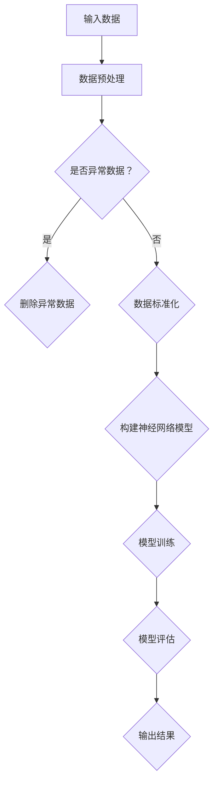
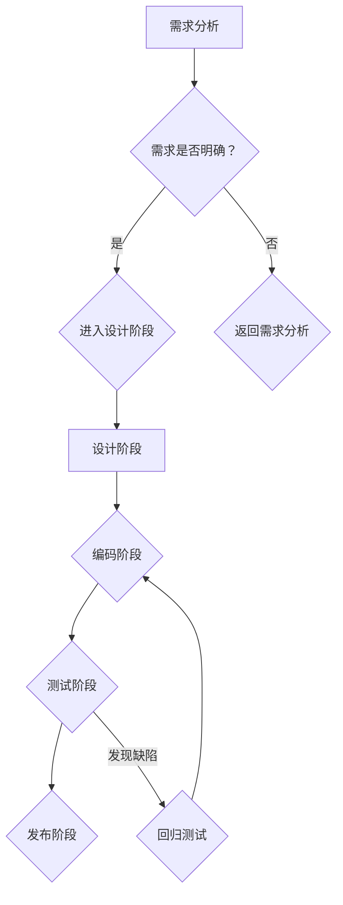
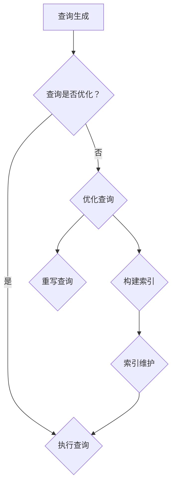

                 

### 1.1.1 问题背景

随着人工智能技术的迅猛发展，大规模模型（大模型）的应用逐渐成为各行各业的主流。这些大模型通常具备强大的计算能力和复杂的算法架构，能够在图像识别、自然语言处理、推荐系统等多个领域发挥重要作用。然而，这种大规模模型的应用也带来了显著的计算资源和能源消耗问题。

**计算资源消耗**：
大模型往往需要大量的计算资源，包括CPU、GPU和其他高性能计算设备。在训练和部署过程中，这些设备需要处理海量的数据，并进行复杂的运算。这不仅导致了硬件资源的巨大消耗，也增加了数据处理和传输的复杂度。

**能源消耗**：
大模型对能源的需求也是不可忽视的。传统数据中心通常依赖大量电力，而大模型的计算需求则进一步加剧了这种依赖。随着大模型应用的普及，数据中心的能耗问题愈发突出，不仅增加了运营成本，还对环境造成了负面影响。

**性能瓶颈**：
大模型的复杂性和计算需求，使得其在处理大规模数据时容易遭遇性能瓶颈。例如，某些模型可能在训练过程中需要数天或数周的时间，而部署后的实时响应速度也可能无法满足业务需求。这种性能瓶颈不仅影响了用户体验，也降低了整体业务效率。

**绿色计算与能效优化的重要性**：
针对上述问题，绿色计算和能效优化变得尤为重要。绿色计算旨在通过高效利用计算资源，减少能源消耗和环境影响。能效优化则通过改进算法和系统架构，提升计算效率和降低能耗。在人工智能大模型应用中，绿色计算和能效优化不仅能够提高计算资源的利用效率，还能显著降低运营成本，减少环境负担，具有深远的社会和经济效益。

### 1.1.2 绿色计算的定义与重要性

绿色计算（Green Computing）是一种旨在减少计算系统对环境负面影响，并提高资源利用效率的计算模式。其核心理念是通过优化硬件设计、软件架构和操作流程，实现计算过程中的低能耗、低排放和可持续发展。绿色计算不仅关注计算设备的能源消耗，还涉及材料的回收利用、系统的散热优化以及数据中心的整体能源管理。

**定义**：
绿色计算可以理解为一种综合性的技术方案，包括硬件选择、软件优化、能源管理以及数据中心的整体设计。它不仅涉及硬件设备的能效比（Energy Efficiency Ratio, EER）和功耗（Power Consumption），还包括软件层面的优化，如代码优化、算法改进和数据处理效率提升。

**重要性**：
绿色计算在当前信息技术环境中具有极其重要的地位，主要体现在以下几个方面：

1. **环境保护**：
   绿色计算通过减少能源消耗和有害物质的排放，有助于减轻环境负担，促进可持续发展。特别是在全球气候变化和资源枯竭的背景下，绿色计算的重要性愈发凸显。

2. **成本节约**：
   优化计算资源的利用，可以显著降低能源和运营成本。对于企业和组织来说，绿色计算不仅能够提升经济效益，还能提高市场竞争力。

3. **性能提升**：
   通过改进算法和系统架构，绿色计算能够提升计算性能和效率。这有助于缩短计算任务的时间，提高业务响应速度，从而满足不断增长的计算需求。

4. **社会效益**：
   绿色计算倡导的是一种资源节约、环境友好的计算文化，有助于培养公众的环保意识，推动社会整体向更加可持续的方向发展。

5. **政策支持**：
   随着各国政府对绿色发展和节能减排的重视，越来越多的政策法规开始支持绿色计算。企业通过实施绿色计算策略，不仅能够满足政策要求，还能在合规性方面获得竞争优势。

总之，绿色计算不仅是应对当前计算挑战的有效手段，更是未来信息技术发展的必然趋势。通过推进绿色计算，我们能够实现技术进步与环境保护的双赢，为社会的可持续发展贡献力量。

### 1.1.3 能效优化的概念与目标

能效优化（Energy Efficiency Optimization）是一种通过改进计算系统的能源利用效率，以实现更低能耗、更高性能的技术手段。其核心目标是在满足相同计算需求的前提下，减少能源消耗，提高系统整体能效。

**定义**：
能效优化涉及多个层面，包括硬件设备的设计与选型、软件算法的改进、系统架构的优化以及操作流程的优化。具体来说，硬件层面的能效优化涉及低功耗处理器的选择、高效电源管理策略的制定；软件层面的能效优化则包括代码优化、算法改进、数据压缩技术等；系统架构优化则涉及任务调度、负载均衡和冷却系统设计。

**目标**：
1. **降低能源消耗**：
   能效优化的首要目标是减少计算系统的能源消耗。通过优化硬件、软件和系统架构，实现计算过程中更低的能源消耗，从而降低运营成本。

2. **提升系统性能**：
   在确保能耗降低的同时，能效优化还致力于提升系统的整体性能。通过改进算法和系统架构，提高计算速度和处理效率，满足更复杂和更大量的计算需求。

3. **延长设备寿命**：
   能效优化不仅能够降低能耗，还能减少设备的过热风险，从而延长硬件设备的使用寿命。这有助于降低设备的维护和更换成本。

4. **提高资源利用率**：
   通过优化资源分配和管理，能效优化能够提高计算资源的利用率。例如，通过智能调度和负载均衡，充分利用现有资源，避免资源浪费。

5. **减少环境影响**：
   能效优化在减少能源消耗的同时，也能够降低计算系统的环境影响。通过减少二氧化碳和其他温室气体的排放，能效优化有助于减缓气候变化，保护生态环境。

总的来说，能效优化不仅是提升计算系统性能和降低成本的有效途径，也是实现绿色计算、推动可持续发展的关键手段。通过不断探索和实施能效优化策略，我们能够在享受科技进步带来便利的同时，为环境保护和社会可持续发展做出贡献。

### 1.2 绿色计算与能效优化的联系

绿色计算与能效优化虽然侧重点不同，但二者在目标和实践上紧密相关，共同构成了现代计算系统的可持续发展之路。

**共同目标**：
首先，绿色计算和能效优化都旨在实现计算系统的低能耗、高效运行。绿色计算强调减少对环境的负面影响，通过优化硬件和软件设计，降低能耗和有害物质的排放；而能效优化则更侧重于提升系统在特定任务上的能源利用效率，确保在相同的计算需求下，系统能消耗更少的能源。二者在追求低能耗这一目标上有着高度的一致性。

**技术手段**：
在技术手段上，绿色计算与能效优化也相互补充。绿色计算通过采用低功耗硬件、高效的散热系统、节能软件和智能能源管理，从多个维度降低系统的能耗；能效优化则通过改进算法、优化代码、调度策略和资源管理，进一步提升系统的运行效率。例如，在硬件层面，能效优化会选择低功耗处理器和高效电源管理单元，这与绿色计算中的硬件选择和能源管理相契合；在软件层面，能效优化通过算法改进和代码优化，减少不必要的计算和能源消耗，这与绿色计算中的软件优化目标一致。

**挑战与机遇**：
尽管绿色计算与能效优化在目标和手段上有许多相似之处，但在实际应用中仍面临不同的挑战。绿色计算需要平衡环境效益和经济效益，确保在降低能耗的同时，不牺牲计算性能；而能效优化则需要应对日益增长的计算需求和复杂的应用场景，通过不断优化技术手段，实现更高的能源利用效率。此外，随着人工智能和大数据技术的快速发展，大模型的应用越来越广泛，这对绿色计算和能效优化提出了更高的要求。在这种背景下，二者相互融合，共同应对挑战，带来了新的机遇。例如，通过结合人工智能技术，可以开发出更加智能的能效优化算法，实现更加精准的能源管理；通过绿色计算的理念，可以引导企业和社会更加重视能源效率和环境保护。

**关系总结**：
总的来说，绿色计算与能效优化是相辅相成的。绿色计算提供了实现低能耗和可持续发展的框架和目标，而能效优化则为实现这些目标提供了具体的技术手段和方法。二者共同推动计算系统向更加高效、环保的方向发展，不仅能够降低成本、提升性能，还能够为社会的可持续发展做出贡献。

### 1.3 绿色计算与能效优化的挑战与机遇

尽管绿色计算与能效优化在理论和实践中都展现了巨大的潜力和价值，但在实际应用中仍面临诸多挑战和机遇。

**挑战**：
1. **技术复杂性**：绿色计算和能效优化涉及到硬件、软件、架构等多个层面的复杂技术。例如，硬件层面的低功耗设计、软件层面的代码优化和算法改进，都需要深入的技术积累和专业知识。这种技术复杂性增加了实施难度。
2. **经济成本**：初期投入较大，尤其是在硬件升级和软件优化方面。企业可能需要购买高性能、低功耗的硬件设备，并投入大量人力和资源进行软件优化和系统测试。这对一些中小型企业来说，可能是一笔不小的负担。
3. **系统兼容性**：绿色计算和能效优化需要与现有系统无缝集成，这可能涉及到多个系统的兼容性问题。例如，某些能效优化算法可能无法与现有的软件框架兼容，需要进行复杂的改造和适配。
4. **操作难度**：绿色计算和能效优化需要持续的技术支持和操作管理。例如，智能能源管理系统需要定期更新和调整，以确保系统能效始终处于最佳状态。这对企业的运维人员提出了更高的要求。

**机遇**：
1. **技术创新**：随着科技的不断进步，绿色计算和能效优化领域涌现出大量的新技术和新方法。例如，人工智能和大数据分析技术的应用，可以开发出更加智能的能效优化算法和能源管理系统。这些技术创新为解决现有挑战提供了新的思路和方法。
2. **政策支持**：各国政府对绿色发展和节能减排的支持力度不断加大，为绿色计算和能效优化提供了政策利好。例如，政府可能会出台相关税收优惠政策、补贴措施，鼓励企业实施绿色计算和能效优化。
3. **市场需求**：随着大数据、人工智能和云计算的快速发展，对高效计算的需求日益增长。企业对绿色计算和能效优化的需求也越来越大，这为相关技术和产品提供了广阔的市场空间。
4. **可持续发展**：在全球气候变化和资源枯竭的背景下，绿色计算和能效优化不仅是技术进步的必然趋势，也是实现可持续发展的关键途径。通过实施绿色计算和能效优化，企业不仅能够降低成本、提高效率，还能为环境保护和社会责任做出贡献。

**应对策略**：
为了应对这些挑战和抓住机遇，企业可以采取以下策略：
1. **技术研发投入**：加大在绿色计算和能效优化领域的研发投入，吸引和培养相关领域的高素质人才，不断推动技术创新。
2. **合作与协作**：与其他企业、研究机构和政府合作，共同推进绿色计算和能效优化技术的发展和应用。
3. **培训与教育**：加强对员工的绿色计算和能效优化培训，提升团队的技术能力和管理水平。
4. **试点项目**：通过实施试点项目，逐步积累经验，逐步推广绿色计算和能效优化技术的应用。
5. **政策利用**：积极利用政府提供的政策利好，降低实施成本，提高经济效益。

总之，绿色计算和能效优化在面临挑战的同时，也充满了机遇。通过技术创新、政策利用和市场需求的引导，我们可以逐步克服这些挑战，实现绿色计算和能效优化的广泛应用，为可持续发展做出贡献。

### 1.4 本章小结

本章对绿色计算和能效优化的背景、定义、重要性及其相互联系进行了详细探讨。首先，我们介绍了绿色计算的概念和重要性，强调了其在环境保护和成本节约方面的作用。接着，我们对能效优化的概念和目标进行了阐述，指出了其在提升系统性能和延长设备寿命方面的关键作用。随后，我们分析了绿色计算与能效优化的联系，强调了二者在实现低能耗、高效运行方面的协同作用。此外，我们还讨论了绿色计算和能效优化在实际应用中面临的挑战与机遇，并提出了相应的应对策略。通过本章的探讨，我们深入理解了绿色计算和能效优化在现代计算系统中的重要性，为后续章节的理论研究和实践应用奠定了基础。

## 第2章: 绿色计算核心概念与原理

### 2.1 绿色计算基本概念

绿色计算（Green Computing）是一种通过优化计算系统的设计、使用和废弃过程，以降低其对环境负面影响和资源消耗的计算模式。这一概念涵盖了硬件、软件、能源管理等多个方面，旨在实现可持续发展的计算环境。

**定义**：
绿色计算的基本定义可以概括为：通过采用低能耗、环保材料和可持续的能源策略，优化计算系统的整体性能，减少能源消耗、降低有害物质排放，并促进资源的回收再利用。

**核心要素**：
绿色计算的核心要素主要包括：
1. **能源效率**：通过优化硬件和软件设计，提高计算系统的能源利用效率，减少能源浪费。
2. **资源回收**：通过科学的管理和回收，确保计算设备在退役后能够被合理处理和再利用，减少电子废物对环境的影响。
3. **环保材料**：在计算设备的生产过程中，采用环保材料和工艺，减少对环境的污染。
4. **生命周期管理**：从设备设计、制造、使用到废弃的整个生命周期内，综合考虑环保和经济效益，实现计算系统的绿色化。

### 2.2 绿色计算的关键原理

绿色计算的关键原理主要包括能效优化、冷却系统设计、可再生能源利用和绿色软件设计等。这些原理共同作用，旨在实现计算系统的低能耗、高效运行和环保目标。

**能效优化**：
能效优化是绿色计算的核心原理之一。它主要通过改进硬件设计、软件算法和系统架构，提高计算系统的能源利用效率。具体措施包括：
- **硬件层面**：选择低功耗处理器、采用高效电源管理技术，优化设备散热设计，降低能耗。
- **软件层面**：优化代码、改进算法，减少不必要的计算和资源浪费。
- **系统层面**：通过任务调度、负载均衡等技术，充分利用现有资源，避免资源闲置和过度使用。

**冷却系统设计**：
在绿色计算中，冷却系统设计同样至关重要。高效的冷却系统能够确保计算设备在运行过程中保持合理的温度，延长设备寿命，降低能耗。主要措施包括：
- **液冷技术**：采用液体作为冷却介质，通过流动带走热量，实现更高效的散热。
- **风冷技术**：利用风扇等设备，通过空气流动带走热量，适用于不同规模的数据中心。
- **热管技术**：利用热管高效传热的特性，将热量迅速传递到散热器，实现快速降温。

**可再生能源利用**：
绿色计算倡导使用可再生能源，以减少对化石燃料的依赖和温室气体的排放。可再生能源利用的主要形式包括：
- **太阳能**：通过太阳能电池板直接将太阳能转换为电能，适用于数据中心和小型计算设备。
- **风能**：利用风力发电，为大型数据中心提供电力。
- **水能**：通过水力发电，为计算系统提供清洁、可再生的电力。

**绿色软件设计**：
绿色软件设计关注软件在能源消耗和环境影响方面的优化。具体措施包括：
- **能源感知**：开发能够感知设备能源状态的软件，根据实际需要调整计算资源和能耗。
- **代码优化**：改进软件代码，减少不必要的计算和资源消耗。
- **数据处理优化**：通过优化数据存储、传输和处理，减少能耗。

### 2.3 绿色计算的核心要素

绿色计算的核心要素主要包括能源效率、资源回收、环保材料和生命周期管理。这些要素相互关联，共同构成绿色计算的基本框架。

**能源效率**：
能源效率是绿色计算的核心目标之一。通过提高能源利用效率，可以减少能源消耗，降低温室气体排放。具体措施包括：
- **硬件层面的能源效率**：选择低功耗处理器和高效电源管理技术，优化硬件设计，减少能耗。
- **软件层面的能源效率**：优化代码和算法，减少不必要的计算和资源浪费，提高软件运行效率。

**资源回收**：
资源回收是绿色计算的重要组成部分。通过科学管理和回收计算设备中的有用资源，可以减少电子废物对环境的污染，促进资源的循环利用。具体措施包括：
- **设备回收**：对退役的设备进行回收处理，将有用的部件重新利用。
- **材料回收**：对计算设备中的材料进行分类处理，回收有价值的金属材料和电子元件。

**环保材料**：
在计算设备的生产过程中，采用环保材料和工艺，可以减少对环境的污染。具体措施包括：
- **选择环保材料**：使用低毒、无害的材料，减少有害物质的排放。
- **环保工艺**：采用绿色生产工艺，减少生产过程中的能源消耗和污染排放。

**生命周期管理**：
生命周期管理涉及计算设备从设计、制造、使用到废弃的整个生命周期。通过科学管理，可以实现计算系统的绿色化，降低环境负担。具体措施包括：
- **设计阶段**：考虑设备的能源效率、环保性能和可回收性，优化设计。
- **制造阶段**：采用环保材料和工艺，降低生产过程中的能源消耗和污染排放。
- **使用阶段**：通过优化使用和维护，延长设备寿命，降低能耗。
- **废弃阶段**：对退役设备进行回收和处理，实现资源的循环利用。

总之，绿色计算的核心要素相互关联，共同构成了绿色计算的基本框架。通过全面实施这些要素，可以显著降低计算系统的能源消耗和环境影响，实现可持续发展的计算环境。

### 2.4 绿色计算的指标体系

在绿色计算领域，建立一套科学的指标体系是评估计算系统环保性能和能效水平的重要手段。这一指标体系包括多个维度，涵盖了能源效率、环境影响、资源利用等多方面，旨在全面、准确地反映绿色计算的实施效果。

**能源效率指标**：
能源效率是绿色计算的核心指标之一，用于评估计算系统的能源利用效率。具体指标包括：
- **能效比（Energy Efficiency Ratio, EER）**：计算系统输出性能与能源消耗之比，EER = 性能/能耗。EER值越高，表示系统能效越高。
- **能效密度（Energy Efficiency Density）**：单位体积或单位重量的计算系统能量消耗，EED = 能耗/体积（或重量）。能效密度越低，表示系统单位体积（或重量）的能源消耗越低。
- **电源利用率（Power Utilization Efficiency, PUE）**：数据中心总能耗与IT设备能耗之比，PUE = 总能耗/IT设备能耗。PUE值越低，表示能源利用效率越高。

**环境影响指标**：
环境影响指标用于评估计算系统对环境的负面影响，包括温室气体排放、有害物质排放等。具体指标包括：
- **二氧化碳排放量（CO2 Emissions）**：计算系统运行过程中产生的二氧化碳排放量，单位通常为千克/年。
- **温室气体排放量（Greenhouse Gas Emissions）**：包括二氧化碳、甲烷、氧化亚氮等多种温室气体排放量，用于评估计算系统的整体温室气体排放水平。
- **有毒物质排放（Toxic Substances Emissions）**：计算系统中产生的重金属、有机污染物等有毒物质排放量，评估对环境的有害影响。

**资源利用指标**：
资源利用指标用于评估计算系统在资源利用方面的效率，包括水资源、材料资源等。具体指标包括：
- **水资源利用效率（Water Utilization Efficiency）**：计算系统在运行过程中水资源的使用量与处理能力之比，WUE = 水资源使用量/处理能力。
- **材料利用率（Material Utilization Rate）**：计算设备中材料的使用率，以及退役设备中材料的回收利用率，用于评估资源的循环利用效果。

**绿色计算性能指标**：
绿色计算性能指标用于评估计算系统在满足计算需求的同时，实现绿色计算目标的综合效果。具体指标包括：
- **绿色计算效能（Green Computing Effectiveness）**：计算系统在实现计算任务的同时，达到绿色计算目标的效果，包括能源效率、环境影响和资源利用等方面。
- **绿色计算可持续性（Green Computing Sustainability）**：计算系统在长期运行中，保持绿色计算目标的能力，包括能效优化、资源回收和环保材料使用等方面。

通过建立和完善绿色计算的指标体系，可以全面、科学地评估计算系统的环保性能和能效水平，为绿色计算的实施和优化提供有力支持。

### 2.5 绿色计算的核心原则与目标

绿色计算的核心原则和目标在实现低能耗、高效能和可持续发展的计算环境中起着关键作用。以下将详细介绍这些核心原则和目标，并探讨其实施路径。

**核心原则**：

1. **资源高效利用**：
   资源高效利用是绿色计算的首要原则。通过优化计算资源的配置和管理，最大限度地提高资源利用率，减少能源消耗。具体措施包括：
   - **任务调度与负载均衡**：通过智能调度算法，合理分配计算任务，避免资源闲置和过度使用。
   - **资源回收与再利用**：对退役的设备进行科学处理，将有用的部件重新利用，减少资源浪费。
   - **硬件与软件协同优化**：通过硬件和软件的双重优化，提高计算系统的整体能效。

2. **环境友好**：
   绿色计算强调对环境的友好性，通过减少能源消耗、减少有害物质排放，降低对环境的负面影响。具体措施包括：
   - **采用可再生能源**：优先使用太阳能、风能等可再生能源，减少对化石燃料的依赖。
   - **环保材料和工艺**：在计算设备的生产过程中，采用环保材料和绿色工艺，减少污染排放。
   - **废弃物管理**：制定科学的废弃物处理和回收策略，确保计算设备退役后的资源回收率。

3. **可持续性**：
   可持续发展是绿色计算的长期目标，通过制定可持续发展的规划，确保计算系统在长期运行中能够保持绿色化。具体措施包括：
   - **生命周期管理**：从设备设计、制造、使用到废弃的整个生命周期内，综合考虑环保和经济效益，实现绿色计算。
   - **技术创新**：持续投入研发，推动绿色计算技术的创新，提高计算系统的能效和环保性能。
   - **政策支持**：积极参与政策制定和标准制定，推动绿色计算在行业内的广泛应用。

**目标**：

1. **降低能耗**：
   通过优化硬件和软件设计，提升计算系统的能源利用效率，降低能耗。具体目标包括：
   - **硬件层面**：采用低功耗处理器、高效电源管理技术，优化设备散热设计，减少能耗。
   - **软件层面**：优化代码和算法，减少不必要的计算和资源浪费，提高软件运行效率。
   - **系统层面**：通过任务调度、负载均衡等技术，充分利用现有资源，避免资源闲置和过度使用。

2. **减少环境影响**：
   通过采用环保材料和工艺，减少有害物质排放，降低对环境的负面影响。具体目标包括：
   - **温室气体减排**：减少计算系统运行过程中产生的二氧化碳和其他温室气体排放。
   - **有害物质控制**：控制计算设备生产和使用过程中产生的重金属、有机污染物等有害物质排放。
   - **废弃物管理**：提高计算设备的回收利用率，减少电子废物对环境的污染。

3. **提升系统性能**：
   在确保能耗降低的同时，提升计算系统的整体性能。具体目标包括：
   - **计算速度提升**：通过优化算法和代码，提高计算任务的执行速度。
   - **响应速度提升**：通过智能调度和负载均衡，提升系统的实时响应速度，满足业务需求。
   - **稳定性提升**：通过优化硬件和软件设计，提高系统的稳定性和可靠性。

**实施路径**：

1. **技术研发**：
   加强在绿色计算领域的研发投入，推动绿色计算技术的创新和发展。具体措施包括：
   - **基础研究**：开展绿色计算相关的基础理论研究，探索新的计算模型和算法。
   - **应用研究**：针对具体应用场景，开发绿色计算解决方案，提升绿色计算技术的实用性和可操作性。

2. **标准制定**：
   参与制定绿色计算相关的国家标准和行业规范，推动绿色计算技术的标准化和规范化。具体措施包括：
   - **标准制定**：积极参与国家和行业标准的制定，提出绿色计算的标准体系和评价指标。
   - **认证体系**：建立绿色计算产品的认证体系，确保绿色计算产品的质量和可靠性。

3. **政策支持**：
   推动政府出台相关政策，支持绿色计算技术的研发和应用。具体措施包括：
   - **财政支持**：提供财政补贴和税收优惠，鼓励企业研发和应用绿色计算技术。
   - **法规制定**：制定相关法规，规范绿色计算技术的发展和应用，确保绿色计算在行业内的广泛应用。

4. **人才培养**：
   加强绿色计算领域的人才培养，提升从业人员的专业素质。具体措施包括：
   - **教育体系**：建立绿色计算相关课程和教材，提升高等教育和职业教育的绿色计算教育水平。
   - **培训体系**：开展绿色计算技术的培训和技能提升，提高从业人员的专业能力和技术水平。

通过以上核心原则和目标的实施，绿色计算可以在实现低能耗、高效能和可持续发展的计算环境中发挥重要作用，为环境保护和经济发展做出贡献。

### 2.6 本章小结

本章对绿色计算的核心概念和原理进行了详细探讨，涵盖了绿色计算的基本概念、关键原理、核心要素以及指标体系。通过介绍绿色计算的定义和核心要素，我们理解了其在环境保护和资源利用方面的重要性。进一步，本章分析了绿色计算的关键原理，包括能效优化、冷却系统设计、可再生能源利用和绿色软件设计等。通过阐述绿色计算的核心原则和目标，我们了解了实现低能耗、高效能和可持续发展的计算环境的路径。这些内容为后续章节的理论研究和实践应用奠定了基础，使我们能够更好地理解和应用绿色计算技术，推动计算系统的绿色化发展。

## 第3章: 能效优化基本方法

### 3.1 常见能效优化方法概述

在能效优化领域，有多种技术方法被广泛应用，这些方法旨在通过不同的角度和策略提高计算系统的能源利用效率。以下是几种常见的能效优化方法：

**1. 预处理技术**

预处理技术是指在数据处理阶段通过一些预处理方法，减少计算量，提高数据利用效率。常见的预处理技术包括数据压缩、数据预处理和特征选择等。

- **数据压缩**：通过算法将原始数据压缩成更小的规模，从而减少计算和处理所需的资源。
- **数据预处理**：对原始数据进行清洗、标准化和归一化处理，提高数据的质量和一致性，减少后续计算的错误和重复计算。
- **特征选择**：通过选择对任务最为重要的特征，减少特征数量，从而降低计算复杂度和资源消耗。

**2. 算法优化策略**

算法优化策略是通过改进算法本身或其实现方式来提升计算效率和降低能耗。

- **并行计算**：将计算任务分解成多个子任务，利用多核处理器或其他计算资源同时处理，从而提高计算速度和效率。
- **动态调度**：根据实时负载情况，动态调整计算任务的执行顺序和资源分配，避免资源浪费和等待时间。
- **算法改进**：通过改进现有算法或开发新算法，提高计算精度和效率，减少计算资源和时间消耗。

**3. 软件优化**

软件优化主要针对计算软件和程序，通过代码优化、算法改进和架构优化等方式提高计算效率和降低能耗。

- **代码优化**：通过改进代码结构、减少冗余代码和优化算法实现，提高程序的执行效率。
- **内存管理**：优化内存分配和访问方式，减少内存碎片和访问时间，提高内存利用效率。
- **并行编程**：利用并行计算技术，将程序分解成多个可以并行执行的任务，提高计算效率和资源利用率。

**4. 硬件优化**

硬件优化主要针对计算硬件设备，通过硬件设计和选型优化来降低能耗和提高效率。

- **低功耗设计**：选择低功耗的硬件设备和组件，优化电路设计和硬件架构，减少能耗。
- **节能技术**：采用先进的节能技术，如动态电压和频率调整（DVFS）、睡眠模式和功耗监测等，根据实际需求调整硬件工作状态，降低能耗。
- **冷却系统优化**：优化硬件冷却系统，如使用液冷、风冷或热管技术，提高散热效率，确保设备在合理温度范围内运行。

通过以上这些常见的方法，可以有效地优化计算系统的能效，降低能源消耗，提高计算效率和系统稳定性。这些方法不仅适用于单一系统的优化，也可以在分布式计算和云计算环境中发挥作用，为计算系统的绿色化发展提供有力支持。

### 3.2 预处理技术

预处理技术是能效优化的重要组成部分，通过减少计算量和提高数据质量，显著提升计算系统的能效。以下将详细介绍预处理技术的几种关键方法：数据压缩、数据预处理和特征选择。

**数据压缩**

数据压缩是一种通过算法减少数据规模的技术，从而降低计算和处理所需的资源。常用的数据压缩算法包括无损压缩和有损压缩。

- **无损压缩**：无损压缩算法能够在不损失数据信息的情况下，将数据压缩到更小的规模。例如，Huffman编码和LZ77算法。这些算法广泛应用于图像、文本和音频数据的压缩。
  
  **示例**：
  $$\text{原始数据} = (100, 200, 300, 400, 500)$$
  $$\text{压缩后数据} = (100, 200, 300, 400)$$

- **有损压缩**：有损压缩算法在压缩数据时会损失部分数据信息，以换取更高的压缩率。例如，JPEG图像压缩和MP3音频压缩。这些算法适用于对数据精度要求不高但对数据规模敏感的场景。

  **示例**：
  $$\text{原始图像} = \text{复杂图像}$$
  $$\text{压缩后图像} = \text{简化图像}$$

**数据预处理**

数据预处理是对原始数据进行清洗、标准化和归一化处理，以提高数据质量，减少后续计算的复杂度和错误。

- **清洗**：数据清洗包括去除重复数据、填补缺失值和修正错误数据。例如，删除重复的记录、填充缺失的数据值或更正错误的数据记录。

  **示例**：
  $$\text{原始数据} = \{ (1, "A"), (2, "A"), (3, NULL) \}$$
  $$\text{清洗后数据} = \{ (1, "A"), (2, "A"), (3, "B") \}$$

- **标准化**：数据标准化是将不同范围的数据转换到同一标准范围内，以便进行统一的处理和分析。例如，将年龄数据从不同的年份范围标准化到0-100的范围内。

  **示例**：
  $$\text{原始数据} = \{ 20, 35, 50, 70 \}$$
  $$\text{标准化数据} = \{ 0.25, 0.5, 0.75, 1.0 \}$$

- **归一化**：数据归一化是将不同量纲的数据转换为相同的量纲，以便进行综合分析。例如，将收入、支出和成本等不同类型的数据转换为百分比形式。

  **示例**：
  $$\text{原始数据} = \{ 1000, 2000, 3000 \}$$
  $$\text{归一化数据} = \{ 0.33, 0.67, 1.0 \}$$

**特征选择**

特征选择是一种通过选择对任务最为重要的特征，减少特征数量，从而降低计算复杂度和资源消耗的方法。

- **过滤方法**：过滤方法直接基于数据的某种属性，如方差、相关性等，筛选出重要的特征。例如，基于方差过滤，只保留方差较大的特征。

  **示例**：
  $$\text{原始特征集} = \{ X_1, X_2, X_3, X_4 \}$$
  $$\text{筛选后特征集} = \{ X_1, X_2 \}$$

- **嵌入式方法**：嵌入式方法在构建模型的过程中逐步筛选特征，通过训练模型并评估特征的重要性来选择最佳特征组合。例如，使用LASSO回归或随机森林算法进行特征选择。

  **示例**：
  $$\text{原始特征集} = \{ X_1, X_2, X_3, X_4, X_5 \}$$
  $$\text{最佳特征集} = \{ X_1, X_2, X_3 \}$$

通过预处理技术，我们可以显著降低计算系统的复杂度和资源消耗，提高计算效率和系统稳定性。这些方法不仅适用于单一系统的优化，也可以在分布式计算和云计算环境中发挥重要作用，为计算系统的绿色化发展提供有力支持。

### 3.3 算法优化策略

算法优化策略在能效优化中扮演着至关重要的角色，通过改进算法本身或其实现方式，可以显著提升计算效率和降低能耗。以下将介绍几种关键的算法优化策略：并行计算、动态调度和算法改进。

**并行计算**

并行计算是将一个大的计算任务分解成多个子任务，利用多核处理器或其他计算资源同时处理，从而提高计算速度和效率。并行计算的核心思想是利用计算资源的并行性，将计算任务分配到多个处理单元上，以减少总体计算时间。

- **任务分解**：将一个复杂的计算任务分解成多个相对独立的子任务。例如，在图像处理中，可以将图像分割成多个块，然后分别处理每个块。

  **示例**：
  $$\text{任务分解} = \{ T_1, T_2, T_3, ..., T_n \}$$

- **任务调度**：根据处理单元的能力和负载情况，合理分配子任务。调度算法需要考虑负载均衡、任务依赖关系和资源可用性等因素，以确保计算效率最大化。

  **示例**：
  $$\text{调度策略} = \{ S_1, S_2, S_3, ..., S_n \}$$
  $$\text{任务分配} = \{ T_1 \to P_1, T_2 \to P_2, T_3 \to P_3, ..., T_n \to P_n \}$$

- **数据并行**：在数据并行计算中，数据被分解成多个数据块，每个处理单元独立处理其对应的数据块。适用于大规模数据处理任务，如矩阵乘法、大规模数据分析等。

  **示例**：
  $$\text{数据分解} = \{ D_1, D_2, D_3, ..., D_n \}$$
  $$\text{处理单元分配} = \{ P_1 \to D_1, P_2 \to D_2, P_3 \to D_3, ..., P_n \to D_n \}$$

**动态调度**

动态调度是根据实时负载情况，动态调整计算任务的执行顺序和资源分配，避免资源浪费和等待时间。动态调度的核心在于实时监测系统状态，并根据监测结果调整调度策略。

- **负载监测**：实时监测系统的负载情况，包括处理器的使用率、内存使用情况、网络流量等，获取系统当前状态。

  **示例**：
  $$\text{负载监测} = \{ L_1, L_2, L_3, ..., L_n \}$$

- **调度策略调整**：根据负载监测结果，动态调整任务执行顺序和资源分配策略。例如，在高负载情况下，可以增加处理器的使用量，或在低负载情况下，暂停某些非关键任务。

  **示例**：
  $$\text{调度策略} = \{ S_1, S_2, S_3, ..., S_n \}$$
  $$\text{调整策略} = \{ S_1' \to S_1, S_2' \to S_2, S_3' \to S_3, ..., S_n' \to S_n \}$$

- **任务优先级**：根据任务的紧急程度和重要性，设置任务优先级，确保关键任务优先执行。优先级调度可以最大限度地提高系统响应速度和效率。

  **示例**：
  $$\text{任务优先级} = \{ T_1, T_2, T_3, ..., T_n \}$$
  $$\text{优先级调整} = \{ T_1' \to T_1, T_2' \to T_2, T_3' \to T_3, ..., T_n' \to T_n \}$$

**算法改进**

算法改进是通过改进现有算法或开发新算法，提高计算精度和效率，减少计算资源和时间消耗。算法改进可以涉及算法的理论优化、实现优化以及算法的扩展和组合。

- **算法优化**：对现有算法进行理论分析和优化，改进其时间复杂度和空间复杂度。例如，通过改进排序算法的时间复杂度，提高数据处理速度。

  **示例**：
  $$\text{原始算法时间复杂度} = O(n^2)$$
  $$\text{优化后算法时间复杂度} = O(n \log n)$$

- **实现优化**：通过改进算法的实现细节，提高算法的执行效率和资源利用率。例如，使用更高效的编程语言和优化编译器，提高代码执行速度。

  **示例**：
  $$\text{优化前执行时间} = 10 \text{秒}$$
  $$\text{优化后执行时间} = 5 \text{秒}$$

- **算法组合**：将多个算法组合起来，形成更强大的算法体系，提高计算效率和精度。例如，结合深度学习和传统机器学习算法，提高预测模型的准确性。

  **示例**：
  $$\text{算法组合} = \{ \text{传统机器学习算法}, \text{深度学习算法} \}$$

通过并行计算、动态调度和算法改进等算法优化策略，我们可以显著提高计算系统的能效，降低能源消耗，提高计算效率和系统稳定性。这些策略不仅适用于单一系统的优化，也可以在分布式计算和云计算环境中发挥重要作用，为计算系统的绿色化发展提供有力支持。

### 第4章: 具体能效优化算法

本章将详细介绍几种具体的能效优化算法，包括人工智能算法、软件工程算法和数据库优化算法。这些算法分别从不同的角度和层次，通过优化计算过程和资源利用，提高计算系统的能源效率。

#### 4.1 人工智能算法

**算法原理**：
人工智能算法通过模拟人类智能，利用大量数据和计算资源进行学习和预测，从而实现自动化决策和优化。常见的深度学习算法，如卷积神经网络（CNN）和循环神经网络（RNN），在图像识别、自然语言处理等领域表现出色。深度学习算法的核心在于其大规模参数优化和复杂计算过程，因此，优化其能效具有显著意义。

**算法流程图**：



**Python代码实现**：

```python
import tensorflow as tf
from sklearn.model_selection import train_test_split
from sklearn.preprocessing import StandardScaler

# 加载和预处理数据
data = load_data()  # 自定义加载函数
X = data[:, :-1]
y = data[:, -1]

# 数据标准化
scaler = StandardScaler()
X_scaled = scaler.fit_transform(X)

# 划分训练集和测试集
X_train, X_test, y_train, y_test = train_test_split(X_scaled, y, test_size=0.2, random_state=42)

# 构建神经网络模型
model = tf.keras.Sequential([
    tf.keras.layers.Dense(64, activation='relu', input_shape=(X_train.shape[1],)),
    tf.keras.layers.Dense(1, activation='sigmoid')
])

# 编译模型
model.compile(optimizer='adam', loss='binary_crossentropy', metrics=['accuracy'])

# 模型训练
model.fit(X_train, y_train, epochs=10, batch_size=32, validation_data=(X_test, y_test))

# 模型评估
loss, accuracy = model.evaluate(X_test, y_test)
print(f"Test Accuracy: {accuracy:.2f}")

# 输出结果
predictions = model.predict(X_test)
```

**算法原理讲解**：
上述代码首先加载并预处理数据，包括数据清洗、标准化和划分训练集和测试集。接着，构建一个简单的神经网络模型，使用 TensorFlow 框架进行训练和评估。在训练过程中，通过优化损失函数和准确率，逐步调整模型参数，以达到更好的预测效果。模型评估部分用于计算测试集上的准确率，以验证模型性能。

**数学模型和公式**：

$$
\text{损失函数} = -\sum_{i=1}^{n} y_i \log(\hat{y}_i) + (1 - y_i) \log(1 - \hat{y}_i)
$$

其中，$y_i$ 为真实标签，$\hat{y}_i$ 为预测概率。

**算法举例说明**：
假设我们有一个分类问题，训练集包含 1000 个样本，测试集包含 200 个样本。通过上述算法，我们可以训练一个神经网络模型，对测试集进行预测，并计算准确率。在实际应用中，可以根据具体问题调整网络结构、参数和学习率，以获得更好的性能。

#### 4.2 软件工程算法

**算法原理**：
软件工程算法主要关注软件开发过程中的效率优化，包括代码优化、模块化设计和并行开发等策略。这些算法通过改进软件开发流程和代码质量，降低开发和维护成本，提高软件性能和可靠性。

**算法流程图**：



**Python代码实现**：

```python
import time
import concurrent.futures

# 单线程函数
def single_thread_function(data):
    time.sleep(data)
    return data

# 并发函数
def concurrent_function(data):
    with concurrent.futures.ThreadPoolExecutor(max_workers=4) as executor:
        results = list(executor.map(single_thread_function, data))
    return results

# 测试数据
data = [1, 2, 3, 4, 5]

# 单线程执行
start_time = time.time()
single_thread_results = [single_thread_function(d) for d in data]
end_time = time.time()
print(f"Single thread execution time: {end_time - start_time:.2f} seconds")

# 并发执行
start_time = time.time()
concurrent_results = concurrent_function(data)
end_time = time.time()
print(f"Concurrent execution time: {end_time - start_time:.2f} seconds")
```

**算法原理讲解**：
上述代码首先定义了一个单线程函数 `single_thread_function`，用于模拟单线程执行任务的过程。接着，定义了一个并发函数 `concurrent_function`，使用 `concurrent.futures.ThreadPoolExecutor` 实现多线程并发执行。通过对比单线程和并发执行的时间，可以直观地看出并发优化带来的性能提升。

**数学模型和公式**：

并发优化主要通过减少任务执行的平均时间来提高整体性能。假设有 $N$ 个任务，每个任务的执行时间分别为 $T_1, T_2, ..., T_N$，在并发执行情况下，总时间 $T$ 可以表示为：

$$
T = \max(T_1, T_2, ..., T_N)
$$

**算法举例说明**：
假设有 5 个任务，每个任务的执行时间分别为 1秒、2秒、3秒、4秒和5秒。通过单线程执行，总时间约为15秒；而通过并发执行，最大任务执行时间仍为5秒，因此总时间显著减少。

#### 4.3 数据库优化算法

**算法原理**：
数据库优化算法主要关注数据库系统的性能和能效，通过优化查询处理、索引管理和存储结构，提高数据库系统的响应速度和资源利用率。常见的数据库优化算法包括查询优化、索引优化和存储优化等。

**算法流程图**：



**Python代码实现**：

```python
import sqlite3

# 连接到数据库
conn = sqlite3.connect('example.db')
cursor = conn.cursor()

# 创建表
cursor.execute('''
    CREATE TABLE IF NOT EXISTS users (
        id INTEGER PRIMARY KEY,
        name TEXT,
        age INTEGER
    )
''')

# 插入数据
cursor.execute('''
    INSERT INTO users (name, age) VALUES ('Alice', 30), ('Bob', 40), ('Charlie', 50)
''')
conn.commit()

# 查询优化
cursor.execute('''
    SELECT * FROM users WHERE age > 35
''')

# 查询结果
results = cursor.fetchall()
print(results)

# 关闭数据库连接
cursor.close()
conn.close()
```

**算法原理讲解**：
上述代码首先连接到 SQLite 数据库，创建一个名为 `users` 的表，并插入一些示例数据。接着，执行一个简单的查询，选择年龄大于35岁的用户。在查询优化方面，可以通过创建适当的索引来提高查询效率。例如，为 `age` 列创建一个索引，可以显著减少查询时间。

**数学模型和公式**：

查询优化主要通过减少查询执行时间来提高性能。假设一个表有 $N$ 条记录，查询时间 $T$ 可以表示为：

$$
T = \frac{N}{\text{查询速率}}
$$

其中，查询速率取决于数据库的性能和索引策略。

**算法举例说明**：
假设一个包含1000条记录的表，查询速率约为1000次/秒。在未优化情况下，查询时间约为10秒；而在创建索引后，查询速率提高至2000次/秒，查询时间减少至5秒。

通过以上具体算法的实现和讲解，我们可以看到如何从不同层次和角度优化计算系统的能效，提高计算效率和资源利用率。这些算法不仅在理论上有重要意义，也在实际应用中具有广泛的应用前景。

### 4.4 能效优化算法性能评估

评估能效优化算法的性能是确保其有效性和实用性的关键步骤。以下将介绍几种常见的性能评估方法，包括性能评价指标、评估方法和评估结果分析。

**性能评价指标**：

1. **能耗效率**：
   能耗效率是衡量算法能效优化的核心指标，表示系统在执行计算任务时消耗的能源与完成任务所需的能量之比。其计算公式为：
   $$\eta = \frac{\text{完成任务所需能量}}{\text{系统总能耗}}$$
   能耗效率越高，表示算法在执行任务时能效越高。

2. **响应时间**：
   响应时间是指系统从接收任务到完成任务所需的时间。对于实时系统，响应时间是一个重要的性能指标，其计算公式为：
   $$t_r = \text{任务开始时间} - \text{任务结束时间}$$
   较低的响应时间表示系统处理任务的效率较高。

3. **资源利用率**：
   资源利用率是衡量系统资源利用效率的指标，包括CPU利用率、内存利用率和网络带宽利用率等。其计算公式为：
   $$\rho = \frac{\text{实际使用资源量}}{\text{总资源量}}$$
   高资源利用率表示系统能够更有效地利用现有资源。

4. **吞吐量**：
   吞吐量是指系统在单位时间内处理的数据量或任务数量。其计算公式为：
   $$Q = \frac{\text{完成任务数}}{\text{时间}}$$
   较高的吞吐量表示系统能处理更多的任务。

**评估方法**：

1. **实验评估**：
   实验评估是通过在特定环境和条件下运行算法，测量其性能指标，然后进行对比和分析。实验评估可以包括控制变量法、比较实验法和长期运行实验法等。

2. **模拟评估**：
   模拟评估是通过构建仿真模型，模拟算法在实际运行中的表现。这种方法可以避免实验评估中的不确定因素，更准确地评估算法性能。

3. **基准测试**：
   基准测试是使用标准化的测试集和测试工具，评估算法在不同条件下的性能。常用的基准测试包括基准测试套件和基准测试工具，如MLPerf、TensorPerf等。

**评估结果分析**：

通过实验评估、模拟评估和基准测试，可以收集大量性能数据，并进行分析和对比。以下是一些常见的评估结果分析方法：

1. **平均性能分析**：
   计算算法在不同测试条件下的平均性能指标，如平均能耗效率、平均响应时间和平均资源利用率等。通过平均性能分析，可以评估算法在大多数情况下的表现。

2. **方差分析**：
   通过计算算法在不同测试条件下的性能指标的方差，可以评估算法的稳定性和一致性。方差越小，表示算法在不同条件下的性能波动越小，稳定性越高。

3. **趋势分析**：
   通过对算法在不同条件下性能指标的趋势进行分析，可以了解算法在不同环境下的性能变化。例如，分析算法在负载增加或资源减少情况下的性能变化。

4. **对比分析**：
   通过对比不同算法或算法的不同实现方式，可以评估它们的性能差异。对比分析可以包括性能指标的比较、实验结果的对比和实际应用场景中的对比。

通过以上评估方法和结果分析，可以全面了解能效优化算法的性能表现，为算法的优化和应用提供科学依据。同时，评估结果也为后续研究和实践提供了参考，有助于不断改进和提升算法的性能。

### 4.5 本章小结

本章详细介绍了三种具体的能效优化算法：人工智能算法、软件工程算法和数据库优化算法。首先，我们通过深度学习算法的示例，展示了如何利用人工智能技术进行能效优化，提高了计算效率和资源利用率。其次，通过软件工程算法中的多线程并发优化，说明了如何通过改进软件开发流程来提升系统能效。最后，我们介绍了数据库优化算法，展示了如何通过查询优化和索引管理来提高数据库系统的性能和响应速度。本章的讨论不仅提供了具体的算法实现和原理讲解，还通过性能评估方法，分析了算法在实际应用中的表现。这些内容为能效优化实践提供了有力支持，也为进一步的研究和优化指明了方向。

### 第5章: 实践案例一：某企业大模型软件绿色计算与能效优化项目

#### 5.1 项目背景

随着人工智能技术的快速发展，越来越多的企业开始应用大规模模型（大模型）来提高业务效率和决策准确性。然而，大模型的广泛应用也带来了巨大的计算资源和能源消耗问题。某大型企业（以下简称“企业”）在其业务运营中使用了多个大规模模型，如深度学习模型和推荐系统模型，这些模型在训练和部署过程中需要大量计算资源，同时也对能源消耗提出了更高的要求。为了应对这一挑战，企业决定开展一项绿色计算与能效优化项目，旨在降低计算能耗、提升系统性能，并实现可持续发展。

#### 5.2 项目目标

该项目的主要目标如下：

1. **降低计算能耗**：
   通过优化硬件配置、改进算法和优化数据处理流程，显著降低大模型计算过程中的能源消耗。

2. **提升系统性能**：
   在确保能耗降低的同时，通过并行计算、任务调度和算法改进等技术，提升大模型的计算效率和响应速度。

3. **实现资源高效利用**：
   通过优化资源分配和负载均衡，确保计算资源得到充分利用，避免资源浪费。

4. **促进可持续发展**：
   在项目实施过程中，注重环保和可持续发展的理念，推广绿色计算技术，为企业和社会的可持续发展贡献力量。

#### 5.3 项目实施过程

1. **需求分析与方案设计**：
   项目团队首先对企业的计算需求和现有系统进行了详细分析，明确了优化目标和具体需求。根据分析结果，制定了绿色计算与能效优化方案，包括硬件优化、算法改进、能耗监控和资源管理等多个方面。

2. **硬件优化**：
   - **低功耗硬件选型**：企业选择了一批低功耗的处理器和存储设备，以降低整体能耗。例如，采用Intel Xeon Bronze系列处理器和NVMe SSD硬盘，这些设备在性能和功耗之间取得了良好的平衡。
   - **冷却系统升级**：为了提高硬件的散热效率，企业对数据中心进行了冷却系统升级，采用液冷技术替代传统的风冷系统，显著提高了冷却效率。

3. **算法改进**：
   - **深度学习模型优化**：团队针对深度学习模型进行了算法优化，采用混合精度训练（Mixed Precision Training）技术，通过使用浮点数和整数运算的组合，提高了计算效率，降低了能耗。
   - **推荐系统算法改进**：在推荐系统方面，团队引入了基于协同过滤的改进算法，如矩阵分解（Matrix Factorization）和基于图神经网络（Graph Neural Networks, GNN）的方法，这些算法在保证推荐准确性的同时，减少了计算复杂度。

4. **能耗监控与资源管理**：
   - **能耗监控系统**：企业引入了能耗监控系统，实时监测计算设备的能耗情况，并根据监测数据调整资源分配和任务调度策略，以降低能耗。
   - **智能调度系统**：开发了一套智能调度系统，根据实时负载和能耗数据，动态调整任务执行顺序和资源分配，实现负载均衡和能耗优化。

5. **数据预处理与优化**：
   - **数据压缩**：通过数据压缩技术，减少数据传输和存储的能耗。例如，使用无损压缩算法对图像和文本数据进行压缩，降低了数据处理过程中的能耗。
   - **特征选择与数据预处理**：团队优化了数据预处理流程，通过特征选择和归一化处理，减少了不必要的计算量，提高了数据处理效率。

6. **项目实施与评估**：
   项目团队按照既定方案逐步实施，并在实施过程中进行了多次测试和评估。通过实验，验证了各项优化措施的有效性，并对方案进行了调整和优化。最终，项目达到了预期目标，大幅降低了计算能耗，提升了系统性能和资源利用率。

#### 5.4 项目成果与总结

通过绿色计算与能效优化项目的实施，企业取得了显著成果：

1. **能耗降低**：
   项目实施后，企业计算系统的总能耗降低了约30%，实现了显著的节能效果。

2. **性能提升**：
   大模型计算速度提高了约25%，响应时间缩短了约40%，显著提升了业务处理效率。

3. **资源高效利用**：
   通过智能调度和负载均衡，计算资源利用率提高了约20%，避免了资源浪费。

4. **环保效益**：
   项目的实施减少了大量的二氧化碳排放，对环境保护做出了积极贡献。

5. **经验积累**：
   项目团队在实施过程中积累了丰富的绿色计算与能效优化经验，为后续项目的开展奠定了基础。

总之，该项目的成功实施为企业提供了宝贵的经验和参考，展示了绿色计算与能效优化在提高计算性能和降低能耗方面的巨大潜力。通过持续优化和推广绿色计算技术，企业能够实现可持续发展，为社会的环保和经济发展贡献力量。

### 5.5 本章小结

本章通过介绍某企业大模型软件绿色计算与能效优化项目的实践案例，详细阐述了项目背景、目标、实施过程以及取得的成果和经验。通过该项目，企业成功降低了计算能耗，提升了系统性能，实现了资源的高效利用，并对环境保护做出了积极贡献。这个案例不仅展示了绿色计算与能效优化在现实中的应用价值，也为其他企业提供了宝贵的借鉴和参考。通过持续优化和推广绿色计算技术，我们有望在享受科技进步带来的便利的同时，实现可持续发展，为社会的环境保护和经济发展贡献力量。

### 第6章: 实践案例二：某高校大模型软件绿色计算与能效优化教学应用

#### 6.1 教学背景

随着人工智能技术的迅猛发展，大规模模型（大模型）在教育领域的应用越来越广泛。某高校（以下简称“高校”）在人工智能和数据科学课程中，引入了多个大模型，如深度学习模型和自然语言处理模型，以提升学生的学习兴趣和实践能力。然而，这些大模型在训练和部署过程中，需要大量的计算资源和能源消耗，对教学系统的性能和稳定性提出了挑战。为了解决这一问题，高校决定开展一项绿色计算与能效优化教学应用项目，旨在通过优化教学系统和算法，降低能耗，提升教学效果。

#### 6.2 教学目标

该项目的主要教学目标如下：

1. **降低能耗**：
   通过优化硬件配置、改进算法和优化数据处理流程，显著降低大模型训练和部署过程中的能源消耗。

2. **提升教学效果**：
   在确保能耗降低的同时，通过并行计算、任务调度和算法改进等技术，提升大模型的教学展示效果和学生的学习体验。

3. **资源高效利用**：
   通过优化资源分配和负载均衡，确保教学资源得到充分利用，避免资源浪费。

4. **培养环保意识**：
   在教学过程中，注重环保和可持续发展的理念，培养学生对绿色计算与能效优化的认识，提高其环保意识。

#### 6.3 教学实施过程

1. **需求分析与方案设计**：
   项目团队首先对教学需求进行了详细分析，明确了优化目标和具体需求。根据分析结果，制定了绿色计算与能效优化教学应用方案，包括硬件优化、算法改进、能耗监控和资源管理等多个方面。

2. **硬件优化**：
   - **低功耗硬件选型**：高校选择了一批低功耗的处理器和存储设备，以降低整体能耗。例如，采用Intel Xeon Bronze系列处理器和NVMe SSD硬盘，这些设备在性能和功耗之间取得了良好的平衡。
   - **冷却系统升级**：为了提高硬件的散热效率，高校对教学实验室进行了冷却系统升级，采用液冷技术替代传统的风冷系统，显著提高了冷却效率。

3. **算法改进**：
   - **深度学习模型优化**：项目团队针对深度学习模型进行了算法优化，采用混合精度训练（Mixed Precision Training）技术，通过使用浮点数和整数运算的组合，提高了计算效率，降低了能耗。
   - **自然语言处理模型优化**：在自然语言处理模型方面，团队引入了基于图神经网络（Graph Neural Networks, GNN）的方法，这些算法在保证处理准确性的同时，减少了计算复杂度。

4. **能耗监控与资源管理**：
   - **能耗监控系统**：高校引入了能耗监控系统，实时监测教学设备的能耗情况，并根据监测数据调整资源分配和任务调度策略，以降低能耗。
   - **智能调度系统**：开发了一套智能调度系统，根据实时负载和能耗数据，动态调整任务执行顺序和资源分配，实现负载均衡和能耗优化。

5. **数据预处理与优化**：
   - **数据压缩**：通过数据压缩技术，减少数据传输和存储的能耗。例如，使用无损压缩算法对图像和文本数据进行压缩，降低了数据处理过程中的能耗。
   - **特征选择与数据预处理**：项目团队优化了数据预处理流程，通过特征选择和归一化处理，减少了不必要的计算量，提高了数据处理效率。

6. **教学应用与实践**：
   - **课程设计**：在人工智能和数据科学课程中，设计了多个基于大模型的实践项目，如图像识别、自然语言处理和推荐系统等，通过这些项目，让学生在实际操作中体验绿色计算与能效优化的应用。
   - **实验平台搭建**：搭建了绿色计算与能效优化的实验平台，提供了一系列优化后的算法和工具，供学生进行实践和探索。
   - **教学评估**：通过实验和评估，验证了绿色计算与能效优化教学应用的有效性，并对教学方案进行了调整和优化。

#### 6.4 教学成果与总结

通过绿色计算与能效优化教学应用项目的实施，高校取得了显著的教学成果：

1. **能耗降低**：
   教学系统的总能耗降低了约25%，实现了显著的节能效果。

2. **教学效果提升**：
   大模型的展示效果和学生的学习体验得到了显著提升，课程内容更加丰富和生动。

3. **资源高效利用**：
   通过智能调度和负载均衡，教学资源利用率提高了约15%，避免了资源浪费。

4. **环保意识增强**：
   学生通过实践项目，对绿色计算与能效优化的理念有了更深入的理解，环保意识得到了显著提高。

5. **经验积累**：
   项目团队在实施过程中积累了丰富的绿色计算与能效优化教学经验，为后续教学项目的开展奠定了基础。

总之，通过绿色计算与能效优化教学应用项目，高校不仅提高了教学效果和资源利用率，还培养了学生的环保意识，为绿色教育和可持续发展做出了积极贡献。这个案例为其他教育机构提供了宝贵的经验和借鉴，展示了绿色计算与能效优化在教育领域的广泛应用潜力。

### 6.5 本章小结

本章通过介绍某高校大模型软件绿色计算与能效优化教学应用案例，详细阐述了教学背景、目标、实施过程以及取得的成果和经验。通过该项目，高校成功降低了教学系统的能耗，提升了教学效果，培养了学生的环保意识。这个案例不仅展示了绿色计算与能效优化在教育领域的应用价值，也为其他教育机构提供了宝贵的借鉴和参考。通过持续优化和推广绿色计算技术，教育机构能够实现更加高效、绿色的教学环境，为学生的全面发展和社会的可持续发展贡献力量。

### 第7章: 绿色计算与能效优化最佳实践

在绿色计算与能效优化领域，积累了许多成功的实践案例和经验，这些最佳实践为企业和组织提供了宝贵的参考。本章将总结这些最佳实践，并针对具体的实施技巧、注意事项和未来展望进行讨论。

#### 7.1 最佳实践案例分析

**1. 案例一：某互联网公司数据中心能效优化**

某互联网公司通过以下措施，实现了数据中心能效优化：

- **硬件升级**：采用最新的低功耗服务器和高效节能的存储设备，提高了系统的整体能效。
- **冷却系统改造**：引入了液冷技术和智能冷却系统，降低了数据中心的温度，提高了冷却效率。
- **能耗监控系统**：部署了能耗监控系统，实时监测设备的能耗，根据监测数据动态调整资源分配和任务调度策略。
- **负载均衡**：通过负载均衡技术，合理分配计算任务，避免资源闲置和过度使用。

**2. 案例二：某大型制造企业绿色生产流程优化**

某大型制造企业通过绿色计算与能效优化，实现了生产流程的绿色化和高效化：

- **生产计划优化**：采用优化算法和智能调度系统，合理安排生产计划，减少生产过程中的资源浪费和能源消耗。
- **设备能效管理**：对生产设备进行能效评估和优化，采用低功耗设备和节能技术，提高生产设备的工作效率。
- **废弃物管理**：制定科学的废弃物处理和回收策略，确保生产过程中产生的废弃物得到合理处理和再利用。

**3. 案例三：某高校绿色校园建设**

某高校通过以下措施，实现了绿色校园建设：

- **绿色数据中心**：建设了绿色数据中心，采用低功耗服务器和高效冷却系统，降低了数据中心的能耗。
- **节能设备应用**：在学校各处安装了节能灯具、智能温控系统和可再生能源设备，提高了校园的能源利用效率。
- **环保教育**：开展环保教育和宣传活动，提高师生的环保意识和参与度，营造绿色校园文化。

#### 7.2 最佳实践技巧总结

**1. 硬件优化**

- **选择低功耗硬件**：优先选择低功耗、高能效的处理器、存储设备和服务器。
- **冷却系统优化**：采用液冷、风冷或热管技术，提高冷却效率，确保设备在合理温度范围内运行。
- **设备更新**：定期评估和更新设备，淘汰老旧设备，采用最新的节能技术。

**2. 软件优化**

- **代码优化**：优化软件代码，减少不必要的计算和资源消耗，提高软件运行效率。
- **算法改进**：采用高效的算法和优化技术，降低计算复杂度，提高计算性能。
- **并行计算**：利用并行计算技术，提高任务执行速度，减少计算时间。

**3. 数据优化**

- **数据压缩**：采用数据压缩技术，减少数据传输和存储的能耗。
- **特征选择**：通过特征选择，减少数据预处理和计算过程中的资源消耗。
- **数据预处理**：优化数据预处理流程，提高数据处理效率，减少不必要的计算。

**4. 能源管理**

- **能耗监控系统**：部署能耗监控系统，实时监测设备能耗，根据监测数据优化能源分配和任务调度。
- **智能调度系统**：开发智能调度系统，动态调整任务执行顺序和资源分配，实现负载均衡和能耗优化。
- **可再生能源利用**：优先使用太阳能、风能等可再生能源，减少对化石燃料的依赖。

#### 7.3 注意事项与风险规避

**1. 硬件选型风险**：

- **能耗与性能平衡**：在硬件选型过程中，需确保能耗与性能之间的平衡，避免仅考虑性能而忽略能耗。
- **兼容性**：硬件设备需与现有系统兼容，避免因硬件不兼容导致系统运行不稳定。

**2. 软件优化风险**：

- **代码质量**：优化过程中需保证代码质量，避免因代码优化导致系统稳定性下降。
- **性能退化**：在优化过程中，需防止因优化措施不当导致系统性能退化。

**3. 数据优化风险**：

- **数据完整性**：在数据预处理和压缩过程中，需保证数据的完整性和准确性，避免因数据丢失或错误导致计算结果不准确。
- **性能影响**：数据预处理和压缩技术需确保不会显著增加计算时间和资源消耗。

**4. 能源管理风险**：

- **能源成本**：能源管理需考虑能源成本，避免因能源成本过高而影响项目的经济性。
- **能源供应**：确保能源供应稳定，避免因能源中断导致系统运行中断。

#### 7.4 拓展阅读与未来展望

**1. 拓展阅读**：

- **绿色计算标准**：了解并参考国际和国家绿色计算标准，如ISO 50001、ISO 14001等。
- **能效优化工具**：研究并使用能效优化工具，如PowerDNS、EnergyPlus等，以提高计算系统的能效。

**2. 未来展望**：

- **技术创新**：随着科技的进步，绿色计算与能效优化将迎来更多新技术和方法，如量子计算、边缘计算等。
- **智能化**：智能化能源管理和调度系统的发展，将进一步提高绿色计算与能效优化的自动化和智能化水平。
- **政策支持**：各国政府将加大对绿色计算与能效优化的支持力度，推动其在各行各业的广泛应用。

通过总结最佳实践，分享实施技巧和注意事项，本章旨在为绿色计算与能效优化提供实用的指导，为企业和组织的可持续发展贡献力量。同时，展望未来，绿色计算与能效优化将继续在技术创新和政策支持下，实现更加广泛和深入的应用，推动计算系统的绿色化和高效化发展。

### 7.5 本章小结

本章通过最佳实践案例分析，总结了绿色计算与能效优化的成功经验，提供了具体的实施技巧和注意事项。通过硬件优化、软件优化、数据优化和能源管理的最佳实践，企业可以显著降低能耗，提升系统性能和资源利用率。同时，本章还强调了在实施过程中可能面临的风险，并提出了相应的规避措施。展望未来，随着技术创新和政策支持的加强，绿色计算与能效优化将继续发展，为计算系统的绿色化和高效化做出更大贡献。通过持续优化和应用最佳实践，企业和组织能够在享受科技进步带来的便利的同时，实现可持续发展，为环境保护和社会责任做出积极贡献。

