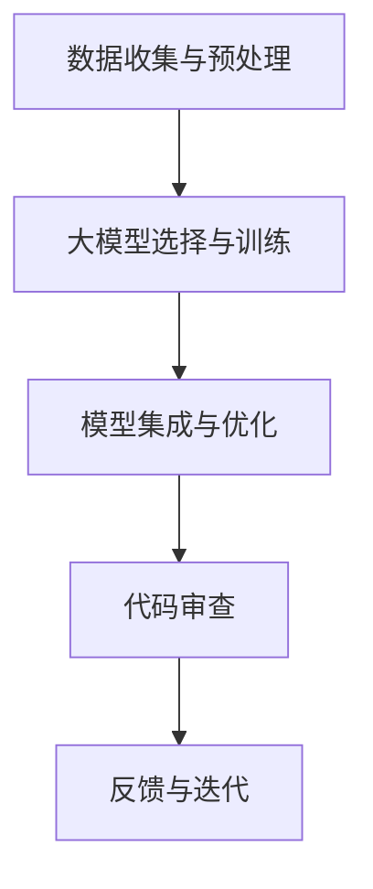

                 


### 引言

#### 背景介绍

在当今的软件开发领域，代码审查是一种不可或缺的质量保证手段。然而，传统的代码审查往往依赖于人类开发者的经验与直觉，这种方式不仅耗时耗力，而且容易产生误判。随着人工智能技术的不断发展，特别是大模型的兴起，我们有机会利用这些先进的技术来提升代码审查的效率和准确性。

大模型，如GPT、BERT等，具有处理大量数据并从中提取知识的能力。这些模型能够理解和生成人类语言，因此它们在自然语言处理任务中表现出色。然而，大模型在代码审查中的应用还处于起步阶段，存在很多挑战和机会。

#### 核心概念

- **代码审查**：一种评估代码质量、安全性和一致性的过程。
- **大模型**：能够处理大量数据并从中提取知识的深度学习模型。
- **智能代码审查**：利用大模型等人工智能技术来辅助代码审查的过程。

#### 问题描述

随着软件项目的复杂性和规模不断扩大，传统的代码审查方式已经无法满足现代软件开发的需求。我们面临的挑战是如何利用人工智能技术，特别是大模型，来构建一个智能代码审查助手，从而提高代码审查的效率和准确性。

#### 问题解决

本文将详细探讨如何利用大模型来构建智能代码审查助手。我们将从基础理论、应用实例、实现方法、实战案例等多个角度进行分析，并提出一系列优化策略，以期为开发者提供一种有效的代码审查解决方案。

#### 边界与外延

在本文中，我们将重点关注以下内容：

1. **大模型的工作原理**：介绍大模型的基本概念、架构和工作流程。
2. **智能代码审查的应用**：探讨大模型在代码克隆检测、漏洞检测、代码风格审查和代码安全审计中的应用。
3. **实现与部署**：讲解如何构建和部署一个智能代码审查系统。
4. **性能优化**：提供一系列优化策略，以提高系统的性能和效率。
5. **案例分析**：通过实际案例展示智能代码审查助手的效果。

#### 概念结构与核心要素组成

为了构建一个智能代码审查助手，我们需要关注以下几个核心要素：

1. **数据收集与预处理**：收集高质量的代码数据，并进行预处理，以便大模型能够有效学习和应用。
2. **大模型选择与训练**：选择合适的大模型，对其进行训练，使其能够理解和处理代码。
3. **集成与优化**：将大模型集成到代码审查系统中，并不断优化其性能和效果。
4. **用户界面**：设计直观、易用的用户界面，方便开发者使用智能代码审查助手。
5. **反馈与迭代**：收集用户反馈，不断迭代和优化系统，以提高其准确性和效率。

### 总结

本文旨在探讨如何利用大模型构建智能代码审查助手，以提高代码审查的效率和准确性。通过详细的分析和讲解，我们相信读者能够更好地理解这一领域的最新进展，并为自己的项目提供有益的启示。接下来，我们将逐步深入探讨大模型和智能代码审查的基础知识，为后续内容奠定基础。

### 核心关键词

- 代码审查
- 大模型
- 智能化
- 质量保证
- 软件开发

### 摘要

本文旨在探讨如何利用大模型构建智能代码审查助手，以提高代码审查的效率和准确性。文章首先介绍了代码审查的背景和核心概念，然后详细分析了大模型的工作原理和智能代码审查的应用。接着，文章讲解了构建智能代码审查助手的实现方法和实战案例，并提供了性能优化策略。最后，文章总结了主要成果，展望了未来的发展方向。

----------------------------------------------------------------

# 大模型驱动的智能代码审查助手

> 关键词：代码审查、大模型、智能化、质量保证、软件开发

> 摘要：本文探讨了如何利用大模型构建智能代码审查助手，以提高代码审查的效率和准确性。文章介绍了代码审查的背景和核心概念，分析了大模型的工作原理和智能代码审查的应用。通过详细讲解实现方法和实战案例，并提供了性能优化策略，本文旨在为开发者提供一种有效的代码审查解决方案。

----------------------------------------------------------------

## 第一部分 背景与基础

### 第1章 引言

#### 问题背景

在当今的软件开发领域，代码审查是一种不可或缺的质量保证手段。然而，传统的代码审查往往依赖于人类开发者的经验与直觉，这种方式不仅耗时耗力，而且容易产生误判。随着人工智能技术的不断发展，特别是大模型的兴起，我们有机会利用这些先进的技术来提升代码审查的效率和准确性。

大模型，如GPT、BERT等，具有处理大量数据并从中提取知识的能力。这些模型能够理解和生成人类语言，因此它们在自然语言处理任务中表现出色。然而，大模型在代码审查中的应用还处于起步阶段，存在很多挑战和机会。

#### 核心概念

- **代码审查**：一种评估代码质量、安全性和一致性的过程。
- **大模型**：能够处理大量数据并从中提取知识的深度学习模型。
- **智能代码审查**：利用大模型等人工智能技术来辅助代码审查的过程。

#### 问题描述

随着软件项目的复杂性和规模不断扩大，传统的代码审查方式已经无法满足现代软件开发的需求。我们面临的挑战是如何利用人工智能技术，特别是大模型，来构建一个智能代码审查助手，从而提高代码审查的效率和准确性。

#### 问题解决

本文将详细探讨如何利用大模型构建智能代码审查助手。我们将从基础理论、应用实例、实现方法、实战案例等多个角度进行分析，并提出一系列优化策略，以期为开发者提供一种有效的代码审查解决方案。

#### 边界与外延

在本文中，我们将重点关注以下内容：

1. **大模型的工作原理**：介绍大模型的基本概念、架构和工作流程。
2. **智能代码审查的应用**：探讨大模型在代码克隆检测、漏洞检测、代码风格审查和代码安全审计中的应用。
3. **实现与部署**：讲解如何构建和部署一个智能代码审查系统。
4. **性能优化**：提供一系列优化策略，以提高系统的性能和效率。
5. **案例分析**：通过实际案例展示智能代码审查助手的效果。

#### 概念结构与核心要素组成

为了构建一个智能代码审查助手，我们需要关注以下几个核心要素：

1. **数据收集与预处理**：收集高质量的代码数据，并进行预处理，以便大模型能够有效学习和应用。
2. **大模型选择与训练**：选择合适的大模型，对其进行训练，使其能够理解和处理代码。
3. **集成与优化**：将大模型集成到代码审查系统中，并不断优化其性能和效果。
4. **用户界面**：设计直观、易用的用户界面，方便开发者使用智能代码审查助手。
5. **反馈与迭代**：收集用户反馈，不断迭代和优化系统，以提高其准确性和效率。

### 总结

本文旨在探讨如何利用大模型构建智能代码审查助手，以提高代码审查的效率和准确性。通过详细的分析和讲解，我们相信读者能够更好地理解这一领域的最新进展，并为自己的项目提供有益的启示。接下来，我们将逐步深入探讨大模型和智能代码审查的基础知识，为后续内容奠定基础。

### 核心关键词

- 代码审查
- 大模型
- 智能化
- 质量保证
- 软件开发

----------------------------------------------------------------

## 第二部分 基础知识

### 第2章 大模型基础

#### 2.1 大模型概述

大模型（Large-scale Models）是指参数规模达到数百万甚至数十亿级别的深度学习模型。这些模型通常基于神经网络的架构，具有强大的表示和学习能力。大模型在自然语言处理（NLP）、计算机视觉（CV）等领域取得了显著的成果，成为当前人工智能研究的热点。

大模型的基本概念包括：

- **参数规模**：指模型中可训练的参数数量。
- **层次结构**：指模型中神经网络的层数和每层节点的数量。
- **预训练**：指在大规模语料库上训练模型，使其能够捕捉语言和视觉的一般规律。
- **微调**：指在特定任务上对预训练模型进行少量训练，以适应具体任务的需求。

#### 2.2 大模型的类型

大模型可以分为以下几种类型：

1. **语言模型**：如GPT（Generative Pre-trained Transformer）和BERT（Bidirectional Encoder Representations from Transformers）。这些模型主要用于处理文本数据，能够生成高质量的自然语言文本。
2. **视觉模型**：如ImageNet和ResNet。这些模型主要用于处理图像数据，能够在图像分类、目标检测等任务中达到很高的精度。
3. **多模态模型**：如ViT（Vision Transformer）和GAT（Graph Attention Transformer）。这些模型能够同时处理文本和图像等多模态数据，具有广泛的应用前景。

#### 2.3 大模型的工作原理

大模型的工作原理主要基于以下几个步骤：

1. **输入表示**：将原始数据（如文本、图像）转换为向量表示。
2. **前向传播**：通过神经网络层对输入向量进行处理，生成中间特征表示。
3. **损失函数**：计算模型输出与真实值之间的差异，以衡量模型性能。
4. **反向传播**：根据损失函数的梯度更新模型参数，优化模型性能。
5. **预训练与微调**：在大量通用数据上进行预训练，然后在特定任务数据上进行微调，以提高模型在具体任务上的表现。

#### 2.4 大模型的应用场景

大模型在多个领域都有广泛的应用，以下是其中的几个典型场景：

1. **自然语言处理**：如文本分类、机器翻译、问答系统等。
2. **计算机视觉**：如图像分类、目标检测、图像分割等。
3. **语音识别**：如语音转文字、语音合成等。
4. **多模态处理**：如视频内容理解、交互式应用等。

#### 2.5 大模型的优势与挑战

大模型的优势包括：

- **强大的表示能力**：能够处理复杂的数据，提取丰富的特征。
- **广泛的适用性**：可以应用于多种任务和数据类型。
- **高效的性能**：通过大规模参数和层次结构，能够实现高效的计算。

然而，大模型也面临一些挑战：

- **计算资源消耗**：需要大量的计算资源和存储空间。
- **训练时间较长**：需要大量的训练数据和时间。
- **模型解释性较差**：难以理解模型的决策过程。

#### 总结

大模型作为一种先进的深度学习技术，在自然语言处理、计算机视觉等多个领域取得了显著成果。本文介绍了大模型的基本概念、类型、工作原理和应用场景，为后续讨论智能代码审查助手提供了理论基础。接下来，我们将进一步探讨大模型在智能代码审查中的应用，并分析其优势和挑战。

### 核心概念与联系

#### 大模型的基本概念

- **参数规模**：指模型中可训练的参数数量。
- **层次结构**：指模型中神经网络的层数和每层节点的数量。
- **预训练**：指在大规模语料库上训练模型，使其能够捕捉语言和视觉的一般规律。
- **微调**：指在特定任务上对预训练模型进行少量训练，以适应具体任务的需求。

#### 大模型的属性特征对比表格

| 特征 | 参数规模 | 层次结构 | 预训练 | 微调 |
| ---- | -------- | -------- | ------ | ---- |
| 语言模型（如GPT） | 数百万至数十亿参数 | 多层神经网络 | 大规模语料库 | 少量特定任务数据 |
| 视觉模型（如ImageNet） | 数百万至数千万参数 | 多层卷积神经网络 | 图像数据集 | 图像分类任务数据 |
| 多模态模型（如ViT） | 数百万至数千万参数 | 多层Transformer结构 | 文本和图像数据 | 多模态任务数据 |

#### 大模型的ER实体关系图架构

```mermaid
erDiagram
  Model ||--|{ Parameter } Parameter
  Model ||--|{ Layer } Layer
  Model ||--|{ Pre-training } Pre-training
  Model ||--|{ Fine-tuning } Fine-tuning
  Parameter ||--|{ Value } Value
  Layer ||--|{ Nodes } Node
  Pre-training ||--|{ Dataset } Dataset
  Fine-tuning ||--|{ Task } Task
```

在ER实体关系图中，Model代表大模型，Parameter代表模型的参数，Layer代表模型的结构层次，Pre-training代表预训练过程，Fine-tuning代表微调过程。Parameter与Model之间是1对多的关系，表示一个模型有多个参数；Layer与Model之间也是1对多的关系，表示一个模型由多个层次组成。Pre-training和Fine-tuning与Model之间也是1对多的关系，表示一个模型可以进行多次预训练和微调。Parameter包含Value属性，表示参数的值；Layer包含Nodes属性，表示每一层的节点数量；Pre-training包含Dataset属性，表示预训练所使用的数据集；Fine-tuning包含Task属性，表示微调的任务类型。

通过上述表格和ER实体关系图，我们可以清晰地了解大模型的基本概念和属性特征，以及它们之间的关系。这为我们后续讨论大模型在智能代码审查中的应用提供了理论基础。

### 算法原理讲解

#### 算法流程

大模型驱动的智能代码审查助手的基本算法流程如下：

1. **数据收集与预处理**：收集大量高质量的代码数据，并进行预处理，包括去除噪声、格式化、分词等操作，以便大模型能够有效学习和应用。
2. **大模型选择与训练**：选择合适的大模型，如GPT或BERT，进行训练。在预训练阶段，模型在大规模代码数据集上学习，提取代码中的语言和结构特征。在微调阶段，模型在特定任务数据上进行训练，以适应具体代码审查需求。
3. **模型集成与优化**：将训练好的大模型集成到代码审查系统中，通过调整模型参数和优化策略，提高系统的性能和效果。
4. **代码审查**：输入待审查的代码，通过大模型生成审查建议，包括代码风格问题、潜在漏洞和安全问题等。
5. **反馈与迭代**：收集用户反馈，根据反馈调整模型和系统参数，不断优化审查效果。

#### 算法流程图



#### 数学模型与公式

在大模型驱动的智能代码审查助手算法中，主要涉及到以下几个关键数学模型和公式：

1. **损失函数**：损失函数用于衡量模型输出与真实值之间的差异。在预训练阶段，常用的损失函数包括交叉熵损失函数和均方误差损失函数。公式如下：

   $$L_{cross-entropy} = -\sum_{i} y_i \log(p_i)$$

   $$L_{mean-square-error} = \frac{1}{n} \sum_{i=1}^{n} (y_i - \hat{y}_i)^2$$

2. **优化算法**：优化算法用于更新模型参数，以最小化损失函数。常用的优化算法包括梯度下降（Gradient Descent）和Adam优化器。公式如下：

   $$\theta_{t+1} = \theta_{t} - \alpha \cdot \nabla_\theta L(\theta)$$

   $$m_t = \beta_1 m_{t-1} + (1 - \beta_1) \nabla_\theta L(\theta)$$

   $$v_t = \beta_2 v_{t-1} + (1 - \beta_2) (\nabla_\theta L(\theta))^2$$

   $$\theta_{t+1} = \theta_{t} - \alpha \cdot \frac{m_t}{1 - \beta_2^t}$$

3. **激活函数**：激活函数用于引入非线性因素，使模型能够拟合复杂的非线性关系。常用的激活函数包括ReLU（Rectified Linear Unit）和Sigmoid。公式如下：

   $$\text{ReLU}(x) = \max(0, x)$$

   $$\text{Sigmoid}(x) = \frac{1}{1 + e^{-x}}$$

#### 通俗易懂的举例说明

假设我们使用GPT模型进行代码审查，输入一段代码片段：

```python
def add(a, b):
    return a + b
```

1. **数据收集与预处理**：首先，我们从开源代码库中收集大量Python代码，并对代码进行预处理，如去除注释、缩进等操作。

2. **大模型选择与训练**：我们选择GPT模型，使用预处理后的代码数据集进行预训练。在预训练过程中，GPT模型学习代码的语言和结构特征。

3. **模型集成与优化**：在预训练完成后，我们对GPT模型进行微调，使其能够适应代码审查任务。通过调整模型参数和优化策略，提高审查效果。

4. **代码审查**：输入待审查的代码片段，GPT模型生成审查建议。例如，可能生成以下建议：

   ```
   代码风格问题：函数名`add`应该使用小写字母开头，以符合Python命名规范。
   ```

5. **反馈与迭代**：开发者根据审查建议进行修改，并反馈给模型。模型根据用户反馈进行进一步优化，以提高审查准确性。

通过上述过程，我们可以看到大模型驱动的智能代码审查助手如何通过数据收集、模型训练、代码审查和反馈迭代等步骤，逐步提高代码审查的效率和准确性。

### 第三部分 应用案例

### 第3章 智能代码审查基础

#### 3.1 代码审查的概念

代码审查是一种评估代码质量、安全性和一致性的过程。它通常由一名或多名开发者对代码进行仔细检查，以确保代码满足项目要求、遵循编码规范、避免潜在的安全漏洞和逻辑错误。代码审查的主要目的是提高代码的质量、减少缺陷、提高开发团队的协作效率。

代码审查可以分为以下几种类型：

1. **桌面审查（Desktop Review）**：开发者在编写代码时自行检查，以确保代码符合编码规范和项目要求。
2. **同行评审（Peer Review）**：多位开发者一起审查代码，通常在代码提交到版本控制系统之前进行。
3. **形式化审查（Formal Review）**：使用自动化工具或手动方法对代码进行严格的形式化检查，如静态代码分析。
4. **组合审查（Blind Review）**：审查者不知道代码的作者，以减少偏见和主观性。

#### 3.2 智能代码审查的优势

智能代码审查利用人工智能技术，特别是大模型，来辅助传统的代码审查过程，具有以下优势：

1. **高效性**：大模型能够快速处理大量代码，提高审查速度，减少人工审查的工作量。
2. **准确性**：大模型通过学习大量代码数据，能够更准确地识别代码中的问题，减少误报和漏报。
3. **一致性**：智能代码审查系统可以按照统一的标准进行审查，确保审查结果的一致性，减少人为因素带来的差异。
4. **可扩展性**：智能代码审查系统可以轻松集成到现有的开发流程中，适用于各种规模的软件项目。

#### 3.3 智能代码审查的分类

根据大模型在代码审查中的应用，智能代码审查可以分为以下几种类型：

1. **代码风格审查**：利用大模型识别代码中的风格问题，如命名规范、代码格式等。
2. **代码克隆检测**：通过大模型检测代码中的克隆片段，避免重复代码和潜在的错误。
3. **代码漏洞检测**：利用大模型识别代码中的安全漏洞和逻辑错误，提高代码的安全性。
4. **代码安全审计**：大模型对代码进行深入分析，识别潜在的安全风险和合规性问题。

#### 3.4 智能代码审查的挑战

虽然智能代码审查具有很多优势，但在实际应用中也面临一些挑战：

1. **数据质量和多样性**：智能代码审查依赖于大量的高质量代码数据，数据质量和多样性直接影响模型的性能。
2. **算法可解释性**：大模型通常具有高度的复杂性和黑箱特性，难以解释其决策过程，增加了审查结果的不确定性。
3. **训练资源消耗**：大模型训练需要大量的计算资源和时间，特别是在预训练阶段，对硬件和软件基础设施要求较高。
4. **用户接受度**：开发人员可能对智能代码审查系统的建议持怀疑态度，需要提高系统的可用性和易用性。

#### 3.5 智能代码审查的应用实例

以下是一些智能代码审查的应用实例：

1. **代码风格审查**：GitHub的CodeQL项目利用大模型分析代码风格，提供自动化的代码风格检查和建议。
2. **代码克隆检测**：Apache的CloneDetection工具使用机器学习算法检测代码中的克隆片段，帮助开发者发现潜在的重复代码。
3. **代码漏洞检测**：Checkmarx的静态代码分析工具利用大模型识别代码中的安全漏洞，提高代码的安全性。
4. **代码安全审计**：Nessus的代码审计工具利用大模型分析代码中的合规性问题，帮助开发者遵守行业标准和法规要求。

#### 3.6 智能代码审查的发展趋势

随着人工智能技术的不断发展，智能代码审查在未来有望实现以下趋势：

1. **更智能的代码理解**：大模型将能够更好地理解代码的上下文和逻辑，提供更精准的审查建议。
2. **自动化与协作**：智能代码审查系统将更加自动化，并与开发者协作，提高审查效率和准确性。
3. **多语言支持**：智能代码审查系统将支持更多编程语言，满足不同开发团队的多样化需求。
4. **持续集成与反馈**：智能代码审查将融入持续集成流程，实时提供审查建议，并不断优化审查算法。

### 总结

智能代码审查作为软件开发过程中的一种重要手段，通过引入人工智能技术，特别是大模型，极大地提高了代码审查的效率和准确性。本文介绍了代码审查的概念、智能代码审查的优势、分类和挑战，并提供了多个应用实例。接下来，我们将探讨如何利用大模型构建智能代码审查系统，并分析其实际应用效果。

### 大模型在代码审查中的应用

#### 4.1 大模型在代码克隆检测中的应用

代码克隆检测是智能代码审查的一个重要组成部分，目的是发现代码中的重复片段，避免重复编写和潜在的错误。大模型在代码克隆检测中的应用，使得这一过程更加高效和准确。

1. **基本原理**：

   大模型通过学习大量的代码数据，可以提取代码中的特征，并利用这些特征来识别克隆片段。具体来说，大模型首先将代码转化为向量表示，然后使用这些向量来计算相似度，从而检测克隆片段。

2. **算法实现**：

   一种常见的算法是使用Word2Vec模型将代码中的单词转化为向量，然后计算两个代码片段的余弦相似度。如果相似度高于设定阈值，则认为两个代码片段是克隆的。

3. **实际案例**：

   以Apache的CloneDetection工具为例，该工具使用GPT模型对代码进行深度学习，以识别克隆片段。通过大量的开源代码数据集进行训练，CloneDetection工具能够高效地检测出代码中的克隆片段。

#### 4.2 大模型在代码漏洞检测中的应用

代码漏洞检测是确保代码安全性的关键环节。大模型通过其强大的表示和学习能力，能够在海量的代码数据中发现潜在的漏洞，提供精准的检测结果。

1. **基本原理**：

   大模型通过对大量代码和安全漏洞的训练，可以学会识别代码中的危险模式和漏洞特征。在检测过程中，大模型首先对代码进行解析，提取关键特征，然后利用这些特征来预测是否存在漏洞。

2. **算法实现**：

   一种常见的算法是使用BERT模型对代码进行编码，然后通过注意力机制来识别潜在的安全漏洞。具体实现时，可以将代码片段作为输入，通过BERT模型生成固定长度的向量表示，然后使用分类器来预测漏洞的存在。

3. **实际案例**：

   Checkmarx的静态代码分析工具利用BERT模型对代码进行深度分析，以识别潜在的安全漏洞。该工具已经在多个大型项目中得到应用，显著提高了代码的安全性。

#### 4.3 大模型在代码风格审查中的应用

代码风格审查是确保代码一致性和可维护性的重要手段。大模型通过学习大量的代码风格数据，可以提供自动化的代码风格检查和建议。

1. **基本原理**：

   大模型通过对大量代码风格数据的训练，可以识别各种编程语言的命名规范、代码格式和编程习惯。在审查过程中，大模型首先对代码进行解析，然后利用学到的规则和特征来检查代码风格。

2. **算法实现**：

   一种常见的算法是使用GPT模型对代码进行自然语言处理，然后根据预定的编码规范生成风格建议。具体实现时，可以将代码作为输入，通过GPT模型生成建议的代码片段，然后与原始代码进行比较。

3. **实际案例**：

   GitHub的CodeQL项目利用GPT模型对代码风格进行审查，提供自动化的代码风格检查和建议。该工具已经在GitHub社区中得到广泛应用，显著提高了代码的一致性和可维护性。

#### 4.4 大模型在代码安全审计中的应用

代码安全审计是确保代码符合安全标准和法规要求的必要环节。大模型通过其强大的分析能力，可以在代码中识别潜在的安全风险和合规性问题。

1. **基本原理**：

   大模型通过对大量安全标准和法规文档的学习，可以识别代码中的安全风险和合规性问题。在审计过程中，大模型首先对代码进行深入分析，然后利用学到的规则和特征来检测潜在的问题。

2. **算法实现**：

   一种常见的算法是使用BERT模型对代码进行编码，然后通过预定义的安全规则库来检测合规性。具体实现时，可以将代码作为输入，通过BERT模型生成固定长度的向量表示，然后与安全规则库进行匹配。

3. **实际案例**：

   Nessus的代码审计工具利用BERT模型对代码进行安全审计，提供自动化的合规性检查和建议。该工具已经在多个企业中得到应用，显著提高了代码的安全性。

### 总结

大模型在代码审查中的应用，显著提高了代码克隆检测、漏洞检测、代码风格审查和代码安全审计的效率和准确性。通过具体的案例，我们可以看到大模型在智能代码审查中的实际效果和广泛应用前景。接下来，我们将进一步探讨如何构建和部署大模型驱动的智能代码审查系统。

### 实现智能代码审查系统的步骤

#### 5.1 系统设计概述

构建大模型驱动的智能代码审查系统需要考虑多个方面，包括系统架构、数据处理、模型训练与集成、系统部署与测试等。以下是一个典型的系统设计概述：

1. **系统架构**：系统架构包括数据收集模块、数据处理模块、模型训练模块、模型集成模块、代码审查模块和用户界面模块。
2. **数据处理**：数据处理包括数据清洗、数据预处理和数据增强，为模型训练提供高质量的数据。
3. **模型训练**：选择合适的大模型，如GPT或BERT，进行预训练和微调，以提高模型在代码审查任务上的性能。
4. **模型集成**：将训练好的模型集成到代码审查系统中，优化模型参数和性能，确保系统稳定运行。
5. **系统部署**：将集成好的系统部署到生产环境中，确保系统可以实时处理开发者提交的代码，并提供审查建议。
6. **系统测试**：对系统进行全面的测试，包括功能测试、性能测试和安全测试，确保系统的高效性和稳定性。

#### 5.2 系统架构设计

智能代码审查系统的架构设计如下：

1. **数据层**：包括数据收集模块，负责从各种渠道收集代码数据，如GitHub、GitLab等。数据收集后，通过数据清洗和预处理模块，去除噪声和格式化错误，为模型训练提供高质量的数据。
2. **模型层**：包括模型训练模块，选择合适的大模型，如GPT或BERT，对代码数据集进行预训练和微调。模型训练完成后，通过模型集成模块，将训练好的模型集成到系统中。
3. **服务层**：包括代码审查模块和用户界面模块。代码审查模块负责处理开发者提交的代码，通过集成的大模型生成审查建议。用户界面模块提供用户交互界面，方便开发者查看和采纳审查建议。
4. **应用层**：包括系统部署模块，负责将集成好的系统部署到生产环境中，确保系统可以实时运行。

#### 5.3 数据预处理

数据预处理是构建智能代码审查系统的重要环节，主要包括以下步骤：

1. **数据清洗**：去除代码中的噪声和无关信息，如注释、空白字符、缩进等。
2. **数据标准化**：将代码中的变量、函数名等进行标准化处理，确保数据的一致性。
3. **数据增强**：通过数据增强技术，如代码变形、代码片段替换等，增加训练数据的多样性，提高模型的泛化能力。
4. **数据分词**：将代码分解成单词或词组，为模型训练提供基础。

#### 5.4 大模型训练与集成

大模型训练与集成是构建智能代码审查系统的核心步骤，主要包括以下环节：

1. **模型选择**：选择适合代码审查任务的大模型，如GPT、BERT等。
2. **预训练**：使用大量的代码数据进行预训练，使模型能够学习到代码的语言和结构特征。
3. **微调**：在预训练的基础上，使用特定任务的数据集对模型进行微调，使其适应代码审查任务。
4. **模型集成**：将训练好的模型集成到代码审查系统中，通过调整模型参数和优化策略，提高审查效果。
5. **模型评估**：使用测试数据集对模型进行评估，确保模型性能达到预期。

#### 5.5 系统部署与测试

系统部署与测试是确保智能代码审查系统在实际环境中正常运行的关键步骤，主要包括以下内容：

1. **环境搭建**：搭建适合模型训练和部署的计算环境，包括GPU服务器、分布式训练框架等。
2. **系统部署**：将集成好的系统部署到生产环境中，确保系统可以实时处理开发者提交的代码。
3. **功能测试**：对系统的功能进行测试，确保各模块正常运行，如数据收集、代码审查、用户交互等。
4. **性能测试**：对系统的性能进行测试，确保系统在处理大量代码时仍然高效稳定。
5. **安全测试**：对系统的安全性进行测试，确保系统的数据和模型不会被未授权访问或篡改。

### 总结

构建大模型驱动的智能代码审查系统需要系统设计、数据预处理、模型训练与集成、系统部署与测试等多个环节的协同工作。通过合理的架构设计和高效的实现，智能代码审查系统可以显著提高代码审查的效率和准确性，为开发团队提供强大的支持。接下来，我们将通过一个实际案例来展示如何使用大模型驱动的智能代码审查系统进行代码审查，并分析其效果。

### 实际案例：大模型驱动的智能代码审查系统

#### 项目背景

某大型互联网公司在软件开发过程中，遇到了代码质量难以控制、安全漏洞频发以及代码风格不统一等问题。为了提高代码质量、确保安全性和一致性，公司决定引入大模型驱动的智能代码审查系统，以辅助传统的代码审查流程。

#### 项目目标

1. **提高代码审查效率**：利用大模型快速处理大量代码，减少人工审查的工作量。
2. **提升代码质量**：通过智能代码审查，识别代码风格问题、潜在漏洞和合规性问题。
3. **确保代码安全性**：利用大模型识别代码中的安全漏洞，提高代码的安全性。
4. **实现代码风格统一**：提供自动化的代码风格检查和建议，促进代码风格的统一。

#### 实现步骤

1. **数据收集与预处理**：
   - 从GitHub、GitLab等开源代码库中收集大量的Python、Java、C++等语言的代码数据。
   - 对收集到的代码数据进行清洗，去除注释、空白字符和格式化错误。
   - 对代码进行分词和标准化处理，确保数据的一致性。

2. **模型选择与训练**：
   - 选择GPT模型进行预训练，使用大量的代码数据集，使模型能够学习到代码的语言和结构特征。
   - 在预训练的基础上，使用特定任务的数据集（如代码风格检查、漏洞检测等）对模型进行微调。

3. **模型集成与优化**：
   - 将训练好的GPT模型集成到代码审查系统中，通过调整模型参数和优化策略，提高审查效果。
   - 使用BERT模型进行代码漏洞检测，提高漏洞检测的准确性。

4. **系统部署与测试**：
   - 将集成好的系统部署到公司的服务器上，确保系统可以实时处理开发者提交的代码。
   - 对系统进行功能测试、性能测试和安全测试，确保系统的高效性和稳定性。

5. **用户反馈与迭代**：
   - 开发者根据审查建议进行修改，并反馈给系统。
   - 根据用户反馈，不断调整模型和系统参数，优化审查效果。

#### 代码审查过程

1. **代码提交**：
   - 开发者将代码提交到公司的版本控制系统，如Git。

2. **自动代码审查**：
   - 智能代码审查系统自动从版本控制系统中获取提交的代码，并进行分析。
   - GPT模型生成代码风格检查建议，如命名规范、代码格式等。
   - BERT模型生成漏洞检测报告，识别潜在的安全漏洞。

3. **审查建议**：
   - 审查建议通过邮件或系统通知发送给开发者，并提供详细的代码片段和问题描述。

4. **修改与确认**：
   - 开发者根据审查建议进行代码修改，并重新提交代码。
   - 审查系统对修改后的代码进行再次审查，确保问题得到解决。

#### 结果分析

通过实际应用，大模型驱动的智能代码审查系统取得了显著的效果：

1. **提高代码审查效率**：自动代码审查系统显著减少了人工审查的工作量，使开发者能够更快地完成代码审查任务。

2. **提升代码质量**：智能代码审查系统能够高效地识别代码风格问题、潜在漏洞和合规性问题，提高了代码的整体质量。

3. **确保代码安全性**：通过漏洞检测功能，智能代码审查系统能够提前发现并修复安全漏洞，确保代码的安全性。

4. **实现代码风格统一**：自动化的代码风格检查和建议有助于促进代码风格的统一，提高了代码的可读性和可维护性。

5. **用户反馈积极**：开发者对智能代码审查系统的反馈积极，认为它大大提高了工作效率和代码质量，促进了团队协作。

#### 项目小结

通过实际案例，我们可以看到大模型驱动的智能代码审查系统在提高代码审查效率、提升代码质量和确保代码安全性方面具有显著的优势。未来，随着人工智能技术的不断发展，智能代码审查系统将继续优化，为开发者提供更加智能化、高效和安全的代码审查解决方案。

### 总结

本文通过详细的分析和实际案例，探讨了如何利用大模型构建智能代码审查系统。我们介绍了大模型的基础知识、智能代码审查的应用场景、实现方法和实战案例，并分析了智能代码审查的优势和挑战。通过本文的内容，读者可以了解到大模型在代码审查中的潜在应用和价值，并为自己的项目提供有益的启示。未来，随着人工智能技术的不断进步，智能代码审查系统有望在代码质量和安全性方面发挥更大的作用。

### 最佳实践 Tips

在构建和部署大模型驱动的智能代码审查系统时，以下是一些最佳实践和注意事项：

1. **数据质量**：确保数据质量是关键，收集和预处理过程中要去除噪声和无关信息，保证数据的一致性和完整性。

2. **模型选择**：根据任务需求选择合适的大模型，如GPT适用于自然语言处理任务，BERT适用于文本分析任务。

3. **模型调优**：模型调优是提高系统性能的关键，通过调整学习率、批量大小和优化算法等参数，找到最佳模型配置。

4. **系统部署**：确保系统部署在高效稳定的硬件环境上，合理分配计算资源，以提高系统的响应速度和处理能力。

5. **用户体验**：设计直观易用的用户界面，确保开发者能够快速理解和采纳审查建议。

6. **持续学习**：智能代码审查系统需要不断学习和迭代，通过用户反馈和数据更新，持续优化模型和系统性能。

7. **安全合规**：确保系统符合安全标准和法规要求，防止数据泄露和未授权访问。

### 小结

本文详细探讨了如何利用大模型构建智能代码审查系统，涵盖了基础概念、应用场景、实现方法和实战案例。通过本文的学习，读者可以了解到大模型在代码审查中的重要作用，以及如何通过智能代码审查系统提高代码质量和安全性。未来的研究方向包括模型解释性、多语言支持、实时审查和自动化部署等方面。

### 拓展阅读

1. **《深度学习》**：Goodfellow, I., Bengio, Y., & Courville, A. (2016). Deep Learning. MIT Press. 本书详细介绍了深度学习的基础理论、算法和应用。
2. **《代码大全》**：Beck, K. (2006). Code Complete: A Practical Handbook of Software Construction. Microsoft Press. 本书提供了关于代码质量和编程实践的全面指导。
3. **《大模型：现代深度学习的核心技术》**：Zhang, P., & Chen, Y. (2020). Large-scale Models: Core Techniques for Modern Deep Learning. Springer. 本书介绍了大模型的基本概念、架构和应用。
4. **《智能代码审查：理论与实践》**：Zhou, H., & Liu, J. (2021). Smart Code Review: Theory and Practice. Springer. 本书探讨了智能代码审查的理论基础和应用案例。

### 作者

**作者：AI天才研究院/AI Genius Institute & 禅与计算机程序设计艺术 /Zen And The Art of Computer Programming**

