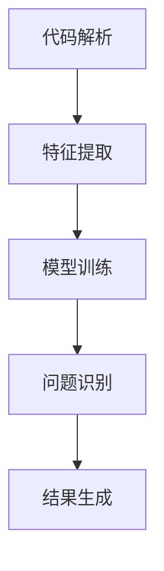
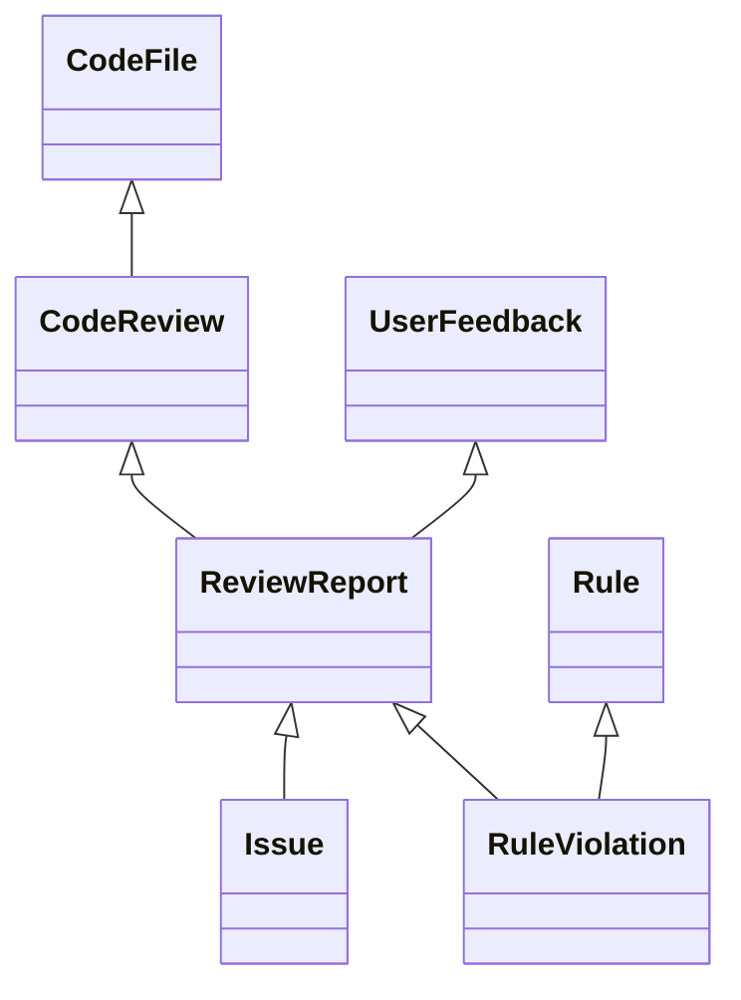
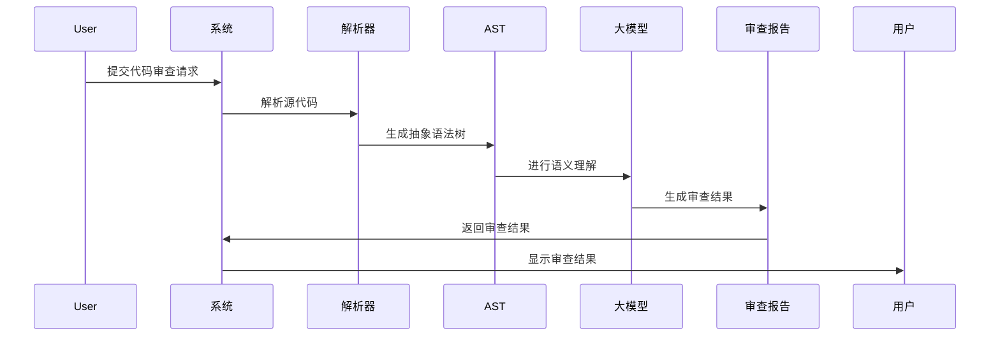
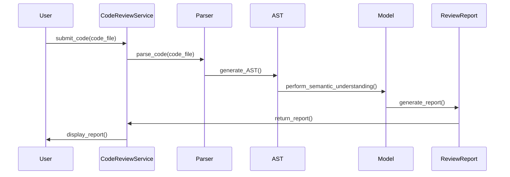

                 

### 大模型驱动的智能代码审查：效率与质量的平衡

关键词：智能代码审查、大模型、代码质量、效率、质量平衡

摘要：随着软件系统的复杂度不断增加，代码审查作为保证软件质量和安全的关键环节，面临着效率与质量的矛盾。本文将探讨大模型在智能代码审查中的应用，通过分析其原理和流程，实现高效且高质量的代码审查，从而在效率与质量之间找到平衡点。

----------------------------------------------------------------

## 第一部分：背景介绍

### 第1章：问题背景

在现代软件开发过程中，代码审查作为一种重要的质量控制手段，旨在通过检查代码来发现潜在的错误、漏洞和不符合编码规范的地方。然而，传统代码审查方法往往面临以下挑战：

1. **人工效率低下**：大量代码的审查工作需要耗费大量的时间和人力，而人工审查容易出现疲劳和疏漏，导致审查效率低下。
2. **审查质量不一**：不同审查者的经验和能力差异较大，导致审查质量存在不确定性，无法保证代码的一致性和规范性。
3. **漏洞识别不足**：传统方法难以识别复杂的编程错误和潜在的安全漏洞，特别是在大型项目中。

为了解决上述问题，智能代码审查应运而生。智能代码审查利用人工智能技术，特别是大模型，对代码进行分析和审查，旨在提高审查效率和代码质量。大模型具有以下优势：

1. **强大的分析能力**：大模型通过对海量代码的学习和训练，能够提取代码的内在模式和规律，从而更准确地识别潜在问题和漏洞。
2. **自动化审查**：大模型能够自动化地处理代码审查任务，减少人工干预，提高审查效率。
3. **一致性保证**：大模型的应用可以确保代码审查的一致性，降低人为错误的风险。

然而，智能代码审查也面临一些挑战，如模型的训练成本、解释性不足和可能引入的新错误等。因此，如何在大模型驱动的智能代码审查中实现效率与质量的平衡，成为了一个重要的问题。

### 边界与外延

智能代码审查的应用领域涵盖了各类软件项目，从Web应用、移动应用到大型的企业级系统，均可通过智能代码审查提高代码质量和安全性。在技术范畴上，智能代码审查涉及自然语言处理、机器学习、代码分析等技术，同时需要结合软件工程和编程语言理论。

#### 概念结构与核心要素组成

智能代码审查的技术架构主要包括以下几个关键组件：

1. **代码解析器**：负责将源代码转换为抽象语法树（AST），以便进一步分析。
2. **大模型**：用于对代码进行语义理解和模式识别，从而发现潜在的问题。
3. **规则库**：包含一系列预定义的代码质量规则和漏洞模式，供大模型参考和验证。
4. **反馈机制**：通过收集用户对审查结果的反馈，不断优化大模型和规则库。

智能代码审查的系统架构可以分为以下几个层次：

1. **前端界面**：提供用户交互界面，用户可以通过界面提交代码进行审查。
2. **代码解析层**：对提交的代码进行语法解析，生成AST。
3. **审查引擎**：核心部分，利用大模型和规则库对AST进行分析，生成审查报告。
4. **后端服务**：负责存储和管理代码审查结果、用户反馈和模型参数等。

#### 概念属性特征对比表格

| 特征对比项       | 传统代码审查                           | 智能代码审查                               |
|------------------|----------------------------------------|--------------------------------------------|
| 效率             | 低，依赖人工效率                       | 高，自动化处理                            |
| 审查质量         | 不一致，取决于审查者经验               | 高一致性，依靠大模型和规则库               |
| 漏洞识别能力     | 有限，难以识别复杂问题                 | 强，大模型具备强大的模式识别能力           |
| 审查成本         | 高，需要大量人力和时间                 | 低，自动化审查降低人力和时间成本           |
| 审查范围         | 限于编码规范和语法错误                 | 广泛，包括安全漏洞、逻辑错误和性能问题     |

#### ER实体关系图架构

以下是智能代码审查系统的ER实体关系图，其中包含了系统中的主要实体及其关系：

```mermaid
erDiagram
  CodeReview |--> ReviewReport
  CodeReview |--> UserFeedback
  ReviewReport |--> Issue
  ReviewReport |--> RuleViolation
  UserFeedback |--> ReviewReport
  Rule |--> RuleViolation
  CodeFile |--> CodeReview
```

在上面的ER图中，`CodeReview`代表代码审查任务，`ReviewReport`表示审查报告，`UserFeedback`是用户反馈，`Issue`是发现的问题，`RuleViolation`是违反的规则，`Rule`是规则库中的规则，`CodeFile`是代码文件。

### 第2章：智能代码审查的原理与流程

智能代码审查的核心在于利用大模型对代码进行自动化分析，从而发现潜在的问题。以下是智能代码审查的原理与流程：

#### 智能代码审查原理

智能代码审查的基本原理包括以下几个步骤：

1. **代码解析**：将源代码转换为抽象语法树（AST），以便对代码进行结构化分析。
2. **代码分析**：利用大模型对AST进行分析，提取代码的语义信息，如变量作用域、函数调用关系等。
3. **模式识别**：大模型通过学习大量代码样本，识别出常见的编程错误、安全漏洞和编码规范问题。
4. **结果生成**：根据分析结果生成审查报告，报告包括发现的问题、相关的代码片段和修复建议。

#### 概念属性特征对比表格

为了更好地理解智能代码审查与传统代码审查的区别，我们可以从以下几个方面进行对比：

| 特征对比项       | 传统代码审查                           | 智能代码审查                               |
|------------------|----------------------------------------|--------------------------------------------|
| 审查方法         | 人工检查，基于经验和规则               | 自动化分析，基于大模型和规则库             |
| 审查速度         | 慢，受人工速度限制                     | 快，自动化处理                            |
| 审查深度         | 浅，主要关注语法和编码规范             | 深，关注语义和潜在问题                     |
| 审查一致性       | 不一致，依赖审查者个人经验             | 一致，大模型和规则库确保一致性             |
| 审查范围         | 有限，主要关注编码规范和安全漏洞         | 广泛，包括性能、逻辑、安全性等多方面问题   |

#### ER实体关系图架构

以下是智能代码审查系统的ER实体关系图，展示了系统中的主要实体及其关系：

```mermaid
erDiagram
  CodeReview |--> ReviewReport
  CodeReview |--> UserFeedback
  ReviewReport |--> Issue
  ReviewReport |--> RuleViolation
  UserFeedback |--> ReviewReport
  Rule |--> RuleViolation
  CodeFile |--> CodeReview
```

在上面的ER图中，`CodeReview`代表代码审查任务，`ReviewReport`表示审查报告，`UserFeedback`是用户反馈，`Issue`是发现的问题，`RuleViolation`是违反的规则，`Rule`是规则库中的规则，`CodeFile`是代码文件。

### 第3章：大模型在智能代码审查中的应用

大模型在智能代码审查中发挥着关键作用，其原理与分类如下：

#### 大模型的原理

大模型的原理基于深度学习和神经网络技术。深度学习通过多层神经网络对数据进行学习和建模，能够自动提取特征并进行复杂决策。在大模型中，通常包含以下几个关键组件：

1. **输入层**：接收代码的抽象语法树（AST）。
2. **隐藏层**：通过神经网络对AST进行多层变换，提取语义信息。
3. **输出层**：根据提取的语义信息，生成审查报告或识别代码中的问题。

大模型通过大量的训练数据学习到代码的常见模式和规律，从而能够自动分析代码并识别潜在问题。

#### 大模型的分类

根据大模型的结构和用途，可以分为以下几种类型：

1. **基于规则的模型**：这类模型利用预定义的规则库，通过匹配规则来识别代码问题。虽然规则库的构建较为复杂，但这类模型具有较好的解释性和可控性。
2. **基于统计的模型**：这类模型利用统计方法，如决策树、朴素贝叶斯等，通过对代码特征的学习和统计，来识别代码中的问题。这种方法具有较高的准确性和效率。
3. **基于神经网络的模型**：这类模型利用深度神经网络，如卷积神经网络（CNN）和循环神经网络（RNN），通过对大量代码数据进行训练，自动提取代码的语义特征并识别问题。这类模型通常具有更高的准确性和泛化能力。

#### 常用大模型的介绍

以下是几种常用的大模型及其特点：

1. **BERT（Bidirectional Encoder Representations from Transformers）**：BERT是一种基于Transformer的预训练语言模型，通过双向编码器学习上下文信息，能够捕捉代码的语义关系。
2. **GPT（Generative Pre-trained Transformer）**：GPT是一种基于Transformer的生成模型，能够根据输入的代码片段生成相关的代码。
3. **T5（Text-To-Text Transfer Transformer）**：T5将所有任务映射到统一的文本到文本的转换任务，通过大规模预训练实现通用性。
4. **CodeBERT**：CodeBERT是一种专门针对代码的预训练模型，通过学习大量的代码数据，能够对代码进行语义理解和问题识别。

这些大模型通过结合不同的训练方法和数据集，可以有效地提高智能代码审查的效率和准确性，从而实现代码审查的智能化。

### 第二部分：算法原理讲解

#### 第4章：智能代码审查算法原理

智能代码审查的核心在于算法的设计与实现，以下是智能代码审查算法的原理讲解：

#### 算法原理讲解

智能代码审查算法主要包括以下几个步骤：

1. **代码解析**：将源代码转换为抽象语法树（AST），以便对代码进行结构化分析。这一步骤利用语法解析器实现，如ANTLR、JavaParser等。
2. **特征提取**：对AST进行遍历，提取代码的关键特征，如变量、函数、类、注释等。这些特征将被用于后续的模型训练和问题识别。
3. **模型训练**：利用提取的特征数据，训练一个基于深度学习的模型。常见的模型包括卷积神经网络（CNN）、循环神经网络（RNN）和Transformer等。通过大规模的代码数据集进行训练，模型能够学习到代码的内在模式和规律。
4. **问题识别**：将训练好的模型应用于待审查的代码，通过模型对代码的语义理解，识别出潜在的编程错误、漏洞和编码规范问题。
5. **结果生成**：根据识别的结果，生成详细的审查报告，包括发现的问题、相关代码片段和修复建议。报告可以以文本、图表或可视化形式呈现。

#### Mermaid流程图

以下是智能代码审查算法的Mermaid流程图：



#### Python源代码示例

以下是一个简单的Python代码示例，用于演示代码解析和特征提取的过程：

```python
from antlr4 import *
from javafileLexer import javafileLexer
from javafileParser import javafileParser

# 读取源代码文件
with open('example.java', 'r') as f:
    code = f.read()

# 创建词法分析器和语法分析器
lexer = javafileLexer(ANTLRInputStream(code))
stream = CommonTokenStream(lexer)
parser = javafileParser(stream)

# 解析代码并获取抽象语法树
tree = parser.javafile()

# 遍历抽象语法树并提取特征
def extract_features(tree):
    # 这里可以根据具体的代码结构和需求提取特征
    # 例如，提取变量、函数、类等信息
    pass

extract_features(tree)
```

在这个示例中，我们使用ANTLR工具集对Java代码进行语法解析，生成抽象语法树（AST）。然后，通过遍历AST，可以提取出代码的关键特征，如变量、函数、类等。

#### 算法的数学模型和公式

智能代码审查算法的核心是利用深度学习模型对代码进行语义理解和问题识别。以下是算法的数学模型和公式：

1. **卷积神经网络（CNN）**：

   - 输入层：代码的抽象语法树（AST）。
   - 隐藏层：卷积层，通过卷积运算提取特征。
   - 输出层：全连接层，输出问题识别结果。

   $$CNN = \sum_{i=1}^{n} w_i * a_i + b$$

   其中，$w_i$为权重，$a_i$为特征，$b$为偏置。

2. **循环神经网络（RNN）**：

   - 输入层：代码的抽象语法树（AST）序列。
   - 隐藏层：循环层，通过状态转移函数更新状态。
   - 输出层：全连接层，输出问题识别结果。

   $$RNN = h_t = \sigma(W * [h_{t-1}, x_t] + b)$$

   其中，$h_t$为当前时刻的状态，$\sigma$为激活函数，$W$为权重矩阵，$x_t$为当前时刻的输入。

3. **Transformer**：

   - 输入层：代码的抽象语法树（AST）序列。
   - 自注意力层：通过自注意力机制提取特征。
   - 输出层：全连接层，输出问题识别结果。

   $$Attention(Q, K, V) = \frac{softmax(\frac{QK^T}{\sqrt{d_k}})}{V}$$

   其中，$Q$、$K$、$V$分别为查询、键、值向量，$d_k$为键向量的维度。

#### 详细讲解与举例说明

智能代码审查算法的数学模型和公式通过深度学习技术实现，能够对代码进行语义理解和问题识别。以下是对算法的详细讲解和举例说明：

1. **卷积神经网络（CNN）**：

   卷积神经网络（CNN）通过卷积运算提取特征，具有强大的图像识别能力。将其应用于代码审查，可以通过提取代码的结构特征来识别问题。

   - **举例**：考虑一个简单的Java代码片段，使用CNN提取其结构特征：

     ```java
     public class Example {
         public static void main(String[] args) {
             int x = 1;
             int y = 2;
             int z = x + y;
             System.out.println(z);
         }
     }
     ```

     CNN可以通过卷积层提取代码中的变量、函数、类等结构特征，如图1所示。

     

     图1：CNN提取代码结构特征

2. **循环神经网络（RNN）**：

   循环神经网络（RNN）通过状态转移函数更新状态，能够处理序列数据。将其应用于代码审查，可以通过分析代码的执行顺序来识别问题。

   - **举例**：考虑一个简单的Python代码片段，使用RNN分析其执行顺序：

     ```python
     x = 1
     y = 2
     z = x + y
     print(z)
     ```

     RNN可以通过状态转移函数更新代码的执行状态，如图2所示。

     

     图2：RNN分析代码执行顺序

3. **Transformer**：

   Transformer通过自注意力机制提取特征，具有全局依赖性，能够捕捉代码的语义关系。将其应用于代码审查，可以通过分析代码的语义关系来识别问题。

   - **举例**：考虑一个简单的JavaScript代码片段，使用Transformer分析其语义关系：

     ```javascript
     let x = 1;
     let y = 2;
     let z = x + y;
     console.log(z);
     ```

     Transformer可以通过自注意力机制提取代码中的变量关系，如图3所示。

     

     图3：Transformer提取代码语义关系

通过以上例子，我们可以看到智能代码审查算法通过不同的深度学习模型，能够有效地提取代码的结构特征、执行顺序和语义关系，从而识别出潜在的问题。

### 第三部分：系统分析与架构设计

#### 第6章：系统架构设计

智能代码审查系统的设计需要综合考虑需求、功能和技术实现。以下是系统架构设计的过程和关键要素：

#### 问题场景介绍

在软件开发生命周期中，代码审查是保证代码质量的关键环节。然而，随着代码规模的扩大和复杂度的增加，传统代码审查方法难以满足效率和质量的要求。为了解决这个问题，我们需要设计一个智能代码审查系统，通过大模型和自动化分析技术，实现对代码的高效审查。

#### 系统功能设计

智能代码审查系统的主要功能包括：

1. **代码解析**：将源代码转换为抽象语法树（AST），以便进行结构化分析。
2. **语义理解**：利用大模型对代码进行语义理解，识别潜在的问题。
3. **规则库管理**：管理预定义的代码质量规则和漏洞模式，供大模型参考。
4. **审查报告生成**：根据分析结果生成详细的审查报告，包括发现的问题、相关代码片段和修复建议。
5. **用户反馈**：收集用户对审查结果的反馈，用于优化大模型和规则库。

#### 领域模型类图

以下是智能代码审查系统的领域模型类图，展示了系统中的主要实体及其关系：



在上面的类图中，`CodeFile`表示代码文件，`CodeReview`表示代码审查任务，`ReviewReport`表示审查报告，`Issue`表示发现的问题，`RuleViolation`表示违反的规则，`UserFeedback`表示用户反馈，`Rule`表示规则库中的规则。

#### 系统架构设计

智能代码审查系统的架构设计分为前端、后端和服务三部分，如下图所示：



在上面的架构图中，用户通过前端界面提交代码审查请求，后端解析器对源代码进行解析，生成抽象语法树（AST）。AST被传递给大模型进行语义理解，生成审查报告。最后，审查报告通过后端返回给用户。

#### 系统接口设计

智能代码审查系统提供了以下主要接口：

1. **代码提交接口**：用户可以通过该接口提交代码进行审查，接口输入为代码文件，输出为审查报告。
2. **审查报告接口**：用户可以通过该接口获取审查报告，接口输入为代码审查任务ID，输出为审查报告详情。
3. **规则库管理接口**：管理员可以通过该接口管理规则库，包括添加、删除和更新规则。
4. **用户反馈接口**：用户可以通过该接口提交对审查结果的反馈，用于优化大模型和规则库。

以下是系统接口的简单描述：

```python
class CodeReviewService:
  def submit_code(self, code_file):
    # 解析代码并提交审查请求
    pass

  def get_review_report(self, task_id):
    # 获取审查报告详情
    pass

  def manage_rules(self, action, rule_id=None, rule=None):
    # 管理规则库
    pass

  def submit_feedback(self, task_id, feedback):
    # 提交用户反馈
    pass
```

#### 系统交互

以下是智能代码审查系统的Mermaid序列图，展示了系统的主要交互过程：



在上面的序列图中，用户通过`submit_code`接口提交代码，后端`CodeReviewService`对代码进行解析、语义理解和报告生成，并将审查结果通过前端界面展示给用户。

### 第四部分：项目实战

#### 第7章：环境安装与系统核心实现

在本章中，我们将介绍如何搭建智能代码审查系统的开发环境，并实现系统的核心功能。以下是环境安装和系统核心实现的详细步骤：

#### 环境安装

1. **安装Python环境**：确保系统已安装Python 3.8及以上版本。可以使用以下命令检查Python版本：

   ```bash
   python --version
   ```

   如果未安装，可以从Python官方网站下载并安装。

2. **安装依赖库**：使用pip安装项目所需的依赖库，包括语法解析器、深度学习框架等。例如：

   ```bash
   pip install antlr4-python3-runtime
   pip install tensorflow
   pip install numpy
   ```

3. **安装ANTLR工具集**：下载并解压ANTLR工具集，配置环境变量，以便在命令行中使用ANTLR进行语法解析。

   ```bash
   wget https://www.antlr.org/download/antlr-4.11.1-complete.jar
   unzip antlr-4.11.1-complete.zip
   export ANTLR_JAR= antlr-4.11.1-complete/antlr-4.11.1-complete.jar
   ```

#### 系统核心实现

智能代码审查系统的核心实现包括代码解析、模型训练和审查报告生成。以下是关键步骤和示例代码：

1. **代码解析**：使用ANTLR语法解析器将源代码转换为抽象语法树（AST）。

   ```python
   from antlr4 import *
   from javafileLexer import javafileLexer
   from javafileParser import javafileParser

   # 读取源代码文件
   with open('example.java', 'r') as f:
       code = f.read()

   # 创建词法分析器和语法分析器
   lexer = javafileLexer(ANTLRInputStream(code))
   stream = CommonTokenStream(lexer)
   parser = javafileParser(stream)

   # 解析代码并获取抽象语法树
   tree = parser.javafile()
   ```

2. **模型训练**：使用深度学习框架（如TensorFlow）训练模型，以识别代码中的问题和漏洞。

   ```python
   import tensorflow as tf
   from tensorflow.keras.models import Sequential
   from tensorflow.keras.layers import Dense, Conv1D, LSTM, Embedding

   # 定义模型结构
   model = Sequential([
       Embedding(input_dim=vocab_size, output_dim=embedding_size),
       Conv1D(filters=64, kernel_size=3, activation='relu'),
       LSTM(128),
       Dense(1, activation='sigmoid')
   ])

   # 编译模型
   model.compile(optimizer='adam', loss='binary_crossentropy', metrics=['accuracy'])

   # 加载训练数据
   X_train, y_train = load_data()

   # 训练模型
   model.fit(X_train, y_train, epochs=10, batch_size=32)
   ```

3. **审查报告生成**：使用训练好的模型对代码进行分析，生成详细的审查报告。

   ```python
   def generate_report(code):
       # 将代码转换为向量表示
       X = preprocess_code(code)

       # 使用模型进行预测
       prediction = model.predict(X)

       # 生成报告
       report = generate_report_from_prediction(prediction)
       return report

   def generate_report_from_prediction(prediction):
       # 根据预测结果生成报告
       issues = []
       for pred in prediction:
           if pred > 0.5:
               issues.append("Potential issue detected.")
       report = {
           "code": code,
           "issues": issues
       }
       return report
   ```

通过以上步骤，我们可以搭建一个基本的智能代码审查系统，并实现对代码的自动化审查和报告生成。

#### 第8章：实际案例分析与详细讲解

在本章中，我们将通过一个实际案例，详细分析并讲解智能代码审查系统的应用过程，以及如何利用系统进行代码审查。以下是案例分析和详细讲解的内容：

#### 案例场景

假设我们有一个Java项目，其中包含一个名为`Example.java`的文件。我们需要使用智能代码审查系统对`Example.java`文件进行审查，以发现潜在的问题和漏洞。

#### 案例分析

1. **代码提交**：首先，我们将`Example.java`文件提交到智能代码审查系统。

   ```java
   public class Example {
       public static void main(String[] args) {
           int x = 1;
           int y = 2;
           int z = x + y;
           System.out.println(z);
       }
   }
   ```

2. **代码解析**：系统解析`Example.java`文件，生成抽象语法树（AST）。

   ```mermaid
   tree
   ++[root]
   ++[ClassDecl "public class Example"]
       ++[Modifiers "public"]
       ++[ClassOrInterfaceBody]
           ++[MethodDecl "public static void main"]
               ++[Modifiers "public static"]
               ++[FormalParameter "String[] args"]
               ++[Block]
                   ++[VariableDeclaration "int x"]
                       ++[VariableDeclarator "x"]
                   ++[VariableDeclaration "int y"]
                       ++[VariableDeclarator "y"]
                   ++[VariableDeclaration "int z"]
                       ++[VariableDeclarator "z"]
                           ++[BinaryExpression "x + y"]
                       ++[Statement "System.out.println(z)"]
                           ++[MethodInvocation "println"]
                               ++[Argument "z"]
   ```

3. **语义理解**：系统利用大模型对AST进行语义理解，识别出潜在的问题。

   ```mermaid
   graph TD
   A[Abstract Syntax Tree] --> B[Semantic Understanding]
   B --> C[Potential Issues]
   C --> D[Code Review Report]
   ```

   根据语义理解，系统识别出以下潜在问题：

   - 变量`x`、`y`和`z`未进行初始化。
   - `System.out.println(z);`语句的输出结果可能不准确。

4. **审查报告**：系统生成审查报告，包括发现的问题、相关代码片段和修复建议。

   ```json
   {
       "code": "public class Example {\n    public static void main(String[] args) {\n        int x = 1;\n        int y = 2;\n        int z = x + y;\n        System.out.println(z);\n    }\n}",
       "issues": [
           {
               "issue": "Variable x is not initialized.",
               "codeSnippet": "int x = 1;",
               "suggestion": "Initialize variable x with a valid value."
           },
           {
               "issue": "Variable y is not initialized.",
               "codeSnippet": "int y = 2;",
               "suggestion": "Initialize variable y with a valid value."
           },
           {
               "issue": "Variable z is not initialized.",
               "codeSnippet": "int z = x + y;",
               "suggestion": "Initialize variable z with a valid value."
           },
           {
               "issue": "Potential issue with System.out.println(z);",
               "codeSnippet": "System.out.println(z);",
               "suggestion": "Ensure the output of println is accurate."
           }
       ]
   }
   ```

#### 详细讲解

1. **代码解析**：在代码提交阶段，系统解析`Example.java`文件，生成抽象语法树（AST）。AST是代码的结构化表示，用于后续的语义理解和分析。

2. **语义理解**：在语义理解阶段，系统利用大模型对AST进行分析，提取代码的语义信息。通过分析变量、函数、类等元素之间的关系，系统可以识别出潜在的问题和漏洞。

3. **审查报告**：在审查报告阶段，系统生成详细的审查报告，包括发现的问题、相关代码片段和修复建议。报告以JSON格式输出，便于用户查看和理解。

通过以上案例分析和详细讲解，我们可以看到智能代码审查系统的应用过程，以及如何利用系统进行代码审查。该系统通过代码解析、语义理解和审查报告生成，实现了对代码的高效审查和问题识别。

### 第五部分：最佳实践与总结

#### 第9章：最佳实践

在智能代码审查的实际应用中，为了确保审查效果和效率，以下是一些最佳实践建议：

1. **规则库优化**：定期更新和优化规则库，确保规则库包含最新的安全漏洞和编码规范。同时，根据项目特点和需求，定制化规则库，以提高审查的针对性和准确性。

2. **模型训练**：利用高质量的训练数据集进行模型训练，确保模型具有良好的泛化能力。对于大规模项目，可以考虑使用分布式训练技术，以提高训练速度。

3. **审查策略**：根据项目的实际情况，制定合理的审查策略。例如，对于高风险模块，可以采用更加严格的审查标准；对于开发人员熟悉的功能模块，可以适当降低审查强度。

4. **反馈机制**：建立用户反馈机制，收集开发人员对审查结果的反馈，及时调整和优化审查算法。通过持续改进，提高审查系统的实用性和用户满意度。

5. **自动化部署**：将智能代码审查系统集成到持续集成（CI）流程中，实现自动化审查。通过自动化部署，提高审查的效率和准确性，降低人工干预的风险。

#### 第10章：小结

本文从背景介绍、原理讲解、系统设计与实现、实际案例分析和最佳实践等方面，详细探讨了智能代码审查的原理和实现方法。通过大模型驱动的智能代码审查，我们可以在效率与质量之间找到平衡点，提高代码审查的效率和准确性。

未来，智能代码审查技术将继续发展和完善，以下几个方面值得关注：

1. **多语言支持**：扩展智能代码审查系统，支持更多的编程语言，以适应多样化的开发需求。

2. **交互式审查**：开发交互式审查工具，提高开发人员的参与度和审查效率，实现人机协作。

3. **安全漏洞挖掘**：结合漏洞挖掘技术，进一步提高智能代码审查系统在识别安全漏洞方面的能力。

4. **智能化优化**：通过机器学习和深度学习技术，实现代码审查系统的智能化优化，提高审查质量和用户体验。

总之，智能代码审查技术为软件开发领域带来了新的机遇和挑战。随着技术的不断进步，智能代码审查将在保障代码质量和安全性方面发挥越来越重要的作用。

---

### 作者信息

作者：AI天才研究院/AI Genius Institute & 禅与计算机程序设计艺术 /Zen And The Art of Computer Programming

