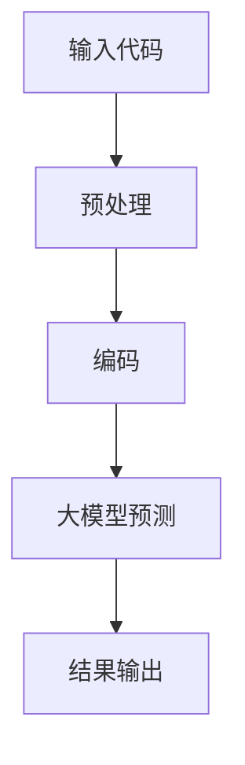

                 

# 大模型驱动的智能代码异味检测

## 关键词
- 大模型
- 智能代码异味检测
- 异味检测算法
- 数学模型
- 系统架构
- 项目实战

## 摘要
本文将探讨大模型在智能代码异味检测中的应用，深入分析其背景、核心概念、算法原理、数学模型、系统架构以及实际项目实战。通过详细讲解和案例分析，旨在为开发者提供全面的指导，帮助他们在实践中更好地运用智能代码异味检测技术，提升代码质量和开发效率。

## 引言
在软件工程领域，代码异味（Code Smell）指的是那些可能表明潜在问题的代码模式或结构。代码异味可能会导致性能下降、代码复杂度增加、维护困难等问题。随着软件系统规模的不断扩大，手工检测代码异味变得越来越困难。因此，利用人工智能技术，尤其是大模型，来辅助检测代码异味成为了研究热点。

## 第一部分：背景与概念

### 第1章：问题背景与核心概念
#### 1.1 问题背景
随着软件项目的复杂度增加，代码异味的问题愈发突出。它们不仅影响代码的可读性和可维护性，还可能导致严重的安全漏洞。传统的代码质量检测工具虽然在一定程度上能够识别代码异味，但其准确性和效率仍有待提高。

#### 1.2 智能代码异味检测的定义
智能代码异味检测是指利用机器学习技术，特别是大模型，自动分析代码，识别出可能存在的代码异味。

#### 1.3 大模型在智能代码异味检测中的作用
大模型具有强大的特征提取能力和自学习能力，能够从大量代码数据中学习到检测代码异味的规则，从而提高检测的准确性和效率。

### 第2章：大模型基础
#### 2.1 大模型的定义与特点
大模型是指参数数量庞大的神经网络模型，如GPT、BERT等。它们能够在大规模数据集上训练，提取出高层次的语义特征。

#### 2.2 大模型的工作原理
大模型通常采用多层神经网络结构，通过反向传播算法进行参数优化，从而实现高效的语义理解。

#### 2.3 主流大模型简介
本文将介绍几种主流的大模型，如GPT、BERT、T5等，并分析它们在代码异味检测中的应用潜力。

### 第3章：智能代码异味检测的核心概念
#### 3.1 异味检测的定义与分类
代码异味可分为结构异味、语义异味等类型，每种类型的检测方法和指标有所不同。

#### 3.2 智能代码异味检测的关键技术
本文将介绍几种智能代码异味检测的关键技术，如词嵌入、序列模型、注意力机制等。

#### 3.3 智能代码异味检测的应用场景
智能代码异味检测可应用于代码审查、代码质量评估、安全漏洞检测等场景。

## 第二部分：算法原理与数学模型

### 第4章：智能代码异味检测算法原理
#### 4.1 基于大模型的异味检测算法
本文将介绍一种基于大模型的智能代码异味检测算法，并使用mermaid画出其流程图。

#### 4.2 算法mermaid流程图

#### 4.3 算法原理讲解
基于大模型的智能代码异味检测算法主要分为三个步骤：代码预处理、编码和预测。其中，编码步骤使用大模型将代码转换为高维向量表示，预测步骤通过大模型判断代码是否存在异味。

### 第5章：数学模型与公式
#### 5.1 异味检测的数学模型
本文将介绍智能代码异味检测的数学模型，包括词嵌入、序列模型等。

#### 5.2 数学公式讲解
$$
\text{score} = \text{sigmoid}(\text{W}^T \cdot \text{h})
$$
其中，$W$为权重矩阵，$h$为代码的高维向量表示。

#### 5.3 举例说明
以一个简单的Python代码为例，说明如何使用大模型检测代码异味。

## 第三部分：系统设计与项目实战

### 第6章：系统分析与架构设计
#### 6.1 问题场景介绍
本文将介绍一个实际的项目场景，说明如何利用大模型进行智能代码异味检测。

#### 6.2 系统功能设计
本文将使用mermaid绘制领域模型类图，详细描述系统的功能模块。

#### 6.3 系统架构设计
本文将使用mermaid绘制系统架构图，展示各个模块之间的关系。

#### 6.4 系统接口设计
本文将详细介绍系统的接口设计，包括输入输出接口和数据流。

#### 6.5 系统交互序列图
本文将使用mermaid绘制系统交互序列图，展示系统各模块之间的交互流程。

### 第7章：项目实战
#### 7.1 环境安装
本文将介绍如何搭建大模型的环境，包括必要的工具和依赖库。

#### 7.2 系统核心实现源代码
本文将提供系统核心实现的源代码，并进行分析和讲解。

#### 7.3 代码应用解读与分析
本文将分析实际代码示例，解释如何使用系统进行代码异味检测。

#### 7.4 实际案例分析与详细讲解
本文将介绍一个实际案例，详细分析案例中的代码异味，并说明如何使用系统进行检测。

#### 7.5 项目小结
本文将对项目进行总结，讨论项目的成功经验和改进方向。

## 第四部分：最佳实践与总结

### 第8章：最佳实践
#### 8.1 异味检测的最佳实践
本文将总结一些智能代码异味检测的最佳实践，包括数据预处理、模型选择、参数调优等。

#### 8.2 大模型调优技巧
本文将介绍大模型调优的一些技巧，帮助开发者更好地应用大模型。

#### 8.3 异味检测系统部署策略
本文将讨论如何部署智能代码异味检测系统，包括硬件选择、部署方案等。

### 第9章：小结与展望
#### 9.1 本书内容总结
本文将对全文内容进行总结，强调智能代码异味检测的重要性和应用价值。

#### 9.2 智能代码异味检测的发展趋势
本文将探讨智能代码异味检测的未来发展趋势，包括技术革新、应用场景扩展等。

#### 9.3 拓展阅读建议
本文将推荐一些相关的拓展阅读资源，帮助读者深入了解智能代码异味检测。

## 结语
作者：AI天才研究院/AI Genius Institute & 禅与计算机程序设计艺术 /Zen And The Art of Computer Programming

本文通过详细的分析和讲解，旨在为开发者提供全面的智能代码异味检测知识。希望读者能够通过本文，提升代码质量和开发效率，为软件工程领域的发展贡献力量。## 第一部分：背景与概念

### 第1章：问题背景与核心概念

#### 1.1 问题背景

在软件工程领域，代码异味（Code Smell）是一个广泛使用但定义模糊的概念。代码异味通常指的是那些表明代码可能存在问题的模式或结构，它们可能是由于糟糕的编程习惯、不合适的代码重构或设计决策不当引起的。这些异味虽然不直接导致程序崩溃，但会逐渐积累，最终可能导致严重的性能下降、代码复杂度增加、维护困难等问题。随着软件项目规模的不断扩大，代码异味问题也变得越来越难以忽视。

传统的代码质量检测工具，如静态代码分析器、代码审查等，虽然可以在一定程度上识别代码异味，但它们通常依赖于预定义的规则和模式匹配，无法全面理解代码的语义和上下文。这些工具的局限性在于：

1. **规则限制**：预定义的规则无法覆盖所有可能的异味模式，尤其是那些新颖或不常见的异味。
2. **复杂度问题**：对于大规模的代码库，手工检测代码异味是一项费时费力的工作。
3. **灵活性不足**：传统工具无法根据项目的具体需求和特点进行自适应调整。

为了解决这些问题，研究人员开始探索利用人工智能（AI）技术，特别是大模型（Large Models），来进行智能代码异味检测。大模型具有强大的特征提取能力和自学习能力，可以从大量代码数据中学习到检测代码异味的规则，从而提高检测的准确性和效率。

#### 1.2 智能代码异味检测的定义

智能代码异味检测是指利用机器学习技术，特别是大模型，自动分析代码，识别出可能存在的代码异味。这种方法的优势在于：

1. **自适应学习**：大模型可以从大量代码数据中学习到各种可能的异味模式，不需要人为定义规则。
2. **语义理解**：大模型能够理解代码的语义，从而在更高的抽象层次上检测异味。
3. **自动化**：智能代码异味检测可以自动化进行，大大减轻了开发者的负担。

智能代码异味检测通常包括以下几个步骤：

1. **代码预处理**：将原始代码转换为适合大模型处理的格式，如序列化的文本或抽象语法树（AST）。
2. **编码**：使用大模型将预处理后的代码转换为高维向量表示，以便进行进一步分析。
3. **预测**：利用大模型对编码后的代码进行异味检测，输出检测结果。

#### 1.3 大模型在智能代码异味检测中的作用

大模型在智能代码异味检测中扮演了关键角色，其作用主要体现在以下几个方面：

1. **特征提取**：大模型可以从大量代码数据中自动提取出高层次的语义特征，这些特征是传统规则方法难以捕捉的。
2. **模式识别**：大模型可以识别出代码中的潜在问题模式，从而预测代码是否包含异味。
3. **自适应性**：大模型可以根据新的代码数据不断优化自身，提高检测的准确性和适应性。

大模型在智能代码异味检测中的应用包括：

1. **训练集构建**：利用大模型对大量代码数据进行预处理和特征提取，构建高质量的训练集。
2. **模型训练**：使用构建好的训练集，训练大模型以识别代码异味。
3. **模型部署**：将训练好的大模型部署到实际的代码异味检测系统中，实现自动化检测。

#### 1.4 智能代码异味检测的挑战与展望

尽管智能代码异味检测展现了巨大的潜力，但其在实际应用中仍面临一些挑战：

1. **数据质量**：高质量的训练数据对于大模型的性能至关重要。然而，获取高质量的代码数据集并非易事，数据质量直接影响检测的准确性。
2. **模型解释性**：大模型通常被视为“黑盒”模型，其决策过程难以解释，这对于需要透明度和可解释性的代码异味检测来说是一个挑战。
3. **实时性**：在实时代码开发环境中，对代码进行快速且准确的异味检测是一项技术挑战。

未来，智能代码异味检测的研究方向可能包括：

1. **数据增强**：通过生成对抗网络（GAN）等技术，提高训练数据的质量和多样性。
2. **模型可解释性**：研究可解释性更强的大模型，如注意力机制和可解释的神经网络结构。
3. **实时检测**：优化大模型的计算效率，实现实时代码异味检测。

通过本文的后续章节，我们将深入探讨智能代码异味检测的核心概念、算法原理、数学模型、系统架构设计以及实际项目实战，帮助读者全面了解这一领域，并在实践中应用这些知识。

### 第2章：大模型基础

#### 2.1 大模型的定义与特点

大模型，顾名思义，是指参数数量庞大、模型结构复杂的神经网络模型。它们通过在大规模数据集上进行训练，能够提取出高层次的语义特征，并在各种复杂任务中表现出色。大模型的特点主要包括以下几点：

1. **参数数量庞大**：大模型的参数数量通常达到数百万甚至数十亿级别，这使得它们具有强大的特征提取能力。
2. **深度结构**：大模型通常包含多层神经网络，通过逐层抽象和变换，能够捕捉到数据中的高层次特征。
3. **自学习能力**：大模型能够通过训练自动调整内部参数，从而在大规模、高维度数据上实现高效学习。
4. **通用性**：大模型具有较强的通用性，可以应用于各种不同领域和任务，如自然语言处理、计算机视觉和代码分析等。

#### 2.2 大模型的工作原理

大模型的工作原理主要基于多层神经网络和深度学习技术。具体来说，大模型通过以下几个关键步骤进行操作：

1. **数据预处理**：将输入数据（如文本、图像、代码等）进行预处理，转换为适合神经网络处理的格式。例如，文本数据可以通过词嵌入（Word Embedding）转换为向量表示，图像数据可以通过像素值转换为矩阵表示。
2. **输入层**：输入层接收预处理后的数据，并将其传递到下一层。
3. **隐藏层**：隐藏层通过复杂的非线性变换，逐步提取出输入数据中的高层次特征。每一层的输出都是对输入数据的更高层次的抽象表示。
4. **输出层**：输出层生成最终的预测结果或分类标签。输出层的结构通常与具体任务相关，例如在文本分类任务中，输出层可能是一个softmax层，用于生成每个类别的概率分布。
5. **反向传播**：通过反向传播算法，将输出层的误差反向传递到隐藏层和输入层，并使用梯度下降等优化算法调整模型参数，以最小化误差函数。

#### 2.3 主流大模型简介

在智能代码异味检测领域，以下几种主流大模型表现出色：

1. **GPT（Generative Pre-trained Transformer）**：
   - **特点**：GPT是一种基于Transformer架构的自回归语言模型，具有强大的文本生成和语义理解能力。
   - **应用**：GPT在自然语言处理任务中表现出色，如文本生成、机器翻译和文本分类等。在代码异味检测中，GPT可以用于自动生成代码示例，从而帮助识别代码异味。
   - **案例**：OpenAI的GPT-3模型是目前最大的预训练语言模型，其参数数量达到1750亿，在多种语言任务上取得了显著成果。

2. **BERT（Bidirectional Encoder Representations from Transformers）**：
   - **特点**：BERT是一种双向Transformer模型，能够同时考虑输入文本的左右文

