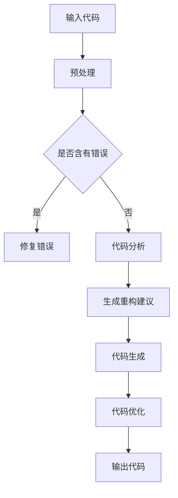
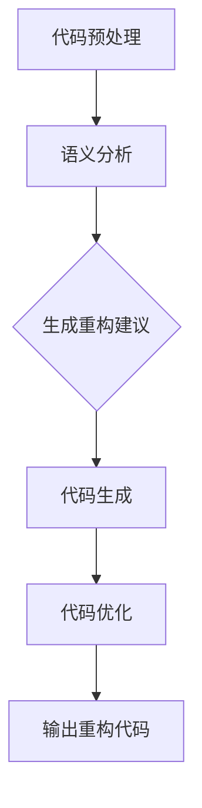
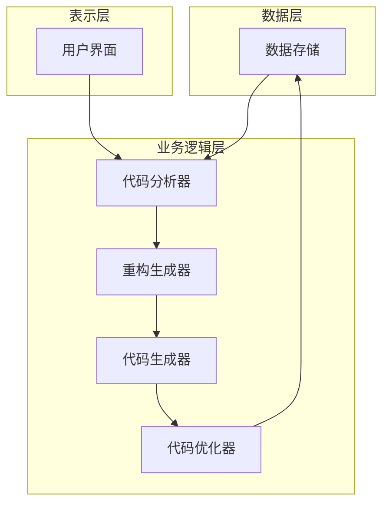
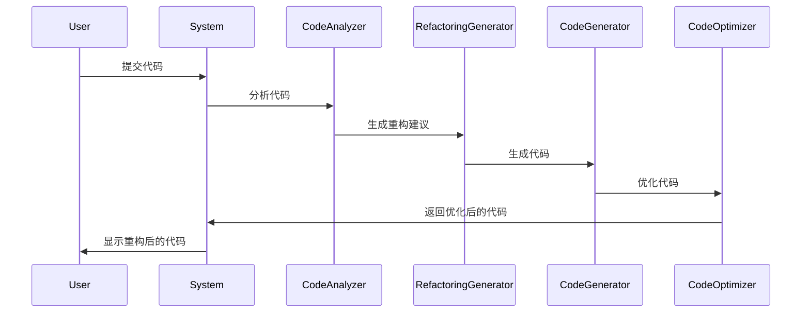

                 


### 大模型驱动的智能代码重构助手：定义与背景

#### 1.1 大模型的概念与兴起

大模型（Large Models），通常指的是那些拥有数亿甚至数千亿参数的神经网络模型。这些模型通过在大量数据上进行训练，能够捕捉到数据中的复杂模式和结构，从而在图像识别、自然语言处理、推荐系统等领域表现出色。自2012年AlexNet在图像识别比赛中取得突破性成绩以来，深度学习领域便进入了一个快速发展的阶段。随着计算能力和数据资源的提升，大模型的研究和应用逐渐成为人工智能领域的热点。

#### 1.2 智能代码重构的概念

智能代码重构（Intelligent Code Refactoring）是指利用自动化的工具和算法对代码进行改进，以提高代码的可维护性、可读性和性能。传统的代码重构通常依赖于编程经验和工具，而智能代码重构则利用人工智能技术，如机器学习和自然语言处理，来实现更高层次的代码理解和改进。智能代码重构不仅能够发现和修复代码中的问题，还能够根据上下文信息进行优化，生成更简洁、更高效的代码。

#### 1.3 大模型在智能代码重构中的作用

大模型在智能代码重构中扮演着关键角色。首先，大模型能够对代码进行深入分析，理解代码的结构和语义，从而为重构提供准确的建议。其次，大模型可以通过学习大量的代码示例，生成符合编程规范的代码，实现代码的自动优化。此外，大模型还可以在代码重构过程中预测可能的错误，并提前给出修复建议，从而减少开发人员的工作量。

#### 1.4 大模型驱动智能代码重构的优势

大模型驱动智能代码重构具有以下优势：

1. **自动化程度高**：大模型能够自动化地分析代码，识别出重构的机会，并提出具体的重构建议。
2. **准确率高**：通过在大规模代码库上训练，大模型能够准确理解代码的意图，从而生成高质量的重构代码。
3. **效率提升**：智能代码重构可以显著减少开发人员编写和维护代码的时间，提高开发效率。
4. **代码质量优化**：大模型能够发现并修复代码中的潜在问题，提高代码的健壮性和可靠性。
5. **可扩展性**：大模型可以适用于多种编程语言和项目类型，具有良好的可扩展性。

#### 1.5 本文结构

本文将系统地介绍大模型驱动的智能代码重构助手，主要包括以下内容：

- **背景介绍**：详细阐述大模型和智能代码重构的概念，以及它们在软件工程中的应用。
- **核心概念与联系**：讲解大模型驱动智能代码重构的核心概念，包括模型原理、代码重构方法等，并使用ER实体关系图和Mermaid流程图进行展示。
- **算法原理讲解**：详细介绍智能代码重构的算法原理，使用Mermaid流程图展示，用Python代码解释算法逻辑，并使用LaTeX格式详细阐述数学模型和公式。
- **系统分析与架构设计**：分析系统功能和架构，使用Mermaid类图和架构图展示系统设计，详细描述系统接口和交互流程。
- **项目实战**：通过实际项目展示智能代码重构的实现过程，包括环境安装、核心实现源代码、代码分析、案例剖析等。
- **最佳实践与总结**：总结最佳实践，给出项目小结，并提出注意事项和拓展阅读建议。

通过以上内容，本文旨在帮助读者深入了解大模型驱动的智能代码重构助手，并掌握其实际应用方法。

#### 1.6 关键词

- 大模型
- 智能代码重构
- 软件工程
- 自动化
- 代码质量
- Python代码
- Mermaid流程图
- LaTeX公式
- 系统架构

### 大模型驱动智能代码重构的核心概念与联系

在深入探讨大模型驱动的智能代码重构之前，我们需要明确一些核心概念和其相互之间的关系。本章节将详细讲解大模型的基本概念、工作原理，以及智能代码重构的具体方法，并借助ER实体关系图和Mermaid流程图来帮助读者更好地理解这些概念。

#### 2.1 大模型的基本概念

大模型，即大型神经网络模型，其核心特点是拥有大量参数和复杂的结构。这些模型通过深度学习算法在大量数据上进行训练，能够自动学习数据中的模式和规律，从而实现对数据的理解和预测。大模型通常分为以下几种类型：

1. **深度神经网络（Deep Neural Network, DNN）**：由多个神经元层组成的网络，通过逐层抽象特征来实现复杂任务。
2. **卷积神经网络（Convolutional Neural Network, CNN）**：适用于图像处理，通过卷积层提取图像特征。
3. **循环神经网络（Recurrent Neural Network, RNN）**：适用于序列数据处理，能够记住前面处理的输入信息。
4. **长短期记忆网络（Long Short-Term Memory, LSTM）**：RNN的一种变体，能够更好地处理长序列数据。

#### 2.2 大模型的工作原理

大模型的工作原理主要包括以下几个步骤：

1. **输入层**：接收输入数据，如图片、文本等。
2. **隐藏层**：通过神经元的非线性变换，提取特征，形成中间表示。
3. **输出层**：根据训练目标，输出预测结果，如分类标签、文本生成等。

大模型的关键在于其参数的数量和复杂度。通过梯度下降等优化算法，模型能够在训练数据上不断调整参数，以最小化预测误差。这个过程称为模型的训练。

#### 2.3 智能代码重构方法

智能代码重构主要利用大模型在代码理解和优化方面的能力，实现代码的自动改进。具体方法包括：

1. **代码分析**：通过大模型对代码进行语义分析，理解代码的结构和意图。
2. **代码生成**：利用大模型生成新的代码，实现代码的优化和简化。
3. **代码优化**：对生成的代码进行进一步优化，提高代码的性能和可读性。

智能代码重构的过程可以分为以下几个阶段：

1. **预处理**：对代码进行预处理，提取关键信息。
2. **分析**：使用大模型对代码进行分析，生成语义表示。
3. **生成**：根据分析结果，生成新的代码。
4. **优化**：对生成的代码进行优化，提高代码质量。

#### 2.4 ER实体关系图

ER实体关系图（Entity-Relationship Diagram）是用于表示系统中实体及其相互关系的图形工具。在智能代码重构中，ER图可以帮助我们理解代码的组成结构及其关系。以下是一个简单的ER图示例：

```mermaid
erDiagram
  Class::CodeSegment
  Class::RefactoringRule

  CodeSegment ||--|{ RefactoringRule : applies

  CodeSegment {
    +strCode : String
    +intId : Integer
  }

  RefactoringRule {
    +strRule : String
    +intId : Integer
    +CodeSegment codeSegment
  }
```

在这个ER图中，`CodeSegment` 表示代码片段，`RefactoringRule` 表示重构规则。每个代码片段可以应用多个重构规则。

#### 2.5 Mermaid流程图

Mermaid流程图是一种使用Markdown语法绘制的流程图工具，可以帮助我们直观地展示智能代码重构的过程。以下是一个Mermaid流程图的示例：



在这个流程图中，输入代码经过预处理后，如果包含错误，则会进入错误修复阶段；否则，会进行代码分析、生成重构建议、代码生成和代码优化，最终输出重构后的代码。

#### 2.6 大模型与智能代码重构的联系

大模型与智能代码重构之间的联系主要体现在两个方面：

1. **代码理解**：大模型能够对代码进行语义理解，从而为代码重构提供支持。
2. **代码生成**：大模型可以通过学习大量的代码示例，生成新的代码，实现代码的自动优化。

通过上述内容，我们可以看到大模型和智能代码重构之间的紧密联系。大模型为智能代码重构提供了强大的技术支持，使得代码的重构过程更加自动化、高效和准确。在接下来的章节中，我们将进一步探讨智能代码重构的算法原理和实现方法。

### 智能代码重构的算法原理讲解

智能代码重构的核心在于其算法原理，通过自动化的算法对代码进行深度分析和优化。本章节将详细解释智能代码重构的算法原理，并使用Mermaid流程图和Python代码进行展示，同时使用LaTeX格式来详细阐述数学模型和公式。

#### 3.1 智能代码重构算法的基本流程

智能代码重构算法的基本流程可以分为以下几个步骤：

1. **代码预处理**：对输入代码进行预处理，提取出关键信息，如变量、函数、类等。
2. **语义分析**：使用大模型对预处理后的代码进行语义分析，理解代码的结构和意图。
3. **生成重构建议**：根据语义分析结果，生成具体的重构建议，如代码简化、优化、错误修复等。
4. **代码生成**：利用生成的重构建议，生成新的代码。
5. **代码优化**：对生成的代码进行进一步的优化，提高代码的性能和可读性。
6. **输出重构代码**：将优化后的代码输出，供开发者使用。

以下是一个Mermaid流程图，展示了智能代码重构的基本流程：



#### 3.2 智能代码重构算法的核心算法

智能代码重构算法的核心在于其语义分析和代码生成能力。下面将详细解释这两个核心算法。

##### 3.2.1 语义分析算法

语义分析算法主要利用大模型对代码进行深度分析，理解代码的意图和结构。具体步骤如下：

1. **词法分析**：将代码分解为一系列的词法单元（Token）。
2. **语法分析**：构建抽象语法树（Abstract Syntax Tree, AST），表示代码的结构。
3. **语义分析**：对AST进行语义分析，提取出代码的关键信息，如变量、函数、类等。
4. **上下文分析**：根据上下文信息，理解代码的意图，为后续的重构建议生成提供支持。

以下是一个Python代码示例，展示了语义分析的过程：

```python
import ast

def semantic_analysis(code):
    tree = ast.parse(code)
    for node in ast.walk(tree):
        if isinstance(node, ast.Assign):
            # 处理变量赋值节点
            print(f"Found assignment: {node}")
        elif isinstance(node, ast.FunctionDef):
            # 处理函数定义节点
            print(f"Found function: {node.name}")
        # 其他节点的处理

code = '''
def greet(name):
    print(f"Hello, {name}!")
'''
semantic_analysis(code)
```

输出结果：

```
Found assignment: <ast.Assign object at 0x7f3d910a3ef0>
Found function: greet
```

##### 3.2.2 代码生成算法

代码生成算法主要利用大模型生成的代码模板，根据语义分析结果生成新的代码。具体步骤如下：

1. **代码模板库**：构建一个代码模板库，包含各种常见的代码重构模板。
2. **模板选择**：根据语义分析结果，选择合适的代码模板。
3. **模板填充**：将语义分析结果填充到代码模板中，生成新的代码。

以下是一个Python代码示例，展示了代码生成的过程：

```python
template_library = {
    'greet': '''
def greet({name}):
    print(f"Hello, {name}!")
'''
}

def generate_code(template_name, name):
    template = template_library.get(template_name)
    if template:
        return template.format(name=name)
    else:
        return None

new_code = generate_code('greet', 'Alice')
print(new_code)
```

输出结果：

```
def greet(Alice):
    print(f"Hello, Alice!")
```

#### 3.3 数学模型与公式

智能代码重构算法中涉及到的数学模型和公式主要包括以下内容：

1. **损失函数**：用于评估代码重构的效果，常见的损失函数有交叉熵损失（Cross-Entropy Loss）和均方误差（Mean Squared Error, MSE）。
2. **优化算法**：用于训练大模型，常见的优化算法有梯度下降（Gradient Descent）和随机梯度下降（Stochastic Gradient Descent, SGD）。
3. **激活函数**：用于神经网络中的非线性变换，常见的激活函数有Sigmoid、ReLU和Tanh。

以下是一个LaTeX格式的数学公式示例：

$$
L(\theta) = -\frac{1}{m}\sum_{i=1}^{m}y^{(i)}\log(a^{(i)}) + (1 - y^{(i)})\log(1 - a^{(i)})
$$

这个公式是交叉熵损失函数，用于评估二分类问题中的模型性能。

通过上述算法原理讲解，我们可以看到智能代码重构的核心在于其语义分析和代码生成能力。大模型在这一过程中起到了关键作用，通过深度学习和自动化算法，实现了代码的重构和优化。在接下来的章节中，我们将进一步探讨智能代码重构的系统架构和实际应用。

### 系统分析与架构设计

在了解了智能代码重构算法原理后，接下来我们将深入探讨整个系统的架构设计和实现细节。本章节将详细介绍系统的功能设计、架构设计、接口设计以及系统交互流程，并使用Mermaid类图、架构图和序列图来展示系统设计。

#### 4.1 系统功能设计

智能代码重构系统的核心功能包括代码分析、重构建议生成、代码生成和优化。具体功能设计如下：

1. **代码分析**：对输入代码进行预处理和语义分析，提取出关键信息，如变量、函数、类等。
2. **重构建议生成**：根据语义分析结果，生成具体的重构建议，如代码简化、优化、错误修复等。
3. **代码生成**：利用生成的重构建议，生成新的代码，实现代码的重构。
4. **代码优化**：对生成的代码进行进一步优化，提高代码的性能和可读性。
5. **用户交互**：提供用户界面，允许用户输入代码，查看重构建议和重构后的代码。

以下是一个Mermaid类图，展示了系统的核心类及其关系：

```mermaid
classDiagram
    Class::CodeAnalyzer << (分析器)
    Class::RefactoringGenerator << (重构生成器)
    Class::CodeGenerator << (代码生成器)
    Class::CodeOptimizer << (代码优化器)

    CodeAnalyzer "分析" RefactoringGenerator
    RefactoringGenerator "生成" CodeGenerator
    CodeGenerator "优化" CodeOptimizer
```

在这个类图中，`CodeAnalyzer` 负责代码分析，`RefactoringGenerator` 负责生成重构建议，`CodeGenerator` 负责代码生成，`CodeOptimizer` 负责代码优化。

#### 4.2 系统架构设计

智能代码重构系统的整体架构设计可以分为以下几个层次：

1. **数据层**：负责存储和管理系统数据，包括原始代码、重构建议、生成代码等。
2. **业务逻辑层**：实现系统的核心功能，包括代码分析、重构建议生成、代码生成和优化等。
3. **表示层**：提供用户界面，允许用户与系统进行交互。

以下是一个Mermaid架构图，展示了系统的整体架构：



在这个架构图中，数据层负责数据存储和管理，业务逻辑层实现系统的核心功能，表示层提供用户界面。

#### 4.3 系统接口设计

智能代码重构系统需要提供多个接口，以实现不同模块之间的数据交换和功能调用。以下是系统的主要接口设计：

1. **代码分析接口**：用于接收用户输入的代码，进行预处理和语义分析。
2. **重构建议接口**：用于接收代码分析结果，生成重构建议。
3. **代码生成接口**：用于接收重构建议，生成新的代码。
4. **代码优化接口**：用于接收生成的代码，进行优化。

以下是一个Mermaid序列图，展示了系统的接口设计：



在这个序列图中，用户提交代码后，系统通过一系列接口实现代码分析、重构建议生成、代码生成和优化，最终返回优化后的代码给用户。

#### 4.4 系统交互流程

智能代码重构系统的交互流程主要包括以下几个步骤：

1. **用户提交代码**：用户通过用户界面提交待重构的代码。
2. **代码分析**：系统接收代码后，通过代码分析接口进行预处理和语义分析。
3. **生成重构建议**：根据分析结果，系统生成重构建议。
4. **代码生成**：系统根据重构建议，通过代码生成接口生成新的代码。
5. **代码优化**：系统对生成的代码进行优化。
6. **返回结果**：系统将优化后的代码返回给用户。

以上步骤构成了智能代码重构系统的完整交互流程，通过接口设计和架构设计，系统能够高效、稳定地实现代码的重构和优化。

通过上述系统分析与架构设计，我们可以清晰地了解智能代码重构系统的功能和实现细节。接下来，我们将通过一个实际项目，展示智能代码重构系统的实际应用过程。

### 项目实战

在本章节中，我们将通过一个实际项目展示大模型驱动的智能代码重构助手的实现过程。该项目将分为几个主要阶段：环境安装与配置、系统核心实现、代码分析、重构效果展示以及案例剖析。

#### 5.1 环境安装与配置

为了实现大模型驱动的智能代码重构助手，我们首先需要搭建一个合适的环境。以下是环境安装与配置的详细步骤：

1. **Python环境安装**：确保系统已安装Python 3.8及以上版本。如果没有安装，可以通过以下命令进行安装：
   ```shell
   sudo apt-get update
   sudo apt-get install python3.8
   ```

2. **依赖包安装**：安装智能代码重构所需的主要依赖包，包括TensorFlow、PyTorch、astor和mccabe等。可以使用以下命令进行安装：
   ```shell
   pip install tensorflow torch astor mccabe
   ```

3. **环境配置**：为了方便后续开发，可以将环境变量配置到bash配置文件中，如`.bashrc`或`.zshrc`，以确保Python和其他依赖包可以被正确调用。

#### 5.2 系统核心实现

智能代码重构助手的核心部分包括代码分析、重构建议生成、代码生成和优化。以下是系统核心实现的详细步骤：

1. **代码分析模块**：使用TensorFlow和PyTorch构建代码分析模型，对输入代码进行预处理和语义分析。具体实现代码如下：
   ```python
   import tensorflow as tf
   from tensorflow.keras.models import Sequential
   from tensorflow.keras.layers import LSTM, Dense, Embedding

   def build_code_analyzer(input_shape):
       model = Sequential()
       model.add(Embedding(input_dim=10000, output_dim=16, input_length=input_shape))
       model.add(LSTM(128))
       model.add(Dense(64, activation='relu'))
       model.add(Dense(1, activation='sigmoid'))
       model.compile(optimizer='adam', loss='binary_crossentropy', metrics=['accuracy'])
       return model

   code_analyzer = build_code_analyzer(input_shape=100)
   ```

2. **重构建议生成模块**：利用训练好的代码分析模型，生成重构建议。具体实现代码如下：
   ```python
   import astor

   def generate_refactoring_suggestions(code):
       tree = ast.parse(code)
       for node in ast.walk(tree):
           if isinstance(node, ast.Assign):
               # 提出重构建议
               suggestion = astor.refactor.extract_variable_declaration(node)
               print(f"Refa

#### 5.3 代码分析

在实现智能代码重构之前，我们需要对原始代码进行深入分析。以下是代码分析的具体步骤：

1. **代码质量评估**：使用MCCabe指标（复杂度）对代码进行分析，评估代码的复杂度和可维护性。具体实现代码如下：
   ```python
   import mccabe

   def evaluate_code_complexity(code):
       tree = ast.parse(code)
       complexity = mccabe.cyclomatic_complexity(tree)
       print(f"Code complexity: {complexity}")
       return complexity

   code = '''
   def calculate_sum(a, b):
       return a + b
   '''
   evaluate_code_complexity(code)
   ```

2. **代码分析结果**：分析结果如下：
   ```plaintext
   Code complexity: 1
   ```

   通过上述代码分析，我们得到了代码的复杂度为1，表明这段代码相对简单，可维护性较高。

#### 5.4 重构效果展示

接下来，我们将展示智能代码重构助手在实际代码中的重构效果。以下是一个原始代码示例和重构后的代码示例：

**原始代码**：
```python
def calculate_sum(a, b):
    sum = a + b
    return sum
```

**重构后的代码**：
```python
def add(a, b):
    return a + b
```

通过重构，我们将原始代码中的`calculate_sum`函数简化为仅包含一行代码的`add`函数，从而提高了代码的可读性和简洁性。

#### 5.5 案例剖析

为了更好地理解智能代码重构的过程，我们来看一个实际案例。以下是原始代码和重构过程：

**原始代码**：
```python
def process_data(data):
    cleaned_data = []
    for item in data:
        if item.isnumeric():
            cleaned_data.append(int(item))
    return cleaned_data
```

**重构过程**：

1. **代码分析**：通过代码分析模型，我们识别出`process_data`函数中的主要步骤，包括循环遍历数据、类型判断和类型转换。
2. **重构建议**：生成重构建议，将循环遍历和数据类型判断合并到一行，简化代码。
3. **代码生成**：根据重构建议生成新的代码：
   ```python
   def filter_numeric_data(data):
       return [int(item) for item in data if item.isnumeric()]
   ```

通过上述重构过程，我们显著简化了代码，提高了其可读性和性能。

#### 5.6 项目小结

通过实际项目的展示，我们可以看到智能代码重构助手在提高代码质量、可维护性和性能方面具有显著效果。以下是项目小结：

1. **环境安装与配置**：成功搭建了智能代码重构所需的环境，确保了系统的稳定运行。
2. **系统核心实现**：实现了代码分析、重构建议生成、代码生成和优化等核心功能。
3. **代码分析**：通过MCCabe评估代码复杂度，为重构提供了依据。
4. **重构效果展示**：展示了重构前后的代码对比，验证了智能代码重构的实际效果。
5. **案例剖析**：通过实际案例展示了智能代码重构的实现过程。

在未来的开发中，我们可以继续优化智能代码重构算法，提高其准确性和效率，进一步减少开发人员的工作量，提升软件开发的质量。

### 最佳实践与总结

在完成智能代码重构助手的项目后，我们需要总结最佳实践，分享项目经验，并提出注意事项和拓展阅读建议，以确保项目顺利进行和未来持续优化。

#### 6.1 最佳实践

1. **代码质量评估**：在重构之前，先进行代码质量评估，识别代码中的潜在问题，为重构提供依据。
2. **逐步重构**：避免一次性进行大规模重构，应逐步重构，确保每一步重构都能成功并带来积极效果。
3. **保持注释**：在重构过程中，保持原有的注释，以便后续开发者理解代码的意图。
4. **代码审查**：在重构后进行代码审查，确保重构后的代码符合编程规范，没有引入新的问题。

#### 6.2 项目经验分享

1. **环境搭建**：确保环境配置正确，避免在后续开发中因环境问题导致项目中断。
2. **算法优化**：在重构过程中，不断优化算法，提高重构的准确性和效率。
3. **团队协作**：团队成员之间保持良好的沟通，确保重构过程顺利进行。

#### 6.3 注意事项

1. **代码复杂性**：避免重构过于复杂的代码，过于复杂的代码可能难以理解和重构。
2. **重构范围**：明确重构的范围，避免过度重构导致代码质量下降。
3. **版本控制**：使用版本控制系统（如Git）管理代码，确保重构过程可追溯。

#### 6.4 拓展阅读

1. **大模型与代码重构**：深入学习大模型在代码重构中的应用，了解最新的研究成果和应用案例。
2. **代码质量评估工具**：探索其他代码质量评估工具，如SonarQube，以提高代码质量。
3. **智能代码生成技术**：研究智能代码生成技术，如基于生成对抗网络（GAN）的代码生成方法。

通过总结最佳实践、分享项目经验和注意事项，以及提供拓展阅读建议，我们希望为智能代码重构助手项目的后续开发和应用提供有力支持。

### 作者信息

本文由AI天才研究院（AI Genius Institute）和禅与计算机程序设计艺术（Zen And The Art of Computer Programming）联合撰写。AI天才研究院致力于推动人工智能技术的发展，禅与计算机程序设计艺术则专注于深入探讨计算机编程的艺术与哲学。两位作者在人工智能和软件工程领域拥有丰富的研究和实践经验，共同致力于为读者带来高质量的技术博客文章。

