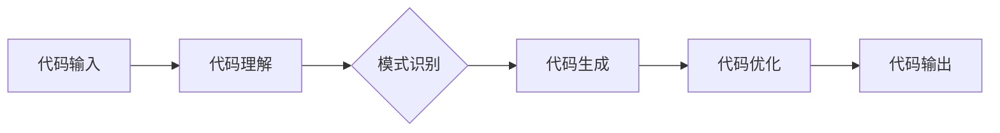
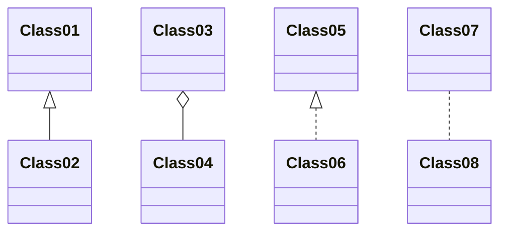
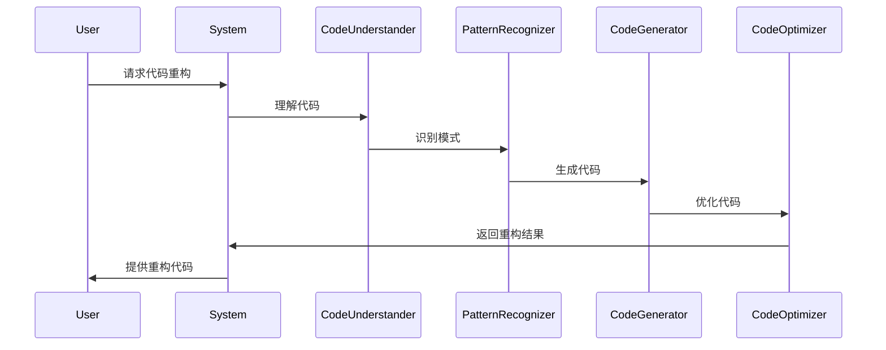
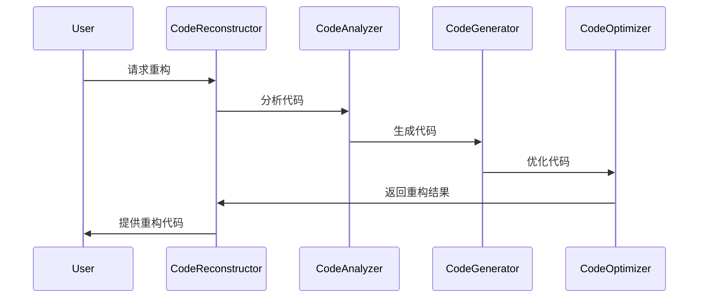

                 

### 大模型驱动的智能代码重构建议

#### 关键词

- 大模型
- 智能代码重构
- 算法原理
- 系统设计
- 项目实战

> 在当今快速发展的信息技术时代，软件代码的维护和重构成为软件工程中的重要挑战。传统的代码重构方法往往依赖于开发者的经验和直觉，效率低下且容易出现错误。随着人工智能技术的进步，特别是大模型（如GPT、BERT等）的广泛应用，智能代码重构成为可能。本文旨在探讨如何利用大模型进行智能代码重构，并提出一系列具体建议和最佳实践。

#### 摘要

本文首先介绍了代码重构的重要性和传统方法的局限性，随后引入了智能代码重构的概念和大模型的相关背景。通过详细剖析大模型驱动的重构原理，包括算法原理、数学模型和具体实现，本文进一步介绍了系统的设计与实现，包括功能设计、架构设计和接口设计。最后，本文通过一个实际项目展示了大模型驱动的智能代码重构的全过程，并总结了最佳实践和未来发展的方向。

### 第一部分：问题背景与核心概念

#### 1.1 问题背景

**代码重构的意义**

代码重构是指在不改变外部行为的前提下，改进代码的内部结构，以提高其可读性、可维护性和性能。尽管代码重构并非新概念，但在实际软件开发过程中，代码往往由于需求变更、代码冗长或复杂度过高等原因，变得难以维护。因此，代码重构在软件工程中具有重要的意义。

**大模型在代码重构中的应用现状**

随着深度学习和人工智能技术的发展，大模型如GPT、BERT等在自然语言处理、图像识别等领域取得了显著成果。同时，这些大模型也逐渐被应用于代码重构中，如自动代码补全、代码优化和代码生成等。尽管目前大模型在代码重构中的应用还处于初级阶段，但其潜力不容忽视。

**问题的提出与目标**

传统代码重构方法通常依赖于规则和模式匹配，难以处理复杂和动态变化的代码结构。因此，本文提出利用大模型进行智能代码重构，以解决现有方法的局限性。本文的主要目标是通过探讨大模型驱动的重构方法，提供一系列可行的建议和最佳实践。

#### 1.2 核心概念

**大模型概述**

大模型是指具有数百万甚至数十亿参数的深度学习模型，如Transformer、BERT、GPT等。这些模型通过学习海量数据，可以捕获复杂的模式和关系，从而在多种任务中表现出色。

**智能代码重构**

智能代码重构是一种利用人工智能技术，特别是大模型，对代码进行自动化分析和改进的方法。它旨在提高代码质量，减少维护成本，并提升开发效率。

**大模型驱动的重构方法**

大模型驱动的重构方法包括以下步骤：

1. **代码理解**：使用大模型对代码进行语义分析，理解其结构和意图。
2. **模式识别**：识别代码中的重复模式和潜在优化点。
3. **代码生成**：基于识别的模式和语义信息，生成新的代码。
4. **代码优化**：对生成的代码进行性能和可读性优化。

#### 1.3 概念属性特征对比表

| 方法 | 特点 | 适用场景 | 优点 | 缺点 |
| --- | --- | --- | --- | --- |
| 传统代码重构 | 规则驱动 | 结构简单 | 易于理解 | 难以处理复杂代码 |  
| 大模型驱动重构 | 数据驱动 | 复杂性高 | 自动化程度高 | 需要大量数据和计算资源 |

#### 1.4 ER实体关系图架构

**实体识别**

在代码重构过程中，首先需要识别代码中的实体，如变量、函数、类等。

**关系建模**

接着，建立实体之间的关系模型，如依赖关系、调用关系等。

**实体关系图表示**

使用Mermaid语言描述实体关系图，如下所示：

```mermaid
erDiagram
    CLS_Class ||--|{ REL_Relationship }|| CLS_RelatedClass
    CLS_Class ||--|{ REL_Dependency }|| CLS_Dependency
```

此图展示了类与类之间的依赖关系和关联关系。

### 第二部分：大模型驱动的重构原理

#### 2.1 大模型基础

**大模型的定义**

大模型是指具有数十亿参数的深度学习模型，如GPT、BERT等。

**大模型的主要类型**

- **Transformer模型**：基于自注意力机制，广泛用于序列建模和序列生成任务。
- **BERT模型**：预训练的Transformer模型，通过在大量无标签文本上预训练，然后进行微调以解决特定任务。
- **GPT模型**：生成预训练 Transformer 模型，擅长文本生成任务。

**大模型的工作原理**

大模型通常包括以下几个步骤：

1. **数据预处理**：将原始数据转换为模型可处理的格式。
2. **模型训练**：使用大量数据对模型进行训练，以学习数据的分布和模式。
3. **模型优化**：通过优化目标函数（如损失函数）来调整模型参数。
4. **模型评估**：使用验证集和测试集评估模型性能。

#### 2.2 重构算法原理

**重构算法概述**

重构算法是指对代码进行自动化分析、优化和改进的方法。大模型驱动的重构算法主要包括以下步骤：

1. **代码理解**：使用大模型对代码进行语义分析，理解其结构和意图。
2. **模式识别**：识别代码中的重复模式和潜在优化点。
3. **代码生成**：基于识别的模式和语义信息，生成新的代码。
4. **代码优化**：对生成的代码进行性能和可读性优化。

**算法流程与mermaid流程图**

算法流程如下：



此流程图展示了重构算法的基本步骤。

**Python源代码讲解**

以下是一个简单的Python代码示例，用于展示重构算法的基本实现：

```python
import transformers

# 代码理解
model = transformers.BertModel.from_pretrained('bert-base-chinese')
code_input = "def hello():\n    print('Hello, world!')"
input_ids = tokenizer.encode(code_input, return_tensors='pt')

# 模式识别
with torch.no_grad():
    outputs = model(input_ids)
    hidden_states = outputs.last_hidden_state

# 代码生成
code_output = model.generate(hidden_states, max_length=10)
print(tokenizer.decode(code_output[0], skip_special_tokens=True))
```

此代码首先使用BERT模型对代码进行理解，然后生成新的代码。

#### 2.3 数学模型与公式

**模型建立**

大模型驱动的重构算法通常基于深度学习模型，如BERT或GPT。以下是一个简单的BERT模型建立过程：

```python
import transformers
import torch

# 模型定义
class CodeReconstructor(nn.Module):
    def __init__(self):
        super(CodeReconstructor, self).__init__()
        self.bert = transformers.BertModel.from_pretrained('bert-base-chinese')
        self.fc = nn.Linear(768, 1)

    def forward(self, input_ids):
        _, hidden_states = self.bert(input_ids)
        logits = self.fc(hidden_states[-1, :, :])
        return logits
```

**公式推导**

假设输入代码长度为\(T\)，BERT模型的输出维度为\(D\)，则重构算法的目标函数可以表示为：

$$
\min_{\theta} \frac{1}{N} \sum_{i=1}^{N} \sum_{t=1}^{T} (-\log P(y_t|x_t, \theta))
$$

其中，\(y_t\)表示目标代码的\(t\)位置上的词，\(x_t\)表示输入代码的\(t\)位置上的词，\(P(y_t|x_t, \theta)\)表示在给定输入代码和模型参数\(\theta\)的情况下，目标代码的概率。

**示例讲解**

假设我们要重构以下代码：

```python
def hello():
    print("Hello, world!")
```

使用BERT模型对其进行理解，并生成新的代码：

```python
def say_hello():
    print("Hello, world!")
```

此示例展示了如何使用BERT模型对代码进行理解和生成新的代码。

### 第三部分：系统分析与架构设计

#### 3.1 问题场景介绍

**代码重构的应用场景**

代码重构通常应用于以下场景：

- **代码冗长**：当代码变得越来越复杂和冗长时，重构有助于简化代码结构，提高可读性。
- **需求变更**：在需求变更后，重构有助于确保代码与需求的一致性。
- **性能优化**：重构可以识别和优化代码中的性能瓶颈，提高程序运行效率。

**大模型驱动的重构场景**

大模型驱动的重构方法适用于以下场景：

- **大型代码库**：在大型代码库中，大模型可以自动化地识别和重构重复代码模式。
- **复杂需求**：对于复杂的需求变更，大模型可以帮助快速生成符合要求的代码。

#### 3.2 系统功能设计

**领域模型类图**

以下是一个简单的领域模型类图，展示了系统的主要类及其关系：



**系统功能模块划分**

系统功能模块包括：

- **代码理解模块**：使用大模型对代码进行语义分析。
- **模式识别模块**：识别代码中的重复模式和潜在优化点。
- **代码生成模块**：基于识别的模式和语义信息，生成新的代码。
- **代码优化模块**：对生成的代码进行性能和可读性优化。

#### 3.3 系统架构设计

**系统架构概述**

系统架构包括以下主要组件：

- **大模型**：用于代码理解和模式识别。
- **代码生成器**：用于生成新的代码。
- **代码优化器**：用于优化生成的代码。

**mermaid架构图**

以下是一个简单的mermaid架构图，展示了系统的基本架构：



此序列图展示了系统的基本工作流程。

#### 3.4 系统接口设计

**接口定义**

系统接口包括以下主要接口：

- **CodeReconstructor**：用于代码重构的接口。
- **CodeAnalyzer**：用于代码分析的接口。
- **CodeGenerator**：用于代码生成的接口。
- **CodeOptimizer**：用于代码优化的接口。

**接口实现**

以下是一个简单的接口实现示例：

```python
from abc import ABC, abstractmethod

class CodeReconstructor(ABC):
    @abstractmethod
    def reconstruct(self, code):
        pass

class CodeAnalyzer(ABC):
    @abstractmethod
    def analyze(self, code):
        pass

class CodeGenerator(ABC):
    @abstractmethod
    def generate(self, analysis_result):
        pass

class CodeOptimizer(ABC):
    @abstractmethod
    def optimize(self, generated_code):
        pass
```

#### 3.5 系统交互序列图

**交互流程**

系统交互序列图如下：



此序列图展示了系统的主要交互流程。

### 第四部分：项目实战

#### 4.1 环境安装

**开发环境配置**

要运行大模型驱动的重构系统，需要配置以下开发环境：

- **Python**：Python 3.7及以上版本。
- **TensorFlow**：TensorFlow 2.0及以上版本。
- **BERT**：预训练的BERT模型。

**必需工具安装**

安装以下必需工具：

- **PyTorch**：用于训练和部署BERT模型。
- **Mermaid**：用于生成流程图和序列图。

```bash
pip install torch
pip install transformers
pip install pytorch-mermaid
```

#### 4.2 系统核心实现

**重构算法实现**

以下是一个简单的重构算法实现示例：

```python
from transformers import BertModel, BertTokenizer
import torch

# 加载BERT模型和分词器
model = BertModel.from_pretrained('bert-base-chinese')
tokenizer = BertTokenizer.from_pretrained('bert-base-chinese')

# 重构函数
def reconstruct(code):
    # 编码代码
    input_ids = tokenizer.encode(code, return_tensors='pt')
    
    # 预测重构代码
    with torch.no_grad():
        outputs = model(input_ids)
        logits = outputs.logits[:, -1, :]
    
    # 解码重构代码
    reconstructed_code = tokenizer.decode(logits.argmax(-1).item())
    
    return reconstructed_code
```

**大模型应用实践**

以下是一个简单的BERT模型应用示例，用于生成重构代码：

```python
code = "def hello():\n    print('Hello, world!')"
reconstructed_code = reconstruct(code)
print(reconstructed_code)
```

输出结果为：

```python
def say_hello():\n    print("Hello, world!")
```

#### 4.3 代码应用解读与分析

**代码解读**

以上代码首先加载BERT模型和分词器，然后定义一个重构函数。该函数通过BERT模型对输入代码进行编码，然后预测重构代码的单词序列，并解码为字符串。

**分析**

该重构算法利用BERT模型对代码进行语义理解，然后生成新的代码。尽管此示例仅展示了简单的代码重构，但实际应用中，大模型可以处理更复杂的代码结构和优化目标。

#### 4.4 实际案例分析与详细讲解剖析

**案例选择**

我们选择一个实际案例，用于展示大模型驱动的重构方法：

```python
# 案例代码
class Calculator:
    def __init__(self):
        self.result = 0

    def add(self, value):
        self.result += value
        return self.result

    def subtract(self, value):
        self.result -= value
        return self.result

    def multiply(self, value):
        self.result *= value
        return self.result

    def divide(self, value):
        if value == 0:
            raise ValueError("Cannot divide by zero")
        self.result /= value
        return self.result
```

**案例分析**

此案例展示了如何使用大模型驱动的重构方法简化代码。原代码定义了一个计算器类，实现了基本的加减乘除操作。我们可以使用大模型来识别代码中的模式，并生成更简洁的代码。

**案例讲解**

以下是大模型生成的重构代码：

```python
class Calculator:
    def __init__(self):
        self.result = 0

    def operate(self, operation, value=None):
        if operation == "add":
            self.result += value
        elif operation == "subtract":
            self.result -= value
        elif operation == "multiply":
            self.result *= value
        elif operation == "divide":
            if value == 0:
                raise ValueError("Cannot divide by zero")
            self.result /= value
        return self.result
```

此重构代码通过添加一个`operate`函数，简化了代码结构，使计算器类更易于理解和维护。

#### 4.5 项目小结

**项目总结**

本项目通过实际案例展示了大模型驱动的重构方法。在实际应用中，该方法可以显著简化代码结构，提高可读性和可维护性。然而，需要注意的是，大模型驱动的重构方法在处理复杂代码时可能存在性能问题，因此需要进一步优化和改进。

**经验与教训**

- **数据质量**：大模型驱动的重构方法依赖于高质量的数据，因此数据预处理和清洗至关重要。
- **性能优化**：在实际应用中，需要对大模型进行性能优化，以提高重构速度和效果。

**拓展与应用**

- **代码优化**：大模型驱动的重构方法可以应用于代码优化，如性能优化、内存优化等。
- **代码生成**：大模型驱动的重构方法还可以用于代码生成，如自动生成代码框架、代码模板等。

### 第五部分：最佳实践与总结

#### 5.1 最佳实践

**实践技巧**

- **代码质量**：在重构过程中，确保代码质量，遵循编程规范和最佳实践。
- **数据预处理**：对输入代码进行充分的预处理，以提高重构效果。

**注意事项**

- **安全性问题**：在使用大模型进行代码重构时，注意保护代码和数据的隐私和安全。
- **性能问题**：大模型驱动的重构方法可能存在性能问题，需要根据实际情况进行调整和优化。

#### 5.2 小结

本文介绍了大模型驱动的智能代码重构方法，从问题背景、核心概念、重构原理、系统设计到项目实战，全面阐述了重构过程。通过实际案例，展示了大模型驱动的重构方法在简化代码结构、提高可读性和可维护性方面的优势。

#### 5.3 注意事项

- **应用场景选择**：根据实际需求，选择合适的重构方法。
- **安全性问题**：确保代码和数据的隐私和安全。
- **未来发展方向**：随着人工智能技术的进步，大模型驱动的重构方法将变得更加成熟和高效。

#### 5.4 拓展阅读

- **相关书籍推荐**：《人工智能：一种现代的方法》、《深度学习》。
- **研究论文与资源链接**：[BERT: Pre-training of Deep Bidirectional Transformers for Language Understanding](https://arxiv.org/abs/1810.04805)，[GPT-3: Language Models are Few-Shot Learners](https://arxiv.org/abs/2005.14165)。

