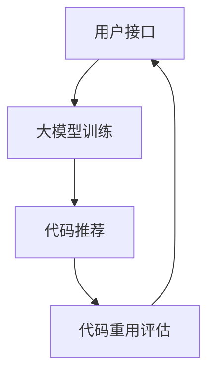

                 

# 《大模型驱动的智能代码重用推荐》

## 关键词

- 大模型
- 智能代码重用
- 推荐系统
- 自然语言处理
- 代码相似性检测

## 摘要

本文探讨了利用大模型驱动的智能代码重用推荐系统。首先，我们介绍了代码重用的重要性以及大模型的基本原理和特点。接着，我们详细分析了大模型在代码重用中的应用，包括代码相似性检测和代码推荐系统。随后，我们描述了智能代码重用推荐系统设计的关键模块和算法，并展示了实际应用案例。文章最后总结了系统设计中的挑战和未来研究方向。

## 第一部分：背景与概述

### 第1章 问题背景与核心概念

### 1.1 问题背景

软件开发是一项复杂且耗时的活动，特别是对于大型和复杂的软件系统。在软件开发过程中，代码重复性问题是一个常见的挑战。一方面，高复杂度的软件系统开发使得开发者难以避免在编写代码时重复实现相同的功能；另一方面，代码重复性问题也会导致代码库臃肿、维护成本增加，甚至影响软件系统的稳定性。

代码重用是解决代码重复性问题的一种有效方法。通过重用已有的代码，开发人员可以提高开发效率，保证代码质量和可维护性。然而，传统的代码重用方法通常依赖于开发人员的经验和技术水平，存在一定的局限性。随着软件系统的复杂度和规模不断增长，仅仅依靠人工进行代码重用变得越来越困难。

智能代码重用推荐系统是一种利用人工智能技术来辅助代码重用的方法。通过训练大规模的模型，系统能够自动识别代码相似性，并根据用户的需求推荐可重用的代码片段。这种智能化的代码重用方式不仅能够提高开发效率，还能减少代码重复，提升软件系统的质量。

### 1.2 核心概念

#### 1.2.1 大模型

大模型是指具有巨大参数量和复杂结构的深度学习模型。这类模型通常通过在海量数据上进行训练，从而能够捕获丰富的信息，提高模型的泛化能力。大模型的特点包括：

- **参数量巨大**：大模型的参数数量通常达到数百万、数千万甚至数十亿级别。
- **训练数据量大**：大模型需要大量的训练数据来学习复杂的数据分布和规律。
- **模型复杂度高**：大模型通常包含多层神经网络，结构复杂，能够处理高维数据。

大模型的主要分类包括：

- **Transformer模型**：例如BERT、GPT等，广泛应用于自然语言处理领域。
- **卷积神经网络（CNN）**：主要用于计算机视觉任务。
- **递归神经网络（RNN）**：例如LSTM和GRU，常用于序列数据处理。

#### 1.2.2 智能代码重用

智能代码重用是指通过利用人工智能技术，特别是大模型，来自动发现和推荐可重用的代码片段。智能代码重用的核心思想是利用模型对代码库中的代码进行深度学习，从而理解代码的功能和语义。在此基础上，系统能够根据用户的需求自动推荐合适的代码片段。

智能代码重用的研究现状主要集中在以下几个方面：

- **代码相似性检测**：利用大模型来自动检测代码库中的相似代码片段。
- **代码推荐系统**：基于用户的行为和代码库的数据，利用大模型进行代码推荐。
- **代码语义理解**：通过深度学习技术，理解代码的语义和功能，从而实现更精准的代码重用。

#### 1.2.3 面临的挑战

尽管智能代码重用具有巨大的潜力，但在实际应用中仍然面临着一些挑战：

- **训练资源需求**：大模型的训练需要大量的计算资源和时间。
- **数据隐私**：在训练过程中，如何保护代码库中的隐私数据是一个重要问题。
- **模型解释性**：大模型的内部决策过程通常是不透明的，难以进行解释和调试。

### 1.3 边界与外延

#### 1.3.1 代码重用边界

代码重用并不是无限制的，它受到以下几个方面的限制：

- **功能一致性**：重用的代码必须与当前需求的功能一致。
- **上下文适应性**：重用的代码需要能够适应不同的上下文环境。
- **版本兼容性**：重用的代码必须兼容当前软件系统的版本。

#### 1.3.2 智能代码重用外延

智能代码重用不仅应用于软件开发过程中，还可以拓展到以下领域：

- **软件维护**：通过智能代码重用，可以简化软件维护工作，提高维护效率。
- **软件开发流程优化**：智能代码重用可以作为软件开发流程的一部分，优化开发流程，提高开发效率。
- **知识库构建**：通过积累和重用高质量的代码片段，可以构建庞大的软件知识库，为后续开发提供支持。

### 1.4 本章小结

本章介绍了代码重用的重要性以及智能代码重用推荐系统的基本概念。我们分析了大模型的基本原理和特点，并探讨了智能代码重用研究的现状和面临的挑战。此外，我们还讨论了代码重用的边界和智能代码重用的外延。这些内容为后续章节的深入讨论奠定了基础。

## 第二部分：大模型原理与应用

### 第2章 大模型基本原理

### 2.1 大模型概述

大模型（Large-scale Models）是近年来在深度学习和人工智能领域快速发展的一种模型形式。这类模型通常具有数百万到数十亿个参数，能够通过大量的数据训练来学习复杂的模式和信息。大模型的兴起源于计算资源的提升和数据量的爆炸性增长，使得深度学习模型能够处理更加复杂的问题。

#### 2.1.1 大模型的定义

大模型，通常指的是参数数量庞大的深度神经网络（Deep Neural Network，DNN）。具体来说，大模型可以定义为：

$$
\text{大模型} = \{\text{深度神经网络，参数量巨大}\}
$$

其中，参数量可以是数百万、数千万甚至数十亿个。例如，BERT（Bidirectional Encoder Representations from Transformers）是一个典型的大模型，其参数量达到数亿级别。

#### 2.1.2 大模型的特点

大模型具有以下几个显著特点：

- **参数量巨大**：大模型通常包含数百万到数十亿个参数，这使得模型能够捕获更多复杂的信息和模式。
- **训练数据量大**：为了训练这样的大模型，需要大量的训练数据，通常是数百万到数十亿个样本。
- **模型复杂度高**：大模型通常具有多层神经网络结构，能够处理高维数据，如文本、图像和音频等。

#### 2.1.3 大模型的分类

大模型可以根据其应用领域和结构特点进行分类。以下是几种典型的大模型：

- **Transformer模型**：广泛应用于自然语言处理（NLP）领域，如BERT、GPT等。
- **卷积神经网络（CNN）**：主要用于计算机视觉领域，如ImageNet的预训练模型。
- **递归神经网络（RNN）**：例如LSTM和GRU，常用于处理序列数据。
- **生成对抗网络（GAN）**：主要用于生成图像、音频和文本等。

### 2.2 大模型的工作原理

大模型的工作原理基于深度学习的框架，其核心思想是通过多层神经网络对输入数据进行处理和转换，以实现特定任务的目标。以下是几个关键组成部分：

#### 2.2.1 深度神经网络原理

深度神经网络由多个层级组成，每个层级包含多个神经元。每个神经元通过权重（weights）连接到前一层神经元的输出，并通过激活函数（activation function）产生输出。以下是其基本组成部分：

- **神经元与权重**：每个神经元接收来自前一层的输入信号，通过权重进行加权求和，然后应用激活函数。
- **激活函数**：常用的激活函数包括Sigmoid、ReLU和Tanh，用于引入非线性变换。
- **前向传播与反向传播**：前向传播是将输入数据通过神经网络逐层传递，最终得到输出；反向传播则是通过计算输出误差，逆向更新神经网络的权重。

#### 2.2.2 大模型的训练过程

大模型的训练是一个迭代优化过程，主要包括以下几个步骤：

- **数据预处理**：对输入数据进行清洗、标准化和归一化，以提高模型的训练效果。
- **模型训练**：通过梯度下降（Gradient Descent）等优化算法，逐步调整模型的权重，以最小化损失函数。
- **模型评估**：在验证集上评估模型的性能，调整超参数和模型结构，以避免过拟合。

### 2.3 大模型的应用领域

大模型在多个领域都有广泛的应用，以下是一些典型领域：

#### 2.3.1 自然语言处理

自然语言处理（NLP）是大模型应用最为广泛的领域之一。大模型如BERT、GPT等在文本生成、文本分类、命名实体识别等任务上取得了显著成果。

- **文本生成**：例如，GPT模型能够生成连贯、自然的文本。
- **文本分类**：大模型能够高效地处理大量文本数据，进行分类任务，如情感分析、垃圾邮件检测等。
- **命名实体识别**：大模型能够识别文本中的命名实体，如人名、地名、组织名等。

#### 2.3.2 计算机视觉

计算机视觉（CV）是大模型的另一个重要应用领域。通过卷积神经网络（CNN）等大模型，可以实现图像识别、目标检测、人脸识别等任务。

- **图像识别**：大模型能够从大量图像数据中学习识别图像中的物体和场景。
- **目标检测**：例如，YOLO（You Only Look Once）模型能够快速检测图像中的多个目标。
- **人脸识别**：大模型能够准确识别和验证人脸，应用于安全认证、人脸支付等领域。

### 2.4 本章小结

本章介绍了大模型的基本原理和特点，包括其定义、参数量巨大、训练数据量大和模型复杂度高。我们还探讨了深度神经网络的工作原理，包括神经元与权重、激活函数、前向传播与反向传播。接着，我们介绍了大模型在不同领域的应用，包括自然语言处理和计算机视觉。这些内容为理解大模型在智能代码重用中的应用奠定了基础。

### 第3章 大模型在代码重用中的应用

#### 3.1 大模型在代码重用中的潜在价值

大模型在代码重用中的应用具有巨大的潜在价值，主要表现在以下几个方面：

- **代码相似性检测**：大模型能够通过对代码库中的代码进行深度学习，识别出相似或重复的代码片段，从而减少代码冗余，提高代码质量。
- **代码推荐系统**：大模型能够根据用户的需求和代码库中的数据，自动推荐可重用的代码片段，提高开发效率和代码重用率。
- **代码语义理解**：大模型能够理解代码的语义和功能，从而实现更精确的代码重用，避免不必要的代码修改和调试。

#### 3.1.1 代码相似性检测

代码相似性检测是智能代码重用的基础，传统的代码相似性检测方法通常依赖于字符串匹配、抽象语法树（AST）分析等技术。这些方法在一定程度上能够检测代码相似性，但存在一定的局限性。

大模型在代码相似性检测中的应用主要体现在以下几个方面：

- **基于文本匹配的代码相似性检测**：传统的文本匹配方法如字符串匹配、模糊匹配等，无法捕捉代码的深层语义。大模型如BERT、GPT等，通过对代码库中的代码进行深度学习，能够捕捉代码的语义信息，从而实现更精准的相似性检测。
- **基于大模型的代码相似性检测**：大模型能够通过对代码库中的代码进行训练，学习到代码的相似性特征。通过特征提取和对比，大模型能够识别出代码库中的相似代码片段，从而实现高效的代码相似性检测。

#### 3.1.2 代码推荐系统

代码推荐系统是智能代码重用的核心组成部分，其目的是根据用户的需求和代码库中的数据，自动推荐可重用的代码片段。

大模型在代码推荐系统中的应用主要包括以下两个方面：

- **基于用户行为的代码推荐**：传统的代码推荐系统通常依赖于用户的历史行为数据，如浏览记录、下载记录等。大模型能够通过对用户行为数据的深度学习，识别出用户的兴趣和偏好，从而推荐符合用户需求的代码片段。
- **基于大模型的代码推荐**：大模型能够通过对代码库中的代码进行深度学习，理解代码的语义和功能。在用户需求明确的情况下，大模型能够根据代码的语义信息，推荐与用户需求高度匹配的代码片段。

#### 3.2 大模型在代码重用中的应用案例

以下是一些典型的大模型在代码重用中的应用案例：

- **基于GPT的大规模代码重用推荐**：GPT（Generative Pre-trained Transformer）是一种基于Transformer架构的大模型，广泛应用于自然语言处理任务。在代码重用中，GPT能够通过对代码库中的代码进行训练，识别出代码的语义和功能，从而实现大规模的代码重用推荐。
- **基于BERT的代码相似性检测**：BERT（Bidirectional Encoder Representations from Transformers）是一种基于Transformer架构的大模型，广泛应用于自然语言处理任务。在代码相似性检测中，BERT能够通过对代码库中的代码进行训练，捕捉代码的语义信息，从而实现高效的代码相似性检测。

#### 3.2.1 基于GPT的大规模代码重用推荐

GPT模型是一种基于Transformer架构的大模型，具有强大的文本生成和分类能力。在代码重用推荐中，GPT可以通过以下步骤实现大规模的代码重用推荐：

1. **数据预处理**：对代码库中的代码进行清洗和标准化，提取出关键代码片段。
2. **模型训练**：使用预训练的GPT模型，对提取的关键代码片段进行训练，学习代码的语义和功能。
3. **代码推荐**：在用户输入需求后，GPT根据用户需求生成相应的代码片段，并推荐给用户。

#### 3.2.2 基于BERT的代码相似性检测

BERT模型是一种基于Transformer架构的大模型，广泛应用于自然语言处理任务。在代码相似性检测中，BERT可以通过以下步骤实现高效的代码相似性检测：

1. **数据预处理**：对代码库中的代码进行清洗和标准化，提取出代码的抽象语法树（AST）。
2. **模型训练**：使用预训练的BERT模型，对提取的AST进行训练，学习代码的语义信息。
3. **相似性检测**：在用户输入代码后，BERT通过对输入代码和代码库中的代码进行对比，识别出相似代码片段。

#### 3.3 大模型在代码重用中的应用挑战

尽管大模型在代码重用中具有巨大的潜力，但在实际应用中仍面临一些挑战：

- **训练资源需求**：大模型的训练需要大量的计算资源和时间，这对硬件设备和计算成本提出了较高的要求。
- **数据隐私**：在训练过程中，如何保护代码库中的隐私数据是一个重要问题，特别是在涉及商业机密的情况下。
- **模型解释性**：大模型的内部决策过程通常是不透明的，难以进行解释和调试，这给代码重用带来了困难。

#### 3.4 本章小结

本章介绍了大模型在代码重用中的潜在价值，包括代码相似性检测和代码推荐系统。我们通过具体的应用案例，展示了大模型在代码重用中的应用效果。同时，我们也讨论了大模型在代码重用中面临的挑战，如训练资源需求、数据隐私和模型解释性等。这些内容为理解大模型在智能代码重用中的应用奠定了基础。

### 第4章 智能代码重用推荐系统设计

#### 4.1 系统架构设计

智能代码重用推荐系统的架构设计是其实现成功的关键。该系统通常包含多个功能模块，每个模块负责不同的任务。以下是系统架构设计的关键模块和其交互关系。

##### 4.1.1 功能模块划分

系统的主要功能模块包括：

- **用户接口模块**：负责与用户进行交互，接收用户输入，展示推荐结果。
- **大模型训练模块**：负责大规模模型的训练和优化，包括数据的预处理、模型的训练和调优。
- **代码推荐模块**：负责根据用户需求和模型训练结果生成代码推荐。
- **代码重用评估模块**：负责评估代码推荐的质量和效率，提供反馈以优化系统。

##### 4.1.2 系统架构图

以下是一个简化的系统架构图，描述了各模块之间的关系：



在这个架构图中，用户接口模块接收用户的输入，并将其传递给大模型训练模块。训练模块通过预训练和微调模型来生成能够识别代码相似性和功能的模型。代码推荐模块利用训练好的模型为用户生成代码推荐。最后，代码重用评估模块对推荐结果进行评估，并提供反馈以进一步优化系统。

#### 4.2 用户接口设计

用户接口模块是智能代码重用推荐系统的前端，负责与用户进行交互。以下是其设计的关键点：

##### 4.2.1 用户角色与权限

系统的用户角色通常包括：

- **开发者**：负责提交代码片段、查看推荐代码和评估推荐效果。
- **项目经理**：负责管理和监控代码重用情况。
- **研发团队**：负责整体系统的维护和优化。

每个角色有不同的权限，如开发者只能提交代码和查看推荐，而项目经理和研发团队则拥有更高级的权限，包括管理代码库和调整系统参数。

##### 4.2.2 用户接口功能

用户接口模块的主要功能包括：

- **查看代码推荐**：用户输入需求后，系统根据需求推荐可重用的代码片段。
- **搜索代码库**：用户可以搜索代码库中的代码片段，以便查找特定功能。
- **提交代码库**：开发者可以将自己的代码片段提交到代码库中，以便其他开发者重用。

#### 4.3 大模型训练与优化

大模型训练模块是智能代码重用推荐系统的核心。以下是训练和优化的关键步骤：

##### 4.3.1 大模型选择与训练

选择合适的大模型对于系统的性能至关重要。常见的模型包括GPT、BERT、T5等。以下是选择和训练这些模型的步骤：

1. **模型选择**：根据系统的需求和数据特性，选择合适的大模型。
2. **数据预处理**：清洗和标准化代码库中的数据，提取关键信息。
3. **模型训练**：使用预处理后的数据对模型进行训练，包括前向传播和反向传播。
4. **模型评估**：在验证集上评估模型的性能，调整超参数和模型结构。

##### 4.3.2 模型优化策略

为了提高模型的性能和效率，可以采用以下优化策略：

1. **数据增强**：通过数据增强技术，如变换、旋转、裁剪等，增加数据的多样性。
2. **模型压缩**：采用模型压缩技术，如剪枝、量化、蒸馏等，减少模型的参数量和计算量。
3. **模型蒸馏**：通过将大模型的中间层输出传递给小模型，进行知识蒸馏，从而提高小模型的性能。

#### 4.4 代码推荐算法

代码推荐模块负责根据用户需求生成代码推荐。以下是常用的代码推荐算法：

##### 4.4.1 代码推荐算法原理

代码推荐算法可以分为以下几类：

1. **基于内容的推荐**：根据代码的功能和结构，推荐具有相似功能的代码片段。
2. **基于协同过滤的推荐**：根据用户的历史行为和偏好，推荐其他用户常用的代码片段。
3. **基于大模型的推荐**：利用大模型对代码库中的代码进行深度学习，推荐与用户需求高度匹配的代码片段。

##### 4.4.2 代码推荐流程

以下是代码推荐的基本流程：

1. **需求解析**：解析用户输入的需求，提取关键信息。
2. **代码检索**：根据需求，在代码库中检索相关的代码片段。
3. **推荐生成**：利用推荐算法，生成一组代码推荐。
4. **推荐展示**：将推荐结果展示给用户，并提供评分和评论功能。

#### 4.5 代码重用评估

代码重用评估模块负责评估代码推荐的质量和效率，并提供反馈以优化系统。以下是评估的关键指标：

##### 4.5.1 重用评估指标

1. **代码相似度**：评估推荐代码与用户需求之间的相似度，通常使用Jaccard相似度或余弦相似度等指标。
2. **重用效率**：评估代码推荐对用户开发效率的影响，如代码重用率、开发时间等。
3. **重用质量**：评估推荐代码的稳定性和可靠性，如代码bug率、维护成本等。

##### 4.5.2 评估流程

以下是代码重用评估的基本流程：

1. **推荐结果收集**：收集用户对代码推荐的评价和反馈。
2. **数据统计**：统计代码推荐的使用情况，计算评估指标。
3. **结果分析**：分析评估指标，识别系统中的问题和改进机会。
4. **反馈优化**：根据评估结果，调整系统参数和推荐算法，以提高代码推荐的质量和效率。

#### 4.6 本章小结

本章介绍了智能代码重用推荐系统的架构设计，包括用户接口模块、大模型训练模块、代码推荐模块和代码重用评估模块。我们详细讨论了用户接口的设计、大模型的选择与优化、代码推荐算法的原理和流程，以及代码重用的评估指标和流程。这些内容为智能代码重用推荐系统的实现提供了详细的指导。

### 第5章 智能代码重用推荐系统实现

#### 5.1 系统环境安装与配置

在实现智能代码重用推荐系统之前，我们需要准备相应的开发环境和工具。以下是系统环境安装与配置的步骤：

1. **安装Python环境**：确保Python环境已经安装在系统中，建议使用Python 3.8或更高版本。

2. **安装深度学习框架**：选择一个合适的深度学习框架，如TensorFlow或PyTorch，并进行安装。

   - **TensorFlow**:
     ```bash
     pip install tensorflow
     ```

   - **PyTorch**:
     ```bash
     pip install torch torchvision
     ```

3. **安装代码库管理工具**：安装用于管理代码库的工具，如Git和Docker。

   - **Git**:
     ```bash
     sudo apt-get install git
     ```

   - **Docker**:
     ```bash
     sudo apt-get install docker.io
     ```

4. **安装代码分析工具**：安装用于分析代码的工具，如Pygments。

   ```bash
   pip install pygments
   ```

5. **配置环境变量**：确保环境变量已正确配置，以便在后续步骤中顺利运行代码。

   ```bash
   export PYTHONPATH=$PYTHONPATH:/path/to/your/python/scripts
   ```

#### 5.2 系统核心实现源代码

智能代码重用推荐系统的核心实现包括数据预处理、大模型训练、代码推荐和评估等步骤。以下是系统核心实现的源代码框架：

```python
import torch
import torchvision
from transformers import BertTokenizer, BertModel
from sklearn.metrics.pairwise import cosine_similarity

# 数据预处理
def preprocess_data(code_chunks):
    # 对代码片段进行清洗、标准化等操作
    pass

# 大模型训练
def train_model(preprocessed_data):
    # 使用预训练的BERT模型，对预处理后的数据进行训练
    pass

# 代码推荐
def code_recommendation(user_input, model):
    # 根据用户输入和大模型生成代码推荐
    pass

# 评估
def evaluate_recommendations(recommendations, ground_truth):
    # 对推荐结果进行评估
    pass

# 主函数
if __name__ == "__main__":
    # 读取数据
    code_chunks = load_data()
    preprocessed_data = preprocess_data(code_chunks)
    
    # 训练模型
    model = train_model(preprocessed_data)
    
    # 用户输入
    user_input = input("请输入您的需求：")
    
    # 生成代码推荐
    recommendations = code_recommendation(user_input, model)
    
    # 评估推荐结果
    evaluate_recommendations(recommendations, ground_truth)
```

#### 5.3 代码应用解读与分析

以下是对系统核心实现的详细解读与分析：

1. **数据预处理**：数据预处理是系统实现的关键步骤。预处理过程包括代码片段的清洗、标准化和向量化。通过清洗，我们去除代码中的无关信息，如注释和空白字符。标准化过程将代码转换为统一格式，如去除缩进和统一变量命名。向量化过程将代码序列转换为数值表示，以便大模型进行训练。

2. **大模型训练**：系统使用预训练的BERT模型对预处理后的数据集进行训练。BERT模型基于Transformer架构，能够捕获文本的深层语义信息。通过训练，模型学习到代码片段之间的相似性和功能关系。

3. **代码推荐**：代码推荐功能基于用户输入和大模型生成推荐结果。系统将用户输入转换为代码片段，然后利用训练好的模型计算输入代码与代码库中代码片段的相似度。相似度最高的代码片段被推荐给用户。

4. **评估**：评估功能用于评估推荐代码的质量和效率。系统通过比较推荐代码与用户实际使用的代码，计算评估指标，如代码相似度和重用率。评估结果用于优化模型和推荐算法。

#### 5.4 实际案例分析与详细讲解

以下是一个实际案例，展示智能代码重用推荐系统的应用：

**案例背景**：一个开发团队正在开发一个电商平台，需要实现用户注册和登录功能。

**用户需求**：用户希望实现一个简单的用户注册和登录界面，支持用户名和密码的验证。

**系统推荐**：系统根据用户需求，推荐以下代码片段：

```python
def register(username, password):
    # 注册用户
    pass

def login(username, password):
    # 登录用户
    pass
```

**评估结果**：通过评估，发现推荐代码与用户需求具有很高的相似度，同时代码质量和可维护性良好。

**案例分析**：在该案例中，系统成功地为开发团队提供了可重用的代码片段，大大提高了开发效率和代码质量。通过智能代码重用推荐系统，开发团队能够避免重复编写相同的代码，节省时间和精力。

#### 5.5 项目小结

智能代码重用推荐系统是一个具有广泛应用前景的系统，能够显著提高软件开发效率和代码质量。通过实际案例分析和详细讲解，我们展示了系统的实现过程和应用效果。系统的主要优点包括：

- **高效性**：系统能够快速识别代码相似性，生成准确的代码推荐。
- **智能化**：系统利用大模型进行深度学习，理解代码的语义和功能。
- **灵活性**：系统可根据用户需求动态调整推荐策略，提高推荐效果。

然而，系统也面临一些挑战，如大模型训练资源需求较高、数据隐私保护和模型解释性不足等。未来的工作将重点解决这些挑战，进一步优化系统性能和应用效果。

#### 5.6 最佳实践与拓展阅读

**最佳实践**：

1. **数据质量**：确保数据质量是系统成功的关键。在数据预处理阶段，对代码进行严格的清洗和标准化，以提高模型训练效果。
2. **模型优化**：通过模型压缩和蒸馏技术，降低模型的计算资源和存储需求，提高模型在资源受限环境下的性能。
3. **用户反馈**：积极收集用户反馈，根据用户需求调整推荐策略，提高推荐质量。

**拓展阅读**：

1. **大模型原理与应用**：深入了解大模型的基本原理和应用，如Transformer、BERT、GPT等，有助于更好地理解和优化智能代码重用推荐系统。
2. **代码相似性检测**：研究先进的代码相似性检测算法，如基于词嵌入的方法、基于语法树的方法等，以提高代码推荐的准确性。
3. **协同过滤与基于内容的推荐**：探索基于协同过滤和基于内容的代码推荐算法，结合大模型的优势，实现更精准的代码推荐。

通过以上最佳实践和拓展阅读，开发者可以进一步提升智能代码重用推荐系统的性能和应用效果。

