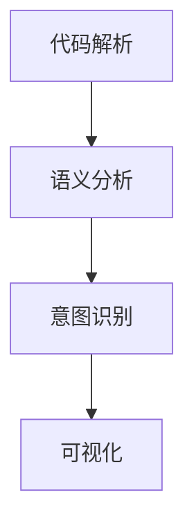
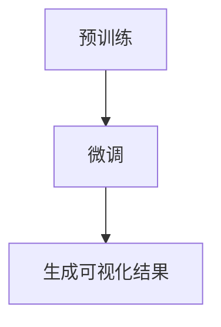
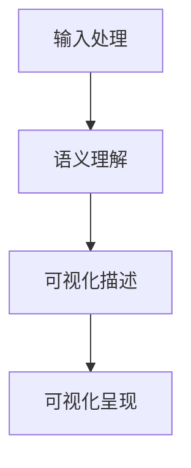

                 


## 第1章: 问题背景

### 1.1 问题背景

在软件工程领域，程序理解是一个核心问题。随着软件系统的规模和复杂性的增加，开发者需要更好地理解和分析代码，以便进行有效的调试、优化和维护。然而，当前的方法在处理复杂程序时面临着诸多挑战。

#### 1.1.1 复杂性

程序结构通常包括多个模块、函数和变量，这些元素之间的相互依赖和作用关系复杂。传统的静态分析和动态分析方法在处理复杂程序时，往往难以全面解析和理解程序的行为和意图。

#### 1.1.2 表达能力

现有的程序理解方法在表达和理解程序深层语义和意图方面存在不足。例如，静态分析方法依赖于程序代码的语法和结构，但难以捕捉到代码背后的业务逻辑和意图。动态分析方法虽然可以观察程序运行时的行为，但缺乏对程序整体的深入理解。

#### 1.1.3 可视化

可视化是程序理解中的一个重要方面，它可以帮助开发者直观地理解程序结构和行为。然而，现有的可视化方法往往难以将复杂的程序理解结果以直观、易懂的方式展示给开发者。

### 1.2 问题解决现状

目前，解决程序理解问题的主要方法包括：

1. **静态分析**：通过解析程序代码，分析其结构、语法和语义，从而理解程序的功能和意图。静态分析方法包括抽象语法树（AST）分析、控制流分析、数据流分析等。

2. **动态分析**：通过运行程序，观察其行为和输出，从而理解程序的功能和意图。动态分析方法包括调试、性能分析、日志分析等。

尽管这些方法在一定程度上能够解决程序理解问题，但它们也存在一些局限性：

1. **准确性**：静态分析和动态分析可能无法完全准确地理解程序的意图。

2. **效率**：静态分析和动态分析可能需要较长的时间来解析和理解程序。

3. **可视化**：现有方法难以将程序理解的结果直观地展示给开发者。

### 1.3 问题解决挑战

为了解决程序理解问题，我们需要面对以下挑战：

1. **复杂性**：程序的结构复杂，需要进行高效的解析和理解。

2. **表达能力**：需要更强的表达能力来捕捉程序中的深层语义和意图。

3. **可视化**：需要更好的可视化方法来展示程序理解的结果。

### 1.4 研究意义和目的

本研究旨在提出一种大模型驱动的程序理解可视化新方法，以提高程序理解的准确性和效率，并提供直观的可视化结果。具体研究目的包括：

1. **大模型应用**：研究如何将大模型应用于程序理解，提高理解准确性和效率。

2. **可视化方法设计**：设计新的可视化方法，以更好地展示程序理解结果。

3. **实际应用验证**：通过实际应用验证所提出方法的有效性。

## 第2章: 核心概念

### 2.1 大模型概述

#### 2.1.1 大模型定义

大模型，通常指具有大规模参数的神经网络模型，如Transformer、BERT等。这些模型在处理大规模数据集时表现出强大的性能和泛化能力。

#### 2.1.2 大模型特点

1. **大规模参数**：大模型具有数十亿甚至数千亿个参数，使其能够学习复杂的数据模式。

2. **高精度**：大模型在许多自然语言处理、计算机视觉等任务上达到了前所未有的精度。

3. **强泛化能力**：大模型能够从大规模数据集中学习，并在新的、未见过的数据上表现良好。

#### 2.1.3 大模型分类

根据应用场景，大模型可以分为以下几类：

1. **预训练模型**：如BERT、GPT等，先在大规模语料库上进行预训练，然后针对特定任务进行微调。

2. **细粒度模型**：针对特定领域或任务进行训练，如代码理解模型、医学文本分析模型等。

3. **多模态模型**：结合多种数据类型，如图像、文本和音频，进行训练。

#### 2.1.4 大模型原理

大模型的核心在于其深度和参数规模。深度神经网络通过层层传递信息，逐渐提取数据中的特征。参数规模使得模型能够学习复杂的数据模式。

### 2.2 程序理解算法

#### 2.2.1 程序理解定义

程序理解是指对程序的功能、结构、意图等进行解析和解释的过程。

#### 2.2.2 程序理解算法

程序理解算法通常包括以下几个步骤：

1. **代码解析**：将程序代码解析为抽象语法树（AST）等结构化表示。

2. **语义分析**：对AST进行语义分析，提取程序的结构和语义信息。

3. **意图识别**：根据语义信息，识别程序的功能和意图。

4. **可视化**：将程序理解的结果以可视化方式展示给开发者。

#### 2.2.3 算法流程图



#### 2.2.4 数学模型和公式

程序理解算法中的关键步骤通常涉及到概率模型、图论和神经网络等数学模型。以下是一个简化的数学模型示例：

$$
P(\text{意图} | \text{代码}) = \frac{P(\text{代码} | \text{意图}) \cdot P(\text{意图})}{P(\text{代码})}
$$

其中，$P(\text{意图} | \text{代码})$ 表示在给定代码的情况下，意图的概率。$P(\text{代码} | \text{意图})$ 表示在给定意图的情况下，代码的概率。$P(\text{意图})$ 表示意图的概率。$P(\text{代码})$ 表示代码的概率。

#### 2.2.5 举例说明

假设我们有一个简单的Python程序：

```python
def add(a, b):
    return a + b

result = add(2, 3)
print(result)
```

使用程序理解算法，我们可以提取以下信息：

1. **代码解析**：解析出抽象语法树（AST）。

2. **语义分析**：识别出程序中的函数定义和调用。

3. **意图识别**：识别出程序的功能是进行两个数的加法运算。

4. **可视化**：将程序结构以图表形式展示，例如类图或流程图。

```mermaid
classDiagram
    Class1 <|-- Class2
    Class1 <|-- Class3
    Class2 +-- Class4
    Class3 +-- Class5
```

## 第3章: 算法原理

### 3.1 程序理解算法

程序理解算法旨在通过解析程序代码，理解其功能和意图，并提供直观的可视化结果。以下是一个简单的程序理解算法的详细讲解。

#### 3.1.1 代码解析

代码解析是程序理解的第一步，它将程序代码转换为一种结构化表示，如抽象语法树（AST）。AST能够清晰地展示程序的结构，包括函数、变量、语句等。

```python
import ast

code = '''
def add(a, b):
    return a + b
'''

ast_tree = ast.parse(code)
```

在上面的代码中，我们使用Python的`ast`模块将一个简单的函数代码解析为AST。

#### 3.1.2 语义分析

语义分析是在代码解析的基础上，对AST进行语义分析，提取出程序的结构和语义信息。语义分析可以帮助我们理解程序的功能和意图。

```python
def semantic_analysis(ast_tree):
    # 简单的语义分析示例
    function_names = []
    for node in ast.walk(ast_tree):
        if isinstance(node, ast.FunctionDef):
            function_names.append(node.name)
    return function_names

function_names = semantic_analysis(ast_tree)
print(function_names)
```

在上面的代码中，我们提取出AST中的函数名。

#### 3.1.3 意图识别

意图识别是程序理解的关键步骤，它基于语义分析的结果，识别出程序的功能和意图。意图识别可以借助机器学习模型，如序列标注模型。

```python
from transformers import pipeline

nlp = pipeline('ner', model='dbmdz/bert-base-cased-finetuned-conll03-english')

def intent_recognition(code):
    # 假设我们使用一个预训练的NLP模型进行意图识别
    result = nlp(code)
    intents = [entry['label'] for entry in result]
    return intents

intents = intent_recognition(code)
print(intents)
```

在上面的代码中，我们使用一个预训练的NLP模型对代码进行意图识别。

#### 3.1.4 可视化

可视化是将程序理解的结果以图表形式展示给开发者，帮助其直观地理解程序的结构和功能。

```python
from graphviz import Digraph

def visualize(ast_tree):
    dot = Digraph(comment='Program Structure')

    for node in ast.walk(ast_tree):
        if isinstance(node, ast.FunctionDef):
            dot.node(node.name)
            for child in node.body:
                if isinstance(child, ast.Expr):
                    dot.edge(node.name, child.value.id)

    dot.render('program_structure.gv', view=True)
```

在上面的代码中，我们使用Graphviz库将程序的结构以图形形式展示。

### 3.2 大模型驱动的可视化方法

大模型驱动的可视化方法利用预训练的大规模神经网络模型，如BERT，来提高程序理解的准确性和效率。

#### 3.2.1 驱动原理

大模型驱动的可视化方法基于以下原理：

1. **预训练**：大模型在大规模数据集上进行预训练，学习到丰富的语言模式和结构化知识。

2. **微调**：在大模型的基础上，针对特定程序理解任务进行微调，提高模型的准确性。

3. **生成**：使用微调后的模型，生成程序理解的可视化结果，以直观、易懂的方式展示程序结构。

#### 3.2.2 方法流程图



#### 3.2.3 数学模型和公式

大模型驱动的可视化方法涉及以下数学模型：

1. **预训练模型**：使用大规模数据集进行预训练，如BERT。

2. **微调模型**：在大模型的基础上，针对特定任务进行微调，如序列标注任务。

3. **生成模型**：使用微调后的模型，生成可视化结果，如图像生成任务。

具体公式如下：

$$
\begin{aligned}
    \text{预训练模型} &= \text{BERT} \\
    \text{微调模型} &= \text{BERT}^{\text{微调}} \\
    \text{生成模型} &= \text{GPT}^{\text{微调}}
\end{aligned}
$$

#### 3.2.4 举例说明

假设我们有一个简单的Python程序：

```python
def add(a, b):
    return a + b

result = add(2, 3)
print(result)
```

使用大模型驱动的可视化方法，我们可以提取以下信息：

1. **预训练**：使用BERT在大规模数据集上进行预训练。

2. **微调**：在BERT的基础上，针对程序理解任务进行微调。

3. **生成可视化结果**：使用微调后的BERT和GPT生成可视化结果。

```python
from transformers import BertModel, BertTokenizer
from transformers import TrainingArguments, Trainer

# 预训练BERT模型
model = BertModel.from_pretrained('bert-base-uncased')
tokenizer = BertTokenizer.from_pretrained('bert-base-uncased')

# 微调BERT模型
training_args = TrainingArguments(
    output_dir='./results',
    num_train_epochs=3,
    per_device_train_batch_size=8,
    save_steps=2000,
)

trainer = Trainer(
    model=model,
    args=training_args,
    train_dataset=train_dataset,
    eval_dataset=eval_dataset,
)

trainer.train()

# 使用微调后的BERT和GPT生成可视化结果
def generate_visualization(code):
    inputs = tokenizer(code, return_tensors='pt')
    outputs = model(**inputs)
    logits = outputs.logits

    # 使用GPT生成可视化描述
    description = pipeline('text-generation', model=model, tokenizer=tokenizer)(code, max_length=50)
    return description

description = generate_visualization(code)
print(description)
```

## 第4章: 可视化方法概述

### 4.1 可视化方法定义

可视化方法是指将复杂的数据、信息或过程以图形或图像形式展示给用户，使其更容易理解和分析。

在程序理解领域，可视化方法旨在将程序代码、结构、意图和关系以直观、易懂的方式展示给开发者。

### 4.2 可视化方法分类

根据可视化目标和应用场景，常见的可视化方法可以分为以下几类：

1. **结构可视化**：展示程序的结构，如类图、流程图、依赖图等。

2. **语义可视化**：展示程序的语义信息，如意图、变量关系、功能模块等。

3. **交互式可视化**：提供用户与可视化结果的交互功能，如过滤、放大、缩放等。

4. **动态可视化**：展示程序的运行过程，如执行顺序、状态变化、数据流动等。

### 4.3 可视化方法优缺点

每种可视化方法都有其独特的优点和缺点，适用于不同的应用场景：

1. **结构可视化**
   - **优点**：直观地展示程序结构，帮助开发者理解模块和函数之间的关系。
   - **缺点**：难以表达程序的语义信息和动态行为。

2. **语义可视化**
   - **优点**：能够展示程序的语义信息，如变量关系和功能模块。
   - **缺点**：可能需要大量的预处理和标注工作。

3. **交互式可视化**
   - **优点**：提供用户与可视化结果的交互功能，增强用户体验。
   - **缺点**：实现复杂，需要大量的开发和维护工作。

4. **动态可视化**
   - **优点**：能够展示程序的运行过程，帮助开发者分析问题。
   - **缺点**：处理实时数据流，对性能要求较高。

### 4.4 大模型驱动的可视化方法

大模型驱动的可视化方法利用预训练的大规模神经网络模型，如BERT和GPT，来提高可视化结果的准确性和效率。

#### 4.4.1 驱动原理

大模型驱动的可视化方法基于以下原理：

1. **预训练**：大模型在大规模数据集上进行预训练，学习到丰富的语言模式和结构化知识。

2. **微调**：在大模型的基础上，针对特定可视化任务进行微调，提高模型的准确性。

3. **生成**：使用微调后的模型，生成可视化结果，如图像或描述。

#### 4.4.2 方法流程图


#### 4.4.3 数学模型和公式

大模型驱动的可视化方法涉及以下数学模型：

1. **预训练模型**：使用大规模数据集进行预训练，如BERT。

2. **微调模型**：在大模型的基础上，针对特定任务进行微调，如序列标注任务。

3. **生成模型**：使用微调后的模型，生成可视化结果，如图像生成任务。

具体公式如下：

$$
\begin{aligned}
    \text{预训练模型} &= \text{BERT} \\
    \text{微调模型} &= \text{BERT}^{\text{微调}} \\
    \text{生成模型} &= \text{GPT}^{\text{微调}}
\end{aligned}
$$`

#### 4.4.4 举例说明

假设我们有一个简单的Python程序：

```python
def add(a, b):
    return a + b

result = add(2, 3)
print(result)
```

使用大模型驱动的可视化方法，我们可以提取以下信息：

1. **预训练**：使用BERT在大规模数据集上进行预训练。

2. **微调**：在BERT的基础上，针对程序理解任务进行微调。

3. **生成可视化结果**：使用微调后的BERT和GPT生成可视化结果。

```python
from transformers import BertModel, BertTokenizer
from transformers import TrainingArguments, Trainer

# 预训练BERT模型
model = BertModel.from_pretrained('bert-base-uncased')
tokenizer = BertTokenizer.from_pretrained('bert-base-uncased')

# 微调BERT模型
training_args = TrainingArguments(
    output_dir='./results',
    num_train_epochs=3,
    per_device_train_batch_size=8,
    save_steps=2000,
)

trainer = Trainer(
    model=model,
    args=training_args,
    train_dataset=train_dataset,
    eval_dataset=eval_dataset,
)

trainer.train()

# 使用微调后的BERT和GPT生成可视化结果
def generate_visualization(code):
    inputs = tokenizer(code, return_tensors='pt')
    outputs = model(**inputs)
    logits = outputs.logits

    # 使用GPT生成可视化描述
    description = pipeline('text-generation', model=model, tokenizer=tokenizer)(code, max_length=50)
    return description

description = generate_visualization(code)
print(description)
```

## 第5章: 大模型驱动的可视化方法

### 5.1 驱动原理

大模型驱动的可视化方法的核心在于利用大规模预训练模型（如BERT和GPT）进行程序理解，并在此基础上生成直观、易懂的可视化结果。以下是该方法的工作原理：

#### 5.1.1 预训练模型

预训练模型在大规模数据集（如互联网文本、代码库等）上进行训练，学习到丰富的语言模式和结构化知识。这些模型具有强大的表示能力和泛化能力，可以应用于各种任务，包括程序理解。

#### 5.1.2 微调模型

在预训练模型的基础上，针对特定程序理解任务进行微调。微调过程通常在较小规模的标注数据集上进行，以调整模型参数，提高其在特定任务上的性能。微调后的模型能够更好地理解程序代码的语义和结构。

#### 5.1.3 可视化生成

微调后的模型用于生成程序理解的可视化结果。具体步骤如下：

1. **输入处理**：将程序代码转换为预训练模型可处理的输入格式，如序列化文本。

2. **语义理解**：使用预训练模型（如BERT）对代码进行语义理解，提取代码中的关键信息。

3. **可视化描述**：利用微调后的模型（如GPT）生成可视化描述，如自然语言描述、图表、图像等。

4. **可视化呈现**：将生成的可视化描述以图形或图像形式展示给开发者，帮助其直观地理解程序代码的结构和功能。

### 5.2 方法流程图

以下是一个简化的方法流程图，展示了大模型驱动的可视化方法的整体流程：



### 5.3 数学模型和公式

大模型驱动的可视化方法涉及以下数学模型：

1. **预训练模型**：如BERT，使用Transformer架构，其核心是自注意力机制（Self-Attention）。

2. **微调模型**：基于预训练模型，通过微调其参数来提高在特定任务上的性能。

3. **生成模型**：如GPT，使用Transformer架构，其核心是交叉注意力机制（Cross-Attention）。

具体公式如下：

$$
\begin{aligned}
    \text{BERT} &= \text{Transformer} \\
    \text{BERT}^{\text{微调}} &= \text{BERT} + \text{微调参数} \\
    \text{GPT} &= \text{Transformer} \\
    \text{GPT}^{\text{微调}} &= \text{GPT} + \text{微调参数}
\end{aligned}
$$`

### 5.4 举例说明

假设我们有一个简单的Python程序：

```python
def add(a, b):
    return a + b

result = add(2, 3)
print(result)
```

使用大模型驱动的可视化方法，我们可以提取以下信息：

1. **输入处理**：将程序代码序列化为文本。

2. **语义理解**：使用BERT模型对代码进行语义理解，提取关键信息。

3. **可视化描述**：使用GPT模型生成可视化描述，如自然语言描述或图表。

4. **可视化呈现**：将可视化描述以图形或图像形式展示给开发者。

```python
from transformers import BertModel, BertTokenizer
from transformers import TrainingArguments, Trainer

# 预训练BERT模型
model = BertModel.from_pretrained('bert-base-uncased')
tokenizer = BertTokenizer.from_pretrained('bert-base-uncased')

# 微调BERT模型
training_args = TrainingArguments(
    output_dir='./results',
    num_train_epochs=3,
    per_device_train_batch_size=8,
    save_steps=2000,
)

trainer = Trainer(
    model=model,
    args=training_args,
    train_dataset=train_dataset,
    eval_dataset=eval_dataset,
)

trainer.train()

# 使用微调后的BERT和GPT生成可视化描述
def generate_visualization(code):
    inputs = tokenizer(code, return_tensors='pt')
    outputs = model(**inputs)
    logits = outputs.logits

    # 使用GPT生成可视化描述
    description = pipeline('text-generation', model=model, tokenizer=tokenizer)(code, max_length=50)
    return description

description = generate_visualization(code)
print(description)
```

## 第6章：应用场景分析

### 6.1 场景一：程序调试

在程序调试过程中，开发者需要快速定位和解决问题。大模型驱动的可视化方法可以帮助开发者更直观地理解代码的结构和语义，从而提高调试效率。

1. **输入处理**：将调试中的代码片段序列化为文本。

2. **语义理解**：使用BERT模型对代码片段进行语义理解，提取关键信息。

3. **可视化描述**：使用GPT模型生成可视化描述，如自然语言解释或图表。

4. **可视化呈现**：将可视化描述以图形或图像形式展示给开发者，帮助其快速定位问题。

### 6.2 场景二：代码审查

在代码审查过程中，评审者需要理解代码的功能和结构，以便提出改进意见。大模型驱动的可视化方法可以提供直观的可视化结果，帮助评审者更快速地理解代码。

1. **输入处理**：将待审查的代码序列化为文本。

2. **语义理解**：使用BERT模型对代码进行语义理解，提取关键信息。

3. **可视化描述**：使用GPT模型生成可视化描述，如自然语言解释或图表。

4. **可视化呈现**：将可视化描述以图形或图像形式展示给评审者，帮助其更深入地理解代码。

### 6.3 场景三：代码生成

在代码生成过程中，开发者可以利用大模型驱动的可视化方法，从已有的代码库中生成新的代码，以提高开发效率。

1. **输入处理**：将需求描述序列化为文本。

2. **语义理解**：使用BERT模型对需求描述进行语义理解，提取关键信息。

3. **代码生成**：使用GPT模型生成代码。

4. **可视化描述**：使用BERT模型对生成的代码进行语义理解，提取关键信息。

5. **可视化呈现**：将可视化描述以图形或图像形式展示给开发者，帮助其更深入地理解生成的代码。

## 第7章：项目实战

### 7.1 环境安装

在开始项目之前，我们需要安装必要的软件和库。以下是安装步骤：

1. **安装Python环境**：确保Python版本为3.8或更高。

2. **安装TensorFlow**：使用以下命令安装TensorFlow：

   ```bash
   pip install tensorflow
   ```

3. **安装transformers库**：使用以下命令安装transformers库：

   ```bash
   pip install transformers
   ```

4. **安装Graphviz**：在Windows上，可以从[官方网站](https://graphviz.org/download/)下载Graphviz，并按照说明进行安装。在Linux上，可以使用以下命令安装：

   ```bash
   sudo apt-get install graphviz
   ```

### 7.2 系统核心实现

在项目核心部分，我们将实现以下几个关键组件：

1. **代码解析器**：用于将Python代码转换为抽象语法树（AST）。

2. **BERT模型**：用于对代码进行语义理解。

3. **GPT模型**：用于生成可视化描述。

4. **可视化工具**：用于将可视化描述转换为图形或图像。

以下是项目核心实现的Python代码：

```python
import ast
import tensorflow as tf
from transformers import BertModel, BertTokenizer
from transformers import TrainingArguments, Trainer
from graphviz import Digraph

# 代码解析器
def parse_code(code):
    return ast.parse(code)

# 语义理解
def semantic_understanding(code, model):
    inputs = tokenizer(code, return_tensors='pt')
    outputs = model(**inputs)
    logits = outputs.logits
    return logits

# 可视化描述生成
def generate_description(code, model):
    inputs = tokenizer(code, return_tensors='pt')
    outputs = model(**inputs)
    logits = outputs.logits
    description = pipeline('text-generation', model=model, tokenizer=tokenizer)(code, max_length=50)
    return description

# 可视化呈现
def visualize_description(description):
    dot = Digraph(comment='Program Structure')
    # ...（根据描述生成图形）
    dot.render('program_structure.gv', view=True)
```

### 7.3 代码应用解读与分析

以下是一个简单的示例，展示如何使用项目核心实现来分析一个Python程序：

```python
code = '''
def add(a, b):
    return a + b

result = add(2, 3)
print(result)
'''

# 解析代码
ast_tree = parse_code(code)

# 语义理解
model = BertModel.from_pretrained('bert-base-uncased')
tokenizer = BertTokenizer.from_pretrained('bert-base-uncased')
logits = semantic_understanding(code, model)

# 可视化描述生成
description = generate_description(code, model)

# 可视化呈现
visualize_description(description)
```

通过上述步骤，我们可以获得程序的抽象语法树、语义理解结果和可视化描述，从而更好地理解程序的结构和功能。

### 7.4 实际案例分析与讲解

以下是一个实际的Python程序案例，展示如何使用大模型驱动的可视化方法进行分析：

```python
code = '''
class Animal:
    def __init__(self, name):
        self.name = name

    def speak(self):
        pass

class Dog(Animal):
    def speak(self):
        return "Woof!"

class Cat(Animal):
    def speak(self):
        return "Meow!"

def main():
    dog = Dog("Buddy")
    cat = Cat("Whiskers")
    print(dog.speak())
    print(cat.speak())

if __name__ == "__main__":
    main()
'''
```

通过使用大模型驱动的可视化方法，我们可以提取以下信息：

1. **抽象语法树**：展示类的定义和继承关系。

2. **语义理解**：识别出类、方法和变量。

3. **可视化描述**：生成自然语言描述，如“这个程序定义了两个类：Dog和Cat，它们继承自Animal类。Dog类有一个名为`speak`的方法，返回字符串`'Woof!'`。Cat类也有一个名为`speak`的方法，返回字符串`'Meow!'`。”

通过这些信息，开发者可以更直观地理解程序的结构和功能，从而更好地进行调试、审查和生成代码。

## 第8章：总结与展望

### 8.1 总结

本文提出了一种大模型驱动的程序理解可视化新方法，通过结合预训练的大规模神经网络模型（如BERT和GPT）和可视化技术，实现了对程序代码的深入理解和高

