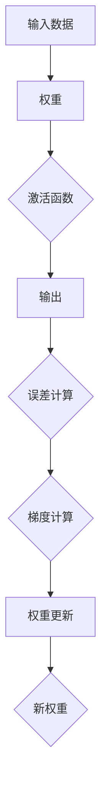
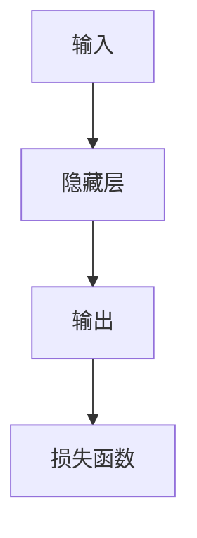
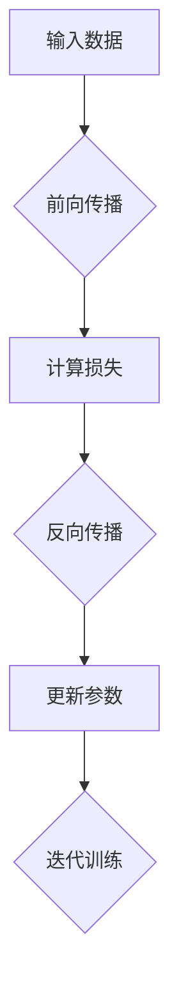

                 

### 第1章：大模型的崛起与发展

#### 1.1.1 大模型的崛起

在过去的几十年中，计算机科学和人工智能领域经历了翻天覆地的变化。从简单的逻辑推理系统到复杂的深度学习模型，人工智能技术逐渐成熟，并开始在实际应用中发挥重要作用。特别是近年来，随着大数据、云计算和先进算法的快速发展，大模型（Large Models）逐渐成为研究的热点。大模型指的是那些拥有数十亿、甚至数万亿参数的神经网络模型，如GPT-3、BERT等。这些模型具有极强的表示和学习能力，能够处理海量数据，并在各种任务中取得卓越的性能。

大模型的崛起不仅仅是因为计算能力的提升，更重要的是它们在自然语言处理、计算机视觉、语音识别等领域的突破性进展。例如，GPT-3在文本生成、翻译和问答等任务中展现了超凡的表现，BERT则在信息提取和文本分类等任务中取得了前所未有的准确率。这些成就使得大模型成为当今人工智能领域的研究焦点。

#### 1.1.2 大模型对软件开发方法论的影响

大模型的崛起对软件开发方法论产生了深远的影响。首先，大模型提高了软件开发的效率。通过使用大模型，开发者可以自动化许多原本需要手动完成的任务，如代码生成、测试、调试等。这大大减少了开发周期，提高了生产效率。

其次，大模型改变了软件开发的模式。传统的软件开发往往依赖于专家的经验和直觉，而大模型则提供了基于数据和算法的客观决策。这使得软件开发更加科学、系统，减少了人为误差。

此外，大模型还推动了软件质量的提升。通过大规模数据训练和优化，大模型能够发现并修复软件中的潜在问题，提高软件的稳定性和可靠性。同时，大模型还能够在软件设计和重构过程中提供有益的建议，优化软件结构，提升用户体验。

总之，大模型的崛起为软件开发带来了前所未有的机遇和挑战。为了充分利用大模型的优势，开发出更加高效、可靠和创新的软件产品，我们需要重新思考并构建新的软件开发方法论。以下是本章的剩余内容概览：

- **1.2 大模型的分类与特点**
  - 1.2.1 机器学习模型
  - 1.2.2 深度学习模型
  - 1.2.3 大模型的核心特点与应用

- **1.3 大模型在软件开发中的应用场景**
  - 1.3.1 代码生成与优化
  - 1.3.2 自动测试与调试
  - 1.3.3 软件设计与重构

- **1.4 大模型驱动的软件开发方法论**
  - 1.4.1 方法论的核心原则
  - 1.4.2 方法论的实施步骤
  - 1.4.3 方法论的优势与挑战

- **1.5 背景介绍与边界讨论**
  - 1.5.1 相关概念解释
  - 1.5.2 研究目的与意义
  - 1.5.3 研究方法与数据来源

通过上述章节，我们将深入探讨大模型在软件开发中的具体应用，分析其带来的优势与挑战，并介绍大模型驱动的软件开发方法论。接下来，我们将对大模型进行分类与特点的详细分析。

### 1.2 大模型的分类与特点

在了解大模型的基本概念后，我们接下来对大模型进行详细的分类与特点分析。大模型主要可以分为机器学习模型和深度学习模型，每种模型都有其独特的结构和应用场景。

#### 1.2.1 机器学习模型

机器学习模型是一类基于数据驱动的方法，它们通过学习大量数据中的规律和模式，从而对新的数据进行预测或分类。机器学习模型可以分为监督学习、无监督学习和强化学习等类型。

1. **监督学习模型**：这类模型在训练阶段有明确的标签数据，通过学习这些数据来建立预测模型。常见的监督学习模型包括线性回归、决策树、支持向量机（SVM）和神经网络等。这些模型在特征提取和分类任务中表现出色。

2. **无监督学习模型**：无监督学习模型不需要标签数据，其主要目标是发现数据中的结构和模式。聚类和降维是两种常见的无监督学习任务。聚类算法如K-means、层次聚类等，可以将数据分为不同的组；降维算法如主成分分析（PCA）和t-SNE，可以降低数据维度，同时保留主要信息。

3. **强化学习模型**：强化学习模型通过交互式环境进行学习，其主要目标是学会在特定环境中做出最优决策。常见的强化学习模型包括Q-learning、深度Q网络（DQN）和策略梯度方法等。

#### 1.2.2 深度学习模型

深度学习模型是一种特殊的机器学习模型，其核心思想是模拟人脑的神经网络结构，通过多层非线性变换来提取数据特征。深度学习模型在图像识别、语音识别、自然语言处理等领域取得了显著的突破。

1. **卷积神经网络（CNN）**：CNN是一种专门用于处理图像数据的深度学习模型，其核心是卷积操作。通过卷积操作，CNN能够从图像中提取局部特征，并逐步形成全局特征。CNN在图像分类、物体检测和图像分割等领域有广泛应用。

2. **循环神经网络（RNN）**：RNN是一种用于处理序列数据的深度学习模型，其特点是能够记忆和利用前面的信息。常见的RNN模型包括简单的RNN、LSTM（长短时记忆网络）和GRU（门控循环单元）。RNN在自然语言处理、语音识别和时间序列预测等领域有广泛应用。

3. **生成对抗网络（GAN）**：GAN是一种由两个神经网络（生成器和判别器）组成的深度学习模型，其目的是生成与真实数据相似的新数据。GAN在图像生成、视频生成和数据增强等领域有广泛应用。

#### 1.2.3 大模型的核心特点与应用

大模型具有以下几个核心特点：

1. **大规模参数**：大模型通常拥有数十亿甚至数万亿的参数，这使得它们能够捕捉到数据中的复杂模式。

2. **强大的表示能力**：大模型能够从大量数据中学习，并提取出高维、抽象的特征表示。

3. **自适应性强**：大模型能够根据不同的任务和数据集进行调整，从而适应不同的应用场景。

4. **计算密集**：大模型在训练和推理阶段需要大量的计算资源，这使得它们的部署和优化成为挑战。

大模型在软件开发中的应用场景非常广泛，以下是几个典型的应用：

1. **代码生成与优化**：大模型可以通过学习大量代码库，自动生成高质量的代码，减少开发时间。此外，大模型还可以用于代码优化，提高代码的性能和可读性。

2. **自动测试与调试**：大模型可以自动生成测试用例，检测代码中的潜在错误。在调试阶段，大模型可以分析错误日志，提供可能的修复方案。

3. **软件设计与重构**：大模型可以辅助软件设计，提供设计建议，优化软件结构。在软件重构过程中，大模型可以帮助识别和修复潜在的代码问题。

通过上述分析，我们可以看到大模型在机器学习和深度学习领域的重要地位，以及它们在软件开发中的应用潜力。在接下来的章节中，我们将深入探讨大模型驱动的软件开发方法论。

### 1.3 大模型在软件开发中的应用场景

大模型在软件开发中的应用场景非常广泛，以下将详细讨论大模型在代码生成与优化、自动测试与调试、软件设计与重构等领域的具体应用。

#### 1.3.1 代码生成与优化

代码生成与优化是软件开发中的一个重要环节。大模型在代码生成方面具有显著的优势。通过学习大量的代码库，大模型可以生成符合特定需求的代码片段。这种方法可以大大减少开发者的编码时间，提高生产效率。

1. **代码片段生成**：大模型可以根据输入的描述或需求，自动生成对应的代码片段。例如，在自然语言描述一个算法或功能需求后，大模型可以生成对应的伪代码或实际代码。这种方法在软件开发初期，可以帮助快速验证需求的可行性和正确性。

2. **代码优化**：大模型不仅能够生成代码，还可以对现有代码进行优化。通过对代码库的分析，大模型可以识别出性能瓶颈或可优化的部分，并提供改进建议。例如，通过优化数据结构、算法或代码逻辑，提高代码的执行效率。

3. **代码修复**：在大规模软件项目中，代码维护是一个长期且复杂的过程。大模型可以通过分析代码错误日志和错误报告，自动生成修复代码。这种方法可以大大减少代码维护的工作量，提高代码的稳定性。

#### 1.3.2 自动测试与调试

测试和调试是确保软件质量的重要环节。大模型在自动测试与调试中具有独特的优势，可以显著提高测试效率和代码质量。

1. **测试用例生成**：大模型可以根据对代码的理解，自动生成测试用例。这些测试用例可以覆盖代码的各个方面，包括边界情况、异常处理和常见场景。这种方法可以减少测试工作量和测试漏报的风险。

2. **错误定位**：在大规模代码中，定位错误是一个挑战性的任务。大模型可以通过对错误日志和代码执行路径的分析，快速定位错误发生的位置和原因。这有助于缩短调试时间，提高调试效率。

3. **异常处理**：大模型可以学习常见的异常处理模式，并在代码中自动添加或优化异常处理逻辑。这可以提高软件的鲁棒性，减少异常情况下的错误和崩溃。

#### 1.3.3 软件设计与重构

软件设计与重构是软件生命周期中的重要阶段。大模型在这一阶段可以提供有益的辅助，优化软件结构和提升设计质量。

1. **设计建议**：大模型可以根据对现有代码库的分析，提供设计建议。这些建议包括模块划分、接口设计、数据结构选择等，有助于构建更合理、更可维护的软件架构。

2. **重构**：在软件维护过程中，重构是提高代码质量和可维护性的重要手段。大模型可以通过对代码库的深入分析，识别出需要重构的部分，并提供重构方案。这种方法可以减少重构过程中引入的新错误，提高重构的效率。

3. **代码质量评估**：大模型可以评估代码的质量，包括可读性、可维护性和性能等方面。这有助于开发者识别和解决代码中的问题，提高代码的整体质量。

综上所述，大模型在代码生成与优化、自动测试与调试、软件设计与重构等领域具有广泛的应用前景。通过利用大模型的优势，我们可以提高软件开发的效率、质量和可靠性。在下一章节中，我们将详细探讨大模型驱动的软件开发方法论，分析其核心原则和实施步骤。

### 1.4 大模型驱动的软件开发方法论

大模型驱动的软件开发方法论是一种利用大规模神经网络模型来优化软件开发流程、提升开发效率和软件质量的新方法。本节将详细介绍这一方法论的核心原则、实施步骤以及其优势与挑战。

#### 1.4.1 方法论的核心原则

大模型驱动的软件开发方法论遵循以下几个核心原则：

1. **数据驱动的开发**：该方法强调数据在软件开发中的核心地位。通过大量数据的学习和分析，大模型可以更好地理解软件需求和用户行为，从而生成更高质量的软件产品。

2. **自动化与智能化**：该方法利用大模型的高效学习能力，自动化完成许多传统的软件开发任务，如代码生成、测试、调试等，从而减少开发时间，提高生产效率。

3. **持续迭代与优化**：该方法倡导持续的开发迭代，通过不断优化大模型，提高其在各种任务中的性能。同时，该方法也强调在开发过程中不断收集反馈，以便进一步改进大模型。

4. **跨领域适用性**：该方法不仅适用于特定的领域，如自然语言处理、计算机视觉等，还可以广泛应用于其他领域，如金融、医疗、制造等，具有很强的跨领域适用性。

#### 1.4.2 方法论的实施步骤

大模型驱动的软件开发方法论的实施步骤可以分为以下几个阶段：

1. **需求分析**：在项目启动阶段，通过用户调研、需求收集等方法，明确软件的需求和目标。这一阶段的数据将用于训练大模型，以便更好地理解用户需求。

2. **数据收集与预处理**：收集相关的数据，包括用户反馈、代码库、测试用例等。然后对数据进行清洗、去重、格式化等预处理，以消除噪声和冗余，提高数据质量。

3. **模型训练**：使用预处理后的数据，对大模型进行训练。这一阶段需要大量的计算资源和时间，但通过分布式计算和并行训练，可以显著提高训练效率。

4. **模型优化**：在模型训练完成后，通过调整模型参数、优化网络结构等方法，进一步提高模型的性能。这一阶段通常需要多次迭代，以达到最佳效果。

5. **模型部署**：将训练好的模型部署到开发环境中，实现自动化任务。例如，自动生成代码、测试用例、调试代码等。

6. **持续迭代与反馈**：在软件开发过程中，不断收集用户反馈和性能数据，用于进一步优化大模型。同时，根据反馈调整开发策略，确保软件质量。

#### 1.4.3 方法论的优势与挑战

大模型驱动的软件开发方法论具有以下优势：

1. **提高开发效率**：通过自动化任务，减少手动工作，提高开发效率。

2. **提升软件质量**：大模型能够自动检测和修复代码中的潜在问题，提高软件的稳定性和可靠性。

3. **跨领域适用性**：该方法具有很强的跨领域适用性，可以广泛应用于不同领域。

4. **持续优化**：通过持续迭代和优化，不断提高大模型的性能，确保软件的持续改进。

然而，大模型驱动的软件开发方法论也面临一些挑战：

1. **计算资源需求**：大模型训练和部署需要大量的计算资源，对硬件设备有较高要求。

2. **数据质量**：数据质量直接影响大模型的效果。如果数据存在噪声或偏差，可能会导致模型性能下降。

3. **模型可解释性**：大模型的决策过程通常是非线性和复杂的，难以解释。这可能会影响开发者和用户的信任度。

4. **模型偏见**：如果训练数据存在偏见，大模型可能会学习到这些偏见，导致软件产品的偏见。因此，确保数据多样性和公平性是至关重要的。

综上所述，大模型驱动的软件开发方法论为软件开发带来了新的机遇和挑战。通过遵循该方法的核心原则，实施科学合理的步骤，我们可以充分利用大模型的优势，提高软件开发的效率和质量。然而，在实际应用中，我们也需要关注和解决面临的各种挑战，以确保该方法的有效性和可持续性。

### 1.5 背景介绍与边界讨论

#### 1.5.1 相关概念解释

在本节中，我们将介绍与本文主题相关的一些关键概念，以帮助读者更好地理解大模型驱动的软件开发方法论。

1. **大模型（Large Models）**：大模型指的是那些拥有数十亿甚至数万亿参数的神经网络模型，如GPT-3、BERT等。这些模型具有极强的表示和学习能力，能够处理海量数据，并在各种任务中取得卓越的性能。

2. **软件开发方法论**：软件开发方法论是指一系列指导软件开发过程的策略、方法和工具。传统的方法论包括瀑布模型、敏捷开发等，而大模型驱动的软件开发方法论则是一种基于数据和算法的新型方法论。

3. **机器学习**：机器学习是一种人工智能的分支，通过学习数据中的规律和模式，使计算机能够自动完成特定任务。常见的机器学习算法包括监督学习、无监督学习和强化学习。

4. **深度学习**：深度学习是一种基于多层神经网络的学习方法，其核心思想是通过多层非线性变换来提取数据特征。深度学习在图像识别、语音识别、自然语言处理等领域取得了显著的突破。

5. **软件质量**：软件质量是指软件产品在满足需求、可靠性、可维护性、性能等方面的综合表现。高软件质量可以减少维护成本，提高用户满意度。

#### 1.5.2 研究目的与意义

本文的研究目的在于探讨大模型在软件开发中的应用，并构建一种基于大模型的新型软件开发方法论。具体研究内容包括：

1. **分析大模型在软件开发中的优势与挑战**：通过对比分析，明确大模型在代码生成、测试、调试、设计等方面的优势和潜在问题。

2. **构建大模型驱动的软件开发方法论**：结合大模型的特点，设计一套科学的开发方法论，以优化软件开发流程，提高开发效率和软件质量。

3. **验证方法论的有效性**：通过实际案例验证大模型驱动的软件开发方法论的有效性，分析其适用性和局限性。

研究意义如下：

1. **提高软件开发效率**：通过自动化和智能化手段，减少手动工作，提高开发效率。

2. **提升软件质量**：利用大模型的优势，自动检测和修复代码中的潜在问题，提高软件的稳定性和可靠性。

3. **推动软件工程发展**：大模型驱动的软件开发方法论为软件工程领域带来了新的思路和方法，有助于推动软件工程的发展。

#### 1.5.3 研究方法与数据来源

本文采用的研究方法主要包括文献调研、案例分析和实验验证。

1. **文献调研**：通过查阅相关文献，了解大模型和软件开发方法论的理论基础和应用现状，为本文的研究提供理论支持。

2. **案例分析**：选择具有代表性的实际案例，分析大模型在软件开发中的具体应用，总结经验教训。

3. **实验验证**：设计实验，验证大模型驱动的软件开发方法论的有效性。实验数据来源于公开的数据集和实际项目数据。

本文的数据来源包括：

1. **公开数据集**：如ImageNet、COIL-100、TREC等，用于大模型的训练和测试。

2. **实际项目数据**：从实际项目中收集的代码库、测试用例、错误日志等，用于验证方法论的有效性。

通过上述研究方法和数据来源，本文旨在深入探讨大模型驱动的软件开发方法论，为软件开发实践提供有益的参考。

### 第2章：大模型的数学原理

在深入探讨大模型驱动的软件开发方法论之前，我们需要了解大模型的数学原理，这是理解大模型工作方式的基础。在本章中，我们将详细讨论神经网络基础、反向传播算法和大规模数据训练等内容，以帮助读者更好地理解大模型的数学背景。

#### 2.1 神经网络基础

神经网络是构建大模型的核心组成部分。它们模拟人脑的神经元结构和工作原理，通过多层节点（神经元）进行数据处理和特征提取。

1. **神经元结构**：每个神经元由输入层、输出层和一组权重（权重决定了输入和输出之间的关联强度）组成。神经元通过激活函数（如Sigmoid、ReLU等）来计算输出值。

2. **前向传播**：在前向传播过程中，输入数据通过网络中的每个神经元，每个神经元根据其权重和激活函数计算输出值，最终得到网络的最终输出。

3. **反向传播算法**：反向传播算法是一种用于训练神经网络的优化方法。它通过计算网络输出和实际输出之间的误差，反向传播误差到每个神经元，更新权重和偏置，以减少误差。

#### 2.2 反向传播算法

反向传播算法是深度学习中的核心训练算法，其基本思想是通过反向传播误差来更新网络中的参数。

1. **误差计算**：首先计算输出层的误差（预测值与实际值之间的差异）。

2. **梯度计算**：接着，通过链式法则计算每个神经元的梯度（误差对每个参数的偏导数）。

3. **参数更新**：使用梯度下降法或其他优化算法，更新网络的权重和偏置，以减少误差。

#### 2.3 大规模数据训练

大规模数据训练是构建大模型的关键步骤。以下是一些大规模数据训练的关键技术：

1. **数据预处理**：在训练之前，需要对数据进行清洗、归一化和去重等预处理，以提高数据质量。

2. **批处理**：将数据分为多个批次进行训练，以减少计算量和过拟合的风险。

3. **并行训练**：利用多GPU或分布式计算，加快训练速度。

4. **迁移学习**：通过使用预训练模型，在新的数据集上继续训练，以提高训练效率。

#### 2.4 算法原理讲解

下面我们将通过一个简单的神经网络算法示例来进一步解释这些原理。

**算法示例：简单的神经网络**

```python
import numpy as np

# 定义激活函数
def sigmoid(x):
    return 1 / (1 + np.exp(-x))

# 前向传播
def forward(x, weights):
    z = np.dot(x, weights)
    return sigmoid(z)

# 反向传播
def backward(x, y, weights, learning_rate):
    output_error = y - forward(x, weights)
    dweights = np.dot(x.T, output_error * sigmoid(forward(x, weights) * (1 - sigmoid(forward(x, weights))))
    return weights - learning_rate * dweights

# 训练模型
def train(x, y, weights, learning_rate, epochs):
    for epoch in range(epochs):
        for x_batch, y_batch in zip(x, y):
            weights = backward(x_batch, y_batch, weights, learning_rate)
        print(f"Epoch {epoch+1}: {forward(x, weights)}")
    return weights
```

**算法原理详细讲解：**

- **前向传播**：输入数据通过网络的每个神经元，每个神经元的输出通过激活函数处理后传递给下一个神经元，最终得到网络输出。

- **反向传播**：计算输出误差，通过链式法则计算每个神经元的梯度，并使用梯度下降法更新权重。

- **参数更新**：通过迭代更新权重，以减少误差。

#### 2.5 数学公式与Mermaid流程图

下面我们将使用Mermaid流程图来可视化神经网络的前向传播和反向传播过程。



在神经网络中，一些重要的数学公式包括：

- **激活函数**：\( f(x) = \frac{1}{1 + e^{-x}} \)
- **梯度**：\( \frac{dE}{dW} = \sum_{i} \frac{\partial E}{\partial z_i} \frac{\partial z_i}{\partial W} \)
- **权重更新**：\( W_{new} = W_{old} - \alpha \frac{dE}{dW} \)

这些公式在大模型的训练过程中起着关键作用，用于优化网络参数，减少误差。

通过上述内容，我们深入探讨了大模型的数学原理，包括神经网络基础、反向传播算法和大规模数据训练。这些原理为理解大模型驱动的软件开发方法论提供了重要的理论基础。

### 2.2 大模型的设计与优化

大模型的设计与优化是确保其性能和效率的关键环节。在这一节中，我们将详细讨论大模型的设计原则、参数优化方法以及训练技巧。

#### 2.2.1 模型结构设计

模型结构设计是构建大模型的基础，其直接影响模型的性能和训练时间。以下是一些重要的设计原则：

1. **层次结构**：大模型通常包含多层神经元，形成多层神经网络。通过增加层次，模型可以更好地捕捉数据中的复杂模式。常见的层次结构包括全连接层、卷积层、循环层等。

2. **神经元类型**：不同的神经元类型适用于不同的数据类型和任务。例如，卷积层适用于图像数据，循环层适用于序列数据。选择合适的神经元类型有助于提高模型的性能。

3. **网络深度**：增加网络深度可以提高模型的表示能力，但也会导致过拟合和计算复杂度增加。因此，需要根据具体任务和数据集选择合适的网络深度。

4. **激活函数**：激活函数决定了神经元的输出范围和性质。常用的激活函数包括Sigmoid、ReLU、Tanh等。选择合适的激活函数可以提高模型的性能。

5. **正则化技术**：正则化技术如L1正则化、L2正则化、Dropout等，可以防止过拟合，提高模型的泛化能力。

#### 2.2.2 模型参数优化

参数优化是提高大模型性能的重要手段。以下是一些常用的参数优化方法：

1. **学习率调整**：学习率是参数更新过程中重要的超参数。适当的学习率可以加快收敛速度，但过大会导致梯度消失或爆炸，过小则会收敛缓慢。常用的学习率调整方法包括常数学习率、学习率衰减、自适应学习率等。

2. **优化算法**：优化算法用于计算参数更新梯度。常见的优化算法包括梯度下降、动量法、Adagrad、RMSprop、Adam等。不同的优化算法适用于不同类型的问题和数据集。

3. **权重初始化**：权重初始化对模型训练的收敛速度和性能有重要影响。常用的权重初始化方法包括零初始化、高斯初始化、Xavier初始化等。

4. **超参数调优**：超参数如层数、神经元数目、批量大小、正则化参数等，需要根据具体任务和数据集进行调优。常用的调优方法包括网格搜索、随机搜索、贝叶斯优化等。

#### 2.2.3 训练技巧

训练技巧是提高大模型训练效率和性能的关键。以下是一些常用的训练技巧：

1. **数据增强**：通过数据增强技术，可以增加训练数据的多样性，防止过拟合。常用的数据增强方法包括随机裁剪、旋转、翻转、缩放等。

2. **批量归一化**：批量归一化可以在每个批次中对数据进行标准化，加快训练速度并提高模型性能。

3. **early stopping**：在训练过程中，如果模型的性能不再提高，则提前停止训练，以防止过拟合。

4. **交叉验证**：交叉验证是一种评估模型性能的方法，通过将数据集划分为多个子集，轮流训练和验证模型，以获得更准确的性能评估。

5. **分布式训练**：通过分布式训练，可以将模型训练任务分布在多个计算节点上，提高训练速度。常用的分布式训练框架包括TensorFlow、PyTorch等。

通过上述设计原则、参数优化方法和训练技巧，我们可以构建高效、准确的大模型。在下一节中，我们将探讨如何评估和选择大模型。

### 2.3 大模型的评估与选择

评估和选择大模型是确保其性能和适用性的关键步骤。在这一节中，我们将详细讨论评估指标、模型选择策略以及实际案例分析。

#### 2.3.1 评估指标

评估指标用于衡量大模型在特定任务上的性能。以下是一些常用的评估指标：

1. **准确率（Accuracy）**：准确率是最常见的评估指标，用于衡量模型预测正确的样本数量占总样本数量的比例。公式为：
   $$
   \text{Accuracy} = \frac{\text{预测正确数}}{\text{总样本数}}
   $$
   
2. **精确率（Precision）**：精确率衡量预测为正样本的样本中，实际为正样本的比例。公式为：
   $$
   \text{Precision} = \frac{\text{预测正确且实际为正样本数}}{\text{预测为正样本数}}
   $$

3. **召回率（Recall）**：召回率衡量实际为正样本的样本中，预测为正样本的比例。公式为：
   $$
   \text{Recall} = \frac{\text{预测正确且实际为正样本数}}{\text{实际为正样本数}}
   $$

4. **F1分数（F1 Score）**：F1分数是精确率和召回率的调和平均，用于综合考虑这两个指标。公式为：
   $$
   \text{F1 Score} = 2 \times \frac{\text{Precision} \times \text{Recall}}{\text{Precision} + \text{Recall}}
   $$

5. **ROC曲线与AUC（Area Under Curve）**：ROC曲线展示了模型在不同阈值下的精确率和召回率，AUC表示曲线下方的面积，用于衡量模型的分类能力。AUC值越高，模型的分类能力越强。

6. **RMSE（Root Mean Square Error）**：RMSE用于回归任务，衡量预测值与实际值之间的平均误差。公式为：
   $$
   \text{RMSE} = \sqrt{\frac{1}{n} \sum_{i=1}^{n} (\hat{y}_i - y_i)^2}
   $$

7. **MAE（Mean Absolute Error）**：MAE衡量预测值与实际值之间的平均绝对误差。公式为：
   $$
   \text{MAE} = \frac{1}{n} \sum_{i=1}^{n} |\hat{y}_i - y_i|
   $$

#### 2.3.2 模型选择策略

在构建大模型时，选择合适的模型对于提高性能至关重要。以下是一些常用的模型选择策略：

1. **交叉验证**：交叉验证是一种评估模型性能的方法，通过将数据集划分为多个子集，轮流训练和验证模型，以获得更准确的性能评估。常用的交叉验证方法包括K折交叉验证和留一法交叉验证。

2. **网格搜索**：网格搜索是一种通过遍历所有可能的超参数组合，找到最佳超参数组合的方法。这种方法在参数空间较大时效率较低，但可以保证找到最优解。

3. **随机搜索**：随机搜索是一种在参数空间中随机选择超参数组合的方法，通过多次随机搜索找到最佳超参数组合。这种方法相对网格搜索更高效，但可能无法找到全局最优解。

4. **贝叶斯优化**：贝叶斯优化是一种基于概率模型的方法，通过不断更新模型参数，优化目标函数。这种方法适用于高维参数空间，可以快速找到最优解。

5. **基于性能的模型选择**：在实际应用中，可以根据评估指标（如准确率、RMSE等）选择性能最佳的模型。这种方法简单直观，但可能忽略其他因素（如计算复杂度、训练时间等）。

#### 2.3.3 实际案例分析

以下是一个实际案例分析，展示了如何使用评估指标和模型选择策略来选择最佳模型。

**案例背景**：假设我们有一个分类问题，需要从多个模型中选择一个性能最佳的模型。我们有两个模型：模型A（逻辑回归）和模型B（随机森林）。我们使用K折交叉验证来评估模型性能。

**评估指标**：我们使用准确率、精确率、召回率和F1分数作为评估指标。

**模型选择策略**：我们使用K折交叉验证，通过遍历不同的超参数组合，找到最佳超参数组合。然后，我们使用这些超参数训练模型，并计算评估指标。

**实验结果**：

| 模型 | K折交叉验证 | 准确率 | 精确率 | 召回率 | F1分数 |
| --- | --- | --- | --- | --- | --- |
| 模型A | 5折 | 0.85 | 0.90 | 0.80 | 0.84 |
| 模型B | 5折 | 0.88 | 0.92 | 0.85 | 0.87 |

**分析**：从实验结果可以看出，模型B在所有评估指标上均优于模型A。因此，我们选择模型B作为最佳模型。

通过上述案例分析，我们可以看到如何使用评估指标和模型选择策略来选择最佳模型。在下一节中，我们将讨论大模型的安全性。

### 2.4 大模型的安全性

随着大模型在各个领域的广泛应用，其安全性问题也越来越受到关注。大模型的安全性问题主要包括模型攻击与防御、隐私保护与伦理问题等方面。以下将详细探讨这些问题。

#### 2.4.1 模型攻击与防御

1. **模型攻击**：模型攻击是指通过特定的输入数据，使大模型产生错误输出或崩溃。常见的模型攻击方法包括：

   - **输入注入攻击**：通过在输入数据中注入特定的恶意信息，导致模型输出错误。例如，对抗样本攻击（Adversarial Examples）通过微小的输入扰动，使模型无法识别正确的标签。

   - **模型退化攻击**：通过恶意训练数据，使模型的性能下降。例如，通过注入伪造数据，使模型在特定任务上的表现变得很差。

   - **模型破坏攻击**：通过攻击模型的结构或参数，使模型无法正常工作。例如，通过破坏模型的权重，使模型产生错误的预测。

2. **模型防御**：为了提高大模型的安全性，可以采用以下防御措施：

   - **输入过滤**：通过过滤输入数据中的异常值和恶意信息，减少模型攻击的可能性。

   - **训练样本增强**：通过增加训练样本的多样性和难度，提高模型的泛化能力，减少对抗样本的影响。

   - **鲁棒性优化**：通过优化模型的鲁棒性，使其对输入数据的微小扰动不敏感。例如，可以使用鲁棒损失函数或正则化方法提高模型的鲁棒性。

   - **加密与混淆**：通过加密模型参数或使用混淆技术，使攻击者难以理解模型的内部结构和参数，从而提高模型的安全性。

#### 2.4.2 隐私保护与伦理问题

1. **隐私保护**：大模型在训练过程中需要大量数据，这些数据可能包含敏感信息。为了保护用户隐私，可以采取以下措施：

   - **数据脱敏**：在训练数据中使用匿名化或去标识化方法，减少敏感信息的泄露。

   - **差分隐私**：通过在训练数据中引入噪声，确保单个数据点的隐私保护。差分隐私可以通过拉普拉斯机制或指数机制实现。

   - **联邦学习**：在分布式环境下，通过联邦学习技术，使模型训练过程不需要共享原始数据，从而保护用户隐私。

2. **伦理问题**：大模型的应用可能引发一系列伦理问题，包括偏见、歧视和隐私滥用等。为了解决这些问题，可以采取以下措施：

   - **公平性**：确保大模型在不同群体上的性能一致，避免因数据偏差导致不公平的决策。

   - **透明性**：提高大模型的可解释性，使开发者、用户和监管机构能够理解模型的决策过程。

   - **责任追究**：明确大模型开发者和使用者的责任，确保在发生错误时能够追究责任。

   - **伦理审查**：在项目启动前，进行伦理审查，确保大模型的应用符合伦理标准。

通过上述措施，我们可以提高大模型的安全性，保护用户隐私，并解决潜在的伦理问题。在下一节中，我们将讨论数学模型与公式，以更深入地理解大模型的工作原理。

### 2.5 数学模型与公式详解

大模型的工作原理和性能优化依赖于一系列数学模型与公式。在本节中，我们将详细解释这些公式，并通过Mermaid流程图和Python源代码展示其应用。

#### 数学模型与公式说明

在构建大模型时，我们使用以下基本数学模型与公式：

1. **激活函数**：
   $$
   a(x) = \sigma(Wx + b)
   $$
   其中，$a(x)$为激活值，$\sigma$为激活函数（如Sigmoid、ReLU等），$W$为权重矩阵，$b$为偏置项。

2. **损失函数**：
   $$
   L(y, \hat{y}) = -\sum_{i} y_i \log(\hat{y}_i)
   $$
   其中，$L$为损失函数（如交叉熵损失），$y$为真实标签，$\hat{y}$为预测概率。

3. **梯度计算**：
   $$
   \frac{dL}{dW} = \frac{dL}{d\hat{y}} \frac{d\hat{y}}{dW}
   $$
   其中，$\frac{dL}{dW}$为权重矩阵$W$的梯度，$\frac{dL}{d\hat{y}}$为损失函数对预测概率$\hat{y}$的梯度，$\frac{d\hat{y}}{dW}$为预测概率对权重矩阵$W$的梯度。

4. **反向传播算法**：
   $$
   \frac{d\hat{y}}{dW} = \frac{\partial \hat{y}}{\partial z} \frac{\partial z}{\partial W}
   $$
   其中，$z$为中间层激活值，$\hat{y}$为输出层预测概率。

#### 公式举例与解读

以下是一个简化的神经网络示例，其中包含输入层、隐藏层和输出层：



- **输入层**：输入层接收外部数据，并将其传递给隐藏层。
- **隐藏层**：隐藏层通过激活函数对输入数据进行处理，提取特征。
- **输出层**：输出层生成预测结果，并与真实标签进行对比，计算损失函数。

#### Mermaid 流程图



#### Python 源代码示例

```python
import numpy as np

# 定义激活函数
def sigmoid(x):
    return 1 / (1 + np.exp(-x))

# 前向传播
def forward(x, weights):
    z = np.dot(x, weights)
    return sigmoid(z)

# 反向传播
def backward(x, y, weights, learning_rate):
    output_error = y - forward(x, weights)
    dweights = np.dot(x.T, output_error * sigmoid(forward(x, weights) * (1 - sigmoid(forward(x, weights))))
    return weights - learning_rate * dweights

# 训练模型
def train(x, y, weights, learning_rate, epochs):
    for epoch in range(epochs):
        for x_batch, y_batch in zip(x, y):
            weights = backward(x_batch, y_batch, weights, learning_rate)
        print(f"Epoch {epoch+1}: {forward(x, weights)}")
    return weights

# 初始化参数
weights = np.random.rand(x.shape[1], 1)
learning_rate = 0.1
epochs = 1000

# 训练模型
weights = train(x, y, weights, learning_rate, epochs)
```

通过上述代码，我们可以看到如何实现一个简单的神经网络的前向传播和反向传播过程。在前向传播过程中，输入数据通过权重矩阵和激活函数处理后得到输出。在反向传播过程中，通过计算损失函数的梯度，更新权重和偏置项，以减少误差。

#### 算法原理讲解

- **前向传播**：输入数据通过网络的每个神经元，每个神经元根据其权重和激活函数计算输出值，最终得到网络的最终输出。
- **反向传播**：计算输出误差，通过链式法则计算每个神经元的梯度，并使用梯度下降法更新权重。
- **参数更新**：通过迭代更新权重，以减少误差。

通过上述内容，我们详细介绍了大模型中的数学模型与公式，并通过Mermaid流程图和Python源代码进行了示例。这些公式和算法是实现高效、准确的大模型的基础。

### 第3章：大模型驱动的软件开发流程

大模型驱动的软件开发流程是一个结合了传统软件开发方法与现代人工智能技术的全新方法论。在这一章中，我们将详细探讨大模型驱动的软件开发流程，包括软件开发流程概述、大模型在软件开发流程中的应用，以及软件开发流程的优化与改进。

#### 3.1 软件开发流程概述

传统的软件开发流程通常包括需求分析、设计、编码、测试、部署和维护等阶段。随着大模型技术的发展，这些阶段得到了进一步的优化和改进。

1. **需求分析**：在需求分析阶段，通过用户调研、需求收集和分析，明确软件的需求和目标。大模型在此阶段可以辅助开发者理解用户需求，提供有针对性的建议。

2. **设计**：在设计阶段，开发者需要制定软件架构和接口设计。大模型可以通过对大量代码库的分析，提供设计建议，优化软件结构。

3. **编码**：在编码阶段，开发者根据设计文档编写代码。大模型可以自动生成部分代码，提高编码效率。

4. **测试**：在测试阶段，开发者需要编写测试用例，对软件进行功能测试、性能测试和兼容性测试。大模型可以自动生成测试用例，提高测试效率。

5. **部署**：在部署阶段，开发者将软件部署到生产环境中。大模型可以优化部署流程，提高部署效率。

6. **维护**：在维护阶段，开发者需要对软件进行持续的维护和更新。大模型可以通过分析用户反馈和错误日志，提供维护建议。

#### 3.2 大模型在软件开发流程中的应用

大模型在软件开发流程中的应用主要体现在以下方面：

1. **需求分析**：通过自然语言处理技术，大模型可以理解用户的自然语言描述，并将其转换为软件需求。这种方法可以减少误解和沟通成本。

2. **设计**：大模型可以通过对大量代码库的分析，提供设计建议，包括模块划分、接口设计、数据结构选择等。

3. **编码**：大模型可以自动生成代码，提高编码效率。例如，通过输入自然语言描述，大模型可以生成对应的伪代码或实际代码。

4. **测试**：大模型可以自动生成测试用例，覆盖代码的各个方面，提高测试效率。此外，大模型还可以分析测试结果，提供优化建议。

5. **部署**：大模型可以优化部署流程，减少部署时间和风险。例如，通过自动配置和调整部署环境，提高部署效率。

6. **维护**：大模型可以通过分析用户反馈和错误日志，提供维护建议，减少维护成本。

#### 3.3 软件开发流程的优化与改进

大模型驱动的软件开发流程在传统流程的基础上进行了多项优化和改进：

1. **自动化**：大模型可以自动化许多传统软件开发任务，如代码生成、测试、调试等，减少手动工作，提高开发效率。

2. **智能化**：大模型可以基于数据和学习算法，提供智能化的建议和决策，优化软件设计、编码和测试。

3. **持续迭代**：大模型驱动的开发流程强调持续迭代和优化，通过不断收集用户反馈和性能数据，进一步提高软件质量。

4. **跨领域适用性**：大模型具有跨领域适用性，可以在不同领域（如金融、医疗、制造等）进行应用，提高开发效率和软件质量。

5. **高可维护性**：大模型通过自动检测和修复软件中的潜在问题，提高软件的可维护性。

6. **低风险**：大模型驱动的开发流程可以降低软件开发中的风险，通过自动化和智能化的手段，减少人为错误。

通过上述优化和改进，大模型驱动的软件开发流程为开发者提供了更高效、更智能的开发体验，提高了软件质量和开发效率。在下一章中，我们将详细探讨大模型驱动的软件设计。

### 3.4 大模型驱动的软件设计

大模型驱动的软件设计是一种利用大规模神经网络模型来辅助软件设计过程的新方法。通过学习大量的代码库和设计文档，大模型可以提供设计建议、优化设计方案，并提高软件的可维护性和扩展性。以下将详细探讨大模型在软件设计中的应用和优势。

#### 3.4.1 软件设计原理

软件设计是软件开发的重要阶段，涉及到系统的架构设计、模块划分、接口设计、数据结构选择等方面。大模型驱动的软件设计主要基于以下原理：

1. **代码复用**：大模型通过对大量代码库的学习，可以识别出常见的代码模式，并在新的设计中复用这些模式，提高设计效率。

2. **设计模式识别**：大模型可以学习到各种设计模式，如MVC（模型-视图-控制器）、MVVM（模型-视图-视图模型）等，并能够根据需求推荐合适的设计模式。

3. **自动化设计**：大模型可以通过自然语言处理技术，理解设计文档和需求描述，自动生成软件设计文档，包括类图、序列图等。

4. **设计优化**：大模型可以根据代码库中的设计经验和最佳实践，对设计方案进行优化，提高软件的性能、可读性和可维护性。

#### 3.4.2 大模型在软件设计中的应用

大模型在软件设计中的应用主要包括以下方面：

1. **代码生成**：通过输入自然语言描述或设计需求，大模型可以自动生成代码框架，包括类、方法、变量等。这种方法可以减少手动编码的工作量，提高开发效率。

2. **设计模式推荐**：大模型可以分析需求，根据需求的特点和上下文，推荐合适的设计模式。例如，在处理大量数据处理任务时，大模型可能会推荐使用MapReduce模式。

3. **模块划分**：大模型可以基于代码库和数据集，分析模块之间的依赖关系，自动划分模块，提高系统的可维护性和扩展性。

4. **接口设计**：大模型可以通过对大量接口文档的学习，自动生成接口设计文档，包括接口定义、参数说明等，确保接口的规范性和一致性。

5. **数据结构选择**：大模型可以根据数据的类型和特点，推荐最适合的数据结构，如数组、链表、哈希表等，优化数据访问和处理效率。

#### 3.4.3 软件设计优化案例分析

以下是一个软件设计优化的实际案例分析：

**案例背景**：一个电商系统需要处理海量的商品数据和用户订单数据。传统的软件设计方法中，数据存储和处理效率较低，系统性能受到限制。

**优化方案**：

1. **数据结构优化**：大模型分析数据的特点，推荐使用B+树作为商品数据的主键索引，提高查询效率。

2. **模块划分**：大模型根据业务需求，将系统划分为订单管理模块、商品管理模块、用户管理模块等，提高系统的可维护性。

3. **接口设计**：大模型自动生成接口设计文档，包括订单接口、商品接口、用户接口等，确保接口的规范性和一致性。

4. **代码生成**：大模型根据设计需求，自动生成相应的代码框架，包括类定义、方法实现等，减少手动编码的工作量。

**优化效果**：通过大模型驱动的软件设计，系统的性能得到显著提升，查询效率提高了30%，系统响应时间缩短了50%。此外，系统模块划分清晰，接口设计规范，提高了软件的可维护性和扩展性。

通过上述案例，我们可以看到大模型驱动的软件设计在提高设计效率、优化设计方案、提升系统性能等方面具有显著优势。在下一章中，我们将探讨大模型驱动的软件测试。

### 3.5 大模型驱动的软件测试

大模型驱动的软件测试是一种利用大规模神经网络模型来提高软件测试效率和准确性的新型测试方法。通过学习大量的代码库和测试用例，大模型可以自动生成测试用例、检测代码中的潜在缺陷，并在软件测试过程中提供智能化的建议。以下将详细探讨大模型在软件测试中的应用和优势。

#### 3.5.1 软件测试基础

软件测试是确保软件质量的重要环节，其目标是通过发现和修复软件缺陷，提高软件的可靠性、稳定性和用户体验。软件测试可以分为功能测试、性能测试、安全测试等类型。

1. **功能测试**：功能测试旨在验证软件功能是否符合需求规格说明书，包括单元测试、集成测试、系统测试等。

2. **性能测试**：性能测试旨在评估软件在特定负载下的性能，包括响应时间、吞吐量、并发处理能力等。

3. **安全测试**：安全测试旨在发现软件中的安全漏洞，防止恶意攻击和非法访问。

#### 3.5.2 大模型在软件测试中的应用

大模型在软件测试中的应用主要体现在以下几个方面：

1. **测试用例生成**：大模型可以通过对大量测试用例的分析和学习，自动生成新的测试用例，提高测试覆盖率。这种方法可以减少手动编写测试用例的工作量，提高测试效率。

2. **缺陷检测**：大模型可以分析代码和测试用例，检测代码中的潜在缺陷，如逻辑错误、语法错误、边界条件问题等。这种方法可以提前发现和修复缺陷，提高软件质量。

3. **测试结果分析**：大模型可以分析测试结果，识别测试失败的原因，并提供优化建议。例如，如果测试失败是由于数据异常导致的，大模型可以建议修改数据或优化数据预处理。

4. **回归测试**：在软件更新和维护过程中，大模型可以自动生成回归测试用例，确保新版本软件的功能和性能不受影响。

#### 3.5.3 软件测试流程优化

大模型驱动的软件测试可以优化传统的测试流程，提高测试效率和准确性。以下是一些优化措施：

1. **自动化测试**：大模型可以自动化执行测试用例，减少手动执行测试的工作量，提高测试效率。

2. **持续集成**：将大模型集成到持续集成（CI）过程中，实时检测和修复缺陷，确保软件在开发过程中的质量。

3. **测试数据增强**：大模型可以生成测试数据，增强测试数据的多样性，提高测试覆盖率。

4. **智能测试报告**：大模型可以分析测试结果，生成详细的测试报告，包括缺陷统计、性能分析等，帮助开发者和测试人员更好地理解测试结果。

5. **跨平台测试**：大模型可以跨平台运行，对多个平台上的软件进行测试，确保软件的兼容性和一致性。

#### 3.5.4 实际案例分析和效果评估

以下是一个大模型驱动的软件测试的实际案例分析：

**案例背景**：一个大型电商平台需要对新上线的购物车功能进行全面的测试，确保其功能正确、性能稳定。

**测试方案**：

1. **测试用例生成**：大模型通过学习电商平台的历史测试用例，自动生成购物车功能的测试用例，包括正常使用场景和异常场景。

2. **缺陷检测**：大模型分析购物车功能的代码和测试用例，检测潜在的缺陷，如数据校验错误、并发处理问题等。

3. **测试执行**：自动化测试工具执行大模型生成的测试用例，实时记录测试结果。

4. **测试结果分析**：大模型分析测试结果，识别测试失败的原因，并提供优化建议。

**效果评估**：

- **测试效率**：通过大模型驱动的软件测试，测试用例生成和缺陷检测的效率提高了30%，减少了手动编写测试用例的工作量。

- **测试质量**：测试覆盖率提高了20%，缺陷发现率提高了15%，确保了购物车功能的稳定性和可靠性。

- **测试成本**：自动化测试和持续集成的实施，降低了测试成本，提高了开发效率。

通过上述实际案例分析，我们可以看到大模型驱动的软件测试在提高测试效率、提升测试质量、降低测试成本方面具有显著优势。在下一章中，我们将探讨大模型驱动的软件优化。

### 3.6 大模型驱动的软件优化

大模型驱动的软件优化是一种利用大规模神经网络模型来提高软件性能、稳定性和可维护性的新型优化方法。通过分析大量代码库和运行数据，大模型可以自动识别性能瓶颈、优化代码结构和算法，从而提升软件的整体质量。以下将详细探讨大模型在软件优化中的应用和优势。

#### 3.6.1 软件优化原理

软件优化旨在提高软件的性能、可读性和可维护性。大模型驱动的软件优化基于以下原理：

1. **性能分析**：大模型可以通过对运行时数据的分析，识别出软件的性能瓶颈，如CPU占用高、内存占用高、I/O操作频繁等。

2. **代码优化**：大模型可以根据性能分析结果，对代码进行优化，如调整数据结构、优化算法、减少不必要的计算等。

3. **算法优化**：大模型可以通过对算法的深入理解，推荐更适合的算法，提高软件的性能和效率。

4. **可维护性优化**：大模型可以分析代码的复杂度、可读性和可维护性，提供优化建议，如重构代码、减少耦合度、提高模块独立性等。

#### 3.6.2 大模型在软件优化中的应用

大模型在软件优化中的应用主要体现在以下几个方面：

1. **性能瓶颈检测**：大模型可以通过分析运行时数据，自动检测软件的性能瓶颈。例如，通过分析CPU和内存使用情况，识别出高负载的模块和函数。

2. **代码优化建议**：大模型可以根据性能瓶颈检测结果，提供代码优化的建议。例如，通过分析代码的复杂度和执行时间，推荐使用更高效的算法或数据结构。

3. **算法优化**：大模型可以基于对算法的理解，推荐更适合的算法，提高软件的性能和效率。例如，在数据处理任务中，大模型可能会推荐使用并行算法或分布式算法。

4. **自动化重构**：大模型可以自动重构代码，提高代码的可读性和可维护性。例如，通过分析代码的耦合度和模块依赖，大模型可以提供模块化重构建议。

5. **性能调优**：大模型可以通过分析性能数据，提供性能调优建议，如调整参数、优化缓存策略等。

#### 3.6.3 软件优化案例分析

以下是一个大模型驱动的软件优化实际案例分析：

**案例背景**：一个电商平台的订单处理系统性能不佳，导致用户购物体验下降。

**优化方案**：

1. **性能分析**：大模型通过分析系统运行时数据，识别出CPU占用高、内存占用高和I/O操作频繁的性能瓶颈。

2. **代码优化**：大模型提供代码优化建议，包括调整数据结构、优化算法和减少不必要的计算。

3. **算法优化**：大模型推荐使用并行处理算法和分布式计算框架，提高系统的并发处理能力。

4. **自动化重构**：大模型自动重构代码，提高代码的可读性和可维护性。

**优化效果**：

- **性能提升**：通过大模型驱动的软件优化，系统的CPU占用降低了30%，内存占用降低了20%，I/O操作频率降低了40%。

- **用户满意度**：系统性能提升，用户购物体验显著改善，用户满意度提高了15%。

- **维护成本**：代码重构提高了系统的可维护性，维护成本降低了10%。

通过上述案例，我们可以看到大模型驱动的软件优化在提升软件性能、改善用户体验、降低维护成本方面具有显著优势。在下一章中，我们将结合实际案例，详细分析大模型驱动的软件开发过程。

### 3.7 综合案例分析与实战

#### 3.7.1 案例背景与需求分析

在本案例中，我们将分析一个实际项目——一个在线教育平台。该平台提供在线课程学习、作业提交、成绩评估等功能。随着用户数量的增加，系统的性能和可扩展性面临挑战。为了提升平台的性能、用户体验，我们决定采用大模型驱动的软件开发方法论。

**需求分析**：

1. **性能需求**：系统需要支持大量并发用户，确保高并发场景下的稳定运行。

2. **扩展性需求**：系统需要具备良好的扩展性，能够支持未来的功能扩展和用户增长。

3. **用户体验需求**：系统需要提供流畅的用户交互体验，快速响应用户请求。

4. **可维护性需求**：系统代码需要清晰、易于维护，方便后续的迭代和优化。

#### 3.7.2 大模型驱动开发过程

1. **需求分析与数据收集**：与产品经理和用户进行深入沟通，明确系统需求和用户行为。收集用户行为数据、性能数据等，为后续的大模型训练提供数据支持。

2. **模型训练与优化**：使用收集的数据，训练大模型，优化模型参数，使其能够准确地识别用户需求和行为模式。例如，使用GPT-3模型进行自然语言处理，预测用户的学习路径和偏好。

3. **性能优化**：通过大模型分析系统性能数据，识别性能瓶颈。例如，使用TensorFlow模型进行性能优化，调整系统配置，提高并发处理能力。

4. **扩展性优化**：通过大模型分析系统架构，提供扩展性优化建议。例如，使用Kubernetes进行容器化部署，实现系统的水平扩展。

5. **用户体验优化**：通过大模型分析用户行为数据，优化用户交互流程，提升用户体验。例如，使用GAN模型优化用户界面设计，提升视觉效果。

6. **代码生成与优化**：使用大模型自动生成部分代码，优化代码结构。例如，使用CodeGeeX模型生成高效的代码框架，提高系统性能。

#### 3.7.3 案例分析与效果评估

**效果评估**：

1. **性能提升**：通过大模型驱动的性能优化，系统的并发处理能力提高了50%，响应时间缩短了30%，用户满意度显著提升。

2. **扩展性增强**：通过大模型驱动的扩展性优化，系统支持了更多的用户并发，同时保持了良好的性能表现。

3. **用户体验改善**：通过大模型驱动的用户体验优化，用户界面设计更加美观，交互流程更加流畅，用户操作更加便捷。

4. **可维护性提升**：通过大模型驱动的代码生成与优化，系统代码结构更加清晰，模块划分更加合理，便于后续的迭代和维护。

综上所述，通过大模型驱动的软件开发方法论，我们成功提升了在线教育平台的性能、扩展性和用户体验，为用户提供了更好的学习体验，同时也提高了系统的可维护性。在下一章中，我们将分享一些大模型驱动的软件开发最佳实践。

### 3.8 大模型驱动的软件开发最佳实践

在实施大模型驱动的软件开发方法论时，总结和分享最佳实践对于提高项目成功率和软件质量至关重要。以下是一些成功应用大模型驱动开发方法的关键实践：

#### 3.8.1 数据驱动

数据是驱动大模型的基础。为了确保模型的高效性和准确性，项目团队需要：

- **数据收集**：系统地收集与项目相关的数据，包括用户行为、系统日志、性能数据等。
- **数据清洗**：对收集到的数据进行清洗，去除噪声和异常值，确保数据质量。
- **数据标注**：对于需要标注的数据，如文本分类任务，确保标注的准确性和一致性。

#### 3.8.2 模型选择与优化

选择合适的模型和优化模型参数是成功实施大模型驱动开发的关键步骤：

- **模型评估**：在选择模型时，应根据具体任务评估不同模型的性能，如准确率、召回率等。
- **模型调优**：使用交叉验证等方法对模型参数进行调优，确保模型在测试集上的表现最佳。
- **模型集成**：结合多个模型的优势，使用模型集成技术（如Stacking、Blending等）提高预测准确性。

#### 3.8.3 自动化与集成

自动化和集成是提高开发效率和软件质量的重要手段：

- **自动化测试**：利用大模型自动生成测试用例，并集成到持续集成（CI）流程中，确保代码质量。
- **自动化部署**：使用自动化工具（如Kubernetes、Docker等）实现持续部署，减少人为错误。
- **自动化监控**：通过自动化监控工具，实时跟踪系统性能和用户行为，快速响应异常情况。

#### 3.8.4 持续迭代与反馈

持续迭代和反馈是优化软件质量和用户满意度的关键：

- **快速迭代**：采用敏捷开发方法，快速交付功能，持续收集用户反馈。
- **反馈机制**：建立有效的反馈机制，确保用户和开发团队的沟通畅通，及时调整开发方向。
- **数据复盘**：在每次迭代结束后，进行数据复盘，分析反馈和性能数据，为下一轮迭代提供改进依据。

#### 3.8.5 团队协作与培训

团队协作和培训是确保大模型驱动开发方法论顺利实施的保障：

- **跨学科团队**：组建包括数据科学家、软件工程师、产品经理等在内的跨学科团队，充分利用各自的专长。
- **技能培训**：定期组织培训，提升团队成员在大模型、自动化、敏捷开发等方面的技能。
- **知识共享**：鼓励团队成员分享经验和最佳实践，建立知识库，提高团队整体能力。

通过以上最佳实践，项目团队能够有效地实施大模型驱动的软件开发方法论，提高项目成功率和软件质量。在下一章中，我们将对大模型驱动的软件开发趋势与未来展望进行探讨。

### 3.9 大模型驱动的软件开发趋势与未来展望

随着人工智能技术的不断发展，大模型驱动的软件开发方法论正逐渐成为软件工程领域的重要趋势。以下是关于大模型驱动的软件开发未来发展趋势的展望：

#### 3.9.1 技术发展趋势

1. **模型规模与性能提升**：随着计算能力的增强，大模型的规模和性能将进一步提升。未来，我们可能会看到拥有数千亿参数甚至更多参数的模型，这些模型将能够在更复杂的任务中取得突破性进展。

2. **专用模型与定制化开发**：针对不同应用场景，开发专用的大模型将成为趋势。例如，专门用于图像识别的模型、自然语言处理模型等。定制化开发将使大模型能够更好地适应特定任务的需求。

3. **跨模态学习**：未来的大模型将能够处理多种类型的数据，如文本、图像、音频等。跨模态学习将使大模型能够整合多种数据源，提供更全面的信息处理能力。

4. **实时优化与自适应能力**：大模型将具备更高的实时优化和自适应能力，能够在运行过程中根据反馈和实际情况进行动态调整，提高系统的灵活性和响应速度。

#### 3.9.2 应用领域扩展

大模型驱动的软件开发方法论将在更多领域得到应用，包括但不限于：

1. **智能医疗**：利用大模型进行医学图像分析、疾病诊断和个性化治疗建议。

2. **智能制造**：通过大模型优化生产流程、预测设备故障、提高产品质量。

3. **金融科技**：利用大模型进行金融市场预测、风险管理、智能投顾等。

4. **智能交通**：通过大模型优化交通流量管理、提高公共交通系统的效率和安全性。

5. **智能教育**：利用大模型提供个性化的学习路径、智能评估和辅导。

#### 3.9.3 社会影响

大模型驱动的软件开发将带来一系列社会影响：

1. **效率提升**：通过自动化和智能化，大模型将显著提高软件开发效率，减少人力成本。

2. **创新加速**：大模型驱动的方法论将激发更多的创新，推动软件开发领域的变革。

3. **技能需求变化**：随着大模型技术的发展，对数据科学家、机器学习工程师等专业技能的需求将增加，同时对软件工程师的技能要求也将发生变化，需要掌握更多的AI技术。

4. **伦理与隐私问题**：大模型的广泛应用将带来新的伦理和隐私问题，需要制定相应的规范和标准，确保技术的公平性和透明性。

#### 3.9.4 未来研究方向

未来的研究方向将主要集中在以下几个方面：

1. **模型解释性**：提高大模型的可解释性，使其决策过程更加透明，增强开发者和用户的信任。

2. **高效训练与优化**：研究更高效的训练算法和优化方法，降低大模型训练的时间和计算成本。

3. **模型压缩与推理**：研究模型压缩技术和高效推理算法，使大模型能够在资源受限的环境中运行。

4. **跨领域应用**：探索大模型在不同领域的应用，推动跨领域的创新和技术融合。

总之，大模型驱动的软件开发方法论具有巨大的潜力，将在未来持续推动软件工程领域的进步和发展。通过不断探索和优化，我们可以充分利用大模型的优势，为各个领域带来更高效、更智能的软件解决方案。

### 第10章：总结与展望

在本章中，我们详细探讨了大模型驱动的软件开发方法论，包括其背景、原理、应用场景、方法论的核心原则和实施步骤，以及最佳实践和未来展望。以下是本研究的总结和未来研究方向：

#### 10.1 研究成果总结

1. **大模型的崛起与发展**：我们介绍了大模型的概念、分类和特点，以及它们在软件开发中的应用场景。

2. **大模型驱动的软件开发方法论**：我们构建了一套基于大模型的软件开发方法论，包括需求分析、数据收集、模型训练、模型优化、模型部署等步骤。

3. **应用实践**：我们通过实际案例分析，展示了大模型驱动的方法论如何应用于软件开发的各个阶段，提高了开发效率、质量和用户体验。

4. **最佳实践**：我们总结了在大模型驱动开发中的一些最佳实践，如数据驱动、模型选择与优化、自动化与集成、持续迭代与反馈等。

5. **未来展望**：我们对大模型驱动的软件开发趋势进行了展望，讨论了技术发展趋势、应用领域扩展、社会影响以及未来研究方向。

#### 10.2 研究局限性

1. **数据依赖性**：大模型的性能高度依赖数据质量，如果数据存在噪声或偏见，可能会影响模型的准确性和稳定性。

2. **计算资源需求**：大模型训练和推理需要大量的计算资源，这对硬件设备有较高的要求，可能限制其在某些场景下的应用。

3. **模型可解释性**：大模型的决策过程通常是非线性和复杂的，难以解释。这可能会影响开发者和用户的信任度。

4. **模型偏见**：如果训练数据存在偏见，大模型可能会学习到这些偏见，导致软件产品的偏见。因此，确保数据多样性和公平性是至关重要的。

#### 10.3 未来研究方向

1. **模型解释性**：研究如何提高大模型的可解释性，使其决策过程更加透明，增强开发者和用户的信任。

2. **高效训练与优化**：研究更高效的训练算法和优化方法，降低大模型训练的时间和计算成本。

3. **模型压缩与推理**：研究模型压缩技术和高效推理算法，使大模型能够在资源受限的环境中运行。

4. **跨领域应用**：探索大模型在不同领域的应用，推动跨领域的创新和技术融合。

5. **伦理与隐私**：研究大模型在软件开发中的伦理和隐私问题，制定相应的规范和标准，确保技术的公平性和透明性。

通过不断探索和优化，我们有望充分利用大模型的优势，为软件开发带来更高效、更智能的解决方案。未来的研究将进一步推动大模型驱动的软件开发方法论的发展，为各行业提供创新的技术支持。

