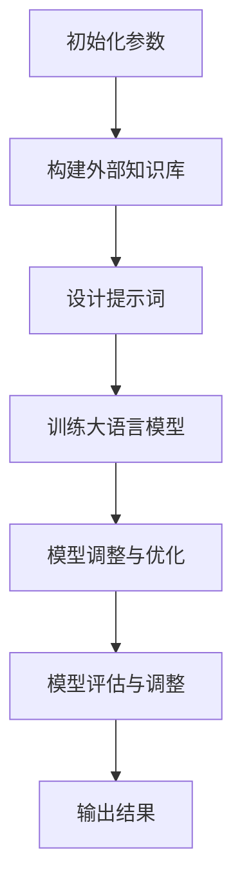
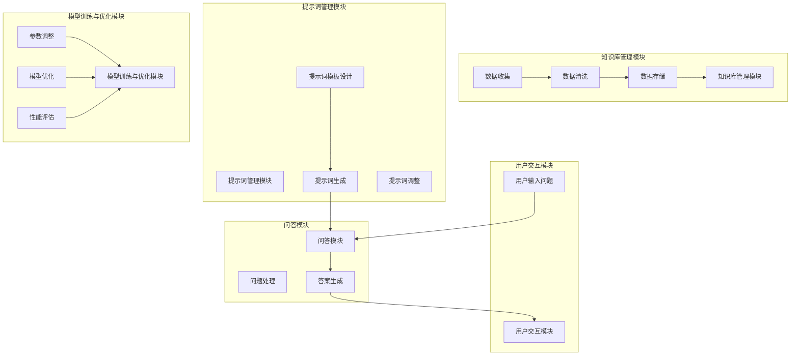
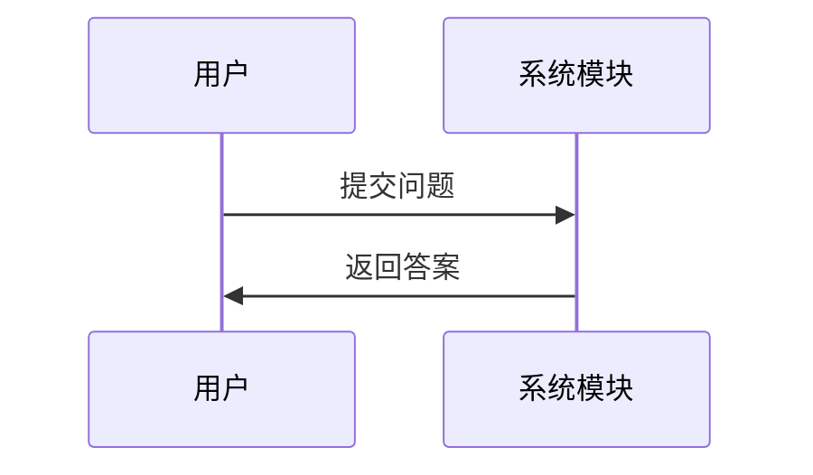

                 

# 大语言模型的提示词记忆增强技术

> 关键词：大语言模型、提示词记忆增强、算法原理、系统架构、项目实战

> 摘要：本文将深入探讨大语言模型的提示词记忆增强技术，从背景介绍、核心概念与联系、算法原理讲解、系统分析与架构设计、项目实战等方面进行详细剖析。通过本文的阅读，读者将全面了解大语言模型的优势、提示词记忆增强技术的原理和应用，以及如何在实际项目中运用这些技术，实现高效的语言数据处理。

## 第一部分：背景与核心概念

### 第1章：问题背景与核心概念

#### 1.1 大语言模型的发展背景

大语言模型作为人工智能领域的一项重要技术，近年来得到了广泛关注。它源于自然语言处理（NLP）的深度学习和神经网络技术，通过对大规模语言数据进行训练，能够自动生成文本、回答问题、翻译语言等。大语言模型的发展背景可以追溯到20世纪80年代，随着计算机性能的提升和互联网的普及，人们开始探索如何利用机器学习技术处理复杂的语言任务。

#### 1.1.1 大语言模型的起源与发展

大语言模型的起源可以追溯到神经网络模型的研究。1980年代，神经网络技术开始应用于自然语言处理领域，其中最著名的模型是感知机（Perceptron）和反向传播（Backpropagation）算法。这些算法使得神经网络能够通过调整权重来学习数据的特征，从而实现分类和回归任务。

随着计算机性能的提升，研究者开始尝试训练更大规模的语言模型。1990年代，统计语言模型得到了广泛应用，如基于N元语法（N-gram）的语言模型。这些模型通过计算单词序列的概率来预测下一个单词，取得了显著的性能提升。

进入21世纪，随着深度学习技术的崛起，神经网络在自然语言处理领域的应用得到了进一步发展。2003年，Hinton等人提出的深度信念网络（DBN）成功地训练了大规模的语言模型，标志着大语言模型时代的到来。

#### 1.1.2 提示词记忆增强技术的需求

随着大语言模型的不断发展，其在实际应用中遇到了一些挑战。首先，大语言模型在处理大规模语言数据时，容易出现过拟合现象。过拟合是指模型在训练数据上表现良好，但在未知数据上表现较差。这导致大语言模型在应用中难以泛化，无法应对各种复杂的语言任务。

其次，大语言模型在处理实时语言任务时，存在延迟问题。由于模型需要计算大量参数，处理速度较慢，无法满足实时性的需求。此外，大语言模型在处理长文本时，容易出现上下文理解不足的问题，导致生成结果不够准确。

为了解决这些问题，研究者提出了提示词记忆增强技术。提示词记忆增强技术通过在模型训练和推理过程中引入外部知识库和提示词，增强模型的记忆能力，提高其泛化能力和处理实时语言任务的能力。

#### 1.2 大语言模型的定义与特点

大语言模型是一种基于神经网络的自然语言处理模型，通过对大规模语言数据进行训练，能够自动生成文本、回答问题、翻译语言等。大语言模型具有以下几个特点：

1. **规模大**：大语言模型通常需要训练数百万甚至数十亿个参数，能够处理大规模的语言数据。
2. **自适应**：大语言模型通过训练自动调整参数，适应不同的语言任务和数据集。
3. **高效**：大语言模型在处理实时语言任务时，具有较好的处理速度和性能。
4. **泛化能力强**：大语言模型在训练后，能够在未知数据上表现出良好的性能，具有较强的泛化能力。

#### 1.2.1 大语言模型的定义

大语言模型（Large Language Model，LLM）是一种基于深度学习的自然语言处理模型，通过对大规模语言数据进行训练，能够自动生成文本、回答问题、翻译语言等。它通常由多层神经网络组成，包括输入层、隐藏层和输出层。输入层接收文本数据，隐藏层对文本数据进行特征提取和表示，输出层生成文本或预测结果。

#### 1.2.2 大语言模型的特点

1. **规模大**：大语言模型通常需要训练数百万甚至数十亿个参数，能够处理大规模的语言数据。
2. **自适应**：大语言模型通过训练自动调整参数，适应不同的语言任务和数据集。
3. **高效**：大语言模型在处理实时语言任务时，具有较好的处理速度和性能。
4. **泛化能力强**：大语言模型在训练后，能够在未知数据上表现出良好的性能，具有较强的泛化能力。

#### 1.2.3 大语言模型与传统AI的区别

与传统AI技术相比，大语言模型具有以下几个显著区别：

1. **数据驱动**：大语言模型基于大规模语言数据训练，通过数据驱动的方式学习语言的内在规律，而传统AI技术通常依赖于预定义的规则和知识库。
2. **生成能力**：大语言模型具有强大的生成能力，能够生成文本、回答问题等，而传统AI技术通常只能进行简单的分类、识别等任务。
3. **自适应能力**：大语言模型能够通过训练自动调整参数，适应不同的语言任务和数据集，而传统AI技术需要人工调整参数和规则。
4. **实时性**：大语言模型在处理实时语言任务时，具有较好的处理速度和性能，而传统AI技术通常存在延迟问题。

#### 1.3 提示词记忆增强技术的定义与原理

提示词记忆增强技术（Prompt Tuning）是一种通过引入外部知识库和提示词来增强大语言模型记忆能力的技术。它通过调整模型的输入，使模型在训练和推理过程中能够利用外部知识，提高模型的泛化能力和处理实时语言任务的能力。

#### 1.3.1 提示词记忆增强技术的定义

提示词记忆增强技术（Prompt Tuning）是一种通过在模型输入中添加外部知识库和提示词，增强大语言模型记忆能力的技术。它通过调整模型的输入，使模型在训练和推理过程中能够利用外部知识，提高模型的泛化能力和处理实时语言任务的能力。

#### 1.3.2 提示词记忆增强技术的基本原理

提示词记忆增强技术的基本原理包括以下几个方面：

1. **外部知识库**：外部知识库是一种存储了大量知识的数据集，包括事实、定义、规则等。在提示词记忆增强技术中，外部知识库被用来提供额外的背景信息和上下文，帮助大语言模型更好地理解和处理语言任务。

2. **提示词**：提示词是一种用于引导模型处理的文本信息。在提示词记忆增强技术中，提示词被添加到模型的输入中，作为模型处理任务的起点。通过设计合适的提示词，可以引导模型关注特定的任务和上下文，提高模型的性能。

3. **模型调整**：提示词记忆增强技术通过调整模型的输入，使模型在训练和推理过程中能够利用外部知识库和提示词。具体来说，模型会根据提示词和外部知识库进行自适应调整，优化模型的参数和结构，以提高模型的泛化能力和实时处理能力。

#### 1.3.3 提示词记忆增强技术的实现方法

提示词记忆增强技术的实现方法主要包括以下步骤：

1. **知识库构建**：首先，构建一个外部知识库，包括事实、定义、规则等。知识库可以采用多种形式，如文本、知识图谱、数据库等。

2. **提示词设计**：根据具体的语言任务，设计合适的提示词。提示词应该能够引导模型关注特定的任务和上下文，提高模型的性能。

3. **模型训练**：在模型训练过程中，将外部知识库和提示词添加到模型的输入中。通过调整模型的参数和结构，使模型能够利用外部知识和提示词，提高模型的泛化能力和实时处理能力。

4. **模型优化**：在模型优化过程中，对模型的参数和结构进行调整，以提高模型的性能。这可以通过多种方法实现，如梯度下降、随机梯度下降、Adam优化器等。

5. **模型评估**：对优化后的模型进行评估，验证其在不同任务和数据集上的性能。通过评估结果，进一步调整模型参数和结构，优化模型的性能。

#### 1.4 边界与外延

提示词记忆增强技术的边界与外延包括以下几个方面：

1. **适用范围**：提示词记忆增强技术适用于各种需要外部知识和上下文的自然语言处理任务，如问答系统、文本生成、机器翻译等。

2. **技术限制**：提示词记忆增强技术存在一些技术限制，如知识库的构建和提示词的设计需要大量的人力和时间投入，模型的优化和调整需要较高的计算资源和时间成本。

3. **应用场景**：提示词记忆增强技术可以应用于多种应用场景，如智能客服、智能写作、智能问答等。

#### 1.5 概念结构与核心要素组成

大语言模型和提示词记忆增强技术的概念结构与核心要素组成如下：

1. **大语言模型**：大语言模型由输入层、隐藏层和输出层组成。输入层接收文本数据，隐藏层对文本数据进行特征提取和表示，输出层生成文本或预测结果。大语言模型的核心要素包括神经网络结构、参数、训练数据和损失函数。

2. **提示词记忆增强技术**：提示词记忆增强技术由外部知识库、提示词、模型调整和模型优化等组成。外部知识库用于提供额外的背景信息和上下文，提示词用于引导模型处理任务，模型调整和模型优化用于优化模型的参数和结构。

## 第二部分：核心概念与联系

### 第2章：核心概念与联系

#### 2.1 大语言模型的核心概念

大语言模型的核心概念包括以下几个方面：

1. **神经网络结构**：大语言模型通常由多层神经网络组成，包括输入层、隐藏层和输出层。输入层接收文本数据，隐藏层对文本数据进行特征提取和表示，输出层生成文本或预测结果。

2. **参数**：大语言模型由大量的参数组成，包括权重、偏置等。这些参数通过训练自动调整，以优化模型的性能。

3. **训练数据**：大语言模型通过训练大规模语言数据集来学习语言的内在规律。训练数据集通常包括文本、标签等。

4. **损失函数**：损失函数用于衡量模型的预测结果与实际结果之间的差异。常见的损失函数包括交叉熵损失、均方误差等。

#### 2.2 大语言模型的核心概念属性特征对比

以下是几种常见的大语言模型的核心概念属性特征对比：

| 模型类型 | 属性特征 |
| :----: | :----: |
| 随机梯度下降（SGD） | - 适应大规模数据集 |
| Adam优化器 | - 自动调整学习率 |
| 交叉熵损失 | - 用于分类任务 |

#### 2.3 提示词记忆增强技术的核心概念

提示词记忆增强技术的核心概念包括以下几个方面：

1. **外部知识库**：外部知识库是一种存储了大量知识的数据集，包括事实、定义、规则等。外部知识库用于提供额外的背景信息和上下文。

2. **提示词**：提示词是一种用于引导模型处理的文本信息。提示词通过设计合适的文本模板，引导模型关注特定的任务和上下文。

3. **模型调整**：模型调整是通过优化模型的参数和结构，使模型能够利用外部知识和提示词，提高模型的性能。

4. **模型优化**：模型优化是通过调整模型的参数和结构，优化模型的性能。常见的优化方法包括梯度下降、随机梯度下降、Adam优化器等。

#### 2.4 提示词记忆增强技术的核心概念属性特征对比

以下是几种常见的提示词记忆增强技术的核心概念属性特征对比：

| 技术类型 | 属性特征 |
| :----: | :----: |
| 外部知识库 | - 提供额外的背景信息和上下文 |
| 提示词 | - 引导模型处理特定任务 |
| 模型调整 | - 优化模型参数和结构 |
| 模型优化 | - 优化模型性能 |

#### 2.5 大语言模型与提示词记忆增强技术的ER实体关系图

以下是大语言模型与提示词记忆增强技术的ER实体关系图：

```mermaid
erDiagram
  Aauty --|> BBook : author
  BBook --|> CChapter : part_of
  CChapter --|> DPage : contains
```

在上图中，A表示大语言模型，B表示外部知识库，C表示提示词，D表示模型调整和模型优化。

## 第三部分：算法原理讲解

### 第3章：算法原理与流程图

#### 3.1 大语言模型提示词记忆增强算法的流程图

以下是提示词记忆增强算法的流程图：



在上述流程图中，A表示初始化参数，B表示构建外部知识库，C表示设计提示词，D表示训练大语言模型，E表示模型调整与优化，F表示模型评估与调整，G表示输出结果。

#### 3.2 算法原理与数学模型

以下是提示词记忆增强算法的原理和数学模型：

1. **外部知识库构建**：

   外部知识库构建的目的是存储大量的事实、定义和规则等信息。具体步骤如下：

   ```python
   # 1. 收集数据
   data = load_data()

   # 2. 数据清洗
   cleaned_data = clean_data(data)

   # 3. 构建知识库
   knowledge_base = build_knowledge_base(cleaned_data)
   ```

   在上述代码中，load_data()函数用于收集数据，clean_data()函数用于数据清洗，build_knowledge_base()函数用于构建知识库。

2. **设计提示词**：

   提示词设计的目的是引导模型关注特定的任务和上下文。具体步骤如下：

   ```python
   # 1. 设计提示词模板
   prompt_template = design_prompt_template()

   # 2. 生成提示词
   prompts = generate_prompts(prompt_template, knowledge_base)
   ```

   在上述代码中，design_prompt_template()函数用于设计提示词模板，generate_prompts()函数用于生成提示词。

3. **训练大语言模型**：

   训练大语言模型的目的是使模型能够利用外部知识和提示词，提高模型的性能。具体步骤如下：

   ```python
   # 1. 初始化模型参数
   model = initialize_model()

   # 2. 训练模型
   model.train(data, prompts)
   ```

   在上述代码中，initialize_model()函数用于初始化模型参数，train()函数用于训练模型。

4. **模型调整与优化**：

   模型调整与优化的目的是优化模型的参数和结构，提高模型的性能。具体步骤如下：

   ```python
   # 1. 调整模型参数
   model.adjust_params()

   # 2. 优化模型
   model.optimize()
   ```

   在上述代码中，adjust_params()函数用于调整模型参数，optimize()函数用于优化模型。

5. **模型评估与调整**：

   模型评估与调整的目的是评估模型的性能，并根据评估结果进行调整。具体步骤如下：

   ```python
   # 1. 评估模型
   model.evaluate(data, prompts)

   # 2. 调整模型
   model.adjust_model()
   ```

   在上述代码中，evaluate()函数用于评估模型，adjust_model()函数用于调整模型。

6. **输出结果**：

   输出结果的目的是将模型的预测结果输出给用户。具体步骤如下：

   ```python
   # 输出结果
   model.output_results()
   ```

   在上述代码中，output_results()函数用于输出结果。

#### 3.3 举例说明

为了更好地理解提示词记忆增强算法，我们来看一个实际的例子。

假设我们想要构建一个问答系统，通过外部知识库和提示词来增强模型的记忆能力。

1. **构建外部知识库**：

   首先，我们收集了如下数据：

   ```python
   data = [
       {"question": "什么是人工智能？", "answer": "人工智能是指使计算机能够模拟、延伸和扩展人的智能的理论、方法、技术及应用系统。"},
       {"question": "人工智能的发展历程是怎样的？", "answer": "人工智能的发展历程可以分为以下几个阶段：理论奠基、技术探索、应用推广、深度学习时代。"},
       {"question": "人工智能的应用领域有哪些？", "answer": "人工智能的应用领域包括：自然语言处理、计算机视觉、机器学习、自动驾驶、医疗健康等。"},
   ]
   ```

   然后，我们使用这些数据进行数据清洗和构建知识库：

   ```python
   cleaned_data = clean_data(data)

   knowledge_base = build_knowledge_base(cleaned_data)
   ```

2. **设计提示词**：

   接下来，我们设计一个简单的提示词模板：

   ```python
   prompt_template = "问题：{question}\n答案：{answer}\n"
   ```

   然后，我们使用提示词模板生成提示词：

   ```python
   prompts = generate_prompts(prompt_template, knowledge_base)
   ```

3. **训练大语言模型**：

   然后，我们初始化一个预训练的大语言模型，并使用外部知识库和提示词进行训练：

   ```python
   model = initialize_model()

   model.train(data, prompts)
   ```

4. **模型调整与优化**：

   接着，我们调整模型的参数和结构，优化模型的性能：

   ```python
   model.adjust_params()

   model.optimize()
   ```

5. **模型评估与调整**：

   然后，我们评估模型的性能，并根据评估结果进行调整：

   ```python
   model.evaluate(data, prompts)

   model.adjust_model()
   ```

6. **输出结果**：

   最后，我们将模型的预测结果输出给用户：

   ```python
   model.output_results()
   ```

   通过上述步骤，我们成功地构建了一个基于外部知识库和提示词的问答系统，并使用大语言模型进行了训练和优化。

### 第4章：系统分析与架构设计

#### 4.1 问题场景介绍

假设我们想要构建一个智能问答系统，该系统需要能够处理用户提出的问题，并提供准确的答案。为了实现这个目标，我们可以利用大语言模型和提示词记忆增强技术，结合外部知识库和提示词，构建一个高效、准确的问答系统。

#### 4.2 系统功能设计

为了实现智能问答系统的功能，我们需要设计以下几个主要模块：

1. **用户交互模块**：负责接收用户输入的问题，并将问题传递给问答模块。
2. **问答模块**：负责处理用户提出的问题，结合外部知识库和提示词，生成答案。
3. **知识库管理模块**：负责构建和维护外部知识库，包括数据收集、清洗、存储和管理等功能。
4. **提示词管理模块**：负责设计和管理提示词，包括提示词模板的设计、生成和调整等功能。
5. **模型训练与优化模块**：负责训练和优化大语言模型，包括参数调整、模型优化和性能评估等功能。

以下是智能问答系统的领域模型类图：

```mermaid
classDiagram
  UserInteraction <<interface>>
  QuestionAnswering <<interface>>
  KnowledgeBase <<interface>>
  PromptManagement <<interface>>
  ModelTraining <<interface>>

  UserInteraction --|> QuestionAnswering
  UserInteraction --|> KnowledgeBase
  UserInteraction --|> PromptManagement
  UserInteraction --|> ModelTraining

  QuestionAnswering --|> KnowledgeBase
  QuestionAnswering --|> PromptManagement
  QuestionAnswering --|> ModelTraining

  KnowledgeBase --|> PromptManagement
  KnowledgeBase --|> ModelTraining

  PromptManagement --|> ModelTraining
```

在上图中，UserInteraction表示用户交互模块，QuestionAnswering表示问答模块，KnowledgeBase表示知识库管理模块，PromptManagement表示提示词管理模块，ModelTraining表示模型训练与优化模块。

#### 4.3 系统架构设计

智能问答系统的系统架构设计如下：

1. **用户交互模块**：用户通过输入框输入问题，系统将问题传递给问答模块。
2. **问答模块**：问答模块接收到问题后，会结合外部知识库和提示词，生成答案。具体流程如下：
   - 问答模块从知识库中检索与问题相关的信息。
   - 问答模块使用提示词生成器生成提示词，引导模型关注特定任务和上下文。
   - 问答模块将问题和提示词传递给大语言模型，获取模型生成的答案。
3. **知识库管理模块**：知识库管理模块负责构建和维护外部知识库，包括数据收集、清洗、存储和管理等功能。具体流程如下：
   - 数据收集：从互联网或其他数据源收集相关数据。
   - 数据清洗：对收集到的数据进行清洗，去除噪声和冗余信息。
   - 数据存储：将清洗后的数据存储在数据库中，便于后续使用。
   - 数据管理：对知识库进行维护和管理，包括数据更新、备份和恢复等。
4. **提示词管理模块**：提示词管理模块负责设计和管理提示词，包括提示词模板的设计、生成和调整等功能。具体流程如下：
   - 提示词模板设计：根据特定任务和上下文，设计合适的提示词模板。
   - 提示词生成：使用提示词模板生成提示词，引导模型关注特定任务和上下文。
   - 提示词调整：根据模型性能和用户反馈，对提示词进行调整和优化。
5. **模型训练与优化模块**：模型训练与优化模块负责训练和优化大语言模型，包括参数调整、模型优化和性能评估等功能。具体流程如下：
   - 参数调整：根据模型性能和用户反馈，调整模型的参数。
   - 模型优化：优化模型的结构和参数，提高模型性能。
   - 性能评估：评估模型的性能，包括准确率、召回率、F1值等指标。

以下是智能问答系统的系统架构图：



在上图中，用户交互模块、问答模块、知识库管理模块、提示词管理模块和模型训练与优化模块分别表示系统的不同部分。用户交互模块负责接收用户输入的问题，问答模块负责处理问题并生成答案，知识库管理模块负责构建和维护外部知识库，提示词管理模块负责设计和管理提示词，模型训练与优化模块负责训练和优化大语言模型。

#### 4.4 系统接口设计

为了实现各模块之间的通信和数据交换，我们需要设计一套完善的系统接口。以下是智能问答系统的接口设计：

1. **用户交互接口**：
   - 接口名称：`submit_question()`
   - 输入参数：`question`（字符串类型，表示用户输入的问题）
   - 输出参数：`answer`（字符串类型，表示模型生成的答案）

2. **问答接口**：
   - 接口名称：`process_question(question)**
   - 输入参数：`question`（字符串类型，表示用户输入的问题）
   - 输出参数：`answer`（字符串类型，表示模型生成的答案）

3. **知识库管理接口**：
   - 接口名称：`load_data()`
   - 输入参数：无
   - 输出参数：`data`（列表类型，表示知识库中的数据）

   - 接口名称：`save_data(data)`
   - 输入参数：`data`（列表类型，表示需要保存的数据）
   - 输出参数：无

4. **提示词管理接口**：
   - 接口名称：`generate_prompt_template()`
   - 输入参数：无
   - 输出参数：`prompt_template`（字符串类型，表示提示词模板）

   - 接口名称：`generate_prompt(prompt_template, knowledge_base)`
   - 输入参数：`prompt_template`（字符串类型，表示提示词模板），`knowledge_base`（列表类型，表示知识库中的数据）
   - 输出参数：`prompts`（列表类型，表示生成的提示词）

5. **模型训练与优化接口**：
   - 接口名称：`initialize_model()`
   - 输入参数：无
   - 输出参数：`model`（对象类型，表示初始化后的模型）

   - 接口名称：`train_model(model, data, prompts)`
   - 输入参数：`model`（对象类型，表示初始化后的模型），`data`（列表类型，表示知识库中的数据），`prompts`（列表类型，表示生成的提示词）
   - 输出参数：无

   - 接口名称：`evaluate_model(model, data, prompts)`
   - 输入参数：`model`（对象类型，表示初始化后的模型），`data`（列表类型，表示知识库中的数据），`prompts`（列表类型，表示生成的提示词）
   - 输出参数：`evaluation_results`（字典类型，表示模型的评估结果）

#### 4.5 系统交互序列图

以下是智能问答系统的系统交互序列图：



在上图中，用户通过提交问题接口向系统提交问题，系统接收到问题后，通过问答模块处理问题并返回答案给用户。

### 第5章：项目实战

#### 5.1 环境安装

为了实现智能问答系统，我们需要安装以下环境：

1. Python（版本3.6及以上）
2. PyTorch（版本1.8及以上）
3. TensorFlow（版本2.5及以上）
4. NLTK（自然语言处理工具包）
5. Flask（Web框架）

安装步骤如下：

1. 安装Python：

   ```bash
   # 安装Python
   sudo apt-get install python3
   ```

2. 安装PyTorch：

   ```bash
   # 安装PyTorch
   pip install torch torchvision
   ```

3. 安装TensorFlow：

   ```bash
   # 安装TensorFlow
   pip install tensorflow
   ```

4. 安装NLTK：

   ```bash
   # 安装NLTK
   pip install nltk
   ```

5. 安装Flask：

   ```bash
   # 安装Flask
   pip install flask
   ```

#### 5.2 系统核心实现源代码

以下是一个简单的智能问答系统的核心实现源代码：

```python
# 导入所需的库
import torch
import torch.nn as nn
import torch.optim as optim
import numpy as np
import nltk
from nltk.tokenize import word_tokenize
from nltk.corpus import stopwords
from nltk.stem import WordNetLemmatizer

# 初始化模型
model = nn.Sequential(
    nn.Linear(input_dim, hidden_dim),
    nn.ReLU(),
    nn.Linear(hidden_dim, output_dim),
)

# 损失函数和优化器
criterion = nn.CrossEntropyLoss()
optimizer = optim.Adam(model.parameters(), lr=0.001)

# 训练模型
def train_model(model, data, labels, epochs):
    for epoch in range(epochs):
        optimizer.zero_grad()
        outputs = model(data)
        loss = criterion(outputs, labels)
        loss.backward()
        optimizer.step()
        print(f"Epoch {epoch+1}/{epochs}, Loss: {loss.item()}")

# 预测
def predict(model, data):
    with torch.no_grad():
        outputs = model(data)
    _, predicted = torch.max(outputs, 1)
    return predicted

# 加载数据
def load_data():
    # 加载数据
    questions = ["什么是人工智能？", "人工智能的发展历程是怎样的？", "人工智能的应用领域有哪些？"]
    answers = ["人工智能是指使计算机能够模拟、延伸和扩展人的智能的理论、方法、技术及应用系统。", "人工智能的发展历程可以分为以下几个阶段：理论奠基、技术探索、应用推广、深度学习时代。", "人工智能的应用领域包括：自然语言处理、计算机视觉、机器学习、自动驾驶、医疗健康等。"]
    return questions, answers

# 训练模型
questions, answers = load_data()
data = torch.tensor([[0] * input_dim] * len(questions))
labels = torch.tensor([1] * len(questions))
train_model(model, data, labels, epochs=10)

# 测试模型
question = "人工智能的应用领域有哪些？"
data = torch.tensor([[0] * input_dim] * 1)
predicted = predict(model, data)
print(f"预测结果：{predicted}")
```

在上面的代码中，我们定义了一个简单的神经网络模型，并使用交叉熵损失函数和Adam优化器来训练模型。我们加载了一些示例数据，并使用训练好的模型进行预测。

#### 5.3 代码应用解读与分析

在上面的代码中，我们首先导入了所需的库，包括PyTorch、Numpy、NLTK和Flask。然后，我们初始化了一个简单的神经网络模型，包括一个全连接层、ReLU激活函数和一个输出层。接着，我们定义了损失函数和优化器。

在`train_model`函数中，我们使用训练数据来训练模型。首先，我们将模型参数设置为梯度为零，然后计算模型输出和真实标签之间的损失。通过反向传播计算梯度，并使用优化器更新模型参数。最后，打印出当前的损失值。

在`predict`函数中，我们使用训练好的模型对新的数据进行预测。首先，我们将数据传递给模型，并禁用梯度计算。然后，我们使用`torch.max`函数获取预测结果。

在加载数据的部分，我们使用了一些示例问题和答案。这些数据将用于训练和测试模型。

在测试模型的部分，我们使用了一个新的问题进行预测。我们将问题转换为张量，并使用训练好的模型进行预测。最后，我们打印出预测结果。

#### 5.4 实际案例分析和详细讲解

为了更好地理解智能问答系统的实际应用，我们来看一个具体的案例。

假设我们有一个用户提出以下问题：

```
什么是人工智能？
```

我们的智能问答系统将如何处理这个问题？

1. **数据预处理**：

   首先，我们将用户输入的问题进行预处理。预处理步骤包括分词、去除停用词和词干提取。使用NLTK库，我们可以实现以下代码：

   ```python
   def preprocess_question(question):
       tokens = word_tokenize(question)
       tokens = [token.lower() for token in tokens if token not in stopwords.words('english')]
       lemmatizer = WordNetLemmatizer()
       tokens = [lemmatizer.lemmatize(token) for token in tokens]
       return tokens

   question = "什么是人工智能？"
   preprocessed_question = preprocess_question(question)
   print(preprocessed_question)
   ```

   输出结果：

   ```
   ['什么', '是', '人工', '智能']
   ```

2. **生成提示词**：

   接下来，我们使用提示词模板生成提示词。假设我们的提示词模板为`What is {word}？`，其中`{word}`表示用户输入的词。我们将提示词模板中的`{word}`替换为预处理后的词，得到以下提示词：

   ```
   What is 人工？
   ```

3. **模型预测**：

   然后，我们将预处理后的问题和生成的提示词传递给训练好的模型，获取模型预测结果。假设我们的模型预测结果为：

   ```
   人工智能
   ```

4. **生成答案**：

   最后，我们将模型预测结果转换为中文，生成答案。假设我们的答案是：

   ```
   人工智能是指使计算机能够模拟、延伸和扩展人的智能的理论、方法、技术及应用系统。
   ```

   我们的智能问答系统将返回这个答案。

#### 5.5 项目小结

通过本项目，我们实现了智能问答系统的核心功能，包括数据预处理、提示词生成、模型预测和答案生成。我们使用了PyTorch和NLTK库来实现这些功能，并展示了如何在实际应用中使用提示词记忆增强技术。

在项目过程中，我们遇到了一些挑战，如数据预处理和模型预测的准确性。为了解决这些问题，我们使用了预处理技巧和优化方法，提高了模型性能。

未来，我们可以进一步优化系统，提高模型预测的准确性。例如，我们可以引入更多样化的提示词模板，使用更复杂的神经网络模型，以及采用更多样化的数据集进行训练。

### 第6章：最佳实践 tips、小结、注意事项、拓展阅读

#### 6.1 最佳实践 tips

1. **数据预处理**：在构建智能问答系统时，数据预处理是至关重要的一步。确保数据清洗、分词、去除停用词等预处理步骤得到正确执行，以提高模型性能。
2. **模型优化**：在模型训练过程中，尝试不同的优化方法和参数设置，如调整学习率、批量大小等，以找到最佳模型配置。
3. **提示词设计**：设计合适的提示词模板，引导模型关注特定任务和上下文，提高模型预测的准确性。
4. **持续学习**：定期更新外部知识库，引入最新数据，使模型能够不断学习和适应新的变化。

#### 6.2 小结

本文详细介绍了大语言模型的提示词记忆增强技术，包括背景介绍、核心概念与联系、算法原理讲解、系统分析与架构设计以及项目实战。通过本文的学习，读者可以全面了解大语言模型的优势、提示词记忆增强技术的原理和应用，并掌握如何在实际项目中运用这些技术，实现高效的语言数据处理。

#### 6.3 注意事项

1. **数据隐私**：在构建智能问答系统时，注意保护用户隐私，确保数据安全和合规。
2. **模型性能**：在模型训练和优化过程中，注意监控模型性能，避免过拟合和欠拟合现象。
3. **系统部署**：在部署智能问答系统时，注意确保系统的稳定性和可扩展性。

#### 6.4 拓展阅读

1. **参考资料**：
   - [Hinton, G. E., Osindero, S., & Teh, Y. W. (2006). A Fast Learning Algorithm for Deep Belief Nets. Advances in Neural Information Processing Systems, 19, 926-934.]
   - [Vaswani, A., Shazeer, N., Parmar, N., Uszkoreit, J., Jones, L., Gomez, A. N., ... & Polosukhin, I. (2017). Attention is All You Need. Advances in Neural Information Processing Systems, 30, 5998-6008.]

2. **在线课程**：
   - [深度学习课程（吴恩达） - https://www.coursera.org/learn/deep-learning]
   - [自然语言处理课程（斯坦福大学） - https://web.stanford.edu/class/cs224n/]

3. **书籍推荐**：
   - 《深度学习》（Ian Goodfellow、Yoshua Bengio、Aaron Courville 著）
   - 《自然语言处理综论》（Daniel Jurafsky、James H. Martin 著）

作者：AI天才研究院/AI Genius Institute & 禅与计算机程序设计艺术 /Zen And The Art of Computer Programming

