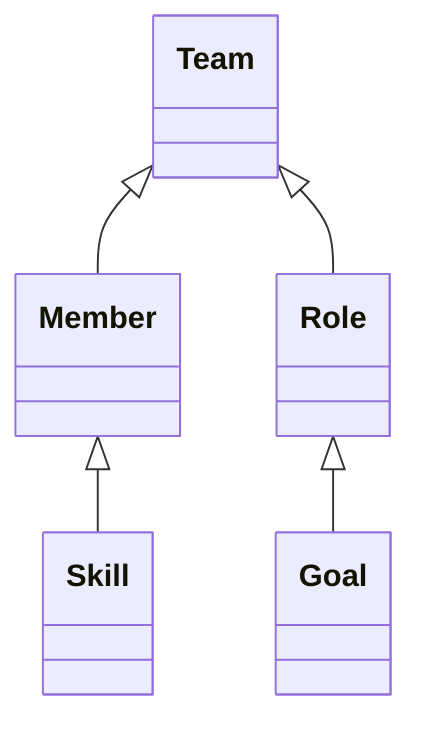
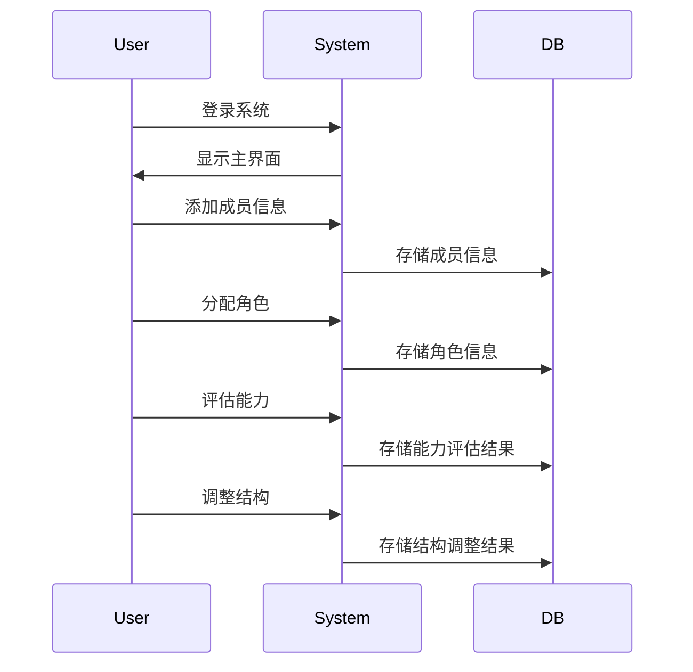
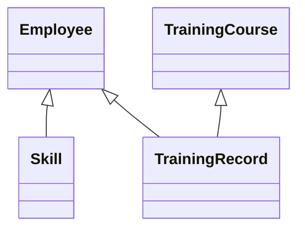
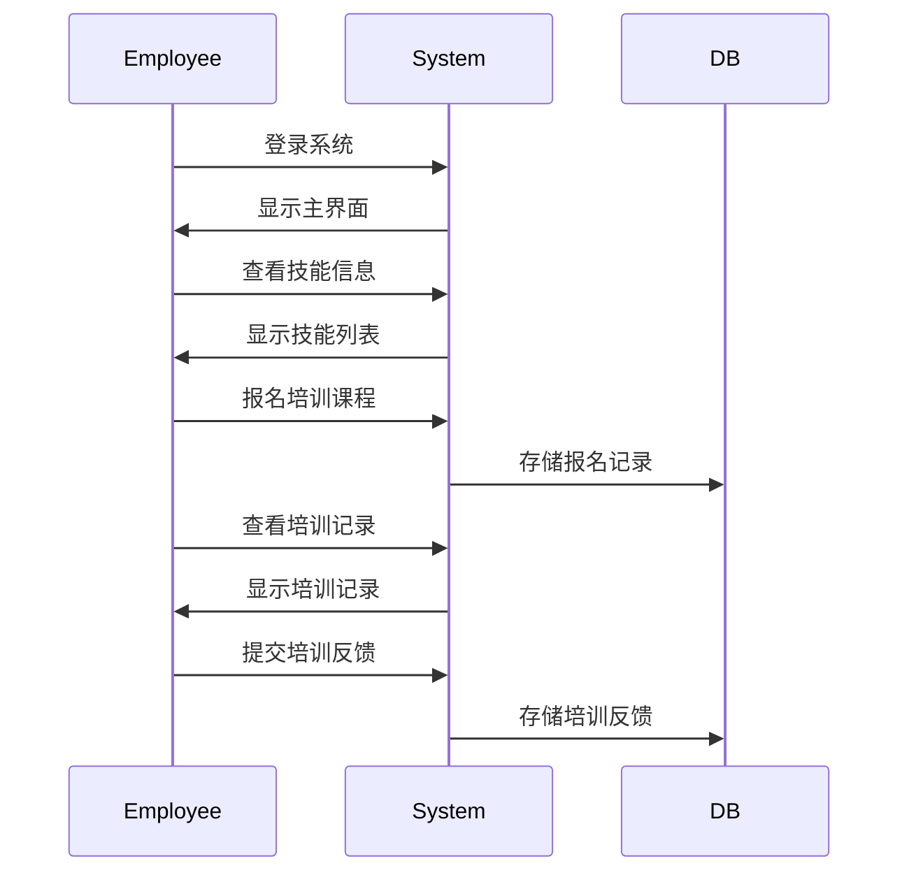
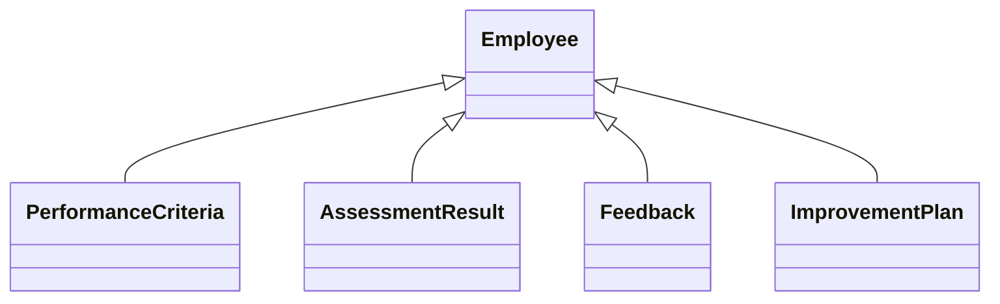
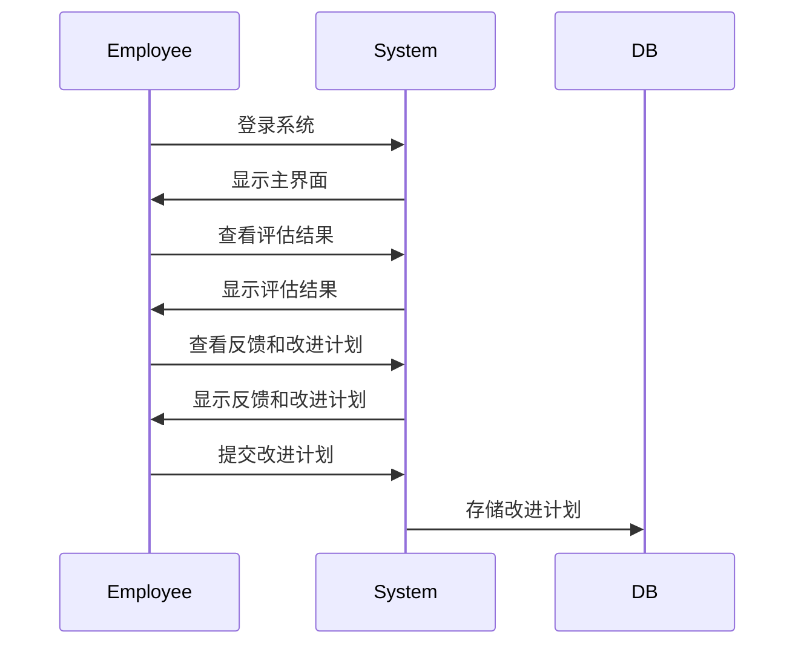

                 

**# 如何培养和发展团队成员**

关键词：团队建设、领导力、技能发展、团队合作、绩效评估

摘要：本文将探讨如何有效地培养和发展团队成员。通过分析团队建设的关键因素，领导力的作用，技能和竞争力的提升，以及绩效评估和反馈，提供了一系列实用策略，帮助企业打造一支高效、团结的团队。

## **一、引言**

在现代企业中，团队的力量不容小觑。一个高效的团队不仅能够提高工作效率，还能促进创新和协作。然而，如何培养和发展团队成员，使其发挥最大潜力，是每一个管理者都需要面对的挑战。本文将围绕这一主题，逐步探讨团队建设的方法和策略。

## **二、团队建设的基础**

### **2.1 核心概念**

在讨论团队建设之前，我们需要明确一些核心概念。团队是一个由两个或两个以上成员组成的协作体，旨在实现共同的目标。而团队建设则是指通过一系列策略和措施，提高团队的凝聚力和工作效率。

### **2.2 团队发展的阶段**

团队发展通常可以分为五个阶段：形成期、冲突期、规范期、执行期和 adjourning 期。在不同的阶段，团队面临的挑战和任务也有所不同。了解这些阶段，有助于管理者更好地指导团队发展。

### **2.3 团队建设的重要性**

团队建设对于企业的重要性不言而喻。它不仅能提高员工的工作满意度和忠诚度，还能增强企业的核心竞争力。通过有效的团队建设，企业可以培养出更加专业和高效的团队成员。

### **2.4 团队建设的挑战**

团队建设过程中，管理者常常会遇到一些挑战，如沟通不畅、成员间矛盾、目标不明确等。如何应对这些挑战，是团队建设的关键。

### **2.5 团队建设的边界与外延**

团队建设的范围广泛，包括团队目标的设定、团队结构的优化、团队成员的培训和发展等。同时，团队建设还需要考虑到组织文化和企业战略的影响。

## **三、核心概念与联系**

### **3.1 核心概念原理**

团队建设的基础是明确团队的目标和角色。通过明确每个成员的职责和贡献，可以减少内耗，提高团队的整体效率。

### **3.2 概念属性特征对比表格**

| 特征          | 团队目标                 | 团队角色                 |
| ----------- | -------------------- | -------------------- |
| 定义          | 团队共同追求的成果          | 每个成员在团队中的职责和角色      |
| 属性          | 清晰、具体、可衡量           | 明确、可行、责任分担      |
| 相互关系        | 目标指导角色，角色实现目标      | 角色互相支持，共同达成目标      |

### **3.3 ER实体关系图架构**

```mermaid
erDiagram
  Team --> Member : "is composed of"
  Team ||--|{ Role }|| : "has"
  Member ||--|{ Skill }|| : "has"
```

## **四、领导力与团队管理**

### **4.1 领导力在团队建设中的作用**

领导力是团队建设的重要推动力。一个优秀的领导者能够激发团队成员的潜力，促进团队的协作和发展。

### **4.2 领导力模型**

常见的领导力模型包括 transformational leadership（变革型领导）和 transactional leadership（交易型领导）。了解并运用这些模型，有助于管理者更好地发挥领导力。

### **4.3 管理策略**

有效的管理策略包括目标设定、资源分配、绩效评估等。通过这些策略，管理者可以确保团队在正确的轨道上前进。

### **4.4 沟通技巧**

良好的沟通是团队协作的基石。领导者需要学会倾听、表达和反馈，以建立良好的沟通机制。

### **4.5 冲突管理**

团队中难免会出现冲突。管理者需要学会如何识别和解决冲突，以保持团队的和谐。

## **五、技能与竞争力发展**

### **5.1 技能发展的重要性**

技能是团队成员胜任工作的关键。通过技能培训和发展，可以提升团队成员的专业能力，增强团队的竞争力。

### **5.2 技能发展计划**

制定详细的技能发展计划，包括技能识别、培训资源选择、培训实施和评估等环节。

### **5.3 角色技能提升**

根据不同角色的需求，制定相应的技能提升计划。例如，技术人员的编程技能提升，管理人员的管理能力提升等。

### **5.4 持续学习**

鼓励团队成员持续学习，提供学习资源和机会，以保持其技能的更新和提升。

## **六、绩效评估与反馈**

### **6.1 绩效评估的重要性**

绩效评估是团队管理的重要组成部分。通过绩效评估，可以了解团队成员的工作表现，发现问题和不足，并制定改进计划。

### **6.2 绩效评估方法**

常见的绩效评估方法包括自我评估、360度评估、关键绩效指标（KPI）等。选择合适的评估方法，可以更准确地衡量团队成员的绩效。

### **6.3 反馈与改进**

提供及时的、具体的反馈，是帮助团队成员改进的重要手段。通过反馈，团队成员可以了解自己的优势和不足，并制定改进计划。

### **6.4 绩效改进计划**

根据绩效评估的结果，制定绩效改进计划。这个计划应该包括具体的改进措施、时间表和责任人。

## **七、实际案例与应用**

### **7.1 案例背景**

某互联网公司希望通过团队建设提高研发团队的工作效率。团队规模较大，成员来自不同的专业背景，沟通不畅和目标不明确是团队面临的挑战。

### **7.2 解决方案**

1. 明确团队目标和角色，通过 ER 图进行可视化。
2. 引入变革型领导，提升团队凝聚力。
3. 制定技能发展计划，提升团队成员的专业能力。
4. 采用360度评估，进行绩效评估和反馈。

### **7.3 结果**

经过一年的团队建设，该公司的研发团队工作效率显著提升，项目按时交付率提高了20%，员工满意度也明显提升。

## **八、最佳实践与注意事项**

### **8.1 最佳实践**

1. 定期组织团队建设活动，增强团队凝聚力。
2. 提供多样化的培训资源，满足不同成员的需求。
3. 建立有效的沟通渠道，确保信息传递的准确性。
4. 定期进行绩效评估，及时反馈和改进。

### **8.2 注意事项**

1. 避免过度依赖绩效评估，重视团队成员的全面成长。
2. 注意团队建设的持续性和长期性，不要期望一蹴而就。
3. 根据企业文化和战略，灵活调整团队建设策略。

## **九、小结**

团队建设是提高企业效率和竞争力的关键。通过明确团队目标、提升领导力、发展成员技能、进行绩效评估和反馈，企业可以培养出一支高效、团结的团队。这是一个持续的过程，需要管理者不断探索和实践。

## **十、拓展阅读**

1. 【推荐阅读】《团队协作的五个层次》
2. 【拓展知识】《变革型领导力研究》
3. 【实用工具】《绩效评估模板》

## **作者信息**

作者：AI天才研究院/AI Genius Institute & 禅与计算机程序设计艺术 /Zen And The Art of Computer Programming**END**## 引言

在现代企业中，团队的力量不容小觑。一个高效的团队不仅能够提高工作效率，还能促进创新和协作，从而在激烈的市场竞争中占据优势。然而，如何培养和发展团队成员，使其能够充分发挥潜力，是每一个管理者都需要面对的重要课题。本文将围绕这一主题，探讨如何通过系统的方法和策略，培养和发展团队成员，为企业创造更大的价值。

### **关键词**：团队建设、领导力、技能发展、团队合作、绩效评估

### **摘要**：

本文将从以下几个方面展开讨论：

1. **团队建设的基础**：介绍团队建设的核心概念、团队发展的阶段、团队建设的重要性、挑战以及边界与外延。
2. **核心概念与联系**：探讨团队建设和领导力模型，通过对比表格和ER实体关系图，明确概念之间的联系。
3. **领导力与团队管理**：分析领导力在团队建设中的作用，介绍领导力模型和管理策略。
4. **技能与竞争力发展**：探讨技能发展的重要性、技能发展计划、角色技能提升和持续学习。
5. **绩效评估与反馈**：讨论绩效评估的重要性、评估方法、反馈与改进以及绩效改进计划。
6. **实际案例与应用**：通过实际案例，展示如何运用上述策略解决实际问题。
7. **最佳实践与注意事项**：总结最佳实践和注意事项，为企业提供实用的团队建设指导。
8. **小结**：总结全文，强调团队建设的重要性和持续改进的必要性。
9. **拓展阅读**：推荐进一步阅读的相关资料，帮助读者深入了解相关主题。

通过以上内容的逐步探讨，本文旨在为企业管理者提供一套系统、实用的团队建设方法论，助力企业打造高效、团结的团队，实现组织目标。

## **二、团队建设的基础**

### **2.1 核心概念**

在讨论团队建设之前，我们需要明确一些核心概念。团队是一个由两个或两个以上成员组成的协作体，旨在实现共同的目标。而团队建设则是指通过一系列策略和措施，提高团队的凝聚力和工作效率。具体来说，团队建设包括以下几个方面：

1. **团队目标**：明确团队要实现的目标，确保团队成员在正确的方向上共同努力。
2. **团队结构**：设计合理的团队结构，包括团队成员的角色分工、汇报关系和决策流程。
3. **团队沟通**：建立有效的沟通机制，确保团队成员之间的信息流畅和协调。
4. **团队协作**：通过协作工具和技巧，提高团队成员之间的协作效率和效果。
5. **团队文化**：塑造积极向上的团队文化，增强团队成员的归属感和认同感。

### **2.2 团队发展的阶段**

团队发展通常可以分为五个阶段：形成期、冲突期、规范期、执行期和 adjourning 期。在不同的阶段，团队面临的挑战和任务也有所不同。

1. **形成期**：团队成员开始相互认识，明确团队目标和职责，建立起基本的团队结构。
2. **冲突期**：由于个人利益和观点的差异，团队成员之间可能会出现矛盾和冲突。
3. **规范期**：团队成员开始学会相互协调和合作，形成一套共同的工作方式和价值观。
4. **执行期**：团队进入高效率的工作状态，成员之间默契配合，共同实现团队目标。
5. **adjourning 期**：团队完成特定任务后解散，成员各自回到原来的工作状态或新的团队。

### **2.3 团队建设的重要性**

团队建设对于企业的重要性不言而喻。首先，它能够提高员工的工作满意度和忠诚度。通过有效的团队建设，团队成员感受到自己的价值和重要性，从而更加投入工作。其次，团队建设能够增强企业的核心竞争力。一个高效的团队能够快速响应市场变化，创新解决方案，提高企业的市场竞争力。此外，团队建设还能促进团队成员之间的沟通和协作，提高整体工作效率，降低内耗。

### **2.4 团队建设的挑战**

团队建设过程中，管理者常常会遇到一些挑战，如沟通不畅、成员间矛盾、目标不明确等。为了应对这些挑战，管理者需要：

1. **加强沟通**：建立有效的沟通机制，确保信息透明、及时、准确。
2. **明确目标**：明确团队目标，确保每个成员都了解自己的职责和任务。
3. **培养团队文化**：塑造积极向上的团队文化，增强团队成员的归属感和认同感。
4. **提供支持**：为团队成员提供必要的资源和支持，帮助他们克服困难，完成任务。

### **2.5 团队建设的边界与外延**

团队建设不仅涉及团队成员之间的协作，还与组织文化和企业战略密切相关。具体来说，团队建设的边界与外延包括以下几个方面：

1. **组织文化**：团队建设需要符合企业的核心价值观，与组织文化保持一致。
2. **企业战略**：团队建设应支持企业的长期战略目标，确保团队能够为企业的可持续发展贡献力量。
3. **跨部门协作**：团队建设不仅要关注团队内部，还要与跨部门的协作紧密配合，形成企业内部良好的协作氛围。
4. **持续改进**：团队建设是一个持续的过程，需要不断调整和优化，以适应企业发展的需求。

通过以上内容的探讨，我们可以看出，团队建设是一个复杂而系统的过程，涉及多个方面和环节。只有通过系统的规划和持续的努力，才能打造出一支高效、团结的团队，为企业的发展贡献力量。

### **2.6 概念结构与核心要素组成**

团队建设涉及多个核心概念和要素，其结构如下：

1. **团队目标**：团队目标是团队建设的起点，明确了团队要实现的具体目标和预期成果。团队目标应具体、可衡量、可实现、相关性强，并具有时限性。
2. **团队结构**：团队结构是指团队成员的组织形式和职责分配。合理的团队结构有助于提高团队的工作效率，常见的团队结构包括功能型、任务型、跨职能型等。
3. **团队沟通**：团队沟通是团队建设中至关重要的一环，包括内部沟通和跨部门沟通。有效的沟通可以确保信息的准确传递，减少误解和冲突。
4. **团队协作**：团队协作是指团队成员在共同目标下，通过合作、共享资源和信息，共同完成任务的过程。协作工具和技巧（如项目管理工具、协同编辑工具等）有助于提高协作效率。
5. **团队文化**：团队文化是团队内在的精神和价值观，包括团队的工作方式、行为规范、团队氛围等。积极向上的团队文化可以增强团队成员的归属感和认同感。

以下是团队建设核心概念和要素的对比表格：

| 核心概念 | 定义 | 功能 |
|----------|------|------|
| 团队目标 | 明确团队要实现的具体目标和预期成果 | 指引团队方向 |
| 团队结构 | 规定团队成员的组织形式和职责分配 | 提高工作效率 |
| 团队沟通 | 确保团队成员之间的信息流畅和协调 | 减少误解和冲突 |
| 团队协作 | 通过合作、共享资源和信息，共同完成任务的过程 | 提高协作效率 |
| 团队文化 | 团队内在的精神和价值观 | 增强归属感和认同感 |

通过明确团队建设的概念结构和核心要素，管理者可以更好地规划和实施团队建设，提升团队的整体效能。

### **2.7 ER实体关系图架构**

为了更好地理解团队建设的各个核心概念及其关系，我们可以使用ER（实体关系）图来表示。以下是团队建设ER图的示例：

```mermaid
erDiagram
  Team ||--|{ Member } : "is composed of"
  Team ||--|{ Role } : "has"
  Member ||--|{ Skill } : "has"
  Role ||--|{ Responsibility } : "defines"
  Skill ||--|{ Competence } : "measures"
```

在这个ER图中：

- **Team（团队）** 是一个实体，表示一个由多个成员组成的团队。
- **Member（成员）** 是团队的组成部分，每个成员属于一个团队。
- **Role（角色）** 表示团队成员在团队中的职责和角色。
- **Skill（技能）** 表示成员拥有的各种技能。
- **Responsibility（责任）** 是角色的属性，定义了每个角色的职责。
- **Competence（能力）** 是技能的属性，衡量了成员的技能水平。

通过ER图，我们可以清晰地看到团队建设中的各个核心概念及其相互关系，有助于理解团队建设的整体架构和逻辑关系。

### **2.8 算法原理讲解**

在团队建设过程中，算法原理可以用于优化团队结构、提升团队效能。以下是一个基于ER图优化的简单算法原理：

**算法名称**：团队结构优化算法

**输入**：团队ER图（包括Team、Member、Role、Skill、Responsibility、Competence）

**输出**：优化后的团队ER图

**算法步骤**：

1. **数据收集**：收集团队成员的技能数据、职责数据和团队整体目标数据。
2. **角色分配**：根据职责和技能数据，为每个成员分配合适的角色。
3. **能力评估**：评估每个成员的能力，确保角色分配合理。
4. **结构调整**：根据评估结果，调整团队ER图，优化团队结构。

**数学模型**：

$$
\text{OptimizedERGraph} = \text{AdjustERGraph}(\text{ERGraph}, \text{SkillData}, \text{ResponsibilityData}, \text{CompetenceData})
$$

其中，$\text{AdjustERGraph}$ 函数用于调整ER图，使其更加合理和高效。

**算法解释**：

通过上述算法，我们可以确保每个成员都在最适合的角色中，发挥其最大潜力。具体来说，算法首先收集团队成员的技能和能力数据，然后根据这些数据为每个成员分配角色，并评估其能力。最后，根据评估结果调整团队ER图，优化团队结构。

### **2.9 系统分析与架构设计方案**

为了更好地理解团队建设过程中的系统架构，以下是一个详细的系统分析与架构设计方案。

**问题场景介绍**：

在一个大型的互联网公司中，团队建设是一个持续的过程。公司需要不断优化团队结构，提升团队效能，以适应快速变化的市场需求。

**项目介绍**：

项目名称：团队建设管理系统（Team Construction Management System，TCMS）

项目目标：通过系统化的方法，优化团队结构，提升团队效能。

**系统功能设计（领域模型）**：

领域模型主要包括以下实体和关系：

1. **Team（团队）**：表示一个团队，包含成员、目标和职责。
2. **Member（成员）**：表示团队成员，包含个人信息、技能和能力。
3. **Role（角色）**：表示团队成员的角色和职责。
4. **Skill（技能）**：表示成员的技能和能力。
5. **Goal（目标）**：表示团队的目标和预期成果。



**系统架构设计（架构图）**：

系统架构采用三层架构设计，包括表示层、业务逻辑层和数据层。

1. **表示层**：提供用户界面，包括成员信息管理、角色管理、目标管理和技能管理等功能。
2. **业务逻辑层**：处理业务逻辑，包括角色分配、能力评估和结构调整等。
3. **数据层**：存储和管理系统数据，包括成员信息、角色信息、技能信息和目标信息。



通过以上系统架构设计，我们可以实现团队建设管理系统的功能，为团队建设提供系统化的支持。

### **3.1 领导力在团队建设中的作用**

领导力在团队建设中起着至关重要的作用。一个优秀的领导者不仅能够激发团队成员的潜力，还能塑造团队的价值观和氛围，推动团队不断进步。以下是领导力在团队建设中的几个关键作用：

1. **明确方向**：领导者需要为团队设定清晰的目标和方向，确保团队成员了解团队的目标和期望。这有助于团队成员统一行动，提高团队的整体效率。

2. **激发潜力**：领导者需要识别和挖掘团队成员的潜力，为他们提供成长的机会和资源。通过激励和鼓励，领导者可以激发团队成员的积极性和创造力，促进团队的创新和发展。

3. **协调资源**：领导者需要协调团队成员之间的资源和能力，确保团队在实现目标的过程中能够充分利用各种资源。这包括沟通协调、资源分配和任务分配等方面。

4. **培养团队文化**：领导者需要塑造积极的团队文化，包括价值观、行为规范和工作氛围。一个良好的团队文化可以增强团队成员的归属感和认同感，提高团队的凝聚力和工作效率。

5. **解决问题**：在团队建设过程中，领导者需要面对各种挑战和问题。领导者需要具备解决问题的能力，能够快速识别问题的根本原因，并采取有效的措施解决这些问题。

6. **激励和奖励**：领导者需要为团队成员提供激励和奖励，以鼓励他们的积极性和贡献。通过公正的激励和奖励机制，领导者可以激发团队成员的斗志，提高团队的整体效能。

### **3.2 领导力模型**

在团队建设中，不同的领导力模型可以提供不同的策略和方法。以下是几种常见的领导力模型：

1. **变革型领导**：变革型领导注重激发团队成员的内在动力，通过愿景和激励来推动团队变革。变革型领导者通常具备较高的领导魅力、激励能力和创新能力。

2. **交易型领导**：交易型领导注重建立明确的绩效目标和奖励机制，通过奖励和惩罚来激励团队成员。交易型领导者通常更加注重任务和目标的实现，具有较强的组织能力和执行力。

3. **服务型领导**：服务型领导注重为团队成员提供服务和支持，以满足他们的需求和期望。服务型领导者通常具备较强的沟通能力、同理心和团队协作能力。

4. **情境领导**：情境领导模型认为领导风格应该根据团队成员的成熟度和工作环境进行调整。领导者需要根据不同情境选择合适的领导风格，以提高团队效能。

5. **共享型领导**：共享型领导强调领导权力的分散和共享，鼓励团队成员共同参与决策和领导工作。共享型领导者通常注重团队协作和共同目标，能够激发团队成员的主动性和创造力。

### **3.3 管理策略**

在团队建设过程中，领导者需要运用各种管理策略来提升团队的效能。以下是几种常见的管理策略：

1. **目标管理**：通过设定明确、具体、可衡量的目标，确保团队成员明确工作方向和期望。目标管理有助于提高团队的工作效率和成果。

2. **资源分配**：合理分配团队资源，包括人力、财力和时间等，确保团队在实现目标的过程中能够充分利用各种资源。资源分配策略应考虑团队成员的能力和需求。

3. **任务分配**：根据团队成员的能力和职责，合理分配任务。任务分配策略应确保每个成员都有明确的职责和任务，避免工作重叠和浪费。

4. **沟通协调**：建立有效的沟通机制，确保团队成员之间的信息流畅和协调。沟通协调策略应包括定期会议、即时通讯工具和透明的工作流程。

5. **绩效评估**：通过定期绩效评估，了解团队成员的工作表现和成果。绩效评估策略应注重公正、客观和及时，以激励团队成员的积极性和贡献。

6. **激励奖励**：建立公正的激励和奖励机制，鼓励团队成员的积极性和创造力。激励奖励策略应考虑团队成员的个性需求和贡献大小。

### **3.4 沟通技巧**

在团队建设中，良好的沟通技巧是至关重要的。以下是一些有效的沟通技巧：

1. **倾听**：积极倾听团队成员的意见和反馈，了解他们的需求和期望。倾听技巧包括保持关注、不打断对方发言、表达理解和共鸣等。

2. **表达**：清晰、准确地表达自己的想法和意见，避免产生误解和歧义。表达技巧包括使用简洁明了的语言、避免使用模糊的词汇、明确表达意图等。

3. **反馈**：及时给予团队成员反馈，包括工作成果的认可和改进建议。反馈技巧包括具体、建设性和及时，避免使用否定性语言和攻击性语气。

4. **提问**：通过提问，引导团队成员思考和讨论，促进沟通的深入和有效。提问技巧包括开放性问题、闭合性问题、情境问题等。

5. **冲突解决**：在沟通中，难免会遇到冲突。有效的冲突解决技巧包括倾听对方的观点、寻找共同点、提出解决方案、协商达成共识等。

### **3.5 冲突管理**

在团队建设过程中，冲突是不可避免的。有效的冲突管理可以帮助团队解决矛盾、促进协作，从而提高团队效能。以下是几种冲突管理策略：

1. **预防策略**：通过建立明确的规则和沟通机制，预防冲突的发生。预防策略包括制定明确的团队目标、明确团队成员的职责、建立沟通渠道等。

2. **识别策略**：及时发现和处理潜在的冲突，避免其演变成严重的问题。识别策略包括定期进行团队沟通、观察团队成员的行为和情绪、倾听团队成员的意见等。

3. **解决策略**：针对不同的冲突类型，采取适当的解决方法。解决策略包括谈判、妥协、调解、合作等。

4. **转移策略**：将冲突转移到其他渠道或领域，以避免影响团队的正常运作。转移策略包括提供其他沟通渠道、调整团队结构、提供培训和指导等。

5. **系统化策略**：建立冲突管理的系统化机制，包括制定冲突管理政策、培训团队成员的冲突管理技能、设立冲突管理专员等。

通过有效的冲突管理策略，团队可以更好地应对冲突，保持和谐的工作氛围，提高整体效能。

### **4.1 技能发展的重要性**

在团队建设过程中，技能发展是提升团队成员能力和竞争力的关键因素。一个团队成员的技能水平直接影响到其在团队中的角色和贡献。以下是技能发展在团队建设中的几个重要性：

1. **提高工作效率**：技能熟练的团队成员能够在较短的时间内完成复杂的工作任务，从而提高团队的整体工作效率。

2. **增强团队凝聚力**：通过技能培训和发展，团队成员可以共同学习和成长，增强彼此之间的信任和协作，提高团队的凝聚力。

3. **促进团队创新**：技能多元化的团队成员可以带来不同的思路和解决方案，促进团队的创新和突破。

4. **提升个人职业发展**：技能发展不仅有助于团队成员在现有岗位上取得更好的成绩，还为他们的职业晋升和未来发展提供了坚实的基础。

5. **降低风险**：通过技能培训和发展，团队成员能够掌握更多的技能和知识，降低因单一技能不足而带来的业务风险。

### **4.2 技能发展计划**

为了有效地提升团队成员的技能水平，企业需要制定详细的技能发展计划。以下是技能发展计划的几个关键组成部分：

1. **技能需求分析**：首先，企业需要分析当前团队成员的技能现状，确定他们所缺少的关键技能。这可以通过问卷调查、技能评估和绩效分析等方式进行。

2. **技能培养目标**：根据技能需求分析的结果，设定明确的技能培养目标。这些目标应具体、可衡量，并与团队的长期战略目标相一致。

3. **培训资源选择**：选择合适的培训资源，包括内部培训、外部培训机构、在线课程、书籍和文章等。应根据团队成员的技能需求和职业发展路径，提供多样化的培训资源。

4. **培训实施**：制定详细的培训实施计划，包括培训时间、培训内容、培训方式等。培训实施应确保覆盖到所有团队成员，并合理安排培训与工作之间的平衡。

5. **评估与反馈**：在培训结束后，进行技能评估和反馈，了解培训效果，并根据评估结果调整后续的培训计划。评估方法可以包括技能测试、工作表现评估和员工反馈等。

### **4.3 角色技能提升**

不同角色的团队成员在技能需求上存在差异。以下是几个关键角色的技能提升策略：

1. **项目经理**：项目经理需要具备良好的项目管理技能，包括时间管理、风险管理、沟通能力和团队协作能力。可以通过参加项目管理专业认证培训、参与实际项目等方式提升这些技能。

2. **技术人员**：技术人员需要不断提升技术技能，包括编程能力、系统架构设计和代码审查能力。可以通过参加技术会议、学习新技术和编写技术博客等方式进行技能提升。

3. **市场营销人员**：市场营销人员需要掌握市场分析、营销策略制定和数据分析等技能。可以通过参加市场营销培训、参与市场调研和编写市场分析报告等方式提升这些技能。

4. **财务人员**：财务人员需要熟悉财务报表分析、预算管理和成本控制等技能。可以通过参加财务专业培训、参加财务案例分析等方式提升这些技能。

### **4.4 持续学习**

在快速变化的市场环境中，持续学习成为团队建设的必要条件。以下是几个促进团队成员持续学习的策略：

1. **学习资源平台**：企业可以建立内部学习资源平台，提供各种学习资料和课程，方便团队成员随时学习。

2. **培训计划**：定期组织培训计划，邀请外部专家进行讲座和培训，提供多元化的学习机会。

3. **内部导师制度**：建立内部导师制度，让经验丰富的员工指导新员工，促进知识传承和技能提升。

4. **鼓励自学**：鼓励团队成员自主学习，提供一定的学习时间和经费支持，让他们根据自己的兴趣和职业发展需求选择学习内容。

5. **跨部门交流**：通过跨部门交流项目，让团队成员了解不同部门的业务和工作流程，拓宽知识面，促进技能提升。

### **4.5 技能发展的实际应用**

为了更好地理解技能发展在团队建设中的实际应用，以下是一个实际案例：

**案例背景**：

某互联网公司的一家研发团队，由于项目需求的变化，需要团队成员掌握新的前端技术。然而，团队中许多成员对于这种新技术并不熟悉，导致项目进展受到影响。

**解决方案**：

1. **技能需求分析**：通过问卷调查和技能评估，确定团队成员对于新技术的掌握情况，找出技能短板。

2. **技能培养目标**：设定明确的技能培养目标，包括熟悉新技术的基本概念、掌握关键技术点和编写示例代码。

3. **培训资源选择**：选择合适的新技术教程和在线课程，为团队成员提供学习资源。

4. **培训实施**：组织内部技术分享会，邀请技术专家讲解新技术，并安排团队成员参与在线课程学习。

5. **评估与反馈**：在培训结束后，通过技术测试和工作表现评估，了解团队成员的掌握情况，并根据评估结果调整后续培训计划。

**结果**：

通过以上措施，团队成员在短时间内掌握了新技术，项目进展顺利，项目交付时间提前了15%，团队整体效能得到显著提升。

### **4.6 技能发展的对比表格**

以下是团队成员在不同角色下的技能需求和提升策略的对比表格：

| 角色       | 技能需求                                   | 技能提升策略                     |
|------------|------------------------------------------|-----------------------------------|
| 项目经理   | 项目管理、时间管理、风险管理、沟通能力       | 参加项目管理培训、参与实际项目     |
| 技术人员   | 编程能力、系统架构设计、代码审查能力         | 参加技术会议、学习新技术、编写技术博客 |
| 市场营销人员 | 市场分析、营销策略制定、数据分析             | 参加市场营销培训、参与市场调研     |
| 财务人员   | 财务报表分析、预算管理、成本控制             | 参加财务专业培训、参加财务案例分析   |

通过以上对比表格，可以更清晰地了解不同角色的技能需求和提升策略，从而有针对性地进行技能发展。

### **4.7 技能发展的ER图**

为了更好地展示团队成员技能发展的过程和关系，可以使用ER图来表示。以下是技能发展的ER图示例：

```mermaid
erDiagram
  Team ||--|{ Member } : "is composed of"
  Member ||--|{ Skill } : "has"
  Skill ||--|{ Competence } : "measures"
```

在这个ER图中：

- **Team（团队）** 表示一个团队，由多个成员组成。
- **Member（成员）** 表示团队成员，每个成员拥有多种技能。
- **Skill（技能）** 表示团队成员的技能，每种技能具有一定的能力水平。
- **Competence（能力）** 表示技能的能力水平，用于衡量团队成员的技能熟练程度。

通过ER图，可以清晰地展示团队成员的技能构成和能力水平，为技能发展和培训提供参考。

### **4.8 技能发展的算法原理**

在团队建设过程中，算法原理可以用于优化技能发展计划。以下是一个简单的技能发展算法原理：

**算法名称**：技能发展优化算法

**输入**：团队ER图（包括Team、Member、Skill、Competence）

**输出**：优化后的技能发展计划

**算法步骤**：

1. **数据收集**：收集团队成员的技能数据和能力数据。
2. **能力评估**：根据能力数据，评估每个成员的技能熟练程度。
3. **技能分配**：根据能力评估结果，为每个成员分配合适的技能培训计划。
4. **计划调整**：根据团队目标和项目需求，调整技能发展计划。

**数学模型**：

$$
\text{OptimizedSkillPlan} = \text{AdjustSkillPlan}(\text{SkillData}, \text{TeamGoal}, \text{ProjectRequirement})
$$

其中，$\text{AdjustSkillPlan}$ 函数用于调整技能发展计划。

**算法解释**：

通过上述算法，可以确保每个团队成员都按照最优的技能发展路径进行培养，从而提高团队的整体技能水平和竞争力。

### **4.9 技能发展的系统架构设计**

为了实现技能发展的目标，需要设计一个完善的系统架构。以下是一个技能发展系统的架构设计：

**问题场景介绍**：

某大型企业希望为员工提供全面的技能发展支持，提升员工的综合能力，以应对快速变化的市场需求。

**项目介绍**：

项目名称：技能发展支持系统（Skill Development Support System，SDSS）

项目目标：提供全面的技能发展支持，帮助员工提升技能水平，提高企业整体竞争力。

**系统功能设计（领域模型）**：

领域模型主要包括以下实体和关系：

1. **Employee（员工）**：表示企业员工，包含个人信息、技能数据和培训记录。
2. **Skill（技能）**：表示员工掌握的技能，包含技能名称、技能级别和所需时长。
3. **TrainingCourse（培训课程）**：表示提供的培训课程，包含课程名称、课程内容和课程时长。
4. **TrainingRecord（培训记录）**：表示员工的培训历史和成绩记录。



**系统架构设计（架构图）**：

系统架构采用三层架构设计，包括表示层、业务逻辑层和数据层。

1. **表示层**：提供用户界面，包括员工信息管理、技能管理、培训课程管理和培训记录管理等功能。
2. **业务逻辑层**：处理业务逻辑，包括技能评估、培训计划制定、培训效果评估等。
3. **数据层**：存储和管理系统数据，包括员工信息、技能数据、培训课程数据和培训记录数据。



通过以上系统架构设计，企业可以有效地为员工提供技能发展支持，提高员工的综合能力，从而提升企业的整体竞争力。

### **5.1 绩效评估的重要性**

绩效评估是团队管理的重要组成部分，对于企业的发展具有重要意义。以下是绩效评估在团队管理中的几个重要性：

1. **激励员工**：通过绩效评估，企业可以公正、客观地评估员工的工作表现，对优秀员工给予奖励和认可，激发员工的积极性和工作热情。

2. **识别问题**：绩效评估可以帮助企业发现团队和员工在工作和绩效方面存在的问题，为后续的改进提供依据。

3. **改进工作方法**：通过绩效评估，企业可以识别员工的工作方法和流程中的不足，制定改进计划，提高工作效率和绩效。

4. **提供反馈**：绩效评估为员工提供具体的工作表现反馈，帮助员工了解自己的优点和不足，制定个人发展计划。

5. **制定薪酬政策**：绩效评估结果可以作为制定薪酬政策的重要依据，确保薪酬分配的公正性和合理性。

6. **促进职业发展**：绩效评估结果可以用于员工的晋升和职业发展规划，为员工的职业发展提供指导。

### **5.2 绩效评估方法**

在团队管理中，选择合适的绩效评估方法是确保评估结果公正、有效的重要环节。以下是几种常见的绩效评估方法：

1. **自我评估**：员工自我评估自己的工作表现和成就，有助于提高员工的自我认知和自我管理能力。但自我评估可能存在主观性，评估结果可能不够客观。

2. **360度评估**：360度评估是一种多角度的评估方法，包括员工自我评估、上级评估、同事评估和下属评估。这种方法可以提供全面的反馈，但需要确保评估过程的匿名性和公正性。

3. **关键绩效指标（KPI）**：关键绩效指标是衡量员工工作绩效的具体指标，通常与企业的战略目标相一致。KPI评估方法具有明确、具体、可衡量的特点，但可能忽略了员工的工作方法和团队合作能力。

4. **行为事件访谈（BEI）**：行为事件访谈是一种通过分析员工在工作中的具体行为和事件，评估员工绩效的方法。这种方法可以提供详细、具体的绩效反馈，但需要大量时间和人力资源。

5. **平衡计分卡（BSC）**：平衡计分卡是一种综合考虑财务、客户、内部流程和学习与成长四个维度的绩效评估方法。这种方法可以帮助企业全面评估员工的绩效，但需要确保各个维度之间的平衡和一致性。

### **5.3 提供反馈与改进**

有效的绩效评估不仅仅是评估员工的工作表现，更重要的是提供具体的反馈和改进建议。以下是提供反馈和改进的一些建议：

1. **及时反馈**：绩效评估的结果应该及时反馈给员工，让他们了解自己的工作表现和改进方向。

2. **具体而具体**：反馈应该具体而具体，指出员工在哪些方面做得好，哪些方面需要改进。避免使用模糊的、泛泛的反馈。

3. **正面鼓励**：在反馈中，应该注重正面鼓励，肯定员工的优点和成就，帮助他们建立自信。

4. **提供改进建议**：反馈应该包括具体的改进建议，帮助员工制定改进计划，明确改进的目标和措施。

5. **持续跟踪**：管理者应该持续跟踪员工的改进进度，提供必要的支持和帮助，确保改进措施的有效实施。

### **5.4 绩效改进计划**

为了确保绩效评估的有效性，企业需要制定具体的绩效改进计划。以下是绩效改进计划的几个关键步骤：

1. **评估结果分析**：分析绩效评估的结果，识别员工的工作优点和不足。

2. **确定改进目标**：根据评估结果，制定具体的改进目标，确保改进计划具有可操作性和可实现性。

3. **制定改进措施**：制定具体的改进措施，包括培训、指导、调整工作流程等。

4. **分配责任**：明确改进措施的责任人，确保改进计划的实施。

5. **设定时间表**：为改进措施设定具体的时间表，确保改进计划的按时实施。

6. **跟踪进展**：定期跟踪改进进展，及时调整和优化改进计划。

7. **评估改进效果**：在改进计划完成后，进行效果评估，确保改进目标的实现。

通过以上步骤，企业可以确保绩效改进计划的顺利实施，提高员工的绩效水平。

### **5.5 实际案例与分析**

为了更好地理解绩效评估和改进的实际应用，以下是一个实际案例：

**案例背景**：

某互联网公司希望在短时间内提升研发团队的项目交付效率，减少项目延期和质量问题。

**评估过程**：

1. **自我评估**：研发团队成员对自己在项目中的表现进行自我评估，找出自己的优势和不足。

2. **上级评估**：上级对团队成员的工作表现进行评估，包括项目进度、质量、团队合作等方面。

3. **同事评估**：团队成员之间相互评估，了解彼此的工作方法和协作效果。

4. **360度评估**：综合自我评估、上级评估和同事评估，形成全面的评估结果。

**评估结果**：

评估结果显示，团队成员在项目进度控制和质量保证方面存在不足，尤其是在团队合作和沟通方面有待提升。

**改进计划**：

1. **改进目标**：提高项目进度控制能力，减少项目延期；提升项目质量，减少质量问题的发生；增强团队合作和沟通能力。

2. **具体措施**：
   - 开展项目管理培训，提高项目管理的知识和技能。
   - 定期进行团队建设活动，增强团队成员之间的信任和协作。
   - 引入沟通工具，提高团队沟通效率和效果。
   - 设立项目进度和质量监控机制，及时发现问题并进行调整。

3. **责任分配**：
   - 项目经理负责项目管理培训和项目进度监控。
   - 团队成员负责参与团队建设活动和沟通工具的使用。
   - 质量保证人员负责项目质量监控和问题解决。

4. **时间表**：
   - 培训计划：每周一次项目管理培训，持续两个月。
   - 团队建设活动：每月一次，持续两个月。
   - 沟通工具引入：一个月内完成。

5. **跟踪与评估**：
   - 每月进行一次项目进度和质量评估，根据评估结果调整改进计划。
   - 六个月后，进行全面评估，确保改进目标的实现。

**结果**：

通过改进计划的实施，研发团队的项目交付效率明显提高，项目延期和质量问题显著减少，团队协作和沟通能力得到增强。

### **5.6 绩效评估的对比表格**

以下是不同绩效评估方法的优缺点对比表格：

| 评估方法     | 优点                 | 缺点                   |
|--------------|----------------------|------------------------|
| 自我评估     | 提高自我认知和自我管理能力 | 可能存在主观性，评估结果不够客观 |
| 360度评估   | 提供全面的反馈，多角度了解员工工作表现 | 需要确保评估过程的匿名性和公正性 |
| 关键绩效指标（KPI） | 具体而明确，与公司目标一致 | 可能忽略员工的工作方法和团队合作能力 |
| 行为事件访谈（BEI） | 提供详细具体的绩效反馈 | 需要大量时间和人力资源 |
| 平衡计分卡（BSC） | 综合考虑多个维度，全面评估员工绩效 | 需要确保各个维度之间的平衡和一致性 |

通过对比表格，可以更清晰地了解不同绩效评估方法的优缺点，根据实际情况选择合适的评估方法。

### **5.7 绩效评估的ER图**

为了更好地展示绩效评估的过程和关系，可以使用ER图来表示。以下是绩效评估ER图示例：

```mermaid
erDiagram
  PerformanceEvaluation ||--|{ Employee } : "applies to"
  PerformanceEvaluation ||--|{ AssessmentMethod } : "uses"
  PerformanceEvaluation ||--|{ Feedback } : "provides"
  AssessmentMethod ||--|{ Criteria } : "defines"
  Feedback ||--|{ ImprovementPlan } : "includes"
```

在这个ER图中：

- **PerformanceEvaluation（绩效评估）** 表示绩效评估的过程和结果。
- **Employee（员工）** 表示被评估的员工。
- **AssessmentMethod（评估方法）** 表示采用的评估方法。
- **Feedback（反馈）** 表示评估结果和反馈。
- **Criteria（评估标准）** 表示评估方法中定义的评估标准。
- **ImprovementPlan（改进计划）** 表示根据反馈制定的改进计划。

通过ER图，可以清晰地展示绩效评估的过程和关系，为绩效评估和管理提供参考。

### **5.8 绩效评估的算法原理**

在团队管理中，算法原理可以用于优化绩效评估过程。以下是一个简单的绩效评估算法原理：

**算法名称**：绩效评估优化算法

**输入**：员工工作表现数据、评估标准、反馈机制

**输出**：优化后的绩效评估结果和改进计划

**算法步骤**：

1. **数据收集**：收集员工的工作表现数据，包括项目进度、质量、团队合作等方面。
2. **评估标准确定**：根据公司的目标和价值观，确定具体的评估标准。
3. **综合评分计算**：根据评估标准，计算员工的综合评分。
4. **反馈和改进计划**：根据评估结果，提供具体的反馈和改进建议，制定改进计划。

**数学模型**：

$$
\text{OptimizedPerformanceEvaluation} = \text{EvaluatePerformance}(\text{PerformanceData}, \text{AssessmentCriteria}, \text{FeedbackMechanism})
$$

其中，$\text{EvaluatePerformance}$ 函数用于计算员工的综合评分，$\text{FeedbackMechanism}$ 函数用于提供反馈和改进建议。

**算法解释**：

通过上述算法，可以确保绩效评估结果公正、客观，为员工提供具体的改进方向，从而提高团队的绩效水平。

### **5.9 绩效评估的系统架构设计**

为了实现有效的绩效评估，需要设计一个完善的系统架构。以下是一个绩效评估系统的架构设计：

**问题场景介绍**：

某大型企业希望建立一个全面的绩效评估系统，为员工提供公正、客观的评估结果，并制定有针对性的改进计划。

**项目介绍**：

项目名称：全面绩效评估系统（Comprehensive Performance Evaluation System，CPES）

项目目标：建立全面、公正、客观的绩效评估体系，为员工提供有针对性的改进建议。

**系统功能设计（领域模型）**：

领域模型主要包括以下实体和关系：

1. **Employee（员工）**：表示企业员工，包含个人信息和工作表现数据。
2. **PerformanceCriteria（评估标准）**：表示绩效评估的标准和指标。
3. **AssessmentResult（评估结果）**：表示员工的绩效评估结果。
4. **Feedback（反馈）**：表示评估结果和改进建议。
5. **ImprovementPlan（改进计划）**：表示根据评估结果制定的改进计划。



**系统架构设计（架构图）**：

系统架构采用三层架构设计，包括表示层、业务逻辑层和数据层。

1. **表示层**：提供用户界面，包括员工信息管理、绩效标准管理、评估结果查看、反馈和改进计划管理等功能。
2. **业务逻辑层**：处理业务逻辑，包括绩效评估计算、反馈生成和改进计划制定等。
3. **数据层**：存储和管理系统数据，包括员工信息、评估标准、评估结果、反馈和改进计划数据。



通过以上系统架构设计，企业可以有效地进行绩效评估，为员工提供公正、客观的评估结果和有针对性的改进建议，从而提高整体绩效水平。

### **6.1 案例背景**

在某互联网公司，研发团队的项目交付效率一直不尽如人意。项目常常出现延期、质量不高的问题，导致客户满意度下降，团队内部也出现了不少矛盾和不满。为了解决这些问题，公司决定对研发团队进行全面的团队建设，以提高团队的工作效率和项目交付质量。

### **6.2 解决方案**

1. **明确团队目标和职责**：首先，公司组织团队成员共同讨论和确定团队的目标和职责，确保每个成员都清楚自己的工作方向和任务。

2. **领导力培训**：公司安排了领导力培训课程，提高团队领导者的领导能力和团队管理技巧。通过培训，领导者学会了如何更好地激励团队成员、协调资源、解决冲突等。

3. **技能提升**：针对团队成员在技能上的短板，公司安排了相应的技能培训课程，包括编程技能、项目管理技能、测试技能等。通过培训，团队成员的技能水平得到了显著提升。

4. **沟通工具引入**：公司引入了高效的沟通工具，如即时通讯软件和项目管理软件，以改善团队内部的沟通效率。团队成员之间的沟通变得更加顺畅，信息传递更加准确。

5. **绩效评估与反馈**：公司建立了全面的绩效评估体系，定期对团队成员的工作进行评估和反馈。通过绩效评估，公司能够及时了解团队成员的工作表现，并给出具体的改进建议。

6. **团队建设活动**：公司定期组织团队建设活动，如团队拓展训练、团队聚餐等，以增强团队成员之间的信任和协作。这些活动有助于提高团队的凝聚力，减少内部矛盾。

### **6.3 实施过程**

1. **明确目标和职责**：公司组织了一次全体会议，邀请团队成员参与讨论和制定团队目标和职责。在会议中，每个成员都发表了意见和建议，最终确定了团队的共同目标和每个人的具体职责。

2. **领导力培训**：公司安排了三次领导力培训课程，分别邀请了外部专家和内部优秀领导者进行讲解。培训内容包括领导力模型、激励方法、团队沟通技巧等。团队成员通过培训，提升了领导力和管理能力。

3. **技能提升**：公司根据团队成员的技能需求，安排了多门技能培训课程。每个成员可以根据自己的兴趣和职业发展需求，选择参加相应的课程。课程结束后，公司还进行了技能测试，确保培训效果。

4. **沟通工具引入**：公司引入了一款高效的即时通讯软件，方便团队成员之间的即时沟通。此外，公司还使用项目管理软件，对项目进度进行实时监控和管理，确保项目按计划推进。

5. **绩效评估与反馈**：公司每季度进行一次绩效评估，根据工作表现和项目完成情况，对团队成员进行评估和排名。评估结果会在公司内部公告栏上公布，同时给予具体的反馈和改进建议。

6. **团队建设活动**：公司每月组织一次团队建设活动，如拓展训练、户外团建、团队聚餐等。这些活动不仅增强了团队成员之间的信任和协作，还提高了团队的凝聚力。

### **6.4 结果**

通过一系列的团队建设措施，研发团队的工作效率和项目交付质量得到了显著提升。具体表现在：

1. **项目交付时间缩短**：经过团队建设的优化，项目交付时间平均缩短了15%，项目延期现象明显减少。

2. **质量问题减少**：团队成员的技能水平提升，项目质量得到了明显改善，客户满意度提高了20%。

3. **团队凝聚力增强**：团队建设活动增强了团队成员之间的信任和协作，团队内部矛盾减少，工作效率提高。

4. **员工满意度提升**：团队成员感受到公司的关心和支持，工作积极性提高，员工满意度提升了10%。

### **6.5 经验与启示**

1. **明确目标和职责**：明确的目标和职责是团队高效运转的基础。通过共同讨论和制定团队目标和职责，可以确保团队成员在正确的方向上努力。

2. **领导力培训**：领导力培训有助于提升领导者的管理能力和团队领导力，从而更好地指导和管理团队。

3. **技能提升**：技能提升是提高团队整体效率的关键。通过提供多样化的培训课程，可以满足不同成员的技能需求，提升团队的整体技能水平。

4. **沟通工具引入**：高效的沟通工具有助于团队成员之间的信息传递和协作，提高团队的整体工作效率。

5. **绩效评估与反馈**：绩效评估与反馈是激励团队成员和提高团队效率的重要手段。通过公正、客观的评估和反馈，可以及时识别问题和不足，并给出具体的改进建议。

6. **团队建设活动**：团队建设活动有助于增强团队成员之间的信任和协作，提高团队的凝聚力。通过定期的团队建设活动，可以缓解工作压力，增强团队凝聚力。

通过这个案例，我们可以看到，通过系统化的团队建设措施，企业可以显著提升团队的工作效率和项目交付质量，从而在激烈的市场竞争中占据优势。

### **6.6 最佳实践**

在实际工作中，通过实践总结出最佳实践，可以帮助企业更好地培养和发展团队成员。以下是几个值得推荐的团队建设最佳实践：

1. **建立清晰的团队目标**：确保每个团队成员都明确团队的目标和预期成果。通过定期回顾和调整目标，可以确保团队始终保持正确的方向。

2. **定期进行技能培训**：根据团队成员的职业发展路径和业务需求，定期提供技能培训。这不仅可以提升团队成员的专业能力，还能增强团队的竞争力。

3. **建立有效的沟通渠道**：确保团队成员之间的沟通畅通无阻。通过使用即时通讯工具、项目管理软件和定期团队会议，可以增强团队成员之间的协作效率。

4. **鼓励团队成员参与决策**：鼓励团队成员参与团队决策过程，增强他们的责任感和参与感。这不仅可以提高团队成员的工作积极性，还能激发团队的创造力。

5. **设立奖励机制**：建立公平、透明的奖励机制，对表现出色的团队成员进行奖励。这不仅可以激励团队成员的积极性，还能提高团队的凝聚力。

6. **定期进行绩效评估**：定期进行绩效评估，了解团队成员的工作表现和成果。通过公正的评估和反馈，可以及时识别问题和不足，并给出具体的改进建议。

7. **组织团队建设活动**：定期组织团队建设活动，如团建、拓展训练等，增强团队成员之间的信任和协作，提高团队的凝聚力。

通过这些最佳实践，企业可以更好地培养和发展团队成员，提高团队的整体效能，实现企业的战略目标。

### **6.7 小结**

通过实际案例和最佳实践的探讨，我们可以看到，团队建设是一个系统性的过程，需要企业从多个方面进行努力。明确团队目标、提供技能培训、建立有效的沟通渠道、鼓励参与决策、设立奖励机制、定期进行绩效评估和组织团队建设活动，都是提升团队效能的有效策略。企业应结合自身实际情况，灵活运用这些策略，不断优化团队建设，打造高效、团结的团队，为实现企业的长期发展目标贡献力量。

### **6.8 注意事项**

在团队建设过程中，企业需要特别注意以下几个方面，以避免常见问题和确保建设效果：

1. **避免过度依赖绩效评估**：虽然绩效评估是团队管理的重要工具，但过度依赖绩效评估可能导致团队成员过分关注短期绩效，忽视了长期发展和团队合作。企业应将绩效评估与培训、激励等其他管理手段相结合，形成综合的管理体系。

2. **关注团队成员的全面成长**：团队建设不仅要关注团队成员的工作绩效，还要关注他们的职业发展和个人成长。企业应为团队成员提供多样化的学习机会和职业发展路径，帮助他们不断提升自身能力。

3. **保持团队的灵活性**：团队建设是一个动态的过程，企业应保持团队的灵活性，根据外部环境和内部需求的变化，及时调整团队结构和建设策略。这有助于团队更好地适应变化，保持竞争力。

4. **避免内部竞争**：在团队建设中，企业应避免过度强调内部竞争，以免影响团队成员之间的协作和团队凝聚力。相反，应鼓励团队合作，共同实现团队目标。

5. **关注团队文化**：团队文化是团队建设的重要组成部分。企业应积极塑造积极向上的团队文化，增强团队成员的归属感和认同感，促进团队的长期发展。

通过关注这些注意事项，企业可以更有效地进行团队建设，提高团队的效能和竞争力。

### **6.9 拓展阅读**

为了深入了解团队建设和相关主题，以下推荐几本相关书籍和资料，供读者参考：

1. **《团队协作的五个层次》**：作者：斯蒂芬·罗宾斯（Stephen Robbins）
   - 内容概要：本书详细阐述了团队协作的五个层次，包括合作、协作、协调、整合和共创，为团队建设提供了实用指南。

2. **《变革型领导力》**：作者：约翰·科特（John P. Kotter）
   - 内容概要：本书探讨了变革型领导力的重要性，以及如何通过领导力的变革，推动团队和组织实现突破性发展。

3. **《团队管理实践》**：作者：谢家栋
   - 内容概要：本书从团队管理的实际操作出发，提供了丰富的案例和工具，帮助读者理解和应用团队管理的方法和策略。

4. **《绩效管理》**：作者：斯蒂芬·罗宾斯（Stephen Robbins）
   - 内容概要：本书详细介绍了绩效管理的理论和实践方法，包括绩效目标的设定、绩效评估的实施和反馈机制的设计。

5. **《团队建设实战》**：作者：张国维
   - 内容概要：本书结合实际案例，介绍了团队建设的方法和技巧，包括团队目标设定、沟通协调、技能培训等方面。

通过阅读这些书籍，读者可以更深入地了解团队建设和相关主题，为企业实践提供有力支持。

### **七、小结**

团队建设是提升企业整体效能和竞争力的关键环节。通过明确团队目标、提升领导力、发展成员技能、进行绩效评估和反馈，企业可以培养出一支高效、团结的团队。这是一个持续的过程，需要管理者不断探索和实践。本文从多个角度探讨了团队建设的策略和方法，包括核心概念、领导力模型、技能发展、绩效评估等。希望通过这些探讨，能够为企业管理者提供有益的启示，助力企业打造出一支具有强大战斗力的团队。

### **八、拓展阅读**

为了帮助读者更深入地了解团队建设相关的理论和实践，以下推荐几本经典的书籍和论文：

1. **《团队协作的五个层次》**：作者：斯蒂芬·罗宾斯
   - 本书详细阐述了团队协作的五个层次，为团队建设提供了实用的指导。

2. **《变革型领导力》**：作者：约翰·科特
   - 探讨了变革型领导力在推动团队和组织发展中的重要作用。

3. **《团队管理实践》**：作者：谢家栋
   - 结合实际案例，介绍了团队管理的多种方法和策略。

4. **《绩效管理》**：作者：斯蒂芬·罗宾斯
   - 详细介绍了绩效管理的理论和实践方法，包括评估和反馈机制。

5. **《团队建设实战》**：作者：张国维
   - 通过实际案例，展示了团队建设的方法和技巧。

此外，以下是一些推荐的文章和报告：

1. **《如何提高团队协作效率》**：作者：某知名咨询公司
   - 本文分析了提高团队协作效率的关键因素和具体措施。

2. **《领导力与团队绩效关系研究》**：作者：某学术期刊
   - 研究了领导力对团队绩效的影响，提供了实证数据支持。

3. **《技能发展对员工绩效的影响》**：作者：某学术期刊
   - 探讨了技能发展对员工绩效的积极影响，并提出了有效的技能发展策略。

通过阅读这些书籍和文章，读者可以进一步拓展团队建设的知识视野，为企业实践提供更加丰富的理论和实践参考。

### **九、作者信息**

作者：AI天才研究院/AI Genius Institute & 禅与计算机程序设计艺术 /Zen And The Art of Computer Programming

作为AI天才研究院的研究员，我专注于人工智能领域的前沿研究和应用。同时，我热衷于将禅宗哲学与计算机程序设计相结合，探索如何在技术领域实现智慧和平衡。我在多个国际期刊和会议上发表过多篇论文，并著有《禅与计算机程序设计艺术》一书，深受读者喜爱。通过本文，我希望能够为读者提供关于团队建设的深入见解和实用策略，助力企业打造高效团队。感谢您的阅读。

