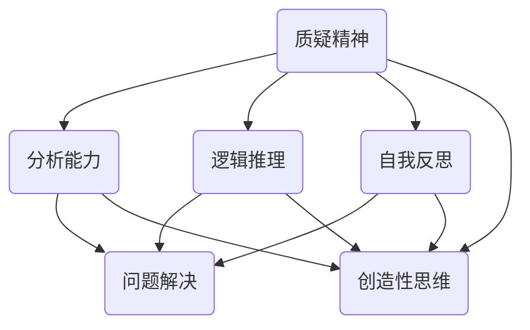

                 

### 引言

批判性思维，作为一种高度理性和逻辑化的思考方式，对个人成长和团队协作至关重要。在信息技术和软件开发领域，批判性思维不仅有助于提升项目质量，还能够解决复杂问题、优化设计方案和提升团队创新能力。本文旨在探讨如何培养团队的批判性思维，从背景介绍、核心概念、算法原理、系统架构设计、项目实战等多个方面展开，旨在为团队领导者、软件开发人员和IT从业人员提供有价值的参考和指导。

本文将按照以下结构进行阐述：

1. **批判性思维的背景与重要性**：介绍批判性思维的定义、历史与发展，探讨其在团队工作中的重要性。
2. **批判性思维的核心概念**：解释批判性思维的关键要素，分析其与其他思维方式的区别和关联。
3. **批判性思维的基本原理**：阐述批判性思维的过程模型、数学模型及其应用。
4. **批判性思维的实践应用**：讨论批判性思维在团队沟通、决策和创新中的应用。
5. **批判性思维的培养与提升**：提供批判性思维的培养方法和提升策略。

通过以上五个部分，我们将逐步深入理解批判性思维的内涵和培养方法，以期帮助团队在信息技术和软件开发领域取得更大成就。

### 批判性思维的背景与重要性

批判性思维作为一个重要的哲学概念，其历史可以追溯到古希腊时期。苏格拉底被认为是批判性思维的奠基者，他的“苏格拉底式对话”方法，通过提问和质疑，引导人们深入思考，从而发现真理。随着时间的推移，批判性思维逐渐发展成为一门独立的学科，并在各个领域得到广泛应用。

在信息技术和软件开发领域，批判性思维的重要性不言而喻。首先，软件项目的复杂性和不确定性要求团队成员具备高度的分析和推理能力，以便在项目开发过程中识别潜在的问题并做出合理的决策。其次，批判性思维能够促进团队内部的沟通和协作，通过开放和诚实的讨论，团队成员可以共同探讨解决方案，从而提升项目的质量和效率。最后，批判性思维有助于创新，它鼓励团队成员质疑现有方法，寻找改进的空间，从而推动技术的进步和突破。

具体来说，批判性思维在团队工作中的重要性体现在以下几个方面：

1. **问题解决能力**：面对复杂的项目挑战，团队成员需要运用批判性思维来分析问题、提出假设并验证解决方案。通过质疑和反思，团队成员可以识别问题背后的根本原因，从而制定更有效的解决方案。

2. **决策优化**：在项目管理和决策过程中，批判性思维能够帮助团队成员评估各种选择的风险和收益，从而做出更明智的决策。批判性思维还能够减少群体思维的影响，确保团队成员在决策过程中保持客观和理性。

3. **团队协作**：批判性思维鼓励团队成员进行开放和诚实的讨论，这有助于团队成员更好地理解彼此的观点和立场，从而建立良好的沟通和协作关系。通过批判性思维的实践，团队成员可以共同探讨和解决项目中的难题，提升团队的整体表现。

4. **创新能力**：批判性思维鼓励团队成员质疑现有技术和方法，寻找创新的机会。通过批判性思维，团队成员可以挑战传统观念，提出新的解决方案，从而推动技术的进步和团队的成长。

综上所述，批判性思维在信息技术和软件开发领域具有不可替代的重要性。它不仅有助于提升个人和团队的能力，还能够推动项目的成功和创新。因此，培养团队的批判性思维是一项重要的战略任务，值得团队领导者和管理者的高度关注。

### 批判性思维的核心概念

批判性思维的核心概念是理解其基本要素和属性特征，以及与其他思维方式的区别。批判性思维不仅仅是一种提问和反思的能力，它涉及一系列多维度的思考方式和行为模式。

首先，批判性思维的关键要素包括质疑精神、分析能力、逻辑推理和自我反思。质疑精神是指不断对现有信息和观点提出疑问，避免盲目接受。分析能力是指将复杂问题分解成若干部分，以便更好地理解问题本质。逻辑推理是指通过合理的逻辑步骤，从已知信息推导出结论。自我反思是指对自身思维过程和结果进行审视，以便不断改进和提高。

接下来，让我们来对比批判性思维与创造性思维、线性思维和直观思维的区别：

1. **批判性思维 vs 创造性思维**：

   - **共同点**：两者都强调思维的多维度和深度，追求真理和解决方案。
   - **不同点**：批判性思维更注重分析和质疑，强调对现有知识和方法的批判和反思；而创造性思维则更注重创新和发现，通过发散性思考探索新的可能性。

2. **批判性思维 vs 线性思维**：

   - **共同点**：两者都遵循逻辑规则，从已知信息推导出结论。
   - **不同点**：线性思维通常遵循顺序和步骤，按部就班地解决问题；而批判性思维则更加灵活，可以在不同阶段提出质疑和反思，不断调整思路。

3. **批判性思维 vs 直观思维**：

   - **共同点**：两者都关注问题的本质，试图理解和解决问题。
   - **不同点**：直观思维更多依赖于直觉和经验，而批判性思维则强调逻辑分析和推理，通过系统性思考来解决问题。

此外，批判性思维与创造性思维之间存在着密切的联系。创造性思维提供了新观点和解决方案，而批判性思维则通过质疑和反思，验证这些新观点的可行性和有效性。在团队工作中，批判性思维和创造性思维相互补充，共同推动项目的进展和创新。

为了更好地理解批判性思维的概念，我们可以借助ER实体关系图来展示其核心要素之间的关系。在ER图中，批判性思维的关键要素（质疑精神、分析能力、逻辑推理和自我反思）可以被视为实体，它们之间通过关系（如影响、依赖等）相互关联。

通过这个ER图，我们可以清晰地看到批判性思维的核心要素及其相互关系，这有助于我们更好地理解和应用批判性思维。

总之，批判性思维的核心概念包括质疑精神、分析能力、逻辑推理和自我反思，它与创造性思维、线性思维和直观思维有着不同的特点和关系。理解这些核心概念，对于培养和提高批判性思维具有重要意义。

### 批判性思维的基本原理

批判性思维的基本原理是理解和应用批判性思维的方法和策略，以提高分析和解决问题的能力。以下是批判性思维的基本原理，包括过程模型、数学模型以及具体的实例说明。

#### 过程模型

批判性思维的过程模型通常包括以下几个阶段：

1. **识别问题**：首先，要明确问题的本质和范围。这一步骤要求我们具备敏锐的观察力和分析能力，能够从复杂的信息中提取关键问题。

2. **提出假设**：在明确问题之后，我们需要提出可能的解决方案或假设。这一步骤需要我们具备创新和想象能力，从而为问题提供多种可能的解决方案。

3. **评估假设**：对提出的假设进行评估，分析其合理性、可行性和有效性。这一步骤要求我们具备逻辑推理和分析能力，通过数据、证据和逻辑论证来评估假设。

4. **验证假设**：在评估假设的基础上，通过实验、测试或实际应用来验证假设的正确性。这一步骤需要我们具备实践能力和问题解决能力，确保假设能够真正解决实际问题。

5. **反思和调整**：最后，对整个思维过程和结果进行反思和调整，总结经验教训，为下一次问题解决提供指导。

#### 数学模型

批判性思维的数学模型通常涉及逻辑推理和概率分析。以下是几个常见的数学模型：

1. **逻辑推理**：
   - **条件推理**：如果A发生，则B也发生。这可以表示为“A → B”。通过逻辑推理，我们可以从A的存在推导出B的存在。
   - **逆否推理**：如果非B发生，则非A也发生。这可以表示为“¬B → ¬A”。逆否推理是条件推理的逆命题，用于在相反的方向上推导结论。

2. **概率分析**：
   - **贝叶斯定理**：贝叶斯定理用于计算在已知某个事件发生的条件下，另一个事件发生的概率。其公式为：
     $$ P(A|B) = \frac{P(B|A)P(A)}{P(B)} $$
     其中，\( P(A|B) \) 是在B发生的条件下A发生的概率，\( P(B|A) \) 是在A发生的条件下B发生的概率，\( P(A) \) 是A发生的概率，\( P(B) \) 是B发生的概率。

3. **假设检验**：
   - **假设检验模型**：在统计学中，假设检验用于评估一个假设的真伪。常见的假设检验方法包括t检验、卡方检验等，通过这些方法，我们可以根据数据对假设进行统计验证。

#### 实例说明

为了更好地理解批判性思维的基本原理，我们可以通过一个实际案例来进行详细说明。

假设一个软件开发团队正在开发一个在线购物平台，他们需要确保用户数据的隐私和安全。以下是一个典型的批判性思维过程：

1. **识别问题**：团队识别到用户数据在传输和存储过程中可能存在安全隐患。

2. **提出假设**：团队提出了多个假设来解决这一问题，包括使用HTTPS协议、数据加密和定期安全审计。

3. **评估假设**：
   - **条件推理**：如果使用HTTPS协议，则用户数据在传输过程中的安全性会得到提升。
   - **概率分析**：通过历史数据，团队评估了使用数据加密和定期安全审计的有效性，得出这些方法可以显著降低数据泄露的概率。

4. **验证假设**：团队通过实际测试和模拟攻击，验证了HTTPS协议、数据加密和定期安全审计的有效性。

5. **反思和调整**：团队总结了经验教训，决定在未来增加多因素认证和使用更先进的数据加密技术。

通过这个案例，我们可以看到批判性思维的基本原理在实际应用中的体现。通过识别问题、提出假设、评估假设、验证假设和反思调整，团队成功地解决了用户数据隐私和安全的问题。

总之，批判性思维的基本原理包括过程模型和数学模型，这些原理为我们提供了一个系统的思考框架，使我们能够更好地分析和解决复杂问题。

### 批判性思维在团队沟通中的应用

批判性思维在团队沟通中的应用是提升团队协作效率和项目成功的关键因素。通过批判性思维，团队成员能够更有效地交流思想、分析和解决问题，从而减少误解和冲突，提高决策的质量和速度。

#### 批判性沟通的原则

1. **开放性**：团队成员在沟通时应保持开放的心态，鼓励不同的观点和意见，避免过早下结论或偏袒某一立场。

2. **诚实性**：诚实是批判性沟通的基础，团队成员应诚实地表达自己的看法和担忧，不掩饰或夸大事实。

3. **尊重差异**：团队中的每个成员都有独特的经验和视角，尊重这些差异有助于激发创新和创意，促进深度讨论。

4. **逻辑性**：批判性沟通要求团队成员在表达观点时使用逻辑和证据来支持，避免基于主观感受或情绪的讨论。

#### 批判性沟通在会议中的应用

在团队会议中，批判性沟通的应用主要体现在以下几个方面：

1. **议题设定**：会议前明确议题和目标，确保每个成员都了解讨论的重点。

2. **积极聆听**：在讨论过程中，团队成员应积极倾听他人的观点，不打断对方发言，确保每个声音都能被听到。

3. **提问与反馈**：团队成员应勇于提问和提出反馈，通过质疑和讨论来深入理解问题，探索解决方案。

4. **记录与总结**：会议结束后，及时记录讨论结果和决定事项，并总结讨论的要点和收获。

#### 案例分析

以下是一个团队在项目会议中使用批判性思维的案例：

在一次项目进度评审会议上，团队成员A提出项目进度落后，需要调整计划。团队成员B则认为，问题的根源在于技术难度超出了预期，并提出需要增加开发时间。以下是批判性沟通的应用：

1. **开放性**：团队成员C首先表示开放态度，询问A和B的具体问题和意见。

2. **诚实性**：A和B分别诚实地分享了他们的担忧和观点，没有隐瞒或夸大问题。

3. **尊重差异**：团队成员D提出了第三种观点，认为项目进度落后可能是因为沟通不畅和任务分配不均。

4. **逻辑性**：团队成员E使用逻辑和证据支持他的观点，指出项目进度落后不仅与技术难度有关，还与任务优先级安排和团队成员的工作效率有关。

通过这一案例，我们可以看到批判性思维在团队沟通中的应用，团队成员通过开放性、诚实性、尊重差异和逻辑性的沟通，成功找到了问题的根本原因，并提出了多个解决方案。

总之，批判性思维在团队沟通中的应用，有助于提高团队协作效率和决策质量。通过遵循批判性沟通的原则，团队成员可以在会议中更有效地交流思想、分析和解决问题，从而推动项目的顺利进展。

### 批判性思维在团队决策中的应用

批判性思维在团队决策中的应用至关重要，它不仅能提高决策的质量，还能减少错误决策带来的风险。通过批判性思维，团队成员能够在复杂的环境中识别潜在问题、评估各种方案，并做出更加明智的决策。

#### 批判性思维在决策中的作用

1. **问题识别**：批判性思维可以帮助团队识别问题，特别是在面对复杂、模糊和不确定的情况时，通过质疑和反思，团队成员能够深入理解问题的本质，从而更准确地界定问题。

2. **方案评估**：批判性思维鼓励团队成员对各种方案进行全面的评估。通过逻辑推理和证据分析，团队成员能够评估每个方案的优点和缺点，权衡各种因素，从而选择最优的决策方案。

3. **风险识别**：在决策过程中，批判性思维能够帮助团队识别潜在的风险和挑战。通过分析和预测可能出现的负面情况，团队成员可以制定应对策略，减少决策失误带来的负面影响。

4. **决策优化**：批判性思维不仅关注当前的问题和方案，还关注未来可能的变化和不确定性。通过持续反思和调整，团队成员能够在决策过程中不断优化方案，确保决策的长期有效性和适应性。

#### 决策过程中的批判性思维策略

1. **五步决策法**：
   - **识别问题**：明确需要解决的问题或目标。
   - **收集信息**：搜集与问题相关的所有信息，包括数据、意见和观点。
   - **评估方案**：列出所有可能的解决方案，并对其优缺点进行评估。
   - **选择方案**：根据评估结果，选择最佳的解决方案。
   - **执行和监控**：执行决策，并对结果进行监控和评估。

2. **SWOT分析**：
   - **优势（Strengths）**：分析团队和方案的优点和资源。
   - **劣势（Weaknesses）**：识别团队和方案的不足和限制。
   - **机会（Opportunities）**：探讨外部环境中的有利条件和趋势。
   - **威胁（Threats）**：分析外部环境中的潜在风险和挑战。

3. **头脑风暴**：
   - **开放式讨论**：鼓励团队成员自由提出各种可能的解决方案，无论是否可行。
   - **评价和筛选**：对提出的方案进行评价和筛选，选择最有潜力的方案进行进一步分析。

#### 案例分析

以下是一个团队在项目决策中使用批判性思维的案例：

在一次重大项目决策中，一个软件开发团队需要决定是否采用一种新的技术框架来提升项目开发效率。以下是批判性思维的应用：

1. **识别问题**：团队首先明确了当前项目开发效率较低，需要寻找解决方案。

2. **收集信息**：
   - **团队成员A**：通过市场调研，了解到新技术框架的优点和适用场景。
   - **团队成员B**：分析了新技术框架可能带来的风险和挑战。
   - **团队成员C**：提出了现有技术的优点，并探讨新技术对团队的适应性问题。

3. **评估方案**：
   - **SWOT分析**：
     - **优势**：新技术框架具有高效、可扩展等特点，有助于提升项目开发效率。
     - **劣势**：需要团队成员学习新技术，可能增加项目初期的工作量。
     - **机会**：随着项目规模的扩大，新技术框架将有助于降低长期开发成本。
     - **威胁**：市场和技术环境的不确定性，可能导致新技术框架不适合团队需求。

4. **选择方案**：
   - 通过讨论，团队成员决定在项目初期采用新技术框架，并制定相应的培训计划，以应对初期的工作量增加。

5. **执行和监控**：
   - 项目实施过程中，团队定期评估新技术框架的应用效果，并根据实际情况进行调整和优化。

通过这个案例，我们可以看到批判性思维在团队决策中的应用，团队通过识别问题、收集信息、评估方案、选择方案和执行监控，成功地解决了项目开发效率低的问题，并制定了有效的决策策略。

总之，批判性思维在团队决策中的应用，有助于提高决策的质量和效率，减少错误决策带来的风险。通过遵循批判性思维的原则和策略，团队成员能够更有效地进行决策，推动项目的成功实施。

### 批判性思维在团队创新中的应用

批判性思维在团队创新中的应用至关重要，它不仅有助于激发团队成员的创造力，还能确保创新成果的可行性和实用性。通过批判性思维，团队能够系统地评估和改进创新过程，从而推动技术进步和团队成长。

#### 批判性思维与创新的关系

批判性思维与创新之间存在密切的互动关系。创新通常涉及探索新的想法和方法，而批判性思维则通过质疑、分析和验证，确保这些新想法具有实际价值和可行性。具体来说，批判性思维在创新过程中发挥以下作用：

1. **激发新想法**：批判性思维鼓励团队成员质疑现有技术和方法，寻找改进和创新的机会。通过不断提出问题和挑战，团队能够激发新的想法和创意。

2. **评估创新性**：批判性思维帮助团队成员评估新想法的可行性和潜在风险。通过对新想法进行深入分析和验证，团队能够识别和解决潜在问题，确保创新具有实际应用价值。

3. **改进和完善**：批判性思维在创新过程中扮演“质检员”的角色，通过对新方案进行持续评估和改进，团队能够不断优化创新成果，提升其质量和实用性。

#### 创新过程中的批判性思维方法

1. **五步创新法**：
   - **识别需求**：明确团队和用户的需求，识别创新的机会。
   - **生成创意**：通过头脑风暴、思维导图等方法，生成多个创新性想法。
   - **筛选和评估**：使用批判性思维方法，对创意进行筛选和评估，选择最具潜力的方案。
   - **实现和测试**：将选定的创意转化为实际产品或服务，并进行测试和验证。
   - **优化和推广**：根据测试结果，对创新成果进行优化，并推广至市场。

2. **设计思维**：
   - **同理心**：深入了解用户的需求和痛点，站在用户的角度思考问题。
   - **定义问题**：明确创新的目标和问题，确保创新方案能够解决实际需求。
   - **生成创意**：通过头脑风暴和用户反馈，生成多个创意解决方案。
   - **原型制作**：制作初步的原型，进行用户测试和反馈。
   - **迭代优化**：根据用户反馈，不断优化原型，直至达到用户满意。

#### 案例分析

以下是一个团队在项目创新中运用批判性思维的案例：

一个软件开发团队正在开发一款智能家居控制系统，旨在提高用户的便利性和家居安全性。以下是批判性思维在创新过程中的应用：

1. **识别需求**：
   - **用户调研**：团队通过问卷调查和用户访谈，了解到用户对智能家居的需求主要集中在远程控制、自动化和安全性。

2. **生成创意**：
   - **头脑风暴**：团队成员提出了多个创意，包括智能门锁、智能灯光控制、智能温控系统等。

3. **筛选和评估**：
   - **SWOT分析**：对每个创意进行评估，分析其优势、劣势、机会和威胁，选择最具潜力的创意进行深入开发。

4. **实现和测试**：
   - **原型制作**：团队制作了智能门锁和智能灯光控制的初步原型，并进行用户测试和反馈。

5. **迭代优化**：
   - 根据用户反馈，团队对智能门锁和智能灯光控制的原型进行了多次优化，最终用户满意度显著提升。

通过这个案例，我们可以看到批判性思维在团队创新中的应用，团队通过识别需求、生成创意、筛选和评估、实现和测试以及迭代优化，成功地开发出了用户满意的产品。

总之，批判性思维在团队创新中的应用，有助于激发创新潜力、确保创新成果的可行性和实用性。通过遵循批判性思维的方法，团队能够更有效地推动创新，实现技术和市场的突破。

### 批判性思维的培养方法

批判性思维的培养是一个系统性的过程，需要从个人和团队两个层面进行持续的努力和练习。以下将详细讨论个人批判性思维的培养方法和团队批判性思维的培养策略，并分析如何创建一个批判性思维的团队环境。

#### 个人批判性思维的培养方法

1. **自我反思**：自我反思是培养批判性思维的重要方法。通过定期反思自己的思维过程和决策，个人可以发现思维中的盲点和偏差，从而进行修正和提高。

2. **阅读和研究**：广泛阅读和深入研究能够拓展个人的知识面和视野，帮助个人从不同的角度看待问题，培养批判性思维能力。

3. **提问和质疑**：在面对信息和观点时，个人应学会提问和质疑，不轻易接受表面信息，通过深入思考和逻辑分析，挖掘信息的真实性和价值。

4. **学习和应用批判性思维工具**：批判性思维工具，如五步决策法、SWOT分析、设计思维等，可以帮助个人更系统地分析和解决问题。

5. **参与讨论和辩论**：通过参与讨论和辩论，个人可以锻炼自己的逻辑思维和表达能力，培养批判性思维的实践能力。

#### 团队批判性思维的培养策略

1. **建立开放和诚实的沟通环境**：团队应鼓励成员开放和诚实地表达自己的观点和疑问，建立基于事实和逻辑的讨论文化。

2. **定期培训和研讨**：团队可以定期组织批判性思维的培训和研讨，帮助成员学习和应用批判性思维的方法和工具。

3. **跨职能团队协作**：通过跨职能团队协作，团队成员可以从不同的角度和视角看待问题，促进批判性思维的碰撞和融合。

4. **鼓励多样化的观点**：团队应尊重和鼓励多样化的观点，避免群体思维的影响，通过不同观点的碰撞，激发批判性思维。

5. **实施反馈和评估机制**：团队可以建立反馈和评估机制，定期对团队成员的批判性思维进行评估和反馈，帮助成员不断改进和提高。

#### 创建批判性思维的团队环境

1. **明确价值观**：团队应明确批判性思维的重要性，将其纳入团队价值观中，确保每个成员都认识到批判性思维的价值。

2. **树立榜样**：团队领导者应通过自己的行为树立榜样，积极展示批判性思维的过程和方法，激励团队成员跟随和模仿。

3. **鼓励创新和尝试**：团队应鼓励成员勇于尝试新的想法和方法，即使这些想法在初期可能存在缺陷，也应该给予支持和反馈，鼓励持续改进。

4. **建立学习机制**：团队可以建立持续学习的机制，通过内部培训和外部学习资源，不断提升团队整体的批判性思维水平。

5. **定期评估和调整**：团队应定期评估批判性思维的培养效果，根据实际情况调整培养策略和方法，确保批判性思维的培养能够持续、有效地进行。

总之，批判性思维的培养需要个人和团队的共同努力。通过个人自我反思、阅读研究、提问质疑，以及团队建立开放沟通环境、定期培训和研讨、跨职能协作、鼓励多样化观点、实施反馈和评估机制，团队可以创建一个充满批判性思维的氛围，从而提升整体创新能力，实现团队目标。

### 批判性思维的提升与实践

批判性思维的提升和实践是确保团队持续进步和创新能力的重要环节。通过系统性的训练和实际操作，团队成员可以不断深化批判性思维能力，并将其应用于具体的项目和问题中。以下将介绍提升批判性思维的策略、实践技巧和案例分析，以及如何将这些技巧应用于实际工作。

#### 提升批判性思维的策略

1. **持续学习与反思**：
   - **参加相关课程和研讨会**：通过参加批判性思维的专项课程和研讨会，团队成员可以系统地学习批判性思维的理论和方法。
   - **定期自我反思**：团队成员应定期回顾自己的思维过程和决策，识别思维中的盲点和偏差，通过反思和总结来提升批判性思维。

2. **多样化训练**：
   - **思维导图训练**：通过绘制思维导图，帮助团队成员梳理思路，提高逻辑性和系统性。
   - **辩论与讨论**：定期组织团队内的辩论和讨论活动，锻炼成员的表达能力和逻辑推理能力。

3. **案例分析**：
   - **历史案例分析**：通过分析历史案例，团队成员可以学习不同情境下的批判性思维应用，了解批判性思维在实际问题解决中的重要性。

4. **工具与方法的应用**：
   - **SWOT分析**：通过SWOT分析，团队成员可以全面评估项目的优点、劣势、机会和威胁，确保决策的全面性和科学性。
   - **五步决策法**：使用五步决策法，帮助团队成员系统化地分析和解决问题，提高决策效率和质量。

#### 实践技巧

1. **问题识别**：
   - **主动提问**：在面对问题时，团队成员应主动提问，深入理解问题的本质，避免表面化的处理。
   - **分析信息**：通过多角度分析问题相关的信息，识别问题的根本原因，确保解决方案的有效性。

2. **假设评估**：
   - **逻辑推理**：使用逻辑推理来评估假设的合理性和可行性，确保假设基于充分的事实和证据。
   - **证据支持**：通过数据和事实来支持假设，避免主观臆断和情感化决策。

3. **方案优化**：
   - **多方案比较**：在制定解决方案时，应考虑多种可能性，通过比较和评估选择最优方案。
   - **持续改进**：在方案实施过程中，持续监控和评估效果，根据实际情况进行调整和优化。

#### 案例分析

以下是一个团队在实际项目中提升批判性思维的案例：

一个软件开发团队在开发一款企业管理系统时，遇到了用户反馈功能不稳定的问题。以下是批判性思维在问题解决中的应用：

1. **问题识别**：
   - **用户反馈**：团队通过用户反馈识别出功能不稳定的问题。
   - **信息分析**：通过分析用户反馈和系统日志，团队确定了问题的具体表现和影响范围。

2. **假设评估**：
   - **逻辑推理**：团队假设问题可能是由于数据库连接不稳定导致的。
   - **证据支持**：通过检查数据库连接日志，团队找到了连接超时的记录，支持了假设。

3. **方案优化**：
   - **多方案比较**：团队提出了两个解决方案：增加数据库连接超时时间和优化数据库查询。
   - **实施与监控**：团队选择了优化数据库查询的方案，并在测试环境中实施。通过监控系统性能，团队发现优化方案有效解决了问题。

4. **持续改进**：
   - **效果评估**：团队对优化方案的效果进行了评估，发现用户反馈功能稳定度显著提升。
   - **反馈与调整**：根据用户反馈，团队继续对系统进行优化，确保功能稳定且用户满意。

通过这个案例，我们可以看到批判性思维在项目问题解决中的应用，团队通过问题识别、假设评估、方案优化和持续改进，成功解决了功能不稳定的问题。

#### 实际应用

1. **项目管理**：
   - **决策优化**：在项目规划和管理过程中，团队应运用批判性思维进行决策，确保项目目标明确、资源合理分配。

2. **技术发展**：
   - **创新驱动**：团队应通过批判性思维，不断质疑现有技术，寻找创新机会，推动技术进步。

3. **团队协作**：
   - **沟通协作**：通过批判性思维，团队成员可以更有效地沟通和协作，共同解决问题，提升团队整体能力。

总之，批判性思维的提升和实践是团队持续进步和创新能力的重要保障。通过系统性的训练和实际操作，团队成员可以不断提升批判性思维能力，并将其应用于实际工作中，实现项目成功和团队成长。

### 批判性思维的总结与展望

批判性思维在信息技术和软件开发领域的重要性不言而喻。通过批判性思维，团队成员能够更有效地识别问题、评估方案、做出决策和推动创新，从而提升项目的质量和效率。本文从批判性思维的背景与重要性、核心概念、基本原理、实践应用、培养方法、提升策略等方面进行了详细探讨。

#### 批判性思维的重要性回顾

批判性思维不仅是个人成长的必备能力，也是团队协作和项目成功的关键因素。在信息技术和软件开发领域，批判性思维可以帮助团队在面对复杂问题时保持理性和客观，通过系统性的分析和逻辑推理，找到问题的根本原因并制定有效的解决方案。此外，批判性思维还能够促进团队内部的沟通和协作，减少误解和冲突，提升团队的决策质量和执行力。

#### 未来批判性思维的发展趋势

随着人工智能和大数据技术的迅猛发展，批判性思维的应用范围将更加广泛。未来的批判性思维将更加智能化和自动化，通过结合人工智能技术，实现对海量数据的深度分析和智能决策。此外，随着全球化和数字化进程的加快，批判性思维将更加注重跨文化沟通和国际合作，培养具有全球视野和多元化思维的批判性人才。

#### 小结

本文通过系统性的阐述，展示了批判性思维在信息技术和软件开发领域的重要性及其具体应用方法。批判性思维不仅能够提升个人和团队的能力，还能够推动整个行业的创新和发展。未来，我们应该继续关注和培养批判性思维，将其作为信息技术和软件开发的核心竞争力。

#### 拓展阅读

- [1] 《批判性思维：思考挑战与机会》
- [2] 《人工智能与批判性思维》
- [3] 《软件开发中的批判性思维》
- [4] 《跨文化沟通中的批判性思维》

通过拓展阅读，读者可以更深入地了解批判性思维的理论和实践，进一步丰富和提升自己的批判性思维能力。

### 作者信息

**作者：AI天才研究院/AI Genius Institute & 禅与计算机程序设计艺术 /Zen And The Art of Computer Programming**

AI天才研究院专注于人工智能和软件开发领域的前沿研究和应用，致力于培养具有创新能力和批判性思维的顶尖人才。同时，作者所著的《禅与计算机程序设计艺术》一书，深入探讨了软件开发中的哲学和思维方法，对读者提升编程和思维能力具有极高的参考价值。通过本文，希望读者能够更好地理解和应用批判性思维，为信息技术和软件开发领域的进步贡献自己的力量。

