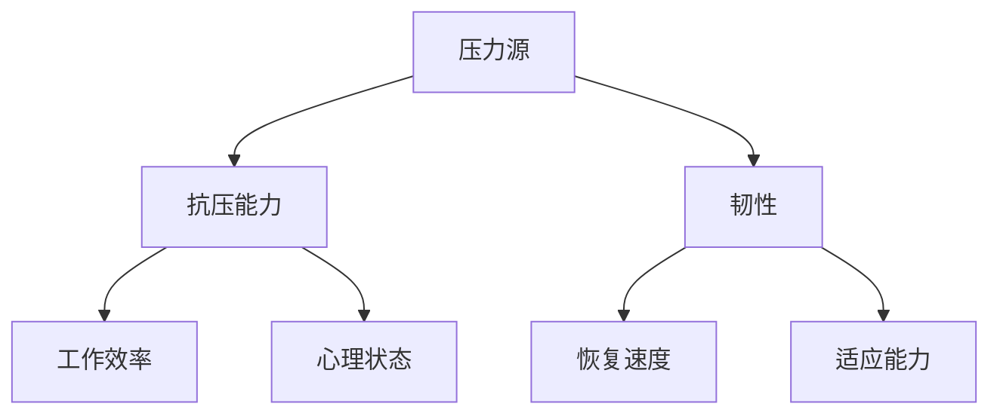

                 

# 如何培养团队的抗压能力和韧性

关键词：团队抗压能力、韧性、心理支持、目标设定、持续学习

摘要：本文将从团队抗压能力和韧性的核心概念出发，分析其在现代工作环境中的重要性。通过详细的策略和实践案例，探讨如何有效培养团队的抗压能力和韧性，以提高团队的整体表现和组织的竞争力。

## 目录大纲

1. 第一部分：问题背景与核心概念
   1.1 问题背景
   1.2 核心概念
   1.3 概念结构与核心要素组成
   1.4 边界与外延
   1.5 本章小结

2. 第二部分：培养团队抗压能力的策略
   2.1 建立有效的沟通机制
   2.2 提供必要的心理支持
   2.3 建立团队目标与愿景
   2.4 培养积极的工作氛围
   2.5 提供持续的学习机会
   2.6 增强团队凝聚力
   2.7 本章小结

3. 第三部分：培养团队韧性的策略
   3.1 培养应对挫折的能力
   3.2 增强团队适应变化的能力
   3.3 建立团队支持系统
   3.4 培养团队创新精神
   3.5 提升团队心理韧性
   3.6 本章小结

4. 第四部分：案例分析与实践
   4.1 案例一：企业A的抗压能力培养实践
   4.2 案例二：企业B的韧性培养实践
   4.3 案例三：跨行业团队抗压韧性培养
   4.4 案例分析小结

5. 第五部分：综合策略与实践
   5.1 综合策略概述
   5.2 综合策略的框架与实施步骤
   5.3 本章小结

## 第一部分：问题背景与核心概念

### 1.1 问题背景

在现代工作环境中，压力已经成为影响员工工作效率和团队表现的重要因素。根据国际劳工组织（ILO）的一项研究，全球约有70%的员工感到工作压力。这种压力不仅来源于工作量和工作难度，还包括组织内部的管理方式、工作环境以及个人职业发展等多方面因素。

#### 1.1.1 当前工作环境下的压力现状

随着技术的飞速发展和市场竞争的加剧，现代工作环境对员工的要求越来越高。团队成员常常面临以下几种压力：

- **工作量增加**：随着业务需求的不断变化，团队成员需要处理更多的工作任务，导致工作压力增加。
- **工作难度提高**：新技术和新方法的不断引入，要求团队成员具备更高的技能和知识，增加了学习和适应的难度。
- **工作环境变化**：远程工作、跨文化团队等新兴工作模式，给团队成员带来了新的挑战，需要适应不同的工作环境和文化。
- **职业发展压力**：个人职业目标的实现与组织的期望之间存在差距，导致团队成员感到焦虑和压力。

#### 1.1.2 团队抗压能力和韧性对组织的重要性

团队抗压能力是指团队在面对压力和挑战时，能够保持高效工作和积极心态的能力。团队韧性则是指团队在面对挫折和不确定性时，能够迅速恢复和适应的能力。

- **提高工作效率**：抗压能力强的团队能够更好地应对工作压力，保持较高的工作效率和产出。
- **提升团队士气**：团队韧性强的团队在面对挫折和困难时，能够保持积极的心态，提高团队的士气和凝聚力。
- **增强创新能力**：团队在面对压力和挑战时，往往能够激发出更多的创新思维和解决方案，提高组织的创新能力。

#### 1.1.3 团队抗压能力与韧性的区别与联系

- **区别**：
  - 抗压能力主要关注团队在面对压力时的应对能力和心理状态。
  - 韧性则更侧重于团队在面对挫折和不确定性时的恢复和适应能力。

- **联系**：
  - 抗压能力是韧性的一部分，只有具备良好的抗压能力，团队才可能在面对挫折和不确定性时展现出韧性。
  - 韧性则是抗压能力的发展，是团队在面对长期和持续压力时的重要保障。

### 1.2 核心概念

#### 1.2.1 压力的定义与来源

压力是指个体在应对外界要求或挑战时所感受到的身心紧张状态。压力的来源主要包括以下几个方面：

- **工作任务**：工作量和工作难度增加，导致团队成员需要投入更多的时间和精力。
- **人际关系**：团队内部或团队之间的沟通不畅，导致团队成员感到压力。
- **职业发展**：个人职业目标的实现与组织的期望之间存在差距，导致团队成员感到焦虑和压力。

#### 1.2.2 抗压能力与韧性的含义

- **抗压能力**：团队在面对压力和挑战时，能够保持高效工作和积极心态的能力。
- **韧性**：团队在面对挫折和不确定性时，能够迅速恢复和适应的能力。

#### 1.2.3 团队抗压能力和韧性的评价指标

- **抗压能力评价指标**：
  - **工作效率**：团队在压力环境下的工作产出和效率。
  - **心理状态**：团队成员在压力环境下的情绪状态和心理反应。

- **韧性评价指标**：
  - **恢复速度**：团队在遭遇挫折后的恢复速度和适应能力。
  - **适应能力**：团队在面对不确定性和变化时的适应能力和应对策略。

### 1.3 概念结构与核心要素组成

#### 1.3.1 抗压能力与韧性概念结构图

#### 1.3.2 团队抗压能力和韧性核心要素对比表格

| 要素         | 抗压能力                   | 韧性                   |
| ------------ | -------------------------- | ---------------------- |
| 定义         | 面对压力时保持高效工作和积极心态的能力 | 面对挫折和不确定性时迅速恢复和适应的能力 |
| 评价指标      | 工作效率和心理状态           | 恢复速度和适应能力       |
| 关键特征      | 高效率、积极心态             | 快速恢复、适应性强       |
| 影响因素      | 压力源、团队支持、个人心态     | 挫折类型、团队支持、环境变化 |

### 1.4 边界与外延

#### 1.4.1 团队抗压能力与韧性在不同行业中的表现

- **IT行业**：IT行业竞争激烈，工作压力大，团队成员需要具备较高的抗压能力和韧性。
- **金融行业**：金融行业的波动性大，团队成员需要具备较强的抗压能力和韧性，以应对市场变化。
- **制造业**：制造业工作强度大，环境变化较多，团队成员需要具备较强的抗压能力和韧性。

#### 1.4.2 团队抗压能力与韧性与其他组织管理因素的关系

- **领导力**：领导者的领导风格和管理能力对团队的抗压能力和韧性有重要影响。
- **组织文化**：积极的组织文化和良好的团队氛围有助于提升团队的抗压能力和韧性。
- **人力资源政策**：合理的人力资源政策和员工福利制度有助于提升团队的抗压能力和韧性。

### 1.5 本章小结

本部分对团队抗压能力和韧性进行了背景介绍和核心概念的阐述，分析了其在现代工作环境中的重要性。通过对概念结构的分析，我们了解了抗压能力和韧性的定义、评价指标以及与其他组织管理因素的关系。这些内容为后续章节提供了理论基础。

----------------------------------------------------------------

## 第二部分：培养团队抗压能力的策略

在了解了团队抗压能力的重要性后，我们需要探讨如何具体培养团队的抗压能力。本部分将从以下几个方面进行详细阐述：

### 2.1 建立有效的沟通机制

#### 2.1.1 开放式沟通的重要性

开放式沟通是指团队成员之间能够自由地表达想法和意见，形成良好的沟通渠道。开放式沟通的重要性体现在以下几个方面：

- **增强团队凝聚力**：通过开放式沟通，团队成员能够更好地了解彼此，建立信任，增强团队的凝聚力。
- **提高问题解决效率**：开放式沟通有助于团队成员及时发现和解决问题，提高团队的工作效率。
- **减少误解和冲突**：通过开放式沟通，团队成员能够更好地理解彼此的意图，减少误解和冲突。

#### 2.1.2 如何构建高效的沟通渠道

为了建立高效的沟通渠道，组织可以采取以下措施：

- **设立定期会议**：组织可以设立定期会议，如周会、月会等，让团队成员有固定的沟通时间和机会。
- **使用现代沟通工具**：利用即时通讯工具、视频会议等现代沟通工具，方便团队成员随时进行沟通。
- **建立反馈机制**：鼓励团队成员在沟通中提出反馈和建议，让沟通更加有效和有针对性。

#### 2.1.3 避免沟通障碍的策略

为了避免沟通障碍，组织可以采取以下策略：

- **明确沟通目标**：每次沟通前，明确沟通的目标和目的，让沟通更有针对性。
- **倾听与表达**：鼓励团队成员倾听他人意见，并清晰表达自己的观点。
- **避免打断**：在沟通过程中，避免打断他人，尊重他人的发言权。

### 2.2 提供必要的心理支持

#### 2.2.1 心理支持的重要性

心理支持是指为团队成员提供心理上的帮助和支持，以应对工作中的压力和挑战。心理支持的重要性体现在以下几个方面：

- **减轻压力**：心理支持可以帮助团队成员减轻工作压力，保持良好的心理状态。
- **提高工作效率**：心理健康良好的团队成员能够更专注于工作，提高工作效率。
- **提升团队士气**：心理支持有助于提升团队的士气，增强团队的凝聚力。

#### 2.2.2 如何为团队成员提供心理支持

为了为团队成员提供有效的心理支持，组织可以采取以下措施：

- **设立心理支持热线**：组织可以设立心理支持热线，让团队成员在需要时能够及时获得帮助。
- **开展心理健康培训**：组织可以定期开展心理健康培训，提高团队成员的心理素质。
- **提供心理咨询**：组织可以聘请专业的心理咨询师，为团队成员提供面对面的心理咨询。

#### 2.2.3 心理辅导与心理咨询的区别

心理辅导侧重于帮助团队成员解决具体的问题，如工作压力、人际关系等。而心理咨询则更侧重于帮助团队成员挖掘内心深处的困扰，提升其心理素质。

### 2.3 建立团队目标与愿景

#### 2.3.1 目标设定的重要性

目标设定是指为团队设定具体、明确的目标，以引导团队的工作方向和努力。目标设定的重要性体现在以下几个方面：

- **明确工作方向**：目标设定可以让团队成员明确自己的工作方向，减少工作中的迷茫和困惑。
- **激发工作动力**：明确的目标可以激发团队成员的工作动力，提高团队的积极性。
- **提高工作效率**：明确的目标可以帮助团队成员更有针对性地开展工作，提高工作效率。

#### 2.3.2 如何设定清晰且有挑战性的团队目标

为了设定清晰且有挑战性的团队目标，组织可以采取以下措施：

- **SMART原则**：目标设定应遵循SMART原则，即具体（Specific）、可衡量（Measurable）、可实现（Achievable）、相关（Relevant）和有时限（Time-bound）。
- **集体讨论**：组织可以组织团队成员进行集体讨论，共同制定团队目标，增加目标的共识度。
- **动态调整**：团队目标应根据实际情况进行动态调整，以适应环境变化和团队发展。

#### 2.3.3 团队目标与个人目标的关系

团队目标和个人目标是相互关联的。团队目标的实现需要依赖个人目标的实现，而个人目标的实现又需要团队目标的支撑。因此，在设定团队目标时，应充分考虑个人目标的实现，确保团队和个人目标的统一和协调。

### 2.4 培养积极的工作氛围

#### 2.4.1 积极工作氛围的作用

积极的工作氛围对团队的抗压能力有重要影响。积极工作氛围的作用体现在以下几个方面：

- **提高工作效率**：在积极的工作氛围中，团队成员能够更专注、更高效地工作。
- **增强团队凝聚力**：积极的工作氛围有助于增强团队的凝聚力，提高团队的协作效率。
- **降低离职率**：积极的工作氛围能够提高员工的工作满意度和忠诚度，降低离职率。

#### 2.4.2 如何营造积极的工作氛围

为了营造积极的工作氛围，组织可以采取以下措施：

- **鼓励团队合作**：组织可以鼓励团队合作，提供团队合作的平台和机会。
- **建立公平竞争机制**：组织应建立公平的竞争机制，让团队成员感受到公平和尊重。
- **提供奖励与激励**：组织可以提供奖励与激励，激励团队成员保持积极的工作态度。

#### 2.4.3 处理负面情绪的策略

负面情绪如焦虑、愤怒、沮丧等对团队的抗压能力有负面影响。为了处理负面情绪，组织可以采取以下策略：

- **提供情绪支持**：组织可以提供情绪支持，帮助团队成员缓解负面情绪。
- **开展情绪管理培训**：组织可以开展情绪管理培训，提高团队成员的情绪管理能力。
- **建立反馈机制**：组织可以建立反馈机制，让团队成员能够及时表达负面情绪，并得到有效的处理。

### 2.5 提供持续的学习机会

#### 2.5.1 持续学习的重要性

持续学习是指团队成员在工作中不断学习新知识和技能，以适应不断变化的工作环境。持续学习的重要性体现在以下几个方面：

- **提升个人能力**：持续学习可以提升团队成员的个人能力，提高其在团队中的竞争力。
- **适应工作需求**：持续学习可以帮助团队成员适应工作需求，提高团队的工作效率。
- **促进职业发展**：持续学习可以促进团队成员的职业发展，提高其职业素养和职业竞争力。

#### 2.5.2 如何提供有效的学习机会

为了提供有效的学习机会，组织可以采取以下措施：

- **培训与学习计划**：组织可以制定培训与学习计划，为团队成员提供系统化的学习机会。
- **内部知识分享**：组织可以鼓励内部知识分享，通过内部讲座、研讨会等形式，促进团队成员之间的学习与交流。
- **外部学习资源**：组织可以提供外部学习资源，如在线课程、专业书籍等，帮助团队成员进行自我学习。

#### 2.5.3 学习与抗压能力的关联

学习与抗压能力之间存在密切的关联。持续学习可以帮助团队成员提高应对压力的能力，增强其抗压能力。具体体现在以下几个方面：

- **增强知识储备**：学习可以丰富团队成员的知识储备，提高其在面对压力时的应对策略。
- **提升心理素质**：学习可以提高团队成员的心理素质，增强其面对压力时的心理韧性。
- **提高应对能力**：学习可以提升团队成员的应对能力，使其在面对压力时能够更加从容和自信。

### 2.6 增强团队凝聚力

#### 2.6.1 团队凝聚力的作用

团队凝聚力是指团队成员之间的相互吸引力和协作力。团队凝聚力的作用体现在以下几个方面：

- **提高工作效率**：团队凝聚力强的团队能够更好地协作，提高工作效率和产出。
- **增强团队士气**：团队凝聚力强的团队具有更强的士气和动力，能够更好地应对挑战。
- **降低离职率**：团队凝聚力强的团队成员对组织有更强的归属感，降低离职率。

#### 2.6.2 如何增强团队凝聚力

为了增强团队凝聚力，组织可以采取以下措施：

- **团队建设活动**：组织可以定期开展团队建设活动，如团建旅游、团队拓展等，增强团队成员之间的互动和信任。
- **共同目标**：组织可以为团队设定共同的目标，让团队成员共同努力，增强团队的凝聚力。
- **沟通与反馈**：组织应鼓励团队成员之间的沟通与反馈，促进团队成员之间的理解和信任。

#### 2.6.3 团队凝聚力与抗压能力的关系

团队凝聚力与抗压能力之间存在密切的关系。团队凝聚力强的团队在面对压力时，能够更好地团结一致，共同应对挑战，提高团队的抗压能力。具体体现在以下几个方面：

- **增强应对能力**：团队凝聚力强的团队在面对压力时，能够更好地发挥团队的力量，共同应对挑战。
- **提升团队士气**：团队凝聚力强的团队在面对压力时，能够保持较高的士气，增强团队的抗压能力。
- **促进心理支持**：团队凝聚力强的团队在面对压力时，能够更好地提供心理支持，帮助团队成员缓解压力。

### 2.7 本章小结

本部分详细阐述了培养团队抗压能力的策略，包括建立有效的沟通机制、提供必要的心理支持、建立团队目标与愿景、培养积极的工作氛围、提供持续的学习机会和增强团队凝聚力。这些策略有助于提升团队的抗压能力，提高团队的工作效率和产出。

----------------------------------------------------------------

## 第三部分：培养团队韧性的策略

团队韧性是指团队在面对挫折和不确定性时，能够迅速恢复和适应的能力。培养团队韧性对于提升团队的整体表现和组织的竞争力至关重要。本部分将探讨以下策略：

### 3.1 培养应对挫折的能力

#### 3.1.1 挫折应对的重要性

挫折是团队在发展过程中不可避免的现象。挫折应对能力是指团队在面对挫折时，能够有效地识别、应对和克服挫折的能力。挫折应对能力的重要性体现在以下几个方面：

- **提高团队韧性**：具备良好的挫折应对能力，团队在面对挫折时能够更快地恢复和适应，增强团队的韧性。
- **促进团队成长**：挫折是团队成长的契机。通过有效的挫折应对，团队能够从中吸取经验教训，不断成长和进步。
- **提升团队士气**：良好的挫折应对能力可以提升团队士气，增强团队成员的自信心和积极性。

#### 3.1.2 如何培养团队成员的挫折应对能力

为了培养团队成员的挫折应对能力，组织可以采取以下措施：

- **提供挫折教育**：组织可以开展挫折教育，帮助团队成员认识到挫折的普遍性和不可避免性，学会正确面对挫折。
- **建立挫折应对机制**：组织可以建立挫折应对机制，为团队成员提供及时的心理支持和资源，帮助他们有效应对挫折。
- **案例分享与讨论**：组织可以分享成功应对挫折的案例，鼓励团队成员进行讨论，从中学习和借鉴应对挫折的策略和技巧。

#### 3.1.3 挫折应对策略与技巧

- **积极心态**：培养团队成员积极的心态，面对挫折时保持乐观和自信，勇于面对困难。
- **理性分析**：在挫折发生时，团队成员应学会理性分析，找出问题的根本原因，制定有效的应对策略。
- **寻求支持**：团队成员在遇到挫折时，应及时寻求团队或其他资源支持，共同应对挑战。
- **总结经验**：在应对挫折后，团队成员应总结经验教训，不断提升自己的挫折应对能力。

### 3.2 增强团队适应变化的能力

#### 3.2.1 变化适应的重要性

在当今快速变化的市场环境中，团队适应变化的能力至关重要。变化适应能力是指团队在面对环境变化时，能够迅速调整和适应的能力。变化适应能力的重要性体现在以下几个方面：

- **保持竞争力**：具备良好的变化适应能力，团队能够在市场竞争中保持竞争优势，快速应对市场变化。
- **提高灵活性**：适应变化的能力使团队能够灵活调整工作策略和方法，提高团队的工作效率。
- **促进创新**：面对变化，团队能够激发创新思维，探索新的解决方案，推动团队和组织的创新发展。

#### 3.2.2 如何增强团队适应变化的能力

为了增强团队适应变化的能力，组织可以采取以下措施：

- **培养前瞻性思维**：组织可以培养团队成员的前瞻性思维，使其能够预见潜在的变化，提前做好准备。
- **建立快速响应机制**：组织可以建立快速响应机制，使团队能够迅速应对环境变化，减少响应时间。
- **提供灵活的工作制度**：组织可以提供灵活的工作制度，如弹性工作时间、远程办公等，提高团队的适应能力。

#### 3.2.3 变化适应的策略与技巧

- **积极应对**：团队应积极面对变化，保持开放的心态，勇于接受新的挑战。
- **快速学习**：团队应具备快速学习的能力，通过培训、经验分享等方式，迅速掌握新的知识和技能。
- **团队协作**：团队协作能够增强适应变化的能力，通过团队成员的共同努力，共同应对挑战。
- **持续改进**：团队应持续改进工作方法和管理模式，不断优化适应变化的策略和技巧。

### 3.3 建立团队支持系统

#### 3.3.1 支持系统的作用

团队支持系统是指为团队成员提供各种支持和资源，帮助其更好地应对工作挑战和发展的系统。支持系统的作用体现在以下几个方面：

- **提升工作效率**：团队支持系统可以为团队成员提供必要的工具和资源，提高工作效率。
- **减轻工作压力**：团队支持系统可以帮助团队成员分担工作负担，减轻其压力。
- **促进团队协作**：团队支持系统可以促进团队成员之间的沟通与协作，增强团队凝聚力。

#### 3.3.2 如何建立有效的团队支持系统

为了建立有效的团队支持系统，组织可以采取以下措施：

- **明确支持需求**：组织应深入了解团队成员的需求，确定支持系统的内容和形式。
- **提供培训与指导**：组织可以提供专业的培训与指导，帮助团队成员提升技能和知识。
- **建立沟通渠道**：组织应建立畅通的沟通渠道，确保团队成员能够及时获取支持系统提供的资源和帮助。

#### 3.3.3 支持系统的维护与更新

为了确保团队支持系统的有效性，组织应定期进行维护和更新：

- **收集反馈**：组织应收集团队成员对支持系统的反馈，了解其使用情况和效果，及时进行调整和改进。
- **持续优化**：组织应根据反馈结果，不断优化支持系统的内容和形式，提高其适用性和实用性。
- **技术升级**：随着技术的发展，组织应及时升级支持系统的技术，确保其具备良好的性能和稳定性。

### 3.4 培养团队创新精神

#### 3.4.1 创新精神的重要性

创新精神是指团队成员在面对问题和挑战时，敢于尝试新的方法和思路，勇于创新的精神。创新精神的重要性体现在以下几个方面：

- **推动团队发展**：具备创新精神的团队能够不断提出新的想法和解决方案，推动团队持续发展。
- **提升团队竞争力**：创新精神使团队能够在市场竞争中保持领先地位，提升团队的竞争力。
- **激发团队活力**：创新精神能够激发团队成员的积极性和创造力，提高团队的整体活力。

#### 3.4.2 如何培养团队创新精神

为了培养团队创新精神，组织可以采取以下措施：

- **建立创新文化**：组织应建立创新文化，鼓励团队成员勇于创新，敢于尝试。
- **提供创新激励**：组织可以提供创新激励，如奖金、晋升机会等，激发团队成员的创新热情。
- **开展创新活动**：组织可以定期开展创新活动，如创新竞赛、头脑风暴等，激发团队成员的创新思维。

#### 3.4.3 创新精神与韧性的关系

创新精神与韧性之间存在密切的关系。创新精神使团队能够在面对挑战和不确定性时，保持积极的心态，勇于尝试新的方法和思路，从而增强团队的韧性。具体体现在以下几个方面：

- **提升适应能力**：创新精神使团队能够快速适应环境变化，提升团队的适应能力。
- **促进团队成长**：创新精神使团队能够在不断创新的过程中，不断提升自己的能力和水平。
- **增强团队凝聚力**：创新精神能够激发团队成员之间的合作和互动，增强团队的凝聚力。

### 3.5 提升团队心理韧性

#### 3.5.1 心理韧性的定义

心理韧性是指个体在面对压力和挑战时，能够保持积极心态，快速恢复和适应的能力。心理韧性对团队的抗压能力和韧性有重要影响。具体来说，心理韧性具有以下特征：

- **适应能力**：个体能够适应外部环境的变化，调整自己的行为和心态。
- **抗压能力**：个体能够面对压力和挑战，保持积极的心态和情绪。
- **恢复能力**：个体能够在遭遇挫折后，快速恢复和适应，重新投入工作。

#### 3.5.2 如何提升团队心理韧性

为了提升团队心理韧性，组织可以采取以下措施：

- **心理韧性培训**：组织可以开展心理韧性培训，帮助团队成员了解心理韧性的概念和提升方法。
- **心理支持**：组织应为团队成员提供心理支持，帮助他们应对工作中的压力和挑战。
- **建立心理辅导机制**：组织可以建立心理辅导机制，为团队成员提供专业的心理辅导和咨询服务。

#### 3.5.3 心理韧性与抗压能力的比较

心理韧性和抗压能力虽然有一定的交叉，但它们在定义和内涵上有所不同。具体比较如下：

- **定义**：
  - 抗压能力：个体在面对压力时，能够保持高效工作和积极心态的能力。
  - 心理韧性：个体在面对压力和挑战时，能够保持积极心态，快速恢复和适应的能力。

- **内涵**：
  - 抗压能力侧重于个体在压力环境下的心理状态和工作效率。
  - 心理韧性侧重于个体在压力和挑战下的心理恢复和适应能力。

### 3.6 本章小结

本部分详细阐述了培养团队韧性的策略，包括培养应对挫折的能力、增强团队适应变化的能力、建立团队支持系统、培养团队创新精神、提升团队心理韧性。这些策略有助于提升团队的韧性，增强团队在面临挑战和不确定性时的恢复和适应能力，从而提高团队的整体表现和组织的竞争力。

----------------------------------------------------------------

## 第四部分：案例分析与实践

### 4.1 案例一：企业A的抗压能力培养实践

#### 4.1.1 案例背景

企业A是一家快速发展的科技公司，由于市场需求的变化和公司战略的调整，团队成员面临巨大的工作压力。为了提升团队的抗压能力，企业A决定开展一系列的抗压能力培养实践。

#### 4.1.2 实施策略

1. **建立沟通机制**：
   - 企业A设立了定期团队会议，每周进行一次团队会议，让团队成员能够及时交流工作进展和问题。
   - 引入即时通讯工具，如Slack，方便团队成员随时进行沟通和协作。

2. **提供心理支持**：
   - 企业A聘请了专业心理咨询师，定期为团队成员提供心理健康咨询和心理支持。
   - 开展心理健康培训，提高团队成员的心理素质和应对压力的能力。

3. **设定明确目标**：
   - 企业A为团队设定了明确的目标，确保团队成员了解工作方向和任务要求。
   - 通过目标分解和阶段性评估，帮助团队成员明确自己的工作重点和进度。

4. **营造积极工作氛围**：
   - 企业A鼓励团队成员分享工作经验和成功案例，激发团队的工作热情。
   - 定期举办团队建设活动，增强团队成员之间的互动和信任。

5. **提供学习机会**：
   - 企业A为团队成员提供持续的学习机会，如参加外部培训、在线课程等。
   - 鼓励团队成员进行内部知识分享，促进团队成员之间的学习和成长。

#### 4.1.3 实施效果

通过一系列的抗压能力培养实践，企业A取得了显著的效果：

- **团队凝聚力提升**：团队成员之间的沟通更加顺畅，互动和信任增强，团队凝聚力显著提升。
- **工作效率提高**：团队成员在压力环境中能够保持高效工作和积极心态，工作效率显著提高。
- **心理状态改善**：团队成员的心理健康水平得到改善，心理压力得到有效缓解。
- **团队成长**：团队成员在应对压力和挑战的过程中，不断学习和成长，团队整体实力得到提升。

### 4.2 案例二：企业B的韧性培养实践

#### 4.2.1 案例背景

企业B是一家从事金融服务的公司，由于金融市场波动较大，团队成员经常面临工作上的挫折和不确定性。为了提升团队的韧性，企业B决定开展韧性培养实践。

#### 4.2.2 实施策略

1. **培养应对挫折的能力**：
   - 企业B开展了挫折应对培训，帮助团队成员了解挫折的类型和应对策略。
   - 鼓励团队成员分享挫折经历，从中学习和吸取经验教训。

2. **增强团队适应变化的能力**：
   - 企业B建立了快速响应机制，使团队能够迅速应对市场变化和客户需求。
   - 定期组织团队成员参加市场分析和趋势预测培训，提高团队的适应能力。

3. **建立团队支持系统**：
   - 企业B设立了团队支持热线，为团队成员提供及时的心理支持和资源。
   - 定期开展团队建设活动，增强团队成员之间的支持和协作。

4. **培养团队创新精神**：
   - 企业B鼓励团队成员提出创新想法，为创新项目提供资金支持和资源。
   - 定期举办创新竞赛和头脑风暴活动，激发团队成员的创新思维。

5. **提升团队心理韧性**：
   - 企业B开展了心理韧性培训，提高团队成员的心理素质和抗压能力。
   - 为团队成员提供心理辅导服务，帮助其应对工作压力和心理挑战。

#### 4.2.3 实施效果

通过韧性培养实践，企业B取得了以下效果：

- **团队适应能力提升**：团队成员在面对挫折和不确定性时，能够迅速恢复和适应，团队的适应能力显著提升。
- **创新能力增强**：团队在应对市场变化和客户需求时，能够提出创新的解决方案，创新能力得到增强。
- **团队凝聚力增强**：团队成员之间的支持和协作增强，团队凝聚力得到提升。
- **工作满意度提高**：团队成员在面对压力和挑战时，能够保持积极心态，工作满意度显著提高。

### 4.3 案例三：跨行业团队抗压韧性培养

#### 4.3.1 案例背景

跨行业团队是指由来自不同行业或背景的成员组成的团队。由于成员背景和经验的差异，跨行业团队在面临压力和挑战时，容易出现沟通不畅和协作困难。为了提升跨行业团队的抗压韧性和协作能力，某企业决定开展跨行业团队抗压韧性培养。

#### 4.3.2 实施策略

1. **建立有效沟通机制**：
   - 企业为跨行业团队设立了专门的沟通平台，如内部论坛、即时通讯工具等，方便团队成员交流和分享信息。
   - 定期组织跨行业团队的会议和活动，促进团队成员之间的了解和互动。

2. **提供心理支持**：
   - 企业聘请了专业的心理咨询师，定期为跨行业团队的成员提供心理健康咨询和心理支持。
   - 开展心理韧性培训，提高团队成员的应对压力和挫折的能力。

3. **培养协作能力**：
   - 企业为跨行业团队提供协作培训，帮助团队成员掌握有效的协作方法和技巧。
   - 通过团队项目实践，促进团队成员之间的协作和配合。

4. **建立共同目标**：
   - 企业为跨行业团队设定了共同的目标，确保团队成员在协作过程中有明确的方向和目标。
   - 定期评估团队目标的实现情况，调整目标和策略。

5. **提供学习机会**：
   - 企业为跨行业团队的成员提供持续的学习机会，如外部培训、在线课程等。
   - 鼓励团队成员进行内部知识分享，促进团队整体知识和技能的提升。

#### 4.3.3 实施效果

通过跨行业团队抗压韧性培养，取得了以下效果：

- **沟通和协作能力提升**：团队成员之间的沟通更加顺畅，协作效率得到提高。
- **抗压能力和韧性增强**：团队成员在面对压力和挑战时，能够保持积极心态和高效工作。
- **团队凝聚力增强**：团队成员之间的信任和合作增强，团队凝聚力得到提升。
- **工作满意度提高**：团队成员在工作过程中感受到支持和鼓励，工作满意度显著提高。

### 4.4 案例分析小结

通过对以上三个案例的分析，我们可以得出以下结论：

- **建立有效的沟通机制**是提升团队抗压能力和韧性的重要措施，能够增强团队成员之间的沟通和协作。
- **提供心理支持**和**培养协作能力**有助于提升团队成员的应对压力和挫折的能力，增强团队的适应变化能力。
- **设定共同目标**和**提供学习机会**能够激发团队成员的工作动力和创新能力，提高团队的整体表现和竞争力。
- **跨行业团队的抗压韧性培养**需要特别关注沟通和协作能力的提升，通过提供心理支持和培养协作能力，增强团队的抗压能力和韧性。

这些案例为我们提供了有益的启示，可以帮助其他组织在培养团队抗压能力和韧性方面取得更好的效果。

----------------------------------------------------------------

## 第五部分：综合策略与实践

### 5.1 综合策略概述

在本篇博客文章中，我们详细探讨了如何培养团队的抗压能力和韧性。为了实现这一目标，我们提出了一系列综合策略。以下是这些策略的概述：

1. **建立有效的沟通机制**：通过定期会议、即时通讯工具等手段，增强团队成员之间的沟通和协作。
2. **提供必要的心理支持**：通过心理咨询、心理健康培训等，帮助团队成员应对工作压力和心理挑战。
3. **建立团队目标与愿景**：通过明确的目标设定和阶段性评估，确保团队成员了解工作方向和任务要求。
4. **培养积极的工作氛围**：通过鼓励团队合作、建立公平竞争机制等，营造积极的工作氛围。
5. **提供持续的学习机会**：通过培训、内部知识分享、外部学习资源等，提升团队成员的技能和知识。
6. **增强团队凝聚力**：通过团队建设活动、共同目标设定等，增强团队成员之间的信任和合作。
7. **培养应对挫折的能力**：通过挫折应对培训、案例分享等，帮助团队成员学会正确面对挫折。
8. **增强团队适应变化的能力**：通过建立快速响应机制、开展市场分析和趋势预测培训等，提高团队的适应能力。
9. **建立团队支持系统**：通过团队支持热线、心理辅导等，为团队成员提供及时的支持和资源。
10. **培养团队创新精神**：通过鼓励创新、提供创新激励等，激发团队成员的创新思维和创造力。
11. **提升团队心理韧性**：通过心理韧性培训、心理辅导等，提高团队成员的心理素质和抗压能力。

### 5.2 综合策略的框架与实施步骤

为了有效实施上述综合策略，我们建议采用以下框架和实施步骤：

1. **诊断与评估**：
   - 对团队当前的抗压能力和韧性进行诊断和评估，了解团队的具体需求和问题。

2. **制定计划**：
   - 根据诊断和评估结果，制定详细的培养计划，明确目标和实施步骤。

3. **实施与执行**：
   - 按照制定好的计划，逐步实施各项策略，确保每个环节的顺利进行。

4. **监督与反馈**：
   - 定期对培养效果进行监督和评估，收集团队成员的反馈，及时进行调整和优化。

5. **持续改进**：
   - 根据反馈和评估结果，不断改进和优化培养策略，确保团队抗压能力和韧性的持续提升。

### 5.3 本章小结

在本部分的总结中，我们提出了一套综合策略，包括建立有效的沟通机制、提供必要的心理支持、建立团队目标与愿景等，这些策略旨在全面提升团队的抗压能力和韧性。通过诊断与评估、制定计划、实施与执行、监督与反馈和持续改进等步骤，确保这些策略的有效实施和持续优化。这些策略的实施将为团队和组织带来显著的优势，提高团队的整体表现和竞争力。

----------------------------------------------------------------

# 总结与展望

通过本文的详细分析和策略探讨，我们可以清晰地认识到培养团队的抗压能力和韧性对于提升团队的整体表现和组织的竞争力具有重要意义。有效的抗压能力和韧性能够帮助团队在面临压力和挑战时保持高效工作和积极心态，从而实现组织的目标。

### 文章核心内容回顾

1. **背景介绍**：阐述了当前工作环境下的压力现状以及团队抗压能力和韧性对组织的重要性。
2. **核心概念**：明确了抗压能力和韧性的定义、评价指标以及它们在团队中的关系。
3. **策略探讨**：详细介绍了如何通过建立沟通机制、提供心理支持、设定目标与愿景、培养积极氛围、持续学习等策略来培养团队的抗压能力和韧性。
4. **案例分析**：通过具体案例展示了这些策略在实际中的应用效果。
5. **综合策略**：提出了一个系统的框架，指导团队如何实施和优化这些策略。

### 展望未来

在未来的工作中，我们应继续关注以下几个方面的努力：

- **持续优化策略**：根据团队的反馈和评估结果，不断调整和优化培养策略，确保其适应性和有效性。
- **加强心理支持**：在提供心理支持方面，应进一步拓展资源，提高专业水平，确保团队成员在面对压力时得到及时的帮助。
- **促进团队学习**：持续推动团队成员的学习和成长，提升其技能和知识水平，增强团队的整体实力。
- **鼓励创新**：营造一个鼓励创新的工作环境，激发团队成员的创新思维和创造力，推动团队的持续发展。

### 最佳实践 tips

- **建立高效沟通机制**：定期召开团队会议，确保信息的畅通传递；使用即时通讯工具，提高沟通效率。
- **提供心理支持**：定期开展心理健康培训和咨询服务，帮助团队成员应对工作压力。
- **设定明确目标**：确保团队目标明确、具体、可实现，提高团队的工作动力和积极性。
- **培养积极氛围**：鼓励团队合作，建立公平竞争机制，营造积极的工作环境。

### 注意事项

- **平衡工作与生活**：关注团队成员的身心健康，确保工作与生活的平衡。
- **避免过度压力**：合理分配工作任务，避免给团队成员过度的工作压力。

### 拓展阅读

- **相关书籍**：《如何培养团队韧性》、《团队抗压能力培养实务》等。
- **学术论文**：关于团队抗压能力和韧性培养的研究论文。

作者：AI天才研究院/AI Genius Institute & 禅与计算机程序设计艺术 /Zen And The Art of Computer Programming

本文旨在为团队和组织提供培养抗压能力和韧性的有效策略和实践指导，帮助团队在压力和挑战面前保持坚韧和高效。通过持续的努力和优化，相信团队和组织能够实现更高的目标和更大的成功。让我们共同努力，打造一支抗压能力和韧性卓越的团队，为组织的繁荣发展贡献力量。

