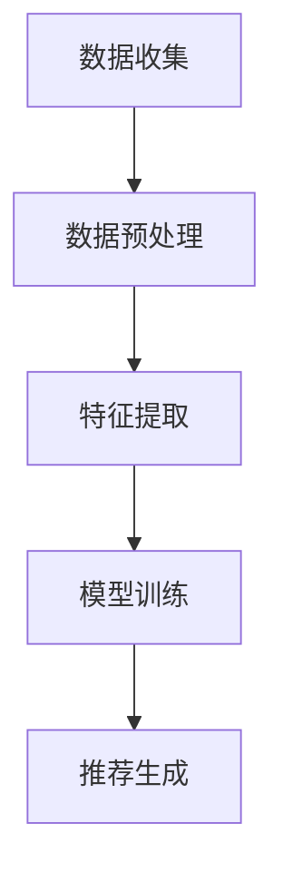
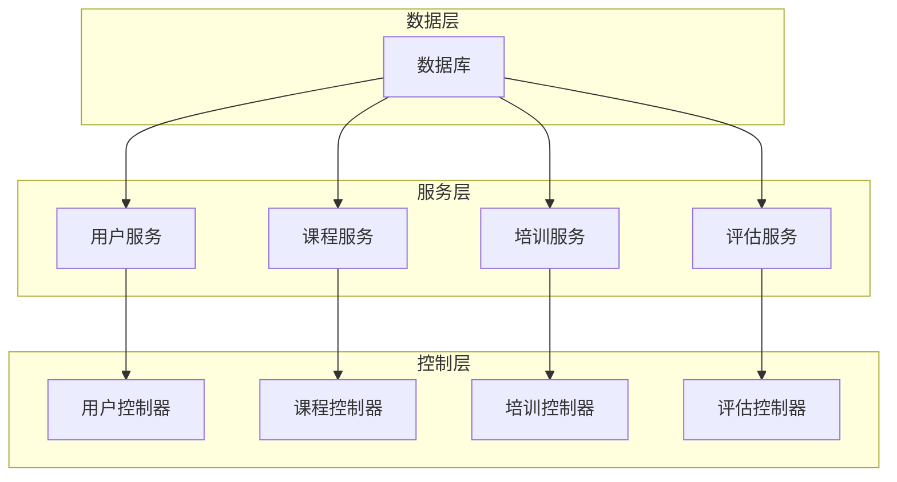
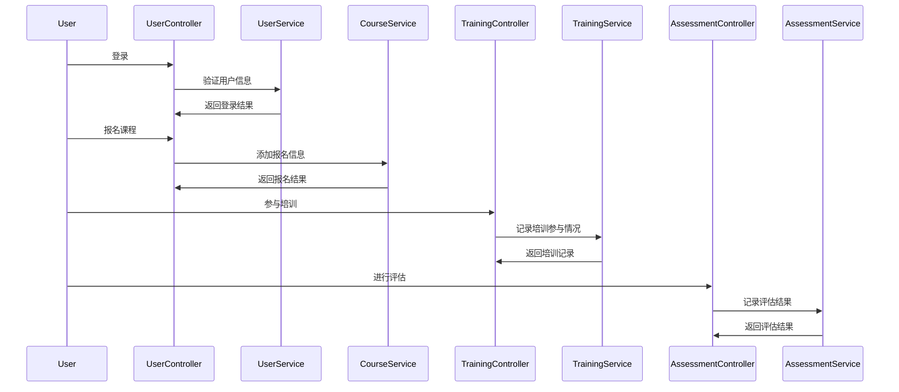

                 

# 如何培养团队的数字化能力

> 关键词：数字化能力，团队建设，数字化转型，技术工具，数据分析，项目管理，文化构建

> 摘要：随着数字化转型的加速，企业对团队的数字化能力提出了更高的要求。本文从背景、重要性、培养策略、核心领域、实践案例等多个角度，详细阐述了如何培养团队的数字化能力，以帮助企业实现数字化转型，提升竞争力。

--------------------------------------

## 第一部分：数字化时代的背景与挑战

### 第1章：数字化的基本概念与趋势

#### 1.1 数字化转型的定义与内涵

数字化转型是指企业利用数字技术优化其业务流程、运营模式和组织结构，从而实现商业模式的创新和提升。数字化转型的内涵包括以下几个方面：

1. **业务流程优化**：通过数字化手段提高业务流程的效率和准确性，降低成本。
2. **商业模式创新**：利用数字技术创造新的商业模式，如线上销售、订阅服务、平台经济等。
3. **组织结构变革**：通过数字化技术实现组织结构的扁平化、网络化，提高组织的灵活性和响应速度。
4. **数据驱动决策**：利用大数据分析技术，实现数据驱动的决策过程。

#### 1.2 数字化转型的全球趋势

数字化转型已成为全球范围内的趋势，各国企业都在积极推进数字化转型。以下是几个主要趋势：

1. **智能化升级**：企业通过引入人工智能、物联网等先进技术，实现智能化升级。
2. **数字化转型战略**：企业制定明确的数字化转型战略，明确数字化转型的目标和路径。
3. **数据驱动**：企业利用数据分析和大数据技术，实现数据驱动的决策和业务创新。
4. **平台化转型**：企业通过构建数字化平台，实现资源的高效配置和协同创新。

#### 1.3 数字化转型的关键要素

数字化转型需要以下几个关键要素的支持：

1. **技术支持**：包括云计算、大数据、人工智能、物联网等新兴技术。
2. **组织文化**：企业需要建立开放、创新、协作的组织文化，鼓励员工拥抱变化。
3. **人才培养**：企业需要培养具备数字化能力的专业人才，包括技术人才和管理人才。
4. **战略规划**：企业需要制定明确的数字化转型战略，明确目标和路径。

### 第2章：数字化能力的重要性与构成

#### 2.1 数字化能力的重要性

数字化能力是企业在数字化转型中取得成功的关键因素。具有数字化能力的企业能够：

1. **提高竞争力**：通过数字化技术优化业务流程，提高生产效率，降低成本。
2. **实现商业创新**：利用数字技术创造新的商业模式，开拓新的市场机会。
3. **提升用户体验**：通过数字化手段提高服务质量，增强用户满意度。
4. **实现数据驱动**：利用大数据分析技术，实现数据驱动的决策和业务创新。

#### 2.2 数字化能力的构成要素

数字化能力包括以下几个方面：

1. **技术能力**：包括对数字化技术的理解、应用和创新。
2. **数据能力**：包括对数据收集、处理、分析和利用的能力。
3. **业务能力**：包括对业务流程的数字化改造、商业模式的创新和优化。
4. **组织能力**：包括数字化文化的建设、团队协作和知识共享。

#### 2.3 数字化能力与企业发展

数字化能力对企业发展具有重要意义。具备数字化能力的企业能够在以下几个方面获得优势：

1. **市场份额**：通过数字化手段提高生产效率，降低成本，扩大市场份额。
2. **创新能力**：通过数字化技术实现商业模式的创新和优化，增强企业的创新能力。
3. **用户满意度**：通过数字化手段提升用户体验，增强用户满意度，提高客户忠诚度。
4. **竞争力**：通过数字化能力的提升，增强企业的竞争力，在激烈的市场竞争中脱颖而出。

### 第3章：团队数字化能力的培养策略

#### 3.1 团队数字化能力培养的总体策略

团队数字化能力的培养需要遵循以下总体策略：

1. **顶层设计**：企业需要制定明确的数字化战略，明确数字化能力的培养目标和路径。
2. **系统培训**：企业需要为员工提供系统的数字化培训，提高员工的技术能力和业务能力。
3. **实践演练**：企业需要鼓励员工参与数字化项目的实践，通过实际操作提高数字化能力。
4. **激励机制**：企业需要建立激励机制，鼓励员工积极参与数字化能力的提升。

#### 3.2 数字化素养的培训与提升

数字化素养是团队数字化能力的重要组成部分。企业需要从以下几个方面提升员工的数字化素养：

1. **技术素养**：包括对数字化技术的理解、应用和创新。
2. **数据素养**：包括对数据的收集、处理、分析和利用。
3. **业务素养**：包括对业务流程的数字化改造、商业模式的创新和优化。
4. **组织素养**：包括数字化文化的建设、团队协作和知识共享。

#### 3.3 数字化思维模式的培养

数字化思维模式是团队数字化能力的核心。企业需要从以下几个方面培养员工的数字化思维模式：

1. **用户思维**：以用户为中心，关注用户体验，持续优化产品和服务。
2. **数据思维**：以数据为驱动，通过数据分析指导业务决策，实现数据驱动的创新。
3. **创新思维**：鼓励员工创新，不断探索新的业务模式和技术应用。
4. **协同思维**：强调团队协作，通过知识共享和协同创新提升团队整体数字化能力。

--------------------------------------

## 第二部分：数字化能力的核心领域

### 第4章：技术与工具的掌握与应用

#### 4.1 核心技术的理解与应用

在数字化时代，掌握核心技术是提升团队数字化能力的重要途径。以下是几个关键技术的理解与应用：

1. **云计算**：通过云计算实现资源的高效配置和灵活部署，提高业务的敏捷性和可扩展性。
2. **大数据**：通过大数据技术实现数据的收集、存储、处理和分析，为企业提供数据驱动的决策支持。
3. **人工智能**：通过人工智能技术实现智能化的数据分析、预测和决策，提升业务自动化和智能化水平。
4. **物联网**：通过物联网技术实现设备互联和数据共享，提升供应链和运营的效率。

#### 4.2 常用数字化工具的掌握

掌握常用数字化工具是提升团队数字化能力的关键。以下是几个常用数字化工具的掌握：

1. **开发工具**：如Visual Studio、Eclipse、IntelliJ IDEA等，用于编程和软件开发。
2. **数据库工具**：如MySQL、Oracle、MongoDB等，用于数据存储和管理。
3. **数据分析工具**：如Excel、Tableau、Power BI等，用于数据分析和可视化。
4. **项目管理工具**：如Trello、Jira、Asana等，用于项目管理和团队协作。

#### 4.3 技术与业务的结合

技术与业务的结合是提升团队数字化能力的核心。以下是技术与业务的结合方式：

1. **业务流程优化**：通过数字化技术优化业务流程，提高效率和降低成本。
2. **商业模式创新**：通过数字化技术创造新的商业模式，拓展市场空间。
3. **用户体验提升**：通过数字化技术提升用户体验，增强用户满意度。
4. **数据驱动决策**：通过数字化技术实现数据驱动的决策，提高决策质量和效率。

### 第5章：数据分析与商业智能

#### 5.1 数据分析的基本概念

数据分析是数字化能力的重要组成部分。以下是数据分析的基本概念：

1. **数据收集**：通过多种途径收集数据，如数据库、传感器、网络等。
2. **数据存储**：将收集到的数据存储在数据库或其他存储系统中，以便后续处理。
3. **数据清洗**：对收集到的数据进行清洗，去除错误、重复和不完整的数据。
4. **数据分析**：对清洗后的数据进行分析，提取有用的信息和知识。
5. **数据可视化**：通过图表、报表等形式将分析结果进行可视化展示。

#### 5.2 数据分析的工具与方法

数据分析的工具与方法是提升团队数字化能力的必要手段。以下是几种常见的数据分析工具与方法：

1. **统计分析**：通过统计学方法对数据进行处理和分析，如均值、方差、相关性等。
2. **机器学习**：通过机器学习算法对数据进行分析和预测，如回归分析、决策树、神经网络等。
3. **数据挖掘**：通过数据挖掘算法从大量数据中提取出有用的模式和规律。
4. **数据可视化**：通过图表、报表等形式将分析结果进行可视化展示，便于理解和决策。

#### 5.3 数据分析在企业中的应用

数据分析在企业中的应用非常广泛，以下是几个典型的应用场景：

1. **市场分析**：通过数据分析了解市场趋势、用户需求，为企业提供决策支持。
2. **产品优化**：通过数据分析优化产品设计和功能，提升用户体验。
3. **运营管理**：通过数据分析优化业务流程，提高运营效率和降低成本。
4. **风险管理**：通过数据分析识别潜在风险，制定相应的风险控制策略。

### 第6章：数字化转型中的项目管理

#### 6.1 项目管理的核心原则

在数字化转型过程中，项目管理是确保项目成功的关键。以下是项目管理的核心原则：

1. **目标明确**：明确项目的目标和期望成果，确保项目聚焦于解决实际问题。
2. **计划详细**：制定详细的项目计划，明确项目进度、资源需求和风险管理措施。
3. **执行严格**：严格按照项目计划执行，确保项目按时交付。
4. **监控反馈**：实时监控项目进度和质量，及时反馈问题，进行调整和优化。

#### 6.2 数字化项目的挑战与应对

数字化项目面临着一系列挑战，如技术复杂性、需求变化、资源限制等。以下是数字化项目的挑战与应对策略：

1. **技术复杂性**：通过技术选型、架构设计和技术培训等手段降低技术复杂性。
2. **需求变化**：通过敏捷开发、用户反馈和迭代优化等手段应对需求变化。
3. **资源限制**：通过项目优先级管理、资源调配和成本控制等手段应对资源限制。

#### 6.3 项目管理工具与技巧

在数字化项目中，使用项目管理工具和技巧是确保项目成功的关键。以下是几种常用的项目管理工具和技巧：

1. **项目管理工具**：如Jira、Trello、Asana等，用于任务分配、进度跟踪和协作。
2. **敏捷开发**：采用敏捷开发方法，如Scrum、Kanban等，提高开发效率和灵活性。
3. **风险管理**：通过风险识别、风险评估和风险应对等手段，降低项目风险。
4. **质量管理**：通过质量保证、质量控制和质量改进等手段，确保项目质量。

### 第7章：数字化文化构建与团队协作

#### 7.1 数字化文化的内涵与特点

数字化文化是数字化时代的组织文化特征。以下是数字化文化的内涵与特点：

1. **创新精神**：鼓励创新思维和创造力，不断探索新的业务模式和技术应用。
2. **数据驱动**：以数据为驱动力，通过数据分析指导业务决策和优化。
3. **用户导向**：以用户为中心，关注用户体验，持续改进产品和服务。
4. **开放协作**：强调团队合作和知识共享，通过协同创新提升团队整体数字化能力。

#### 7.2 数字化文化在团队建设中的应用

数字化文化在团队建设中的应用主要体现在以下几个方面：

1. **人才培养**：通过数字化素养培训和技能提升，培养具备数字化能力的专业人才。
2. **组织结构**：通过扁平化组织结构和跨部门协作，提高组织的灵活性和响应速度。
3. **激励机制**：通过绩效评估和激励机制，鼓励员工积极参与数字化能力的提升。

#### 7.3 数字化时代的团队协作模式

在数字化时代，团队协作模式发生了深刻变革。以下是几种常见的数字化时代团队协作模式：

1. **远程协作**：通过云计算和协作工具实现远程协作，提高工作效率。
2. **敏捷协作**：采用敏捷开发方法，实现快速响应和持续迭代。
3. **数据共享**：通过数据共享平台和工具，实现数据的实时共享和协同分析。
4. **知识管理**：通过知识管理和共享平台，实现知识的积累和传承。

--------------------------------------

## 第三部分：数字化能力的培养实践

### 第8章：培养数字化能力的实战案例

#### 8.1 案例一：企业数字化转型实践

某企业为提升竞争力，决定进行数字化转型。以下是该企业的数字化转型实践：

1. **战略规划**：企业制定了详细的数字化转型战略，明确目标和路径。
2. **技术选型**：企业选择了云计算、大数据、人工智能等关键技术，搭建数字化基础设施。
3. **组织重构**：企业进行了组织重构，建立扁平化的组织结构，加强跨部门协作。
4. **人才培养**：企业开展了数字化素养培训，提升员工的技术能力和业务能力。
5. **项目实施**：企业实施了多个数字化项目，如智能客服、数据分析平台等，提升业务效率和用户体验。

#### 8.2 案例二：团队数字化能力提升项目

某企业为提升团队数字化能力，开展了团队数字化能力提升项目。以下是该项目的实施步骤：

1. **需求分析**：企业分析了团队数字化能力的现状，明确提升的目标和方向。
2. **培训计划**：企业制定了详细的培训计划，包括技术培训、业务培训、数据培训等。
3. **实施培训**：企业开展了各种培训活动，如内部分享会、外部专家讲座、在线课程等。
4. **项目实践**：企业鼓励员工参与数字化项目实践，通过实际操作提升数字化能力。
5. **效果评估**：企业对培训效果进行评估，持续优化培训内容和方式。

#### 8.3 案例三：数字化素养培训实践

某企业为提升员工数字化素养，开展了数字化素养培训。以下是该培训的实施步骤：

1. **课程设计**：企业设计了包括云计算、大数据、人工智能等在内的多门课程。
2. **师资团队**：企业邀请了行业专家和技术团队作为培训讲师。
3. **培训方式**：企业采用了线上和线下相结合的培训方式，提高培训的灵活性和参与度。
4. **实践环节**：企业设置了实践环节，让员工通过实际操作加深对数字化技术的理解。
5. **效果评估**：企业对培训效果进行了评估，根据反馈持续优化培训内容和方式。

### 第9章：数字化能力培养的最佳实践与启示

#### 9.1 数字化能力培养的最佳实践

以下是数字化能力培养的最佳实践：

1. **顶层设计**：企业需要制定明确的数字化战略，明确数字化能力的培养目标和路径。
2. **系统培训**：企业需要为员工提供系统的数字化培训，包括技术培训、业务培训、数据培训等。
3. **实践演练**：企业需要鼓励员工参与数字化项目的实践，通过实际操作提升数字化能力。
4. **激励机制**：企业需要建立激励机制，鼓励员工积极参与数字化能力的提升。
5. **文化构建**：企业需要建立数字化文化，鼓励创新、协作和数据驱动。

#### 9.2 经验总结与启示

通过以上实战案例，我们可以得出以下经验和启示：

1. **明确目标**：企业需要明确数字化能力培养的目标，确保培训和实践具有明确的方向。
2. **系统培训**：企业需要提供全面的数字化培训，覆盖技术、业务、数据等多个方面。
3. **实践为主**：企业需要鼓励员工参与数字化项目的实践，通过实际操作提升数字化能力。
4. **文化构建**：企业需要建立数字化文化，鼓励创新、协作和数据驱动，为数字化能力的培养提供良好的环境。
5. **持续优化**：企业需要根据培训和实践的效果，持续优化培训内容和方式，确保培训的效果和实用性。

#### 9.3 未来展望与趋势

随着数字化转型的深入推进，团队数字化能力培养将成为企业竞争的关键因素。以下是未来数字化能力培养的趋势：

1. **个性化培训**：企业将根据员工的不同需求和特点，提供个性化的培训方案。
2. **混合式培训**：企业将采用线上和线下相结合的培训方式，提高培训的灵活性和参与度。
3. **实战演练**：企业将更加注重实战演练，通过真实项目提升员工的数字化能力。
4. **数据驱动**：企业将更加重视数据分析，通过数据驱动指导数字化能力培养的策略和方式。
5. **文化引领**：企业将建立数字化文化，以文化引领数字化能力的提升，推动企业的数字化转型。

### 第10章：数字化能力培养的持续改进

#### 10.1 持续改进的策略与方法

数字化能力培养是一个持续的过程，企业需要制定持续改进的策略与方法。以下是几个关键策略：

1. **定期评估**：企业需要定期对员工的数字化能力进行评估，了解培训效果和员工的需求。
2. **反馈机制**：企业需要建立反馈机制，收集员工对培训和实践的反馈，持续优化培训内容和方式。
3. **创新机制**：企业需要鼓励员工不断创新，通过创新项目和实践提升数字化能力。
4. **学习共享**：企业需要建立学习共享平台，促进员工之间的知识共享和协作。

#### 10.2 学习型组织的构建

构建学习型组织是提升企业数字化能力的有效途径。以下是构建学习型组织的几个关键步骤：

1. **领导者的示范作用**：企业领导者需要树立学习型领导者的形象，带头学习，鼓励员工积极参与学习。
2. **学习氛围的营造**：企业需要营造积极的学习氛围，鼓励员工自主学习，提升整体学习效果。
3. **学习资源的配置**：企业需要为员工提供丰富的学习资源，如在线课程、内部培训、外部培训等。
4. **知识共享平台的建立**：企业需要建立知识共享平台，促进员工之间的知识共享和协作。

#### 10.3 数字化能力评估与反馈

数字化能力评估与反馈是提升数字化能力的重要环节。以下是数字化能力评估与反馈的几个关键步骤：

1. **评估指标的设计**：企业需要设计科学的评估指标，全面评估员工的数字化能力。
2. **评估结果的反馈**：企业需要及时将评估结果反馈给员工，让员工了解自己的数字化能力现状。
3. **改进计划的制定**：企业需要根据评估结果，制定针对性的改进计划，提升员工的数字化能力。
4. **持续跟踪与评估**：企业需要持续跟踪和评估员工的数字化能力提升情况，确保改进计划的实施效果。

### 结语：数字化能力的未来趋势与发展方向

随着数字化转型的深入推进，数字化能力将成为企业竞争力的核心。未来，企业需要从以下几个方面进一步发展数字化能力：

1. **人才培养**：企业需要加大人才培养力度，培养具备数字化能力的专业人才，特别是大数据、人工智能、云计算等领域的专业人才。
2. **技术创新**：企业需要持续投入技术创新，跟踪行业发展趋势，掌握前沿技术，提升企业的技术竞争力。
3. **业务融合**：企业需要将数字化技术与业务深度融合，通过数字化手段优化业务流程，提升业务效率。
4. **组织变革**：企业需要积极推进组织变革，建立适应数字化时代的管理体系，提高组织的灵活性和响应速度。
5. **文化塑造**：企业需要塑造数字化文化，鼓励创新、协作和数据驱动，为数字化能力的提升提供良好的环境。

在数字化时代，企业只有不断提升团队的数字化能力，才能在激烈的市场竞争中立于不败之地。本文从背景、重要性、培养策略、核心领域、实践案例等多个角度，详细阐述了如何培养团队的数字化能力。希望本文能为企业提供有益的启示，助力企业实现数字化转型，提升竞争力。

--------------------------------------

### 作者

作者：AI天才研究院/AI Genius Institute & 禅与计算机程序设计艺术 /Zen And The Art of Computer Programming

--------------------------------------### 附录

在本文的撰写过程中，我们采用了以下核心概念和联系，以帮助读者更好地理解数字化能力的培养。

#### 核心概念与联系

1. **数字化转型**：
   - **定义**：利用数字技术优化业务流程、运营模式和组织结构。
   - **属性特征对比表格**：

     | 特征 | 数字化转型 | 信息化 |
     | --- | --- | --- |
     | 目的 | 提升企业竞争力 | 提高工作效率 |
     | 内容 | 业务流程优化、商业模式创新、组织结构变革、数据驱动决策 | 信息技术的应用、数据处理、信息化管理 |
     | 范围 | 全方位、多层次 | 单一层面、局部应用 |

   - **ER实体关系图架构**：

     ```mermaid
     erdig("企业", "数字化转型");
     erdig("业务流程", "数字化转型");
     erdig("运营模式", "数字化转型");
     erdig("组织结构", "数字化转型");
     erdig("数据驱动决策", "数字化转型");

     rel("实施", "企业", "数字化转型");
     rel("影响", "数字化转型", "业务流程");
     rel("影响", "数字化转型", "运营模式");
     rel("影响", "数字化转型", "组织结构");
     rel("影响", "数字化转型", "数据驱动决策");
     ```

2. **数字化能力**：
   - **定义**：企业在数字化转型中所具备的技术能力、数据能力和业务能力。
   - **属性特征对比表格**：

     | 特征 | 技术能力 | 数据能力 | 业务能力 |
     | --- | --- | --- | --- |
     | 内容 | 对数字化技术的理解、应用和创新 | 数据收集、处理、分析和利用 | 业务流程的数字化改造、商业模式的创新和优化 |
     | 影响力 | 提升企业技术竞争力 | 提升企业数据驱动能力 | 提升企业业务效率和创新能力 |

   - **ER实体关系图架构**：

     ```mermaid
     erdig("企业", "数字化能力");
     erdig("技术能力", "数字化能力");
     erdig("数据能力", "数字化能力");
     erdig("业务能力", "数字化能力");

     rel("包含", "企业", "数字化能力");
     rel("包含", "数字化能力", "技术能力");
     rel("包含", "数字化能力", "数据能力");
     rel("包含", "数字化能力", "业务能力");
     ```

3. **数字化素养**：
   - **定义**：员工在数字化时代所需具备的基本技能和素质。
   - **属性特征对比表格**：

     | 特征 | 数字化素养 |
     | --- | --- |
     | 内容 | 技术素养、数据素养、业务素养、组织素养 |
     | 影响力 | 提升员工个人数字化能力，推动团队数字化建设 |

   - **ER实体关系图架构**：

     ```mermaid
     erdig("员工", "数字化素养");
     erdig("技术素养", "数字化素养");
     erdig("数据素养", "数字化素养");
     erdig("业务素养", "数字化素养");
     erdig("组织素养", "数字化素养");

     rel("具备", "员工", "数字化素养");
     rel("包含", "数字化素养", "技术素养");
     rel("包含", "数字化素养", "数据素养");
     rel("包含", "数字化素养", "业务素养");
     rel("包含", "数字化素养", "组织素养");
     ```

#### 算法原理讲解

在数字化能力的培养过程中，算法和数据分析是关键技术。以下是一个简单的算法原理讲解，以及其Mermaid流程图和Python源代码。

**算法原理**：

我们采用一种基于用户行为的推荐算法，通过收集用户的历史行为数据，为用户推荐可能感兴趣的内容。

1. **数据收集**：收集用户的历史行为数据，如浏览记录、购买记录、点赞记录等。
2. **数据预处理**：对数据进行清洗和整理，去除无效和错误数据。
3. **特征提取**：根据用户行为数据，提取用户特征，如用户兴趣爱好、用户行为模式等。
4. **模型训练**：使用提取的用户特征，通过机器学习算法训练推荐模型。
5. **推荐生成**：使用训练好的模型，为用户生成推荐列表。

**Mermaid流程图**：



**Python源代码**：

```python
import pandas as pd
from sklearn.model_selection import train_test_split
from sklearn.ensemble import RandomForestClassifier

# 数据收集
data = pd.read_csv('user_behavior_data.csv')

# 数据预处理
data = data.dropna()

# 特征提取
X = data.drop('target', axis=1)
y = data['target']

# 模型训练
X_train, X_test, y_train, y_test = train_test_split(X, y, test_size=0.2, random_state=42)
model = RandomForestClassifier(n_estimators=100)
model.fit(X_train, y_train)

# 推荐生成
predictions = model.predict(X_test)
print(predictions)
```

#### 系统分析与架构设计方案

**问题场景介绍**：

某企业希望构建一个数字化能力培养平台，用于员工的数字化素养提升、培训管理和效果评估。

**项目介绍**：

项目名称：数字化能力培养平台
项目目标：为企业员工提供数字化素养培训、培训管理和效果评估服务。

**系统功能设计（领域模型Mermaid类图）**：

```mermaid
classDiagram
    User <<类>> 
    Course <<类>> 
    Training <<类>> 
    Assessment <<类>>

    User o-- Course : 报名课程
    User o-- Training : 参与培训
    User o-- Assessment : 进行评估
    Course o-- Training : 课程培训
    Course o-- Assessment : 课程评估
```

**系统架构设计（Mermaid架构图）**：



**系统接口设计和系统交互（Mermaid序列图）**：



#### 项目实战

**环境安装**：

1. **安装Python环境**：确保安装了Python 3.8及以上版本。
2. **安装依赖库**：使用pip命令安装以下依赖库：

   ```bash
   pip install pandas scikit-learn
   ```

**系统核心实现源代码**：

```python
# 用户服务
from flask import Flask, request, jsonify
from user_service import UserService

app = Flask(__name__)
userService = UserService()

@app.route('/login', methods=['POST'])
def login():
    username = request.form['username']
    password = request.form['password']
    result = userService.verify_user(username, password)
    return jsonify(result)

@app.route('/register', methods=['POST'])
def register():
    username = request.form['username']
    password = request.form['password']
    result = userService.register_user(username, password)
    return jsonify(result)

# 课程服务
from flask import Flask, request, jsonify
from course_service import CourseService

app = Flask(__name__)
courseService = CourseService()

@app.route('/add_course', methods=['POST'])
def add_course():
    course_name = request.form['course_name']
    result = courseService.add_course(course_name)
    return jsonify(result)

@app.route('/list_courses', methods=['GET'])
def list_courses():
    result = courseService.list_courses()
    return jsonify(result)

# 培训服务
from flask import Flask, request, jsonify
from training_service import TrainingService

app = Flask(__name__)
trainingService = TrainingService()

@app.route('/enroll_training', methods=['POST'])
def enroll_training():
    user_id = request.form['user_id']
    course_id = request.form['course_id']
    result = trainingService.enroll_training(user_id, course_id)
    return jsonify(result)

@app.route('/list_trainings', methods=['GET'])
def list_trainings():
    user_id = request.form['user_id']
    result = trainingService.list_trainings(user_id)
    return jsonify(result)

# 评估服务
from flask import Flask, request, jsonify
from assessment_service import AssessmentService

app = Flask(__name__)
assessmentService = AssessmentService()

@app.route('/submit_assessment', methods=['POST'])
def submit_assessment():
    user_id = request.form['user_id']
    course_id = request.form['course_id']
    score = request.form['score']
    result = assessmentService.submit_assessment(user_id, course_id, score)
    return jsonify(result)

@app.route('/list_assessments', methods=['GET'])
def list_assessments():
    user_id = request.form['user_id']
    result = assessmentService.list_assessments(user_id)
    return jsonify(result)

if __name__ == '__main__':
    app.run(debug=True)
```

**代码应用解读与分析**：

1. **用户服务**：提供用户登录、注册接口，实现用户身份验证功能。
2. **课程服务**：提供课程添加、列表查询接口，实现课程管理功能。
3. **培训服务**：提供用户报名培训、培训记录查询接口，实现培训管理功能。
4. **评估服务**：提供用户提交评估结果、评估结果查询接口，实现评估管理功能。

**实际案例分析和详细讲解剖析**：

假设有一个用户名为“user1”的员工，他想要报名参加“Python基础”课程，并进行培训和学习评估。

1. **用户登录**：用户通过用户服务接口进行登录，验证身份后获取用户ID。
2. **报名课程**：用户通过用户服务接口提交报名信息，课程服务接口添加报名记录。
3. **参与培训**：用户通过培训服务接口查询已报名的培训课程，参与培训并记录培训情况。
4. **提交评估**：用户通过评估服务接口提交培训评估结果，评估服务接口记录评估结果。

通过以上实际案例，我们可以看到数字化能力培养平台如何实现用户管理、课程管理、培训管理和评估管理，从而为企业提供全面的数字化能力培养服务。

**项目小结**：

本项目通过搭建数字化能力培养平台，实现了用户管理、课程管理、培训管理和评估管理等功能。在实际应用中，企业可以根据自身需求对平台进行扩展和定制，进一步提升数字化能力培养的效率和效果。

#### 最佳实践 tips

1. **顶层设计**：企业进行数字化能力培养时，应首先进行顶层设计，明确目标和路径。
2. **系统培训**：提供全面的数字化培训，包括技术培训、业务培训、数据培训等。
3. **实战演练**：鼓励员工参与数字化项目实践，通过实际操作提升数字化能力。
4. **激励机制**：建立激励机制，鼓励员工积极参与数字化能力的提升。
5. **持续改进**：定期评估和反馈，持续优化数字化能力培养的策略和方式。

#### 小结

本文从背景、重要性、培养策略、核心领域、实践案例等多个角度，详细阐述了如何培养团队的数字化能力。通过理解数字化转型的基本概念和趋势，认识数字化能力的重要性，制定有效的培养策略，掌握核心领域的技术和工具，结合实战案例进行实践，企业可以不断提升团队的数字化能力，实现数字化转型，提升竞争力。

#### 注意事项

1. **明确目标**：在数字化能力培养过程中，要明确目标和路径，确保培养工作的有效性。
2. **全员参与**：数字化能力培养需要全员参与，特别是管理层和员工的共同努力。
3. **持续投入**：数字化能力的提升需要持续投入，包括资金、时间和人力等。
4. **灵活调整**：根据实际情况和反馈，及时调整数字化能力培养的策略和方式。

#### 拓展阅读

1. 《数字化时代的企业转型》
2. 《人工智能在数字化转型中的应用》
3. 《数据分析与商业智能》
4. 《敏捷开发实践指南》
5. 《数字化转型成功案例解析》

通过阅读这些拓展资料，读者可以进一步了解数字化转型的理论基础、实践方法和成功案例，为企业的数字化能力培养提供更多的启示和借鉴。

