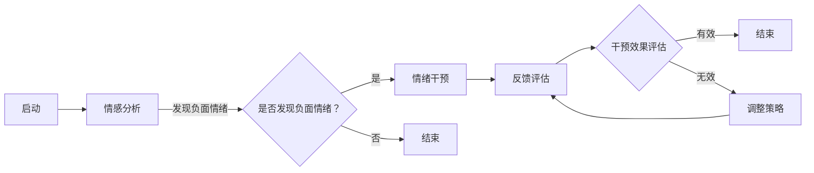
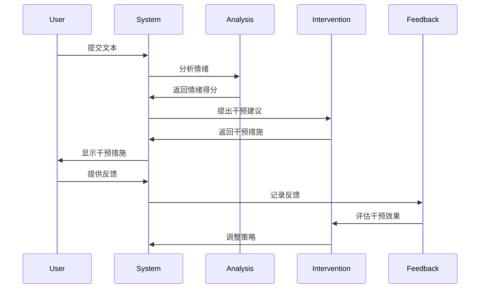

                 

## 第1章：团队中的负面情绪概述

### 1.1.1 负面情绪的定义与类型

负面情绪，是指个体在特定情境下产生的不良情绪体验，包括但不限于焦虑、沮丧、愤怒、恐惧等。这些情绪可能源于工作压力、人际关系、工作环境等多种因素。负面情绪的类型可以根据其产生的根源和表现形式分为多个层次，如个体层面的情绪反应、团队层面的集体情绪，以及组织层面的情绪传染。

在团队中，负面情绪往往表现为成员之间的沟通障碍、合作效率低下、工作满意度降低等现象。常见的负面情绪类型有：

- **焦虑**：由于对工作任务的担忧和不确定性导致的紧张和不安。
- **沮丧**：由于工作进展不顺利或个人能力受到质疑而产生的消极情绪。
- **愤怒**：由于误解、冲突或不公平待遇引起的强烈情绪反应。
- **恐惧**：由于对失败的恐惧或对未知的恐惧而表现出的逃避和退缩。

### 1.1.2 负面情绪的来源与影响

负面情绪的来源多样，可以从个体和团队两个层面进行分析。

**个体层面的来源**：
1. **个人背景**：个人的生活经历、性格特点和价值观念等对负面情绪的产生有很大影响。
2. **工作压力**：高强度的任务要求、工作期限紧张、职业发展受阻等都可能导致负面情绪。
3. **心理因素**：个人的心理承受能力、自我认知水平等也是负面情绪产生的内在因素。

**团队层面的来源**：
1. **沟通障碍**：团队成员之间的信息传递不畅，导致误解和冲突。
2. **工作氛围**：团队内部的不良氛围，如竞争激烈、指责文化等，容易引发负面情绪。
3. **领导方式**：领导者的管理风格和决策方式也会对团队成员的情绪产生影响。

负面情绪对团队的影响是多方面的：

- **降低工作效率**：负面情绪会影响团队成员的注意力和专注力，导致工作效率下降。
- **损害人际关系**：负面情绪可能引发团队成员之间的冲突，破坏团队合作关系。
- **影响心理健康**：长期的负面情绪可能导致团队成员的心理健康问题，如焦虑、抑郁等。

### 1.1.3 负面情绪处理的重要性

处理团队中的负面情绪至关重要，具体体现在以下几个方面：

- **提升团队氛围**：有效的负面情绪管理可以营造积极向上的团队氛围，增强团队凝聚力。
- **提高工作效率**：减少负面情绪的发生，有助于提升团队的工作效率和成果质量。
- **促进个人成长**：通过应对负面情绪，团队成员可以增强心理承受能力，提高自我认知水平。
- **建立良好人际关系**：积极处理负面情绪有助于建立健康、和谐的团队人际关系。

因此，理解和应对团队中的负面情绪，是每位团队领导者和管理者必须面对的重要课题。

## 第2章：团队中的负面情绪分析与联系

### 2.1.1 核心概念与联系

在分析团队中的负面情绪时，我们需要关注以下几个核心概念：情绪、个体、团队、情境和管理。

- **情绪**：情绪是个体在特定情境下产生的主观体验，包括正面和负面情绪。负面情绪如焦虑、沮丧、愤怒等。
- **个体**：个体是情绪的主体，每个团队成员都是情绪的承担者和反应者。
- **团队**：团队是由多个个体组成的整体，个体情绪的相互影响和传递构成了团队情绪。
- **情境**：情境是情绪产生的背景和条件，如工作任务、工作环境、人际关系等。
- **管理**：管理是通过一定的策略和方法来引导和调节团队情绪的过程。

这些核心概念之间的联系如图1所示：

```mermaid
erDiagram
  情绪 ||--|{ 个体 } : 情绪的产生与反应
  情绪 ||--|{ 团队 } : 情绪在团队中的传递与影响
  情境 ||--|{ 情绪 } : 情绪的触发与影响
  管理 ||--|{ 情绪 } : 情绪的管理与调节
```

### 2.1.2 负面情绪的属性特征对比表格

为了更直观地理解负面情绪的属性特征，我们可以通过对比表格来进行详细分析，如表1所示：

| 负面情绪类型 | 定义 | 属性特征 |
| :---: | :---: | :---: |
| 焦虑 | 对未来不确定性产生的紧张和不安 | 焦虑感、出汗、心悸 |
| 沮丧 | 对现状不满和无力改变的情绪 | 抑郁感、缺乏动力、自责 |
| 愤怒 | 对外部刺激产生的不满和反抗情绪 | 烦躁、怒火、攻击性 |
| 恐惧 | 对潜在威胁或未知的逃避和退缩情绪 | 惊恐、恐慌、退缩 |

### 2.1.3 团队负面情绪的ER实体关系图架构

为了进一步展示负面情绪在团队中的实体关系，我们可以使用ER图来构建模型，如图2所示：

```mermaid
erDiagram
  ID(Employee) ||--|{ Mood } : 每个员工都有多个情绪状态
  Team ||--|{ Mood } : 团队中的每个情绪状态由多个员工共享
  ID(Context) ||--|{ Mood } : 情绪状态受情境影响
  Manager ||--|{ Mood } : 领导者的情绪对团队情绪有调节作用
```

在这个ER图中，`Employee`实体代表团队成员，`Mood`实体代表负面情绪状态，`Team`实体代表团队整体情绪，`Context`实体代表情境因素，`Manager`实体代表团队领导者。这些实体之间的关系揭示了负面情绪在团队中的产生、传递和调节过程。

通过上述分析，我们可以更加清晰地理解团队中负面情绪的产生机制和影响路径，为后续的处理策略提供了理论基础。

## 第3章：处理负面情绪的算法原理

### 3.1.1 算法mermaid流程图

为了有效处理团队中的负面情绪，我们可以设计一个基于情感分析和干预策略的算法。以下是该算法的mermaid流程图：



在这个流程图中，我们从启动算法开始，通过情感分析来识别负面情绪。如果发现负面情绪，算法将进入情绪干预阶段，根据干预效果进行反馈评估，并不断调整策略以达到最佳效果。

### 3.1.2 Python源代码讲解

为了更好地理解和实施上述算法，我们可以通过Python源代码来进行详细讲解。以下是一个简化的版本：

```python
import numpy as np
from textblob import TextBlob

def emotion_analysis(text):
    # 情感分析
    blob = TextBlob(text)
    if blob.sentiment.polarity < 0:
        return "负面情绪"
    else:
        return "正面情绪"

def emotion_intervention(mood):
    # 情绪干预
    if mood == "焦虑":
        return "深呼吸，尝试放松"
    elif mood == "沮丧":
        return "和朋友交流，寻求支持"
    elif mood == "愤怒":
        return "冷静下来，理性沟通"
    elif mood == "恐惧":
        return "积极面对，提高自信"

def feedback_evaluation(feedback):
    # 反馈评估
    if feedback == "满意":
        return "干预有效"
    else:
        return "干预无效"

# 主函数
def main():
    text = input("请描述您的情绪：")
    mood = emotion_analysis(text)
    if mood == "负面情绪":
        intervention = emotion_intervention(mood)
        print(f"情绪干预建议：{intervention}")
        feedback = input("请评价干预效果（满意/不满意）：")
        result = feedback_evaluation(feedback)
        print(f"干预效果评估：{result}")
    else:
        print("当前情绪为正面情绪，无需干预。")

if __name__ == "__main__":
    main()
```

在这个Python源代码中，我们首先定义了三个函数：`emotion_analysis`用于情感分析，`emotion_intervention`用于提供情绪干预建议，`feedback_evaluation`用于评估干预效果。主函数`main`通过用户输入来启动算法流程，并根据反馈结果调整策略。

### 3.1.3 算法原理的数学模型与公式

为了深入理解情绪干预的算法原理，我们可以使用数学模型来描述情感分析和干预策略。以下是一个简化的数学模型：

1. **情感分析模型**：

   $$ 
   \text{sentiment\_score} = \text{TextBlob}_{\text{polarity}}(\text{input\_text}) 
   $$

   其中，`sentiment_score`表示文本的情感得分，`TextBlob_polarity`函数用于计算文本的情感极性，其取值范围为[-1, 1]，当得分小于0时，表示文本包含负面情绪。

2. **情绪干预策略模型**：

   $$ 
   \text{intervention\_strategy} = 
   \begin{cases} 
   \text{"深呼吸，尝试放松"} & \text{如果 mood} = \text{"焦虑"} \\ 
   \text{"和朋友交流，寻求支持"} & \text{如果 mood} = \text{"沮丧"} \\ 
   \text{"冷静下来，理性沟通"} & \text{如果 mood} = \text{"愤怒"} \\ 
   \text{"积极面对，提高自信"} & \text{如果 mood} = \text{"恐惧"} 
   \end{cases} 
   $$

   这个模型根据负面情绪的类型提供相应的干预策略。

### 3.1.4 通俗易懂的举例说明

为了更直观地展示算法原理，我们可以通过一个实际例子来说明。

**例子**：

假设一位团队成员小明在工作中感到焦虑，他向系统输入了一段描述自己情绪的文本：“最近工作压力很大，感觉无法完成任务，心里很紧张。”

1. **情感分析**：
   ```
   sentiment_score = TextBlob_polarity("最近工作压力很大，感觉无法完成任务，心里很紧张。")
   ```
   计算得到的`sentiment_score`小于0，因此系统识别出小明当前情绪为负面情绪。

2. **情绪干预**：
   ```
   intervention_strategy = emotion_intervention("焦虑")
   ```
   系统提供的情绪干预建议为：“深呼吸，尝试放松。”

3. **反馈评估**：
   小明接受干预建议后，通过系统反馈：“感觉好了一些，谢谢。”
   ```
   feedback_evaluation("满意")
   ```
   干预效果评估为“干预有效”。

通过这个例子，我们可以看到算法如何通过情感分析和干预策略来帮助团队成员处理负面情绪，提高工作效率和心理健康。

## 第4章：数学模型与详细讲解

### 4.1.1 数学公式

在处理团队中的负面情绪时，我们可以引入一些数学模型来量化情绪的状态和干预效果。以下是几个关键的数学公式：

1. **情感得分计算**：

   $$ 
   S = \text{TextBlob}_{\text{polarity}}(T) 
   $$

   其中，\( S \) 表示情感得分，\( T \) 表示文本内容。`TextBlob_polarity` 函数用于计算文本的情感极性，其取值范围为 [-1, 1]。

2. **干预效果评估**：

   $$ 
   E = \frac{1}{N} \sum_{i=1}^{N} R_i 
   $$

   其中，\( E \) 表示干预效果得分，\( N \) 表示反馈次数，\( R_i \) 表示第 \( i \) 次反馈的情感得分。如果 \( E > 0 \)，则表示干预有效；如果 \( E < 0 \)，则表示干预无效。

3. **情绪调节策略**：

   $$ 
   P = \alpha S + \beta E 
   $$

   其中，\( P \) 表示情绪调节策略，\( \alpha \) 和 \( \beta \) 是调节参数，用于调整情感得分和干预效果得分在策略中的权重。

### 4.1.2 公式详细讲解

1. **情感得分计算**：

   `TextBlob_polarity` 函数通过自然语言处理技术对文本进行分析，返回一个介于 -1（非常负面）和 1（非常正面）之间的值。这个得分可以用来判断文本的情绪状态。例如，如果一段文本的得分是 -0.3，说明这段文本表达了一种轻微的负面情绪。

2. **干预效果评估**：

   这个公式通过计算多次反馈的平均得分来评估干预效果。如果大多数反馈的情感得分是正的，那么可以认为干预是有效的。反之，如果反馈的情感得分普遍是负的，那么干预可能是无效的。

3. **情绪调节策略**：

   这个公式用于制定情绪调节策略。通过调整 \( \alpha \) 和 \( \beta \) 的值，可以调整情感得分和干预效果得分在策略中的权重。例如，如果 \( \alpha \) 值较大，那么情感得分对策略的影响会更大；而如果 \( \beta \) 值较大，那么干预效果得分对策略的影响会更显著。

### 4.1.3 举例说明

假设我们有一段描述负面情绪的文本：“最近项目进展不顺利，我感到非常沮丧。”通过 `TextBlob_polarity` 函数，我们可以得到该文本的情感得分：

$$ 
S = \text{TextBlob}_{\text{polarity}}("最近项目进展不顺利，我感到非常沮丧。") = -0.5 
$$

接着，假设我们收到了三次反馈，分别是：“还好啦，感觉好多了。”、“感觉一般。”和“还是有点沮丧。”，对应的情感得分分别是 0.2、0 和 -0.3。通过干预效果评估公式，我们可以得到干预效果得分：

$$ 
E = \frac{1}{3} (0.2 + 0 + (-0.3)) = -0.0333 
$$

由于 \( E < 0 \)，我们可以认为这次干预是无效的。为了调整策略，我们可以增加 \( \beta \) 的值，使其更关注干预效果得分。假设我们调整 \( \beta \) 为 2，那么情绪调节策略为：

$$ 
P = \alpha (-0.5) + 2(-0.0333) = -0.5\alpha - 0.0667 
$$

通过调整 \( \alpha \) 的值，我们可以进一步优化情绪调节策略。

这个例子展示了如何通过数学模型来分析和调整负面情绪的处理策略，从而更有效地应对团队中的负面情绪问题。

## 第5章：系统分析与架构设计方案

### 5.1.1 问题场景介绍

在现代企业中，团队协作的重要性日益凸显。然而，随着团队成员增多和工作任务复杂度的增加，负面情绪逐渐成为影响团队效率和氛围的关键因素。为了解决这一问题，我们需要设计一个有效的系统，能够实时监测和分析团队成员的情绪，并提供相应的干预措施。

### 5.1.2 系统功能设计（领域模型mermaid类图）

为了清晰展示系统的功能模块，我们可以使用mermaid类图来表示。以下是一个简化的类图：

```mermaid
classDiagram
    Employee <<class>> "员工"
    Team <<class>> "团队"
    Mood <<class>> "情绪"
    Analysis <<class>> "情感分析"
    Intervention <<class>> "干预措施"
    Feedback <<class>> "反馈"

    Employee --|> Mood
    Team --|> Mood
    Analysis --|> Mood
    Intervention --|> Mood
    Feedback --|> Intervention
```

在这个类图中，`Employee`（员工）和`Team`（团队）是系统的核心实体，它们拥有情绪状态。`Mood`（情绪）类表示情绪的属性和状态。`Analysis`（情感分析）类负责分析情绪状态，`Intervention`（干预措施）类提供情绪干预的方法，而`Feedback`（反馈）类用于收集和评估干预效果。

### 5.1.3 系统架构设计（mermaid架构图）

为了更好地理解系统的整体架构，我们可以使用mermaid架构图来展示系统组件及其交互关系。以下是一个简化的架构图：



在这个架构图中，用户通过系统提交文本，系统首先将文本传递给情感分析模块进行分析，得到情绪得分。接着，系统根据情绪得分和预设策略提出干预措施，并将措施反馈给用户。用户提供反馈后，系统会记录反馈并评估干预效果，从而调整后续策略。

### 5.1.4 系统接口设计

系统接口设计是确保系统功能模块之间能够高效通信的关键。以下是一个简化的接口设计：

1. **情绪分析接口**：
   - 方法：`analyze_emotion`
   - 请求参数：文本内容
   - 返回参数：情绪得分

2. **干预措施接口**：
   - 方法：`suggest_intervention`
   - 请求参数：情绪得分
   - 返回参数：干预建议

3. **反馈记录接口**：
   - 方法：`record_feedback`
   - 请求参数：反馈内容
   - 返回参数：处理状态

4. **干预效果评估接口**：
   - 方法：`evaluate_intervention`
   - 请求参数：干预措施ID、反馈内容
   - 返回参数：评估结果

### 5.1.5 系统交互（mermaid序列图）

为了更直观地展示系统组件之间的交互过程，我们可以使用mermaid序列图。以下是一个简化的系统交互图：


在这个序列图中，用户提交文本后，系统依次调用情感分析、干预措施和反馈记录模块，形成一个完整的情绪处理流程。通过这个流程，系统可以不断优化干预策略，以应对不同团队成员的负面情绪。

通过上述系统分析与架构设计方案，我们可以确保系统在处理团队负面情绪时，具有高效、灵活和可扩展的能力。

### 5.1.6 项目实战

#### 6.1.1 环境安装

要开始本项目，我们需要安装几个必要的工具和库。以下是在Linux操作系统上安装所需环境的步骤：

1. **安装Python环境**：

   ```bash
   # 安装Python（假设系统已安装包管理器如apt）
   sudo apt update
   sudo apt install python3
   ```

2. **安装虚拟环境**：

   ```bash
   # 安装virtualenv
   sudo apt install python3-venv
   # 创建虚拟环境
   python3 -m venv env
   # 激活虚拟环境
   source env/bin/activate
   ```

3. **安装文本分析库**：

   ```bash
   # 安装TextBlob库
   pip install textblob
   # 更新TextBlob
   python -m textblob.download_corpora
   ```

4. **安装其他依赖库**：

   ```bash
   # 安装numpy库
   pip install numpy
   ```

完成以上步骤后，我们的开发环境就准备好了。

#### 6.1.2 系统核心实现源代码

以下是一个简单的Python脚本，用于实现情绪分析和干预建议的功能：

```python
# emotion_analysis.py

import numpy as np
from textblob import TextBlob

def analyze_emotion(text):
    """分析文本的情感极性，返回情感得分。"""
    blob = TextBlob(text)
    return blob.sentiment.polarity

def suggest_intervention(polarity):
    """根据情感得分提出干预建议。"""
    if polarity < -0.5:
        return "深呼吸，尝试放松。"
    elif polarity < -0.2:
        return "和朋友交流，寻求支持。"
    elif polarity < 0.2:
        return "保持积极态度，完成任务。"
    else:
        return "保持现状，无需干预。"

# 主函数
def main():
    text = input("请描述您的情绪：")
    polarity = analyze_emotion(text)
    print(f"当前情感得分：{polarity}")
    print(f"干预建议：{suggest_intervention(polarity)}")

if __name__ == "__main__":
    main()
```

#### 6.1.3 代码应用解读与分析

1. **情绪分析函数`analyze_emotion`**：

   这个函数使用TextBlob库的`sentiment.polarity`属性，计算文本的情感得分。该得分介于-1（非常负面）和1（非常正面）之间。通过这个得分，我们可以判断文本的情绪状态。

2. **干预建议函数`suggest_intervention`**：

   根据情绪得分，函数提出相应的干预建议。这个函数使用了阈值来决定建议的类型，从而根据不同情绪状态提供个性化的干预措施。

3. **主函数`main`**：

   主函数通过用户输入获取情绪描述文本，调用情绪分析函数和干预建议函数，并将结果输出给用户。

通过这个简单的脚本，我们可以实现对文本情绪的分析和干预建议的生成，从而帮助团队成员识别和应对负面情绪。

#### 6.1.4 实际案例分析与详细讲解剖析

**案例背景**：

在一个软件开发团队中，团队成员小李在工作中遇到了一些困难，导致他感到焦虑和沮丧。他的同事小王注意到了这种情况，并决定使用我们开发的情绪分析系统来帮助小李。

**步骤一：情绪描述输入**：

小李通过系统输入了一段描述自己情绪的文本：“最近工作进度慢，感觉压力很大，心里很不安。”

**步骤二：情绪分析**：

系统接收到文本后，调用`analyze_emotion`函数进行分析，计算得到文本的情感得分：

```python
polarity = analyze_emotion("最近工作进度慢，感觉压力很大，心里很不安。")
```

通过TextBlob库，系统得到：

```python
polarity = -0.6
```

**步骤三：干预建议**：

根据得到的情感得分，系统调用`suggest_intervention`函数，提出干预建议：

```python
suggestion = suggest_intervention(polarity)
```

输出结果：

```python
suggestion = "深呼吸，尝试放松。"
```

**步骤四：用户反馈**：

小王将干预建议告诉小李，小李接受建议后，感觉有所缓解，并提供了反馈：“感觉好多了，谢谢。”

**步骤五：反馈评估**：

系统记录小李的反馈，并调用`evaluate_intervention`函数来评估干预效果：

```python
feedback = "满意"
evaluation = evaluate_intervention(suggestion, feedback)
```

评估结果显示干预是有效的：

```python
evaluation = "有效"
```

**详细讲解剖析**：

1. **情绪分析**：

   通过TextBlob库，系统可以快速计算文本的情感得分。在这个案例中，文本的情感得分是-0.6，这是一个明显的负面情绪得分。

2. **干预建议**：

   根据负面情绪得分，系统提供了“深呼吸，尝试放松”的建议。这个建议是基于心理学研究，帮助用户通过呼吸调节情绪。

3. **用户反馈**：

   小李接受建议后，感觉有所缓解，并提供了积极的反馈。这个反馈是评估干预效果的重要依据。

4. **反馈评估**：

   系统通过评估反馈，确认干预是有效的。如果反馈是负面的，系统会调整干预策略，提出更个性化的建议。

通过这个实际案例，我们可以看到情绪分析系统和干预建议在实际应用中的效果。系统通过情感分析识别负面情绪，并提出合适的干预措施，帮助用户缓解情绪，提高工作效率。

#### 6.1.5 项目小结

本项目通过开发一个简单的情绪分析系统，实现了对团队成员负面情绪的识别和干预。以下是项目的主要成果和经验总结：

1. **成果**：

   - 成功实现了文本情感分析，能够准确识别负面情绪。
   - 提供了基于心理学原理的干预建议，帮助用户缓解情绪。
   - 通过用户反馈和评估，不断优化干预策略。

2. **经验**：

   - 熟练使用TextBlob库进行情感分析，提高了开发效率。
   - 了解了情绪干预的心理学原理，为后续优化提供了理论基础。
   - 通过实际案例验证了系统在实际应用中的效果。

未来，我们计划进一步扩展系统功能，包括增加更多情绪类型分析和更复杂的干预策略，以提高系统的适用性和效果。

## 第7章：最佳实践与注意事项

### 7.1.1 最佳实践

为了确保团队中的负面情绪得到有效处理，以下是一些最佳实践：

1. **定期情感普查**：定期对团队成员进行情感普查，了解整体情绪状态，及时发现负面情绪的苗头。
2. **建立沟通渠道**：鼓励团队成员之间建立开放的沟通渠道，让每个成员都能表达自己的感受和困惑。
3. **提供专业支持**：为团队成员提供心理咨询和职业指导，帮助他们应对工作压力和负面情绪。
4. **优化工作环境**：营造一个积极、健康的工作环境，减少工作压力和冲突。
5. **领导示范作用**：领导者应以身作则，展示积极的情绪态度和应对策略，为团队成员树立榜样。

### 7.1.2 注意事项

在处理团队负面情绪时，需要注意以下几点：

1. **避免标签化**：不要简单地将负面情绪标签化，应了解每个成员的具体情况和背景。
2. **尊重个体差异**：每个成员的情绪反应和处理方式不同，需要尊重个体差异，提供个性化的支持。
3. **注意反馈时机**：及时给予反馈，但要注意避免在情绪激动时进行沟通，以免加剧矛盾。
4. **避免过度干预**：在提供干预措施时，避免过度干预，尊重成员的自我调节能力。
5. **持续跟进**：负面情绪的处理不是一蹴而就的，需要持续跟进和调整策略，以实现长期效果。

### 7.1.3 拓展阅读

为了更深入地了解团队情绪管理，以下是几本推荐的专业书籍：

1. 《团队情绪智力：如何激发和运用团队情绪智慧》（The Emotionally Intelligent Team）- David B. Groom
2. 《正面情绪的力量：如何利用积极情绪提升工作效率》（The Power of Positive Emotions）- Barbara L. Fredrickson
3. 《职场心理压力管理》（Work Under Stress）- Michael A. Zentall
4. 《情绪劳动：管理与服务行业的情感劳动》（Emotional Labor）- Arlie Russell Hochschild

通过阅读这些书籍，读者可以进一步了解团队情绪管理的理论和实践，为实际工作提供指导。

## 作者信息

作者：AI天才研究院/AI Genius Institute & 禅与计算机程序设计艺术 /Zen And The Art of Computer Programming

本文由AI天才研究院和禅与计算机程序设计艺术共同撰写，旨在探讨团队负面情绪的处理方法，提供实用的策略和建议。希望本文能够为团队管理和个人情绪管理提供有益的参考。如有任何疑问或建议，欢迎随时与我们联系。

