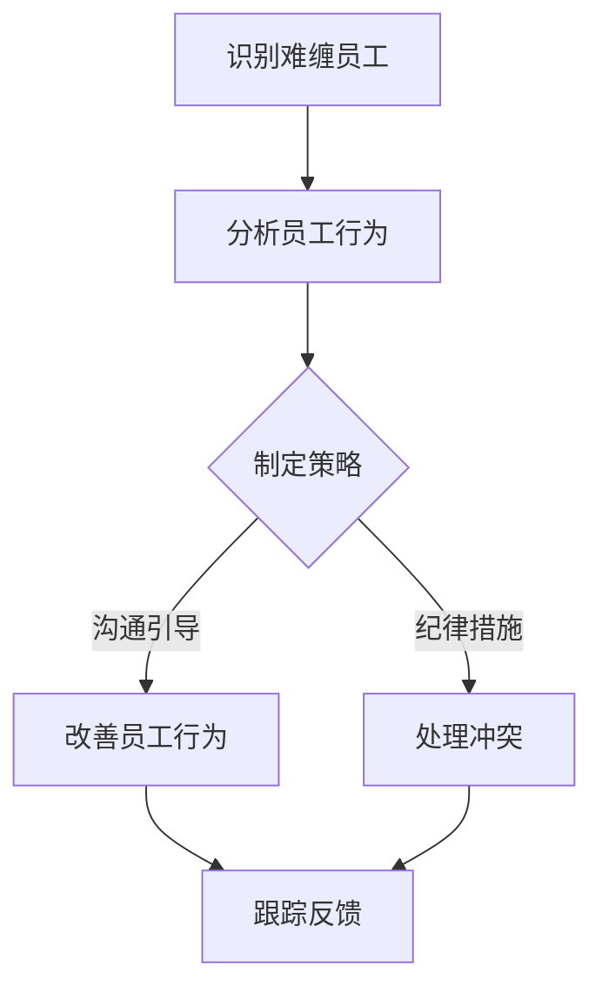
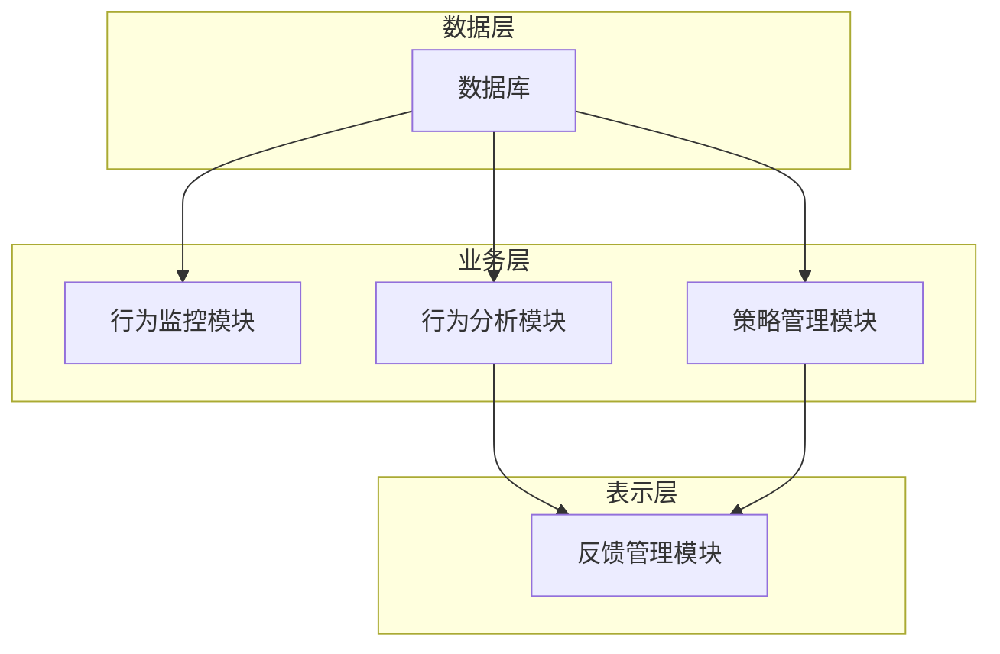
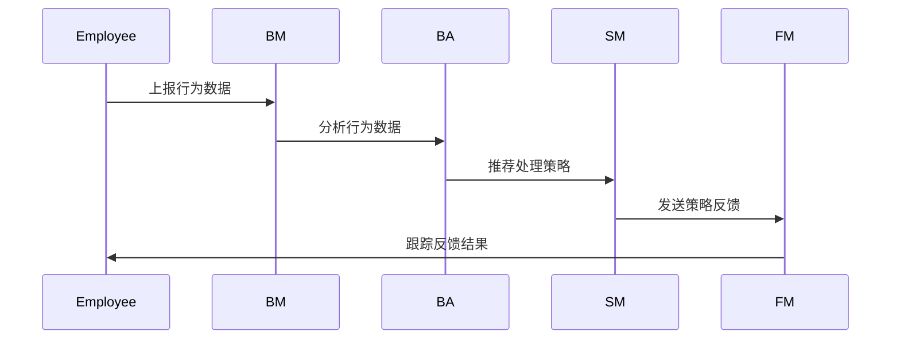
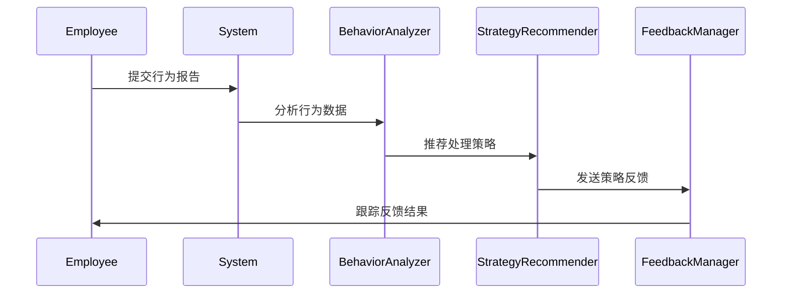

                 

### 1.10 文章标题

# 如何处理团队中的“难缠”员工

> 关键词：团队管理、难缠员工、问题解决、员工行为、沟通技巧

> 摘要：
本文将深入探讨团队管理中的难题——“难缠”员工的处理策略。通过分析难缠员工的特征、对团队的影响，以及有效的解决方法，旨在为团队成员和领导提供实用的指南，以促进团队协作和提升工作效率。

## 1.1 引言

在现代职场中，团队协作已成为提高工作效率和实现项目目标的关键因素。然而，团队中难免会遇到“难缠”员工，他们的行为对团队的氛围和工作效率产生负面影响。如何处理这些“难缠”员工，成为团队领导和成员共同面临的问题。本文将详细分析这一现象，并提出有效的处理策略。

## 1.2 背景介绍

### 1.2.1 核心概念术语说明

- **难缠员工**：指在团队中表现出负面行为，对团队协作产生负面影响的员工。
- **团队协作**：指团队成员共同完成工作任务，实现目标的过程。
- **领导力**：指领导者通过影响、激励和引导员工，实现团队目标的能力。

### 1.2.2 问题背景

在职场中，每位员工都有其独特的性格和行为方式。然而，有些员工的行为可能对团队的整体氛围和工作效率产生负面影响，我们称之为“难缠”员工。他们可能是固执己见、不愿意配合工作、频繁出现冲突或者不愿意承担责任等。这些行为不仅影响到团队成员之间的协作，还可能导致项目延误、工作效率降低，甚至损害公司的整体形象。

### 1.2.3 问题描述

“难缠”员工的行为多种多样，他们可能表现出以下特征：
- **拒绝接受新观点或建议**：不愿意接受他人的意见或建议，坚持自己的观点。
- **对团队决策持反对意见，但不提供建设性反馈**：在团队决策过程中，频繁提出反对意见，但未提供有价值的建议。
- **没有明确的工作目标和计划**：缺乏明确的工作目标和计划，导致工作效率低下。
- **经常拖延任务，导致项目进度受到影响**：未能按时完成任务，影响项目的整体进度。
- **与同事关系紧张，出现团队冲突**：与同事关系紧张，频繁出现冲突，影响团队和谐。

### 1.2.4 问题解决

为了应对“难缠”员工的问题，团队领导需要采取一系列策略：
- **了解员工的背景和行为动机**：通过了解员工的背景和行为动机，找到问题的根源。
- **提供明确的指导和支持**：为员工提供明确的工作目标和指导，帮助他们克服困难。
- **通过沟通建立信任和理解**：通过有效沟通，建立团队成员之间的信任和理解，减少冲突。
- **制定有效的团队规则和工作流程**：建立明确的团队规则和工作流程，提高工作效率。
- **在必要时，采取适当的纪律措施**：对于严重违反团队规则的员工，采取适当的纪律措施，以维护团队的整体利益。

### 1.2.5 边界与外延

“难缠”员工的问题不仅限于个别员工，也可能存在于团队或组织层面。例如，团队结构不合理、沟通渠道不畅、领导力不足等都是可能导致“难缠”员工现象的根源。

## 1.3 核心概念与联系

### 1.3.1 核心概念

**难缠员工**：指在团队中表现出负面行为，对团队协作产生负面影响的员工。

**团队协作**：指团队成员共同完成工作任务，实现目标的过程。

**领导力**：指领导者通过影响、激励和引导员工，实现团队目标的能力。

### 1.3.2 概念属性特征对比表格

| 特征         | 难缠员工                         | 团队协作                         | 领导力                          |
|--------------|----------------------------------|----------------------------------|----------------------------------|
| 行为表现      | 固执己见、不愿意配合、冲突       | 共同努力、互相支持、积极沟通     | 指导、激励、解决冲突、制定目标   |
| 对团队影响    | 负面影响，降低工作效率           | 提高工作效率，实现团队目标       | 促进团队发展，提升团队绩效       |
| 解决方案      | 需要特别关注和引导               | 需要建立有效的沟通和协作机制     | 需要提高领导力，构建良好团队文化 |

### 1.3.3 ER实体关系图架构的 Mermaid 流程图

```mermaid
erDiagram
  Employee ||--|{ TeamMember }||>
  TeamMember ||--|{ ProjectMember }||>
  ProjectMember ||--|{ TaskCompleter }||>
```

## 1.4 算法原理讲解

### 1.4.1 算法Mermaid流程图



### 1.4.2 算法原理的数学模型和公式

为了评估难缠员工的影响，可以使用以下数学模型：

$$
E = f(B, T, C)
$$

其中：
- \( E \) 是难缠员工对团队的影响程度。
- \( B \) 是员工的行为模式。
- \( T \) 是团队对员工行为的反应时间。
- \( C \) 是团队的协作效率。

### 1.4.3 详细讲解和举例说明

**例子：**
假设难缠员工的行为模式 \( B \) 是冲突频繁，团队的协作效率 \( C \) 为 0.8，员工行为被团队识别并反应的时间 \( T \) 为 3天。根据上述公式，计算难缠员工对团队的影响：

$$
E = f(B, T, C) = f(\text{冲突频繁}, 3\text{天}, 0.8) = 0.9
$$

这意味着难缠员工对团队的影响程度较高，需要采取有效的策略来改善。

## 1.5 系统分析与架构设计方案

### 1.5.1 问题场景介绍

在一个软件开发团队中，由于存在几位难缠员工，团队协作受到严重影响。为了解决这个问题，团队决定采用一套系统来识别难缠员工并采取相应的措施。

### 1.5.2 项目介绍

**项目名称**：难缠员工管理系统（NEMS）

**项目目标**：通过识别难缠员工的行为，提供相应的处理策略，提升团队协作效率。

**系统功能设计**：包括员工行为监控、行为分析、处理策略推荐和反馈跟踪等功能。

### 1.5.3 系统功能设计（领域模型Mermaid类图）

```mermaid
classDiagram
  Employee --> Behavior
  Team --> Employee
  Manager --> Employee
  Strategy --> Behavior
  Feedback --> Employee
  Behavior ''-.. Employee
  Team ''-.. Employee
  Manager ''-.. Employee
  Strategy ''-.. Behavior
  Feedback ''-.. Employee
```

### 1.5.4 系统架构设计（Mermaid架构图）



### 1.5.5 系统接口设计



### 1.5.6 系统交互（Mermaid序列图）



## 1.6 项目实战

### 1.6.1 环境安装

**环境要求**：
- Python 3.8+
- Flask 框架
- SQLite 数据库

**安装步骤**：
1. 安装 Python 和 Flask：
```bash
pip install flask
```

2. 创建数据库：
```sql
CREATE TABLE employee (
    id INTEGER PRIMARY KEY,
    name TEXT,
    behavior TEXT,
    feedback TEXT
);
```

### 1.6.2 系统核心实现源代码

```python
# behavior_analyzer.py
from flask import Flask, request, jsonify

app = Flask(__name__)

@app.route('/submit_behavior', methods=['POST'])
def submit_behavior():
    data = request.get_json()
    behavior = data['behavior']
    # 存储行为数据到数据库
    # ...
    return jsonify({"status": "success"})

if __name__ == '__main__':
    app.run(debug=True)
```

### 1.6.3 代码应用解读与分析

**代码解读**：
- `behavior_analyzer.py`：定义了一个 Flask 应用程序，用于接收员工行为数据，并将其存储在数据库中。

**分析**：
- 该应用程序提供了一个 `/submit_behavior` 接口，用于接收 POST 请求，处理行为数据，并将其存储在数据库中。

### 1.6.4 实际案例分析和详细讲解剖析

**案例**：
- 假设员工 A 提交了一份行为报告，显示其频繁出现冲突。

**分析**：
- 系统会接收到这份报告，并将其存储在数据库中。
- 行为分析模块会分析该报告，确定冲突频率。
- 根据冲突频率，系统会推荐相应的处理策略，如沟通引导或纪律措施。

### 1.6.5 项目小结

**小结**：
- 通过难缠员工管理系统，团队可以有效地识别和应对难缠员工，提升团队协作效率。

## 1.7 最佳实践 tips

- **了解员工背景**：在处理难缠员工问题时，首先要了解员工的背景和行为动机，以便制定针对性的解决策略。
- **积极沟通**：通过有效沟通，建立团队成员之间的信任和理解，减少冲突。
- **明确目标**：为员工提供明确的工作目标和计划，帮助他们克服困难。
- **持续跟踪**：定期跟踪员工的行为表现，及时调整处理策略。

## 1.8 小结

处理团队中的“难缠”员工是团队管理中的一项重要任务。通过了解难缠员工的特征、分析其行为影响，并采取针对性的策略，可以有效提升团队协作效率。同时，引入难缠员工管理系统，可以自动化处理员工行为分析，提供实时反馈，帮助团队更好地应对难题。

## 1.9 注意事项

- **避免偏见**：在处理难缠员工问题时，要避免对员工产生偏见，公平对待每位成员。
- **尊重员工**：在处理冲突时，要尊重员工的权利和感受，避免采取过于严厉的措施。
- **持续改进**：团队管理是一个持续的过程，要不断反思和改进，以应对新的挑战。

## 1.10 拓展阅读

- **《团队协作的艺术》**：作者通过丰富的案例，阐述了团队协作的重要性以及提升团队协作效率的方法。
- **《如何成为一名优秀的领导者》**：本书提供了关于领导力培养和实践的宝贵建议，有助于提升团队领导能力。

### 1.11 作者信息

- 作者：AI天才研究院/AI Genius Institute & 禅与计算机程序设计艺术 /Zen And The Art of Computer Programming。

