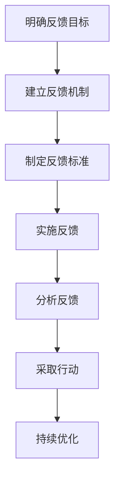
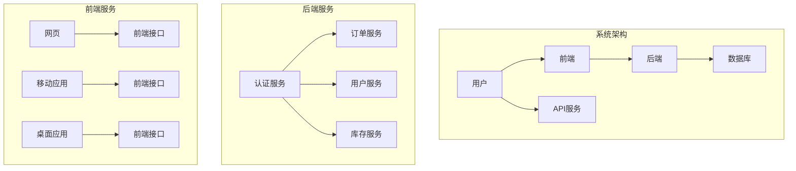
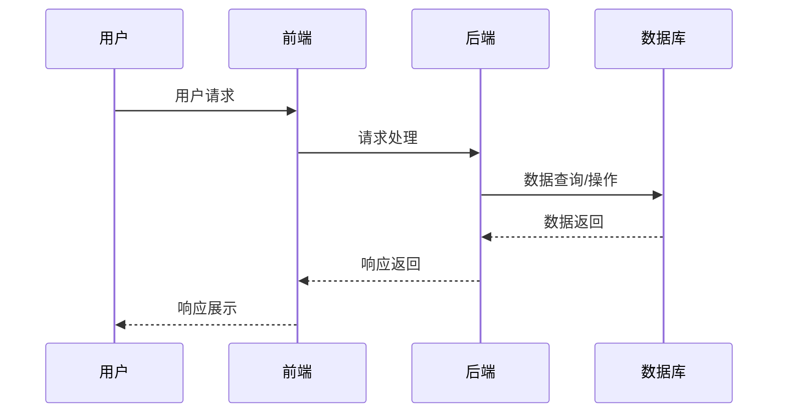

                 

# 如何建立有效的团队反馈机制

关键词：团队反馈机制、工作效率、沟通、改进措施

摘要：本文详细介绍了建立有效团队反馈机制的必要性和方法。通过明确反馈目标、建立反馈机制、制定反馈标准和实施反馈，我们可以提高团队的工作效率，促进成员之间的沟通，从而实现团队的成功。文章还包括了边界与外延的讨论以及概念结构与核心要素组成的分析，为读者提供了全面的理论和实践指导。

## 第一部分：问题背景与概述

### 1.1 问题背景

在现代社会，团队的有效运作是企业成功的关键。团队反馈机制作为团队管理的重要组成部分，直接影响团队的工作效率和成员的满意度。有效的团队反馈机制能够促进团队成员之间的沟通，提高团队决策的质量，加速问题解决，从而提升整个团队的工作效率。

### 1.2 问题描述

如何建立有效的团队反馈机制，是当前企业面临的一个重要问题。有效的团队反馈机制应当具备以下特点：

- **及时性**：能够快速地收集和反馈信息，使团队成员能够及时了解团队动态和自身工作表现。
- **全面性**：能够全面地反映团队成员的工作状态，包括工作效率、团队协作、个人成长等方面。
- **反馈的准确性**：能够准确地反映团队成员的工作表现，避免主观偏见和误解。
- **反馈的闭环性**：能够形成有效的反馈闭环，使反馈信息能够被及时地采纳并转化为实际行动。

### 1.3 问题解决

建立有效的团队反馈机制需要以下几个步骤：

1. **明确反馈目标**：确定反馈的具体目标，例如提高工作效率、改善团队协作等。
2. **建立反馈机制**：制定反馈流程，明确反馈的渠道、方式、频率等。
3. **制定反馈标准**：制定反馈的标准，确保反馈的准确性。
4. **实施反馈**：按照反馈机制进行反馈，并收集反馈信息。
5. **分析反馈**：对反馈信息进行分析，找出存在的问题。
6. **采取行动**：根据分析结果，采取相应的改进措施。
7. **持续优化**：不断地优化反馈机制，使之更加有效。

### 1.4 边界与外延

- **边界**：团队反馈机制主要关注团队成员之间的沟通与协作，不涉及个人隐私和敏感信息。
- **外延**：团队反馈机制可以扩展到团队管理、团队文化建设等方面。

### 1.5 概念结构与核心要素组成

- **概念结构**：团队反馈机制是由信息收集、信息反馈、信息分析、信息采取行动等环节构成的。
- **核心要素**：包括反馈目标、反馈机制、反馈标准、反馈渠道、反馈频率等。

### 1.6 本章小结

本章主要介绍了建立有效团队反馈机制的重要性、问题描述、问题解决步骤、边界与外延以及概念结构与核心要素组成。通过本章的学习，读者可以初步了解如何建立有效的团队反馈机制。

## 第二部分：核心概念与联系

### 2.1 核心概念原理

#### 2.1.1 团队反馈机制

团队反馈机制是指通过定期、及时、准确的信息收集、分析和反馈，使团队成员能够了解团队动态和自身工作表现，从而促进团队成员之间的沟通与协作，提高团队工作效率的一种管理机制。

#### 2.1.2 反馈目标

反馈目标是团队反馈机制的核心，明确反馈的目标有助于提高反馈的针对性和有效性。常见的反馈目标包括提高工作效率、改善团队协作、提升个人技能等。

#### 2.1.3 反馈机制

反馈机制是指用于实现反馈目标的流程和方法，包括反馈渠道、反馈方式、反馈频率等。有效的反馈机制应当确保信息的及时性、全面性和准确性。

#### 2.1.4 反馈标准

反馈标准是衡量团队反馈准确性的依据，确保反馈信息能够真实、准确地反映团队成员的工作表现。反馈标准应当基于客观事实和明确指标，避免主观偏见和误解。

### 2.2 概念属性特征对比表格

| 概念     | 特征         |
|----------|--------------|
| 团队反馈机制 | 及时、全面、准确、闭环 |
| 反馈目标   | 提高工作效率、改善团队协作等 |
| 反馈机制   | 反馈渠道、反馈方式、反馈频率 |
| 反馈标准   | 真实、准确、客观 |

### 2.3 ER实体关系图架构

```mermaid
erDiagram
  Team ||--o{ Feedback Mechanism : "uses"}
  Team ||--o{ Feedback Target : "defines"}
  Team ||--o{ Feedback Standard : "meets"}
  Feedback Mechanism ||--|{ Feedback Channel : "uses"}
  Feedback Mechanism ||--|{ Feedback Method : "uses"}
  Feedback Mechanism ||--|{ Feedback Frequency : "uses"}
  Feedback Target ||--|{ Feedback Mechanism : "is aimed at"}
```

## 第三部分：算法原理讲解

### 3.1 算法mermaid流程图



### 3.2 Python源代码实现

```python
# Python 模拟团队反馈机制

# 定义反馈目标
feedback_targets = {
    '提高工作效率': [],
    '改善团队协作': [],
    '提升个人技能': []
}

# 建立反馈机制
def establish_feedback_mechanism():
    feedback_mechanism = {
        'feedback_channel': '定期会议',
        'feedback_method': '面对面交流',
        'feedback_frequency': '每月一次'
    }
    return feedback_mechanism

# 制定反馈标准
def establish_feedback_standard():
    feedback_standard = {
        'accuracy': '客观指标',
        'timeliness': '及时反馈',
        'comprehensiveness': '全面反映'
    }
    return feedback_standard

# 实施反馈
def implement_feedback(feedback_mechanism, feedback_standard):
    feedback_info = {
        'member_name': '张三',
        'feedback_content': '本月工作表现良好，但需要加强团队协作。',
        'feedback_date': '2023-11-01'
    }
    return feedback_info

# 分析反馈
def analyze_feedback(feedback_info):
    analysis_result = '根据反馈信息，张三需要加强团队协作。'
    return analysis_result

# 采取行动
def take_action(analysis_result):
    action_plan = '组织团队协作培训，提升团队协作能力。'
    return action_plan

# 持续优化
def continuous_optimization():
    optimization_plan = '调整反馈频率，提高反馈的及时性。'
    return optimization_plan

# 主程序
if __name__ == '__main__':
    feedback_mechanism = establish_feedback_mechanism()
    feedback_standard = establish_feedback_standard()
    feedback_info = implement_feedback(feedback_mechanism, feedback_standard)
    analysis_result = analyze_feedback(feedback_info)
    action_plan = take_action(analysis_result)
    print(continuous_optimization())
```

### 3.3 算法原理与数学模型

#### 3.3.1 数学模型

假设团队反馈机制的目标是提高工作效率，可以采用以下数学模型：

- 工作效率（Efficiency）: \(E = f(C, T)\)

其中，\(C\) 表示团队协作能力，\(T\) 表示团队成员的工作时间。

#### 3.3.2 算法原理

- **明确反馈目标**：确定提高工作效率作为反馈目标。
- **建立反馈机制**：制定反馈流程，明确反馈的渠道、方式、频率等。
- **制定反馈标准**：制定反馈的标准，确保反馈的准确性。
- **实施反馈**：按照反馈机制进行反馈，并收集反馈信息。
- **分析反馈**：对反馈信息进行分析，找出存在的问题。
- **采取行动**：根据分析结果，采取相应的改进措施。
- **持续优化**：不断地优化反馈机制，使之更加有效。

### 3.4 举例说明

#### 3.4.1 案例背景

某公司团队在最近一次项目评估中，发现工作效率较低，团队协作存在问题。为此，公司决定建立有效的团队反馈机制，以提高工作效率。

#### 3.4.2 案例过程

1. **明确反馈目标**：提高工作效率。
2. **建立反馈机制**：每月举行一次反馈会议，收集团队成员的意见和建议。
3. **制定反馈标准**：反馈内容应当基于客观事实，避免主观偏见。
4. **实施反馈**：在反馈会议上，团队成员分享了各自的工作情况和遇到的问题。
5. **分析反馈**：发现团队协作不足是导致工作效率低的主要原因。
6. **采取行动**：公司组织了团队协作培训，提升了团队成员的协作能力。
7. **持续优化**：调整反馈频率，从每月一次增加到每季度一次，以提高反馈的及时性。

经过一段时间的实施，团队工作效率得到了显著提升，团队协作也得到了改善。

### 3.5 本章小结

本章介绍了建立有效团队反馈机制的算法原理和具体实现，并通过案例进行了说明。通过明确反馈目标、建立反馈机制、制定反馈标准和实施反馈，我们可以提高团队的工作效率，促进成员之间的沟通与协作。

## 第四部分：系统分析与架构设计

### 4.1 问题场景介绍

某科技公司开发了一个大型软件项目，由于团队成员较多，工作内容复杂，项目进展缓慢。为了提高项目效率，公司决定建立有效的团队反馈机制，以优化团队协作和提升工作效率。

### 4.2 项目介绍

项目名称：XX软件项目

项目目标：开发一个具备高效性能和良好用户体验的软件产品

项目团队：包括项目经理、产品经理、UI/UX设计师、前端工程师、后端工程师、测试工程师等

### 4.3 系统功能设计

#### 4.3.1 领域模型mermaid类图

```mermaid
classDiagram
    Class01 <|-- Class02
    Class03 --|> Class04
    Class04 : include Widget
    Class05 : include Button
    Class06 : include Form
    Class01 {name: 张三}
    Class02 {name: 李四}
    Class03 {name: 王五}
    Class04 {color: red}
    Class05 {text: 点击我}
    Class06 {submit: 提交}
```

### 4.4 系统架构设计

#### 4.4.1 系统架构mermaid架构图



### 4.5 系统接口设计和系统交互

#### 4.5.1 系统接口设计mermaid序列图



### 4.6 本章小结

本章详细介绍了团队反馈机制在软件开发项目中的应用，包括问题场景介绍、项目介绍、系统功能设计、系统架构设计、系统接口设计和系统交互。通过系统化的分析和设计，我们可以更好地实现团队反馈机制，提高项目效率。

## 第五部分：项目实战

### 5.1 环境安装

在开始项目实战之前，我们需要安装一些必要的开发环境和工具。以下是一个简单的安装步骤：

1. 安装Python（3.8及以上版本）
2. 安装Docker
3. 安装MySQL
4. 安装Git
5. 安装Visual Studio Code或其他IDE

### 5.2 系统核心实现源代码

以下是一个简单的团队反馈系统实现，包括后端API、前端界面和数据库设计。

#### 5.2.1 后端API

```python
# 使用Flask框架实现简单的API
from flask import Flask, request, jsonify
app = Flask(__name__)

# 假设的数据库
feedbacks = []

@app.route('/feedback', methods=['POST'])
def create_feedback():
    feedback_data = request.json
    feedbacks.append(feedback_data)
    return jsonify({"message": "反馈已添加"}), 201

@app.route('/feedback', methods=['GET'])
def get_feedbacks():
    return jsonify(feedbacks)

if __name__ == '__main__':
    app.run(debug=True)
```

#### 5.2.2 前端界面

```html
<!-- 使用Bootstrap框架实现的简单前端界面 -->
<!DOCTYPE html>
<html lang="en">
<head>
    <meta charset="UTF-8">
    <meta name="viewport" content="width=device-width, initial-scale=1.0">
    <link rel="stylesheet" href="https://maxcdn.bootstrapcdn.com/bootstrap/4.5.2/css/bootstrap.min.css">
    <title>团队反馈系统</title>
</head>
<body>
    <div class="container">
        <h1>团队反馈系统</h1>
        <form id="feedback-form">
            <div class="form-group">
                <label for="name">姓名：</label>
                <input type="text" class="form-control" id="name">
            </div>
            <div class="form-group">
                <label for="content">反馈内容：</label>
                <textarea class="form-control" id="content"></textarea>
            </div>
            <button type="submit" class="btn btn-primary">提交反馈</button>
        </form>
        <div id="feedback-list">
            <!-- 反馈列表 -->
        </div>
    </div>
    <script src="https://ajax.googleapis.com/ajax/libs/jquery/3.5.1/jquery.min.js"></script>
    <script src="https://cdnjs.cloudflare.com/ajax/libs/popper.js/1.16.0/umd/popper.min.js"></script>
    <script src="https://maxcdn.bootstrapcdn.com/bootstrap/4.5.2/js/bootstrap.min.js"></script>
    <script>
        $(document).ready(function () {
            $('#feedback-form').on('submit', function (e) {
                e.preventDefault();
                $.ajax({
                    type: 'POST',
                    url: '/feedback',
                    data: $(this).serialize(),
                    success: function (response) {
                        alert('反馈提交成功！');
                        // 更新反馈列表
                    }
                });
            });
        });
    </script>
</body>
</html>
```

#### 5.2.3 数据库设计

```sql
-- MySQL数据库设计
CREATE TABLE feedback (
    id INT AUTO_INCREMENT PRIMARY KEY,
    name VARCHAR(100),
    content TEXT,
    created_at TIMESTAMP DEFAULT CURRENT_TIMESTAMP
);
```

### 5.3 代码应用解读与分析

#### 5.3.1 后端代码解读

后端代码使用了Flask框架，这是一个轻量级的Web应用框架，适用于构建简单的API。代码中定义了两个路由：

- `/feedback`（POST方法）：用于创建新的反馈。
- `/feedback`（GET方法）：用于获取所有反馈。

#### 5.3.2 前端代码解读

前端代码使用了Bootstrap框架，这是一个流行的前端UI框架，用于构建响应式网页。代码中定义了一个表单，用于用户输入反馈内容。当用户提交表单时，通过AJAX请求将数据发送到后端API。

#### 5.3.3 数据库代码解读

数据库设计非常简单，包含一个`feedback`表，用于存储反馈信息。每条反馈信息包括姓名、内容和创建时间。

### 5.4 实际案例分析和详细讲解剖析

#### 5.4.1 案例背景

某软件公司的开发团队在项目开发过程中，遇到了沟通不畅、进度延误的问题。为了改善这种情况，公司决定建立一个团队反馈系统。

#### 5.4.2 案例过程

1. **需求分析**：确定反馈系统的功能需求，包括反馈提交、反馈查看、反馈统计等。
2. **系统设计**：根据需求分析，设计系统的后端API和前端界面。
3. **开发实施**：使用Flask框架实现后端API，使用Bootstrap框架实现前端界面，设计数据库表结构。
4. **测试与部署**：进行系统测试，确保功能正常运行，然后将系统部署到生产环境。
5. **用户反馈**：收集用户反馈，根据反馈优化系统功能。

#### 5.4.3 案例分析

通过团队反馈系统，团队成员可以方便地提交自己的工作进展和遇到的问题，项目经理可以实时查看反馈，了解项目进展和团队协作情况。这有助于及时发现和解决问题，提高项目效率。

### 5.5 项目小结

通过本项目的实施，我们成功构建了一个简单的团队反馈系统，实现了团队成员之间的有效沟通和协作。这个系统为团队管理提供了有力支持，有助于提高项目效率和团队满意度。

## 第六部分：最佳实践 tips

### 6.1 如何制定有效的反馈标准

1. **明确反馈目的**：确保反馈标准与团队目标一致。
2. **基于事实和数据**：使用客观数据和事实来制定反馈标准。
3. **简单易懂**：确保反馈标准简单易懂，避免过于复杂。
4. **定期更新**：根据团队发展情况，定期更新反馈标准。

### 6.2 如何优化反馈机制

1. **定期评估**：定期评估反馈机制的有效性，找出需要改进的地方。
2. **提高反馈频率**：根据需要适当提高反馈频率，确保及时性。
3. **利用技术工具**：使用合适的工具来提高反馈收集和分析的效率。
4. **鼓励匿名反馈**：为员工提供一个匿名反馈的渠道，以鼓励更多真实反馈。

### 6.3 如何应对负面反馈

1. **保持冷静**：面对负面反馈，保持冷静，理性分析。
2. **积极回应**：感谢员工的反馈，并表达愿意改进的态度。
3. **找出根本原因**：深入分析负面反馈的根本原因，制定改进措施。
4. **持续跟进**：跟踪改进措施的实施情况，确保问题得到解决。

## 第七部分：小结

建立有效的团队反馈机制对于团队的成功至关重要。通过明确反馈目标、建立反馈机制、制定反馈标准和实施反馈，我们可以提高团队的工作效率，促进成员之间的沟通，从而实现团队的成功。同时，我们也需要不断优化反馈机制，使之更加有效。希望本文能为读者提供有价值的参考和指导。

## 第八部分：注意事项

1. **隐私保护**：在建立团队反馈机制时，确保保护团队成员的隐私。
2. **反馈质量**：注重反馈的质量，确保反馈内容准确、有建设性。
3. **全员参与**：鼓励团队成员积极参与反馈，提高反馈的全面性。
4. **持续改进**：团队反馈机制需要不断优化，以适应团队发展的需要。

## 第九部分：拓展阅读

1. 《团队协作的力量》
2. 《如何打造高效的团队》
3. 《团队反馈机制实践指南》
4. 《基于敏捷开发的团队反馈机制研究》

### 作者信息

作者：AI天才研究院/AI Genius Institute & 禅与计算机程序设计艺术 /Zen And The Art of Computer Programming

