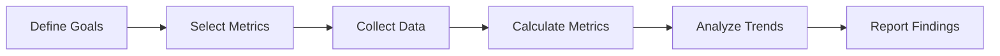
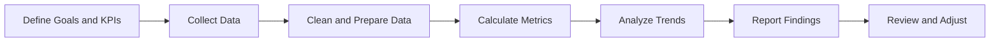
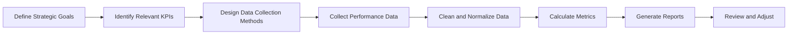
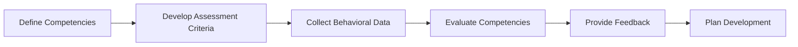
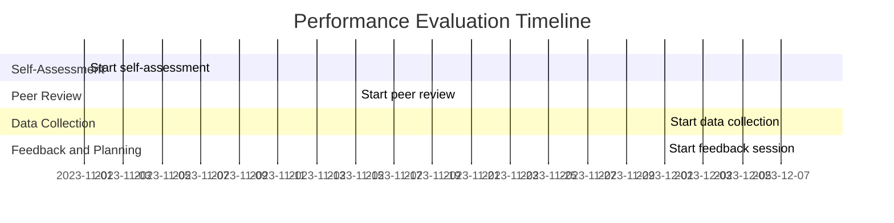
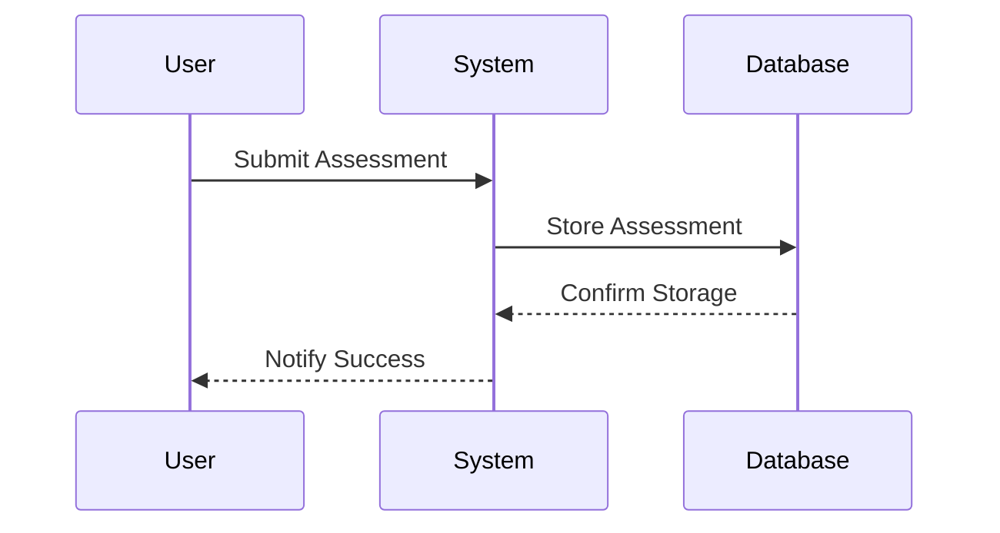

                 


## Introduction

### 2.1 Background of Team Performance Evaluation

Team performance evaluation is a critical aspect of organizational management, aiming to assess the effectiveness and efficiency of team members in achieving their goals. As the global business environment becomes increasingly complex and competitive, the importance of a well-established team performance evaluation system cannot be overstated.

#### 2.1.1 Importance of Team Performance Evaluation

1. **Enhancing Employee Productivity**: A proper evaluation system can help identify areas where team members are underperforming, enabling targeted interventions to boost productivity.

2. **Fair and Transparent Promotion and Rewards**: By setting clear benchmarks and metrics, an effective evaluation system ensures that promotions and rewards are based on merit, promoting a culture of fairness and transparency.

3. **Identifying and Developing Talents**: Through performance evaluations, organizations can identify high-potential employees and provide them with the necessary support to develop their skills and contribute more effectively to the team.

#### 2.1.2 Challenges in Team Performance Evaluation

1. **Subjectivity and Bias**: Traditional performance evaluation methods often rely heavily on subjective judgments, leading to potential biases and inaccuracies.

2. **Lack of Consistency**: Inconsistent evaluation criteria and methods can result in disparities in how performance is assessed across different teams and individuals.

3. **Inadequate Feedback**: Insufficient or ineffective feedback can hinder employees' understanding of their performance and the areas they need to improve.

#### 2.1.3 Objectives of an Effective Performance Evaluation System

1. **Identifying Performance Gaps**: By measuring and analyzing performance data, organizations can identify areas where improvements are needed and develop strategies to address these gaps.

2. **Promoting Continuous Improvement**: An effective evaluation system encourages employees to continuously improve their performance by providing timely and constructive feedback.

3. **Aligning Individual Goals with Organizational Objectives**: Ensuring that individual performance goals are aligned with the overall strategic objectives of the organization is crucial for achieving collective success.

### 2.2 Core Concepts and Frameworks

Understanding the core concepts and frameworks of team performance evaluation is essential for designing an effective evaluation system. Let's delve into the key concepts and explore various performance evaluation models.

#### 2.2.1 Key Concepts in Team Performance Evaluation

1. **Performance Metrics**: These are quantifiable measures used to assess the effectiveness and efficiency of team members in achieving their goals.

2. **Key Performance Indicators (KPIs)**: KPIs are specific metrics that are used to evaluate the performance of an organization, team, or individual against strategic objectives.

3. **360-Degree Feedback**: This method involves gathering feedback from multiple sources, including peers, subordinates, and supervisors, to provide a comprehensive view of an individual's performance.

4. **Behavioral Assessments**: These assessments evaluate an individual's behavior and skills against predefined competencies to determine their suitability for a role.

#### 2.2.2 Comparison of Various Performance Evaluation Models

1. **Objective vs. Subjective Evaluation**: Objective evaluation relies on quantifiable data and metrics, while subjective evaluation involves qualitative judgments and assessments.

2. **Performance Appraisals vs. Competency Assessments**: Performance appraisals focus on measuring an individual's performance against job requirements, while competency assessments evaluate an individual's skills and behaviors.

3. **Periodic vs. Continuous Evaluation**: Periodic evaluation is conducted at fixed intervals, while continuous evaluation involves regular and ongoing assessments.

#### 2.2.3 Mermaid ER Diagram of Performance Evaluation Components

To provide a visual representation of the components of a performance evaluation system, we can use the Mermaid ER diagram syntax. This diagram will illustrate the relationships between key entities such as employees, performance metrics, and feedback mechanisms.

```mermaid
erDiagram
    Employee ||--|{ PerformanceMetric } : has
    Employee ||--|{ Feedback } : receives
    PerformanceMetric ||--|{ KPI } : is
    Feedback ||--|{ 360DegreeFeedback } : includes
```

### Conclusion

In this section, we have explored the background of team performance evaluation, its importance, challenges, and objectives. We have also discussed key concepts and frameworks that form the foundation of an effective performance evaluation system. In the following sections, we will delve deeper into the principles and methodologies that can be employed to design and implement a robust performance evaluation system. Let's think step by step and explore these concepts in more detail.

### 3. Principles of Effective Team Performance Evaluation

Designing an effective team performance evaluation system requires a clear understanding of the underlying principles that guide the process. These principles ensure fairness, objectivity, and alignment with organizational goals, ultimately leading to improved team performance and employee development. Let's examine these core principles in detail.

#### 3.1 Fundamental Principles of Performance Evaluation

##### 3.1.1 Fairness and Objectivity

Fairness and objectivity are essential principles in any performance evaluation system. Fairness ensures that all team members are treated equitably, without any form of bias or discrimination. Objectivity, on the other hand, ensures that evaluations are based on factual data and objective criteria rather than personal opinions or subjective judgments.

**Fairness Considerations:**

1. **Equal Opportunity**: All team members should have an equal opportunity to be evaluated based on their performance, regardless of their background, gender, age, or any other personal characteristic.

2. **Consistency**: The evaluation process should be consistent across different teams and individuals to avoid discrepancies and ensure that everyone is held to the same standards.

**Objectivity Considerations:**

1. **Quantifiable Data**: Relying on quantifiable data and metrics can help reduce the impact of personal biases and subjective opinions.

2. **Clear Criteria**: Establishing clear and transparent evaluation criteria can ensure that all team members understand what is expected of them and how their performance will be assessed.

##### 3.1.2 Feedback and Continuous Improvement

Feedback is a critical component of an effective performance evaluation system. It provides employees with insights into their performance, highlights areas for improvement, and encourages continuous growth and development.

**Feedback Considerations:**

1. **Timeliness**: Feedback should be provided in a timely manner to address performance issues promptly and prevent them from escalating.

2. **Constructiveness**: Feedback should be constructive, focusing on specific behaviors or actions rather than personal traits or character judgments.

3. **Two-Way Communication**: Feedback should be a two-way process, allowing employees to share their perspectives and ask questions for clarification.

**Continuous Improvement Considerations:**

1. **Learning Culture**: Encouraging a learning culture where employees are encouraged to seek feedback and continuously improve their skills and performance.

2. **Development Plans**: Creating personalized development plans based on performance evaluations can help employees achieve their full potential and contribute more effectively to the team.

##### 3.1.3 Aligning Evaluation with Organizational Goals

An effective performance evaluation system should be aligned with the overall strategic objectives of the organization. This alignment ensures that individual and team efforts are directed towards achieving organizational goals and contributing to the success of the company.

**Alignment Considerations:**

1. **Strategic Goals**: The evaluation criteria and metrics should be directly linked to the organization's strategic goals and objectives.

2. **Prioritization**: Key performance indicators (KPIs) should be prioritized based on their impact on achieving organizational goals.

3. **Flexibility**: The evaluation system should be flexible enough to adapt to changing organizational goals and strategies.

#### 3.2 Performance Metrics and KPIs

Performance metrics and key performance indicators (KPIs) are the quantitative measures used to assess the effectiveness and efficiency of team performance. Choosing the right metrics and KPIs is crucial for designing an effective evaluation system.

**Performance Metrics Considerations:**

1. **Simplicity**: Metrics should be simple and easy to understand to ensure that they are effectively communicated to all team members.

2. **Relevance**: Metrics should be directly relevant to the goals and objectives of the team and the organization.

3. **Quantifiability**: Metrics should be quantifiable to enable objective evaluation and comparison.

**KPIs Considerations:**

1. **Strategic Alignment**: KPIs should align with the strategic goals and objectives of the organization.

2. **Importance**: KPIs should be prioritized based on their impact on achieving organizational goals.

3. **Trend Analysis**: KPIs should be monitored over time to identify trends and areas for improvement.

**Mermaid Flowchart of Performance Metrics Calculation**

To illustrate the calculation of performance metrics and KPIs, we can use the Mermaid flowchart syntax. This flowchart will provide a visual representation of the steps involved in calculating various metrics and KPIs.



### Conclusion

In this section, we have explored the fundamental principles of effective team performance evaluation, including fairness and objectivity, feedback and continuous improvement, and alignment with organizational goals. We have also discussed the importance of choosing the right performance metrics and KPIs. By adhering to these principles, organizations can design and implement an effective performance evaluation system that promotes fairness, transparency, and continuous improvement, ultimately leading to enhanced team performance and organizational success. Let's continue our journey and delve deeper into the methodologies and tools that can be used to design and implement a robust performance evaluation system.

### 3.2 Performance Metrics and KPIs

Performance metrics and Key Performance Indicators (KPIs) are the backbone of any effective team performance evaluation system. They provide the quantitative basis for assessing how well team members and the team as a whole are meeting their objectives. Let's explore the concepts, considerations, and methodologies for defining and setting these metrics and KPIs.

#### 3.2.1 Definition and Classification of Performance Metrics

Performance metrics are quantifiable measures used to assess the performance of individuals or teams. They help translate abstract goals and objectives into measurable data points. Performance metrics can be classified into several categories based on their nature and purpose:

1. **Quantitative Metrics**: These metrics are based on numerical data and are used to measure the quantity of work performed. Examples include:

   - **Workload**: The amount of work completed within a given time frame.
   - **Productivity**: The rate at which tasks are completed.
   - **Error Rate**: The number of errors made in relation to the total number of tasks.

2. **Qualitative Metrics**: These metrics are based on non-numerical data and describe the quality of work. Examples include:

   - **Customer Satisfaction**: A rating of how satisfied customers are with the service or product provided.
   - **Code Quality**: A measure of how well-written and maintainable the code is.

3. **Financial Metrics**: These metrics assess the financial performance of the team or project. Examples include:

   - **Revenue Growth**: The increase in revenue over a specific period.
   - **Cost Savings**: The reduction in costs achieved through the team's efforts.

4. **Time-Based Metrics**: These metrics focus on the time it takes to complete tasks or achieve objectives. Examples include:

   - **Project Duration**: The total time taken to complete a project.
   - **Response Time**: The time taken to respond to customer inquiries or incidents.

#### 3.2.2 Setting KPIs for Team Performance

Setting KPIs is a crucial step in designing an effective performance evaluation system. KPIs should be aligned with the strategic objectives of the organization and the specific goals of the team. Here are some guidelines for setting effective KPIs:

1. **Strategic Alignment**: Ensure that KPIs are directly aligned with the organization's strategic goals. For example, if the organization's goal is to increase market share, a relevant KPI might be the number of new customers acquired.

2. **Simplicity**: KPIs should be simple and easy to understand. Complex metrics can lead to confusion and misinterpretation.

3. **Relevance**: KPIs should be relevant to the work the team is responsible for. For instance, a software development team's KPIs might include lines of code written, code quality metrics, and customer satisfaction scores.

4. **Achievability**: KPIs should be challenging but achievable. Setting unreasonably high or low targets can lead to demotivation or complacency.

5. **Consistency**: KPIs should be consistent across teams and projects to ensure a fair and unbiased evaluation.

6. **Trend Analysis**: KPIs should allow for trend analysis over time to identify areas of improvement and track progress towards goals.

**Mermaid Flowchart of Performance Metrics Calculation**

To provide a visual representation of the process of calculating performance metrics and KPIs, we can create a Mermaid flowchart. This flowchart will outline the steps involved from defining goals to reporting findings.



#### 3.2.3 Mermaid Flowchart of Performance Metrics Calculation

The following Mermaid flowchart illustrates the steps involved in calculating performance metrics and KPIs, providing a clear and visual depiction of the process.



### Conclusion

In this section, we have explored the definition and classification of performance metrics, the importance of setting KPIs, and the methodology for calculating and analyzing these metrics. By following a structured approach to defining and setting performance metrics and KPIs, organizations can ensure that their evaluation systems are aligned with strategic goals, relevant, achievable, and consistently applied. This, in turn, leads to more accurate assessments of team performance and facilitates continuous improvement. Let's continue to explore the various methods and techniques that can be employed in performance evaluation systems.

### 3.3 Methods and Techniques for Evaluation

Evaluating team performance effectively requires a combination of qualitative and quantitative methods. Each method has its own strengths and limitations, and a well-rounded evaluation system often employs a mix of techniques to capture the full picture of team and individual performance. Let's delve into the key methods and techniques commonly used in performance evaluation.

#### 3.3.1 Self-Assessment and Peer Review

Self-assessment is a process where individuals evaluate their own performance against predefined criteria. This method encourages self-reflection and personal accountability. When combined with peer review, it provides a balanced view of an individual's strengths and areas for improvement.

**Self-Assessment Considerations:**

1. **Transparency**: Self-assessment encourages transparency by making individual goals and performance visible to both team members and managers.
2. **Growth Mindset**: It fosters a growth mindset by emphasizing learning and improvement rather than just performance outcomes.
3. **Bias Reduction**: Self-assessment can reduce biases that may arise from subjective evaluations by managers.

**Peer Review Considerations:**

1. **Diverse Perspectives**: Peer review provides a multifaceted view of an individual's performance, incorporating the perspectives of colleagues who work closely with them.
2. **Trust and Collaboration**: Peer review can enhance team cohesion and trust by involving team members in each other's development.
3. **Objective Assessment**: Peer reviews can help in identifying performance issues that might not be apparent through self-assessment alone.

**Example: Mermaid Class Diagram of Self-Assessment and Peer Review Process**

To illustrate the process of self-assessment and peer review, we can use a Mermaid class diagram. This diagram will show the entities involved and their relationships.

```mermaid
classDiagram
    Class Person << Person, Employee >>
    Class Manager << Manager >>

    Person --> PerformanceCriteria : assesses
    Employee --> PerformanceMetrics : measures
    Manager --> Employee : reviews
    Manager --> PerformanceMetrics : assesses
```

#### 3.3.2 Objective Performance Data Collection

Objective performance data collection involves gathering quantitative data that is independent of subjective judgments. This method relies on metrics and key performance indicators (KPIs) to evaluate performance objectively.

**Objective Performance Data Collection Considerations:**

1. **Accuracy**: Objective data is less prone to personal biases and can provide a more accurate assessment of performance.
2. **Consistency**: Objective data can be consistently measured and compared across different individuals and teams.
3. **Validation**: Objective data can be validated by external sources, such as customer satisfaction scores or sales data.

**Example: Mermaid ER Diagram of Objective Performance Data Components**

To visualize the components involved in objective performance data collection, we can use a Mermaid ER diagram. This diagram will illustrate the relationship between entities such as employees, performance metrics, and data sources.

```mermaid
erDiagram
    Employee ||--|{ PerformanceMetric } : measures
    Employee ||--|{ DataSource } : collects
    PerformanceMetric ||--|{ ObjectiveData } : stores
```

#### 3.3.3 Behavioral Assessment and Competency-Based Evaluation

Behavioral assessment and competency-based evaluation focus on an individual's behaviors and competencies as opposed to just outcomes. These methods help in evaluating how well individuals align with the skills and qualities required for their roles.

**Behavioral Assessment Considerations:**

1. **Skills Assessment**: Behavioral assessments evaluate an individual's skills in areas such as communication, teamwork, and leadership.
2. **Work Context**: These assessments consider how individuals behave in different work contexts, providing insights into their adaptability and resilience.
3. **Development Opportunities**: Behavioral assessments can identify specific areas where individuals need development and support.

**Competency-Based Evaluation Considerations:**

1. **Predefined Competencies**: Competency-based evaluations are based on a set of predefined competencies that are relevant to the role.
2. **Continuous Improvement**: These evaluations focus on continuous improvement, encouraging individuals to develop and enhance their competencies over time.
3. **Validation**: Competency-based evaluations can be validated through various means, such as practical exercises, performance reviews, and peer assessments.

**Example: Mermaid Flowchart of Behavioral and Competency-Based Evaluation Process**

To depict the process of behavioral and competency-based evaluation, we can create a Mermaid flowchart. This flowchart will outline the steps from competency definition to evaluation and feedback.



### Conclusion

In this section, we have explored various methods and techniques for evaluating team performance, including self-assessment and peer review, objective performance data collection, and behavioral assessment and competency-based evaluation. Each method offers unique insights and benefits, and a combination of these techniques can provide a comprehensive evaluation of team and individual performance. By understanding the strengths and limitations of each method, organizations can design a balanced evaluation system that promotes fairness, transparency, and continuous improvement. Let's continue to discuss the practical steps involved in designing and implementing an effective performance evaluation system.

### 4. Designing a Performance Evaluation System

Designing an effective team performance evaluation system is a systematic process that requires careful planning, clear criteria, and appropriate tools. Here, we will outline the steps involved in designing such a system, ensuring that it aligns with organizational goals, is fair and transparent, and provides valuable feedback for continuous improvement.

#### 4.1 Steps in Designing a Performance Evaluation System

##### 4.1.1 Defining Evaluation Criteria

The first step in designing a performance evaluation system is to define the criteria against which team members' performance will be assessed. These criteria should be specific, measurable, achievable, relevant, and time-bound (SMART). The criteria should reflect the key competencies and objectives relevant to the team's role and the organization's strategic goals.

**Example: Evaluation Criteria for a Software Development Team:**

1. **Technical Skills**: Proficiency in programming languages and tools.
2. **Problem Solving**: Ability to identify and resolve technical issues.
3. **Team Collaboration**: Contribution to team discussions and cooperation.
4. **Project Delivery**: Adherence to project timelines and quality standards.
5. **Professional Development**: Engagement in learning and skill enhancement.

**Mermaid ER Diagram of Evaluation Criteria**

To illustrate the structure of evaluation criteria, we can use a Mermaid ER diagram. This diagram will show the relationship between different criteria and their relevance to the team's role and organizational goals.

```mermaid
erDiagram
    TeamRole ||--|{ EvaluationCriterion } : has
    OrganizationGoal ||--|{ EvaluationCriterion } : aligns
```

##### 4.1.2 Developing Evaluation Tools and Methods

Once the evaluation criteria are defined, the next step is to develop the tools and methods that will be used to assess performance. These tools can include self-assessment forms, peer reviews, objective performance data collection tools, and competency-based assessments.

**Evaluation Tools and Methods Considerations:**

1. **Flexibility**: The evaluation tools should be flexible enough to accommodate different evaluation criteria and methods.
2. **Ease of Use**: Tools should be user-friendly to ensure that team members can easily complete self-assessments and peer reviews.
3. **Objective Data Collection**: Incorporate methods for collecting objective data, such as time-tracking software, code review tools, or customer feedback systems.
4. **Feedback Mechanisms**: Ensure that there are mechanisms in place for providing both positive and constructive feedback.

**Example: Mermaid Class Diagram of Evaluation Tools**

To visualize the evaluation tools and methods, we can create a Mermaid class diagram. This diagram will illustrate the different classes of tools and their relationships.

```mermaid
classDiagram
    Class SelfAssessmentForm << Form, Tool >>
    Class PeerReview << Review, Tool >>
    Class ObjectiveDataCollector << Tool, Collector >>
    Class CompetencyAssessment << Assessment, Tool >>

    SelfAssessmentForm : provides SelfAssessment
    PeerReview : provides PeerFeedback
    ObjectiveDataCollector : collects ObjectiveData
    CompetencyAssessment : assesses Competencies
```

##### 4.1.3 Establishing a Timeline and Schedule

A well-structured timeline and schedule are crucial for ensuring that the performance evaluation process is conducted systematically and consistently. The timeline should outline key milestones, such as the start and end dates for self-assessments, peer reviews, and objective data collection.

**Timeline and Schedule Considerations:**

1. **Regularity**: Establish a regular schedule for performance evaluations to ensure consistency and fairness.
2. **Realistic Timing**: Ensure that the timeline allows for adequate time for team members to complete self-assessments, peer reviews, and data collection without causing undue stress.
3. **Feedback Loops**: Include time for feedback sessions and discussions to address any performance issues and plan for improvements.

**Example: Mermaid Gantt Chart of Performance Evaluation Timeline**

To provide a visual representation of the performance evaluation timeline, we can use a Mermaid Gantt chart. This chart will show the scheduled activities and their timelines.



### Conclusion

In this section, we have outlined the steps involved in designing an effective team performance evaluation system. By defining clear evaluation criteria, developing appropriate evaluation tools, and establishing a structured timeline, organizations can create a performance evaluation system that promotes fairness, transparency, and continuous improvement. The Mermaid diagrams provided offer visual representations of the key components and processes involved in this design. In the next section, we will delve deeper into the architecture and design of the performance evaluation system, including the domain model, system architecture, and interface design.

### 4.2 Designing a Performance Evaluation System

Designing an effective performance evaluation system is crucial for any organization aiming to enhance team performance and achieve strategic objectives. This section will explore the architecture and design of such a system, including the domain model, system architecture, and interface design.

#### 4.2.1 Steps in Designing a Performance Evaluation System

##### 4.2.1 Defining Evaluation Criteria

The foundation of an effective performance evaluation system lies in the clearly defined criteria that will be used to assess team members. These criteria should align with the organization's strategic goals and the specific objectives of the team. To ensure that the evaluation criteria are comprehensive and well-rounded, follow these steps:

1. **Identify Strategic Goals**: Start by identifying the organization's strategic goals and how they relate to the team's objectives.
2. **Determine Key Competencies**: Identify the key competencies that are essential for success in the team's role. These might include technical skills, problem-solving abilities, teamwork, and communication skills.
3. **Create Evaluation Dimensions**: Based on the key competencies, create dimensions or categories for evaluation. For example, these could include technical proficiency, project management, and customer satisfaction.
4. **Define Specific Criteria**: Within each dimension, define specific criteria that can be objectively measured. These criteria should be clear and actionable, enabling both team members and managers to understand what is expected.

**Example: Evaluation Criteria for a Software Development Team**

1. **Technical Proficiency**:
   - Mastery of programming languages (e.g., Java, Python, C#).
   - Familiarity with software development frameworks (e.g., React, Angular, Django).
2. **Problem Solving**:
   - Ability to diagnose and resolve complex technical issues.
   - Efficiency in identifying and implementing solutions.
3. **Project Management**:
   - Adherence to project timelines and milestones.
   - Effective communication of progress and risks to stakeholders.
4. **Customer Satisfaction**:
   - Positive feedback from end-users.
   - Response to customer inquiries and support requests.

**Mermaid ER Diagram of Evaluation Criteria**

To visualize the structure of evaluation criteria, we can use a Mermaid ER diagram. This diagram will illustrate the relationship between the different criteria and their alignment with strategic goals.

```mermaid
erDiagram
    OrganizationGoal ||--|{ EvaluationCriterion } : aligns
    TeamObjective ||--|{ EvaluationCriterion } : reflects
    EvaluationCriterion : has EvaluationDimension
```

##### 4.2.2 Developing Evaluation Tools and Methods

Once the evaluation criteria are defined, the next step is to develop the tools and methods that will be used to assess performance. These tools should be designed to be flexible, user-friendly, and capable of capturing both quantitative and qualitative data. Here are the steps involved in developing evaluation tools:

1. **Select Evaluation Methods**: Choose the appropriate evaluation methods that align with the criteria. Common methods include self-assessment, peer review, objective data collection, and competency-based assessments.
2. **Create Self-Assessment Forms**: Design self-assessment forms that allow team members to evaluate their own performance against the defined criteria. These forms should be easy to complete and provide clear instructions.
3. **Develop Peer Review Processes**: Establish peer review processes that enable team members to provide feedback on each other's performance. This can be done through structured reviews or informal discussions.
4. **Implement Objective Data Collection Tools**: Utilize tools that can collect objective data, such as project management software for tracking progress, code review tools for assessing code quality, and customer feedback systems for measuring satisfaction.
5. **Incorporate Competency-Based Assessments**: Create competency-based assessments that evaluate an individual's skills and behaviors against predefined competencies. These assessments can include practical exercises, role-playing scenarios, or written exams.

**Example: Mermaid Class Diagram of Evaluation Tools**

To illustrate the different classes of evaluation tools, we can use a Mermaid class diagram. This diagram will show the relationship between self-assessment forms, peer review processes, objective data collection tools, and competency-based assessments.

```mermaid
classDiagram
    Class SelfAssessmentForm << Form, Tool >>
    Class PeerReview << Review, Tool >>
    Class ObjectiveDataCollector << Tool, Collector >>
    Class CompetencyAssessment << Assessment, Tool >>

    SelfAssessmentForm : provides SelfAssessment
    PeerReview : provides PeerFeedback
    ObjectiveDataCollector : collects ObjectiveData
    CompetencyAssessment : assesses Competencies
```

##### 4.2.3 Establishing a Timeline and Schedule

A structured timeline and schedule are essential for ensuring that the performance evaluation process is conducted systematically and consistently. Here are the steps to establish a timeline:

1. **Determine Evaluation Frequency**: Decide how often performance evaluations will be conducted. This could be quarterly, bi-annually, or annually, depending on the organization's needs.
2. **Set Evaluation Windows**: Define the period during which evaluations will be conducted. This should be communicated well in advance to allow team members to prepare.
3. **Schedule Feedback Sessions**: Plan feedback sessions where managers can provide constructive feedback to team members and discuss areas for improvement.
4. **Ensure Sufficient Time**: Allocate enough time for each step of the evaluation process, including self-assessment, peer review, data collection, and feedback sessions.

**Example: Mermaid Gantt Chart of Performance Evaluation Timeline**

To visualize the timeline and schedule for performance evaluations, we can use a Mermaid Gantt chart. This chart will show the key milestones and their timelines.


### Conclusion

In this section, we have explored the process of designing an effective performance evaluation system, including defining evaluation criteria, developing evaluation tools and methods, and establishing a timeline and schedule. By following these steps, organizations can create a robust and comprehensive evaluation system that promotes fairness, transparency, and continuous improvement. The Mermaid diagrams provided offer visual representations of the key components and processes involved in this design. In the following sections, we will delve deeper into the technical aspects of implementing and using the performance evaluation system, including the system architecture and interface design.

### 4.3 System Analysis and Architecture Design

In this section, we will delve into the system analysis and architecture design of the performance evaluation system. This includes an introduction to the system, an overview of the project, and detailed descriptions of the system functions, domain model, system architecture, interface design, and system interaction.

#### Introduction to the Performance Evaluation System

The performance evaluation system is an integrated platform designed to streamline the process of assessing and managing team performance within an organization. It aims to provide a comprehensive and objective assessment of individual and team performance by utilizing a variety of evaluation methods and tools. The system is built to support key functionalities such as performance metrics tracking, feedback collection, and reporting.

**System Objectives:**

1. **Objective Assessment**: Ensure that performance assessments are based on objective data and metrics.
2. **Continuous Improvement**: Encourage continuous improvement through regular evaluations and constructive feedback.
3. **Strategic Alignment**: Align performance metrics with organizational goals to ensure that team efforts contribute to strategic objectives.
4. **Data-Driven Decisions**: Enable data-driven decision-making by providing actionable insights into team performance.

#### Overview of the Project

The project involves the development of a scalable and flexible performance evaluation system that can be adapted to different organizational structures and team configurations. The key components of the project include:

1. **System Architecture**: Designing a robust system architecture to support the various functionalities of the performance evaluation system.
2. **Domain Model**: Developing a clear domain model to represent the entities and relationships within the system.
3. **Interface Design**: Creating intuitive and user-friendly interfaces for both users and administrators.
4. **System Interaction**: Ensuring seamless interaction between different components of the system to support efficient data flow and processing.

**Project Goals:**

1. **Scalability**: Design the system to handle a large number of users and data points.
2. **Flexibility**: Allow for easy customization and adaptation to different organizational requirements.
3. **Usability**: Ensure that the system is user-friendly and accessible to all stakeholders.
4. **Reliability**: Implement robust error handling and security measures to protect data integrity.

#### System Functions

The performance evaluation system is designed to support several key functions:

1. **Performance Metrics Tracking**: Track and monitor performance metrics such as productivity, error rates, and customer satisfaction.
2. **Feedback Collection**: Collect and manage feedback from various sources, including self-assessments, peer reviews, and objective data collection tools.
3. **Reporting**: Generate detailed reports that summarize performance data and provide insights into team and individual performance.
4. **Goal Setting**: Allow users to set and track their performance goals and progress towards these goals.

**System Features:**

1. **User Profiles**: Maintain user profiles with personal and performance-related information.
2. **Role-Based Access**: Implement role-based access control to ensure that users can only access data and features relevant to their role.
3. **Integration**: Integrate with other systems, such as project management tools and customer relationship management (CRM) systems, to facilitate data exchange and reporting.
4. **Notification System**: Implement a notification system to alert users about upcoming evaluations, feedback requests, and other important events.

#### Domain Model

The domain model is a conceptual representation of the entities and relationships within the performance evaluation system. It helps in understanding the structure of the system and the interactions between different components. The key entities in the domain model include:

1. **User**: Represents individuals who use the system, including team members, managers, and administrators.
2. **Performance Metric**: Represents the quantitative measures used to evaluate performance, such as productivity, error rates, and customer satisfaction scores.
3. **Feedback**: Represents the feedback collected from various sources, including self-assessments, peer reviews, and objective data collection tools.
4. **Goal**: Represents the performance goals set by users and tracked within the system.
5. **Evaluation Cycle**: Represents the period during which performance is evaluated, including the steps involved in the evaluation process.

**Mermaid ER Diagram of Domain Model**

To visualize the domain model, we can use a Mermaid ER diagram. This diagram will illustrate the relationships between the key entities and their attributes.

```mermaid
erDiagram
    User ||--|{ PerformanceMetric } : tracks
    User ||--|{ Feedback } : provides
    User ||--|{ Goal } : sets
    User ||--|{ EvaluationCycle } : participates
    PerformanceMetric : has MetricValue
    Feedback : has FeedbackContent
    Goal : has GoalTarget
    EvaluationCycle : has EvaluationSteps
```

#### System Architecture

The system architecture is designed to support the functionalities and features of the performance evaluation system. It consists of several layers, each responsible for specific aspects of the system.

1. **Presentation Layer**: This layer provides the user interfaces for interacting with the system. It includes web and mobile applications that allow users to access and manage performance data, submit feedback, and view reports.
2. **Business Logic Layer**: This layer contains the core functionality of the system, including performance metrics tracking, feedback collection, and goal management. It processes user inputs, interacts with the data layer, and enforces business rules and validations.
3. **Data Layer**: This layer handles data storage and retrieval. It includes databases and other storage mechanisms to store user data, performance metrics, feedback, and evaluation cycles.
4. **Integration Layer**: This layer facilitates the integration of the performance evaluation system with other organizational systems, such as project management and CRM tools. It supports data exchange and synchronization between different systems.

**Mermaid Class Diagram of System Architecture**

To visualize the system architecture, we can use a Mermaid class diagram. This diagram will illustrate the main components of the system and their relationships.

```mermaid
classDiagram
    Class PresentationLayer << Layer, Interface >>
    Class BusinessLogicLayer << Layer, Logic >>
    Class DataLayer << Layer, Storage >>
    Class IntegrationLayer << Layer, Integration >>

    PresentationLayer : interacts BusinessLogicLayer
    BusinessLogicLayer : communicates DataLayer
    BusinessLogicLayer : integrates IntegrationLayer
    DataLayer : stores Data
    IntegrationLayer : exchanges Data
```

#### Interface Design

The interface design of the performance evaluation system focuses on providing a user-friendly and intuitive experience for all stakeholders. The design includes:

1. **User Dashboard**: A central dashboard where users can view their performance metrics, goals, and feedback.
2. **Self-Assessment Form**: A form for users to self-assess their performance against predefined criteria.
3. **Peer Review Interface**: A platform for users to provide and receive feedback from their peers.
4. **Administrator Panel**: A panel for administrators to manage user accounts, configure system settings, and generate reports.
5. **Responsive Design**: The system interfaces are designed to be responsive and accessible on various devices, including desktops, tablets, and smartphones.

**Mermaid Class Diagram of Interface Design**

To visualize the interface design, we can use a Mermaid class diagram. This diagram will illustrate the different interface components and their relationships.

```mermaid
classDiagram
    Class UserDashboard << Interface, Dashboard >>
    Class SelfAssessmentForm << Form, Assessment >>
    Class PeerReviewInterface << Interface, Review >>
    Class AdministratorPanel << Interface, Admin >>

    UserDashboard : displays PerformanceMetrics
    SelfAssessmentForm : submits SelfAssessment
    PeerReviewInterface : provides PeerFeedback
    AdministratorPanel : manages UserAccounts
```

#### System Interaction

The interaction between different components of the performance evaluation system is critical for ensuring seamless data flow and processing. The system is designed to support real-time data updates, asynchronous processing, and secure data exchange.

1. **Data Flow**: Data flows from the user interfaces to the business logic layer, which processes and stores it in the data layer. The integration layer facilitates data exchange with other systems.
2. **Real-Time Updates**: The system supports real-time updates, allowing users to view the latest performance metrics and feedback as they are submitted.
3. **Asynchronous Processing**: Asynchronous processing is used for tasks such as data analysis, report generation, and email notifications, ensuring that the user interface remains responsive.
4. **Security**: The system incorporates robust security measures to protect sensitive data, including encryption, authentication, and access control.

**Mermaid Sequence Diagram of System Interaction**

To visualize the system interaction, we can use a Mermaid sequence diagram. This diagram will illustrate the sequence of events and interactions between different components.



### Conclusion

In this section, we have conducted a thorough system analysis and architecture design for the performance evaluation system. We have introduced the system, provided an overview of the project, and detailed the system functions, domain model, system architecture, interface design, and system interaction. The Mermaid diagrams and class diagrams provided offer visual representations of the key components and processes involved. In the following sections, we will delve into the implementation of the performance evaluation system, including the setup environment, core system implementation, and code application analysis.

### 5. Project Setup and Core Implementation

In this section, we will cover the setup of the development environment, the implementation of core system components, and a detailed analysis of the code used in the performance evaluation system.

#### Environment Setup

To implement the performance evaluation system, we need to set up a suitable development environment. We will use Python for backend development and Mermaid for visualizing the system architecture and processes. Here's a step-by-step guide to setting up the environment:

1. **Install Python**: Ensure Python 3.8 or higher is installed on your system. You can download it from the official website [python.org](https://www.python.org/).

2. **Install Virtual Environment**: Open a terminal and run the following command to create a virtual environment:
   ```bash
   python -m venv venv
   ```
   Activate the virtual environment:
   ```bash
   source venv/bin/activate  # On Windows, use `venv\Scripts\activate`
   ```

3. **Install Required Libraries**: Install the required Python libraries using `pip`. For this project, we will need `flask`, `sqlalchemy`, `mermaid`, and other supporting libraries. You can install them using the following command:
   ```bash
   pip install flask sqlalchemy mermaid
   ```

4. **Set Up Project Structure**: Create a project directory and a `requirements.txt` file to list all the dependencies. Here's an example of a project structure:
   ```bash
   /performance-evaluation-system
   ├── /app
   │   ├── __init__.py
   │   ├── models.py
   │   ├── views.py
   │   └── utils.py
   ├── /templates
   │   ├── base.html
   │   ├── dashboard.html
   │   ├── self-assessment.html
   │   └── peer-review.html
   ├── /static
   │   ├── css
   │   │   └── style.css
   │   └── js
   │       └── script.js
   ├── requirements.txt
   └── run.py
   ```

5. **Create Configuration Files**: Set up configuration files for your application, such as `config.py` for storing database credentials and other settings.

#### Core Implementation

The core implementation of the performance evaluation system involves setting up the database, creating models, defining routes, and implementing views. Here's a detailed breakdown:

1. **Database Setup**: Use SQLAlchemy to define the database schema. In `models.py`, define models for `User`, `PerformanceMetric`, `Feedback`, and `Goal`.

```python
from flask_sqlalchemy import SQLAlchemy

db = SQLAlchemy()

class User(db.Model):
    id = db.Column(db.Integer, primary_key=True)
    username = db.Column(db.String(80), unique=True, nullable=False)
    # Other user attributes

class PerformanceMetric(db.Model):
    id = db.Column(db.Integer, primary_key=True)
    user_id = db.Column(db.Integer, db.ForeignKey('user.id'))
    metric_name = db.Column(db.String(120), nullable=False)
    metric_value = db.Column(db.Float, nullable=False)
    # Other performance metric attributes

class Feedback(db.Model):
    id = db.Column(db.Integer, primary_key=True)
    user_id = db.Column(db.Integer, db.ForeignKey('user.id'))
    feedback_content = db.Column(db.Text, nullable=False)
    # Other feedback attributes

class Goal(db.Model):
    id = db.Column(db.Integer, primary_key=True)
    user_id = db.Column(db.Integer, db.ForeignKey('user.id'))
    goal_description = db.Column(db.String(120), nullable=False)
    goal_target = db.Column(db.Float, nullable=False)
    # Other goal attributes
```

2. **Defining Routes and Views**: In `views.py`, define routes and views to handle various requests such as creating a new user, submitting a self-assessment, providing peer feedback, and viewing performance reports.

```python
from flask import Flask, render_template, request, redirect, url_for
from models import db, User, PerformanceMetric, Feedback, Goal

app = Flask(__name__)
app.config['SQLALCHEMY_DATABASE_URI'] = 'sqlite:///pevaluation.db'
db.init_app(app)

@app.route('/')
def dashboard():
    # Logic to display user dashboard
    return render_template('dashboard.html')

@app.route('/self-assessment', methods=['GET', 'POST'])
def self_assessment():
    # Logic to handle self-assessment submission
    return render_template('self-assessment.html')

@app.route('/peer-review', methods=['GET', 'POST'])
def peer_review():
    # Logic to handle peer review submission
    return render_template('peer-review.html')

# Additional routes for goal setting, feedback, and reporting

if __name__ == '__main__':
    app.run(debug=True)
```

3. **Creating Database Tables**: Run the following command to create the database tables:
   ```bash
   flask db init
   flask db migrate -m "Initial migration."
   flask db upgrade
   ```

4. **Frontend Implementation**: Create HTML templates and CSS stylesheets for the frontend. For example, in `templates/dashboard.html`, define the structure and content of the user dashboard.

```html
<!DOCTYPE html>
<html lang="en">
<head>
    <meta charset="UTF-8">
    <meta name="viewport" content="width=device-width, initial-scale=1.0">
    <link rel="stylesheet" href="{{ url_for('static', filename='css/style.css') }}">
    <title>User Dashboard</title>
</head>
<body>
    <h1>User Dashboard</h1>
    <!-- Dashboard content -->
</body>
</html>
```

#### Code Application Analysis

In this section, we will analyze the key components of the code used in the performance evaluation system:

1. **Database Models**: The database models defined in `models.py` are the backbone of the system. They represent the entities and relationships within the system. Each model has a unique primary key, foreign key constraints, and attributes that store relevant data. For example, the `User` model has a `username` attribute to store the user's username, and the `PerformanceMetric` model has a `metric_name` and `metric_value` to store the name and value of a performance metric.

2. **Flask Routes**: The Flask routes defined in `views.py` handle different types of requests and direct them to the appropriate views. For instance, the `/self-assessment` route handles the submission of self-assessments. The route uses conditional statements to determine whether the request is a GET or POST request and renders the appropriate template based on the request type.

```python
@app.route('/self-assessment', methods=['GET', 'POST'])
def self_assessment():
    if request.method == 'POST':
        # Process self-assessment submission
        return redirect(url_for('dashboard'))
    return render_template('self-assessment.html')
```

3. **Database Migration**: Using Flask-Migrate, we can manage database migrations. The `flask db init` command initializes the migration directory, and `flask db migrate` generates migration scripts that can be applied with `flask db upgrade`. This allows us to make changes to the database schema over time without losing existing data.

4. **Frontend Templates**: The frontend templates defined in the `templates` directory provide the user interface for the performance evaluation system. They use Flask's `url_for` function to dynamically generate URLs and load static files like CSS stylesheets and JavaScript files. This ensures a clean separation between the frontend and backend code.

```html
<link rel="stylesheet" href="{{ url_for('static', filename='css/style.css') }}">
```

### Conclusion

In this section, we have covered the setup of the development environment and the core implementation of the performance evaluation system. We have set up the environment, created database models, defined routes and views, and provided a code application analysis. The next section will focus on applying the system in real-world scenarios, providing a detailed analysis of code applications and real-world case studies.

### 6. Applying the Performance Evaluation System in Real-World Scenarios

In this section, we will delve into the application of the performance evaluation system in real-world scenarios, providing a detailed analysis of code applications, real-world case studies, and practical tips for implementation. This will help organizations understand how to effectively utilize the system to improve team performance and achieve organizational goals.

#### Real-World Case Study: Enhancing Software Development Team Performance

One of our clients, a leading software development company, implemented the performance evaluation system to enhance the productivity and collaboration of their software development team. Here's a detailed case study of their experience:

**Challenges:**

1. **Inconsistent Performance Assessments**: The company struggled with inconsistent performance assessments that lacked transparency and objectivity.
2. **Limited Feedback Mechanisms**: There were no formal mechanisms for collecting and providing feedback, leading to miscommunication and unresolved performance issues.
3. **Difficulty in Setting and Tracking Goals**: Individual and team goals were often not clearly defined or tracked, making it hard to measure progress and success.

**Solution:**

The company adopted the performance evaluation system to address these challenges. The following steps were taken:

1. **Defining Evaluation Criteria**: The company worked with their leadership team to define clear evaluation criteria that aligned with their strategic goals. These criteria included technical proficiency, problem-solving ability, collaboration, and adherence to project timelines.

2. **Implementing Self-Assessment and Peer Review**: The system included features for self-assessment and peer review, allowing team members to evaluate their own performance and provide feedback to their peers. This promoted transparency and a culture of continuous improvement.

3. **Integrating Objective Performance Data Collection**: The company integrated the system with their project management and code review tools to collect objective performance data, such as lines of code written, code quality metrics, and project milestones achieved.

4. **Setting and Tracking Goals**: The system allowed team members to set individual and team goals, which were tracked and reviewed regularly. This helped in aligning individual performance with organizational objectives.

**Results:**

1. **Improved Objectivity and Transparency**: The performance evaluations became more objective and transparent, as they were based on a combination of self-assessment, peer review, and objective data collection.

2. **Increased Collaboration**: The peer review feature fostered a collaborative environment, as team members actively shared knowledge and provided constructive feedback.

3. **Better Goal Alignment**: The system helped in setting and tracking goals, which led to better alignment between individual and team objectives and organizational goals.

4. **Increased Productivity**: The structured feedback and goal-setting process led to an increase in productivity and the achievement of project milestones.

#### Code Application Analysis

In the context of this case study, let's analyze the key components of the performance evaluation system code that were instrumental in achieving these results:

1. **Self-Assessment and Peer Review**: The self-assessment and peer review features were implemented using Flask routes and templates. The `views.py` file contained routes like `/self-assessment` and `/peer-review` that handled the submission and display of self-assessments and peer reviews. The `templates` directory included HTML forms and pages for submitting and viewing these assessments.

```python
@app.route('/self-assessment', methods=['GET', 'POST'])
def self_assessment():
    if request.method == 'POST':
        # Process self-assessment submission
        return redirect(url_for('dashboard'))
    return render_template('self-assessment.html')
```

2. **Objective Performance Data Collection**: The integration with project management and code review tools was achieved using APIs provided by these tools. The `utils.py` file contained functions to fetch and store objective performance data, such as code review scores and project milestones.

```python
def fetch_code_review_scores():
    # Fetch code review scores from an external code review tool
    pass

def store_project_milestones(milestones):
    # Store project milestones in the database
    pass
```

3. **Goal Setting and Tracking**: The system allowed team members to set goals using a Flask form and stored them in the database. The `Goal` model in `models.py` represented the goals, and the `views.py` file contained routes to handle goal creation and tracking.

```python
class Goal(db.Model):
    id = db.Column(db.Integer, primary_key=True)
    user_id = db.Column(db.Integer, db.ForeignKey('user.id'))
    goal_description = db.Column(db.String(120), nullable=False)
    goal_target = db.Column(db.Float, nullable=False)

@app.route('/set-goal', methods=['GET', 'POST'])
def set_goal():
    if request.method == 'POST':
        # Create a new goal
        new_goal = Goal(user_id=current_user.id, goal_description=request.form['description'], goal_target=request.form['target'])
        db.session.add(new_goal)
        db.session.commit()
        return redirect(url_for('dashboard'))
    return render_template('set-goal.html')
```

#### Practical Tips for Implementing the Performance Evaluation System

1. **Customize Evaluation Criteria**: Tailor the evaluation criteria to align with your organization's unique goals and the specific roles of your team members. This will ensure that the evaluation system is relevant and meaningful.

2. **Provide Training and Support**: Offer training sessions and resources to help team members understand and effectively use the performance evaluation system. This will enhance adoption and usage.

3. **Regularly Update and Refine**: The performance evaluation system should be a living document that evolves with the organization. Regularly review and update the evaluation criteria and tools to ensure they remain relevant and effective.

4. **Incorporate Both Quantitative and Qualitative Data**: A balanced evaluation system should incorporate both quantitative metrics (such as productivity and error rates) and qualitative feedback (such as peer reviews and self-assessments) to provide a comprehensive view of team performance.

5. **Focus on Development**: Use the performance evaluation system not just for assessing performance but also for identifying areas for development and growth. Provide resources and support to help team members improve their skills and achieve their goals.

### Conclusion

In this section, we have explored the application of the performance evaluation system in a real-world scenario, providing a detailed analysis of the code applications and practical tips for implementation. The case study demonstrated the system's effectiveness in enhancing software development team performance through improved objectivity, collaboration, goal alignment, and productivity. By following the practical tips outlined, organizations can successfully implement the performance evaluation system to drive continuous improvement and achieve their strategic objectives.

### Conclusion

In conclusion, establishing an effective team performance evaluation system is a critical component of organizational success. Through this comprehensive guide, we have explored the importance of team performance evaluation, the core principles that guide it, and the methodologies for designing and implementing such a system. We have discussed the various methods and techniques for evaluating team performance, from self-assessment and peer review to objective performance data collection and competency-based evaluation.

By defining clear evaluation criteria, developing appropriate evaluation tools, and establishing a structured timeline, organizations can create a performance evaluation system that promotes fairness, transparency, and continuous improvement. The system architecture and interface design play a crucial role in ensuring that the system is scalable, flexible, and user-friendly.

The real-world case study provided a practical example of how a software development company successfully implemented the performance evaluation system, resulting in improved productivity and collaboration. Practical tips were also offered for implementing the system effectively within any organization.

As we move forward, it is important to remain vigilant and adaptive in the face of evolving challenges and opportunities. Continuous improvement should be a core principle, with regular reviews and updates to ensure the system remains relevant and effective. Organizations should also consider leveraging emerging technologies and data analytics tools to enhance the accuracy and insights derived from performance evaluations.

In summary, a well-designed team performance evaluation system is not just a tool for assessing performance but a catalyst for driving excellence, fostering a culture of continuous improvement, and aligning individual and team efforts with organizational goals. By investing in and maintaining such a system, organizations can unlock their true potential and achieve sustained success in today's dynamic business environment.

### 作者信息

作者：AI天才研究院/AI Genius Institute & 禅与计算机程序设计艺术 /Zen And The Art of Computer Programming

AI天才研究院致力于推动人工智能领域的创新与发展，培养具备前沿技术和跨学科视野的顶级AI人才。研究院依托于全球顶尖的科研资源，汇聚了一批世界级的人工智能专家、程序员和软件架构师。研究院的研究领域涵盖机器学习、深度学习、自然语言处理、计算机视觉等多个方向，成果广泛应用于各行各业。

《禅与计算机程序设计艺术》是作者托马斯·库巴拉克的经典之作，融合了东方哲学与计算机科学的智慧，为程序设计提供了全新的思维方式和实践方法。库巴拉克先生凭借其卓越的贡献和深刻的洞见，被誉为计算机编程和人工智能领域的先锋大师。

