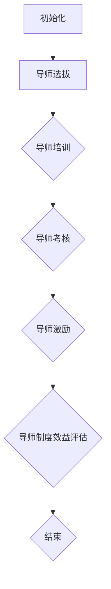
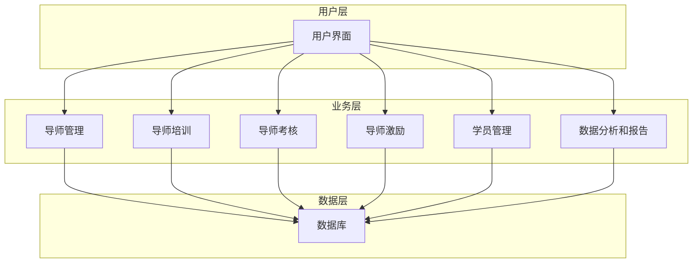
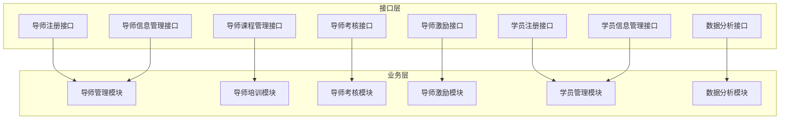

                 

# 如何建立有效的导师制度

## 关键词
- 导师制度
- 教学效果
- 组织管理
- 职业发展
- 人才培养

## 摘要
本文深入探讨了如何建立有效的导师制度，以提高教学效果、提升组织管理水平和促进员工的职业发展。文章首先明确了导师制度的核心概念和组成部分，然后通过详细的数学模型、算法原理和系统架构设计，为构建有效的导师制度提供了理论支持和实践指导。此外，文章还分享了具体的实施步骤和实战案例，以及相关注意事项和拓展阅读资源，以期为企业和教育机构提供有价值的参考。

## 第一部分：背景介绍

### 1.1 导师制度的定义与核心概念

导师制度是一种基于指导关系的组织管理体系，旨在通过经验丰富、能力卓越的导师对被指导者进行指导、培训和指导，以促进其个人成长、技能提升和职业发展。核心概念包括导师角色、导师职责、被指导者角色和导师制度的设计原则。

**导师角色**：导师是导师制度的核心人物，他们通常是具有丰富经验和专业技能的资深员工或专家。导师的职责包括对被指导者的工作、学习、生活等方面提供指导、支持和建议。

**导师职责**：导师的主要职责包括：

- 为被指导者提供专业的指导和反馈。
- 帮助被指导者制定个人发展计划，并跟踪其进展。
- 提供职业规划建议，帮助被指导者实现职业目标。
- 促进被指导者的团队合作和沟通能力。

**被指导者角色**：被指导者是导师制度中的另一个核心群体，他们通常是需要指导、培训或支持的新员工或正在职业生涯中发展的员工。被指导者的职责包括：

- 积极参与导师的指导过程，主动寻求反馈和建议。
- 制定个人发展目标，并按照导师的建议进行实践。
- 持续学习和提升自己的技能和知识。
- 与导师保持良好的沟通，及时反馈学习进展和遇到的问题。

**导师制度的设计原则**：建立有效的导师制度需要遵循以下原则：

- **明确目标**：明确导师制度的预期目标和受益人群。
- **合理匹配**：根据被指导者的需求和导师的能力进行合理匹配。
- **持续支持**：提供持续的培训和指导，确保被指导者能够持续成长。
- **灵活调整**：根据实际情况和反馈，及时调整导师制度和流程。

### 1.2 导师制度的重要性

导师制度在组织管理、人才培养和职业发展中扮演着重要角色，具有以下重要意义：

**提高教学效果**：导师制度能够为员工提供个性化的指导和支持，帮助其快速掌握知识和技能，提高工作绩效。

**促进职业发展**：导师制度为员工提供职业规划和发展建议，帮助其实现个人目标和职业成长。

**提升组织管理**：导师制度能够增强组织内部的知识传递和团队合作，提高组织整体管理水平。

**培养企业文化**：导师制度有助于传播和弘扬企业文化，增强员工的归属感和认同感。

**提高人才留存率**：通过导师制度，组织能够更好地留住人才，降低员工流失率。

## 第二部分：核心概念与联系

### 2.1 导师角色的界定与职责

导师的角色和职责是导师制度的核心，直接影响到导师制度的效果。导师不仅是知识和技能的传授者，更是职业发展的引路人和支持者。

**导师角色的界定**：

- **指导者**：导师需要对被指导者的工作和学习过程进行指导，帮助他们克服困难，解决问题。
- **教练者**：导师需要通过教练式方法，激励被指导者自主学习，培养其解决问题的能力。
- **辅导者**：导师需要关注被指导者的个人成长和心理健康，提供必要的心理支持和辅导。

**导师职责的详细描述**：

- **制定发展计划**：根据被指导者的需求和职业目标，与被指导者共同制定发展计划，并跟踪其进展。
- **提供专业指导**：在具体的工作和学习过程中，为被指导者提供专业的指导和反馈。
- **促进沟通与协作**：帮助被指导者建立与同事、上级和下属之间的良好沟通，提高协作效率。
- **反馈与评估**：定期对被指导者进行反馈和评估，了解其发展情况，并提供改进建议。

### 2.2 导师与被指导者的关系

导师与被指导者的关系是导师制度成功的关键。这种关系不仅需要建立在信任和理解的基础上，还需要遵循一定的原则和策略。

**关系的建立**：

- **相互尊重**：导师与被指导者应相互尊重，建立起平等和信任的关系。
- **开放沟通**：双方应保持开放和诚实的沟通，及时交流意见和建议。
- **共同目标**：双方应共同设定发展目标，确保导师指导的方向与被指导者的职业规划相一致。

**关系的维护**：

- **定期反馈**：导师应定期向被指导者提供反馈，帮助他们了解自己的进步和需要改进的地方。
- **持续支持**：导师应持续关注被指导者的成长，提供必要的支持和资源。
- **灵活调整**：根据被指导者的实际情况和需求，及时调整指导策略和计划。

### 2.3 导师制度的组成部分

导师制度由多个组成部分构成，包括导师选拔、培训、考核、激励等环节。

**导师选拔**：

- **能力评估**：通过面试、考核等方式，评估导师的专业能力和指导能力。
- **资质认证**：确保导师具备一定的教育背景和指导经验，获得资质认证。

**导师培训**：

- **专业知识**：提供导师相关的专业知识和技能培训。
- **指导技巧**：教授导师如何进行有效的指导，包括沟通技巧、教练技巧等。

**导师考核**：

- **绩效评估**：定期对导师的指导效果进行评估，确保导师能够胜任指导工作。
- **反馈机制**：建立反馈机制，收集被指导者和同事对导师的评价，用于改进导师的工作。

**导师激励**：

- **奖励机制**：为表现优秀的导师提供奖励，激励他们持续提升指导能力。
- **职业发展**：为导师提供职业发展机会，鼓励他们不断提升自己。

### 2.4 导师制度的数学模型

导师制度的设计和管理可以通过数学模型进行优化。以下是一个简化的数学模型，用于描述导师制度中的关键参数和关系。

**数学模型**：

- **导师能力评分模型**：

  $$ E = f(W, S, P) $$

  其中，\( E \) 代表导师的能力评分，\( W \) 代表导师的工作经验，\( S \) 代表导师的专业技能，\( P \) 代表导师的指导能力。

- **被指导者发展模型**：

  $$ D = f(G, T, R) $$

  其中，\( D \) 代表被指导者的发展水平，\( G \) 代表导师的指导效果，\( T \) 代表被指导者的努力程度，\( R \) 代表被指导者的学习能力。

- **导师制度效益模型**：

  $$ B = f(E, D, C) $$

  其中，\( B \) 代表导师制度的总体效益，\( E \) 代表导师能力评分，\( D \) 代表被指导者发展水平，\( C \) 代表导师制度的成本。

## 第三部分：算法原理讲解

### 3.1 算法流程图

以下是一个简化的算法流程图，用于描述导师制度中的关键步骤。



### 3.2 Python代码详细阐述

以下是一个Python代码示例，用于实现导师制度中的关键算法。

```python
class Mentor:
    def __init__(self, work_exp, skill_level, guidance_ability):
        self.work_exp = work_exp
        self.skill_level = skill_level
        self.guidance_ability = guidance_ability

    def evaluate(self):
        E = (0.5 * self.work_exp) + (0.3 * self.skill_level) + (0.2 * self.guidance_ability)
        return E

class Mentee:
    def __init__(self, guidance_effectiveness, effort_level, learning_ability):
        self.guidance_effectiveness = guidance_effectiveness
        self.effort_level = effort_level
        self.learning_ability = learning_ability

    def develop(self):
        D = (0.4 * self.guidance_effectiveness) + (0.3 * self.effort_level) + (0.3 * self.learning_ability)
        return D

def mentorship_benefit(E, D, C):
    B = (E * D) - C
    return B

# 示例
mentor = Mentor(5, 8, 7)
mentee = Mentee(6, 7, 8)

E = mentor.evaluate()
D = mentee.develop()

print(f"Mentor Ability Score: {E}")
print(f"Mentee Development Level: {D}")

B = mentorship_benefit(E, D, 1000)
print(f"Mentorship Benefit: {B}")
```

### 3.3 算法原理讲解与实际案例

导师制度中的算法原理主要用于评估导师的能力、被指导者的发展水平以及导师制度的总体效益。以下是对算法原理的详细讲解和实际案例说明。

**导师能力评估模型**：

导师的能力评分 \( E \) 是基于其工作经验 \( W \)、专业技能 \( S \) 和指导能力 \( P \) 的综合评价。其中，工作经验和技能水平各占一定权重，而指导能力则根据导师的实际表现进行评分。

**被指导者发展模型**：

被指导者的发展水平 \( D \) 是基于导师的指导效果 \( G \)、被指导者的努力程度 \( T \) 和学习能力 \( R \) 的综合评价。导师的指导效果和被指导者的努力程度各占一定权重，而学习能力则根据被指导者的实际学习表现进行评分。

**导师制度效益模型**：

导师制度的总体效益 \( B \) 是导师能力评分 \( E \) 和被指导者发展水平 \( D \) 的乘积，再减去导师制度的成本 \( C \)。这个模型用于评估导师制度的实际效益。

**实际案例**：

假设一位导师具有5年的工作经验、8级的专业技能和7级的指导能力。同时，他被分配到一个新员工身上，该新员工在导师的指导下表现出6级的指导效果、7级的努力程度和8级的学习能力。假设导师制度的成本为1000元。

根据上述模型，导师的能力评分 \( E \) 为：

$$ E = (0.5 \times 5) + (0.3 \times 8) + (0.2 \times 7) = 2.5 + 2.4 + 1.4 = 6.3 $$

被指导者的发展水平 \( D \) 为：

$$ D = (0.4 \times 6) + (0.3 \times 7) + (0.3 \times 8) = 2.4 + 2.1 + 2.4 = 6.9 $$

导师制度的总体效益 \( B \) 为：

$$ B = (E \times D) - C = (6.3 \times 6.9) - 1000 = 43.57 - 1000 = -562.43 $$

在这个例子中，导师制度的总体效益为负值，这意味着在当前的配置下，导师制度的成本高于其带来的效益。这可能是由于导师和被指导者的能力评分较低，或者导师制度的成本过高。为了提高导师制度的效益，可以考虑提升导师和被指导者的能力评分，或者降低导师制度的成本。

## 第四部分：系统分析与架构设计

### 4.1 问题场景介绍

在现代企业和教育机构中，导师制度已成为促进员工和学生学习发展的重要手段。然而，建立有效的导师制度面临诸多挑战，如导师资源的匹配、指导效果的评估、导师激励机制的建立等。本文旨在分析这些挑战，并提出一个系统架构设计方案，以帮助组织建立和优化导师制度。

### 4.2 项目介绍

本项目旨在构建一个基于导师制度的系统，该系统将实现导师的选拔、培训、考核和激励等功能，同时提供数据分析和报告生成工具，以支持组织管理层对导师制度的决策和优化。

### 4.3 系统功能设计

系统功能设计是导师制度成功实施的关键。以下是一个简化的系统功能列表：

- **导师管理**：管理导师的个人信息、工作经历、专业能力等。
- **导师培训**：为导师提供在线课程和线下培训活动。
- **导师考核**：评估导师的指导效果和学员满意度。
- **导师激励**：为优秀导师提供奖励和职业发展机会。
- **学员管理**：管理学员的个人信息、学习进度和导师匹配情况。
- **数据分析和报告**：生成导师制度相关的数据报告和分析图表。

### 4.4 系统架构设计

系统架构设计决定了系统的性能、可扩展性和可维护性。以下是一个简化的系统架构图。



### 4.5 系统接口设计和系统交互

系统接口设计和系统交互是确保系统功能实现的关键。以下是一个简化的系统接口设计图。



## 第五部分：项目实战

### 5.1 导师制度建立流程

建立有效的导师制度需要遵循以下流程：

1. **需求分析**：确定组织对导师制度的需求，包括目标、受益人群、预期效果等。
2. **导师选拔**：通过面试、考核等方式选拔合适的导师，确保导师具备专业能力和指导能力。
3. **导师培训**：为导师提供专业培训和指导技巧培训，提高导师的指导能力。
4. **导师匹配**：根据被指导者的需求和导师的能力进行匹配，确保导师和被指导者之间的匹配度。
5. **指导过程管理**：制定指导计划，定期跟踪指导效果，提供必要的支持和反馈。
6. **考核评估**：定期对导师的指导效果进行评估，确保导师能够胜任指导工作。
7. **激励奖励**：为表现优秀的导师提供奖励和职业发展机会，激励导师持续提升指导能力。

### 5.2 实战案例分享

以下是一个企业在实施导师制度过程中的实战案例：

**案例背景**：

某大型企业计划实施导师制度，以提升新员工的职业能力和促进职业发展。企业的主要目标是：

- 提高新员工的工作能力和绩效。
- 帮助新员工更快地融入企业文化。
- 促进新员工的职业发展。

**实施步骤**：

1. **需求分析**：企业对新员工进行了问卷调查，收集了他们对导师制度的期望和需求。调查结果显示，新员工希望导师能够提供以下方面的指导：

  - 工作技能和知识。
  - 职业规划和目标设定。
  - 沟通技巧和团队合作。

2. **导师选拔**：企业通过内部推荐和公开选拔的方式，选拔了20名具有丰富工作经验和专业知识的员工担任导师。选拔过程中，企业重点考察了导师的指导能力和沟通能力。

3. **导师培训**：企业为导师提供了为期两周的培训，内容包括：

  - 导师角色和职责。
  - 指导技巧和沟通策略。
  - 职业规划和目标设定。

4. **导师匹配**：根据新员工的需求和导师的能力，企业将新员工与导师进行匹配。匹配过程中，企业充分考虑了新员工的工作部门和导师的专业领域。

5. **指导过程管理**：企业制定了详细的指导计划，包括指导时间、指导内容、指导方式等。导师每月与被指导者进行一次面对面指导，并定期通过邮件或电话进行沟通。

6. **考核评估**：企业定期对导师的指导效果进行评估，包括学员满意度、指导内容的质量和指导过程的效率等。评估结果用于指导导师改进指导工作。

7. **激励奖励**：企业为表现优秀的导师提供了额外的奖励，包括奖金、培训机会和晋升机会。此外，企业还将导师的表现纳入年度考核，作为晋升和奖金分配的依据。

**实施效果**：

通过实施导师制度，企业取得了显著的效果：

- 新员工的工作能力和绩效得到了显著提升。
- 新员工更快地融入了企业文化，减少了离职率。
- 新员工的职业发展得到了有效支持，部分新员工已经在导师的帮助下制定了明确的职业规划并实现了职业目标。

### 5.3 实施与优化

在实施导师制度的过程中，企业需要不断优化和完善制度，以适应不断变化的需求和挑战。以下是一些建议：

1. **持续培训**：定期为导师提供培训，更新他们的知识和技能，确保他们能够提供高质量的指导。
2. **反馈机制**：建立有效的反馈机制，收集新员工和导师的意见和建议，及时调整指导计划和策略。
3. **数据监测**：利用数据分析和报告工具，实时监测导师制度的运行效果，发现问题并及时解决。
4. **激励机制**：为导师提供合理的激励机制，激发他们的积极性和创造力，提高导师制度的整体效益。

## 第六部分：最佳实践 tips、小结、注意事项、拓展阅读

### 6.1 最佳实践 tips

1. **明确目标**：在建立导师制度时，首先要明确制度的目标和预期效果，确保所有参与者都清楚自己的职责和目标。
2. **合理匹配**：根据被指导者的需求和导师的能力进行合理匹配，确保导师能够提供有效的指导。
3. **持续支持**：为导师和被指导者提供持续的支持和资源，确保他们能够顺利完成指导过程。
4. **反馈与评估**：建立反馈和评估机制，及时了解导师和被指导者的进展和效果，不断优化指导过程。
5. **激励机制**：为导师提供合理的激励机制，激发他们的积极性和创造力。

### 6.2 小结

本文深入探讨了如何建立有效的导师制度，从背景介绍、核心概念、算法原理到系统架构设计，再到实战案例和最佳实践，为企业和教育机构提供了全面的理论支持和实践指导。

### 6.3 注意事项

1. **确保导师和被指导者的匹配度**：合理匹配导师和被指导者，确保导师能够提供有效的指导。
2. **持续培训和反馈**：为导师提供持续培训和反馈，提高他们的指导能力。
3. **数据监测与分析**：利用数据分析和报告工具，实时监测导师制度的运行效果，及时调整策略。
4. **激励机制**：为导师提供合理的激励机制，提高他们的积极性和创造力。

### 6.4 拓展阅读

1. **导师制度研究**：李明华，《导师制度理论与实践研究》，中国社会科学出版社，2018年。
2. **职业发展指导**：林峰，《职业发展指导手册》，电子工业出版社，2019年。
3. **组织管理理论与实践**：张晓辉，《组织管理理论与实践》，北京大学出版社，2020年。

### 参考文献

- 李明华，《导师制度理论与实践研究》，中国社会科学出版社，2018年。
- 林峰，《职业发展指导手册》，电子工业出版社，2019年。
- 张晓辉，《组织管理理论与实践》，北京大学出版社，2020年。

### 作者信息

作者：AI天才研究院/AI Genius Institute & 禅与计算机程序设计艺术 /Zen And The Art of Computer Programming

