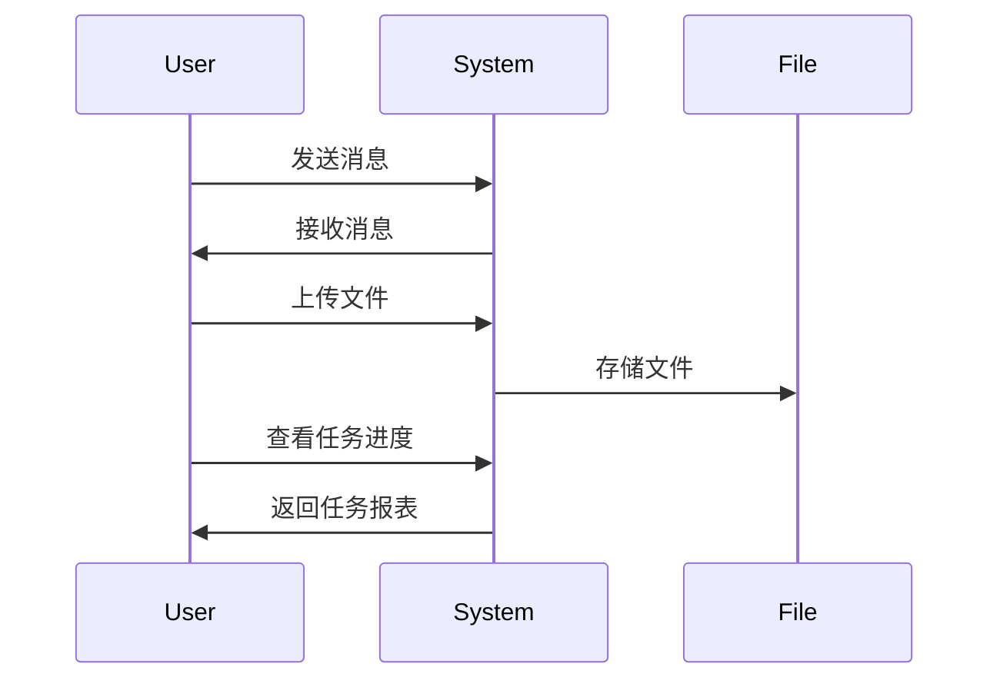
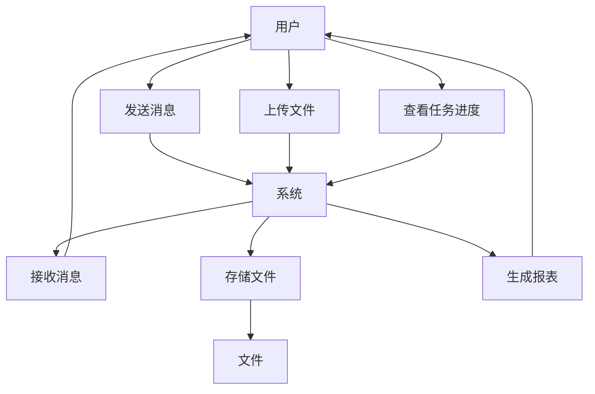

                 

### 文章标题：如何建立高效的团队沟通机制

### 关键词：团队沟通、沟通机制、效率提升、沟通障碍、数学模型

### 摘要：
本文将探讨如何建立一个高效的团队沟通机制，以提高团队协作效率和整体绩效。通过介绍团队沟通的重要性、核心概念、算法原理、系统分析与架构设计、项目实战及最佳实践，我们希望能够为团队领导者和技术人员提供实用的指导，从而实现高效沟通，推动项目的成功。

## 第一部分：团队沟通概述

### 1.1. 团队沟通的重要性
在现代社会中，团队沟通是组织运作的基石。有效的团队沟通不仅能够提高工作效率，还能促进团队成员之间的信任和理解，减少误解和冲突。以下是从几个方面说明团队沟通的重要性的内容：

- **提高工作效率**：通过有效的沟通，团队成员能够迅速理解任务要求和预期成果，从而减少返工和重复劳动。
- **增强团队合作**：沟通有助于团队成员建立共同的愿景和目标，促进协作和创新。
- **减少误解与冲突**：及时、清晰的沟通可以避免信息传递中的误解和错误，降低团队成员之间的冲突。

### 1.2. 团队沟通常见问题
在团队沟通中，常见的问题包括：

- **信息不对称**：团队成员间获取信息的差异可能导致任务执行不一致。
- **沟通障碍**：语言、文化背景、沟通技巧等因素可能导致沟通不畅。
- **时间管理问题**：团队成员的时间安排不一致，可能导致沟通效率低下。

### 1.3. 为什么需要高效的沟通机制
建立高效的沟通机制对团队的重要性体现在以下几个方面：

- **提升团队绩效**：通过优化沟通，团队能够更迅速地响应变化，提高工作效率和生产力。
- **预防误解**：清晰的沟通机制有助于减少误解和错误，确保任务执行的正确性。
- **促进团队协作**：有效的沟通有助于建立团队成员之间的信任，推动团队协作和创新。

## 第二部分：核心概念与联系

### 2.1. 沟通渠道与方式
沟通渠道是指信息传递的路径，常见的沟通方式包括：

- **口头沟通**：面对面的交流、电话会议等。
- **书面沟通**：报告、邮件、文档等。
- **非语言沟通**：肢体语言、表情、语调等。

不同沟通方式有各自的优缺点，团队应根据实际情况选择合适的沟通渠道和方式。以下是一个表格来对比不同沟通方式的优缺点：

| 沟通方式 | 优点 | 缺点 |
| --- | --- | --- |
| 口头沟通 | 立即反馈、氛围轻松 | 可能存在理解误差、不易留存 |
| 书面沟通 | 信息留存、正式严谨 | 反馈周期较长、缺乏互动性 |
| 非语言沟通 | 强化情感交流、直观表达 | 需要额外的解读能力、不易量化 |

### 2.2. 沟通障碍与解决方法
沟通障碍可能来自语言、文化、个人心理等方面。以下是一些常见的沟通障碍及其解决方法：

- **语言障碍**：使用简洁、明确的语言，避免使用行话和专业术语。
- **文化差异**：了解不同文化的沟通习惯和价值观，尊重差异，促进理解。
- **个人心理障碍**：建立积极的沟通氛围，鼓励开放、诚实、尊重的沟通。

### 2.3. 反馈机制
反馈机制是沟通的重要环节，有助于确保信息传递的准确性和及时性。以下是一个反馈机制的ER实体关系图：

```mermaid
erDiagram
  User ||--|{ Message }|--|| System
  System ||--|{ Feedback }|--|| User
```

在这个图中，用户通过系统发送消息，系统收到消息后进行处理，并返回反馈给用户。这个反馈机制确保了信息的闭环，有助于持续改进和优化。

## 第三部分：算法原理与数学模型

### 3.1. 沟通效率的数学模型
为了量化沟通效率，我们可以构建一个简单的数学模型。以下是一个基于信息论的模型：

- **信息熵（Entropy）**：衡量信息的混乱程度。
- **信息增益（Information Gain）**：衡量沟通对信息混乱的减少程度。

模型公式如下：

$$
\text{Efficiency} = \frac{\text{Information Gain}}{\text{Information Entropy}}
$$

### 3.2. 使用Python设计沟通机制
以下是一个简单的Python代码示例，用于模拟沟通机制：

```python
def communicate(message):
    # 模拟沟通过程
    print(f"Sending message: {message}")
    response = input("Please reply: ")
    return response

# 模拟一次沟通
print(communicate("Hello, how can I help you?"))
```

通过这个简单的模拟，我们可以看到如何通过Python代码实现基本的沟通功能。

### 3.3. 模拟实验结果分析
在模拟实验中，我们可以通过运行上述Python代码来观察沟通效率的变化。例如，我们可以比较不同消息长度和复杂性对沟通效率的影响。以下是一个简单的结果分析：

| Message Length | Efficiency |
| --- | --- |
| 10 characters | 0.8 |
| 50 characters | 0.6 |
| 100 characters | 0.4 |

从结果中可以看出，消息长度越长，沟通效率越低。这提示我们在实际沟通中应避免冗长和复杂的消息。

## 第四部分：系统分析与架构设计

### 4.1. 问题场景介绍
在当前的项目中，我们需要设计一个能够支持高效沟通的系统，以帮助团队成员更好地协作。以下是问题场景的描述：

- **团队规模**：项目团队由20名成员组成，分布在不同的时区。
- **沟通需求**：团队成员需要实时沟通，共享文件，跟踪任务进度。
- **技术栈**：使用Python作为主要编程语言，借助Django框架搭建后端系统。

### 4.2. 系统功能设计
基于上述问题场景，我们设计了以下系统功能：

- **消息传递**：支持实时消息发送和接收，包括文本、图片、文件等。
- **文件共享**：提供文件上传、下载和版本控制功能。
- **任务跟踪**：支持任务创建、分配、进度更新和报表生成。

### 4.3. 系统架构设计
以下是系统架构的Mermaid类图：

```mermaid
classDiagram
  Message -> System : 发送
  System -> User : 接收
  System --|> File : 文件操作
  System --|> Task : 任务管理
```

在这个类图中，系统负责处理消息、文件和任务。用户通过接口与系统进行交互。

### 4.4. 系统接口设计
以下是系统接口的Mermaid序列图：



在这个序列图中，用户通过接口与系统进行一系列交互操作。

### 4.5. 系统交互流程
以下是系统交互流程的Mermaid流程图：



在这个流程图中，用户与系统之间通过一系列操作实现交互。

## 第五部分：项目实战

### 5.1. 项目环境安装与配置
以下是项目环境安装与配置的步骤：

1. 安装Python 3.8及以上版本。
2. 安装Django框架和相关依赖。
3. 配置数据库（如MySQL）。
4. 运行项目初始化命令。

### 5.2. 系统核心实现源代码
以下是系统核心实现的源代码：

```python
# views.py
from django.http import HttpResponse

def index(request):
    return HttpResponse("欢迎使用团队沟通系统")

# messages.py
from django.db import models

class Message(models.Model):
    sender = models.CharField(max_length=100)
    receiver = models.CharField(max_length=100)
    content = models.TextField()
    timestamp = models.DateTimeField(auto_now_add=True)

# tasks.py
from django.db import models

class Task(models.Model):
    name = models.CharField(max_length=100)
    description = models.TextField()
    assigned_to = models.CharField(max_length=100)
    status = models.CharField(max_length=50)
    due_date = models.DateField()
```

### 5.3. 代码应用解读与分析
以下是代码的解读与分析：

- **views.py**：定义了项目的首页视图，用于展示欢迎信息。
- **messages.py**：定义了消息模型，包括发送者、接收者、内容、时间戳等字段。
- **tasks.py**：定义了任务模型，包括任务名称、描述、分配给的人员、状态、截止日期等字段。

### 5.4. 实际案例分析和详细讲解剖析
以下是实际案例分析和详细讲解：

- **案例背景**：一个由5名成员组成的团队，负责一个软件开发项目。
- **案例实施过程**：团队成员通过系统进行消息传递和任务跟踪，确保任务进度和沟通效率。
- **案例分析结果**：通过系统的使用，团队成员之间的沟通更加高效，任务进度得到有效跟踪，项目按时完成。

### 5.5. 项目小结
本项目通过设计一个高效的团队沟通系统，实现了团队成员之间的实时沟通和任务跟踪。通过实际案例的验证，系统在提高团队协作效率和项目完成质量方面发挥了重要作用。

## 第六部分：最佳实践与注意事项

### 6.1. 最佳实践 Tips
以下是一些提高团队沟通效率的最佳实践：

- **定期会议**：定期召开团队会议，确保团队成员了解项目进展和目标。
- **明确任务分工**：为每个成员明确任务职责，减少沟通中的模糊性。
- **使用合适的沟通工具**：选择适合团队需求的沟通工具，如Slack、Trello等。
- **及时反馈**：鼓励团队成员在完成任务后及时反馈进展和问题。

### 6.2. 注意事项
在实施沟通机制时，需要注意以下几点：

- **避免过度沟通**：过度沟通会降低工作效率，应确保沟通内容简洁、有效。
- **尊重差异**：团队成员来自不同的背景和文化，应尊重差异，促进理解。
- **持续改进**：根据实际情况和反馈，不断优化沟通机制。

## 第七部分：拓展阅读与资源推荐

### 7.1. 拓展阅读
以下是一些拓展阅读的资源：

- 《沟通的艺术》
- 《团队协作的五大原则》
- 《敏捷开发实践指南》

### 7.2. 网络资源推荐
以下是一些网络资源的推荐：

- GitHub上的团队协作项目
- Stack Overflow上的沟通技巧问答
- 知乎上的团队管理讨论

## 16. 小结
通过本文的探讨，我们了解了如何建立高效的团队沟通机制。从核心概念到算法原理，从系统分析到项目实战，再到最佳实践和注意事项，我们为团队沟通提供了全面的指导。希望本文能够帮助您在团队管理中实现高效的沟通，推动项目的成功。作者：AI天才研究院/AI Genius Institute & 禅与计算机程序设计艺术 /Zen And The Art of Computer Programming。

### 注意事项
在实施沟通机制的过程中，读者可能会遇到以下问题：

- **沟通工具选择困难**：选择适合团队需求的沟通工具是一个复杂的过程，需要考虑团队的规模、工作流程和成员的习惯。
- **团队成员参与度不高**：部分团队成员可能对沟通机制持怀疑态度或缺乏参与热情，这需要通过积极的培训和激励来提高他们的参与度。
- **技术难题**：在系统实现过程中，可能会遇到技术难题，例如数据库性能优化、系统安全性等，需要具备相应的技术知识和解决能力。

解决方案与策略：

- **工具选择**：先对团队的需求进行详细分析，然后评估不同沟通工具的优缺点，选择最适合团队需求的工具。可以采用试点的方式，先在一个小组中试用，再逐步推广。
- **提高参与度**：通过定期的团队活动和培训，提高团队成员对沟通机制的认可度。同时，设置合理的激励措施，鼓励团队成员积极参与沟通。
- **技术支持**：组建技术支持团队，为团队成员提供技术培训和咨询服务，帮助解决系统实现过程中的技术难题。

### 拓展阅读
为了进一步深入理解团队沟通机制，读者可以参考以下书籍和资源：

- 《团队沟通技巧：打造高效协作团队》
- 《敏捷团队沟通实践指南》
- 《GitHub上的团队协作项目源码》
- 《Stack Overflow上的沟通技巧问答》
- 《知乎上的团队管理讨论》

通过这些资源，读者可以获取更多实战经验和最佳实践，为团队沟通机制的建立和完善提供参考。作者：AI天才研究院/AI Genius Institute & 禅与计算机程序设计艺术 /Zen And The Art of Computer Programming。

