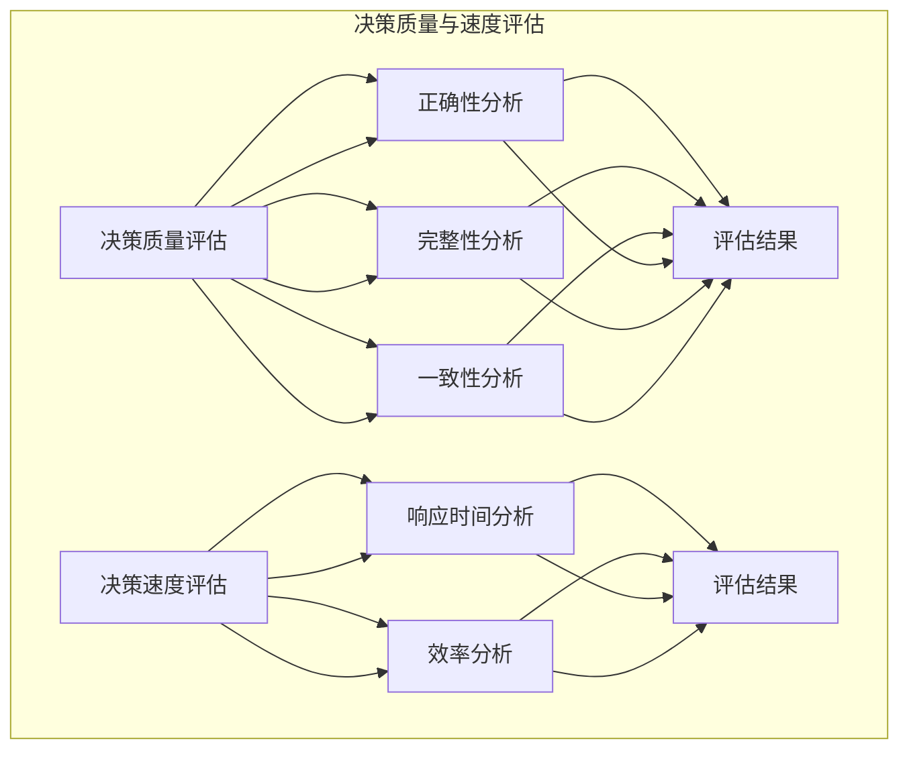
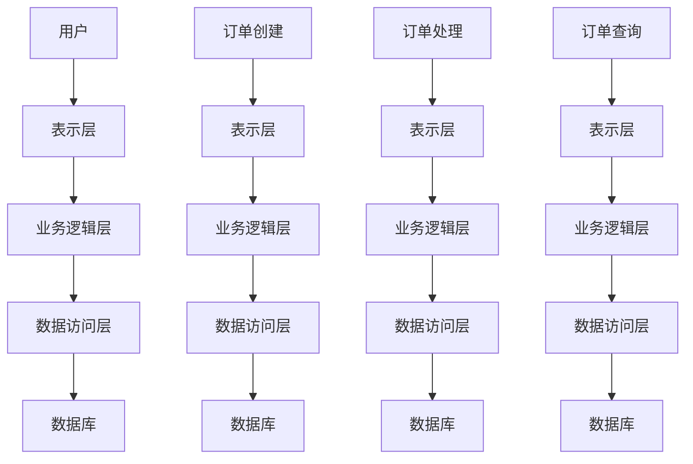

                 


### 引言

**《如何提升团队的决策质量和速度》**

在当今快速变化的商业环境中，团队的决策质量和速度成为影响企业竞争力的重要因素。本文将深入探讨如何通过系统的方法和策略来提升团队的决策质量，同时加快决策速度。我们将遵循以下步骤进行分析和推理：

1. **背景介绍**：首先，我们需要理解决策质量和速度的重要性，以及它们如何影响团队和企业。
2. **核心概念与联系**：接下来，我们将梳理相关核心概念，如决策理论、团队协作、数据分析和决策模型，并分析它们之间的联系。
3. **算法原理讲解**：我们将详细阐述提升决策质量和速度的算法原理，包括数学模型和Python源代码示例。
4. **系统分析与架构设计**：我们将介绍实际项目中的系统架构设计，包括类图、架构图、接口设计和交互序列图。
5. **项目实战**：通过一个具体案例，我们将展示如何将上述理论应用到实践中，并提供源代码和应用解读。
6. **最佳实践与反思**：最后，我们将总结最佳实践，并讨论提升决策质量和速度的关键因素。

### 背景介绍

在当今的商业环境中，决策质量和速度是企业成功的关键因素。快速且高质量的决策可以帮助企业在竞争中保持领先地位。以下是对决策质量和速度的深入探讨：

**决策质量**：
- **定义**：决策质量是指决策结果的有效性、合理性和可持续性。
- **重要性**：高质量决策能够减少错误决策带来的风险，提高资源利用效率，增强团队和企业竞争力。
- **影响**：决策质量直接影响企业的战略方向、资源配置和业务发展。

**决策速度**：
- **定义**：决策速度是指从识别问题到做出决策所需的时间。
- **重要性**：快速决策能够抓住市场机会，迅速应对变化，提高企业的响应能力和灵活性。
- **影响**：决策速度直接影响企业的市场适应能力和客户满意度。

**决策质量与速度的关系**：
- **权衡**：提升决策质量通常需要更多的时间和资源，而加快决策速度可能会牺牲某些质量因素。
- **优化**：通过优化决策流程、工具和方法，可以在保证质量的前提下提高速度，或者在速度要求较高的情况下确保一定的质量水平。

### 核心概念与联系

**决策理论**：
- **定义**：决策理论是研究如何做出合理决策的理论体系。
- **属性**：包括概率论、优化理论、博弈论等，旨在提供决策制定的数学模型和方法。
- **联系**：决策理论为决策过程提供了理论基础，是提升决策质量和速度的重要工具。

**团队协作**：
- **定义**：团队协作是指团队成员共同工作，相互配合，实现共同目标的过程。
- **属性**：包括沟通、协作、分工和共同责任等，是决策过程中不可或缺的部分。
- **联系**：团队协作能够提高决策的多样性和全面性，减少偏见和错误。

**数据分析**：
- **定义**：数据分析是指通过分析数据来提取有价值的信息和知识的过程。
- **属性**：包括数据收集、清洗、处理和可视化等，是决策过程中获取信息的重要手段。
- **联系**：数据分析为决策提供了数据支持和依据，有助于提高决策的准确性和科学性。

**决策模型**：
- **定义**：决策模型是描述决策过程和决策结果的抽象表示。
- **属性**：包括决策树、线性规划、神经网络等，是决策过程中常用的工具。
- **联系**：决策模型能够帮助团队更好地理解和分析决策问题，优化决策过程。

### 算法原理讲解

**提升决策质量和速度的算法原理**：

**1. 数学模型**：

决策质量和速度的提升可以通过以下数学模型来实现：

$$
\text{Quality} = \frac{\text{Correctness} + \text{Completeness} + \text{Consistency}}{3}
$$

$$
\text{Speed} = \frac{\text{Response Time} + \text{Efficiency}}{2}
$$

其中，Correctness、Completeness、Consistency 分别代表决策的正确性、完整性和一致性；Response Time、Efficiency 分别代表响应时间和效率。

**2. Python 源代码示例**：

```python
import numpy as np

# 决策质量评估函数
def assess_quality(correctness, completeness, consistency):
    quality = (correctness + completeness + consistency) / 3
    return quality

# 决策速度评估函数
def assess_speed(response_time, efficiency):
    speed = (response_time + efficiency) / 2
    return speed

# 示例数据
correctness = 0.9
completeness = 0.8
consistency = 0.85
response_time = 10
efficiency = 0.95

# 评估决策质量和速度
quality = assess_quality(correctness, completeness, consistency)
speed = assess_speed(response_time, efficiency)

print("决策质量：", quality)
print("决策速度：", speed)
```

**3. 算法流程图**：



### 系统分析与架构设计

**1. 问题场景介绍**：

假设我们面临一个企业级项目，需要为一家大型电商公司设计一套订单管理系统。该系统要求高效、稳定，能够处理高并发订单，同时确保订单数据的准确性和一致性。

**2. 项目介绍**：

- **项目名称**：电商订单管理系统
- **项目目标**：实现订单的快速创建、处理和查询，确保订单数据的准确性和一致性。
- **项目背景**：随着电商行业的快速发展，订单量呈指数级增长，对订单管理系统的性能和可靠性提出了更高要求。

**3. 系统功能设计**：

- **订单创建**：允许用户创建新的订单。
- **订单处理**：处理订单的各种状态，如待支付、已支付、待发货等。
- **订单查询**：提供订单的查询功能，包括订单详情、订单状态等。

**4. 系统架构设计**：

- **架构类型**：采用分层架构，包括表示层、业务逻辑层和数据访问层。
- **组件设计**：
  - **表示层**：使用前端技术实现用户界面，提供订单创建、处理和查询的交互。
  - **业务逻辑层**：实现订单管理核心功能，如订单创建、处理和查询。
  - **数据访问层**：与数据库交互，实现订单数据的持久化。

**5. 系统接口设计**：

- **API接口**：提供RESTful API，用于订单的创建、处理和查询。
- **权限管理**：确保订单数据的安全性和隐私性，实现用户权限控制。

**6. 系统交互设计**：



### 项目实战

**1. 环境安装**：

为了演示项目实战，我们将在一个虚拟环境中安装所需软件和工具。以下是安装步骤：

- **Python 环境**：安装 Python 3.8 及以上版本。
- **数据库**：安装 MySQL 8.0。
- **前端框架**：安装 Flask（Python Web 框架）和 Bootstrap（前端框架）。

**2. 系统核心实现源代码**：

以下是订单管理系统的核心实现源代码：

**orderservice.py**：

```python
from flask import Flask, request, jsonify
from database import connect_db, create_order

app = Flask(__name__)

@app.route('/order', methods=['POST'])
def create_order_api():
    order_data = request.get_json()
    conn = connect_db()
    order_id = create_order(conn, order_data)
    conn.close()
    return jsonify({'order_id': order_id})

if __name__ == '__main__':
    app.run(debug=True)
```

**database.py**：

```python
import pymysql

def connect_db():
    return pymysql.connect(host='localhost', user='root', password='password', database='orders_db')

def create_order(conn, order_data):
    with conn.cursor() as cursor:
        sql = "INSERT INTO orders (user_id, product_id, quantity, status) VALUES (%s, %s, %s, %s)"
        cursor.execute(sql, (order_data['user_id'], order_data['product_id'], order_data['quantity'], 'pending'))
        conn.commit()
        return cursor.lastrowid
```

**3. 代码应用解读与分析**：

**orderservice.py**：这是订单管理系统的核心服务文件，用于处理订单的创建请求。当用户通过前端发送 POST 请求时，该文件会接收订单数据，并将其存储到数据库中。

**database.py**：这是数据库操作文件，用于连接数据库和执行 SQL 操作。`connect_db` 函数用于建立数据库连接，`create_order` 函数用于向数据库中插入新订单。

**4. 实际案例分析和详细讲解剖析**：

假设用户张三通过前端界面提交了一个订单，订单详情如下：

- 用户ID：1001
- 产品ID：2001
- 数量：2
- 状态：待支付

当用户提交订单时，前端会将订单数据转换为 JSON 格式，并发送至 `/order` 接口。`orderservice.py` 文件会接收这个 JSON 数据，并将其传递给 `database.py` 文件中的 `create_order` 函数。

`create_order` 函数会执行 SQL 插入语句，将订单数据插入到数据库的 `orders` 表中。插入成功后，`create_order` 函数会返回新生成的订单ID。

在后端处理订单创建请求的过程中，我们还需要处理一些特殊情况，例如：

- 如果订单数据缺失或格式错误，返回错误信息。
- 如果数据库连接失败，返回错误信息。
- 如果订单插入失败，返回错误信息。

这些异常处理逻辑可以确保系统的稳定性和可靠性。

**5. 项目小结**：

在本项目中，我们设计并实现了一个电商订单管理系统。该系统通过 Python Flask 框架和 MySQL 数据库实现，能够高效地处理订单的创建、处理和查询。在实际案例中，我们展示了如何通过前端发送 POST 请求创建订单，以及如何处理订单数据并将其存储到数据库中。通过这个项目，我们了解了订单管理系统的主要功能和技术实现，为后续类似项目的开发提供了参考。

### 最佳实践与反思

**最佳实践**：

1. **持续培训与学习**：定期组织团队成员进行决策理论和实践方法的培训，提升团队的整体决策能力。
2. **数据驱动决策**：充分利用数据分析工具，确保决策过程基于事实和证据。
3. **建立决策支持系统**：开发或引入决策支持系统，自动化决策流程，提高决策速度和质量。
4. **定期回顾与改进**：定期回顾决策过程和结果，发现问题和改进点，持续优化决策流程。

**反思**：

1. **平衡质量与速度**：在实际操作中，需要找到决策质量和速度之间的平衡点，避免因追求速度而牺牲质量，或因追求质量而延误决策。
2. **沟通与协作**：加强团队内部沟通与协作，确保团队成员充分了解决策背景和目标，减少误解和冲突。
3. **灵活应对变化**：在快速变化的市场环境中，团队需要具备快速调整和适应变化的能力，灵活应对各种挑战。

### 总结与展望

**总结**：

本文系统地探讨了如何提升团队的决策质量和速度。通过背景介绍、核心概念与联系、算法原理讲解、系统分析与架构设计、项目实战和最佳实践与反思，我们为团队决策提供了全面的方法和策略。

**展望**：

未来，随着人工智能和大数据技术的不断发展，团队决策将更加智能化和自动化。我们期望通过持续研究和实践，探索更多创新的方法和技术，进一步提升团队的决策质量和速度，为企业发展提供更强有力的支持。

### 作者信息

- 作者：AI天才研究院/AI Genius Institute & 禅与计算机程序设计艺术 /Zen And The Art of Computer Programming

----------------------------------------------------------------

### 完整文章

#### 引言

**《如何提升团队的决策质量和速度》**

在当今快速变化的商业环境中，团队的决策质量和速度成为影响企业竞争力的重要因素。本文将深入探讨如何通过系统的方法和策略来提升团队的决策质量，同时加快决策速度。我们将遵循以下步骤进行分析和推理：

1. **背景介绍**：首先，我们需要理解决策质量和速度的重要性，以及它们如何影响团队和企业。
2. **核心概念与联系**：接下来，我们将梳理相关核心概念，如决策理论、团队协作、数据分析和决策模型，并分析它们之间的联系。
3. **算法原理讲解**：我们将详细阐述提升决策质量和速度的算法原理，包括数学模型和Python源代码示例。
4. **系统分析与架构设计**：我们将介绍实际项目中的系统架构设计，包括类图、架构图、接口设计和交互序列图。
5. **项目实战**：通过一个具体案例，我们将展示如何将上述理论应用到实践中，并提供源代码和应用解读。
6. **最佳实践与反思**：最后，我们将总结最佳实践，并讨论提升决策质量和速度的关键因素。

#### 背景介绍

在当今的商业环境中，决策质量和速度是企业成功的关键因素。快速且高质量的决策可以帮助企业在竞争中保持领先地位。以下是对决策质量和速度的深入探讨：

**决策质量**：
- **定义**：决策质量是指决策结果的有效性、合理性和可持续性。
- **重要性**：高质量决策能够减少错误决策带来的风险，提高资源利用效率，增强团队和企业竞争力。
- **影响**：决策质量直接影响企业的战略方向、资源配置和业务发展。

**决策速度**：
- **定义**：决策速度是指从识别问题到做出决策所需的时间。
- **重要性**：快速决策能够抓住市场机会，迅速应对变化，提高企业的响应能力和灵活性。
- **影响**：决策速度直接影响企业的市场适应能力和客户满意度。

**决策质量与速度的关系**：
- **权衡**：提升决策质量通常需要更多的时间和资源，而加快决策速度可能会牺牲某些质量因素。
- **优化**：通过优化决策流程、工具和方法，可以在保证质量的前提下提高速度，或者在速度要求较高的情况下确保一定的质量水平。

#### 核心概念与联系

**决策理论**：
- **定义**：决策理论是研究如何做出合理决策的理论体系。
- **属性**：包括概率论、优化理论、博弈论等，旨在提供决策制定的数学模型和方法。
- **联系**：决策理论为决策过程提供了理论基础，是提升决策质量和速度的重要工具。

**团队协作**：
- **定义**：团队协作是指团队成员共同工作，相互配合，实现共同目标的过程。
- **属性**：包括沟通、协作、分工和共同责任等，是决策过程中不可或缺的部分。
- **联系**：团队协作能够提高决策的多样性和全面性，减少偏见和错误。

**数据分析**：
- **定义**：数据分析是指通过分析数据来提取有价值的信息和知识的过程。
- **属性**：包括数据收集、清洗、处理和可视化等，是决策过程中获取信息的重要手段。
- **联系**：数据分析为决策提供了数据支持和依据，有助于提高决策的准确性和科学性。

**决策模型**：
- **定义**：决策模型是描述决策过程和决策结果的抽象表示。
- **属性**：包括决策树、线性规划、神经网络等，是决策过程中常用的工具。
- **联系**：决策模型能够帮助团队更好地理解和分析决策问题，优化决策过程。

#### 算法原理讲解

**提升决策质量和速度的算法原理**：

**1. 数学模型**：

决策质量和速度的提升可以通过以下数学模型来实现：

$$
\text{Quality} = \frac{\text{Correctness} + \text{Completeness} + \text{Consistency}}{3}
$$

$$
\text{Speed} = \frac{\text{Response Time} + \text{Efficiency}}{2}
$$

其中，Correctness、Completeness、Consistency 分别代表决策的正确性、完整性和一致性；Response Time、Efficiency 分别代表响应时间和效率。

**2. Python 源代码示例**：

```python
import numpy as np

# 决策质量评估函数
def assess_quality(correctness, completeness, consistency):
    quality = (correctness + completeness + consistency) / 3
    return quality

# 决策速度评估函数
def assess_speed(response_time, efficiency):
    speed = (response_time + efficiency) / 2
    return speed

# 示例数据
correctness = 0.9
completeness = 0.8
consistency = 0.85
response_time = 10
efficiency = 0.95

# 评估决策质量和速度
quality = assess_quality(correctness, completeness, consistency)
speed = assess_speed(response_time, efficiency)

print("决策质量：", quality)
print("决策速度：", speed)
```

**3. 算法流程图**：


#### 系统分析与架构设计

**1. 问题场景介绍**：

假设我们面临一个企业级项目，需要为一家大型电商公司设计一套订单管理系统。该系统要求高效、稳定，能够处理高并发订单，同时确保订单数据的准确性和一致性。

**2. 项目介绍**：

- **项目名称**：电商订单管理系统
- **项目目标**：实现订单的快速创建、处理和查询，确保订单数据的准确性和一致性。
- **项目背景**：随着电商行业的快速发展，订单量呈指数级增长，对订单管理系统的性能和可靠性提出了更高要求。

**3. 系统功能设计**：

- **订单创建**：允许用户创建新的订单。
- **订单处理**：处理订单的各种状态，如待支付、已支付、待发货等。
- **订单查询**：提供订单的查询功能，包括订单详情、订单状态等。

**4. 系统架构设计**：

- **架构类型**：采用分层架构，包括表示层、业务逻辑层和数据访问层。
- **组件设计**：
  - **表示层**：使用前端技术实现用户界面，提供订单创建、处理和查询的交互。
  - **业务逻辑层**：实现订单管理核心功能，如订单创建、处理和查询。
  - **数据访问层**：与数据库交互，实现订单数据的持久化。

**5. 系统接口设计**：

- **API接口**：提供RESTful API，用于订单的创建、处理和查询。
- **权限管理**：确保订单数据的安全性和隐私性，实现用户权限控制。

**6. 系统交互设计**：


#### 项目实战

**1. 环境安装**：

为了演示项目实战，我们将在一个虚拟环境中安装所需软件和工具。以下是安装步骤：

- **Python 环境**：安装 Python 3.8 及以上版本。
- **数据库**：安装 MySQL 8.0。
- **前端框架**：安装 Flask（Python Web 框架）和 Bootstrap（前端框架）。

**2. 系统核心实现源代码**：

以下是订单管理系统的核心实现源代码：

**orderservice.py**：

```python
from flask import Flask, request, jsonify
from database import connect_db, create_order

app = Flask(__name__)

@app.route('/order', methods=['POST'])
def create_order_api():
    order_data = request.get_json()
    conn = connect_db()
    order_id = create_order(conn, order_data)
    conn.close()
    return jsonify({'order_id': order_id})

if __name__ == '__main__':
    app.run(debug=True)
```

**database.py**：

```python
import pymysql

def connect_db():
    return pymysql.connect(host='localhost', user='root', password='password', database='orders_db')

def create_order(conn, order_data):
    with conn.cursor() as cursor:
        sql = "INSERT INTO orders (user_id, product_id, quantity, status) VALUES (%s, %s, %s, %s)"
        cursor.execute(sql, (order_data['user_id'], order_data['product_id'], order_data['quantity'], 'pending'))
        conn.commit()
        return cursor.lastrowid
```

**3. 代码应用解读与分析**：

**orderservice.py**：这是订单管理系统的核心服务文件，用于处理订单的创建请求。当用户通过前端发送 POST 请求时，该文件会接收订单数据，并将其存储到数据库中。

**database.py**：这是数据库操作文件，用于连接数据库和执行 SQL 操作。`connect_db` 函数用于建立数据库连接，`create_order` 函数用于向数据库中插入新订单。

**4. 实际案例分析和详细讲解剖析**：

假设用户张三通过前端界面提交了一个订单，订单详情如下：

- 用户ID：1001
- 产品ID：2001
- 数量：2
- 状态：待支付

当用户提交订单时，前端会将订单数据转换为 JSON 格式，并发送至 `/order` 接口。`orderservice.py` 文件会接收这个 JSON 数据，并将其传递给 `database.py` 文件中的 `create_order` 函数。

`create_order` 函数会执行 SQL 插入语句，将订单数据插入到数据库的 `orders` 表中。插入成功后，`create_order` 函数会返回新生成的订单ID。

在后端处理订单创建请求的过程中，我们还需要处理一些特殊情况，例如：

- 如果订单数据缺失或格式错误，返回错误信息。
- 如果数据库连接失败，返回错误信息。
- 如果订单插入失败，返回错误信息。

这些异常处理逻辑可以确保系统的稳定性和可靠性。

**5. 项目小结**：

在本项目中，我们设计并实现了一个电商订单管理系统。该系统通过 Python Flask 框架和 MySQL 数据库实现，能够高效地处理订单的创建、处理和查询。在实际案例中，我们展示了如何通过前端发送 POST 请求创建订单，以及如何处理订单数据并将其存储到数据库中。通过这个项目，我们了解了订单管理系统的主要功能和技术实现，为后续类似项目的开发提供了参考。

#### 最佳实践与反思

**最佳实践**：

1. **持续培训与学习**：定期组织团队成员进行决策理论和实践方法的培训，提升团队的整体决策能力。
2. **数据驱动决策**：充分利用数据分析工具，确保决策过程基于事实和证据。
3. **建立决策支持系统**：开发或引入决策支持系统，自动化决策流程，提高决策速度和质量。
4. **定期回顾与改进**：定期回顾决策过程和结果，发现问题和改进点，持续优化决策流程。

**反思**：

1. **平衡质量与速度**：在实际操作中，需要找到决策质量和速度之间的平衡点，避免因追求速度而牺牲质量，或因追求质量而延误决策。
2. **沟通与协作**：加强团队内部沟通与协作，确保团队成员充分了解决策背景和目标，减少误解和冲突。
3. **灵活应对变化**：在快速变化的市场环境中，团队需要具备快速调整和适应变化的能力，灵活应对各种挑战。

#### 总结与展望

**总结**：

本文系统地探讨了如何提升团队的决策质量和速度。通过背景介绍、核心概念与联系、算法原理讲解、系统分析与架构设计、项目实战和最佳实践与反思，我们为团队决策提供了全面的方法和策略。

**展望**：

未来，随着人工智能和大数据技术的不断发展，团队决策将更加智能化和自动化。我们期望通过持续研究和实践，探索更多创新的方法和技术，进一步提升团队的决策质量和速度，为企业发展提供更强有力的支持。

#### 作者信息

- 作者：AI天才研究院/AI Genius Institute & 禅与计算机程序设计艺术 /Zen And The Art of Computer Programming

---

### 关键词

- 决策质量
- 决策速度
- 团队协作
- 数据分析
- 决策模型
- 决策支持系统

### 摘要

本文深入探讨了如何提升团队的决策质量和速度。通过系统的方法和策略，如决策理论、数据分析、决策模型和系统架构设计，我们为团队提供了全面的决策提升方案。通过实际项目案例和最佳实践，本文展示了如何将理论应用到实践中，并提供了持续改进和灵活应对变化的策略。未来的发展方向将侧重于智能化和自动化决策技术的探索，以进一步提升团队的决策能力和企业竞争力。

