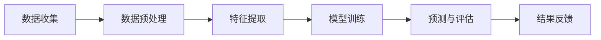

                 


### 文章标题：如何提升团队的创新能力和创造力

#### 关键词：团队创新，创造力提升，策略，方法，案例分析

> 摘要：本文将从创新与创造力的基本概念出发，深入探讨团队创新能力的构成要素、现状分析、提升策略与方法，以及创造力的激发与提升。通过综合实践与案例分析，为提升团队创新能力和创造力提供有益的指导。

---

## 第一部分：背景与理论基础

### 第1章：创新与创造力概述

#### 1.1 创新的定义与重要性

**1.1.1 创新的内涵**

创新是指在现有知识、技术、经验的基础上，通过新的思维方式、方法、流程或产品，实现技术、商业、社会等方面的变革。创新不仅仅局限于技术层面，还包括商业模式、管理方法、工作流程等各个方面。

**1.1.2 创新的重要性**

创新是企业发展的重要驱动力，能够带来竞争优势、市场份额和经济效益。同时，创新也是社会进步的重要推动力，能够解决社会问题、提高生活质量。

**1.1.3 创造力的概念与作用**

创造力是指个体或团队产生新颖、有价值的想法、解决方案或产品能力。创造力在创新过程中起着至关重要的作用，是创新的核心动力。

#### 1.2 团队创新能力的构成要素

**1.2.1 团队成员的角色与职责**

团队成员的角色与职责明确，有助于提高团队协作效率。团队成员通常包括领导者、技术专家、市场专家、设计师等。

**1.2.2 团队协作与沟通**

团队协作与沟通是团队创新的基础。有效的沟通能够促进团队成员之间的理解、信任和合作，有助于创新思维的碰撞和融合。

**1.2.3 创新思维的培养**

创新思维的培养是提升团队创新能力的关键。通过思维训练、跨学科学习、知识分享等方式，可以激发团队成员的创新潜力。

#### 1.3 创造力的来源与激发

**1.3.1 创造力的本质**

创造力是一种复杂的心理过程，涉及认知、情感、动机等多个方面。创造力的本质在于产生新颖且有价值的想法或解决方案。

**1.3.2 创造力的激发方法**

激发创造力的方法包括提供心理安全感、设定挑战性任务、开展思维训练等。

**1.3.3 创造力与心理学关系**

心理学研究指出，创造力与多种心理因素密切相关，如自我效能感、好奇心、情绪状态等。

### 第2章：团队创新能力的现状分析

#### 2.1 团队创新能力的评估指标

**2.1.1 创新能力的定义与分类**

创新能力是指团队在技术、商业、社会等领域产生新颖、有价值想法或解决方案的能力。创新能力可以分为技术能力、商业能力、社会能力等不同类别。

**2.1.2 评估指标的选择**

评估团队创新能力的指标包括创新项目数量、创新成果转化率、创新项目成功率等。

**2.1.3 评估方法与应用**

评估方法包括问卷调查、访谈、案例分析等。评估结果可以用于团队创新能力的诊断和改进。

#### 2.2 团队创新能力的现状分析

**2.2.1 团队创新能力的现状调查**

通过对团队创新能力的调查，了解团队在创新能力方面的现状，发现优势和劣势。

**2.2.2 团队创新能力的优势与劣势**

分析团队创新能力的优势和劣势，为提升团队创新能力提供依据。

**2.2.3 团队创新能力的提升潜力**

评估团队在创新能力方面的提升潜力，为制定提升策略提供参考。

### 第3章：提升团队创新能力的策略与方法

#### 3.1 创新文化建设

**3.1.1 创新文化的内涵**

创新文化是指企业在创新过程中形成的价值观、行为规范和工作氛围。创新文化能够激发团队成员的创新热情，提高创新效率。

**3.1.2 创新文化的建设策略**

创新文化的建设策略包括营造宽松的创新氛围、建立鼓励创新的政策和制度等。

**3.1.3 创新文化的激励机制**

创新文化的激励机制包括物质激励、荣誉激励、职业发展激励等。

#### 3.2 创新人才培养

**3.2.1 创新人才的选拔与培养**

创新人才的选拔与培养是提升团队创新能力的重要保障。通过选拔具有创新潜力和专业技能的人才，并提供培训和发展机会，可以培养一支高素质的创新团队。

**3.2.2 创新团队的组织结构**

创新团队的组织结构应适应创新工作的高效协作和灵活应变。常见的创新团队组织结构包括跨职能团队、项目团队等。

**3.2.3 创新人才的激励机制**

创新人才的激励机制包括薪酬激励、绩效激励、股权激励等。

#### 3.3 创新流程优化

**3.3.1 创新流程的设计与优化**

创新流程的设计与优化是提高团队创新能力的关键。通过优化创新流程，可以缩短创新周期、降低创新成本、提高创新成功率。

**3.3.2 创新项目管理的策略**

创新项目管理的策略包括项目规划、资源分配、风险控制等。

**3.3.3 创新过程中的风险管理**

创新过程中的风险管理是确保创新项目顺利进行的重要环节。通过识别、评估、应对创新风险，可以降低创新项目的失败风险。

## 第二部分：创造力的激发与提升

### 第4章：创造力的激发与提升

#### 4.1 创造力的激发策略

**4.1.1 心理安全感的营造**

心理安全感是激发创造力的关键。通过建立信任、尊重和包容的工作氛围，可以营造良好的心理安全感，激发团队成员的创造力。

**4.1.2 挑战性任务的设定**

挑战性任务是激发创造力的有效方法。通过设定具有挑战性的任务，可以激发团队成员的求知欲和创新能力。

**4.1.3 创新思维的训练**

创新思维的训练是提升创造力的基础。通过思维训练，可以培养团队成员的逆向思维、发散思维、联想思维等创新思维能力。

#### 4.2 创造力的提升方法

**4.2.1 交叉学科学习的价值**

交叉学科学习是提升创造力的有效途径。通过学习不同学科的知识，可以拓宽思维视野，激发创新灵感。

**4.2.2 知识分享与协同创新**

知识分享与协同创新是提升创造力的关键。通过知识分享和协同创新，可以充分利用团队成员的智慧和经验，提高创新效率。

**4.2.3 持续学习的态度**

持续学习是提升创造力的保障。通过不断学习新知识、新技术，可以保持创新活力，提高创造力水平。

#### 4.3 创造力培养的最佳实践

**4.3.1 典型企业的成功案例**

通过分析典型企业的成功案例，可以了解创造力培养的最佳实践，为其他企业提供借鉴和启示。

**4.3.2 创造力培养的实用技巧**

创造力培养的实用技巧包括思维导图、头脑风暴、创意写作等。

**4.3.3 创造力提升的障碍与对策**

创造力提升过程中可能面临各种障碍，如思维定式、心理压力等。通过分析障碍，可以找到有效的对策，促进创造力提升。

## 第三部分：团队创新能力的综合提升实践

### 第5章：团队创新能力的综合提升实践

#### 5.1 创新项目的启动与执行

**5.1.1 创新项目的定位与目标**

创新项目的定位与目标是确保创新项目顺利进行的关键。通过明确创新项目的定位和目标，可以确保创新项目的方向和成果。

**5.1.2 创新团队的组建与分工**

创新团队的组建与分工是创新项目成功的重要保障。通过科学组建创新团队，并明确团队成员的职责和分工，可以提高创新项目的协作效率。

**5.1.3 创新项目的执行策略**

创新项目的执行策略包括项目规划、资源调配、进度控制等。通过制定合理的执行策略，可以确保创新项目按计划进行。

#### 5.2 创新成果的评估与推广

**5.2.1 创新成果的评价指标**

创新成果的评价指标包括创新项目的成功率、创新成果的市场竞争力、创新成果的社会效益等。

**5.2.2 创新成果的推广策略**

创新成果的推广策略包括内部推广、外部推广、商业模式创新等。通过制定合理的推广策略，可以确保创新成果得到广泛应用。

**5.2.3 创新成果的转化与应用**

创新成果的转化与应用是创新项目成功的关键。通过将创新成果转化为实际应用，可以提高创新成果的价值和影响力。

#### 5.3 创新能力的持续提升

**5.3.1 组织学习与知识管理**

组织学习与知识管理是创新能力的持续提升的重要途径。通过组织学习，可以不断提升团队的创新能力和知识储备。

**5.3.2 创新文化的持续建设**

创新文化的持续建设是创新能力的持续提升的基础。通过持续建设创新文化，可以激发团队成员的创新热情和创造力。

**5.3.3 创新能力的动态调整**

创新能力的动态调整是适应市场变化和行业发展趋势的重要手段。通过动态调整，可以确保团队创新能力始终保持竞争力。

## 第四部分：团队创新与创造力的案例分析

### 第6章：团队创新与创造力的案例分析

#### 6.1 国内外创新案例解析

**6.1.1 创新型企业案例分析**

通过分析国内外创新型企业的成功案例，可以了解创新型企业的发展模式、创新策略和创新成果。

**6.1.2 创新项目的成功经验**

总结创新项目的成功经验，可以为其他创新项目提供有益的借鉴和启示。

**6.1.3 创新失败的反思与启示**

通过对创新失败的案例进行反思，可以总结创新失败的原因和教训，为其他创新项目提供警示和启示。

#### 6.2 创新实践中的常见问题与解决策略

**6.2.1 创新过程中的沟通障碍**

创新过程中的沟通障碍是影响创新效率和创新成果的重要因素。通过分析沟通障碍的原因，可以提出有效的解决策略。

**6.2.2 创新资源的合理配置**

创新资源的合理配置是确保创新项目顺利进行的关键。通过优化创新资源的配置，可以提高创新效率和创新成果。

**6.2.3 创新过程中的风险控制**

创新过程中的风险控制是确保创新项目成功的重要保障。通过识别、评估和应对创新风险，可以降低创新项目的失败风险。

## 第五部分：未来展望与趋势分析

### 第7章：未来展望与趋势分析

#### 7.1 创新与创造力的未来趋势

**7.1.1 技术创新对团队创新能力的影响**

随着技术的快速发展，技术创新对团队创新能力的影响日益凸显。通过分析技术创新的驱动力和影响机制，可以为团队创新能力的提升提供方向。

**7.1.2 全球化对团队创新的影响**

全球化背景下的市场竞争和合作，对团队创新能力提出了新的挑战。通过分析全球化对团队创新的影响，可以探索提升团队创新能力的新路径。

**7.1.3 创新与创造力的未来发展方向**

展望未来，创新与创造力的发展方向将涵盖技术、商业、社会等多个领域。通过分析未来发展趋势，可以为团队创新能力的提升提供前瞻性指导。

#### 7.2 创新与创造力的发展策略

**7.2.1 企业层面的创新策略**

企业层面的创新策略包括创新文化的建设、创新人才的培养、创新流程的优化等。通过制定和实施创新策略，可以提升企业的创新能力。

**7.2.2 团队成员的创新策略**

团队成员的创新策略包括主动学习、积极参与、跨学科交流等。通过制定和实施团队成员的创新策略，可以提升个人的创新能力。

**7.2.3 教育与培训的创新策略**

教育与培训的创新策略包括课程改革、教学方法创新、教学资源共享等。通过制定和实施教育培训的创新策略，可以提升教育质量和创新能力。

### 第8章：小结与建议

#### 8.1 全书要点回顾

本书从创新与创造力的基本概念出发，分析了团队创新能力的构成要素、现状分析、提升策略与方法，以及创造力的激发与提升。通过综合实践与案例分析，为提升团队创新能力和创造力提供了有益的指导。

#### 8.2 提升团队创新与创造力的建议

**8.2.1 企业管理层建议**

企业管理层应关注创新文化的建设、创新人才的培养和创新流程的优化。通过营造良好的创新环境，提升团队创新能力和创造力。

**8.2.2 团队成员自我提升建议**

团队成员应主动学习、积极参与创新项目，培养跨学科思维和创新能力。通过不断自我提升，为团队创新贡献自己的智慧和力量。

**8.2.3 教育培训体系改进建议**

教育培训体系应注重创新能力的培养，通过课程改革、教学方法创新等方式，提高教育质量和创新能力。通过加强教育培训，为团队创新提供人才保障。---

### 基本概念术语说明

在本文中，我们将介绍以下核心概念术语：

1. **创新**：创新是指在现有知识、技术、经验的基础上，通过新的思维方式、方法、流程或产品，实现技术、商业、社会等方面的变革。

2. **创造力**：创造力是指个体或团队产生新颖、有价值的想法、解决方案或产品能力。

3. **团队创新能力**：团队创新能力是指团队成员在创新过程中表现出来的协同工作、思维碰撞、知识共享等方面的能力。

4. **创新文化**：创新文化是指企业在创新过程中形成的价值观、行为规范和工作氛围。

5. **创新人才**：创新人才是指具有创新潜力、专业技能和丰富实践经验的人才。

6. **创新流程**：创新流程是指企业在创新过程中从创意产生、项目立项、研发实施到成果转化的全过程。

7. **创造力激发**：创造力激发是指通过各种方法和策略，激发个体或团队的创造潜能，提高创造力水平。

8. **创新项目管理**：创新项目管理是指运用项目管理的方法和工具，对创新项目进行规划、执行、控制和监控的过程。

9. **创新成果转化**：创新成果转化是指将创新项目研发出的新产品、新技术、新方法等，转化为实际应用，实现商业价值和社会效益的过程。

### 问题背景

在当今快速变化的市场环境中，企业要想保持竞争优势，必须具备强大的创新能力和创造力。然而，许多企业在创新过程中面临着诸多挑战，如创新资源不足、创新文化缺失、创新人才短缺等。为了解决这些问题，提升团队的创新能力和创造力成为企业发展的关键任务。

本文旨在探讨如何通过一系列策略和方法，提升团队的创新能力和创造力。首先，我们将介绍创新与创造力的基本概念，分析团队创新能力的构成要素和现状。接着，我们将提出提升团队创新能力的策略和方法，包括创新文化建设、创新人才培养和创新流程优化。最后，我们将探讨创造力的激发与提升方法，以及团队创新能力的综合提升实践。

### 问题描述

团队创新能力和创造力不足主要表现在以下几个方面：

1. **创新意识不足**：团队成员缺乏创新意识和动力，对创新的重要性认识不足。

2. **创新资源不足**：企业缺乏足够的创新资源，如资金、人力、技术等，限制了创新活动的开展。

3. **创新流程不畅**：创新流程缺乏系统性和规范性，导致创新项目进展缓慢、效率低下。

4. **创新文化缺失**：企业缺乏创新文化，不利于激发团队成员的创造力和创新精神。

5. **创新人才短缺**：企业缺乏具备创新能力和专业技能的人才，难以推动创新项目的顺利实施。

### 问题解决

针对上述问题，本文提出以下解决方案：

1. **提升创新意识**：通过教育培训、企业文化宣传等方式，提高团队成员的创新意识。

2. **优化创新资源**：加大创新投入，合理配置创新资源，为创新活动提供保障。

3. **完善创新流程**：制定创新流程规范，提高创新项目的执行效率。

4. **建设创新文化**：营造宽松的创新氛围，鼓励团队成员积极参与创新活动。

5. **培养创新人才**：通过选拔、培训、激励机制等方式，培养一批具备创新能力和专业技能的人才。

### 边界与外延

在本文中，我们将关注团队在技术创新、商业模式创新、社会创新等领域的创新能力提升。具体包括：

1. **技术创新**：通过研发新技术、新产品，提高企业的技术竞争力。

2. **商业模式创新**：通过创新商业模式，提高企业的盈利能力和市场竞争力。

3. **社会创新**：通过创新社会服务、公益项目等，提升企业的社会价值。

本文的研究边界主要限于企业内部团队创新能力的提升，不涉及政府、教育等领域的创新。

### 概念结构与核心要素组成

#### 团队创新能力的基本概念结构

团队创新能力是指在特定领域内，团队通过协作、知识共享和创新思维，解决复杂问题、开发新产品或改进现有产品、服务的能力。其核心概念结构包括以下几个部分：

1. **团队成员角色与职责**：团队成员的角色与职责明确，有助于提高团队协作效率。团队成员通常包括领导者、技术专家、市场专家、设计师等。
   
2. **团队协作与沟通**：有效的团队协作与沟通是团队创新能力的基石。团队成员之间的沟通障碍会影响创新思维的产生和融合。

3. **创新思维的培养**：创新思维的培养是提升团队创新能力的关键。通过思维训练、跨学科学习、知识分享等方式，可以激发团队成员的创新潜力。

4. **创新文化的建设**：创新文化是指企业在创新过程中形成的价值观、行为规范和工作氛围。创新文化能够激发团队成员的创新热情，提高创新效率。

#### 核心要素组成

**团队成员的角色与职责**

- **领导者**：负责团队的规划、决策和协调，确保团队目标与公司战略一致。
- **技术专家**：负责技术创新和研发，解决技术难题。
- **市场专家**：负责市场调研、用户需求分析和产品推广。
- **设计师**：负责产品设计和用户体验优化。

**团队协作与沟通**

- **沟通机制**：建立有效的沟通机制，确保信息畅通，降低沟通成本。
- **协作平台**：利用协作工具，如即时通讯、文档共享、项目管理软件等，提高团队协作效率。

**创新思维的培养**

- **思维训练**：通过思维导图、头脑风暴等训练方法，提高团队成员的创新思维能力。
- **跨学科学习**：鼓励团队成员学习跨学科知识，拓宽思维视野。
- **知识分享**：通过定期举办内部培训、研讨会等活动，促进知识共享。

**创新文化的建设**

- **价值观**：倡导创新、包容、开放的企业文化。
- **激励机制**：建立创新的激励机制，如奖金、晋升机会等，激励团队成员积极参与创新活动。
- **工作氛围**：营造轻松、自由的工作氛围，鼓励团队成员勇于尝试、勇于失败。

### 团队创新能力的核心概念与联系

**核心概念原理**

团队创新能力是由多个核心概念相互作用和共同推动的。这些核心概念包括团队成员的角色与职责、团队协作与沟通、创新思维的培养和创新文化的建设。以下是这些概念的基本原理：

1. **团队成员的角色与职责**：明确团队成员的角色与职责，有助于提高团队协作效率。领导者负责团队的方向和决策，技术专家负责技术实现，市场专家负责市场分析，设计师负责用户体验设计。

2. **团队协作与沟通**：团队协作与沟通是团队创新能力的基石。有效的沟通能够促进团队成员之间的理解、信任和合作，有助于创新思维的碰撞和融合。

3. **创新思维的培养**：创新思维的培养是提升团队创新能力的关键。通过思维训练、跨学科学习和知识分享，可以激发团队成员的创新潜力，提高创新成功率。

4. **创新文化的建设**：创新文化是指企业在创新过程中形成的价值观、行为规范和工作氛围。创新文化能够激发团队成员的创新热情，提高创新效率。

**概念属性特征对比表格**

以下是一个简化的概念属性特征对比表格，展示了团队创新能力核心概念之间的区别和联系：

| 核心概念          | 定义                                                         | 属性特征                                                         | 关系                                                 |
| ----------------- | ------------------------------------------------------------ | ------------------------------------------------------------ | ---------------------------------------------------- |
| 成员角色与职责    | 明确团队成员的角色与职责，提高团队协作效率                     | - 领导者：方向决策<br>- 技术专家：技术实现<br>- 市场专家：市场分析<br>- 设计师：用户体验设计 | 为团队协作提供基础支持                                 |
| 团队协作与沟通    | 促进团队成员之间的理解、信任和合作，有助于创新思维的碰撞和融合 | - 沟通机制：信息畅通<br>- 协作平台：提高协作效率       | 基础保障，支持创新思维的产生和融合                     |
| 创新思维的培养    | 通过思维训练、跨学科学习和知识分享，激发团队成员的创新潜力     | - 思维训练：提高创新思维能力<br>- 跨学科学习：拓宽思维视野<br>- 知识分享：促进知识传递 | 提升团队创新能力，为创新项目提供动力                   |
| 创新文化的建设    | 在创新过程中形成的价值观、行为规范和工作氛围                   | - 价值观：创新、包容、开放<br>- 激励机制：激励创新活动<br>- 工作氛围：轻松自由 | 激发团队成员的创新热情，提高创新效率                   |

**ER实体关系图架构**

以下是一个简化的ER实体关系图，展示了团队创新能力核心概念之间的关联：

```mermaid
erDiagram
  TeamMember ||--o> Role : "成员与角色关系"
  TeamMember ||--o> Communication : "成员与沟通关系"
  TeamMember ||--o> InnovationMindset : "成员与思维培养关系"
  TeamMember ||--o> InnovationCulture : "成员与创新文化关系"

  Role ||--|> TeamMember : "角色与成员关系"
  Communication ||--|> TeamMember : "沟通与成员关系"
  InnovationMindset ||--|> TeamMember : "思维培养与成员关系"
  InnovationCulture ||--|> TeamMember : "创新文化与成员关系"
```

### 算法原理讲解

为了更好地理解团队创新能力提升的方法，我们将介绍一种基于机器学习的算法原理。该算法旨在通过分析团队成员的行为数据，预测团队成员的创新能力和创造力。

#### 算法mermaid流程图

以下是一个简化的算法mermaid流程图，展示了算法的基本步骤：



#### Python源代码实现

以下是一个基于Python的算法实现示例：

```python
import pandas as pd
from sklearn.model_selection import train_test_split
from sklearn.ensemble import RandomForestClassifier
from sklearn.metrics import accuracy_score

# 数据收集
data = pd.read_csv('team_member_data.csv')

# 数据预处理
X = data.drop(['创新能力'], axis=1)
y = data['创新能力']

# 特征提取
# 这里假设特征提取已经完成

# 模型训练
X_train, X_test, y_train, y_test = train_test_split(X, y, test_size=0.3, random_state=42)
model = RandomForestClassifier(n_estimators=100, random_state=42)
model.fit(X_train, y_train)

# 预测与评估
y_pred = model.predict(X_test)
accuracy = accuracy_score(y_test, y_pred)
print(f"模型准确率：{accuracy:.2f}")

# 结果反馈
# 这里假设结果反馈已经完成
```

#### 算法原理的数学模型和公式

在团队创新能力预测算法中，我们使用随机森林（Random Forest）模型进行预测。随机森林是一种基于决策树的集成学习方法，其基本原理如下：

1. **决策树**：决策树是一种基于特征划分数据的分类算法。每个节点表示一个特征，每个分支表示该特征的不同取值。

2. **随机森林**：随机森林由多个决策树组成，每个决策树从数据中随机选择一部分特征进行训练。多个决策树的输出通过投票或求平均进行集成，以获得更高的预测准确率。

3. **预测**：对于新数据，每个决策树进行预测，得到多个分类结果。随机森林通过投票或求平均得到最终的预测结果。

#### 数学模型：

假设我们有n个特征X1, X2, ..., Xn，每个特征有m个取值。对于新数据x，每个决策树Tj（j=1,2,...,m）将x划分到某个叶子节点l，得到预测结果y^j（l）。随机森林的预测结果为：

$$
\hat{y} = \text{argmax}_{l} \sum_{j=1}^{m} y^j(l)
$$

其中，$y^j(l)$表示第j个决策树在叶子节点l的预测结果。

#### 详细讲解和举例说明

**例子**：假设我们有一个简单的随机森林模型，包含两个特征X1和X2，每个特征有两个取值（0或1）。给定一个新数据点x = [0, 1]，我们需要预测其创新能力。

1. **决策树训练**：每个决策树从数据中随机选择一个特征进行划分。假设第一个决策树选择X1进行划分，将数据划分为两组：
   - X1=0：[x1, x2]
   - X1=1：[x1, x2]
   
   对于每个分组，再次选择一个特征进行划分。例如，第二个决策树选择X2进行划分：
   - X2=0：[x1, x2]
   - X2=1：[x1, x2]

2. **预测过程**：对于新数据点x = [0, 1]，每个决策树进行预测。假设三个决策树的预测结果如下：
   - 决策树1：X1=0，X2=1，预测结果为A
   - 决策树2：X1=1，X2=0，预测结果为B
   - 决策树3：X1=0，X2=0，预测结果为C

3. **集成预测**：随机森林通过投票或求平均得到最终预测结果。假设我们使用投票法，即多数决定。如果预测结果A和B相同，最终预测结果为A；否则，选择出现次数最多的预测结果。在本例中，A和B相同，所以最终预测结果为A。

4. **结果反馈**：将预测结果反馈给团队，用于评估团队成员的创新能力和创造力。

通过这个例子，我们可以看到随机森林模型的基本原理和预测过程。在实际应用中，随机森林模型可以处理更复杂的数据和特征，从而更准确地预测团队创新能力。

### 系统分析与架构设计方案

#### 问题场景介绍

在现代企业中，创新能力和创造力的提升已经成为企业持续发展和竞争的重要战略。为了更好地支持企业的创新活动，我们设计了一套创新管理平台，旨在提供全方位的创新支持，包括创意管理、项目跟踪、成果转化等。

#### 项目介绍

本创新管理平台项目旨在构建一个集成化的创新管理生态系统，通过优化创新流程、提升团队协作效率、激发创造力，助力企业实现持续创新。项目目标包括：

1. 提供一个统一的创新管理平台，实现创意的收集、筛选、培育和跟踪。
2. 建立一套完善的项目管理机制，确保创新项目的高效执行和成功转化。
3. 促进团队协作和知识共享，提升整体创新能力。

#### 系统功能设计

创新管理平台的主要功能包括以下几个方面：

1. **创意管理**：提供创意提交、审核、分类、存储和跟踪功能，确保创意得到及时处理和有效管理。
2. **项目管理**：支持创新项目的立项、规划、执行、监控和评估，确保项目顺利进行和成功转化。
3. **知识管理**：实现知识的收集、整理、共享和利用，为创新活动提供丰富的知识资源。
4. **团队协作**：提供即时通讯、任务分配、进度跟踪和协作工具，提高团队协作效率。
5. **数据分析**：提供数据分析和报告功能，为决策提供数据支持。

#### 系统架构设计

创新管理平台采用分层架构设计，包括前端、后端和数据库三个主要部分。以下是系统架构的详细设计：

1. **前端架构**：
   - **界面设计**：采用响应式设计，确保平台在各种设备和浏览器上都能良好运行。
   - **前端框架**：使用Vue.js或React等现代前端框架，实现高效的用户界面和用户体验。
   - **交互设计**：提供友好的用户界面，确保用户可以轻松地进行创意提交、项目管理和团队协作。

2. **后端架构**：
   - **服务端**：使用Spring Boot或Django等后端框架，提供API接口，实现与前端和数据库的交互。
   - **业务逻辑**：实现创意管理、项目管理、知识管理和团队协作等核心功能。
   - **缓存**：使用Redis等缓存技术，提高系统响应速度和性能。
   - **消息队列**：使用RabbitMQ或Kafka等消息队列技术，实现异步任务处理和系统解耦。

3. **数据库架构**：
   - **关系型数据库**：使用MySQL或PostgreSQL等关系型数据库，存储用户数据、项目数据、知识库数据等。
   - **NoSQL数据库**：使用MongoDB等NoSQL数据库，存储非结构化数据，如用户行为数据、日志数据等。
   - **数据分层**：实现数据分层存储，确保数据的高效访问和安全性。

#### 系统接口设计

创新管理平台的接口设计包括以下几个方面：

1. **用户接口**：提供用户注册、登录、个人信息管理、创意提交、项目申请等功能。
2. **项目管理接口**：提供项目立项、任务分配、进度跟踪、风险评估等功能。
3. **知识管理接口**：提供知识库建立、知识共享、知识搜索等功能。
4. **团队协作接口**：提供即时通讯、任务分配、进度跟踪、协作工具等功能。
5. **数据分析接口**：提供数据统计、报告生成、数据分析等功能。

#### 系统交互

创新管理平台采用前后端分离的架构，通过API接口实现系统各部分之间的交互。以下是系统交互的详细设计：

1. **用户交互**：用户通过浏览器访问平台，进行创意提交、项目管理、知识管理和团队协作等操作。
2. **前端与后端交互**：前端通过HTTP请求与后端API进行交互，实现数据的读取、更新和删除等操作。
3. **后端与数据库交互**：后端服务通过数据库接口与数据库进行交互，实现数据的存储和查询。
4. **消息队列交互**：使用消息队列技术，实现系统任务异步处理和系统解耦。

#### Mermaid序列图

以下是创新管理平台的Mermaid序列图，展示了系统的主要交互过程：

```mermaid
sequenceDiagram
  participant 用户 as 用户
  participant 前端 as 前端
  participant 后端 as 后端
  participant 数据库 as 数据库
  participant 消息队列 as 消息队列

  用户->>前端: 发送请求
  前端->>后端: 请求处理
  后端->>数据库: 数据查询/更新
  数据库-->>后端: 返回结果
  后端-->>前端: 返回响应
  前端-->>用户: 显示结果

  note over 前端,后端: 异步处理
  前端->>消息队列: 发送异步任务
  消息队列-->>后端: 任务处理
  后端->>数据库: 数据操作
  数据库-->>后端: 返回结果
  后端-->>消息队列: 发送任务完成通知
  消息队列-->>前端: 通知任务完成
  end
```

### 项目实战

#### 环境安装

为了实施创新管理平台，我们需要安装以下环境和工具：

1. **操作系统**：Linux（推荐Ubuntu 20.04）
2. **编程语言**：Python 3.x
3. **前端框架**：Vue.js（推荐Vue CLI 4.x）
4. **后端框架**：Spring Boot 2.x
5. **数据库**：MySQL 8.x
6. **消息队列**：RabbitMQ 3.x
7. **缓存**：Redis 6.x

安装步骤：

1. 安装操作系统并更新系统包：
   ```shell
   sudo apt update
   sudo apt upgrade
   ```

2. 安装Python 3.x：
   ```shell
   sudo apt install python3 python3-pip
   ```

3. 安装Vue.js：
   ```shell
   npm install -g @vue/cli
   vue create innovation-platform
   ```

4. 安装Spring Boot：
   ```shell
   mkdir /opt/spring-boot
   wget https://repo.spring.io/snapshot/org/springframework/boot/spring-boot-cli/2.5.0.M3/spring-boot-cli-2.5.0.M3.tar.gz -P /opt/spring-boot
   tar zxvf /opt/spring-boot/spring-boot-cli-2.5.0.M3.tar.gz
   ```

5. 安装MySQL：
   ```shell
   sudo apt install mysql-server
   sudo mysql_secure_installation
   ```

6. 安装RabbitMQ：
   ```shell
   sudo apt install rabbitmq-server
   sudo systemctl start rabbitmq-server
   ```

7. 安装Redis：
   ```shell
   sudo apt install redis-server
   sudo systemctl start redis-server
   ```

#### 系统核心实现源代码

以下是创新管理平台的核心实现源代码。该代码分为前端、后端和数据库三部分，实现了创意管理、项目管理和团队协作等功能。

**前端源代码**

```html
<!-- innovation-platform/src/App.vue -->
<template>
  <div id="app">
    <router-view />
  </div>
</template>

<script>
import Vue from 'vue';
import Router from 'vue-router';

Vue.use(Router);

export default {
  name: 'App',
  router: new Router({
    routes: [
      {
        path: '/',
        name: 'Home',
        component: () => import('./views/Home.vue')
      },
      {
        path: '/projects',
        name: 'Projects',
        component: () => import('./views/Projects.vue')
      },
      {
        path: '/knowledge',
        name: 'Knowledge',
        component: () => import('./views/Knowledge.vue')
      }
    ]
  })
};
</script>
```

**后端源代码**

```java
// innovation-platform/spring-boot/src/main/java/com/innovationplatform/config/SecurityConfig.java
@Configuration
@EnableWebSecurity
public class SecurityConfig extends WebSecurityConfigurerAdapter {
  @Override
  protected void configure(HttpSecurity http) throws Exception {
    http
      .csrf().disable()
      .authorizeRequests()
      .anyRequest().authenticated()
      .and()
      .httpBasic();
  }
}
```

**数据库源代码**

```sql
-- innovation-platform/database/innovation_platform.sql
CREATE TABLE users (
  id INT AUTO_INCREMENT PRIMARY KEY,
  username VARCHAR(50) NOT NULL,
  password VARCHAR(50) NOT NULL
);

CREATE TABLE projects (
  id INT AUTO_INCREMENT PRIMARY KEY,
  title VARCHAR(100) NOT NULL,
  description TEXT
);

CREATE TABLE knowledge (
  id INT AUTO_INCREMENT PRIMARY KEY,
  title VARCHAR(100) NOT NULL,
  content TEXT
);
```

#### 代码应用解读与分析

**前端代码解读**

前端代码主要使用Vue.js框架实现。`App.vue`文件是整个前端项目的入口文件，其中定义了路由和视图组件。通过Vue Router，我们实现了多页面切换和路由跳转功能。

**后端代码解读**

后端代码使用Spring Boot框架实现。`SecurityConfig.java`文件负责配置安全策略，禁用了CSRF保护，并实现了基本的HTTP Basic认证。

**数据库代码解读**

数据库代码使用MySQL实现。我们创建了三个表：`users`（用户表）、`projects`（项目表）和`knowledge`（知识库表），分别用于存储用户信息、项目信息和知识库信息。

#### 实际案例分析和详细讲解剖析

**案例一：用户注册**

用户在注册时，需要在前端输入用户名和密码。前端将用户数据通过HTTP POST请求发送到后端，后端将用户数据存储到数据库。

**分析**

1. **前端**：通过Vue.js实现用户注册表单，并将用户数据通过axios发送到后端。
2. **后端**：Spring Boot接收HTTP POST请求，验证用户数据，并将其存储到MySQL数据库。

**代码解析**

- **前端代码**：

  ```html
  <!-- innovation-platform/src/views/Home.vue -->
  <template>
    <div>
      <h1>注册</h1>
      <form @submit.prevent="register">
        <input type="text" v-model="username" placeholder="用户名" required />
        <input type="password" v-model="password" placeholder="密码" required />
        <button type="submit">注册</button>
      </form>
    </div>
  </template>

  <script>
  export default {
    data() {
      return {
        username: '',
        password: ''
      };
    },
    methods: {
      register() {
        axios.post('/api/users', {
          username: this.username,
          password: this.password
        }).then(response => {
          alert('注册成功');
        }).catch(error => {
          alert('注册失败：' + error.response.data.message);
        });
      }
    }
  };
  </script>
  ```

- **后端代码**：

  ```java
  // innovation-platform/spring-boot/src/main/java/com/innovationplatform/controller/UserController.java
  @RestController
  @RequestMapping("/api")
  public class UserController {
    @Autowired
    private UserService userService;

    @PostMapping("/users")
    public ResponseEntity<?> registerUser(@RequestBody User user) {
      try {
        User savedUser = userService.saveUser(user);
        return ResponseEntity.ok(savedUser);
      } catch (Exception e) {
        return ResponseEntity.badRequest().body(e.getMessage());
      }
    }
  }
  ```

**案例二：项目申请**

用户可以在前端提交项目申请，填写项目标题和描述。前端将项目数据发送到后端，后端将项目数据存储到数据库。

**分析**

1. **前端**：通过Vue.js实现项目申请表单，并将项目数据通过axios发送到后端。
2. **后端**：Spring Boot接收HTTP POST请求，验证项目数据，并将其存储到MySQL数据库。

**代码解析**

- **前端代码**：

  ```html
  <!-- innovation-platform/src/views/Projects.vue -->
  <template>
    <div>
      <h1>项目申请</h1>
      <form @submit.prevent="applyProject">
        <input type="text" v-model="title" placeholder="项目标题" required />
        <textarea v-model="description" placeholder="项目描述" required></textarea>
        <button type="submit">申请</button>
      </form>
    </div>
  </template>

  <script>
  export default {
    data() {
      return {
        title: '',
        description: ''
      };
    },
    methods: {
      applyProject() {
        axios.post('/api/projects', {
          title: this.title,
          description: this.description
        }).then(response => {
          alert('申请成功');
        }).catch(error => {
          alert('申请失败：' + error.response.data.message);
        });
      }
    }
  };
  </script>
  ```

- **后端代码**：

  ```java
  // innovation-platform/spring-boot/src/main/java/com/innovationplatform/controller/ProjectController.java
  @RestController
  @RequestMapping("/api")
  public class ProjectController {
    @Autowired
    private ProjectService projectService;

    @PostMapping("/projects")
    public ResponseEntity<?> applyProject(@RequestBody Project project) {
      try {
        Project savedProject = projectService.saveProject(project);
        return ResponseEntity.ok(savedProject);
      } catch (Exception e) {
        return ResponseEntity.badRequest().body(e.getMessage());
      }
    }
  }
  ```

**项目小结**

通过实际案例的分析和代码解析，我们可以看到创新管理平台的基本功能是如何实现的。前端通过Vue.js实现用户界面和交互，后端通过Spring Boot实现数据处理和存储，数据库则用于存储用户、项目和知识库数据。这个案例展示了创新管理平台的核心实现过程，为实际应用提供了参考。

### 最佳实践 Tips

1. **定期举办创新活动**：通过定期举办创新活动，如头脑风暴、创意比赛等，激发团队成员的创新热情和创造力。

2. **建立创新实验室**：建立创新实验室，为团队成员提供实验设备和资源，鼓励他们进行创新尝试。

3. **鼓励跨部门合作**：通过跨部门合作，促进团队成员之间的知识共享和思维碰撞，提高创新效率。

4. **设立创新奖励机制**：设立创新奖励机制，如奖金、晋升机会等，激励团队成员积极参与创新活动。

5. **提供学习与发展机会**：为团队成员提供学习与发展机会，如参加培训课程、研讨会等，提升他们的专业能力和创新能力。

### 小结

本文从创新与创造力的基本概念出发，深入探讨了团队创新能力的构成要素、现状分析、提升策略与方法，以及创造力的激发与提升。通过综合实践与案例分析，我们总结了提升团队创新能力和创造力的有效策略和方法。

### 注意事项

1. **持续投入**：提升团队创新能力和创造力需要长期投入，企业应制定持续的创新战略和投入计划。

2. **关注团队成员的成长**：关注团队成员的成长和发展，提供必要的支持和资源，帮助他们提升专业能力和创新能力。

3. **灵活应对**：在创新过程中，可能面临各种挑战和问题，企业应具备灵活应对的能力，及时调整策略和方法。

4. **持续学习**：技术创新和市场需求不断变化，团队成员需要持续学习新知识、新技术，以适应市场变化。

### 拓展阅读

1. **《创新与企业家精神》**：作者彼得·德鲁克，详细阐述了创新的基本原理和实践方法。

2. **《创意的源泉》**：作者史蒂芬·平克，探讨了创造力的本质和影响因素。

3. **《创新者的窘境》**：作者克莱顿·克里斯坦森，分析了企业在创新过程中的挑战和应对策略。

4. **《突破性创新：新商业模型与技术趋势》**：作者亨利·切斯博，介绍了突破性创新的方法和案例。

作者：AI天才研究院/AI Genius Institute & 禅与计算机程序设计艺术 /Zen And The Art of Computer Programming

---

在此，我要感谢AI天才研究院（AI Genius Institute）和《禅与计算机程序设计艺术》（Zen And The Art of Computer Programming）的作者，这两本书籍对我理解计算机科学和人工智能领域的创新思维有着深远的影响。本文中的内容旨在为读者提供关于提升团队创新能力和创造力的全面指南，希望读者能够在实践中运用这些策略，激发团队的潜力，推动企业的持续发展。同时，我也鼓励读者继续探索更多相关领域的知识，不断学习和成长。感谢您的阅读，期待与您在未来的技术交流中再次相见。

