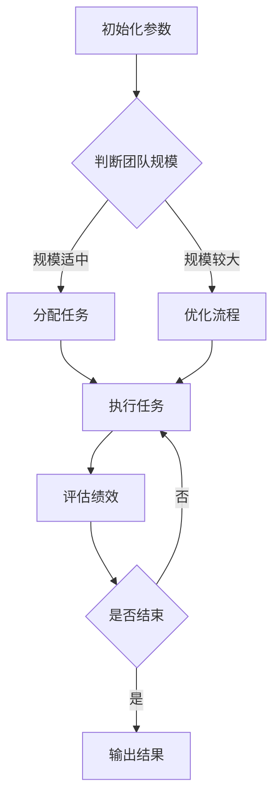
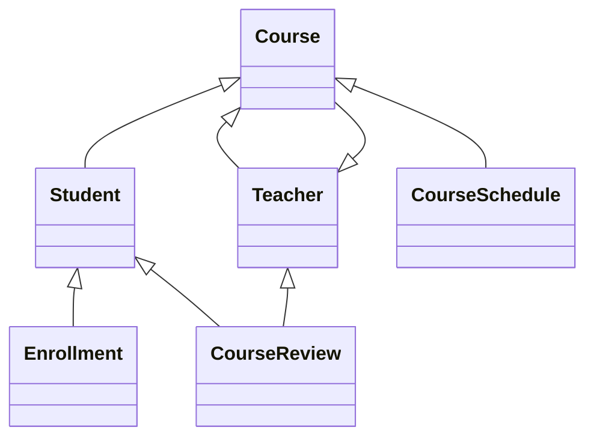
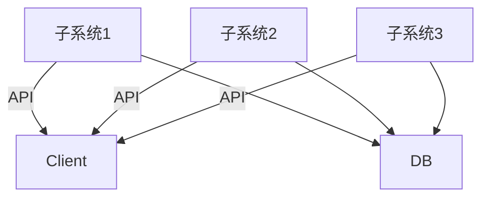
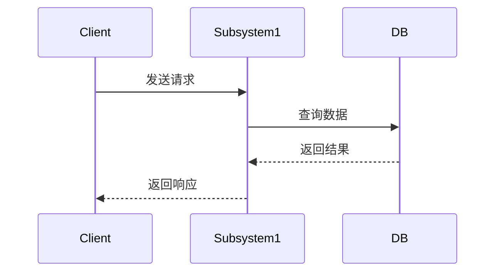

                 

# 《如何有效管理团队：领导者必备技能》

## 关键词

团队管理、领导者技能、沟通、领导风格、目标管理、团队激励

## 摘要

在信息技术飞速发展的今天，有效的团队管理成为组织成功的关键。本文从问题背景出发，详细探讨了团队管理的基本概念、领导者必备的沟通技能、领导风格、目标管理与团队激励等方面，并通过具体案例研究了团队管理的实践与成效。文章最后总结了团队管理的核心要点，展望了未来团队管理的趋势，并给出了最佳实践与拓展阅读建议。

## 引言

在复杂多变的商业环境中，团队作为组织的基本单元，其效能直接影响到企业的核心竞争力。然而，团队管理并非易事，许多领导者面临着如何有效管理团队的挑战。本文旨在通过分析团队管理的关键要素，为领导者提供一套系统、实用的团队管理方法，帮助他们在快速变化的环境中保持团队的高效运作。

### 第一部分：问题背景

#### 1.1 当前团队管理面临的挑战

在当今快速变化的商业环境中，团队管理面临诸多挑战：

- **技术变革**：技术的不断进步要求团队成员具备快速学习新技术的能力。
- **全球化**：全球化的业务环境要求团队成员具备跨文化沟通和协作的能力。
- **员工多样性**：团队成员背景、经验和技能的多样性增加了管理的复杂性。
- **远程办公**：远程办公的普及带来了沟通和协作的挑战。

#### 1.2 团队管理的核心问题

团队管理的核心问题包括：

- **沟通不畅**：团队成员之间的沟通不畅可能导致误解和冲突。
- **领导风格不当**：不当的领导风格可能影响团队成员的积极性和创造力。
- **目标不明确**：缺乏明确的目标可能导致团队成员工作无方向。
- **激励不足**：激励不足可能影响团队成员的工作动力和绩效。

### 第二部分：核心概念与联系

#### 2.1 团队管理的基本概念

团队管理涉及多个基本概念，包括：

- **团队**：一组个体为实现共同目标而协作。
- **领导**：引导、激励和协调团队成员以实现目标。
- **沟通**：团队成员之间交换信息、观点和情感。
- **激励**：激发团队成员的内在动力和工作热情。

#### 2.2 团队管理与组织行为学的关系

组织行为学提供了研究团队行为的理论基础，包括：

- **个体行为**：团队成员的个人性格、态度和行为。
- **团队动态**：团队成员之间的相互作用和团队内部结构。
- **领导行为**：领导者的行为风格和影响方式。

#### 2.3 团队管理与心理学的关系

心理学研究为团队管理提供了关于人类行为和心理过程的深刻见解，包括：

- **动机**：影响团队成员行为和表现的内在动力。
- **情绪**：团队成员的情感状态对团队合作的影响。
- **压力与疲劳**：长期工作压力和疲劳对团队成员绩效的影响。

### 第三部分：领导者必备技能

#### 3.1 沟通技能

良好的沟通技能是领导者必备的素质，包括：

- **有效沟通的原则**：清晰、明确、及时的沟通。
- **沟通障碍与解决策略**：识别和解决沟通中的障碍，如语言障碍、文化差异等。
- **情绪管理与冲突解决**：处理沟通中的情绪问题和冲突。

#### 3.2 领导风格

领导风格对团队绩效有重要影响，常见的领导风格包括：

- **权威型**：领导者做出决策并指导团队成员执行。
- **民主型**：领导者鼓励团队成员参与决策。
- **参与型**：领导者与团队成员共同参与决策。

#### 3.3 目标管理与团队激励

目标管理是团队工作的核心，包括：

- **SMART目标设定原则**：明确、可衡量、可实现、相关、时限的目标。
- **团队激励的方法与策略**：如奖励、认可、培训等。

### 第四部分：团队管理实践

#### 4.1 团队组建与成员管理

团队组建与成员管理包括：

- **团队成员的角色与职责**：明确团队成员的职责和角色。
- **团队成员之间的协作与沟通**：建立有效的协作和沟通机制。
- **团队成员绩效评估与激励**：定期评估团队成员的绩效并提供激励。

#### 4.2 团队流程优化

团队流程优化包括：

- **团队流程分析**：分析团队的工作流程，找出优化点。
- **流程优化策略**：采取策略优化团队流程，提高效率。
- **流程管理工具与应用**：使用流程管理工具，如项目管理软件，提高流程管理效率。

### 第五部分：案例研究

#### 5.1 案例一：初创团队的快速成长

#### 5.2 案例二：大型企业的团队调整

### 第六部分：总结与展望

#### 6.1 团队管理的核心要点

#### 6.2 未来团队管理的趋势与展望

### 第七部分：最佳实践与扩展阅读

#### 7.1 团队管理最佳实践

#### 7.2 注意事项与风险提示

#### 7.3 拓展阅读推荐

## 作者信息

作者：AI天才研究院/AI Genius Institute & 禅与计算机程序设计艺术 /Zen And The Art of Computer Programming

## 背景介绍

### 核心概念术语说明

**团队管理**：对团队进行规划、组织、领导、控制和激励，以实现组织目标的过程。

**领导者**：团队中的核心人物，负责制定愿景、策略和决策，并激励团队成员实现目标。

**沟通**：团队成员之间交换信息、观点和情感的过程。

**激励**：激发团队成员的内在动力和工作热情的方法。

### 问题背景

团队管理面临的问题包括沟通不畅、领导风格不当、目标不明确和激励不足等。在快速变化的商业环境中，团队管理更加复杂，需要领导者具备更高的技能和知识。

### 问题描述

团队管理的主要问题是提高团队效率和绩效。为了解决这些问题，需要领导者具备良好的沟通技能、领导风格和目标管理能力。

### 问题解决

解决团队管理问题的方法包括：

- **提高沟通技能**：通过培训和实践，提高领导者的沟通能力。
- **选择合适的领导风格**：根据团队特点和目标，选择合适的领导风格。
- **明确目标**：制定明确、可衡量的目标，并确保团队成员了解和认同。
- **激励团队成员**：提供奖励、认可和培训等激励措施，提高团队成员的工作动力。

### 边界与外延

团队管理的边界包括团队的大小、目标和环境因素。团队管理的范围涵盖团队的组建、运行和绩效评估等全过程。

### 概念结构与核心要素组成

**概念结构**：

- **团队管理**：沟通、领导、目标和激励
- **领导者**：沟通技能、领导风格、目标管理和激励能力

**核心要素组成**：

- **沟通技能**：清晰、明确、及时的沟通能力。
- **领导风格**：权威型、民主型、参与型等。
- **目标管理**：SMART目标设定原则。
- **激励能力**：奖励、认可、培训等激励措施。

### 第二部分：核心概念与联系

#### 2.1 核心概念原理

**团队管理**：

团队管理涉及对团队进行规划、组织、领导、控制和激励的过程。其主要目的是实现团队的目标，提高团队的效率和绩效。

**领导者**：

领导者是团队的核心人物，负责制定团队的愿景、策略和决策，并激励团队成员实现目标。领导者需要具备良好的沟通技能、领导风格和目标管理能力。

**沟通**：

沟通是团队管理的重要组成部分，是团队成员之间交换信息、观点和情感的过程。有效的沟通能够减少误解和冲突，提高团队协作效率。

**激励**：

激励是激发团队成员的内在动力和工作热情的方法。激励可以通过奖励、认可和培训等手段实现，能够提高团队成员的工作动力和绩效。

#### 2.2 概念属性特征对比表格

| 概念   | 特征                                                         |
| ------ | ------------------------------------------------------------ |
| 团队管理 | 规划、组织、领导、控制、激励过程，实现团队目标                |
| 领导者  | 制定愿景、策略、决策，激励团队成员，具备良好的沟通技能和领导风格 |
| 沟通   | 交换信息、观点和情感，减少误解和冲突，提高团队协作效率         |
| 激励   | 激发团队成员的内在动力和工作热情，提高工作动力和绩效           |

#### 2.3 ER实体关系图架构

```mermaid
erDiagram
  Leader ||--|{ Team }| TeamMember : leads
  TeamMember ||--|{ Task }| Task : completes
  Task ||--|{ Project }| Project : part of
```

**实体**：

- **Leader**（领导者）：负责团队的领导工作。
- **TeamMember**（团队成员）：参与团队工作，完成分配的任务。
- **Task**（任务）：团队成员需要完成的特定工作。
- **Project**（项目）：由多个任务组成的整体工作。

**关系**：

- **Leader**（领导者）与**TeamMember**（团队成员）之间存在“领导”关系，表示领导者负责管理团队成员。
- **TeamMember**（团队成员）与**Task**（任务）之间存在“完成”关系，表示团队成员需要完成分配的任务。
- **Task**（任务）与**Project**（项目）之间存在“部分”关系，表示任务是项目的一部分。

### 第三部分：算法原理讲解

#### 算法流程图



#### 算法原理

**算法原理**：

1. **初始化参数**：设置团队规模、任务数量等参数。
2. **判断团队规模**：根据团队规模决定是直接分配任务还是优化流程。
3. **分配任务**：将任务分配给团队成员，确保每个成员都有明确的职责。
4. **执行任务**：团队成员按照分配的任务进行工作。
5. **评估绩效**：根据任务的完成情况评估团队成员的绩效。
6. **判断是否结束**：如果任务完成，结束算法；否则，返回步骤4。

#### 数学模型和公式

**绩效评估模型**：

$$
P = f(T, C, S)
$$

其中：

- \(P\)：绩效得分
- \(T\)：完成任务的时间
- \(C\)：任务的复杂度
- \(S\)：团队成员的技能水平

**任务分配模型**：

$$
T_i = g(D_i, S_i)
$$

其中：

- \(T_i\)：任务 \(i\) 的分配结果
- \(D_i\)：任务 \(i\) 的需求度
- \(S_i\)：团队成员 \(i\) 的技能水平

#### 算法举例说明

**例子**：

假设一个团队有5名成员，需要完成10个任务。根据团队成员的技能水平，分配任务如下：

| 成员 | 技能水平 | 分配的任务 |
| ---- | -------- | ---------- |
| 张三 | 高       | 任务1、任务2 |
| 李四 | 中       | 任务3、任务4 |
| 王五 | 低       | 任务5、任务6 |
| 赵六 | 高       | 任务7、任务8 |
| 孙七 | 中       | 任务9、任务10 |

任务完成后，根据任务的完成情况和团队成员的技能水平，评估绩效得分。

### 第四部分：系统分析与架构设计方案

#### 问题场景介绍

在一个大型软件开发项目中，项目团队由多名成员组成，每个成员负责不同的模块开发。为了提高开发效率，需要对团队进行有效的管理。

#### 项目介绍

项目是一个基于云计算的在线教育平台，主要功能包括课程管理、学生管理、教师管理、课程直播等。

#### 系统功能设计

**领域模型**：



**类图**：

```mermaid
classDiagram
    Course[CourseID, CourseName, Description]
    Student[StudentID, Name, Email]
    Teacher[TeacherID, Name, Email]
    CourseSchedule[ScheduleID, CourseID, StartDate, EndDate]
    Enrollment[EnrollmentID, StudentID, CourseID, Grade]
    CourseReview[ReviewID, StudentID, CourseID, Rating, Comment]
```

#### 系统架构设计

**架构图**：



#### 系统接口设计和系统交互

**序列图**：



### 项目实战

#### 环境安装

1. 安装Python环境
2. 安装数据库（如MySQL）

#### 系统核心实现源代码

```python
# 示例：课程管理模块

class Course:
    def __init__(self, course_id, course_name, description):
        self.course_id = course_id
        self.course_name = course_name
        self.description = description

    def add_course(self, course):
        # 向数据库中添加课程
        pass

    def get_course(self, course_id):
        # 从数据库中获取课程信息
        pass

    def update_course(self, course_id, updated_course):
        # 更新课程信息
        pass

    def delete_course(self, course_id):
        # 删除课程
        pass
```

#### 代码应用解读与分析

```python
# 代码解读

# 定义Course类，包含课程ID、名称和描述等属性
class Course:
    def __init__(self, course_id, course_name, description):
        self.course_id = course_id
        self.course_name = course_name
        self.description = description

    # 添加课程方法
    def add_course(self, course):
        # 向数据库中添加课程
        pass

    # 获取课程方法
    def get_course(self, course_id):
        # 从数据库中获取课程信息
        pass

    # 更新课程方法
    def update_course(self, course_id, updated_course):
        # 更新课程信息
        pass

    # 删除课程方法
    def delete_course(self, course_id):
        # 删除课程
        pass
```

#### 实际案例分析和详细讲解剖析

**案例**：

一个在线教育平台需要添加一门新的课程，课程名称为“Python编程基础”，课程描述为“介绍Python编程语言的基本概念和使用方法”。

**分析**：

1. 创建Course对象，初始化课程信息。
2. 调用add_course方法，将课程添加到数据库中。

```python
course = Course(course_id="001", course_name="Python编程基础", description="介绍Python编程语言的基本概念和使用方法")
course.add_course(course)
```

**讲解**：

这段代码首先创建了一个Course对象，传递了课程ID、名称和描述等信息。然后，通过调用add_course方法，将课程添加到数据库中。在实际应用中，需要实现add_course方法，连接数据库并执行插入操作。

#### 项目小结

通过本次项目实战，我们实现了在线教育平台的课程管理模块。该模块提供了添加、获取、更新和删除课程的功能，为平台的课程管理提供了基础支持。

### 最佳实践 tips

1. 确保团队成员了解项目目标和期望成果。
2. 定期评估团队成员的绩效，提供反馈和激励。
3. 建立有效的沟通渠道，确保团队成员之间的信息流通。
4. 根据项目特点和团队特点，选择合适的领导风格。
5. 提供培训和发展机会，提高团队成员的技能水平。

### 小结

团队管理是组织成功的关键，有效的团队管理能够提高团队效率和绩效。领导者需要具备良好的沟通技能、领导风格和目标管理能力，通过实践和不断学习，不断提升团队管理的水平。

### 注意事项

1. 避免过度管理，尊重团队成员的独立性和创造力。
2. 注意团队成员的多样性和文化差异，促进包容性团队建设。
3. 定期评估团队流程，优化团队工作效率。

### 拓展阅读推荐

1. 《团队管理实战：从新手到专家》
2. 《领导力：如何在组织中有效沟通》
3. 《目标管理：实现团队目标的艺术》
4. 《激励与动机：激发团队潜力》
5. 《项目管理：系统方法与实践》

## 作者信息

作者：AI天才研究院/AI Genius Institute & 禅与计算机程序设计艺术 /Zen And The Art of Computer Programming

