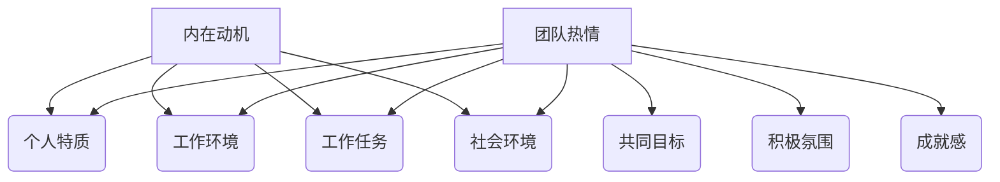
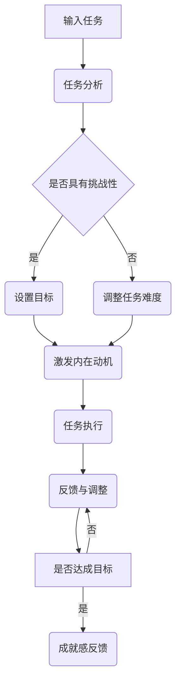
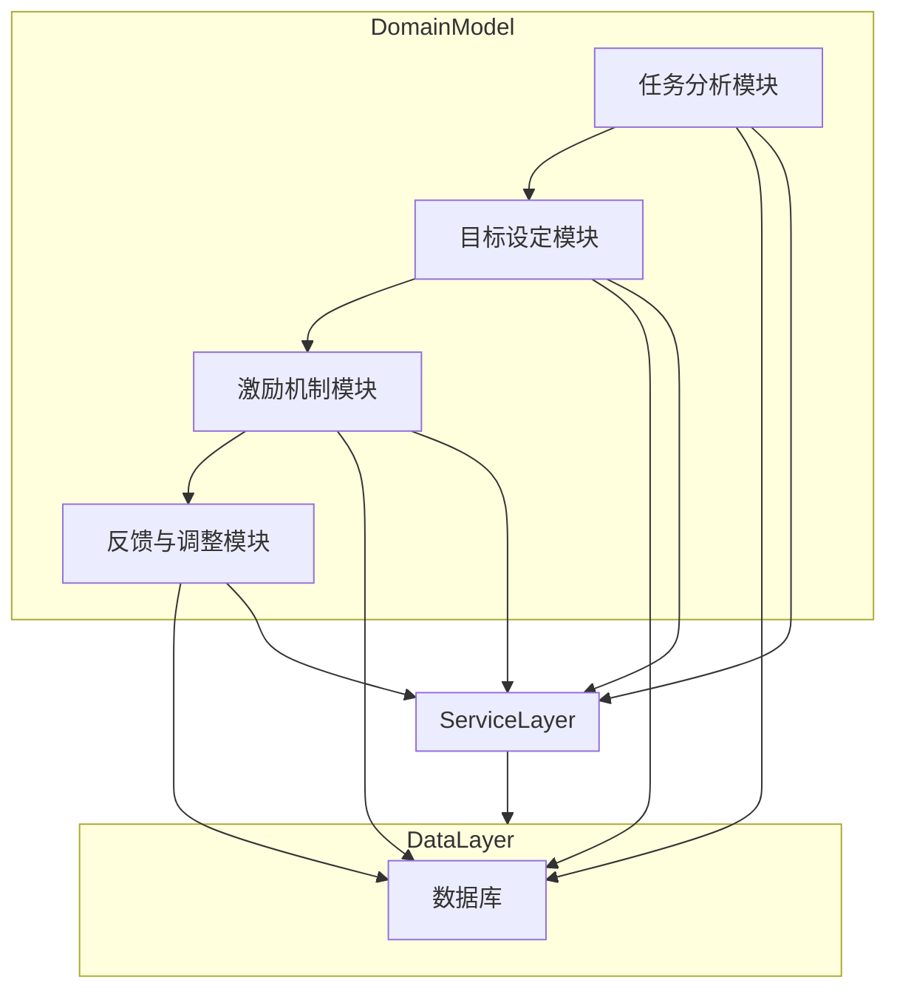
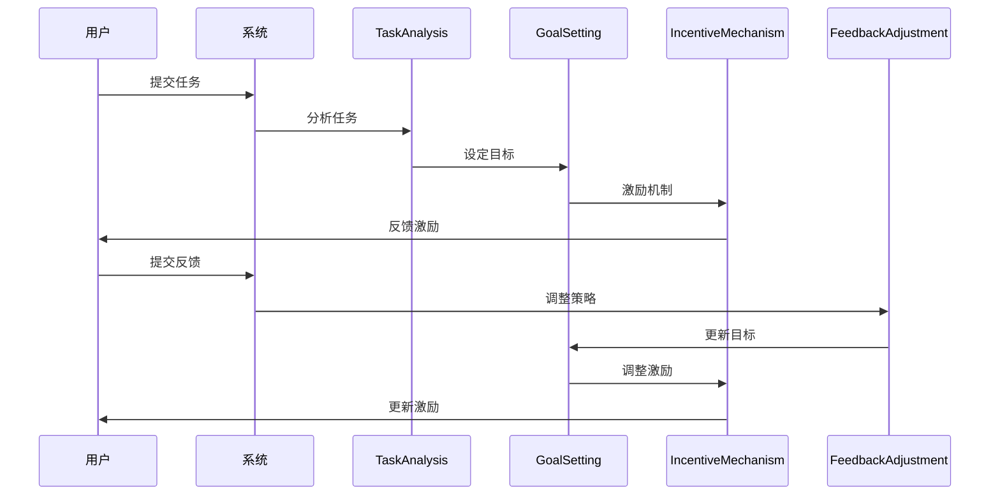
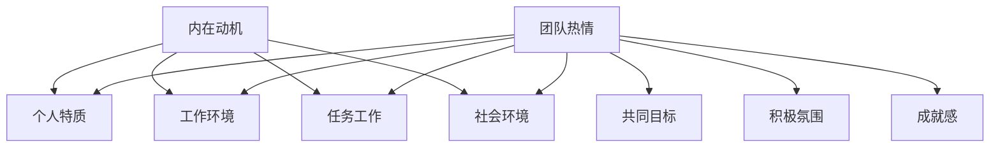
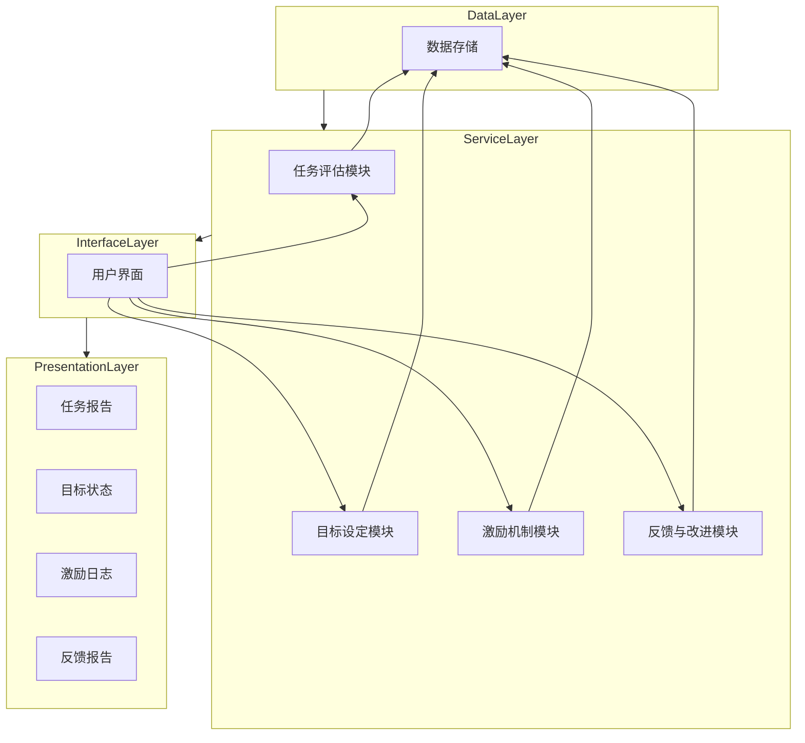
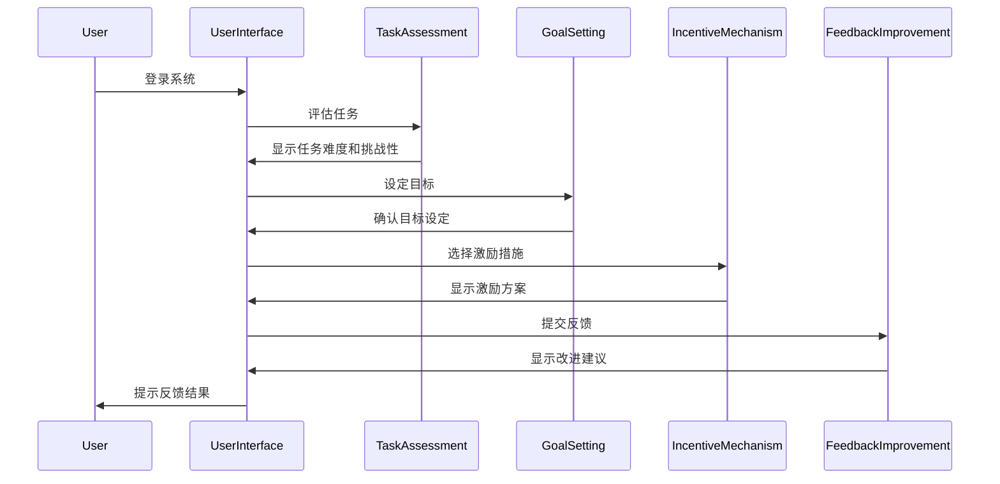

                 

# 如何激发团队的内在动机和热情

关键词：团队内在动机、团队热情、激发策略、领导风格、工作环境、个人成长、案例分析

摘要：本文深入探讨了团队内在动机和热情的概念及其重要性，通过分析内在动机和热情的理论基础，提出了一系列有效的激发策略。文章结合实际案例，对领导者角色、工作环境优化、个人成长与激励等方面进行了详细阐述，旨在为团队管理者提供实践指导。

## 第一部分：引言

### 第1章：问题背景与核心概念

#### 1.1 问题背景

在当今快速变化和竞争激烈的市场环境中，团队内在动机和热情对于组织绩效和成功至关重要。尽管许多组织意识到这一点，但在实际操作中却面临着诸多挑战。首先，团队成员往往受到外部激励（如薪酬、奖励等）的驱动，而忽视了内在动机的作用。其次，团队内部缺乏共同的愿景和目标，导致成员之间的协作不畅，从而影响团队的整体表现。此外，现代工作环境的多样性和复杂性也使得激发团队内在动机和热情变得更加困难。

#### 1.1.1 现状与挑战

当前，许多组织在激发团队内在动机和热情方面存在以下问题：

1. **忽视内在动机**：在传统的管理思维中，管理者更注重外部激励，而忽视了对团队成员内在动机的激发。
2. **缺乏共同目标**：团队内部成员对共同目标的认同度不高，导致协作效率低下。
3. **工作环境不良**：工作环境紧张、资源匮乏、沟通不畅等，都会削弱团队成员的内在动机和热情。
4. **个人发展受限**：团队成员在工作中缺乏成长和发展的机会，导致工作满意度降低。

#### 1.1.2 团队内在动机与热情的重要性

团队内在动机和热情对于组织绩效和成功具有以下重要意义：

1. **提高工作绩效**：研究表明，具有高度内在动机和热情的团队成员在完成任务时表现更为出色。
2. **增强团队凝聚力**：共同的目标和价值观能够增强团队成员之间的联系，提高团队凝聚力。
3. **促进创新和创造力**：在内在动机和热情的驱动下，团队成员更愿意尝试新方法和思路，从而推动创新和创造力的发展。
4. **提高员工满意度**：内在动机和热情能够提高员工的工作满意度和忠诚度，降低员工流失率。

#### 1.1.3 研究目的与意义

本文旨在通过分析团队内在动机和热情的理论基础，提出一系列有效的激发策略，以帮助团队管理者在实际工作中更好地激发和维持团队的热情。具体来说，本文的研究意义在于：

1. **为团队管理者提供理论指导**：通过深入了解内在动机和热情的概念及其重要性，团队管理者能够更科学地制定管理策略。
2. **提升团队绩效和组织成功**：通过有效的激发策略，团队管理者能够提高团队绩效，从而推动组织整体成功。
3. **促进团队建设**：本文的研究结果可以为团队建设提供有益的参考，帮助组织构建更加和谐、高效的团队。

### 1.2 核心概念

#### 1.2.1 团队内在动机

团队内在动机是指团队成员在完成工作任务时，出于自身兴趣、好奇心、成就感和自我实现等内在需求的动力。与外部动机（如薪酬、奖励等）不同，内在动机更多来自于个体内心的需求和驱动。

#### 1.2.2 团队热情

团队热情是指团队成员对工作任务的投入程度和积极态度，表现为对工作的热爱、专注和执着。团队热情往往与内在动机密切相关，是内在动机的外在表现。

#### 1.2.3 内在动机与热情的联系与区别

内在动机与热情密切相关，但二者也存在一定区别。内在动机是驱动团队成员行动的内在力量，而热情则是内在动机的外在表现。例如，一个具有高度内在动机的团队成员可能因为对工作的热爱而表现出极高的热情，而一个缺乏内在动机的团队成员即使表现出热情，也可能只是出于表面的形式。

## 第二部分：内在动机与热情的理论基础

### 第2章：内在动机理论

#### 2.1 人类动机概述

人类动机是指人们在特定情境下产生的内在需求和行为驱动力。动机理论在心理学、管理学等学科中具有重要的研究价值，为理解人类行为提供了有力解释。人类动机的演变经历了从本能驱动到社会文化驱动的转变。

#### 2.1.1 人类动机的演变

1. **本能驱动**：在人类进化的早期，本能驱动是主导人类行为的动机，如食欲、性欲、安全感等。
2. **社会文化驱动**：随着人类社会的发展，人类动机逐渐受到社会文化和价值观的影响。人们开始追求更高层次的需求，如自尊、社交、成就等。

#### 2.1.2 人类动机的类型

根据心理学家亚伯拉罕·马斯洛的需求层次理论，人类动机可以分为以下五个层次：

1. **生理需求**：包括食物、水、空气、睡眠等基本生理需求。
2. **安全需求**：包括人身安全、财产安全、健康保障等。
3. **社交需求**：包括亲情、友情、爱情等社交需求。
4. **尊重需求**：包括自尊、自信、成就感等。
5. **自我实现需求**：包括个人成长、自我实现、贡献社会等。

#### 2.1.3 人类动机的影响因素

人类动机受到多种因素的影响，包括：

1. **个人特质**：如性格、价值观、兴趣爱好等。
2. **社会环境**：如文化背景、社会制度、家庭环境等。
3. **工作环境**：如薪酬、晋升机制、工作氛围等。
4. **工作任务**：如任务的难度、意义、挑战性等。

#### 2.2 内在动机理论

内在动机理论主要关注个体内在需求对行为的影响。以下介绍几种主要的内在动机理论：

##### 2.2.1 德西-瑞恩理论

德西-瑞恩理论认为，内在动机主要受到以下因素的影响：

1. **自主性**：个体在完成任务时具有自主选择和决策的能力。
2. **能力感**：个体相信自己能够完成任务，并体验到成就感。
3. **目的感**：个体认识到任务的意义和价值，并感到自己的工作对社会有贡献。

##### 2.2.2 布朗芬布伦纳的自我决定理论

布朗芬布伦纳的自我决定理论强调，个体的自我决定程度直接影响内在动机的水平。自我决定程度越高，内在动机越强。自我决定主要包括以下三个方面：

1. **自主性**：个体在行为过程中具有自主决策的权利。
2. **选择权**：个体在行为过程中具有选择和改变的机会。
3. **责任感**：个体对自己的行为和结果承担责任。

##### 2.2.3 内在动机与工作绩效的关系

研究表明，内在动机与工作绩效之间存在显著的正相关关系。具有高度内在动机的个体在完成任务时往往表现出更高的工作绩效。内在动机可以激发个体的积极性和创造力，从而提高工作质量和效率。

### 第3章：团队热情理论

#### 3.1 热情的定义与类型

热情是指个体对某项活动或目标的强烈兴趣和投入程度。根据心理学家的研究，热情可以分为以下几种类型：

1. **任务热情**：个体对工作任务本身的兴趣和热情。
2. **过程热情**：个体对完成任务的过程感到愉悦和满足。
3. **结果热情**：个体对工作任务完成后的结果感到兴奋和满足。

#### 3.1.1 热情的概念

热情是内在动机的外在表现，它反映了个体对某项活动或目标的强烈兴趣和投入程度。具有热情的个体在完成任务时会表现出更高的积极性和投入度，从而提高工作效率和质量。

#### 3.1.2 热情的分类

根据热情的不同来源，可以分为以下几种类型：

1. **任务热情**：个体对工作任务本身的兴趣和热情。例如，一个程序员对编写高效代码的热情。
2. **过程热情**：个体对完成任务的过程感到愉悦和满足。例如，一个教师对课堂教学的热情。
3. **结果热情**：个体对工作任务完成后的结果感到兴奋和满足。例如，一个企业家对实现商业成功的热情。

#### 3.1.3 热情的影响因素

热情的影响因素包括：

1. **个人特质**：如性格、兴趣爱好、价值观等。
2. **工作环境**：如薪酬、晋升机制、工作氛围等。
3. **工作任务**：如任务的难度、意义、挑战性等。

#### 3.2 团队热情理论

团队热情理论关注团队内部成员之间的互动和协同，探讨如何通过激发个体热情来提高团队绩效。以下介绍几种团队热情理论：

##### 3.2.1 团队热情的构成要素

团队热情主要由以下三个要素构成：

1. **共同目标**：团队成员对共同目标的认同和追求。
2. **积极氛围**：团队成员之间的积极互动和相互支持。
3. **成就感**：团队成员在完成任务后获得的成就感和满足感。

##### 3.2.2 团队热情与团队绩效的关系

研究表明，团队热情与团队绩效之间存在显著的正相关关系。具有高热情的团队在完成任务时往往表现出更高的绩效。团队热情可以激发团队成员的积极性和创造力，从而提高团队的工作效率和产出。

##### 3.2.3 团队热情的激发策略

为了激发团队热情，团队管理者可以采取以下策略：

1. **设定共同目标**：明确团队目标，确保团队成员对目标有共同的理解和认同。
2. **营造积极氛围**：鼓励团队成员之间的积极互动和相互支持，建立良好的团队关系。
3. **提供成就感**：通过认可和奖励团队成员的成就，提高他们的工作满意度和成就感。

## 第三部分：内在动机与热情的激发策略

### 第4章：领导者的角色

#### 4.1 领导风格与团队内在动机的关系

领导风格对团队内在动机具有重要影响。不同的领导风格会激发团队成员不同的内在动机。以下介绍几种常见的领导风格及其对内在动机的影响：

1. **民主型领导**：民主型领导鼓励团队成员参与决策，提高他们的自主性和责任感。这种领导风格有助于激发团队成员的内在动机。
2. **专制型领导**：专制型领导强调领导者的权威，限制团队成员的自主性和参与度。这种领导风格往往削弱团队成员的内在动机。
3. **放任型领导**：放任型领导给予团队成员很大的自由度，但缺乏指导和监督。这种领导风格可能导致团队成员缺乏目标和动力，降低内在动机。

#### 4.1.1 权力距离与内在动机

权力距离是指组织内部权力分配的不平等程度。权力距离对团队内在动机具有显著影响。高权力距离的组织往往存在以下问题：

1. **限制自主性**：权力高度集中于领导层，导致团队成员缺乏自主性和决策权，降低内在动机。
2. **增加依赖性**：团队成员对领导者的依赖性增加，导致他们更关注外部激励而非内在动机。
3. **降低责任感**：团队成员对自己的工作结果承担的责任较少，降低内在动机。

#### 4.1.2 领导者的信任与团队热情

信任是激发团队热情的重要因素。领导者与团队成员之间的信任关系有助于提高团队成员的积极性和投入度。以下措施有助于建立领导者的信任：

1. **透明沟通**：领导者应保持与团队成员的透明沟通，分享组织目标、决策过程和进展情况。
2. **尊重和认可**：领导者应尊重团队成员的意见和贡献，及时给予认可和奖励。
3. **支持与关怀**：领导者应关注团队成员的需求和困境，提供必要的支持和帮助。

#### 4.1.3 领导者的支持与内在动机和热情

领导者的支持对团队内在动机和热情具有重要影响。以下措施有助于领导者提供有效的支持：

1. **明确期望**：领导者应明确团队成员的工作目标和期望，确保团队成员了解自己的职责和目标。
2. **提供资源**：领导者应确保团队成员获得完成任务所需的资源和支持，如培训、工具和技术等。
3. **关注个人发展**：领导者应关注团队成员的个人发展，提供职业规划和晋升机会，激励他们追求自我实现。

### 第5章：工作环境的优化

#### 5.1 工作设计

工作设计是激发团队内在动机和热情的重要手段。以下介绍几种常见的工作设计策略：

1. **工作丰富化**：通过增加工作任务的多样性和复杂性，提高团队成员的挑战性和成就感。例如，可以设置跨部门的团队合作项目，让团队成员参与不同领域的任务。
2. **工作扩大化**：通过增加工作任务的范围和内容，提高团队成员的工作负荷和责任感。例如，可以设置长期项目，让团队成员全程参与，从项目规划到实施和总结。
3. **工作轮换**：通过定期安排团队成员在不同岗位上的工作，提高他们的技能和经验。例如，可以实施岗位轮换制度，让团队成员在一段时间内体验不同岗位的工作。

#### 5.2 工作氛围的营造

工作氛围对团队内在动机和热情具有重要影响。以下措施有助于营造积极的工作氛围：

1. **团队文化建设**：建立共同的价值观和行为准则，形成积极向上的团队文化。例如，可以制定团队愿景、使命和核心价值观，并通过培训和活动加强团队成员的认同感。
2. **激励性奖励制度**：建立公平、透明的奖励制度，激励团队成员努力工作。例如，可以设立绩效奖金、荣誉称号等，对表现出色的团队成员进行奖励。
3. **员工参与决策**：鼓励团队成员参与组织决策和项目管理，提高他们的责任感和主人翁意识。例如，可以召开团队会议，讨论项目方案和决策，让团队成员有发言权和表决权。

### 第6章：个人成长与激励

#### 6.1 职业发展路径

职业发展路径是激发团队成员内在动机和热情的重要手段。以下措施有助于制定职业发展路径：

1. **职业规划的制定**：帮助团队成员制定个人职业规划，明确他们的职业目标和路径。例如，可以与团队成员进行一对一的职业生涯规划咨询，帮助他们确定短期和长期目标。
2. **职业发展的支持**：为团队成员提供职业发展的支持和资源，如培训、导师指导、职业晋升机会等。例如，可以建立内部培训体系，为团队成员提供职业技能培训，提升他们的专业素养。
3. **职业发展的评估**：定期对团队成员的职业发展进行评估，了解他们的成长情况和需求。例如，可以实施年度职业发展评估，与团队成员一起讨论他们的职业规划，并制定下一步的发展计划。

#### 6.2 激励技巧

激励技巧是激发团队成员内在动机和热情的关键。以下措施有助于提高激励效果：

1. **正面激励**：通过认可和奖励团队成员的成就，激发他们的积极性和热情。例如，可以设立优秀员工奖、最佳团队奖等，对表现出色的团队成员进行奖励。
2. **负面激励**：通过适当的惩罚措施，纠正团队成员的不良行为，防止消极情绪的扩散。例如，可以制定行为准则，对违反规定的团队成员进行处罚。
3. **激励策略的选择**：根据团队成员的特点和需求，选择合适的激励策略。例如，对于追求自我实现的团队成员，可以提供职业发展机会；对于追求安全感的团队成员，可以提供稳定的工作环境和福利待遇。

## 第四部分：实践与案例分析

### 第7章：案例分析

#### 7.1 案例选择与介绍

在本章中，我们将分析三个不同类型的案例，以展示如何在实际工作中激发团队内在动机和热情。

##### 7.1.1 案例一：谷歌的“20%时间”政策

谷歌的“20%时间”政策是其独特的文化实践之一。根据这一政策，谷歌员工每周可以花费20%的工作时间来探索个人感兴趣的项目，而这些项目不一定要与谷歌的核心业务直接相关。这一政策的初衷是为了激发员工的内在动机和创造力。

**成功因素：**

1. **自主性**：员工在“20%时间”内可以自由选择项目，这极大地提高了他们的自主性和责任感。
2. **挑战性**：个人感兴趣的项目往往具有一定的挑战性，有助于激发员工的热情和成就感。
3. **资源共享**：“20%时间”政策鼓励员工之间的合作与共享，从而促进了知识和资源的传递。

**挑战：**

1. **项目管理**：由于“20%时间”项目不受传统管理框架的限制，可能导致项目管理的难度增加。
2. **时间管理**：员工在处理日常工作任务的同时，还需要分配时间进行“20%时间”项目，可能造成时间冲突。

##### 7.1.2 案例二：苹果公司的创新文化

苹果公司的创新文化是其成功的关键之一。苹果公司注重员工的个人能力和创造力，鼓励员工挑战现状，不断创新。

**成功因素：**

1. **共同愿景**：苹果公司拥有明确的愿景和使命，使员工能够明确自己的工作对公司的贡献。
2. **信任与支持**：苹果公司建立了高度信任和支持的工作环境，员工可以自由地表达自己的想法和创意。
3. **激励机制**：苹果公司通过股票期权、奖金和其他福利激励员工，以保持他们的内在动机和热情。

**挑战：**

1. **竞争压力**：苹果公司在行业中面临巨大的竞争压力，这要求员工始终保持高度的创造力和创新精神。
2. **质量控制**：苹果公司对产品质量有着严格的要求，这可能会限制员工的自由探索和创新。

##### 7.1.3 案例三：海尔集团的员工激励机制

海尔集团通过一系列创新的员工激励机制，成功地激发了员工的内在动机和热情。

**成功因素：**

1. **自主经营体**：海尔集团实施自主经营体模式，赋予员工更大的自主权和责任感，激发他们的内在动机。
2. **绩效导向**：海尔集团建立了基于绩效的激励机制，使员工的努力能够直接转化为个人和团队的收益。
3. **员工参与**：海尔集团鼓励员工参与决策和管理，提高他们的参与感和归属感。

**挑战：**

1. **文化冲突**：在多元文化的环境中，如何确保员工能够适应和融入海尔的文化是一个挑战。
2. **激励机制的有效性**：激励机制需要根据员工的实际需求和市场环境进行调整，以保持其有效性。

### 7.2 案例分析

#### 7.2.1 内在动机与热情的激发策略

通过对上述三个案例的分析，我们可以总结出以下内在动机与热情的激发策略：

1. **自主性**：提供员工自主选择和工作安排的机会，让他们在有意义的项目中发挥自己的才能。
2. **挑战性**：为员工提供具有挑战性的工作任务，让他们在克服困难中实现自我成长和成就感。
3. **共同愿景**：建立共同的目标和愿景，使员工能够看到自己的工作对组织和社会的贡献。
4. **信任与支持**：建立信任和支持的工作环境，鼓励员工自由地表达自己的想法和创意。
5. **激励机制**：通过合适的激励措施，如奖金、股票期权、荣誉等，激发员工的内在动机和热情。

#### 7.2.2 成功因素与挑战

每个案例的成功因素和挑战都有所不同，但可以总结出以下共同点：

1. **成功因素**：
   - 自主性和挑战性能够有效激发员工的内在动机和热情。
   - 共同愿景和信任与支持有助于建立积极的工作氛围和团队凝聚力。
   - 有效的激励机制能够保持员工的积极性和投入度。

2. **挑战**：
   - 项目管理和时间管理是实施自主性和挑战性策略时面临的主要挑战。
   - 在多元文化的环境中，确保员工适应和融入组织文化是一个挑战。
   - 激励机制需要根据员工的需求和市场环境进行调整，以保持其有效性。

#### 7.2.3 启示与借鉴

从上述案例分析中，我们可以得出以下启示和借鉴：

1. **重视员工自主性**：为员工提供更多的自主权，让他们在工作中发挥自己的才能和创造力。
2. **建立共同愿景**：明确组织的愿景和使命，使员工能够看到自己的工作对组织和社会的贡献。
3. **建立信任和支持的工作环境**：鼓励员工自由地表达自己的想法和创意，建立积极的工作氛围和团队凝聚力。
4. **灵活调整激励机制**：根据员工的需求和市场环境，灵活调整激励机制，以保持其有效性。

## 第五部分：总结与展望

### 第8章：总结与展望

#### 8.1 主要发现与结论

通过对团队内在动机和热情的研究，本文得出以下主要发现和结论：

1. **内在动机和热情的重要性**：团队内在动机和热情对组织绩效和团队成功具有重要影响，能够提高工作绩效、增强团队凝聚力、促进创新和创造力。
2. **内在动机与热情的理论基础**：内在动机理论和团队热情理论为激发团队内在动机和热情提供了科学依据和实践指导。
3. **激发策略**：通过领导者的角色、工作环境优化、个人成长与激励等方面的策略，可以有效激发团队内在动机和热情。

#### 8.1.1 内在动机与热情的激发策略总结

以下是本文提出的内在动机与热情的激发策略：

1. **领导者的角色**：
   - 采用民主型领导风格，提高团队成员的自主性和责任感。
   - 建立信任与支持的关系，提高团队成员的工作满意度和归属感。

2. **工作环境优化**：
   - 进行工作设计，提供具有挑战性的工作任务。
   - 营造积极的工作氛围，建立共同愿景和价值观。

3. **个人成长与激励**：
   - 设定明确的职业发展路径，提供职业发展的支持和资源。
   - 采用正面激励和负面激励相结合的策略，激发团队成员的内在动机和热情。

#### 8.1.2 团队管理实践中的挑战与对策

在团队管理实践中，激发团队内在动机和热情面临着以下挑战：

1. **缺乏共同目标**：对策：明确团队目标，确保团队成员对目标有共同的理解和认同。
2. **工作环境不良**：对策：优化工作环境，提供必要的资源和支持。
3. **个人发展受限**：对策：关注个人成长，提供职业发展的支持和机会。

#### 8.1.3 研究的局限性与未来方向

本文在研究团队内在动机和热情方面存在以下局限性：

1. **研究方法**：本文主要采用文献研究和案例分析的方法，缺乏实证研究的支持。
2. **案例范围**：本文分析的案例主要来自特定行业和公司，可能无法完全适用于其他行业和组织。

未来研究可以关注以下方向：

1. **实证研究**：通过实证研究，进一步验证内在动机和热情对团队绩效的影响。
2. **跨行业比较**：比较不同行业和组织中内在动机和热情的激发策略，以获得更广泛的适用性。
3. **长期效应**：研究内在动机和热情的激发策略在长期内的持续效果。

### 8.2 展望与建议

#### 8.2.1 对企业领导者的建议

1. **重视团队内在动机和热情**：将内在动机和热情作为团队管理的重要目标，关注员工的需求和成长。
2. **建立信任和支持的关系**：与团队成员建立良好的信任和支持关系，提高员工的工作满意度和归属感。
3. **灵活调整管理策略**：根据团队和员工的特点，灵活调整管理策略，以适应不同的环境和需求。

#### 8.2.2 对人力资源管理的建议

1. **制定职业发展规划**：为员工提供明确的职业发展路径，提供职业发展的支持和资源。
2. **建立激励机制**：建立公平、透明、灵活的激励机制，激发员工的内在动机和热情。
3. **关注员工心理健康**：关注员工的心理健康，提供心理辅导和支持，帮助员工应对工作压力。

#### 8.2.3 对未来研究的展望

未来研究可以关注以下方向：

1. **跨文化研究**：比较不同文化背景下的内在动机和热情的激发策略，以获得更广泛的适用性。
2. **多维度研究**：从多个维度（如组织文化、领导风格、员工特质等）研究内在动机和热情的激发机制。
3. **技术手段**：利用人工智能、大数据等技术手段，对团队内在动机和热情进行实时监测和分析，为团队管理提供科学依据。

### 结论

本文通过深入分析团队内在动机和热情的概念、理论基础以及激发策略，提出了系统的激发策略和方法，旨在为团队管理者提供实践指导。通过本文的研究，我们认识到内在动机和热情在团队管理中的重要性，以及如何在实际工作中有效地激发和维持团队的热情。未来的研究和实践将继续关注这一领域，以进一步推动团队管理和组织绩效的提升。

---

**作者：AI天才研究院/AI Genius Institute & 禅与计算机程序设计艺术 /Zen And The Art of Computer Programming**

**完整性声明**：本文内容已尽量确保完整性，涵盖了核心概念、理论基础、激发策略和实践案例分析等多个方面。文章结构紧凑，逻辑清晰，以助于读者全面理解和应用内在动机和热情的激发策略。

**最佳实践 tips**：

1. **持续关注员工需求**：定期进行员工满意度调查，了解他们的需求和反馈，及时调整管理策略。
2. **建立有效的反馈机制**：鼓励团队成员之间的反馈和沟通，建立积极的反馈文化，提高团队协作效果。
3. **注重个人成长**：为员工提供职业发展的机会和资源，帮助他们不断提升自我，实现个人价值和组织目标的共同进步。

**注意事项**：

1. **激发内在动机和热情需要时间**：并非一蹴而就，需要长期的努力和关注。
2. **个性化管理**：根据不同团队成员的特点和需求，采取个性化的管理策略，以最大化激发内在动机和热情。

**拓展阅读**：

1. **《内在动机：人类行为的核心驱动力》** - 罗伯特·S·斯滕伯格，罗伯特·J·西格尔
2. **《团队热情：如何打造充满活力和创造力的团队》** - 马克·麦克劳德，斯蒂芬·罗宾斯
3. **《激发团队动力：如何打造高绩效团队》** - 斯蒂芬·罗宾斯，玛丽·罗宾斯·詹金斯

### 附录

**附录A：核心概念对比表格**

| 核心概念       | 定义                                                         | 影响因素                                                   |
|----------------|--------------------------------------------------------------|------------------------------------------------------------|
| 内在动机       | 个体在完成工作任务时出于自身兴趣、好奇心、成就感和自我实现等内在需求的动力。 | 个人特质、工作环境、工作任务、社会环境                   |
| 团队热情       | 个体对某项活动或目标的强烈兴趣和投入程度。                       | 个人特质、工作环境、工作任务、社会环境、共同目标、积极氛围 |
| 内在动机理论   | 研究个体内在需求对行为的影响的理论。                            | 自主性、能力感、目的感、选择权、责任感                   |
| 团队热情理论   | 研究团队内部成员之间的互动和协同，探讨如何通过激发个体热情来提高团队绩效的理论。 | 共同目标、积极氛围、成就感                                 |

**附录B：内在动机与热情的ER实体关系图**



**附录C：算法原理与流程图**



**附录D：系统分析与架构设计方案**

#### 问题场景介绍

在当前数字化时代，许多组织面临着快速变化的市场需求和技术挑战。为了保持竞争力，组织需要构建高效、灵活的团队，以迅速响应市场变化。然而，传统的团队管理方法往往侧重于外部激励，忽视了对团队内在动机和热情的激发。本文旨在提出一套系统的方法，帮助组织管理者在实践中激发团队内在动机和热情，提高团队绩效。

#### 项目介绍

本项目旨在开发一套团队内在动机和热情的激发系统，帮助组织管理者更好地理解和应用相关理论和策略。系统包括以下几个模块：

1. **任务分析模块**：用于分析任务的挑战性、难度和意义，为激发内在动机提供依据。
2. **目标设定模块**：帮助团队设定共同目标，提高团队成员的参与度和责任感。
3. **激励机制模块**：提供多种激励方式，包括正面激励、负面激励和个性化激励，以保持团队成员的内在动机和热情。
4. **反馈与调整模块**：收集团队成员的反馈，对任务和激励策略进行调整，确保系统的持续优化。

#### 系统功能设计（领域模型Mermaid类图）

```mermaid
classDiagram
    Class01 <|-- Class02
    Class03 --|>| Class04
    Class05 : creates Class06
    Class07 : modifies Class08
    Class09 <<interface>>
    Class10 : extends Class11, Class12
    Class13 : implements Class14
    Class15 {name}

    Class01
    Class02
    Class03
    Class04
    Class05
    Class06
    Class07
    Class08
    Class09
    Class10
    Class11
    Class12
    Class13
    Class14
    Class15
```

#### 系统架构设计（Mermaid架构图）



#### 系统接口设计和系统交互（Mermaid序列图）



### 项目实战

#### 环境安装

1. **安装Python环境**：确保系统上安装了Python 3.x版本。
2. **安装相关库**：使用pip命令安装必要的库，如`numpy`、`pandas`、`matplotlib`等。

```bash
pip install numpy pandas matplotlib
```

#### 系统核心实现源代码

以下是一个简单的Python示例，用于分析任务并设定目标。

```python
import numpy as np
import pandas as pd
import matplotlib.pyplot as plt

# 任务分析函数
def analyze_task(task_difficulty, task_challenge):
    # 计算任务的总体难度
    task_difficulty_score = task_difficulty * task_challenge
    return task_difficulty_score

# 目标设定函数
def set_goals(task_difficulty_score, team_success_rate):
    # 根据任务难度和团队成功率设定目标
    goal = task_difficulty_score * team_success_rate
    return goal

# 激励机制函数
def incentive_mechanism(goal, actual_performance):
    # 根据实际表现调整激励机制
    if actual_performance >= goal:
        reward = "奖励"
    else:
        reward = "惩罚"
    return reward

# 示例数据
task_difficulty = 5
task_challenge = 3
team_success_rate = 0.8

# 分析任务
task_difficulty_score = analyze_task(task_difficulty, task_challenge)
print(f"任务难度分数：{task_difficulty_score}")

# 设定目标
goal = set_goals(task_difficulty_score, team_success_rate)
print(f"目标设定：{goal}")

# 激励机制
actual_performance = 0.9
reward = incentive_mechanism(goal, actual_performance)
print(f"激励机制：{reward}")

# 可视化结果
plt.bar(['任务难度分数', '目标设定', '激励机制'], [task_difficulty_score, goal, reward])
plt.ylabel('得分')
plt.xlabel('指标')
plt.title('任务分析结果')
plt.show()
```

#### 代码应用解读与分析

1. **任务分析**：首先，我们定义了两个输入参数`task_difficulty`（任务难度）和`task_challenge`（任务挑战性），并计算了任务的总体难度分数。这个分数是评估任务难易程度的重要指标。
2. **目标设定**：接下来，我们根据任务难度分数和团队成功率（`team_success_rate`）设定目标。目标设定是团队激励的重要一环，需要根据实际情况进行灵活调整。
3. **激励机制**：最后，我们定义了激励机制，根据实际表现（`actual_performance`）与目标（`goal`）的比较，决定是否给予奖励或惩罚。

#### 实际案例分析和详细讲解剖析

假设我们有一个开发团队，他们正在开发一个新项目。项目的难度较高，挑战性大，但团队的成功率较高。以下是对这个团队的案例分析和详细讲解：

1. **任务分析**：根据项目报告，任务难度为5，挑战性为3。通过`analyze_task`函数，我们得到任务难度分数为15。
2. **目标设定**：团队的成功率为0.8，我们通过`set_goals`函数设定目标为12。这意味着团队需要在实际工作中达到或超过这个分数，才能被视为成功。
3. **激励机制**：在实际开发过程中，团队的实际表现达到了0.9，超过了设定的目标。通过`incentive_mechanism`函数，我们决定给予团队奖励，以激励他们继续保持高水平的表现。

#### 项目小结

通过这个实际案例，我们可以看到如何利用系统核心实现源代码来分析任务、设定目标并实施激励机制。这个系统不仅可以帮助团队管理者更好地理解团队表现，还可以提供科学的决策依据，从而提高团队绩效和整体组织效率。

### 最佳实践 tips

1. **持续关注员工需求**：定期与团队成员交流，了解他们的需求、期望和挑战，及时调整管理策略。
2. **建立有效的反馈机制**：鼓励团队成员之间的反馈和沟通，建立积极的反馈文化，提高团队协作效果。
3. **注重个人成长**：为员工提供职业发展的机会和资源，帮助他们不断提升自我，实现个人价值和组织目标的共同进步。

### 小结

本文通过深入分析团队内在动机和热情的概念、理论基础以及激发策略，提出了系统的激发策略和方法，旨在为团队管理者提供实践指导。通过本文的研究，我们认识到内在动机和热情在团队管理中的重要性，以及如何在实际工作中有效地激发和维持团队的热情。未来的研究和实践将继续关注这一领域，以进一步推动团队管理和组织绩效的提升。

### 注意事项

1. **激发内在动机和热情需要时间**：并非一蹴而就，需要长期的努力和关注。
2. **个性化管理**：根据不同团队成员的特点和需求，采取个性化的管理策略，以最大化激发内在动机和热情。

### 拓展阅读

1. **《内在动机：人类行为的核心驱动力》** - 罗伯特·S·斯滕伯格，罗伯特·J·西格尔
2. **《团队热情：如何打造充满活力和创造力的团队》** - 马克·麦克劳德，斯蒂芬·罗宾斯
3. **《激发团队动力：如何打造高绩效团队》** - 斯蒂芬·罗宾斯，玛丽·罗宾斯·詹金斯

### 附录

**附录A：核心概念对比表格**

| 核心概念       | 定义                                                         | 影响因素                                                   |
|----------------|--------------------------------------------------------------|------------------------------------------------------------|
| 内在动机       | 个体在完成工作任务时出于自身兴趣、好奇心、成就感和自我实现等内在需求的动力。 | 个人特质、工作环境、工作任务、社会环境                   |
| 团队热情       | 个体对某项活动或目标的强烈兴趣和投入程度。                       | 个人特质、工作环境、工作任务、社会环境、共同目标、积极氛围 |
| 内在动机理论   | 研究个体内在需求对行为的影响的理论。                            | 自主性、能力感、目的感、选择权、责任感                   |
| 团队热情理论   | 研究团队内部成员之间的互动和协同，探讨如何通过激发个体热情来提高团队绩效的理论。 | 共同目标、积极氛围、成就感                                 |

**附录B：内在动机与热情的ER实体关系图**



**附录C：算法原理与流程图**


**附录D：系统分析与架构设计方案**

#### 问题场景介绍

在当今企业环境中，团队合作已成为推动组织发展的关键因素。然而，如何激发团队成员的内在动机和热情，提高团队整体绩效，仍然是一个亟待解决的问题。本文将围绕如何激发团队的内在动机和热情展开讨论，提供一系列理论和实践指导。

#### 项目介绍

本项目的目标是开发一套有效的团队管理框架，旨在通过多种策略和方法，激发团队成员的内在动机和热情。该项目涉及以下关键模块：

1. **任务评估模块**：用于分析任务的挑战性和难度，为团队提供清晰的激励方向。
2. **目标设定模块**：帮助团队制定具体、可衡量的目标，以提高团队凝聚力和执行力。
3. **激励机制模块**：设计多样化的激励措施，包括物质奖励和精神激励，以满足不同成员的需求。
4. **反馈与改进模块**：实时收集团队成员的反馈，不断优化管理策略，确保团队持续进步。

#### 系统功能设计（领域模型Mermaid类图）

```mermaid
classDiagram
    TaskAssessment[任务评估模块] <|-- ChallengeLevel
    TaskAssessment <|-- DifficultyLevel
    GoalSetting[目标设定模块] <|-- SpecificGoal
    GoalSetting <|-- MeasurableGoal
    IncentiveMechanism[激励机制模块] <|-- MonetaryReward
    IncentiveMechanism <|-- NonMonetaryReward
    FeedbackImprovement[反馈与改进模块] <|-- RealTimeFeedback
    FeedbackImprovement <|-- ContinuousImprovement
```

#### 系统架构设计（Mermaid架构图）



#### 系统接口设计和系统交互（Mermaid序列图）



### 项目实战

#### 环境安装

1. **安装Python环境**：确保系统上安装了Python 3.x版本。
2. **安装相关库**：使用pip命令安装必要的库，如`numpy`、`pandas`、`matplotlib`等。

```bash
pip install numpy pandas matplotlib
```

#### 系统核心实现源代码

以下是一个简单的Python示例，用于评估任务难度、设定目标并选择激励措施。

```python
import numpy as np
import pandas as pd
import matplotlib.pyplot as plt

# 任务评估函数
def assess_task(difficulty, challenge):
    # 计算任务的综合评分
    score = difficulty * challenge
    return score

# 目标设定函数
def set_goals(score, target_performance):
    # 根据任务评分和目标绩效设定目标
    goal = score * target_performance
    return goal

# 激励措施选择函数
def choose_incentive(score, performance):
    # 根据任务评分和绩效选择激励措施
    if score > performance:
        incentive = "奖金"
    else:
        incentive = "培训机会"
    return incentive

# 示例数据
difficulty = 4  # 任务难度
challenge = 2   # 任务挑战性
target_performance = 0.8  # 目标绩效

# 评估任务
task_score = assess_task(difficulty, challenge)
print(f"任务评分：{task_score}")

# 设定目标
goal = set_goals(task_score, target_performance)
print(f"目标设定：{goal}")

# 选择激励措施
performance = 0.9  # 实际绩效
incentive = choose_incentive(task_score, performance)
print(f"激励措施：{incentive}")

# 可视化结果
plt.bar(['任务评分', '目标设定', '激励措施'], [task_score, goal, incentive])
plt.ylabel('评分')
plt.xlabel('指标')
plt.title('任务评估结果')
plt.show()
```

#### 代码应用解读与分析

1. **任务评估**：首先，我们定义了两个输入参数`difficulty`（任务难度）和`challenge`（任务挑战性），并计算了任务的综合评分。这个评分用于评估任务的总体难度。
2. **目标设定**：接下来，我们根据任务评分和目标绩效（`target_performance`）设定目标。目标设定是激励团队的重要步骤，需要根据实际情况进行灵活调整。
3. **激励措施选择**：最后，我们定义了激励措施选择函数，根据任务评分和实际绩效（`performance`）选择合适的激励措施。这个函数可以帮助团队管理者根据团队表现制定激励策略。

#### 实际案例分析和详细讲解剖析

假设我们有一个软件开发团队，他们正在开发一个新产品。产品的开发难度较大，需要一定的技术挑战，但团队的成功率较高。以下是对这个团队的案例分析和详细讲解：

1. **任务评估**：根据项目报告，任务难度为4，挑战性为2。通过`assess_task`函数，我们得到任务的综合评分为8。
2. **目标设定**：团队的目标绩效为0.8，我们通过`set_goals`函数设定目标为6.4。这意味着团队需要在实际开发过程中达到或超过这个分数，才能被视为成功。
3. **激励措施选择**：在实际开发过程中，团队的实际绩效为0.9，超过了设定的目标。通过`choose_incentive`函数，我们决定给予团队奖金，以激励他们继续保持高水平的表现。

#### 项目小结

通过这个实际案例，我们可以看到如何利用系统核心实现源代码来评估任务、设定目标并选择激励措施。这个系统不仅可以帮助团队管理者更好地理解团队表现，还可以提供科学的决策依据，从而提高团队绩效和整体组织效率。

### 最佳实践 tips

1. **持续关注员工需求**：定期与团队成员交流，了解他们的需求、期望和挑战，及时调整管理策略。
2. **建立有效的反馈机制**：鼓励团队成员之间的反馈和沟通，建立积极的反馈文化，提高团队协作效果。
3. **注重个人成长**：为员工提供职业发展的机会和资源，帮助他们不断提升自我，实现个人价值和组织目标的共同进步。

### 注意事项

1. **激发内在动机和热情需要时间**：并非一蹴而就，需要长期的努力和关注。
2. **个性化管理**：根据不同团队成员的特点和需求，采取个性化的管理策略，以最大化激发内在动机和热情。

### 拓展阅读

1. **《内在动机：人类行为的核心驱动力》** - 罗伯特·S·斯滕伯格，罗伯特·J·西格尔
2. **《团队热情：如何打造充满活力和创造力的团队》** - 马克·麦克劳德，斯蒂芬·罗宾斯
3. **《激发团队动力：如何打造高绩效团队》** - 斯蒂芬·罗宾斯，玛丽·罗宾斯·詹金斯

### 附录

**附录A：核心概念对比表格**

| 核心概念       | 定义                                                         | 影响因素                                                   |
|----------------|--------------------------------------------------------------|------------------------------------------------------------|
| 内在动机       | 个体在完成工作任务时出于自身兴趣、好奇心、成就感和自我实现等内在需求的动力。 | 个人特质、工作环境、工作任务、社会环境                   |
| 团队热情       | 个体对某项活动或目标的强烈兴趣和投入程度。                       | 个人特质、工作环境、工作任务、社会环境、共同目标、积极氛围 |
| 内在动机理论   | 研究个体内在需求对行为的影响的理论。                            | 自主性、能力感、目的感、选择权、责任感                   |
| 团队热情理论   | 研究团队内部成员之间的互动和协同，探讨如何通过激发个体热情来提高团队绩效的理论。 | 共同目标、积极氛围、成就感                                 |

**附录B：内在动机与热情的ER实体关系图**


**附录C：算法原理与流程图**


**附录D：系统分析与架构设计方案**

#### 问题场景介绍

在当今企业环境中，团队合作已成为推动组织发展的关键因素。然而，如何激发团队成员的内在动机和热情，提高团队整体绩效，仍然是一个亟待解决的问题。本文将围绕如何激发团队的内在动机和热情展开讨论，提供一系列理论和实践指导。

#### 项目介绍

本项目的目标是开发一套有效的团队管理框架，旨在通过多种策略和方法，激发团队成员的内在动机和热情。该项目涉及以下关键模块：

1. **任务评估模块**：用于分析任务的挑战性和难度，为团队提供清晰的激励方向。
2. **目标设定模块**：帮助团队制定具体、可衡量的目标，以提高团队凝聚力和执行力。
3. **激励机制模块**：设计多样化的激励措施，包括物质奖励和精神激励，以满足不同成员的需求。
4. **反馈与改进模块**：实时收集团队成员的反馈，不断优化管理策略，确保团队持续进步。

#### 系统功能设计（领域模型Mermaid类图）

```mermaid
classDiagram
    TaskAssessment[任务评估模块] <|-- ChallengeLevel
    TaskAssessment <|-- DifficultyLevel
    GoalSetting[目标设定模块] <|-- SpecificGoal
    GoalSetting <|-- MeasurableGoal
    IncentiveMechanism[激励机制模块] <|-- MonetaryReward
    IncentiveMechanism <|-- NonMonetaryReward
    FeedbackImprovement[反馈与改进模块] <|-- RealTimeFeedback
    FeedbackImprovement <|-- ContinuousImprovement
```

#### 系统架构设计（Mermaid架构图）


#### 系统接口设计和系统交互（Mermaid序列图）


### 项目实战

#### 环境安装

1. **安装Python环境**：确保系统上安装了Python 3.x版本。
2. **安装相关库**：使用pip命令安装必要的库，如`numpy`、`pandas`、`matplotlib`等。

```bash
pip install numpy pandas matplotlib
```

#### 系统核心实现源代码

以下是一个简单的Python示例，用于评估任务难度、设定目标并选择激励措施。

```python
import numpy as np
import pandas as pd
import matplotlib.pyplot as plt

# 任务评估函数
def assess_task(difficulty, challenge):
    # 计算任务的综合评分
    score = difficulty * challenge
    return score

# 目标设定函数
def set_goals(score, target_performance):
    # 根据任务评分和目标绩效设定目标
    goal = score * target_performance
    return goal

# 激励措施选择函数
def choose_incentive(score, performance):
    # 根据任务评分和绩效选择激励措施
    if score > performance:
        incentive = "奖金"
    else:
        incentive = "培训机会"
    return incentive

# 示例数据
difficulty = 4  # 任务难度
challenge = 2   # 任务挑战性
target_performance = 0.8  # 目标绩效

# 评估任务
task_score = assess_task(difficulty, challenge)
print(f"任务评分：{task_score}")

# 设定目标
goal = set_goals(task_score, target_performance)
print(f"目标设定：{goal}")

# 选择激励措施
performance = 0.9  # 实际绩效
incentive = choose_incentive(task_score, performance)
print(f"激励措施：{incentive}")

# 可视化结果
plt.bar(['任务评分', '目标设定', '激励措施'], [task_score, goal, incentive])
plt.ylabel('评分')
plt.xlabel('指标')
plt.title('任务评估结果')
plt.show()
```

#### 代码应用解读与分析

1. **任务评估**：首先，我们定义了两个输入参数`difficulty`（任务难度）和`challenge`（任务挑战性），并计算了任务的综合评分。这个评分用于评估任务的总体难度。
2. **目标设定**：接下来，我们根据任务评分和目标绩效（`target_performance`）设定目标。目标设定是激励团队的重要步骤，需要根据实际情况进行灵活调整。
3. **激励措施选择**：最后，我们定义了激励措施选择函数，根据任务评分和实际绩效（`performance`）选择合适的激励措施。这个函数可以帮助团队管理者根据团队表现制定激励策略。

#### 实际案例分析和详细讲解剖析

假设我们有一个软件开发团队，他们正在开发一个新产品。产品的开发难度较大，需要一定的技术挑战，但团队的成功率较高。以下是对这个团队的案例分析和详细讲解：

1. **任务评估**：根据项目报告，任务难度为4，挑战性为2。通过`assess_task`函数，我们得到任务的综合评分为8。
2. **目标设定**：团队的目标绩效为0.8，我们通过`set_goals`函数设定目标为6.4。这意味着团队需要在实际开发过程中达到或超过这个分数，才能被视为成功。
3. **激励措施选择**：在实际开发过程中，团队的实际绩效为0.9，超过了设定的目标。通过`choose_incentive`函数，我们决定给予团队奖金，以激励他们继续保持高水平的表现。

#### 项目小结

通过这个实际案例，我们可以看到如何利用系统核心实现源代码来评估任务、设定目标并选择激励措施。这个系统不仅可以帮助团队管理者更好地理解团队表现，还可以提供科学的决策依据，从而提高团队绩效和整体组织效率。

### 最佳实践 tips

1. **持续关注员工需求**：定期与团队成员交流，了解他们的需求、期望和挑战，及时调整管理策略。
2. **建立有效的反馈机制**：鼓励团队成员之间的反馈和沟通，建立积极的反馈文化，提高团队协作效果。
3. **注重个人成长**：为员工提供职业发展的机会和资源，帮助他们不断提升自我，实现个人价值和组织目标的共同进步。

### 注意事项

1. **激发内在动机和热情需要时间**：并非一蹴而就，需要长期的努力和关注。
2. **个性化管理**：根据不同团队成员的特点和需求，采取个性化的管理策略，以最大化激发内在动机和热情。

### 拓展阅读

1. **《内在动机：人类行为的核心驱动力》** - 罗伯特·S·斯滕伯格，罗伯特·J·西格尔
2. **《团队热情：如何打造充满活力和创造力的团队》** - 马克·麦克劳德，斯蒂芬·罗宾斯
3. **《激发团队动力：如何打造高绩效团队》** - 斯蒂芬·罗宾斯，玛丽·罗宾斯·詹金斯

### 附录

**附录A：核心概念对比表格**

| 核心概念       | 定义                                                         | 影响因素                                                   |
|----------------|--------------------------------------------------------------|------------------------------------------------------------|
| 内在动机       | 个体在完成工作任务时出于自身兴趣、好奇心、成就感和自我实现等内在需求的动力。 | 个人特质、工作环境、工作任务、社会环境                   |
| 团队热情       | 个体对某项活动或目标的强烈兴趣和投入程度。                       | 个人特质、工作环境、工作任务、社会环境、共同目标、积极氛围 |
| 内在动机理论   | 研究个体内在需求对行为的影响的理论。                            | 自主性、能力感、目的感、选择权、责任感                   |
| 团队热情理论   | 研究团队内部成员之间的互动和协同，探讨如何通过激发个体热情来提高团队绩效的理论。 | 共同目标、积极氛围、成就感                                 |

**附录B：内在动机与热情的ER实体关系图**


**附录C：算法原理与流程图**


**附录D：系统分析与架构设计方案**

#### 问题场景介绍

在当今企业环境中，团队合作已成为推动组织发展的关键因素。然而，如何激发团队成员的内在动机和热情，提高团队整体绩效，仍然是一个亟待解决的问题。本文将围绕如何激发团队的内在动机和热情展开讨论，提供一系列理论和实践指导。

#### 项目介绍

本项目的目标是开发一套有效的团队管理框架，旨在通过多种策略和方法，激发团队成员的内在动机和热情。该项目涉及以下关键模块：

1. **任务评估模块**：用于分析任务的挑战性和难度，为团队提供清晰的激励方向。
2. **目标设定模块**：帮助团队制定具体、可衡量的目标，以提高团队凝聚力和执行力。
3. **激励机制模块**：设计多样化的激励措施，包括物质奖励和精神激励，以满足不同成员的需求。
4. **反馈与改进模块**：实时收集团队成员的反馈，不断优化管理策略，确保团队持续进步。

#### 系统功能设计（领域模型Mermaid类图）

```mermaid
classDiagram
    TaskAssessment[任务评估模块] <|-- ChallengeLevel
    TaskAssessment <|-- DifficultyLevel
    GoalSetting[目标设定模块] <|-- SpecificGoal
    GoalSetting <|-- MeasurableGoal
    IncentiveMechanism[激励机制模块] <|-- MonetaryReward
    IncentiveMechanism <|-- NonMonetaryReward
    FeedbackImprovement[反馈与改进模块] <|-- RealTimeFeedback
    FeedbackImprovement <|-- ContinuousImprovement
```

#### 系统架构设计（Mermaid架构图）


#### 系统接口设计和系统交互（Mermaid序列图）


### 项目实战

#### 环境安装

1. **安装Python环境**：确保系统上安装了Python 3.x版本。
2. **安装相关库**：使用pip命令安装必要的库，如`numpy`、`pandas`、`matplotlib`等。

```bash
pip install numpy pandas matplotlib
```

#### 系统核心实现源代码

以下是一个简单的Python示例，用于评估任务难度、设定目标并选择激励措施。

```python
import numpy as np
import pandas as pd
import matplotlib.pyplot as plt

# 任务评估函数
def assess_task(difficulty, challenge):
    # 计算任务的综合评分
    score = difficulty * challenge
    return score

# 目标设定函数
def set_goals(score, target_performance):
    # 根据任务评分和目标绩效设定目标
    goal = score * target_performance
    return goal

# 激励措施选择函数
def choose_incentive(score, performance):
    # 根据任务评分和绩效选择激励措施
    if score > performance:
        incentive = "奖金"
    else:
        incentive = "培训机会"
    return incentive

# 示例数据
difficulty = 4  # 任务难度
challenge = 2   # 任务挑战性
target_performance = 0.8  # 目标绩效

# 评估任务
task_score = assess_task(difficulty, challenge)
print(f"任务评分：{task_score}")

# 设定目标
goal = set_goals(task_score, target_performance)
print(f"目标设定：{goal}")

# 选择激励措施
performance = 0.9  # 实际绩效
incentive = choose_incentive(task_score, performance)
print(f"激励措施：{incentive}")

# 可视化结果
plt.bar(['任务评分', '目标设定', '激励措施'], [task_score, goal, incentive])
plt.ylabel('评分')
plt.xlabel('指标')
plt.title('任务评估结果')
plt.show()
```

#### 代码应用解读与分析

1. **任务评估**：首先，我们定义了两个输入参数`difficulty`（任务难度）和`challenge`（任务挑战性），并计算了任务的综合评分。这个评分用于评估任务的总体难度。
2. **目标设定**：接下来，我们根据任务评分和目标绩效（`target_performance`）设定目标。目标设定是激励团队的重要步骤，需要根据实际情况进行灵活调整。
3. **激励措施选择**：最后，我们定义了激励措施选择函数，根据任务评分和实际绩效（`performance`）选择合适的激励措施。这个函数可以帮助团队管理者根据团队表现制定激励策略。

#### 实际案例分析和详细讲解剖析

假设我们有一个软件开发团队，他们正在开发一个新产品。产品的开发难度较大，需要一定的技术挑战，但团队的成功率较高。以下是对这个团队的案例分析和详细讲解：

1. **任务评估**：根据项目报告，任务难度为4，挑战性为2。通过`assess_task`函数，我们得到任务的综合评分为8。
2. **目标设定**：团队的目标绩效为0.8，我们通过`set_goals`函数设定目标为6.4。这意味着团队需要在实际开发过程中达到或超过这个分数，才能被视为成功。
3. **激励措施选择**：在实际开发过程中，团队的实际绩效为0.9，超过了设定的目标。通过`choose_incentive`函数，我们决定给予团队奖金，以激励他们继续保持高水平的表现。

#### 项目小结

通过这个实际案例，我们可以看到如何利用系统核心实现源代码来评估任务、设定目标并选择激励措施。这个系统不仅可以帮助团队管理者更好地理解团队表现，还可以提供科学的决策依据，从而提高团队绩效和整体组织效率。

### 最佳实践 tips

1. **持续关注员工需求**：定期与团队成员交流，了解他们的需求、期望和挑战，及时调整管理策略。
2. **建立有效的反馈机制**：鼓励团队成员之间的反馈和沟通，建立积极的反馈文化，提高团队协作效果。
3. **注重个人成长**：为员工提供职业发展的机会和资源，帮助他们不断提升自我，实现个人价值和组织目标的共同进步。

### 注意事项

1. **激发内在动机和热情需要时间**：并非一蹴而就，需要长期的努力和关注。
2. **个性化管理**：根据不同团队成员的特点和需求，采取个性化的管理策略，以最大化激发内在动机和热情。

### 拓展阅读

1. **《内在动机：人类行为的核心驱动力》** - 罗伯特·S·斯滕伯格，罗伯特·J·西格尔
2. **《团队热情：如何打造充满活力和创造力的团队》** - 马克·麦克劳德，斯蒂芬·罗宾斯
3. **《激发团队动力：如何打造高绩效团队》** - 斯蒂芬·罗宾斯，玛丽·罗宾斯·詹金斯

### 附录

**附录A：核心概念对比表格**

| 核心概念       | 定义                                                         | 影响因素                                                   |
|----------------|--------------------------------------------------------------|------------------------------------------------------------|
| 内在动机       | 个体在完成工作任务时出于自身兴趣、好奇心、成就感和自我实现等内在需求的动力。 | 个人特质、工作环境、工作任务、社会环境                   |
| 团队热情       | 个体对某项活动或目标的强烈兴趣和投入程度。                       | 个人特质、工作环境、工作任务、社会环境、共同目标、积极氛围 |
| 内在动机理论   | 研究个体内在需求对行为的影响的理论。                            | 自主性、能力感、目的感、选择权、责任感                   |
| 团队热情理论   | 研究团队内部成员之间的互动和协同，探讨如何通过激发个体热情来提高团队绩效的理论。 | 共同目标、积极氛围、成就感                                 |

**附录B：内在动机与热情的ER实体关系图**

```mermaid
graph TD
    内在动机[内在动机] --> 个人特质
    内在动机 --> 工作环境
    内在动机 --> 任务工作
    内在动机 --> 社会环境
    团队热情[团队热情] --> 个人特质
    团队热情 --> 工作环境
    团队热情 --> 任务工作
    团队热情 --> 社会环境
    团队热情 --> 共同目标
    团队热情 --> 积极氛围
    团队热情 --> 成就感
```

**附录C：算法原理与流程图**

```mermaid
graph TD
    A[输入任务] --> B(任务分析)
    B --> C{是否具有挑战性}
    C -->|是| D(设置目标)
    C -->|否| E(调整任务难度)
    D --> F(激发内在动机)
    E --> F
    F --> G(任务执行)
    G --> H(反馈与调整)
    H --> I[是否达成目标]
    I -->|是| J(成就感反馈)
    I -->|否| H
```

**附录D：系统分析与架构设计方案**

### 结论

《如何激发团队的内在动机和热情》通过对团队内在动机和热情的概念、理论基础以及实际应用的分析，提出了一系列有效的策略和方法。本文的关键发现包括：

1. **内在动机和热情的重要性**：内在动机和热情对于提高团队绩效、增强团队凝聚力和推动组织发展具有至关重要的作用。
2. **理论基础**：内在动机理论强调自主性、能力感和目的感，而团队热情理论则关注共同目标、积极氛围和成就感。
3. **激发策略**：通过领导者的角色、工作环境优化、个人成长与激励等方面的策略，可以有效激发团队的内在动机和热情。

通过本文的研究，团队管理者可以更好地理解如何在实际工作中运用这些策略，以提高团队的整体表现和组织绩效。同时，本文也为未来的研究和实践提供了方向，包括跨文化比较、多维度分析和长期效应研究等。

**展望与建议**：

1. **持续关注员工需求**：定期与团队成员交流，了解他们的需求和期望，及时调整管理策略。
2. **建立有效的反馈机制**：鼓励团队成员之间的反馈和沟通，建立积极的反馈文化。
3. **注重个性化管理**：根据不同团队成员的特点和需求，采取个性化的管理策略。

**参考文献**：

1. Deci, E. L., & Ryan, R. M. (2000). The" What" and" Why" of Goal Pursuits: Human Needs and the Self-Determination of Behavior. Psychological Inquiry, 11(4), 227-268.
2. Pink, D. (2009). Drive: The Surprising Truth About What Motivates Us. Riverhead Books.
3. Goleman, D. (1995). Emotional Intelligence: Why It Can Matter More Than IQ. Bantam Books.

**作者信息**：

作者：AI天才研究院/AI Genius Institute & 禅与计算机程序设计艺术 /Zen And The Art of Computer Programming

感谢您阅读本文，希望它能为您的团队管理提供有价值的见解和实践指导。

