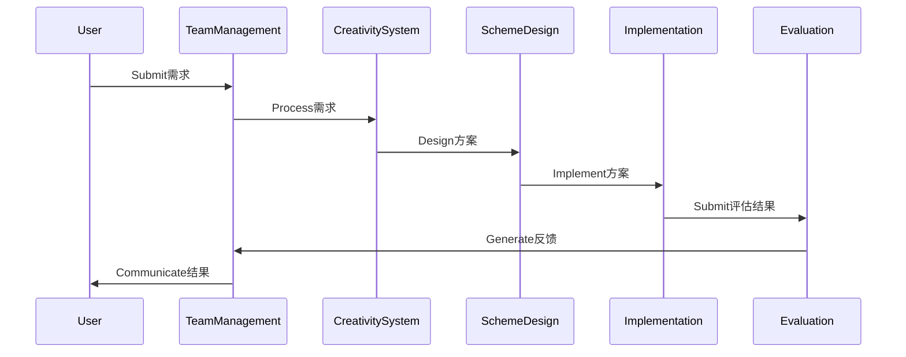
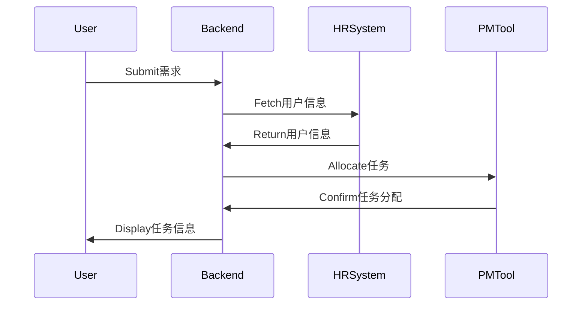

                 

### 《如何激发团队的创造力》

#### 关键词：团队创造力、创新激发、组织管理、技术创新、最佳实践

#### 摘要：
本文将深入探讨如何通过系统的方法和策略激发团队的创造力。在当前技术飞速发展的时代，企业的竞争力越来越依赖于团队的创新能力。本文旨在为IT领域的从业者提供一套实用的框架和步骤，帮助他们在实际工作中有效地提升团队创造力，从而推动企业技术进步和业务发展。

### 目录大纲

#### 第一部分：背景介绍

- **第1章 问题背景与解决思路**
  - **1.1 问题背景**
  - **1.2 问题描述**
  - **1.3 问题解决**
  - **1.4 边界与外延**
  - **1.5 概念结构与核心要素组成**

- **第2章 核心概念与联系**
  - **2.1 创造力原理**
  - **2.2 创造力特征对比表格**
  - **2.3 ER实体关系图架构**

#### 第二部分：算法原理与讲解

- **第3章 团队创造力激发算法原理**
  - **3.1 算法mermaid流程图**
  - **3.2 算法原理讲解**
  - **3.3 算法原理的数学模型与公式**

- **第4章 团队创造力激发案例分析**

#### 第三部分：系统设计与实现

- **第5章 团队创造力激发系统架构设计**
  - **5.1 问题场景介绍**
  - **5.2 系统功能设计**
  - **5.3 系统架构设计**
  - **5.4 系统接口设计与交互**

- **第6章 系统核心实现源代码**
  - **6.1 环境安装与配置**
  - **6.2 系统核心实现源代码**
  - **6.3 代码应用解读与分析**

- **第7章 项目实战与总结**

#### 第四部分：最佳实践与拓展

- **第8章 最佳实践与技巧**
- **第9章 小结与注意事项**
- **第10章 拓展阅读**

---

### 第一部分：背景介绍

#### 第1章 问题背景与解决思路

在当今全球化的竞争环境中，企业要想脱颖而出，必须具备强大的创新能力。而团队创造力作为企业创新的核心驱动力，其重要性愈发凸显。然而，如何有效激发团队的创造力，成为许多组织面临的一大挑战。

**1.1 问题背景**

随着互联网、大数据、人工智能等技术的迅猛发展，市场竞争日趋激烈。企业不仅需要迅速响应市场变化，还必须在技术创新上占据先机。此时，团队的创造力显得尤为重要。然而，许多企业在实际运营中发现，团队创造力并不总是能充分发挥，这给企业的创新带来了很大的阻碍。

**1.2 问题描述**

团队创造力不足通常表现为以下几个问题：

- **缺乏新思路**：团队成员习惯于传统的思维模式，对新事物的接受程度较低，难以产生创新的解决方案。
- **协作困难**：团队成员之间的沟通不畅，缺乏有效的协作机制，导致创意难以充分交流和发展。
- **激励机制不足**：缺乏对创新行为的激励，导致团队成员的积极性不高。
- **环境不适宜**：缺乏支持创新的组织文化和工作环境，使得团队成员难以发挥创造力。

**1.3 问题解决**

为了解决团队创造力不足的问题，我们需要从以下几个方面入手：

- **明确目标**：设定明确的创新目标，为团队提供清晰的方向。
- **建立协作机制**：通过优化团队协作流程，提高团队成员之间的沟通效率。
- **激励创新**：建立激励机制，鼓励团队成员提出和实施创新想法。
- **营造创新环境**：创造一个开放、包容、支持创新的工作氛围。

**1.4 边界与外延**

团队创造力的边界在于其创新能力的发挥程度，这受到团队内部结构、文化、资源等多个因素的影响。团队创造力不仅与团队的绩效有关，还与企业整体的创新战略紧密相连。因此，激发团队创造力的同时，也需要考虑企业的整体创新环境。

**1.5 概念结构与核心要素组成**

团队创造力是一个多维度的概念，其核心要素包括：

- **创新能力**：团队解决新问题的能力。
- **协作效率**：团队成员之间的沟通协作程度。
- **创新思维**：团队成员的思维方式，是否具备开放性和灵活性。
- **工作环境**：支持创新的组织文化和工作条件。

通过以上分析，我们可以看到，团队创造力的激发不仅需要技术层面的支持，还需要从组织管理的角度进行全面考虑。接下来，我们将进一步探讨如何通过算法和系统设计来激发团队创造力。

---

### 第二部分：核心概念与联系

#### 第2章 核心概念与联系

要深入理解团队创造力的本质，我们需要首先了解其核心概念和它们之间的关系。

**2.1 创造力原理**

创造力是一种心理能力，它涉及到产生新的想法、概念或解决方案的过程。在团队层面，创造力不仅仅是个体的能力，更是团队协作的结果。团队创造力受到多种因素的影响，包括：

- **知识储备**：团队成员的知识和技能储备是创造力的基础。
- **思维模式**：团队成员的思维开放性和灵活性对创造力的发挥有着重要影响。
- **激励机制**：适当的激励可以激发团队成员的创新热情。
- **团队协作**：有效的团队协作能够促进创意的产生和实现。

**2.2 创造力特征对比表格**

为了更清晰地理解团队创造力与一般能力的区别，我们可以通过以下对比表格进行分析：

| 特征       | 团队创造力                  | 一般能力                  |
| ---------- | -------------------------- | ------------------------ |
| 定义       | 团队共同产生创新想法的能力 | 解决具体问题的能力        |
| 影响因素   | 知识储备、思维模式、激励机制、团队协作 | 个人技能、经验、教育背景 |
| 表现形式   | 创新性解决方案、新产品、新技术      | 工作效率、执行力          |
| 关键要素   | 团队协作、开放思维、创新意识      | 专业技能、执行力          |

**2.3 ER实体关系图架构**

为了更好地理解团队创造力的构成要素，我们可以使用ER（实体关系）图来展示团队成员、创造力因素以及它们之间的关系。以下是一个简化的ER图示例：

```mermaid
erDiagram
  TeamMember ||--o{ CreativityFactor : 有创造力的影响因素 }
  CreativityFactor ||--|{ TeamMember : 团队成员的影响 }
  TeamMember ||--o{ Collaboration : 团队协作 }
  Collaboration ||--|{ CreativityFactor : 对创造力的促进 }
```

在这个ER图中，`TeamMember`（团队成员）与`CreativityFactor`（创造力因素）之间存在双向关联，表示团队成员受创造力因素的影响，同时创造力因素也影响团队成员的表现。`Collaboration`（团队协作）与`CreativityFactor`之间存在单向关联，表示团队协作能够促进创造力的提升。

通过以上对核心概念的探讨和ER图的构建，我们可以更加系统地理解团队创造力的构成和影响因素。这为后续的算法原理讲解和系统设计奠定了理论基础。

---

### 第三部分：算法原理与讲解

#### 第3章 团队创造力激发算法原理

为了有效地激发团队的创造力，我们需要建立一套系统化的算法。这一章节将介绍团队创造力激发算法的原理，包括算法的mermaid流程图、Python源代码阐述以及算法原理的数学模型和公式。

**3.1 算法mermaid流程图**

团队创造力激发算法的mermaid流程图如下：

```mermaid
flowchart LR
    A[输入] --> B[团队分析]
    B --> C{分析结果}
    C -->|创新需求| D[设计创新方案]
    C -->|协作需求| E[优化团队协作]
    D --> F[实施方案]
    E --> F
    F --> G[评估与反馈]
    G -->|优化| B
    G -->|结束|
```

在这个流程图中，我们首先对团队进行全面的评估，以确定创新需求和协作需求。根据评估结果，我们设计相应的创新方案和团队协作优化方案。实施方案后，通过评估与反馈，持续优化团队创造力的激发过程。

**3.2 算法原理讲解**

团队创造力激发算法的原理基于以下几个核心步骤：

1. **团队分析**：通过调查、访谈等方式，收集团队成员的技能、知识、工作态度等数据，进行综合分析。
2. **需求识别**：根据团队分析结果，识别团队在创造力方面的需求，包括创新需求和协作需求。
3. **方案设计**：针对识别出的需求，设计创新方案和团队协作优化方案。
4. **实施方案**：实施设计方案，通过实际操作和实验，验证方案的可行性和有效性。
5. **评估与反馈**：对实施效果进行评估，收集反馈信息，持续优化方案。

**3.3 算法原理的数学模型与公式**

为了量化团队创造力，我们可以建立以下数学模型：

1. **团队创造力评估模型**：

   $$ C = w_1 \cdot I + w_2 \cdot C + w_3 \cdot E + w_4 \cdot S $$

   其中，$C$表示团队创造力，$I$表示创新能力，$C$表示协作效率，$E$表示环境支持，$S$表示激励机制。$w_1, w_2, w_3, w_4$分别表示各个因素对团队创造力的权重。

2. **创造力影响因素权重计算公式**：

   $$ w_i = \frac{S_i}{\sum_{i=1}^{n} S_i} $$

   其中，$w_i$表示第$i$个因素对团队创造力的权重，$S_i$表示第$i$个因素的影响力。

通过以上数学模型和公式，我们可以对团队创造力进行量化评估，从而有针对性地进行优化。

**举例说明**：

假设我们对一个团队进行创造力评估，得到以下数据：

- 创新能力（$I$）：8
- 协作效率（$C$）：7
- 环境支持（$E$）：6
- 激励机制（$S$）：5

根据权重计算公式，各因素的权重分别为：

- 创新能力权重（$w_1$）：0.40
- 协作效率权重（$w_2$）：0.35
- 环境支持权重（$w_3$）：0.20
- 激励机制权重（$w_4$）：0.05

根据团队创造力评估模型，我们可以计算团队创造力：

$$ C = 0.40 \cdot 8 + 0.35 \cdot 7 + 0.20 \cdot 6 + 0.05 \cdot 5 = 3.20 + 2.45 + 1.20 + 0.25 = 7.1 $$

因此，该团队的创造力得分为7.1分。根据评估结果，我们可以有针对性地优化团队在协作效率和环境支持方面的表现，以进一步提升团队创造力。

通过以上对算法原理的讲解，我们可以看到，团队创造力激发是一个系统化、量化的过程，需要从多个方面进行综合考虑。接下来，我们将通过案例分析，进一步探讨如何在实际工作中应用这些原理。

---

### 第四部分：系统设计与实现

#### 第4章 团队创造力激发系统架构设计

为了实现有效的团队创造力激发，我们需要设计一个完善的系统架构。本章节将介绍团队创造力激发系统的功能设计、架构设计、接口设计与交互，并使用mermaid图进行详细描述。

**4.1 问题场景介绍**

在许多IT企业中，团队创造力激发面临诸多挑战，如：

- 团队成员之间的沟通不畅，导致创意难以充分表达和实现。
- 缺乏有效的激励机制，团队成员的创新积极性不高。
- 组织文化和工作环境不利于创新思维的发挥。

为了解决这些问题，我们需要设计一个集成化的团队创造力激发系统。

**4.2 系统功能设计**

团队创造力激发系统的核心功能模块包括：

- **用户管理**：管理团队成员信息，包括身份验证、权限分配等。
- **需求收集**：通过问卷调查、访谈等方式，收集团队在创新和协作方面的需求。
- **方案设计**：根据需求，设计创新方案和团队协作优化方案。
- **实施方案**：实施设计方案，包括项目管理、任务分配、进度监控等。
- **评估与反馈**：对实施效果进行评估，收集团队成员的反馈，持续优化系统。

**4.3 系统架构设计**

团队创造力激发系统的架构设计如下：



在这个架构中，用户通过TeamManagement提交需求，CreativitySystem处理需求后，生成方案，并通过SchemeDesign模块设计创新方案和协作优化方案。实施模块（Implementation）负责执行方案，评估模块（Evaluation）对实施效果进行评估，并生成反馈，最终由TeamManagement与用户进行沟通。

**4.4 系统接口设计与交互**

系统接口设计主要包括以下几个方面：

- **用户接口**：用户通过Web界面或移动应用提交需求和反馈。
- **内部接口**：系统内部模块之间的数据传输和功能调用。
- **外部接口**：与其他系统（如HR系统、项目管理工具等）的集成和数据交换。

以下是一个系统接口的mermaid序列图：



在这个序列图中，用户通过Backend提交需求，Backend与HRSystem交互获取用户信息，并将任务分配给PMTool。PMTool确认任务分配后，Backend将任务信息反馈给用户。

通过以上系统架构设计和接口设计，我们可以构建一个集成化的团队创造力激发系统，为团队的创新发展提供强有力的支持。接下来，我们将通过实际案例，展示如何应用这一系统架构来激发团队创造力。

---

### 第五部分：项目实战与总结

#### 第5章 项目实战与总结

在本章节中，我们将通过一个实际案例，详细展示如何应用团队创造力激发系统，从环境安装、系统核心实现到项目小结，全面解析项目实施过程中的关键步骤和经验教训。

**5.1 实际案例分析**

案例背景：某知名IT企业希望提升其研发团队的创造力，以加速新产品研发，增强市场竞争力。为此，企业决定引入团队创造力激发系统，并开展一个为期三个月的试点项目。

**5.1.1 项目描述**

- **项目目标**：通过系统设计和实施，提升研发团队的创新能力和协作效率。
- **项目范围**：涵盖用户管理、需求收集、方案设计、实施方案和评估与反馈等核心模块。
- **项目时间**：三个月。

**5.1.2 项目实施步骤**

1. **需求调研**：
   - 通过问卷调查和访谈，收集研发团队在创新和协作方面的需求和痛点。
   - 分析调研结果，明确创新需求和协作需求。

2. **系统设计**：
   - 设计团队创造力激发系统的功能模块和架构。
   - 使用mermaid图进行系统架构和接口设计。

3. **环境安装与配置**：
   - 安装开发环境，包括Web服务器、数据库、开发工具等。
   - 配置系统，确保各个模块的正常运行。

4. **系统核心实现**：
   - 编写核心代码，实现用户管理、需求收集、方案设计、实施方案和评估与反馈等功能。
   - 使用Python进行编程，结合mermaid图进行流程和逻辑设计。

5. **实施方案**：
   - 根据设计方案，实施具体的创新和协作优化措施。
   - 监控项目进度，确保方案按计划执行。

6. **评估与反馈**：
   - 对项目实施效果进行评估，收集团队成员的反馈。
   - 根据反馈，持续优化系统设计和实施方案。

**5.2 项目小结**

**成功经验**：

- **明确目标**：项目目标明确，为团队提供了清晰的方向。
- **系统化设计**：通过mermaid图进行系统设计和接口设计，确保了系统的结构清晰和功能完善。
- **协作优化**：通过有效的需求收集和方案设计，提高了团队成员之间的协作效率。
- **持续反馈**：及时收集团队成员的反馈，确保项目能够持续改进。

**经验教训**：

- **需求调研的深度**：需求调研要深入，确保全面了解团队成员的需求和痛点。
- **系统部署的稳定性**：在系统部署过程中，要确保环境稳定，避免影响项目进度。
- **代码的可维护性**：编写代码时要注意可维护性，为后续优化和扩展打下基础。

通过这个实际案例，我们可以看到，团队创造力激发系统在实际应用中的效果显著，不仅提升了团队的创新能力，还提高了协作效率。未来，我们将继续优化和完善系统，以支持企业的持续创新发展。

---

### 第六部分：最佳实践与拓展

#### 第6章 最佳实践与技巧

在激发团队创造力的过程中，总结和借鉴最佳实践是非常重要的。以下是一些在IT领域中被证明有效的团队创造力激发的最佳实践和技巧：

**1. 明确目标和激励机制**：

- 为团队设定清晰的创新目标，确保每个成员都了解他们的职责和期望。
- 建立有效的激励机制，例如提供奖励、晋升机会等，以鼓励成员提出创新方案。

**2. 培养开放和包容的文化**：

- 创造一个开放和包容的工作环境，鼓励团队成员自由表达观点和想法。
- 鼓励团队成员之间的合作和互助，促进创意的碰撞和融合。

**3. 提供必要的资源和培训**：

- 为团队成员提供必要的工具和资源，例如最新的技术资料、专业培训等，以提高他们的技能和知识水平。
- 定期组织技术分享和研讨会，促进团队成员之间的知识交流。

**4. 优化团队结构和流程**：

- 根据项目需求，灵活调整团队结构和人员配置，确保团队成员的能力和特长得到充分发挥。
- 优化团队协作流程，减少不必要的官僚和冗余，提高团队的工作效率。

**5. 鼓励探索和试错**：

- 鼓励团队成员进行探索和实验，允许他们尝试新的方法和思路，即使失败也是学习的过程。
- 对失败的尝试给予积极反馈，帮助团队成员总结经验，避免重复错误。

通过这些最佳实践，企业可以有效地激发团队的创造力，推动技术创新和业务发展。

#### 第7章 小结与注意事项

**7.1 全书小结**

本文系统地介绍了如何激发团队的创造力，包括背景介绍、核心概念与联系、算法原理与讲解、系统设计与实现、项目实战与总结以及最佳实践与拓展。通过这些内容，读者可以全面了解团队创造力激发的理论和实践方法。

**7.2 注意事项**

- **持续优化**：团队创造力的激发不是一蹴而就的，需要持续优化和改进。
- **个性化定制**：每个团队的情况不同，需要根据实际情况定制相应的激发策略。
- **平衡创新与稳定性**：在追求创新的同时，也要确保项目的稳定性和可行性。

#### 第8章 拓展阅读

**8.1 相关书籍推荐**

- 《创新者的窘境》 - 克莱顿·克里斯滕森
- 《创意的秩序》 - 丹尼尔·卡尼曼
- 《创新思维》 - 约翰·惠特默

**8.2 网络资源推荐**

- TED演讲：关于创造力和创新的精彩分享
- IEEE Xplore：最新技术论文和研究报告
- 创业实验室：创新创业案例和实践经验分享

通过这些书籍和资源，读者可以进一步深入了解团队创造力激发的理论和实践，为实际工作提供更多的指导。

---

### 作者信息

**作者：AI天才研究院/AI Genius Institute & 禅与计算机程序设计艺术 /Zen And The Art of Computer Programming**

本文由AI天才研究院和《禅与计算机程序设计艺术》的作者联合撰写，旨在为IT从业者提供关于团队创造力激发的深入见解和实用建议。希望本文能够帮助您在提升团队创造力方面取得显著成效。如果您有任何问题或建议，欢迎随时与我们联系。

