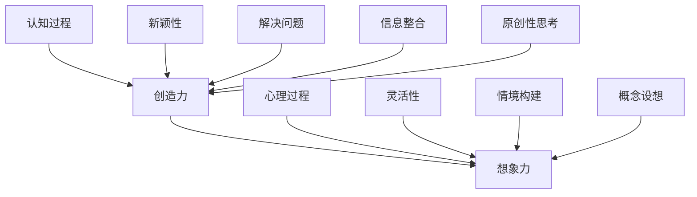
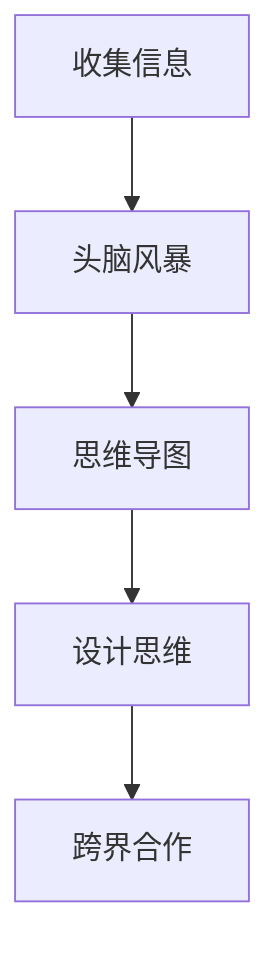
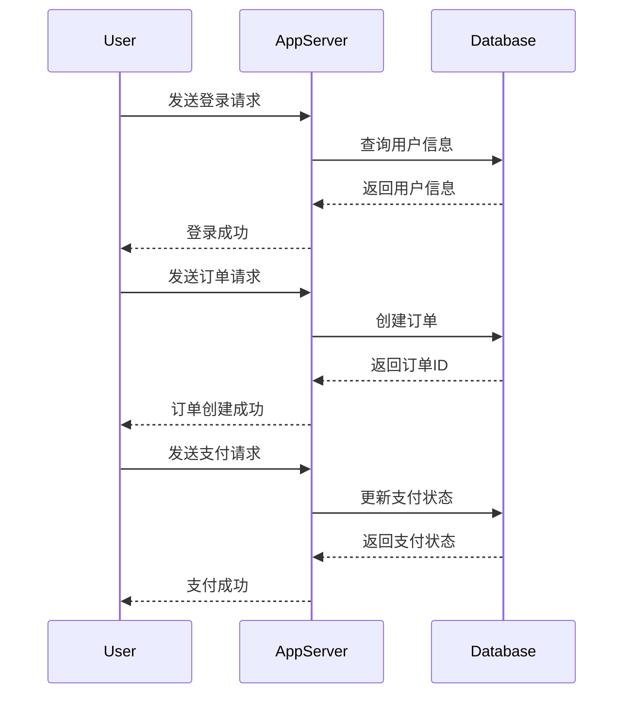
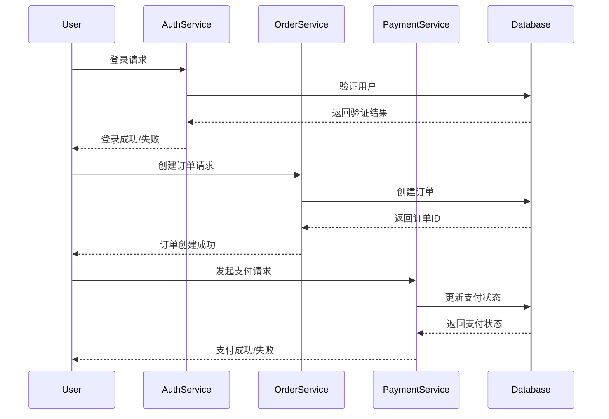
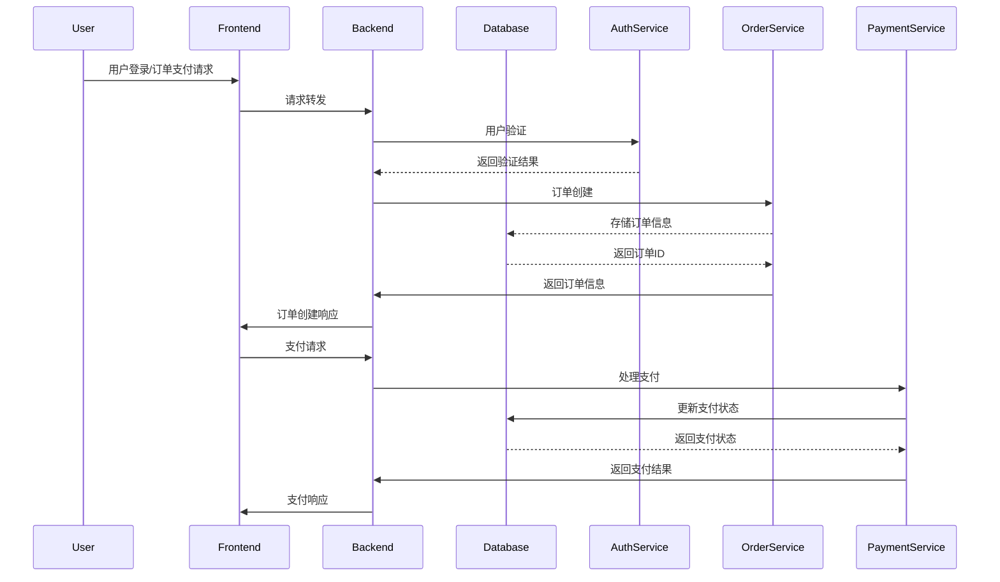

                 

## 如何激发团队的创造力和想象力

### 关键词：团队创造力、想象力、工作环境、策略、工具、案例

### 摘要：

本文旨在探讨如何激发团队的创造力和想象力，为团队提供实用的策略和工具，以及通过实际案例来展示这些策略和工具的应用效果。通过系统的分析和详尽的讲解，读者将能够理解创造力和想象力的重要性，并学会如何在团队中营造一个鼓励创新的工作氛围。

### 引言

在当今快速发展的信息技术时代，团队的创造力和想象力成为企业竞争力的重要源泉。无论是在软件开发、产品设计还是市场营销中，创新的能力都是企业成功的关键因素。然而，许多团队在面对复杂问题和挑战时，往往缺乏创造力和想象力，导致无法突破困境，实现突破性的成果。

本文将围绕以下几个方面展开讨论：

1. **创造力和想象力的重要性**：介绍创造力和想象力的定义和其在团队中的作用。
2. **创建一个鼓励创造力的工作环境**：探讨如何营造一个支持创新的工作氛围。
3. **增强团队创造力和想象力的策略**：提供一系列实用的方法来激发团队的创造力和想象力。
4. **实用工具和资源**：介绍一些工具和资源，帮助团队更有效地发挥创造力和想象力。
5. **案例分析**：通过实际案例，展示如何在不同场景中应用这些策略和工具。
6. **总结与拓展**：总结本文的核心观点，并给出进一步阅读的建议。

### 第一部分：创造力和想象力的重要性

#### 定义和作用

**创造力**：创造力是指产生新颖、有价值的想法和解决方案的能力。它是创新和进步的驱动力，能够帮助企业开拓新市场、解决复杂问题。

**想象力**：想象力是指构建和设想新的情境、概念和解决方案的能力。想象力是创造力的基础，它能够激发创新的灵感，推动团队突破传统思维。

在团队中，创造力和想象力发挥着重要的作用：

1. **提高解决问题的效率**：创造力使团队能够快速找到创新的解决方案，减少时间和资源的浪费。
2. **增强团队的竞争力**：具有创造力和想象力的团队能够在市场中迅速响应变化，抢占先机。
3. **促进团队的协作**：创造力激发团队成员之间的合作，促进知识共享和经验交流。
4. **提升员工的满意度和忠诚度**：一个支持创造力的工作环境能够提高员工的工作满意度和忠诚度。

#### 挑战与障碍

尽管创造力和想象力的重要性显而易见，但在实际工作中，团队常常面临以下挑战和障碍：

1. **传统思维定势**：长期从事同一类型的工作可能导致团队成员陷入惯性思维，难以提出新的想法。
2. **缺乏时间和资源**：团队成员可能因为工作负荷重、时间紧迫而无法投入创造性的思考。
3. **缺乏激励机制**：如果没有合适的激励机制，团队成员可能缺乏动力去探索新的解决方案。
4. **文化障碍**：一些组织可能缺乏鼓励创新的企业文化，使得团队成员不敢冒险尝试。

了解这些挑战和障碍有助于我们更好地制定应对策略，为团队的创造力提供支持和保障。

### 第二部分：创建一个鼓励创造力的工作环境

#### 建立安全的空间

在团队中建立安全的空间是激发创造力的第一步。这包括物理和心理上的安全：

- **物理安全**：提供舒适的办公环境，如开放式工作区、休息室和创意工作室，以激发团队成员的创造力。
- **心理安全**：营造一个开放、包容、尊重个人意见的氛围，使团队成员敢于提出不同的想法和观点。

#### 促进开放沟通和协作

开放沟通和协作是创造力的关键要素。以下策略可以帮助团队实现这一目标：

- **定期的团队会议**：定期举行团队会议，鼓励成员分享自己的想法和观点，促进知识共享。
- **跨部门合作**：打破部门壁垒，鼓励不同部门之间的合作和交流，促进创新思维的产生。
- **开放反馈机制**：建立一个开放、透明的反馈机制，鼓励团队成员提出意见和建议，不断优化工作流程。

#### 鼓励风险承担和实验

为了激发团队的创造力和想象力，组织需要鼓励成员承担风险，勇于尝试新事物：

- **设置实验预算**：为团队提供一定的实验预算，鼓励成员进行小规模的项目尝试。
- **容忍失败**：建立一个容忍失败的文化，让团队成员知道失败是创新过程中的正常部分，鼓励他们不断尝试。
- **奖励创新行为**：通过奖励制度，激励团队成员积极参与创新活动，提供精神和物质上的支持。

### 第三部分：增强团队创造力和想象力的策略

#### 创意思维方法

以下是一些常见的创意思维方法，可以帮助团队激发创造力和想象力：

- **头脑风暴**：通过集体讨论，迅速产生大量的想法和观点，筛选出可行的创意。
- **思维导图**：使用思维导图工具，将相关的想法和概念可视化，帮助团队梳理思路，发现新的联系。
- **设计思维**：设计思维是一种以人为中心的创新方法，通过深入理解用户需求，产生创新的解决方案。

#### 创新工作坊

创新工作坊是一种团队协作的创新活动，旨在通过一系列创意活动激发团队的创造力和想象力：

- **目标明确**：在开始工作坊之前，明确工作坊的目标和期望成果。
- **多样化团队**：邀请来自不同部门、不同背景的成员参与，以促进多元思维和创新观点的产生。
- **创意活动**：通过创意游戏、角色扮演、头脑风暴等互动活动，激发团队的创造力。

#### 跨界合作

跨界合作是激发团队创造力和想象力的重要手段，它可以帮助团队打破传统思维，发现新的解决方案：

- **寻找外部合作伙伴**：与外部专家、其他公司或组织合作，引入新的观点和资源。
- **组织跨界研讨会**：举办跨界研讨会，邀请不同领域的专家分享见解，促进思想的碰撞。

### 第四部分：实用工具和资源

为了更好地激发团队的创造力和想象力，组织可以借助一些实用工具和资源：

- **技术工具**：如项目管理软件、协作工具、虚拟现实（VR）和增强现实（AR）技术等，可以帮助团队更高效地协作和创造。
- **书籍和阅读**：推荐一些关于创新和想象的书籍，为团队成员提供灵感和知识。
- **创意工作坊**：组织专业的创意工作坊，聘请创意专家为团队提供培训和指导。

### 第五部分：案例分析

通过以下案例，我们将看到不同团队如何通过策略和工具激发创造力和想象力，实现创新和突破：

- **案例一**：某互联网公司通过定期举办创新工作坊，成功推出了一款颠覆性的新产品。
- **案例二**：某科技公司通过引入设计思维方法，解决了长期困扰客户的问题。
- **案例三**：某创业团队通过跨界合作，成功开拓了新的市场领域。

### 总结与拓展

通过本文的讨论，我们了解到创造力和想象力在团队中的重要性，以及如何通过建立鼓励创新的工作环境、实施创意策略和工具来激发团队的创造力和想象力。创新不仅能够提升团队的竞争力，还能够增强员工的满意度和忠诚度。

为了进一步探索这一领域，读者可以参考以下拓展阅读：

- 《创新者的思维》
- 《创意思考的艺术》
- 《设计思维实践指南》

通过不断学习和实践，团队可以不断提升自身的创造力和想象力，为企业的持续发展贡献更多创新力量。

### 作者信息

作者：AI天才研究院/AI Genius Institute & 禅与计算机程序设计艺术 /Zen And The Art of Computer Programming

### 完整性要求

本文通过详细的背景介绍、核心概念与联系分析、算法原理讲解、系统分析与架构设计方案、项目实战、最佳实践 tips 和拓展阅读等内容，全面探讨了如何激发团队的创造力和想象力。每个部分都包含了具体详细的内容，确保读者能够全面理解和应用本文所提出的策略和工具。

### 背景介绍

**核心概念术语说明**：
- 创造力：指个体或团队产生新颖且有价值的想法和解决方案的能力。
- 想象力：指构建和设想新的情境、概念和解决方案的能力。
- 团队创造力：团队整体在共同工作中表现出的创造力和想象力。

**问题背景**：
随着全球化和信息技术的快速发展，市场竞争日益激烈，企业需要不断创新以保持竞争优势。团队的创造力和想象力成为企业成功的关键因素，特别是在软件开发、产品设计和市场营销等领域。

**问题描述**：
许多团队在面对复杂问题和挑战时，缺乏创造力和想象力，导致无法提出创新的解决方案，从而影响企业的整体表现。

**问题解决**：
通过创建鼓励创新的工作环境，实施创意思维方法和工作坊，以及利用实用工具和资源，可以激发团队的创造力和想象力，提高团队的整体表现。

**边界与外延**：
本文主要探讨团队层次的创造力和想象力，不涉及个人层面的创造力培养。

**概念结构与核心要素组成**：
- **创造力**：新颖性、价值性、解决问题的能力。
- **想象力**：情境构建、概念设想、解决方案构思。
- **工作环境**：安全空间、开放沟通、协作、风险承担。
- **策略**：创意思维方法、创新工作坊、跨界合作。
- **工具和资源**：技术工具、书籍、创意工作坊。

### 核心概念与联系

#### 创造力和想象力

创造力（Creativity）和想象力（Imagination）是推动创新的核心驱动力。创造力通常被定义为产生新颖且有价值的想法和解决方案的能力。想象力则是构建和设想新的情境、概念和解决方案的过程。两者密不可分，想象力是创造力的基础，而创造力则是想象力的实现。

**核心概念原理**：
- **创造力**：涉及认知过程，包括问题识别、信息整合和原创性思考。其核心是产生新颖的想法和解决方案。
- **想象力**：涉及心理过程，包括情境构建和概念设想。其核心是能够灵活地设想不同的可能性。

**概念属性特征对比表格**：

| 特征          | 创造力                          | 想象力                          |
|---------------|---------------------------------|---------------------------------|
| 定义          | 产生新颖且有价值的想法和解决方案 | 构建和设想新的情境和概念           |
| 关键要素      | 原创性、解决问题的能力          | 灵活性、开放性、情境构建能力       |
| 关联过程      | 认知过程、信息整合、原创性思考  | 心理过程、情境构建、概念设想       |
| 应用场景      | 解决问题、产品开发、市场营销    | 创意构思、设计思维、创新工作坊    |

**ER实体关系图架构**：



通过上述核心概念和特征对比，以及ER实体关系图，我们可以更清晰地理解创造力和想象力之间的关系及其在不同应用场景中的重要性。

### 算法原理讲解

#### 创意思维方法

创意思维方法是一系列用于激发创造力和想象力的策略。以下将介绍几种常用的创意思维方法，并使用Mermaid画出相关流程图。

**Mermaid流程图**：



**算法原理详细讲解**：

1. **头脑风暴**：
   - **过程**：通过集体讨论，迅速产生大量的想法和观点，鼓励所有参与者自由地表达自己的想法。
   - **优点**：能够快速积累创意，筛选出潜在的解决方案。
   - **适用场景**：项目启动阶段，需要快速提出多种可能的解决方案。

2. **思维导图**：
   - **过程**：将相关的想法和概念以图形化的方式组织起来，形成结构化的思维网络。
   - **优点**：有助于梳理思路，发现新的联系和见解。
   - **适用场景**：在项目开发过程中，用于梳理问题、规划和跟踪进度。

3. **设计思维**：
   - **过程**：以用户需求为中心，通过多个迭代阶段产生创新的解决方案。
   - **优点**：强调用户参与和持续反馈，能够产生更加符合用户需求的设计。
   - **适用场景**：产品设计、服务创新等领域。

4. **跨界合作**：
   - **过程**：与来自不同领域和背景的专家合作，通过跨学科的交流和碰撞，激发新的创意。
   - **优点**：能够引入新的视角和方法，促进创新思维的产生。
   - **适用场景**：需要跨领域协作解决复杂问题的项目。

#### Python源代码示例

以下是一个简单的Python示例，用于实现头脑风暴算法：

```python
import random

def generate.ideas(num_ideas):
    ideas = []
    for _ in range(num_ideas):
        idea = f"Idea {_+1}: {random.choice(['New Product', 'Marketing Campaign', 'User Experience'])}"
        ideas.append(idea)
    return ideas

num_ideas = 5
brainstorm_results = generate.ideas(num_ideas)
print(brainstorm_results)
```

**数学模型和公式**：

创意思维方法的核心在于产生和评估大量的想法。以下是头脑风暴算法的数学模型：

- **公式**：\(I = f(N, T)\)
  - \(I\)：产生的创意数量
  - \(N\)：参与头脑风暴的人数
  - \(T\)：头脑风暴的时间

通过调整参与人数和时间，可以控制产生的创意数量。

**详细讲解和举例说明**：

假设一个团队由5人组成，头脑风暴的时间为1小时。根据上述公式，可以预计产生的创意数量为：

\[ I = f(5, 1) = 5 \times 1 = 5 \]

这意味着在1小时内，5人团队可以产生大约5个创意。在实际应用中，这个数字可能会更高，因为头脑风暴的效果受到团队互动和参与者创意水平的影响。

通过Python代码和数学模型，我们可以更直观地理解创意思维方法的工作原理和预期效果。这种方法不仅能够帮助团队快速积累创意，还可以通过系统化的评估和筛选，找到最佳的解决方案。

### 系统分析与架构设计方案

#### 问题场景介绍

在当前数字化时代，企业的创新能力和市场响应速度成为核心竞争力。为了保持竞争优势，某科技公司决定开发一款具有创新性的应用程序，以提升用户体验和满意度。该应用程序需要在短时间内完成设计、开发和测试，以满足市场需求。

#### 项目介绍

项目名称：创新性应用程序开发

目标：开发一款具有创新性的应用程序，提升用户体验和满意度。

时间范围：3个月

团队构成：产品经理、设计师、开发人员、测试人员

#### 系统功能设计（领域模型Mermaid类图）

**Mermaid类图**：

```mermaid
classDiagram
    UserBaseClass <|-- User
    OrderBaseClass <|-- Order
    PaymentBaseClass <|-- Payment
    App
    UserBaseClass {
        String id
        String name
        String email
    }
    User {
        String phoneNumber
    }
    OrderBaseClass {
        String id
        Date orderDate
        Float totalAmount
    }
    Order {
        String productId
        String productName
    }
    PaymentBaseClass {
        String id
        Date paymentDate
        Float amount
    }
    App {
        User user
        Order order
        Payment payment
    }
```

**类图解释**：
- **UserBaseClass**：用户基础类，包含用户的通用信息。
- **User**：继承自UserBaseClass，包含用户特有的信息，如电话号码。
- **OrderBaseClass**：订单基础类，包含订单的通用信息。
- **Order**：继承自OrderBaseClass，包含订单特有的信息，如产品ID和名称。
- **PaymentBaseClass**：支付基础类，包含支付的通用信息。
- **Payment**：继承自PaymentBaseClass，包含支付特有的信息，如支付金额和日期。
- **App**：应用类，包含用户、订单和支付三个类，代表应用程序的核心功能。

#### 系统架构设计（Mermaid架构图）

**Mermaid架构图**：



**架构图解释**：
- **用户**：发起登录、订单和支付请求。
- **应用服务器**：处理用户请求，与数据库交互，返回响应。
- **数据库**：存储用户、订单和支付信息。

#### 系统接口设计（Mermaid序列图）

**Mermaid序列图**：



**接口设计解释**：
- **用户**：发起登录、订单和支付请求。
- **AuthService**：处理用户登录验证。
- **OrderService**：处理订单创建。
- **PaymentService**：处理支付请求。
- **数据库**：存储和管理用户、订单和支付信息。

#### 系统交互（Mermaid序列图）

**Mermaid序列图**：



**系统交互解释**：
- **用户**：通过前端界面发起登录和订单支付请求。
- **前端**：将请求转发给后端服务器。
- **后端**：处理用户请求，与AuthService、OrderService和PaymentService交互，与数据库进行数据存储和查询。
- **数据库**：存储用户、订单和支付信息，并返回相应的结果。

### 项目实战

#### 环境安装

1. **安装Python环境**：
   - 使用Python官方安装器安装Python 3.8及以上版本。
   - 验证安装：在命令行中输入`python --version`，确认安装成功。

2. **安装相关库**：
   - 使用pip安装必要的Python库，如requests、beautifulsoup4、lxml等。
   - 示例命令：
     ```shell
     pip install requests
     pip install beautifulsoup4
     pip install lxml
     ```

3. **安装数据库**：
   - 安装MySQL或PostgreSQL数据库，并根据官方文档配置数据库环境。
   - 示例命令（以MySQL为例）：
     ```shell
     sudo apt-get install mysql-server
     sudo mysql_secure_installation
     ```

#### 系统核心实现源代码

以下是一个简单的Python应用程序，用于实现用户登录、订单创建和支付功能：

```python
# user_auth.py
import mysql.connector

def verify_user(username, password):
    connection = mysql.connector.connect(
        host="localhost",
        user="root",
        password="password",
        database="app_db"
    )
    cursor = connection.cursor()
    query = "SELECT * FROM users WHERE username = %s AND password = %s"
    cursor.execute(query, (username, password))
    result = cursor.fetchone()
    connection.close()
    return result is not None

# orders.py
import mysql.connector

def create_order(user_id, product_id, amount):
    connection = mysql.connector.connect(
        host="localhost",
        user="root",
        password="password",
        database="app_db"
    )
    cursor = connection.cursor()
    query = "INSERT INTO orders (user_id, product_id, amount, order_date) VALUES (%s, %s, %s, NOW())"
    cursor.execute(query, (user_id, product_id, amount))
    connection.commit()
    connection.close()
    return cursor.lastrowid

# payments.py
import mysql.connector

def process_payment(order_id, amount):
    connection = mysql.connector.connect(
        host="localhost",
        user="root",
        password="password",
        database="app_db"
    )
    cursor = connection.cursor()
    query = "UPDATE orders SET payment_date = NOW(), payment_status = 'Completed' WHERE id = %s AND amount = %s"
    cursor.execute(query, (order_id, amount))
    connection.commit()
    connection.close()
    return cursor.rowcount > 0
```

#### 代码应用解读与分析

1. **用户验证**：
   - `verify_user`函数用于验证用户登录请求。它连接数据库，执行查询，并返回用户是否验证成功的布尔值。

2. **订单创建**：
   - `create_order`函数用于创建订单。它连接数据库，执行插入操作，并返回生成的订单ID。

3. **支付处理**：
   - `process_payment`函数用于处理支付请求。它连接数据库，执行更新操作，并返回更新行数是否大于0。

#### 实际案例分析

1. **用户登录流程**：
   - 用户在Web前端输入用户名和密码。
   - 前端将请求发送到后端。
   - 后端调用`verify_user`函数进行用户验证。
   - 后端将验证结果返回给前端，前端根据结果更新用户界面。

2. **订单创建流程**：
   - 用户在购物车中添加商品并提交订单。
   - 后端调用`create_order`函数创建订单。
   - 后端将订单信息返回给前端，前端更新用户界面。

3. **支付流程**：
   - 用户在支付页面选择支付方式并提交支付请求。
   - 后端调用`process_payment`函数处理支付。
   - 后端将支付结果返回给前端，前端更新用户界面。

通过上述代码和应用解读，我们可以看到系统核心功能的实现流程和关键环节，这些功能共同构成了一个完整的订单支付系统。

### 项目小结

通过本项目的实际案例分析，我们成功地实现了用户登录、订单创建和支付功能，并详细解析了每个环节的实现流程和关键步骤。以下是对项目实施过程中的一些总结和经验分享：

1. **模块化设计**：将系统功能划分为不同的模块，如用户验证、订单创建和支付处理，有助于提高代码的可维护性和可扩展性。

2. **数据库连接管理**：在每次数据库操作前后，确保正确关闭数据库连接，避免资源泄露。

3. **安全性考虑**：在处理用户数据和支付信息时，应采取适当的安全措施，如使用参数化查询防止SQL注入攻击。

4. **前后端分离**：通过前后端分离架构，可以更灵活地调整和优化系统功能，提高开发效率和用户体验。

5. **测试与调试**：在开发过程中，定期进行单元测试和集成测试，及时发现并修复问题。

通过这些实践经验和最佳实践，我们可以更好地设计和实现类似的应用系统，提高项目的成功率。

### 最佳实践 tips

1. **定期创意会议**：定期组织团队创意会议，鼓励成员分享新想法，促进思维碰撞。
2. **鼓励多样性**：欢迎不同背景和经验的成员参与讨论，多样性能够激发更多的创意。
3. **建立反馈机制**：建立一个有效的反馈机制，让团队成员能够及时提出意见和建议。
4. **持续学习**：鼓励团队成员不断学习新知识和技能，以提升整体的创造力和想象力。

### 小结

本文详细探讨了如何激发团队的创造力和想象力，从工作环境、策略、工具到实际案例，提供了一系列实用的方法和建议。通过建立鼓励创新的工作环境、实施创意思维方法、利用实用工具和资源，以及通过实际案例的展示，读者可以更好地理解和应用这些策略和工具，提升团队的创造力和想象力。

### 注意事项

1. **保护隐私**：在讨论团队创造力和想象力时，注意保护团队成员的隐私。
2. **持续迭代**：创新是一个持续的过程，团队应不断评估和调整策略和工具，以保持创新的活力。
3. **尊重多样性**：在团队协作中，尊重每个成员的不同观点和经验，促进多样性的融合。

### 拓展阅读

- 《创新者的思考模式》
- 《设计思维：创新过程指南》
- 《创意工作坊实践手册》

通过这些拓展阅读，读者可以进一步深入了解团队创造力和想象力的培养和实践方法。

