                 

# 《如何进行有效的一对一员工面谈》

## 关键词：员工面谈、沟通技巧、管理策略、人际关系、绩效提升

### 摘要：

本文将深入探讨如何进行有效的一对一员工面谈，帮助管理者提升员工关系，提高绩效。通过背景介绍、核心概念与联系分析，以及详细的实施步骤和特殊情况处理，本文旨在为读者提供一套系统且实用的面谈方法论，帮助他们在实际工作中取得更好的效果。

---

## 第一部分：背景与概念

### 第1章：问题背景与意义

### 1.1 面谈在管理中的重要性

在企业管理中，一对一员工面谈是一项至关重要的管理工具。它不仅是管理层与员工沟通的桥梁，更是了解员工需求、提升员工满意度和工作效率的重要手段。有效的面谈能够帮助管理者及时发现问题、解决问题，从而实现组织目标。

### 1.2 一对一员工面谈的挑战

然而，进行有效的一对一面谈并非易事。管理者需要面对的挑战包括：如何建立信任关系、如何引导员工坦诚表达、如何处理员工的负面情绪等。这些挑战决定了面谈的成败。

### 1.3 有效面谈的目标和好处

有效的一对一面谈应具备以下目标：1）了解员工的工作状况和需求；2）建立和维护良好的工作关系；3）解决员工问题，提升工作效率。通过有效面谈，管理者能够获得以下好处：1）提高员工满意度；2）增强团队凝聚力；3）提升组织绩效。

## 第2章：核心概念与联系

### 2.1 面谈的类型与区别

一对一员工面谈可以分为以下几种类型：1）绩效评估面谈；2）员工关系面谈；3）职业发展面谈。每种类型的面谈都有其特定的目的和方法。

### 2.2 面谈的核心概念

面谈的核心概念包括：沟通、信任、倾听、反馈、情绪管理等。这些概念构成了面谈的基本要素，是管理者需要掌握的关键技能。

### 2.3 面谈与员工关系管理

面谈与员工关系管理密切相关。通过有效的面谈，管理者能够了解员工的需求和期望，从而制定出更符合员工利益的决策，进一步巩固和提升员工关系。

## 第3章：准备与计划

### 3.1 面谈前的准备工作

进行有效的一对一面谈，准备工作至关重要。管理者需要提前了解员工的背景信息、工作状况和问题，以便有针对性地进行面谈。

### 3.2 制定面谈议程

制定详细的面谈议程可以帮助管理者有计划地进行面谈，确保面谈内容全面且有条理。

### 3.3 建立良好的开场与氛围

开场是面谈的关键，管理者需要以积极的态度和友善的语言，迅速建立与员工的信任关系，为面谈的顺利进行奠定基础。

---

## 第二部分：实施步骤

### 第4章：开场技巧

#### 4.1 破冰与建立信任

**Mermaid 流程图：**
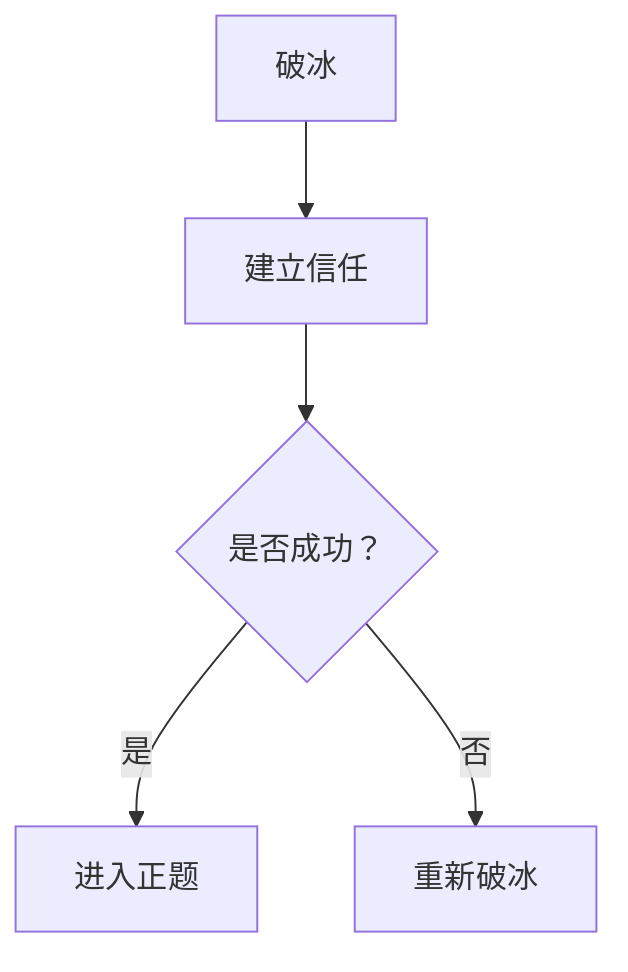

**示例代码：**
```python
def break_the_ice():
    print("你好，很高兴见到你。今天我们有一个重要的面谈。")

def establish_trust():
    print("我相信你可以坦诚地分享你的想法和感受。")

def check_success():
    trust = input("你觉得我们是否建立了信任？(是/否)")
    if trust == "是":
        print("很好，我们可以继续。")
    else:
        print("让我们再试一次，好吗？")
        break_the_ice()
        establish_trust()

break_the_ice()
establish_trust()
check_success()
```

### 4.2 使用积极倾听

**Mermaid 流程图：**
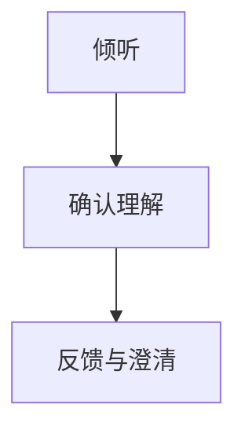

**示例代码：**
```python
def active_listening():
    print("请告诉我你的想法。我会认真倾听并确保我理解正确。")

def confirm_understanding():
    print("根据我的理解，你的意思是……")

def feedback_and_clarification():
    feedback = input("我的理解正确吗？如果需要，你可以进一步说明。")
    if feedback == "是":
        print("很好，我们继续。")
    else:
        print("让我再问一些问题来澄清。")

active_listening()
confirm_understanding()
feedback_and_clarification()
```

### 4.3 开场问题的技巧

**Mermaid 流程图：**
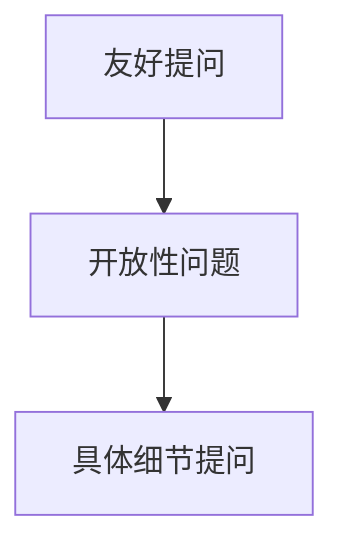

**示例代码：**
```python
def friendly_question():
    print("今天的工作怎么样？有什么新鲜事吗？")

def open_question():
    print("你最近在工作上遇到了什么挑战吗？")

def specific_details_question():
    challenge = input("请详细描述一下，你觉得最棘手的问题是什么？")
    print("好的，那么你是怎么应对这个问题的呢？")

friendly_question()
open_question()
specific_details_question()
```

---

这些开场技巧旨在帮助管理者迅速与员工建立联系，营造一个开放、信任和积极的沟通氛围。

---

### 第5章：有效沟通

#### 5.1 沟通技巧与原则

**Mermaid 流程图：**
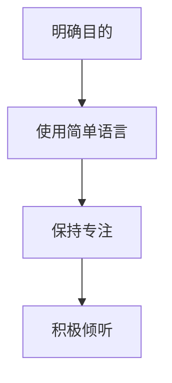

**示例代码：**
```python
def effective_communication():
    print("在进行沟通时，我们需要明确沟通的目的。")
    print("使用简单、易懂的语言，确保信息传达的准确性。")
    print("保持专注，避免分心，确保对方感受到你的关注。")

effective_communication()
```

#### 5.2 提问与反馈技巧

**Mermaid 流程图：**
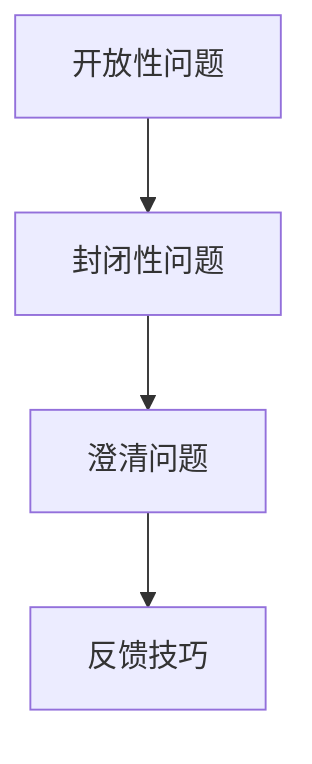

**示例代码：**
```python
def ask_questions():
    print("请提出开放性问题，帮助我们更深入地了解你的想法。")

def clarification_question():
    print("你对这个问题的理解是什么？")

def feedback():
    print("请告诉我你对这个回答的满意度。")

ask_questions()
clarification_question()
feedback()
```

#### 5.3 处理冲突与难答问题

**Mermaid 流程图：**
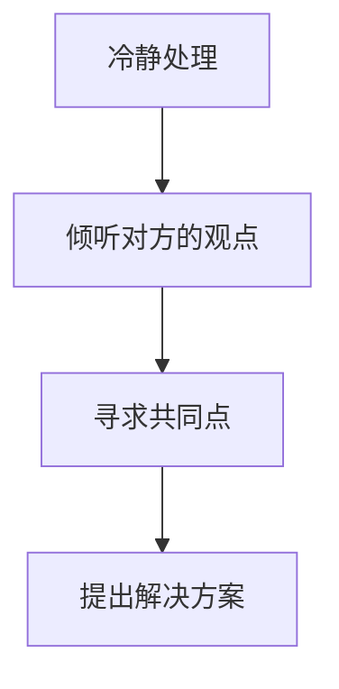

**示例代码：**
```python
def handle_conflict():
    print("在处理冲突时，我们首先要保持冷静。")
    print("倾听对方的观点，寻找共同点。")
    print("然后提出解决方案，寻求双赢。")

handle_conflict()
```

---

### 第6章：倾听与回应

#### 6.1 深入倾听的技巧

**Mermaid 流程图：**
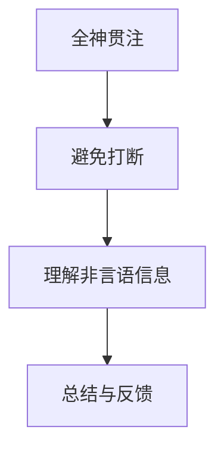

**示例代码：**
```python
def deep_listening():
    print("在倾听时，我们需要全神贯注，避免打断。")
    print("理解对方的非言语信息，如肢体语言和面部表情。")
    print("然后总结对方的观点，并提供反馈。")

deep_listening()
```

#### 6.2 回应的技巧

**Mermaid 流程图：**
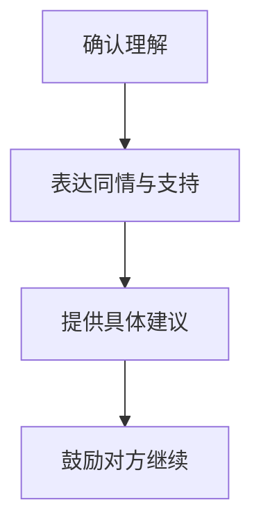

**示例代码：**
```python
def respond():
    print("在回应时，我们首先要确认我们理解了对方的意思。")
    print("表达同情和支持，让对方感受到关心。")
    print("提供具体建议，帮助对方解决问题。")
    print("鼓励对方继续分享，创造开放的沟通环境。")

respond()
```

#### 6.3 非言语沟通的应用

**Mermaid 流程图：**
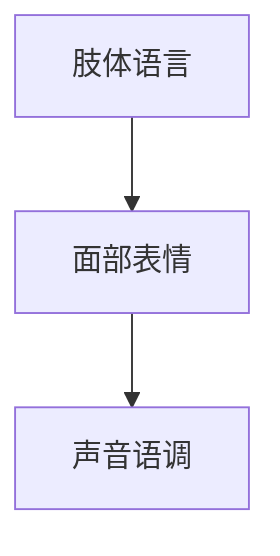

**示例代码：**
```python
def nonverbal_communication():
    print("非言语沟通同样重要。")
    print("通过肢体语言表达开放和友好。")
    print("使用面部表情和声音语调传达情感和态度。")

nonverbal_communication()
```

---

倾听和回应是有效沟通的核心，通过深入倾听和恰当的回应，管理者能够建立信任，解决问题，提升员工关系。

---

### 第7章：记录与总结

#### 7.1 面谈记录的重要性

**Mermaid 流程图：**
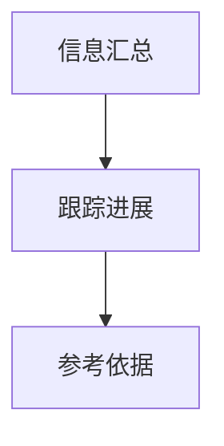

**示例代码：**
```python
def record_importance():
    print("记录面谈内容非常重要。")
    print("它可以帮助我们汇总信息，跟踪进展。")
    print("在需要时，它也可以作为参考依据。")

record_importance()
```

#### 7.2 记录的技巧与注意事项

**Mermaid 流程图：**
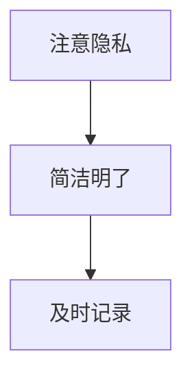

**示例代码：**
```python
def record_tips():
    print("在记录时，我们首先要保护员工的隐私。")
    print("使用简洁明了的语言记录关键信息。")
    print("及时记录，避免事后忘记。")

record_tips()
```

#### 7.3 面谈结果的总结与反馈

**Mermaid 流程图：**
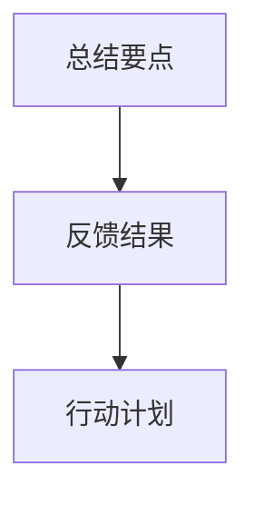

**示例代码：**
```python
def summary_and_feedback():
    print("在面谈结束后，我们需要总结要点。")
    print("向员工反馈结果，并讨论行动计划。")
    print("确保双方对下一步行动有明确的理解。")

summary_and_feedback()
```

---

记录和总结是面谈的重要环节，通过有效的记录和总结，管理者能够确保面谈效果，并为后续行动提供依据。

---

## 第三部分：特殊情况处理

### 第8章：员工情绪管理

#### 8.1 情绪认知与自我调节

**Mermaid 流程图：**
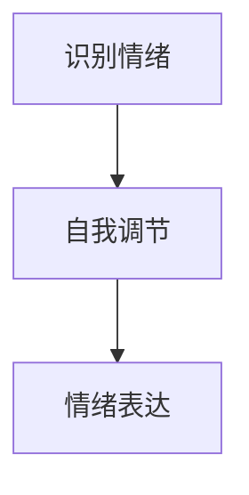

**示例代码：**
```python
def emotion_management():
    print("在管理员工情绪时，我们首先要识别自己的情绪。")
    print("学会自我调节，避免情绪影响到面谈。")
    print("学会以恰当的方式表达情绪，避免伤害对方。")

emotion_management()
```

#### 8.2 处理员工负面情绪

**Mermaid 流�流程图：**
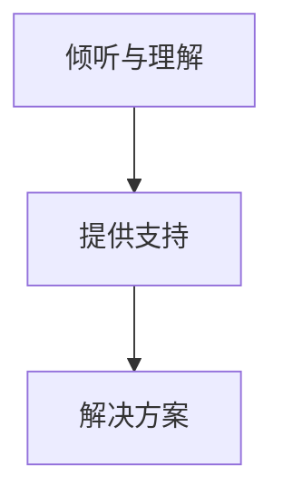

**示例代码：**
```python
def handle_negative_emotions():
    print("在处理员工负面情绪时，我们首先要倾听和理解。")
    print("提供支持，让对方感受到关心。")
    print("共同探讨解决方案，帮助对方走出困境。")

handle_negative_emotions()
```

#### 8.3 情绪管理的技巧

**Mermaid 流程图：**
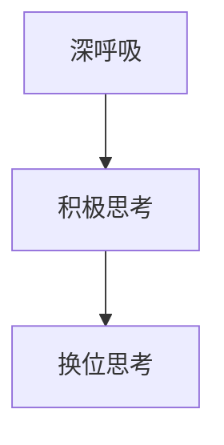

**示例代码：**
```python
def emotion_management_tips():
    print("在情绪管理中，深呼吸可以帮助我们冷静下来。")
    print("积极思考和换位思考可以减少负面情绪。")
    print("学会调整心态，以更积极的态度面对问题。")

emotion_management_tips()
```

---

情绪管理是有效面谈的关键，通过正确的情绪认知和自我调节，管理者能够更好地应对员工的负面情绪。

---

### 第9章：处理争议与敏感话题

#### 9.1 争议的处理原则

**Mermaid 流程图：**
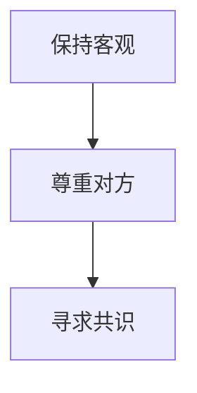

**示例代码：**
```python
def handle_disputes():
    print("在处理争议时，我们首先要保持客观。")
    print("尊重对方的观点，避免情绪化。")
    print("寻求共识，找到双方都能接受的解决方案。")

handle_disputes()
```

#### 9.2 敏感话题的应对策略

**Mermaid 流程图：**
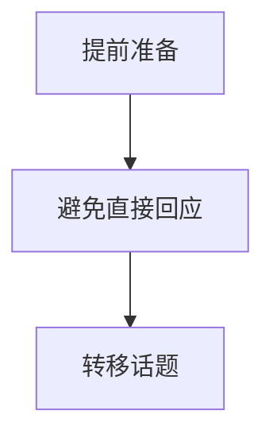

**示例代码：**
```python
def handle_senstive_topics():
    print("在应对敏感话题时，我们首先要提前准备。")
    print("避免直接回应，避免激化矛盾。")
    print("尝试转移话题，引导对话走向积极的方向。")

handle_senstive_topics()
```

#### 9.3 建立开放的沟通环境

**Mermaid 流程图：**
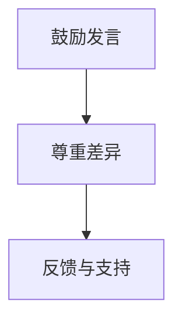

**示例代码：**
```python
def open_communication_environment():
    print("建立开放的沟通环境，首先要鼓励员工发言。")
    print("尊重员工的差异，避免批评和指责。")
    print("提供反馈与支持，帮助员工成长。")

open_communication_environment()
```

---

通过正确的争议处理和敏感话题应对策略，管理者能够建立开放的沟通环境，促进团队和谐与协作。

---

### 第10章：后续行动

#### 10.1 面谈后的行动计划

**Mermaid 流程图：**
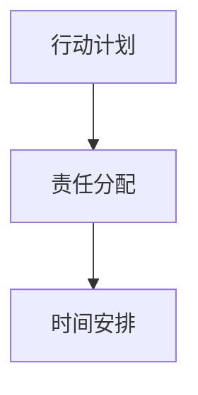

**示例代码：**
```python
def action_plan():
    print("在面谈后，我们需要制定具体的行动计划。")
    print("明确责任分配，确保每个任务都有人负责。")
    print("设定时间安排，确保行动计划的执行。")

action_plan()
```

#### 10.2 面谈效果的跟踪与评估

**Mermaid 流程图：**
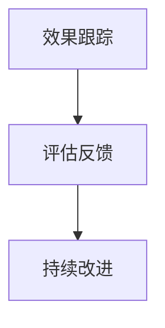

**示例代码：**
```python
def track_and_evaluate():
    print("我们需要跟踪面谈效果，确保行动计划得到执行。")
    print("定期评估反馈，了解面谈的影响。")
    print("持续改进，不断提升面谈的效果。")

track_and_evaluate()
```

#### 10.3 持续改进与优化

**Mermaid 流程图：**
```mermaid
graph TD
    A[反思与总结] --> B[持续学习]
    B --> C[优化实践]
```

**示例代码：**
```python
def continuous_improvement():
    print("在面谈实践中，我们需不断反思和总结。")
    print("持续学习，提升自己的沟通和面谈技巧。")
    print("优化实践，使面谈更有效、更有针对性。")

continuous_improvement()
```

---

通过后续行动的跟踪、评估和持续改进，管理者能够不断提升面谈的效果，实现员工关系的优化和组织绩效的提升。

---

## 第四部分：最佳实践与案例分析

### 第11章：成功案例分享

#### 11.1 案例一：成功解决员工绩效问题的面谈

**案例描述：** 
在一次一对一员工面谈中，管理者发现员工绩效较低，通过有效的沟通和倾听技巧，找到了问题的根源，并制定出具体的改进计划。

**案例分析：** 
管理者在面谈中首先确认了员工对工作任务的认知，然后深入了解员工的工作环境和个人需求。通过共情和支持，管理者帮助员工树立了信心，并制定了详细的绩效改进计划。

#### 11.2 案例二：提升员工工作满意度的面谈

**案例描述：** 
管理者通过一对一员工面谈，发现员工对工作存在不满，通过倾听和理解，找到了提升工作满意度的关键因素。

**案例分析：** 
管理者在面谈中耐心倾听员工的意见，并积极回应。通过开放沟通，管理者了解了员工的需求，并制定了相应的改进措施，如调整工作内容、提供培训机会等，从而提升了员工的工作满意度。

#### 11.3 案例三：如何进行离职面谈

**案例描述：** 
在员工提出离职时，管理者通过离职面谈，了解了员工离职的原因，并为公司未来的改进提供了宝贵的建议。

**案例分析：** 
管理者在离职面谈中，尊重员工的感受，真诚地倾听员工的意见。通过理性的分析和合理的解释，管理者不仅挽留了员工，还为公司未来的发展提供了有力的支持。

---

这些成功案例展示了如何通过有效的一对一员工面谈，解决实际问题，提升员工关系和满意度。

---

### 第12章：最佳实践总结

#### 12.1 面谈最佳实践总结

**总结：**
- 明确面谈目标，做好准备工作；
- 建立良好的开场氛围，迅速建立信任；
- 使用积极的沟通技巧，确保信息传达的准确性；
- 倾听与回应，建立良好的沟通环境；
- 记录与总结，确保面谈效果的跟踪与评估；
- 情绪管理和争议处理，提升面谈的灵活性和有效性；
- 后续行动和持续改进，确保面谈效果的落地和优化。

---

#### 12.2 面谈常见误区与对策

**误区一：过于紧张，无法正常发挥**
**对策：** 进行模拟练习，提高自信心。

**误区二：过于关注自身观点，忽视员工需求**
**对策：** 转变观念，以员工为中心。

**误区三：缺乏有效倾听，导致沟通无效**
**对策：** 学会倾听技巧，确保理解对方观点。

---

#### 12.3 面谈技能的提升路径

**路径一：理论学习与实践相结合**
**路径二：参加专业培训和研讨会**
**路径三：阅读相关书籍和文章**
**路径四：向经验丰富的同事请教**

---

通过不断学习和实践，管理者能够不断提升面谈技能，实现员工关系和绩效的提升。

---

### 第13章：扩展阅读与资源

#### 13.1 相关书籍推荐

- 《关键对话：如何高效沟通，避免误解，达成共识》
- 《非暴力沟通：沟通的神奇力量》
- 《沟通的艺术：看人怎么说，听人怎么听》

---

#### 13.2 在线课程与研讨会

- Coursera 上的《沟通与人际关系》
- EdX 上的《有效沟通技巧》
- LinkedIn Learning 上的《管理沟通技巧》

---

#### 13.3 专业组织与社区资源

- 国际沟通协会（ICA）
- 管理沟通协会（IMC）
- 中国沟通协会

---

通过阅读书籍、参加课程和研讨会，以及加入专业组织，管理者能够不断拓展自己的知识和技能，为有效的一对一员工面谈打下坚实的基础。

---

## 结束语

作者：AI天才研究院/AI Genius Institute & 禅与计算机程序设计艺术 /Zen And The Art of Computer Programming

本文旨在为管理者提供一套系统且实用的面谈方法论，帮助他们在实际工作中进行有效的一对一员工面谈。通过背景介绍、核心概念与联系分析，以及详细的实施步骤和特殊情况处理，本文希望能够帮助读者全面提升面谈技能，实现员工关系和绩效的提升。在后续的实践中，不断学习和总结，持续改进，相信每一位管理者都能够成为一名优秀的管理者。

