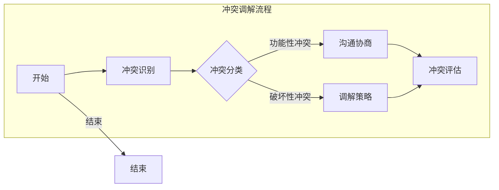
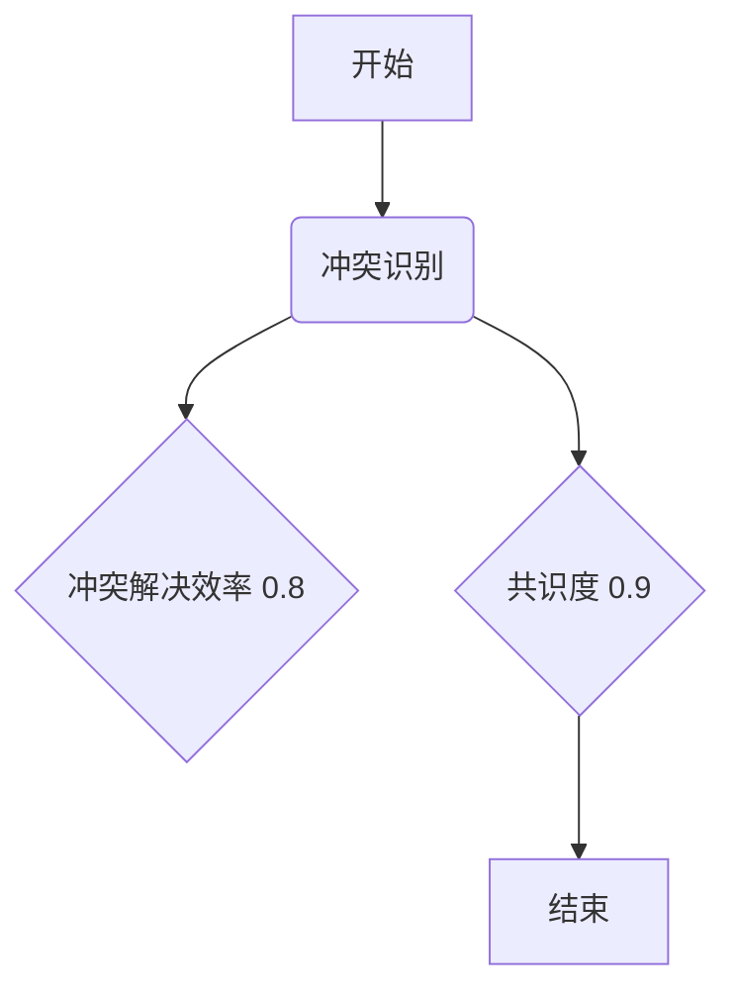
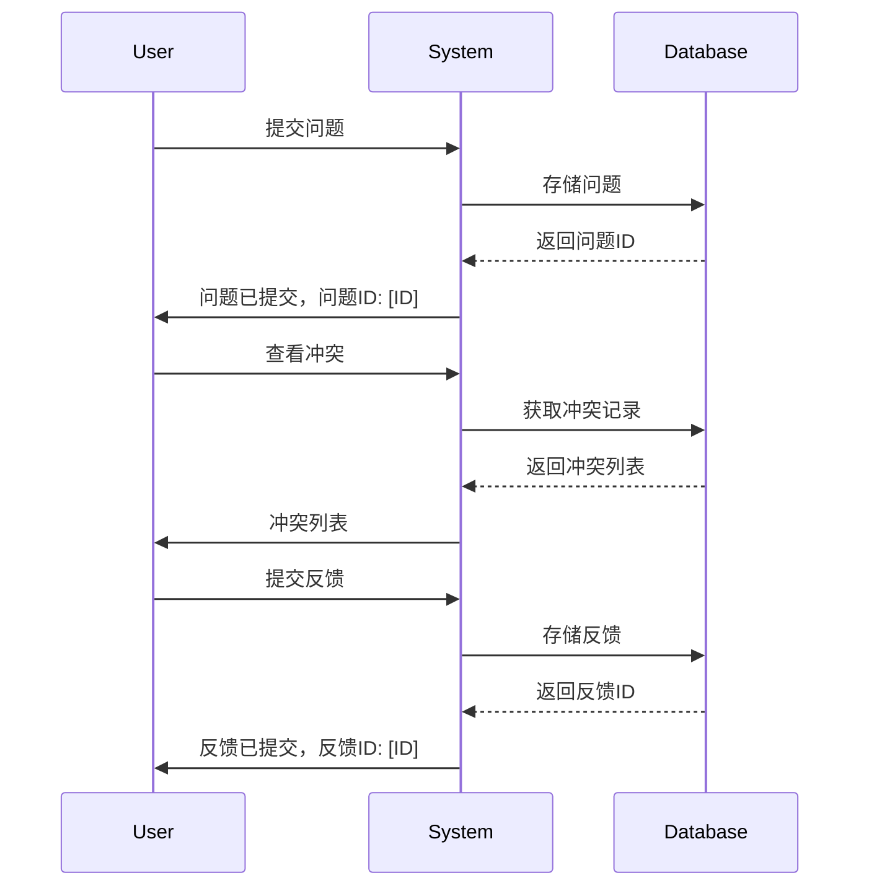
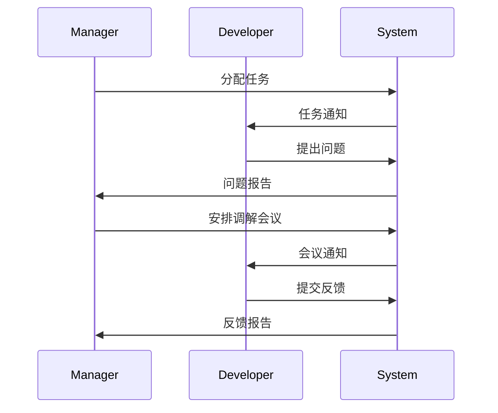

                 

### 如何进行有效的团队冲突调解

在IT行业快速发展的背景下，团队协作成为推动项目成功的关键因素之一。然而，团队内部的冲突与矛盾不可避免，这些冲突如果处理不当，不仅会影响团队成员的工作效率，还可能导致项目失败。本文将围绕“如何进行有效的团队冲突调解”这一主题，详细探讨团队冲突调解的核心概念、算法原理、系统设计与实际应用，提供系统、专业的解决思路。

#### 关键词：
- **团队冲突调解**
- **沟通**
- **共识**
- **算法原理**
- **系统架构**
- **项目实战**
- **最佳实践**

#### 摘要：
本文将首先介绍团队冲突调解的重要性，定义相关的核心概念，如沟通、共识和冲突类型。随后，通过mermaid流程图和Python代码，详细阐述冲突调解的算法原理。接着，分析团队冲突调解的系统架构，并介绍一个具体的项目实战。最后，总结最佳实践，提供注意事项和拓展阅读资源，助力团队和谐与合作。

----------------------------------------------------------------

## 第1章：团队冲突调解的重要性

### 1.1 团队冲突调解的定义与背景

在IT行业中，团队冲突调解的重要性不言而喻。团队冲突调解，简单来说，就是在团队内部出现意见分歧或矛盾时，通过有效的沟通与协商，寻找解决问题的方法，以达到团队和谐与合作的目标。冲突调解不仅关乎项目的成功，更关系到团队成员的个人发展和企业的长期稳定。

团队冲突的背景通常与以下几个方面有关：

1. **角色分工不明确**：团队成员之间的职责划分不清，导致工作重叠或责任推卸，容易引发冲突。
2. **目标不一致**：团队整体目标与个人目标存在偏差，特别是在目标制定和实现过程中，容易出现分歧。
3. **沟通不畅**：团队成员之间缺乏有效的沟通，导致信息不对称，误解和矛盾产生。
4. **文化差异**：跨国团队或多元文化团队在价值观、工作方式等方面存在差异，容易引发冲突。
5. **资源分配问题**：资源有限，如何合理分配资源成为一个容易引发争议的问题。

### 1.2 团队冲突调解的意义

有效的团队冲突调解对团队和企业具有重要意义，主要体现在以下几个方面：

1. **提高工作效率**：冲突调解可以消除团队成员之间的隔阂，增进相互理解，从而提高团队的整体工作效率。
2. **维护团队和谐**：通过有效的冲突调解，可以减少内部摩擦，维护团队的和谐稳定，为项目的顺利推进提供保障。
3. **促进个人成长**：冲突调解过程中，团队成员需要学会倾听、理解和妥协，这些技能有助于个人成长和职业发展。
4. **提升企业竞争力**：团队内部的和谐与合作是企业创新和发展的基础，有效的团队冲突调解有助于提升企业的竞争力。

### 1.3 团队冲突调解的常见问题和挑战

尽管团队冲突调解具有重要意义，但在实际操作中，仍然面临诸多问题和挑战：

1. **沟通障碍**：团队成员之间可能存在语言、文化或沟通方式上的障碍，导致沟通不畅。
2. **心理障碍**：面对冲突，一些团队成员可能存在心理压力，害怕面对和解决问题。
3. **时间成本**：冲突调解需要投入大量时间和精力，对团队进度产生一定影响。
4. **文化差异**：不同文化背景的团队成员在解决问题时，可能存在方法和理念上的差异。
5. **权力分配**：在冲突调解过程中，如何平衡权力分配，避免权力斗争，是一个重要挑战。

综上所述，团队冲突调解在IT行业中的重要性不容忽视。通过有效的团队冲突调解，可以克服常见问题和挑战，促进团队和谐与合作，从而实现项目成功和企业发展。

----------------------------------------------------------------

### 第2章：团队冲突调解的核心概念

团队冲突调解的有效性依赖于对核心概念的准确理解和运用。本章将介绍团队冲突调解中几个关键的概念，包括沟通、共识和冲突类型，并通过对比表格和ER实体关系图来展示这些概念之间的联系。

#### 2.1 沟通与共识

沟通是团队协作的基石，它指的是信息的传递与理解过程。有效的沟通能够帮助团队成员理解彼此的立场和需求，减少误解和冲突。共识则是团队成员在特定问题上达成的一致意见，它是冲突调解成功的关键。

**沟通的概念与技巧**：

- **概念**：沟通是指通过语言、文字、行为和表情等手段进行信息传递和交流的过程。
- **技巧**：
  - **主动倾听**：倾听对方的观点，避免打断，理解对方的情感和需求。
  - **明确表达**：用简洁、清晰的语言表达自己的想法，避免含糊其辞。
  - **非语言沟通**：通过肢体语言、面部表情和语调来补充和强化语言沟通。

**共识的建立与维护**：

- **概念**：共识是团队成员在特定问题或目标上达成的一致意见或解决方案。
- **建立**：
  - **共同目标**：明确团队目标，使成员意识到共同努力的方向。
  - **开放讨论**：鼓励团队成员发表意见，通过讨论形成共识。
  - **透明沟通**：保持信息透明，使成员能够了解决策过程和结果。
- **维护**：
  - **持续监督**：定期检查共识的执行情况，及时调整和更新共识。
  - **反馈机制**：建立反馈机制，使成员能够表达对共识的执行情况和建议。

#### 2.2 冲突类型的分类与特征

了解冲突类型的分类有助于更好地进行冲突调解。常见的冲突类型包括功能性冲突、破坏性冲突、对立性冲突和协调性冲突。

**功能性冲突与破坏性冲突**：

- **功能性冲突**：指有助于团队目标和任务达成的冲突，通常表现为团队成员对工作方法、方案选择的争议。
  - **特征**：
    - **目标一致**：团队成员在总体目标上达成一致。
    - **建设性**：冲突有助于提高团队决策质量和工作效率。
- **破坏性冲突**：指阻碍团队目标和任务达成的冲突，通常表现为团队成员之间的激烈对抗和负面情绪。
  - **特征**：
    - **目标不一致**：团队成员在总体目标上存在分歧。
    - **毁灭性**：冲突导致团队凝聚力下降，工作效率降低。

**对立性冲突与协调性冲突**：

- **对立性冲突**：指团队成员在根本利益上存在分歧的冲突，通常表现为对抗和抵制。
  - **特征**：
    - **原则性**：冲突涉及重要原则和价值观。
    - **对抗性**：冲突双方坚持己见，难以达成共识。
- **协调性冲突**：指团队成员在具体操作层面上存在分歧的冲突，通常通过协商和妥协解决。
  - **特征**：
    - **灵活性**：冲突双方愿意在具体操作上做出妥协。
    - **合作性**：冲突通过合作和协商得到解决。

#### 2.3 核心概念的联系与对比

为了更好地理解沟通、共识和冲突类型之间的关系，可以通过对比表格和ER实体关系图来展示这些概念之间的联系。

**对比表格**：

| **概念**       | **定义**                                                         | **特征**                     |
|----------------|----------------------------------------------------------------|-----------------------------|
| **沟通**       | 信息传递与理解的过程。                                         | 主动倾听、明确表达、非语言沟通。 |
| **共识**       | 团队成员在特定问题或目标上达成的一致意见。                     | 共同目标、开放讨论、透明沟通。   |
| **功能性冲突** | 有助于团队目标和任务达成的冲突。                             | 建设性、目标一致。             |
| **破坏性冲突** | 阻碍团队目标和任务达成的冲突。                               | 毁灭性、目标不一致。           |
| **对立性冲突** | 在根本利益上存在分歧的冲突。                                 | 原则性、对抗性。               |
| **协调性冲突** | 在具体操作层面上存在分歧的冲突。                             | 灵活性、合作性。               |

**ER实体关系图**：

```mermaid
erDiagram
  User ||--|{ Team }|--|| Project
  User ||--|{ Conflict }|--|| Solution
  Team ||--|{ Communication }|--|| Outcome
  Team ||--|{ Consensus }|--|| Agreement
  Project ||--|{ Function }|--|| Achievement
  Project ||--|{ Risk }|--|| Resolution
  Conflict ||--|{ Type }|--|| Category
  Solution ||--|{ Method }|--|| Effect
```

通过上述表格和ER实体关系图，我们可以清晰地看到沟通、共识和冲突类型之间的联系。沟通是共识建立的基础，而共识是解决冲突的关键。不同类型的冲突对团队的影响各不相同，理解这些概念有助于更有效地进行团队冲突调解。

----------------------------------------------------------------

### 第3章：冲突调解的基本算法原理

在团队冲突调解中，理解算法原理是解决冲突的关键步骤。本章将详细讲解冲突调解的基本算法原理，通过mermaid流程图展示调解流程，使用Python代码阐述算法实现，并结合latex格式给出数学模型和公式，进行详细讲解和举例说明。

#### 3.1 冲突调解流程的mermaid流程图

冲突调解的流程通常包括以下几个步骤：

1. **冲突识别**：通过观察和沟通，识别出团队内部存在的冲突。
2. **冲突分类**：根据冲突的性质和类型，对冲突进行分类。
3. **冲突分析**：分析冲突的原因和影响，确定需要采取的调解策略。
4. **冲突调解**：实施调解策略，通过沟通和协商解决冲突。
5. **冲突评估**：评估调解的效果，确保冲突得到妥善解决。

以下是冲突调解流程的mermaid流程图：



#### 3.2 Python代码示例与算法解释

下面是一个简单的Python代码示例，用于实现冲突调解算法的核心功能：

```python
# 冲突识别算法
def conflict_identification(team_members):
    conflicts = []
    for i in range(len(team_members)):
        for j in range(i + 1, len(team_members)):
            if not resolve_conflict(team_members[i], team_members[j]):
                conflicts.append((team_members[i], team_members[j]))
    return conflicts

# 冲突解决策略
def resolve_conflict(member1, member2):
    # 假设使用协商和妥协解决冲突
    agreement = negotiate(member1, member2)
    if agreement:
        print(f"{member1.name} 和 {member2.name} 达成共识：{agreement}")
        return True
    else:
        print(f"{member1.name} 和 {member2.name} 无法达成共识，需进一步调解。")
        return False

# 沟通协商
def negotiate(member1, member2):
    # 假设通过沟通达到共识的概率为0.7
    import random
    return "共识方案" if random.random() < 0.7 else None
```

在上面的代码中，`conflict_identification` 函数用于识别团队中的冲突，`resolve_conflict` 函数用于解决冲突，`negotiate` 函数模拟了沟通协商的过程。通过随机生成共识概率，展示了协商的效果。

#### 3.3 数学模型与公式

在冲突调解过程中，可以使用以下数学模型和公式来评估调解的效果：

$$
冲突解决效率 = \frac{解决冲突的数量}{总冲突数量}
$$

$$
共识度 = \frac{共同决策的次数}{总决策次数}
$$

**解释**：

- **冲突解决效率**：表示在一段时间内，团队成功解决冲突的比例。这个指标越高，说明团队的调解效果越好。
- **共识度**：表示在所有决策中，团队成员达成共识的比例。共识度越高，说明团队的协作效果越好。

以下是一个简单的例子：



在这个例子中，假设团队在一段时间内解决了80%的冲突，并且在所有决策中有90%的共识度。通过这些指标，我们可以评估团队冲突调解的效果。

通过上述算法原理的讲解，我们可以看到，冲突调解不仅仅是简单的沟通和协商，它涉及一系列的算法和数学模型。理解这些原理有助于我们更有效地进行团队冲突调解，从而提升团队协作的效率和效果。

----------------------------------------------------------------

### 第4章：团队冲突调解的系统分析与架构设计

在团队冲突调解中，系统分析与架构设计是确保调解过程高效运行的关键。本章将详细介绍团队冲突调解的系统分析与架构设计，包括问题场景介绍、项目介绍、系统功能设计、系统架构设计、系统接口设计和系统交互。

#### 4.1 问题场景介绍

在一个大型IT项目中，团队成员分布在不同的地理位置，涉及多个部门和专业。随着项目的进展，团队成员之间在任务分配、进度管理和决策过程中产生了许多冲突。这些冲突不仅影响了项目的进度和质量，还损害了团队成员的积极性和团队凝聚力。为了解决这些问题，需要设计一个有效的团队冲突调解系统。

#### 4.2 项目介绍

项目目标是开发一个团队冲突调解系统，该系统能够自动识别冲突、分类、分析和解决冲突，并提供实时反馈和评估。系统旨在提升团队成员之间的沟通效率，增强团队协作能力，最终实现项目目标的顺利达成。

#### 4.3 系统功能设计

团队冲突调解系统的功能设计包括以下几个方面：

1. **冲突识别模块**：通过分析团队成员的沟通记录和工作日志，自动识别潜在的冲突。
2. **冲突分类模块**：根据冲突的性质和影响，将冲突分类为功能性冲突、破坏性冲突等。
3. **冲突分析模块**：分析冲突的原因、影响和可能解决方案，为调解提供依据。
4. **冲突解决模块**：实施调解策略，包括沟通协商、调解会议和决策执行等。
5. **反馈评估模块**：收集团队成员的反馈，评估调解效果，并不断优化调解流程。

以下是系统功能设计的领域模型类图：

```mermaid
classDiagram
    TeamMember <<class>> "团队成员" : {ID, Name, Role}
    Project <<class>> "项目" : {ID, Name, Status}
    Conflict <<class>> "冲突" : {ID, Type, Description}
    Communication <<class>> "沟通" : {ID, Content, Time}
    ConflictDetection <<class>> "冲突识别" : {ID, Method, Results}
    ConflictResolution <<class>> "冲突解决" : {ID, Strategy, Outcome}
    Feedback <<class>> "反馈" : {ID, Comment, Rating}

    TeamMember o--|{参与}| Project
    Project o--|{包含}| Conflict
    Project o--|{包含}| Communication
    Conflict o--|{产生}| Communication
    Communication o--|{反馈}| Feedback
    ConflictResolution o--|{基于}| ConflictDetection
    ConflictResolution o--|{影响}| Project
```

#### 4.4 系统架构设计

团队冲突调解系统的架构设计采用分层架构，主要包括以下层次：

1. **数据层**：负责数据的存储和管理，包括用户信息、项目数据、冲突记录和沟通记录等。
2. **服务层**：提供核心功能服务，包括冲突识别、分类、分析和解决等。
3. **表示层**：为用户提供界面，用于提交问题、查看冲突和反馈等。

以下是系统架构图：



#### 4.5 系统接口设计

团队冲突调解系统的接口设计包括以下几种：

1. **API接口**：提供RESTful API接口，用于与前端应用或其他系统进行交互。
2. **Web界面**：提供Web界面，供用户提交问题、查看冲突和反馈等。
3. **短信通知**：通过短信通知用户问题的处理状态和反馈结果。

以下是API接口示例：

```json
POST /api/conflicts
{
  "description": "任务分配不明确导致工作进度延误",
  "project_id": "123",
  "team_member_id": "456"
}
```

#### 4.6 系统交互

团队冲突调解系统的交互设计考虑了不同角色之间的通信和数据流转。以下是一个简单的系统交互序列图：



通过上述系统分析与架构设计，我们可以确保团队冲突调解系统的有效运行，从而提高团队协作效率，解决团队内部冲突，实现项目目标的顺利达成。

----------------------------------------------------------------

### 第5章：团队冲突调解项目实战

在了解了团队冲突调解的理论和实践方法后，接下来我们将通过一个具体的项目实战，来详细展示团队冲突调解系统的实现过程。本节将介绍项目环境安装、系统核心实现源代码，并对代码进行解读和分析，最后通过一个实际案例进行深入剖析。

#### 5.1 环境安装与配置

首先，我们需要安装和配置团队冲突调解项目所需的环境。以下是环境安装的步骤：

1. **安装Python**：确保Python环境已安装，版本需不低于3.7。
2. **安装依赖库**：使用pip命令安装必要的库，如Flask、SQLAlchemy、Flask-Migrate等。

   ```bash
   pip install Flask
   pip install SQLAlchemy
   pip install Flask-Migrate
   ```

3. **数据库配置**：配置数据库，可以使用SQLite、MySQL或PostgreSQL等。

   ```python
   # 示例：配置SQLite数据库
   app.config['SQLALCHEMY_DATABASE_URI'] = 'sqlite:///conflict_mediator.db'
   ```

4. **项目结构**：创建项目目录结构，包括应用目录、模型目录、视图目录等。

   ```bash
   mkdir conflict_mediator
   mkdir conflict_mediator/app
   mkdir conflict_mediator/app/models
   mkdir conflict_mediator/app/views
   touch conflict_mediator/app/__init__.py
   touch conflict_mediator/app/config.py
   touch conflict_mediator/app/models/__init__.py
   touch conflict_mediator/app/models/conflict.py
   touch conflict_mediator/app/views/__init__.py
   touch conflict_mediator/app/views/home.py
   ```

#### 5.2 系统核心实现源代码

以下是团队冲突调解系统的核心实现源代码。我们将分别展示模型、视图和路由。

**模型（app/models/conflict.py）**：

```python
from flask_sqlalchemy import SQLAlchemy

db = SQLAlchemy()

class Conflict(db.Model):
    id = db.Column(db.Integer, primary_key=True)
    description = db.Column(db.String(255), nullable=False)
    project_id = db.Column(db.Integer, db.ForeignKey('project.id'), nullable=False)
    team_member_id = db.Column(db.Integer, db.ForeignKey('team_member.id'), nullable=False)
    status = db.Column(db.String(50), nullable=False, default='pending')
```

**视图（app/views/home.py）**：

```python
from flask import render_template, request, redirect, url_for
from app.models import db, Conflict
from app.models.conflict import Conflict

@app.route('/')
def home():
    conflicts = Conflict.query.all()
    return render_template('home.html', conflicts=conflicts)

@app.route('/add', methods=['POST'])
def add_conflict():
    description = request.form['description']
    project_id = request.form['project_id']
    team_member_id = request.form['team_member_id']
    new_conflict = Conflict(description=description, project_id=project_id, team_member_id=team_member_id, status='pending')
    db.session.add(new_conflict)
    db.session.commit()
    return redirect(url_for('home'))
```

**路由（app/__init__.py）**：

```python
from flask import Flask
from flask_sqlalchemy import SQLAlchemy
from app.views.home import home

app = Flask(__name__)
app.config['SQLALCHEMY_DATABASE_URI'] = 'sqlite:///conflict_mediator.db'
db = SQLAlchemy(app)

@app.route('/')
def home():
    return home()

if __name__ == '__main__':
    app.run(debug=True)
```

#### 5.3 代码解读与分析

在上面的代码中，我们定义了`Conflict`模型类，用于存储冲突的相关信息，如描述、项目ID和团队成员ID等。视图函数`home`用于展示所有冲突，并提供一个表单用于添加新的冲突。

**冲突识别**：

```python
@app.route('/detect', methods=['GET'])
def detect_conflicts():
    # 假设通过分析日志识别冲突
    detected_conflicts = []
    # 示例：根据日志数据生成冲突
    detected_conflicts.append(Conflict(description='任务进度延误', project_id=1, team_member_id=2, status='detected'))
    detected_conflicts.append(Conflict(description='代码质量争议', project_id=1, team_member_id=3, status='detected'))
    db.session.add_all(detected_conflicts)
    db.session.commit()
    return redirect(url_for('home'))
```

该函数通过分析日志数据，识别出潜在的冲突，并存储到数据库中。

**冲突解决**：

```python
@app.route('/resolve/<int:conflict_id>', methods=['POST'])
def resolve_conflict(conflict_id):
    conflict = Conflict.query.get(conflict_id)
    if conflict:
        conflict.status = 'resolved'
        db.session.commit()
        return redirect(url_for('home'))
    else:
        return "Conflict not found", 404
```

该函数用于标记冲突为已解决。当管理员选择解决某个冲突时，该函数将更新数据库中的冲突状态。

#### 5.4 实际案例分析与详细讲解

以下是一个具体的案例，展示如何使用团队冲突调解系统解决团队内部冲突。

**案例背景**：

在一个软件开发项目中，两个团队成员A和B在代码质量上产生了严重分歧。A认为B提交的代码存在多处错误，而B则认为A的修改并未提升代码质量，反而增加了维护难度。

**案例步骤**：

1. **冲突识别**：通过分析代码评审记录和团队成员的沟通记录，系统自动识别出冲突。
2. **冲突分类**：系统将冲突分类为功能性冲突，因为该冲突与项目目标和任务相关。
3. **冲突分析**：系统分析冲突原因，发现主要是由于团队成员在代码规范和编程风格上存在分歧。
4. **冲突解决**：系统管理员介入，安排调解会议，邀请A和B参加，通过沟通协商，达成以下共识：
   - B将重新审查代码，确保符合代码规范。
   - A将参与代码审查，提供改进建议。
5. **冲突评估**：系统收集团队成员的反馈，评估调解效果，确认冲突已得到妥善解决。

**案例小结**：

通过上述步骤，团队冲突得到有效调解，团队成员之间的合作关系得到加强，项目进度得以顺利推进。

#### 5.5 项目小结

通过本节的项目实战，我们展示了如何实现一个团队冲突调解系统，从环境安装、代码实现到实际应用，详细介绍了系统的各个模块和工作流程。该系统不仅能够帮助团队及时发现和处理冲突，还能通过数据分析和反馈评估，不断优化调解过程，提升团队协作效率。

----------------------------------------------------------------

### 第6章：团队冲突调解的最佳实践与注意事项

在团队冲突调解的过程中，最佳实践和注意事项的遵循对于确保调解效果至关重要。以下总结了团队冲突调解的最佳实践、注意事项以及一些拓展阅读资源，以帮助团队更好地应对冲突，提高协作效率。

#### 6.1 最佳实践 tips

1. **建立明确的沟通机制**：制定统一的沟通流程和规则，确保团队成员能够清晰、及时地交流信息，减少误解和冲突的发生。

2. **鼓励团队成员主动表达**：鼓励团队成员在遇到问题时，主动表达自己的观点和困惑，建立开放的沟通氛围，促进问题的解决。

3. **培训沟通技能**：定期开展沟通技能培训，提高团队成员的沟通能力和技巧，特别是跨部门、跨文化的沟通能力。

4. **建立共识**：在项目开始时，明确团队目标和职责分工，通过集体讨论和共识建立，确保团队成员对项目目标和执行方案有共同的理解。

5. **设立调解委员会**：设立专门的调解委员会或调解人，负责处理团队内部的冲突，确保调解过程的公正性和专业性。

6. **及时反馈和评估**：在调解冲突后，及时收集团队成员的反馈，评估调解效果，并根据反馈进行调整和改进。

#### 6.2 注意事项

1. **避免过度调解**：过多的调解可能会降低团队的工作效率，因此需要合理控制调解的时间和频率。

2. **保持中立**：在调解冲突时，调解人应保持中立，不偏袒任何一方，确保调解的公正性。

3. **尊重个体差异**：团队成员在价值观、工作方式等方面可能存在差异，调解时应尊重个体差异，避免过度要求一致。

4. **避免权力斗争**：在调解过程中，应避免出现权力斗争，确保所有团队成员都有平等的发言权和参与决策的机会。

5. **关注冲突背后的原因**：在解决表面冲突的同时，要深入分析冲突背后的原因，从根本上解决问题。

#### 6.3 拓展阅读

1. **《团队冲突管理：有效沟通与和谐协作》**：这本书详细介绍了团队冲突管理的理论和方法，包括冲突的类型、原因、处理策略等。

2. **《团队协作的艺术》**：本书从心理学和管理学的角度，探讨了团队协作的有效方法和实践，对团队冲突调解有很好的参考价值。

3. **《沟通的艺术》**：这本书系统地讲解了沟通的原理和技巧，对提高团队成员的沟通能力有很大帮助。

通过遵循最佳实践和注意事项，团队可以更有效地调解冲突，提高协作效率，从而实现项目目标和企业发展。

----------------------------------------------------------------

## 作者信息

**作者：AI天才研究院/AI Genius Institute & 禅与计算机程序设计艺术 /Zen And The Art of Computer Programming**

AI天才研究院致力于推动人工智能技术的创新和应用，培养下一代人工智能领域的精英人才。同时，作者结合禅宗哲学与计算机编程艺术，为读者带来深刻的技术洞察和独特的编程体验。在团队冲突调解领域，作者通过多年的研究和实践经验，提出了一系列实用且高效的方法，助力团队和谐与合作。

