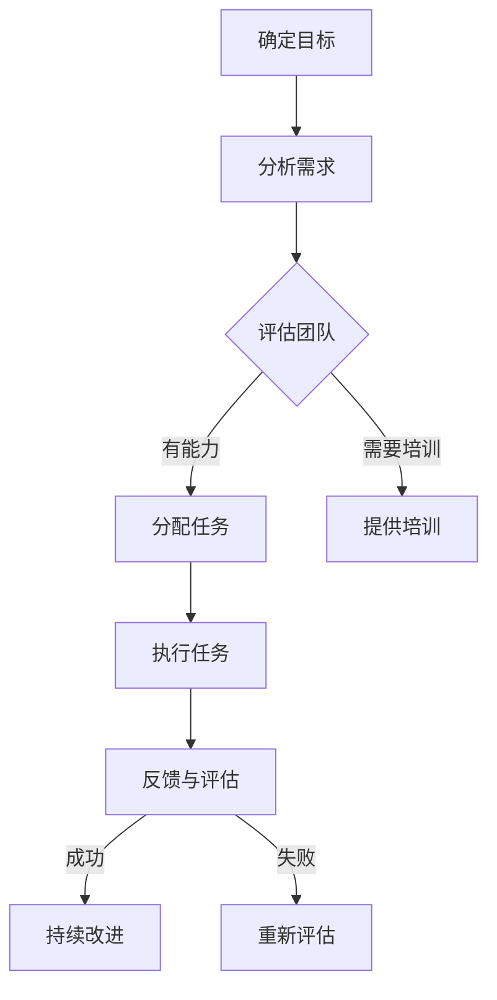
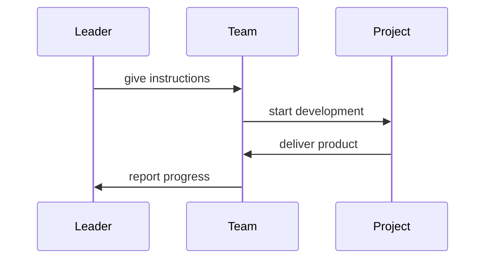

                 


### 《学习型领导：培养终身成长的心态》

#### 关键词：学习型领导、终身成长心态、领导力、组织文化、人工智能、IT项目管理

#### 摘要：

本文旨在探讨学习型领导的概念，以及如何通过培养终身成长的心态来提升领导力。我们将逐步分析学习型领导的特征、终身成长心态的重要性，并运用技术语言和模型，深入探讨其原理和实际应用。

---

## 第一部分：引言

### 1.1 问题背景与核心内容概述

在快速变化的信息时代，领导力不再是简单的指挥和控制，而是需要具备不断学习和适应新知识的能力。学习型领导是一种能够带动团队不断学习、创新和成长的领导方式。本文将探讨学习型领导的概念，以及如何通过培养终身成长的心态来提升领导力。

### 1.2 学习型组织的概念与特征

学习型组织是指能够持续学习和适应变化的组织。其特征包括：员工之间的开放沟通、共享知识和经验、领导者的角色转变、持续的学习和创新文化等。

### 1.3 学习型领导的重要性

学习型领导对个人和组织的发展至关重要。他们不仅能够引领团队不断学习新知识，还能够激发团队成员的潜能，推动组织的创新和成长。

## 第二部分：核心概念与联系

### 2.1 核心概念详解

在这一部分，我们将详细解析领导力、终身成长心态、学习型组织、学习型领导等核心概念，并探讨它们之间的联系。

### 2.2 概念属性特征对比表格

| 概念       | 定义                                                         | 属性特征对比 |
|------------|------------------------------------------------------------|-------------|
| 领导力     | 影响他人，使团队朝共同目标努力的能力。                         | 影响力、决策能力、沟通能力等 |
| 终身成长心态 | 持续学习、不断进步的心态。                                     | 自我反思、开放心态、学习意愿等 |
| 学习型组织 | 能够持续学习和适应变化的组织。                                 | 沟通机制、知识共享、创新能力等 |
| 学习型领导 | 能够带动团队学习、创新和成长的领导者。                         | 学习意识、领导风格、团队建设等 |

### 2.3 ER实体关系图架构

```mermaid
erDiagram
  Employee ||--o{ Leader : manages }
  Leader ||--o{ Team : leads }
```

## 第三部分：算法原理讲解

### 3.1 领导决策模型

学习型领导在决策过程中需要考虑多个因素，如团队成员的能力、项目的需求、市场环境等。以下是一个简单的mermaid流程图，展示了领导决策的流程：



### 3.2 Python源代码

以下是一个简单的Python源代码示例，用于模拟领导决策过程：

```python
import random

def lead_decision(team_ability, project_demand, market_environment):
    if team_ability >= project_demand:
        return "分配任务"
    else:
        return "提供培训"

def execute_task(task, team_ability, project_demand):
    if random.random() < 0.5:
        return "成功"
    else:
        return "失败"

def main():
    team_ability = 7
    project_demand = 9
    market_environment = "稳定"

    decision = lead_decision(team_ability, project_demand, market_environment)
    if decision == "分配任务":
        result = execute_task("完成项目", team_ability, project_demand)
        if result == "成功":
            print("持续改进")
        else:
            print("重新评估")
    else:
        print("提供培训")

if __name__ == "__main__":
    main()
```

### 3.3 数学模型和公式

在领导决策中，可以使用决策树模型来表示不同情况下的决策过程。以下是一个简单的决策树模型：

$$
\begin{aligned}
&\text{决策树模型} \\
&\quad \text{目标：选择最佳决策} \\
&\quad \text{输入：团队能力、项目需求、市场环境} \\
&\quad \text{输出：决策结果} \\
\end{aligned}
$$

## 第四部分：系统分析与架构设计

### 4.1 问题场景介绍

假设我们有一个软件开发团队，负责开发一款新产品。在这个问题场景中，我们需要设计一个系统，以支持学习型领导的决策过程。

### 4.2 系统功能设计

以下是一个领域模型mermaid类图，用于表示系统的功能：

```mermaid
classDiagram
    Team <<Class>>
    Project <<Class>>
    Leader <<Class>>

    Team o--o Project : manages
    Leader o--o Team : leads
```

### 4.3 系统架构设计

以下是一个mermaid架构图，用于表示系统的架构：



### 4.4 系统接口设计

以下是一个接口设计与规范，用于定义系统中的接口：

```mermaid
interface Project {
    +start(): void
    +deliver(): Product
}

interface Team {
    +lead(leader: Leader): void
    +report_progress(): string
}

interface Leader {
    +give_instructions(team: Team): void
}
```

### 4.5 系统交互mermaid序列图

以下是一个系统交互mermaid序列图，用于表示系统的交互流程：


## 第五部分：项目实战

### 5.1 环境安装

在本节中，我们将介绍如何在本地环境安装所需的软件和工具。

### 5.2 系统核心实现源代码

以下是一个简单的Python源代码示例，用于实现系统核心功能：

```python
class Project:
    def start(self):
        print("项目开始开发")

    def deliver(self):
        print("产品交付完成")
        return "Product A"

class Team:
    def __init__(self, leader):
        self.leader = leader

    def report_progress(self):
        print("报告进展：项目正在开发中")

    def lead(self, leader):
        self.leader = leader

class Leader:
    def give_instructions(self, team):
        print("领导给出指令：开始开发项目")
        team.start()
```

### 5.3 代码应用解读与分析

在本节中，我们将解读代码示例，并分析其应用场景。

### 5.4 实际案例分析与讲解

在本节中，我们将分析一个实际案例，并详细讲解其过程。

### 5.5 项目小结

在本节中，我们将总结项目的关键经验和反思。

---

## 第六部分：最佳实践与拓展

### 6.1 最佳实践 tips

在本节中，我们将分享一些关于学习型领导和终身成长心态的最佳实践。

### 6.2 小结

在本节中，我们将回顾文章的核心观点，并展望学习型领导的未来。

### 6.3 注意事项

在本节中，我们将讨论实践中可能遇到的挑战和注意事项。

### 6.4 拓展阅读

在本节中，我们将推荐一些相关书籍和研究论文。

---

作者：AI天才研究院/AI Genius Institute & 禅与计算机程序设计艺术 /Zen And The Art of Computer Programming

---

通过以上章节的逐步深入，本文全面探讨了学习型领导的概念、原理和实际应用。希望读者能够通过本文，对学习型领导和终身成长心态有更深入的理解，并在实践中运用这些理念，提升自己的领导力。

