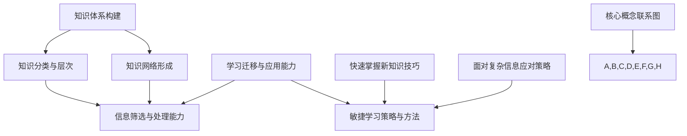

                 

### 引言

#### 1.1 学习敏捷性的重要性

在快速变革的现代社会，学习能力已成为衡量个人和专业竞争力的关键因素。技术的飞速发展和市场环境的不断变化，使得知识更新速度大大加快。这种背景下，学习敏捷性——即快速适应新知识的能力，变得尤为重要。

首先，社会变迁对学习能力提出了更高的要求。传统的“终身学习”理念已经不足以应对现代社会对知识更新速度的挑战。如今，知识的生命周期越来越短，新的技术和理论层出不穷。如果不能迅速适应这些变化，个人和团队将难以在竞争激烈的环境中保持优势。

其次，快速适应新知识的能力直接影响到个体的职业发展和生活质量。对于程序员、数据分析师、产品经理等职业，不断学习新的编程语言、工具和技术栈是维持职业竞争力的必要条件。而对于普通员工，具备快速学习的能力可以帮助他们更好地适应工作环境的变化，提高工作效率，甚至开拓新的职业机会。

#### 1.2 敏捷学习的定义

敏捷学习是一种主动、高效的学习方式，它强调个体对信息的快速捕捉、处理和应用能力。与被动学习不同，敏捷学习注重知识的应用和迁移，而不仅仅是记忆和理解。

敏捷学习的核心要素包括：

1. **信息筛选与处理能力**：能够快速识别并筛选出有价值的信息，对大量数据进行高效处理，提取关键知识。
2. **学习迁移与应用能力**：将所学知识灵活应用于实际场景，解决问题，实现知识转化。
3. **持续反思与调整**：在学习过程中不断反思和调整学习策略，优化学习效果。

#### 1.3 学习敏捷性的现状

现代社会中，学习敏捷性面临着巨大的挑战和机遇。一方面，信息爆炸带来了海量的学习资源，但同时也增加了筛选和处理的难度。另一方面，网络技术的发展为个性化学习提供了可能性，但如何有效地利用这些资源仍需探索。

目前，学习敏捷性在个人和企业层面均受到重视。许多企业开始推行学习型组织文化，鼓励员工持续学习和创新。然而，现实中还存在诸多障碍，如时间紧张、资源不足、学习习惯不良等。因此，如何培养和提升学习敏捷性，成为当下亟待解决的问题。

#### 1.4 本书结构安排

本书旨在系统探讨学习敏捷性的概念、方法和技术，帮助读者培养快速适应新知识的能力。本书结构如下：

- **第1章**：引言，介绍学习敏捷性的重要性、定义及现状。
- **第2章**：学习敏捷性的核心概念，包括知识体系的构建、关键能力和敏捷学习策略。
- **第3章**：培养学习敏捷性的实践方法，涉及时间管理、主动学习和知识共享等。
- **第4章**：技术环境下的敏捷学习，探讨现代技术如何促进学习。
- **第5章**：企业与组织的敏捷学习策略，讨论企业学习文化、培训与发展等。
- **第6章**：敏捷学习中的挑战与应对，分析持续学习、技能更新等挑战及应对策略。
- **第7章**：结论与展望，总结敏捷学习的重要性，展望未来学习的发展方向。

通过本书的阅读，读者将能够：

- 理解学习敏捷性的概念和重要性。
- 掌握培养学习敏捷性的核心方法和策略。
- 提高个人和团队的学习效率，增强竞争力。
- 建立学习型组织文化，推动企业持续发展。

### 第2章 学习敏捷性的核心概念

在深入探讨如何培养学习敏捷性之前，我们首先需要明确几个核心概念：知识体系的构建、学习敏捷性的关键能力以及敏捷学习的策略与方法。

#### 2.1 知识体系的构建

知识体系的构建是学习敏捷性的基础。一个有效的知识体系应该能够将零散的知识点系统化、结构化，从而便于理解和应用。

1. **知识分类与层次**：知识可以按主题、领域或层次进行分类。例如，计算机科学的知识可以分为编程语言、数据结构、算法、数据库等。每个分类下还可以进一步细分为具体的知识点和技能点。

2. **知识网络的形成**：知识体系不仅仅是知识点的堆积，更是一个相互联系、交互作用的网络。通过将知识点相互关联，形成知识网络，可以更好地理解和应用知识。

在构建知识体系时，可以采用以下步骤：

- **识别核心知识领域**：确定个人或团队所需掌握的核心知识领域。
- **梳理知识点**：对每个核心知识领域进行详细的梳理，明确各个知识点及其层次。
- **构建知识网络**：将知识点相互关联，形成知识网络。

以下是一个知识体系构建的例子：

```
知识体系构建示例

- 计算机科学
  - 编程语言
    - Python
    - Java
    - C++
  - 数据结构
    - 链表
    - 栈
    - 队列
  - 算法
    - 排序算法
    - 搜索算法
    - 图算法
  - 数据库
    - SQL
    - NoSQL
    - 数据库设计
```

#### 2.2 学习敏捷性的关键能力

学习敏捷性的关键能力包括信息筛选与处理能力、学习迁移与应用能力等。

1. **信息筛选与处理能力**：在信息爆炸的时代，如何从海量的信息中筛选出有价值的信息是关键。这需要具备以下能力：

   - **快速阅读与理解**：能够快速捕捉信息的关键点，理解信息的主旨。
   - **信息过滤**：通过关键词、主题等筛选出与学习目标相关的内容。
   - **信息整合**：将不同来源的信息整合，形成系统的知识体系。

2. **学习迁移与应用能力**：将所学知识应用于实际问题的解决，是实现学习敏捷性的重要体现。这需要：

   - **理论联系实际**：将理论知识与实际应用场景相结合。
   - **实践经验积累**：通过实践不断积累经验，提高解决问题的能力。
   - **创新思维**：在面对新问题时，能够灵活运用所学知识，提出创新的解决方案。

以下是一个信息筛选与处理能力的示例流程图：

```
信息筛选与处理能力示例流程图

start
|
V
获取信息
|
V
关键词筛选
|
V
快速阅读
|
V
信息整合
|
V
形成知识体系
|
V
end
```

#### 2.3 敏捷学习的策略与方法

敏捷学习强调主动、高效的学习方式。以下是一些实用的策略和方法：

1. **快速掌握新知识的技巧**：

   - **分解学习任务**：将复杂的学习任务分解为小步骤，逐一攻克。
   - **使用记忆技巧**：如联想记忆、重复记忆等，提高记忆效率。
   - **主动思考与提问**：在学习过程中不断思考问题，提出疑问，深入理解知识。

2. **面对复杂信息的应对策略**：

   - **多角度分析**：从不同角度对信息进行分析，提高理解深度。
   - **批判性思维**：对所学内容进行批判性思考，辨别真伪。
   - **协同学习**：与他人共同学习，通过讨论和交流，加深理解。

以下是一个敏捷学习策略的示例：

```
敏捷学习策略示例

- 分解任务
- 快速阅读与理解
- 使用记忆技巧
- 主动思考与提问
- 批判性思维
- 多角度分析
- 协同学习
```

#### 2.4 核心概念联系图

为了更好地理解学习敏捷性的核心概念，我们可以使用Mermaid绘制一个核心概念联系图，展示各个概念之间的关系：



通过这个联系图，我们可以清晰地看到知识体系构建、信息筛选与处理能力、学习迁移与应用能力以及敏捷学习策略与方法之间的相互关联，这有助于我们更好地理解和应用这些核心概念。

### 第3章 培养学习敏捷性的实践方法

在明确了学习敏捷性的核心概念后，接下来我们将探讨一些具体的实践方法，以帮助读者在实际中培养和提升学习敏捷性。

#### 3.1 时间管理与学习效率

时间管理是培养学习敏捷性的关键环节。有效的学习效率离不开科学的时间管理。以下是一些提升学习效率的技巧：

1. **制定学习计划**：根据学习目标和时间安排，制定详细的学习计划。计划应包括每日的学习任务、学习时间和休息时间。

2. **优先级排序**：将学习任务按照重要性和紧急性进行排序，优先完成重要且紧急的任务。

3. **番茄工作法**：将工作时间分为25分钟的学习块，每个学习块后休息5分钟。这种方法有助于保持专注，提高学习效率。

4. **避免干扰**：在学习时尽量减少干扰因素，如关闭手机通知、避免在嘈杂的环境中学习等。

5. **定期评估与调整**：定期回顾学习计划，评估学习效果，根据实际情况调整学习计划。

以下是一个时间管理计划的示例：

```
学习时间管理计划

- 每日学习时间：2小时
- 学习任务：
  - 编程练习（1小时）
  - 数据结构学习（1小时）
- 休息时间：
  - 每45分钟休息5分钟
  - 每日学习结束后休息1小时
```

#### 3.2 主动学习的实践

主动学习是培养学习敏捷性的重要方法。与被动学习不同，主动学习强调个体的主动参与和思考。以下是一些主动学习的具体操作：

1. **主动提问**：在学习过程中不断提出问题，主动探索答案。提问有助于深化对知识点的理解，培养批判性思维。

2. **实践应用**：将所学知识应用于实际问题中，通过实践加深对知识的掌握。例如，编写代码实现算法，解决实际问题。

3. **合作学习**：与他人共同学习，通过讨论和交流，相互启发，提高学习效果。合作学习有助于拓宽视野，激发创新思维。

4. **反思与总结**：学习结束后，对所学内容进行反思和总结，形成系统的知识体系。反思有助于巩固记忆，提高学习效果。

以下是一个主动学习计划的示例：

```
主动学习计划

- 学习任务：
  - 数据结构学习（2小时）
  - 编程练习（2小时）
  - 代码实现数据结构（2小时）
- 休息时间：
  - 每45分钟休息5分钟
- 合作学习：
  - 与同学讨论数据结构问题
  - 总结学习收获，形成笔记
```

#### 3.3 知识共享与协作学习

知识共享和协作学习是培养学习敏捷性的重要手段。以下是一些实用的知识共享和协作学习方法：

1. **使用学习平台**：利用在线学习平台，如Coursera、edX等，参与在线课程和讨论。这些平台提供了丰富的学习资源和交流环境。

2. **建立学习小组**：与同学、同事或兴趣相同的人建立学习小组，定期进行讨论和分享。小组学习有助于互相启发，共同进步。

3. **知识文档与博客**：撰写知识文档和博客，记录学习心得和思考。这不仅有助于巩固记忆，还可以为他人提供帮助。

4. **参与开源项目**：参与开源项目，通过实践和贡献代码，提升自己的编程能力和团队合作能力。

以下是一个知识共享和协作学习计划的示例：

```
知识共享与协作学习计划

- 学习平台：
  - Coursera上的数据结构课程
  - edX上的机器学习课程
- 学习小组：
  - 每周一次小组讨论
  - 共同编写技术博客
- 知识文档：
  - 撰写数据结构学习笔记
  - 编写机器学习实践总结
- 开源项目：
  - 参与GitHub上的开源项目
  - 贡献代码，提升技能
```

通过以上实践方法，读者可以逐步培养学习敏捷性，提升个人和团队的学习效率。关键在于持之以恒，不断实践和总结，才能在知识的海洋中游刃有余，快速适应新知识的挑战。

### 第4章 技术环境下的敏捷学习

在现代技术环境中，敏捷学习得到了极大的促进。互联网、人工智能、虚拟现实等技术的应用，使得学习变得更加高效、互动和个性化。本章节将探讨现代技术的应用如何促进敏捷学习，并介绍一些常见的学习辅助工具。

#### 4.1 现代技术的应用

1. **互联网**：互联网为学习者提供了丰富的在线资源，如在线课程、电子书、学术论文等。通过搜索引擎和在线学习平台，学习者可以迅速获取所需的知识，并参与到全球的学习社区中。

2. **人工智能**：人工智能技术在教育领域有着广泛的应用。例如，智能推荐系统可以根据学习者的兴趣和历史行为，推荐适合的学习内容和资源。此外，智能辅导系统可以通过自然语言处理技术，为学习者提供实时的解答和指导。

3. **虚拟现实（VR）**：虚拟现实技术为学习者提供了沉浸式的学习体验。通过VR，学习者可以身临其境地参与模拟实验、历史场景重现等，加深对知识的理解和记忆。

4. **增强现实（AR）**：增强现实技术将虚拟信息叠加在现实世界中，为学习者提供了新的学习方式。例如，通过AR眼镜，学习者可以实时查看课本外的附加信息，如三维模型、视频讲解等，提高学习效果。

#### 4.2 常见的学习辅助工具

1. **在线学习平台**：如Coursera、edX、Udemy等，提供了大量的在线课程和认证项目，适合不同层次的学习者。

2. **电子书阅读器**：如Kindle、掌阅等，方便学习者随身携带大量电子书籍，支持标注、笔记等功能。

3. **学习管理工具**：如Trello、Notion等，可以帮助学习者制定学习计划、管理任务和跟踪进度。

4. **协作工具**：如Google Docs、Microsoft Teams等，支持多人实时协作，便于团队学习和项目合作。

5. **编程学习工具**：如Codecademy、LeetCode等，提供编程练习和挑战，帮助学习者提高编程技能。

以下是一个基于现代技术的敏捷学习计划的示例：

```
现代技术下的敏捷学习计划

- 在线课程：
  - Coursera上的机器学习课程
  - edX上的数据结构课程
- 电子书阅读：
  - 《深度学习》
  - 《算法导论》
- 学习管理：
  - 使用Trello管理学习任务
  - 定期更新学习进度
- 协作学习：
  - 与同学组建学习小组
  - 定期进行在线讨论和分享
- 编程练习：
  - 每周完成LeetCode编程挑战
  - 应用所学知识解决实际问题
```

通过充分利用现代技术，学习者可以更高效、灵活地进行敏捷学习，提高学习效果和竞争力。现代技术不仅提供了丰富的学习资源和工具，还促进了学习者的互动和协作，为培养学习敏捷性提供了有力支持。

### 第5章 企业与组织的敏捷学习策略

在当今快速变化的市场环境中，企业和组织要想保持竞争力，必须具备持续学习和适应变化的能力。本章将讨论企业学习文化建设、培训与发展、学习资源共享与优化以及成果评估与反馈机制，以帮助企业和组织建立有效的敏捷学习策略。

#### 5.1 企业学习文化的建设

企业学习文化是推动组织敏捷学习的基础。一个积极的学习文化能够鼓励员工持续学习、勇于创新，从而提升整体竞争力。以下是一些建设企业学习文化的关键策略：

1. **领导层的支持**：企业领导层应积极倡导和推动学习文化，为员工提供学习和发展的机会。领导层可以通过定期分享学习心得、组织内部培训等方式，树立学习榜样，激发员工的学习热情。

2. **全员参与**：鼓励所有员工参与学习活动，无论其职位高低。通过组织团队学习、跨部门交流等活动，促进员工之间的知识共享和协作，营造全员学习的氛围。

3. **学习奖励机制**：设立学习奖励机制，激励员工积极学习。例如，对完成特定学习任务或在学习中表现突出的员工给予奖励，如奖金、晋升机会等。

4. **学习社区**：建立内部学习社区，如学习小组、讨论论坛等，为员工提供交流和分享的平台。学习社区可以促进知识传播，激发员工的创新思维。

以下是一个企业学习文化建设的示例：

```
企业学习文化建设示例

- 领导层支持：
  - CEO每周分享学习心得
  - 定期组织内部培训
- 全员参与：
  - 设立学习小组，每季度进行知识分享会
  - 鼓励员工参与外部培训课程
- 学习奖励机制：
  - 完成指定学习任务的员工获得奖金
  - 表现突出的员工有机会晋升
- 学习社区：
  - 内部论坛，员工可以随时发布学习心得和问题
  - 定期组织学习交流会
```

#### 5.2 培训与发展的敏捷性

企业培训和发展策略的敏捷性直接影响到员工的适应能力和组织的学习效率。以下是一些提升培训与发展敏捷性的策略：

1. **个性化培训**：根据员工的不同需求和职业发展路径，提供个性化的培训方案。通过在线课程、导师指导、实践项目等多种形式，满足员工多样化的学习需求。

2. **灵活的培训时间**：灵活安排培训时间，如线上课程、周末培训等，以适应员工的工作和生活安排。

3. **快速反馈与调整**：培训结束后，及时收集员工的反馈，对培训内容和形式进行评估和调整，确保培训的针对性和有效性。

4. **实践与反思相结合**：鼓励员工将所学知识应用于实际工作中，通过实践和反思不断深化对知识的理解和应用。

以下是一个敏捷培训与发展策略的示例：

```
敏捷培训与发展策略示例

- 个性化培训：
  - 根据员工职业发展路径制定培训计划
  - 提供在线课程、导师指导、实践项目等多种学习形式
- 灵活的培训时间：
  - 线上课程安排在员工方便的时间段
  - 周末安排集中培训
- 快速反馈与调整：
  - 培训结束后收集员工反馈，及时调整培训内容
  - 定期评估培训效果，确保培训的持续改进
- 实践与反思：
  - 鼓励员工将所学知识应用于实际工作中
  - 定期组织实践分享会，促进知识交流
```

#### 5.3 学习资源共享与优化

有效的学习资源共享和优化能够提升企业的学习效率，减少重复劳动。以下是一些学习资源共享与优化的策略：

1. **建立学习资料库**：收集和整理企业内部和外部的学习资源，建立学习资料库。资料库应涵盖各类学习资料，如文档、视频、课程等，方便员工随时查阅。

2. **知识管理系统**：采用知识管理系统（KM系统），对企业的知识资源进行分类、标签化和索引，提高知识检索效率。

3. **共享平台**：建立内部共享平台，如内部论坛、学习社区等，鼓励员工分享学习心得、经验和资源。

4. **外部合作**：与外部机构、专家建立合作关系，共同开发和分享优质学习资源，拓展企业的学习渠道。

以下是一个学习资源共享与优化策略的示例：

```
学习资源共享与优化策略示例

- 建立学习资料库：
  - 收集整理各类学习资料，如文档、视频、课程等
  - 对资料进行分类、标签化，便于检索
- 知识管理系统：
  - 采用KM系统对知识资源进行管理
  - 实现知识分类和索引功能，提高检索效率
- 共享平台：
  - 内部论坛，员工可以随时发布学习心得和资源
  - 学习社区，定期举办知识分享活动
- 外部合作：
  - 与高校、研究机构合作，共同开发课程和培训项目
  - 引入外部专家进行知识讲座和指导
```

#### 5.4 成果评估与反馈机制

有效的成果评估与反馈机制可以帮助企业了解员工的学习效果，发现问题并进行改进。以下是一些成果评估与反馈的策略：

1. **学习评估**：定期对员工的学习效果进行评估，包括知识掌握程度、学习成果等。评估可以通过笔试、实践操作、项目汇报等多种形式进行。

2. **反馈机制**：建立反馈机制，及时向员工反馈学习评估结果，并提供具体的改进建议。反馈应注重建设性，鼓励员工不断进步。

3. **持续改进**：根据评估和反馈结果，不断调整和优化学习策略，提高培训和发展效果。

以下是一个成果评估与反馈机制的示例：

```
成果评估与反馈机制示例

- 学习评估：
  - 每季度对员工进行知识掌握程度和实践能力评估
  - 采用笔试、实践操作、项目汇报等多种形式
- 反馈机制：
  - 及时向员工反馈评估结果
  - 提供具体的改进建议，鼓励员工持续进步
- 持续改进：
  - 根据评估结果调整培训和发展策略
  - 定期组织反馈会议，收集员工意见和建议
```

通过以上策略，企业和组织可以建立有效的敏捷学习机制，推动员工和组织的持续学习和进步，提高整体竞争力。敏捷学习不仅是个人发展的需要，更是企业持续发展的动力源泉。

### 第6章 敏捷学习中的挑战与应对

在培养学习敏捷性的过程中，个体和团队都会面临一系列挑战。如何应对这些挑战，是确保学习敏捷性持续提升的关键。本章节将分析敏捷学习中常见的挑战，并提出相应的应对策略。

#### 6.1 持续学习的挑战

持续学习是培养敏捷学习能力的核心，但个体在持续学习中常常会遇到以下挑战：

1. **学习疲劳**：长期的学习任务和压力可能导致个体感到疲惫和无力，影响学习效果。

**应对策略**：
   - **合理规划学习时间**：制定科学的学习计划，避免过度劳累。合理分配学习和休息时间，确保充足的休息和恢复时间。
   - **多样化学习方式**：通过变换学习形式，如视频课程、实践项目、讨论交流等，提高学习的趣味性和效果，避免单一学习形式带来的疲劳。

2. **知识过载**：信息爆炸时代，个体常常面临大量的知识信息，难以筛选和处理。

**应对策略**：
   - **信息筛选与处理能力**：提高信息筛选和处理能力，通过快速阅读、关键词筛选等方法，识别有价值的信息。
   - **构建知识体系**：将零散的知识点系统化、结构化，形成知识网络，便于理解和应用。

3. **缺乏动力**：持续学习需要强大的内在动力，但个体可能会因学习难度大、进步慢等原因感到缺乏动力。

**应对策略**：
   - **设定明确目标**：设定具体、可衡量的学习目标，明确学习的目的和意义。
   - **奖励机制**：建立奖励机制，对完成学习任务或达到学习目标的个体进行奖励，提高学习积极性。

以下是一个应对持续学习挑战的示例：

```
应对持续学习挑战示例

- 合理规划学习时间：
  - 制定每日学习计划，保证充足的休息时间
  - 每45分钟学习后休息5分钟，保持精力充沛
- 多样化学习方式：
  - 观看教学视频、阅读书籍、编写代码等
  - 定期参加技术交流会议，拓宽视野
- 设定明确目标：
  - 设定每月完成一个编程项目
  - 每周学习一门新技术的相关课程
- 奖励机制：
  - 完成学习任务后，给予一定的奖励，如奖金、休假等
  - 鼓励员工分享学习心得，提升成就感
```

#### 6.2 技能学习与知识更新的平衡

技能学习和知识更新是提升个人竞争力的两个关键方面，但如何在两者之间保持平衡，是学习敏捷性面临的一大挑战。

1. **技能学习过度**：过度关注技能学习可能导致忽视基础知识的构建，影响长期发展。

**应对策略**：
   - **均衡发展**：在学习技能的同时，注重基础知识的积累。通过学习相关的理论知识，巩固基础。
   - **实践应用**：将所学技能应用于实际问题中，通过实践检验和巩固技能。

2. **知识更新滞后**：忽视知识的更新可能导致技能过时，影响竞争力。

**应对策略**：
   - **持续学习**：定期学习新的知识和技术，保持对行业动态的关注。
   - **知识管理**：建立个人知识库，对所学知识进行整理和分类，方便随时查阅和应用。

以下是一个平衡技能学习与知识更新的示例：

```
平衡技能学习与知识更新示例

- 均衡发展：
  - 定期学习新的编程技能
  - 同时加强数据结构和算法的理论知识
- 实践应用：
  - 将新学的编程技能应用于实际项目中
  - 通过项目实践，巩固技能并发现不足
- 持续学习：
  - 每周阅读一篇技术文章，了解最新动态
  - 参加行业会议和培训，拓展知识面
- 知识管理：
  - 使用笔记软件记录学习内容，方便查阅
  - 定期整理和更新个人知识库
```

#### 6.3 学习与工作的平衡

在学习与工作之间保持平衡是培养敏捷学习能力的重要一环，以下是一些策略：

1. **时间管理**：合理安排工作时间，确保有足够的时间进行学习和休息。

**应对策略**：
   - **设定优先级**：将工作学习任务按照重要性和紧急性进行排序，优先处理重要任务。
   - **灵活安排**：灵活调整工作和学习的时间，如在通勤途中学习、利用碎片时间学习等。

2. **有效沟通**：与团队成员保持有效沟通，确保工作任务和学习时间的不冲突。

**应对策略**：
   - **定期汇报**：定期向领导或团队成员汇报学习进度和计划，确保双方对任务和时间安排有清晰的了解。
   - **透明沟通**：通过共享工作进度和学习计划，提高工作效率，减少误解和冲突。

以下是一个学习与工作平衡的示例：

```
学习与工作平衡示例

- 时间管理：
  - 设定每日学习时间，确保学习与工作时间的平衡
  - 每45分钟工作后，进行5分钟的学习休息
- 有效沟通：
  - 与团队成员定期沟通，确保任务和时间安排的协调
  - 在工作计划中预留学习时间，确保任务完成的同时不忽视学习
- 灵活安排：
  - 利用周末和假期时间进行深度学习
  - 在工作时间内利用碎片时间进行快速学习
```

通过以上策略，个体和团队可以更好地应对敏捷学习中的挑战，保持学习的连续性和效率，实现个人和组织的持续成长。

### 第7章 结论与展望

#### 7.1 敏捷学习的重要性总结

敏捷学习在当今快速变化的社会中具有重要意义。它不仅帮助个体适应知识更新的速度，提升个人竞争力，还促进团队和组织的发展。以下是敏捷学习的核心价值：

1. **提升学习效率**：敏捷学习强调高效的信息筛选和处理，快速掌握新知识，从而提高学习效率。
2. **增强适应能力**：通过不断学习和适应，个体和团队能够更好地应对环境变化，保持竞争力。
3. **促进知识转化**：敏捷学习鼓励将所学知识应用于实际场景，实现知识转化，提高实际解决问题的能力。
4. **推动组织发展**：敏捷学习有助于组织建立学习型文化，推动知识共享和团队协作，促进组织创新和持续发展。

#### 7.2 进一步研究方向

虽然敏捷学习已经取得了显著成果，但仍有进一步研究的空间：

1. **个性化学习路径设计**：如何根据个体差异设计个性化的学习路径，提高学习效果，是未来的重要研究方向。
2. **敏捷学习的量化评估**：开发有效的量化评估指标，对敏捷学习的效果进行科学评估，以指导学习策略的优化。
3. **跨领域学习应用**：探讨如何将敏捷学习理念应用于不同领域，如医学、教育等，推动跨领域的学习和创新。
4. **终身学习体系构建**：构建适应终身学习需求的体系，为不同阶段的学习者提供有效的支持和指导。

#### 7.3 结语

敏捷学习是应对知识爆炸和快速变化社会的有力工具。通过培养敏捷学习的能力，个体和团队可以更好地适应变化，提升竞争力。希望读者能够从本文中获取启示，积极实践敏捷学习，不断提升自己的学习能力。未来，随着技术的进步和教育体系的改革，敏捷学习将变得更加普及和高效，为我们的学习和生活带来更多可能性。最后，祝愿每一位读者在学习之路上不断前行，收获知识的喜悦和成就感。作者：AI天才研究院/AI Genius Institute & 禅与计算机程序设计艺术 /Zen And The Art of Computer Programming。

### 完整的文章

#### 《学习敏捷性：培养快速适应新知识的能力》

> 关键词：学习敏捷性、信息筛选、知识转化、团队协作、企业培训

> 摘要：本文深入探讨了学习敏捷性的重要性、核心概念、实践方法以及技术环境下的应用，并结合企业组织的实际需求，提出了敏捷学习的策略与应对挑战的方法，旨在帮助读者提升快速适应新知识的能力。

---

#### 引言

在社会快速变革的背景下，学习能力已成为衡量个人和专业竞争力的关键因素。学习敏捷性，即快速适应新知识的能力，正成为新时代的重要技能。本文将从以下几个部分展开讨论：

1. **学习敏捷性的重要性**：阐述学习敏捷性在现代社会中的关键作用。
2. **敏捷学习的定义**：介绍敏捷学习的概念及其核心要素。
3. **学习敏捷性的现状**：分析现代学习环境中的挑战与机遇。
4. **本书结构安排**：概述各章节的内容与预期收获。

#### 第1章 引言

##### 1.1 学习敏捷性的重要性

随着科技的飞速发展，知识的更新速度不断加快，传统的学习方式已难以满足现代社会的需求。学习敏捷性在这种背景下显得尤为重要。它不仅能够帮助个体快速适应新知识，提升职业竞争力，还能够促进团队和组织的发展。

**社会变迁对学习能力的要求**：社会环境的快速变化，使得学习不再是一成不变的过程。如今，个体需要具备持续学习和快速适应新知识的能力，才能在激烈的市场竞争中立于不败之地。

**快速适应新知识的重要性**：快速适应新知识的能力，能够帮助个体迅速掌握前沿技术，提升工作效率，开拓新的职业机会。对于团队和组织来说，具备敏捷学习能力的成员能够更好地应对市场变化，推动组织的创新和发展。

##### 1.2 敏捷学习的定义

敏捷学习是一种主动、高效的学习方式，它强调个体对信息的快速捕捉、处理和应用能力。与传统学习方式相比，敏捷学习更加注重知识的应用和迁移，而不仅仅是记忆和理解。

**敏捷学习与被动学习的区别**：被动学习通常依赖于外部教学资源，而敏捷学习则更加主动，注重个体的自我驱动和学习效率。

**敏捷学习的核心要素**：敏捷学习的核心要素包括信息筛选与处理能力、学习迁移与应用能力以及持续反思与调整能力。

##### 1.3 学习敏捷性的现状

在现代社会中，学习敏捷性面临着巨大的挑战和机遇。一方面，信息爆炸带来了海量的学习资源，但同时也增加了筛选和处理的难度。另一方面，网络技术的发展为个性化学习提供了可能性，但如何有效地利用这些资源仍需探索。

**现代社会的学习压力**：现代社会对知识更新的速度和深度要求越来越高，个体需要不断学习新的知识和技术，以保持竞争力。

**学习敏捷性的挑战与机遇**：在挑战与机遇并存的环境中，如何培养和提升学习敏捷性，成为个体和团队共同关注的问题。

##### 1.4 本书结构安排

本书将从以下章节展开讨论：

1. **第2章**：学习敏捷性的核心概念，包括知识体系的构建、关键能力和敏捷学习策略。
2. **第3章**：培养学习敏捷性的实践方法，如时间管理、主动学习和知识共享。
3. **第4章**：技术环境下的敏捷学习，探讨现代技术的应用与学习辅助工具。
4. **第5章**：企业与组织的敏捷学习策略，包括企业学习文化建设、培训与发展、学习资源共享与优化以及成果评估与反馈机制。
5. **第6章**：敏捷学习中的挑战与应对，分析持续学习、技能更新等挑战及应对策略。
6. **第7章**：结论与展望，总结敏捷学习的重要性，展望未来学习的发展方向。

通过本书的阅读，读者将能够系统地了解学习敏捷性的概念、方法和策略，提升个人的学习能力和竞争力，为未来的发展打下坚实基础。

---

#### 第2章 学习敏捷性的核心概念

要培养学习敏捷性，首先需要明确其核心概念，包括知识体系的构建、学习敏捷性的关键能力以及敏捷学习的策略与方法。

##### 2.1 知识体系的构建

知识体系的构建是学习敏捷性的基础。一个有效的知识体系能够将零散的知识点系统化、结构化，从而便于理解和应用。

**知识分类与层次**：知识可以按主题、领域或层次进行分类。例如，计算机科学的知识可以分为编程语言、数据结构、算法、数据库等。每个分类下还可以进一步细分为具体的知识点和技能点。

**知识网络的形成**：知识体系不仅仅是知识点的堆积，更是一个相互联系、交互作用的网络。通过将知识点相互关联，形成知识网络，可以更好地理解和应用知识。

在构建知识体系时，可以采用以下步骤：

1. **识别核心知识领域**：确定个人或团队所需掌握的核心知识领域。
2. **梳理知识点**：对每个核心知识领域进行详细的梳理，明确各个知识点及其层次。
3. **构建知识网络**：将知识点相互关联，形成知识网络。

以下是一个知识体系构建的例子：

```
知识体系构建示例

- 计算机科学
  - 编程语言
    - Python
    - Java
    - C++
  - 数据结构
    - 链表
    - 栈
    - 队列
  - 算法
    - 排序算法
    - 搜索算法
    - 图算法
  - 数据库
    - SQL
    - NoSQL
    - 数据库设计
```

##### 2.2 学习敏捷性的关键能力

学习敏捷性的关键能力包括信息筛选与处理能力、学习迁移与应用能力等。

**信息筛选与处理能力**：在信息爆炸的时代，如何从海量的信息中筛选出有价值的信息是关键。这需要具备以下能力：

1. **快速阅读与理解**：能够快速捕捉信息的关键点，理解信息的主旨。
2. **信息过滤**：通过关键词、主题等筛选出与学习目标相关的内容。
3. **信息整合**：将不同来源的信息整合，形成系统的知识体系。

**学习迁移与应用能力**：将所学知识应用于实际问题的解决，是实现学习敏捷性的重要体现。这需要：

1. **理论联系实际**：将理论知识与实际应用场景相结合。
2. **实践经验积累**：通过实践不断积累经验，提高解决问题的能力。
3. **创新思维**：在面对新问题时，能够灵活运用所学知识，提出创新的解决方案。

以下是一个信息筛选与处理能力的示例流程图：

```
信息筛选与处理能力示例流程图

start
|
V
获取信息
|
V
关键词筛选
|
V
快速阅读
|
V
信息整合
|
V
形成知识体系
|
V
end
```

##### 2.3 敏捷学习的策略与方法

敏捷学习强调主动、高效的学习方式。以下是一些实用的策略和方法：

**快速掌握新知识的技巧**：

1. **分解学习任务**：将复杂的学习任务分解为小步骤，逐一攻克。
2. **使用记忆技巧**：如联想记忆、重复记忆等，提高记忆效率。
3. **主动思考与提问**：在学习过程中不断思考问题，提出疑问，深入理解知识。

**面对复杂信息的应对策略**：

1. **多角度分析**：从不同角度对信息进行分析，提高理解深度。
2. **批判性思维**：对所学内容进行批判性思考，辨别真伪。
3. **协同学习**：与他人共同学习，通过讨论和交流，加深理解。

以下是一个敏捷学习策略的示例：

```
敏捷学习策略示例

- 分解任务
- 快速阅读与理解
- 使用记忆技巧
- 主动思考与提问
- 批判性思维
- 多角度分析
- 协同学习
```

##### 2.4 核心概念联系图

为了更好地理解学习敏捷性的核心概念，我们可以使用Mermaid绘制一个核心概念联系图，展示各个概念之间的关系：


通过这个联系图，我们可以清晰地看到知识体系构建、信息筛选与处理能力、学习迁移与应用能力以及敏捷学习策略与方法之间的相互关联，这有助于我们更好地理解和应用这些核心概念。

---

#### 第3章 培养学习敏捷性的实践方法

在明确了学习敏捷性的核心概念后，接下来我们将探讨一些具体的实践方法，以帮助读者在实际中培养和提升学习敏捷性。

##### 3.1 时间管理与学习效率

时间管理是培养学习敏捷性的关键环节。有效的学习效率离不开科学的时间管理。以下是一些提升学习效率的技巧：

1. **制定学习计划**：根据学习目标和时间安排，制定详细的学习计划。计划应包括每日的学习任务、学习时间和休息时间。

   - **示例**：每日分配2小时学习时间，每个学习块后休息5分钟。

2. **优先级排序**：将学习任务按照重要性和紧急性进行排序，优先完成重要且紧急的任务。

   - **示例**：将编程练习和数据分析任务设为高优先级。

3. **番茄工作法**：将工作时间分为25分钟的学习块，每个学习块后休息5分钟。这种方法有助于保持专注，提高学习效率。

   - **示例**：每45分钟后休息5分钟。

4. **避免干扰**：在学习时尽量减少干扰因素，如关闭手机通知、避免在嘈杂的环境中学习等。

   - **示例**：在图书馆或安静的房间学习。

5. **定期评估与调整**：定期回顾学习计划，评估学习效果，根据实际情况调整学习计划。

   - **示例**：每周五晚上回顾本周学习情况，调整下周计划。

##### 3.2 主动学习的实践

主动学习是培养学习敏捷性的重要方法。与被动学习不同，主动学习强调个体的主动参与和思考。以下是一些主动学习的具体操作：

1. **主动提问**：在学习过程中不断提出问题，主动探索答案。提问有助于深化对知识点的理解，培养批判性思维。

   - **示例**：在阅读技术文档时，记录下不懂的地方，主动查找相关资料或询问同事。

2. **实践应用**：将所学知识应用于实际问题中，通过实践加深对知识的掌握。例如，编写代码实现算法，解决实际问题。

   - **示例**：在学习新的编程语言后，尝试编写一个小项目来巩固知识。

3. **合作学习**：与他人共同学习，通过讨论和交流，相互启发，提高学习效果。合作学习有助于拓宽视野，激发创新思维。

   - **示例**：与同事组成学习小组，定期讨论技术问题，分享学习心得。

4. **反思与总结**：学习结束后，对所学内容进行反思和总结，形成系统的知识体系。反思有助于巩固记忆，提高学习效果。

   - **示例**：在学习结束后，撰写学习笔记，总结所学知识。

##### 3.3 知识共享与协作学习

知识共享和协作学习是培养学习敏捷性的重要手段。以下是一些实用的知识共享和协作学习方法：

1. **使用学习平台**：利用在线学习平台，如Coursera、edX等，参与在线课程和讨论。这些平台提供了丰富的学习资源和交流环境。

   - **示例**：参加Coursera的机器学习课程，参与课程讨论。

2. **建立学习小组**：与同学、同事或兴趣相同的人建立学习小组，定期进行讨论和分享。小组学习有助于互相启发，共同进步。

   - **示例**：每周与学习小组成员进行一次技术分享会。

3. **知识文档与博客**：撰写知识文档和博客，记录学习心得和思考。这不仅有助于巩固记忆，还可以为他人提供帮助。

   - **示例**：在GitHub上创建一个技术博客，分享编程经验。

4. **参与开源项目**：参与开源项目，通过实践和贡献代码，提升自己的编程能力和团队合作能力。

   - **示例**：在GitHub上找到一个开源项目，为其贡献代码。

通过以上实践方法，读者可以逐步培养学习敏捷性，提升个人和团队的学习效率。关键在于持之以恒，不断实践和总结，才能在知识的海洋中游刃有余，快速适应新知识的挑战。

---

#### 第4章 技术环境下的敏捷学习

在现代技术环境中，敏捷学习得到了极大的促进。互联网、人工智能、虚拟现实等技术的应用，使得学习变得更加高效、互动和个性化。本章将探讨现代技术的应用如何促进敏捷学习，并介绍一些常见的学习辅助工具。

##### 4.1 现代技术的应用

1. **互联网**：互联网为学习者提供了丰富的在线资源，如在线课程、电子书、学术论文等。通过搜索引擎和在线学习平台，学习者可以迅速获取所需的知识，并参与到全球的学习社区中。

   - **示例**：使用Google搜索技术文档，快速找到解决编程问题的方法。

2. **人工智能**：人工智能技术在教育领域有着广泛的应用。例如，智能推荐系统可以根据学习者的兴趣和历史行为，推荐适合的学习内容和资源。此外，智能辅导系统可以通过自然语言处理技术，为学习者提供实时的解答和指导。

   - **示例**：使用ChatGPT进行编程问题的实时解答。

3. **虚拟现实（VR）**：虚拟现实技术为学习者提供了沉浸式的学习体验。通过VR，学习者可以身临其境地参与模拟实验、历史场景重现等，加深对知识的理解和记忆。

   - **示例**：使用VR进行历史事件的学习，体验历史场景。

4. **增强现实（AR）**：增强现实技术将虚拟信息叠加在现实世界中，为学习者提供了新的学习方式。例如，通过AR眼镜，学习者可以实时查看课本外的附加信息，如三维模型、视频讲解等，提高学习效果。

   - **示例**：使用AR应用程序学习化学，观察分子结构的3D模型。

##### 4.2 常见的学习辅助工具

1. **在线学习平台**：如Coursera、edX、Udemy等，提供了大量的在线课程和认证项目，适合不同层次的学习者。

   - **示例**：在Coursera上学习数据分析，获得专业认证。

2. **电子书阅读器**：如Kindle、掌阅等，方便学习者随身携带大量电子书籍，支持标注、笔记等功能。

   - **示例**：使用Kindle阅读《深度学习》。

3. **学习管理工具**：如Trello、Notion等，可以帮助学习者制定学习计划、管理任务和跟踪进度。

   - **示例**：使用Trello规划每日的学习任务。

4. **协作工具**：如Google Docs、Microsoft Teams等，支持多人实时协作，便于团队学习和项目合作。

   - **示例**：在Google Docs上与团队成员协作编写报告。

5. **编程学习工具**：如Codecademy、LeetCode等，提供编程练习和挑战，帮助学习者提高编程技能。

   - **示例**：在LeetCode上完成编程挑战，提高算法能力。

通过充分利用现代技术，学习者可以更高效、灵活地进行敏捷学习，提高学习效果和竞争力。现代技术不仅提供了丰富的学习资源和工具，还促进了学习者的互动和协作，为培养学习敏捷性提供了有力支持。

---

#### 第5章 企业与组织的敏捷学习策略

在当今快速变化的市场环境中，企业和组织要想保持竞争力，必须具备持续学习和适应变化的能力。本章将讨论企业学习文化建设、培训与发展、学习资源共享与优化以及成果评估与反馈机制，以帮助企业和组织建立有效的敏捷学习策略。

##### 5.1 企业学习文化的建设

企业学习文化是推动组织敏捷学习的基础。一个积极的学习文化能够鼓励员工持续学习、勇于创新，从而提升整体竞争力。以下是一些建设企业学习文化的关键策略：

1. **领导层的支持**：企业领导层应积极倡导和推动学习文化，为员工提供学习和发展的机会。领导层可以通过定期分享学习心得、组织内部培训等方式，树立学习榜样，激发员工的学习热情。

   - **示例**：CEO每周在公司内部会议上分享最新的技术动态和学习经验。

2. **全员参与**：鼓励所有员工参与学习活动，无论其职位高低。通过组织团队学习、跨部门交流等活动，促进员工之间的知识共享和协作，营造全员学习的氛围。

   - **示例**：定期组织跨部门技术交流，促进不同部门之间的知识共享。

3. **学习奖励机制**：设立学习奖励机制，激励员工积极学习。例如，对完成特定学习任务或在学习中表现突出的员工给予奖励，如奖金、晋升机会等。

   - **示例**：设立“学习之星”奖项，每季度评选出表现优秀的员工。

4. **学习社区**：建立内部学习社区，如学习小组、讨论论坛等，为员工提供交流和分享的平台。学习社区可以促进知识传播，激发员工的创新思维。

   - **示例**：建立内部学习论坛，员工可以随时发布学习心得和问题，互相解答。

##### 5.2 培训与发展的敏捷性

企业培训和发展策略的敏捷性直接影响到员工的适应能力和组织的学习效率。以下是一些提升培训与发展敏捷性的策略：

1. **个性化培训**：根据员工的不同需求和职业发展路径，提供个性化的培训方案。通过在线课程、导师指导、实践项目等多种形式，满足员工多样化的学习需求。

   - **示例**：为产品经理提供项目管理专业课程，为技术团队提供最新的编程语言培训。

2. **灵活的培训时间**：灵活安排培训时间，如线上课程、周末培训等，以适应员工的工作和生活安排。

   - **示例**：提供线上课程，员工可以在业余时间自由选择学习。

3. **快速反馈与调整**：培训结束后，及时收集员工的反馈，对培训内容和形式进行评估和调整，确保培训的针对性和有效性。

   - **示例**：培训结束后进行问卷调查，根据反馈调整后续培训计划。

4. **实践与反思相结合**：鼓励员工将所学知识应用于实际工作中，通过实践和反思不断深化对知识的理解和应用。

   - **示例**：为员工提供实际项目，让他们将培训中学到的知识应用到项目中。

##### 5.3 学习资源共享与优化

有效的学习资源共享和优化能够提升企业的学习效率，减少重复劳动。以下是一些学习资源共享与优化的策略：

1. **建立学习资料库**：收集和整理企业内部和外部的学习资源，建立学习资料库。资料库应涵盖各类学习资料，如文档、视频、课程等，方便员工随时查阅。

   - **示例**：建立企业内部的知识库，收录所有培训资料和员工的学习笔记。

2. **知识管理系统**：采用知识管理系统（KM系统），对企业的知识资源进行分类、标签化和索引，提高知识检索效率。

   - **示例**：使用KM系统对知识资源进行分类管理，员工可以快速找到所需资料。

3. **共享平台**：建立内部共享平台，如内部论坛、学习社区等，鼓励员工分享学习心得、经验和资源。

   - **示例**：内部论坛上，员工可以发布学习心得，互相讨论。

4. **外部合作**：与外部机构、专家建立合作关系，共同开发和分享优质学习资源，拓展企业的学习渠道。

   - **示例**：与大学合作，邀请教授为企业员工进行讲座。

##### 5.4 成果评估与反馈机制

有效的成果评估与反馈机制可以帮助企业了解员工的学习效果，发现问题并进行改进。以下是一些成果评估与反馈的策略：

1. **学习评估**：定期对员工的学习效果进行评估，包括知识掌握程度、学习成果等。评估可以通过笔试、实践操作、项目汇报等多种形式进行。

   - **示例**：每季度进行一次技能考核，评估员工的编程能力。

2. **反馈机制**：建立反馈机制，及时向员工反馈学习评估结果，并提供具体的改进建议。反馈应注重建设性，鼓励员工不断进步。

   - **示例**：在评估后，向员工提供详细的评估报告和改进建议。

3. **持续改进**：根据评估和反馈结果，不断调整和优化学习策略，提高培训和发展效果。

   - **示例**：根据员工的反馈，调整培训内容，增加实践环节。

通过以上策略，企业和组织可以建立有效的敏捷学习机制，推动员工和组织的持续学习和进步，提高整体竞争力。敏捷学习不仅是个人发展的需要，更是企业持续发展的动力源泉。

---

#### 第6章 敏捷学习中的挑战与应对

在培养学习敏捷性的过程中，个体和团队都会面临一系列挑战。如何应对这些挑战，是确保学习敏捷性持续提升的关键。本章节将分析敏捷学习中常见的挑战，并提出相应的应对策略。

##### 6.1 持续学习的挑战

持续学习是培养敏捷学习能力的核心，但个体在持续学习中常常会遇到以下挑战：

1. **学习疲劳**：长期的学习任务和压力可能导致个体感到疲惫和无力，影响学习效果。

   **应对策略**：
   - **合理规划学习时间**：制定科学的学习计划，避免过度劳累。合理分配学习和休息时间，确保充足的休息和恢复时间。
   - **多样化学习方式**：通过变换学习形式，如视频课程、实践项目、讨论交流等，提高学习的趣味性和效果，避免单一学习形式带来的疲劳。

2. **知识过载**：信息爆炸时代，个体常常面临大量的知识信息，难以筛选和处理。

   **应对策略**：
   - **信息筛选与处理能力**：提高信息筛选和处理能力，通过快速阅读、关键词筛选等方法，识别有价值的信息。
   - **构建知识体系**：将零散的知识点系统化、结构化，形成知识网络，便于理解和应用。

3. **缺乏动力**：持续学习需要强大的内在动力，但个体可能会因学习难度大、进步慢等原因感到缺乏动力。

   **应对策略**：
   - **设定明确目标**：设定具体、可衡量的学习目标，明确学习的目的和意义。
   - **奖励机制**：建立奖励机制，对完成学习任务或达到学习目标的个体进行奖励，提高学习积极性。

##### 6.2 技能学习与知识更新的平衡

技能学习和知识更新是提升个人竞争力的两个关键方面，但如何在两者之间保持平衡，是学习敏捷性面临的一大挑战。

1. **技能学习过度**：过度关注技能学习可能导致忽视基础知识的构建，影响长期发展。

   **应对策略**：
   - **均衡发展**：在学习技能的同时，注重基础知识的积累。通过学习相关的理论知识，巩固基础。
   - **实践应用**：将所学技能应用于实际工作中，通过实践检验和巩固技能。

2. **知识更新滞后**：忽视知识的更新可能导致技能过时，影响竞争力。

   **应对策略**：
   - **持续学习**：定期学习新的知识和技术，保持对行业动态的关注。
   - **知识管理**：建立个人知识库，对所学知识进行整理和分类，方便随时查阅和应用。

##### 6.3 学习与工作的平衡

在学习与工作之间保持平衡是培养敏捷学习能力的重要一环，以下是一些策略：

1. **时间管理**：合理安排工作时间，确保有足够的时间进行学习和休息。

   **应对策略**：
   - **设定优先级**：将工作学习任务按照重要性和紧急性进行排序，优先处理重要任务。
   - **灵活安排**：灵活调整工作和学习的时间，如在通勤途中学习、利用碎片时间学习等。

2. **有效沟通**：与团队成员保持有效沟通，确保工作任务和学习时间的不冲突。

   **应对策略**：
   - **定期汇报**：定期向领导或团队成员汇报学习进度和计划，确保双方对任务和时间安排有清晰的了解。
   - **透明沟通**：通过共享工作进度和学习计划，提高工作效率，减少误解和冲突。

##### 6.4 持续学习与社会适应

持续学习不仅是为了个人和职业发展，也是为了更好地适应社会变化。以下是一些提高社会适应能力的策略：

1. **终身学习观念**：树立终身学习的观念，认识到学习是终身的过程，不断更新知识和技能。

   **应对策略**：
   - **主动学习**：积极参加各种培训和学习活动，不断提升自己的能力。
   - **适应变化**：主动适应社会和环境的变化，勇于接受新事物和新挑战。

2. **社交网络**：建立良好的社交网络，与不同领域的人交流，获取更多的信息和资源。

   **应对策略**：
   - **参加社交活动**：参加行业会议、技术沙龙等，结识业界人士。
   - **线上交流**：利用社交媒体和论坛，与全球的学习者进行交流。

通过以上策略，个体和团队可以更好地应对敏捷学习中的挑战，保持学习的连续性和效率，实现个人和组织的持续成长。

---

#### 第7章 结论与展望

##### 7.1 敏捷学习的重要性总结

敏捷学习在当今快速变化的社会中具有重要意义。它不仅帮助个体适应知识更新的速度，提升个人竞争力，还促进团队和组织的发展。以下是敏捷学习的核心价值：

1. **提升学习效率**：敏捷学习强调高效的信息筛选和处理，快速掌握新知识，从而提高学习效率。
2. **增强适应能力**：通过不断学习和适应，个体和团队能够更好地应对环境变化，保持竞争力。
3. **促进知识转化**：敏捷学习鼓励将所学知识应用于实际场景，实现知识转化，提高实际解决问题的能力。
4. **推动组织发展**：敏捷学习有助于组织建立学习型文化，推动知识共享和团队协作，促进组织创新和持续发展。

##### 7.2 进一步研究方向

虽然敏捷学习已经取得了显著成果，但仍有进一步研究的空间：

1. **个性化学习路径设计**：如何根据个体差异设计个性化的学习路径，提高学习效果，是未来的重要研究方向。
2. **敏捷学习的量化评估**：开发有效的量化评估指标，对敏捷学习的效果进行科学评估，以指导学习策略的优化。
3. **跨领域学习应用**：探讨如何将敏捷学习理念应用于不同领域，如医学、教育等，推动跨领域的学习和创新。
4. **终身学习体系构建**：构建适应终身学习需求的体系，为不同阶段的学习者提供有效的支持和指导。

##### 7.3 结语

敏捷学习是应对知识爆炸和快速变化社会的有力工具。通过培养敏捷学习的能力，个体和团队可以更好地适应变化，提升竞争力。希望读者能够从本文中获取启示，积极实践敏捷学习，不断提升自己的学习能力。未来，随着技术的进步和教育体系的改革，敏捷学习将变得更加普及和高效，为我们的学习和生活带来更多可能性。最后，祝愿每一位读者在学习之路上不断前行，收获知识的喜悦和成就感。

**作者**：AI天才研究院/AI Genius Institute & 禅与计算机程序设计艺术 /Zen And The Art of Computer Programming

---

本文通过系统的分析和详细的探讨，旨在为读者提供关于学习敏捷性的全面理解和实践指导。从核心概念到实践方法，再到技术环境下的应用，再到企业组织的策略和挑战的应对，每一步都旨在帮助读者提升快速适应新知识的能力。通过本文的阅读和实践，希望读者能够在学习和工作中更加高效、灵活，不断进步。未来，学习敏捷性将伴随着技术的发展和教育的变革，继续为我们的成长和进步提供源源不断的动力。

