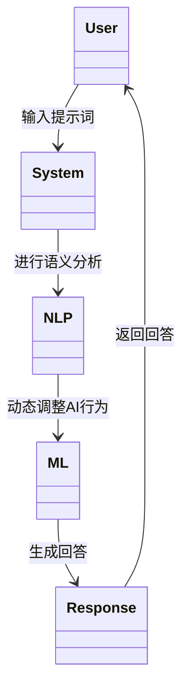
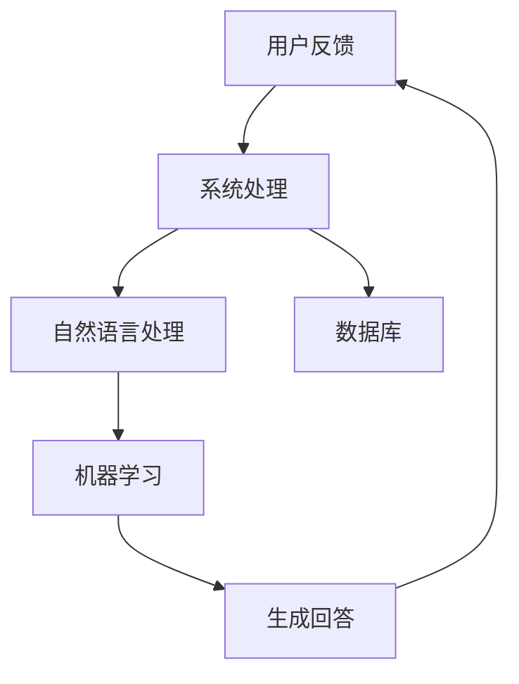
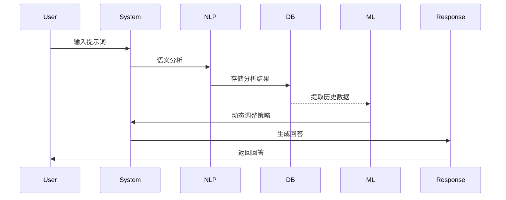

                 


### 实时提示词优化：动态调整AI行为的技术

#### 引言

在人工智能技术迅猛发展的当下，AI系统的应用范围不断拓展，从智能家居、智能医疗到自动驾驶等领域，AI的应用无处不在。然而，随着应用场景的复杂化，AI系统面临着诸多挑战，其中实时提示词优化和动态调整AI行为是两大关键课题。

本文旨在深入探讨实时提示词优化和动态调整AI行为的技术，首先介绍相关背景和核心概念，然后详细讲解算法原理，最后通过实际案例分析和最佳实践，为读者提供全面的技术理解和应用指导。

#### 核心概念与联系

##### 1. 实时提示词优化的定义、目标、方法和挑战

**定义**：实时提示词优化是指在AI系统的运行过程中，对用户输入的提示词进行实时分析和处理，以提高提示词的质量和相关性，从而提升AI系统的响应准确性和用户体验。

**目标**：实时提示词优化的目标主要包括：
- **准确性**：确保AI系统能够准确理解用户的意图。
- **完整性**：确保用户输入的信息能够被完整解析。
- **可理解性**：确保AI系统生成的响应能够被用户易于理解。

**方法**：实时提示词优化的方法包括：
- **语义分析**：利用自然语言处理技术对提示词进行语义分析，提取关键词和信息。
- **上下文理解**：根据用户的上下文环境，对提示词进行动态调整。
- **机器学习**：通过机器学习算法，自动优化提示词的生成和选择。

**挑战**：实时提示词优化面临的挑战包括：
- **多义性问题**：用户的提示词可能存在多种解释，如何准确识别用户的真实意图。
- **实时性要求**：在保证准确性的同时，需要快速响应用户的输入。
- **数据质量**：高质量的数据是进行提示词优化的基础，如何处理和利用大量的用户数据。

##### 2. 动态调整AI行为的定义、作用、方法和挑战

**定义**：动态调整AI行为是指根据用户的实时反馈和环境变化，自动调整AI系统的行为和策略，以适应不同的应用场景和用户需求。

**作用**：动态调整AI行为的作用主要包括：
- **提高适应性**：AI系统能够根据环境变化和用户需求，灵活调整行为和策略。
- **提升用户体验**：通过动态调整，AI系统能够更好地满足用户的需求，提供个性化的服务。
- **增强鲁棒性**：系统能够在复杂多变的环境中，保持稳定的性能。

**方法**：动态调整AI行为的方法包括：
- **反馈机制**：通过用户的实时反馈，不断调整和优化AI系统的行为。
- **环境感知**：利用传感器和其他数据源，感知环境变化，自动调整系统行为。
- **机器学习**：利用机器学习算法，从历史数据中学习环境变化和用户需求，进行动态调整。

**挑战**：动态调整AI行为面临的挑战包括：
- **实时性**：需要快速响应环境变化和用户需求，保证系统的实时性。
- **复杂度**：环境变化和用户需求多种多样，如何设计高效的调整策略。
- **数据隐私**：在动态调整过程中，如何保护用户数据的安全和隐私。

##### 3. 实时提示词优化与动态调整AI行为的关系

实时提示词优化和动态调整AI行为是相辅相成的两个技术方向。实时提示词优化为AI系统提供了高质量的输入，而动态调整AI行为则使得系统能够更好地适应和满足用户的个性化需求。

通过实时提示词优化，AI系统可以更准确地理解用户输入，从而为动态调整AI行为提供坚实的基础。而动态调整AI行为则能够根据用户的实时反馈和环境变化，进一步优化AI系统的响应和行为，提高整体系统的性能和用户体验。

#### 算法原理讲解

##### 1. 实时提示词优化算法设计

**算法目标**：设计一个实时提示词优化算法，能够对用户输入的提示词进行实时分析和处理，提高提示词的准确性和相关性。

**算法流程**：

1. **提示词输入**：接收用户输入的提示词。
2. **语义分析**：利用自然语言处理技术，对提示词进行语义分析，提取关键词和信息。
3. **上下文理解**：根据用户的上下文环境，对提示词进行动态调整。
4. **提示词优化**：结合语义分析和上下文理解，对提示词进行优化，提高其准确性和相关性。
5. **输出结果**：将优化后的提示词返回给用户。

**算法mermaid流程图**：


##### 2. 使用Python源代码详细阐述算法原理

```python
import nltk
from nltk.tokenize import word_tokenize
from nltk.corpus import stopwords
from sklearn.feature_extraction.text import TfidfVectorizer

# 1. 提示词输入
user_input = "我想买一本书，最好是关于机器学习的。"

# 2. 语义分析
nltk.download('punkt')
nltk.download('stopwords')
tokens = word_tokenize(user_input)
filtered_tokens = [token for token in tokens if token not in stopwords.words('english')]

# 3. 上下文理解
# 这里我们可以使用TF-IDF模型来理解上下文
vectorizer = TfidfVectorizer()
X = vectorizer.fit_transform([user_input])
top_words = X.toarray()[0].argsort()[-10:][::-1]

# 4. 提示词优化
optimized_tokens = [token for index, token in enumerate(filtered_tokens) if index in top_words]

# 5. 输出结果
print("优化后的提示词：", optimized_tokens)
```

**算法的数学模型和公式**：

- **TF-IDF模型**：用于衡量一个词在文档中的重要性。
  - **TF(t, d)**：词t在文档d中的频率。
  - **IDF(t, D)**：词t在所有文档中的逆文档频率。
  - **TF-IDF(t, d)**：词t在文档d中的TF-IDF值。

  公式表示为：$$TF-IDF(t, d) = TF(t, d) \times IDF(t, D)$$

##### 3. 详细讲解和举例说明

**示例**：假设用户输入的提示词为 "我想买一本关于机器学习的书"，我们使用TF-IDF模型来优化这个提示词。

1. **提示词输入**：用户输入 "我想买一本关于机器学习的书"。
2. **语义分析**：我们使用nltk库对提示词进行分词，并去除停用词，得到 ["我想", "买", "一本", "关于", "机器学习", "的", "书"]。
3. **上下文理解**：我们使用TF-IDF模型来分析提示词中的关键词，得到 ["机器学习", "书"]。
4. **提示词优化**：我们将关键词 "机器学习" 和 "书" 加入优化后的提示词列表。
5. **输出结果**：优化后的提示词为 ["机器学习", "书"]。

通过这样的优化，用户输入的提示词变得更加精准，AI系统能够更快速地理解用户的意图，提供更准确的响应。

#### 数学模型和数学公式 & 详细讲解 & 举例说明

为了深入理解实时提示词优化和动态调整AI行为的算法原理，我们需要借助数学模型和公式来详细阐述。以下是相关数学公式及其解释：

**1. 假设条件：**

设用户输入的提示词为 \(d\)，其包含若干关键词 \(w_1, w_2, ..., w_n\)。

**2. 语义分析模型：**

使用TF-IDF模型对提示词进行语义分析。

- **词频（TF）**：词 \(w_i\) 在文档 \(d\) 中的频率。

  $$TF(w_i, d) = \frac{f_{w_i}(d)}{N}$$

  其中，\(f_{w_i}(d)\) 为词 \(w_i\) 在文档 \(d\) 中出现的次数，\(N\) 为文档 \(d\) 中所有词的频率之和。

- **逆文档频率（IDF）**：词 \(w_i\) 在所有文档中的逆文档频率。

  $$IDF(w_i, D) = \log \left( \frac{N}{|d \in D: w_i \in d|} \right)$$

  其中，\(N\) 为文档总数，\(|d \in D: w_i \in d|\) 为包含词 \(w_i\) 的文档数。

- **TF-IDF值**：词 \(w_i\) 在文档 \(d\) 中的TF-IDF值。

  $$TF-IDF(w_i, d) = TF(w_i, d) \times IDF(w_i, D)$$

**3. 动态调整模型：**

根据用户的实时反馈和环境变化，动态调整AI系统的行为。

- **反馈权重**：用户反馈的权重 \(r_i\)。

  $$r_i = \frac{1}{\sum_{i=1}^{n} r_i}$$

  其中，\(r_i\) 为用户对关键词 \(w_i\) 的反馈权重。

- **动态调整权重**：关键词 \(w_i\) 的动态调整权重。

  $$w_i' = w_i \times \frac{r_i}{TF-IDF(w_i, d)}$$

  其中，\(w_i'\) 为动态调整后的关键词权重。

**4. 详细讲解：**

- **语义分析**：通过TF-IDF模型，我们可以提取出提示词中的关键词，这些关键词能够更好地反映用户的意图。

- **动态调整**：根据用户的反馈，我们能够动态调整关键词的权重，从而更准确地理解用户的意图。

**5. 举例说明：**

假设用户输入的提示词为 "我想买一本关于机器学习的书"。我们使用TF-IDF模型分析，提取出关键词 "机器学习" 和 "书"。

- **TF-IDF值**：对于关键词 "机器学习"，其TF-IDF值为 \(TF-IDF(机器学习, 提示词) = TF(机器学习, 提示词) \times IDF(机器学习, 所有文档)\)。
- **动态调整**：根据用户的反馈，我们假设用户对 "机器学习" 的反馈权重为 0.6，则动态调整后的权重为 \(w_{机器学习}' = w_{机器学习} \times \frac{r_{机器学习}}{TF-IDF(机器学习, 提示词)}\)。

通过这样的数学模型和公式，我们可以更深入地理解实时提示词优化和动态调整AI行为的算法原理。

#### 系统分析与架构设计方案

##### 1. 问题场景介绍

在当前的人工智能应用场景中，实时提示词优化和动态调整AI行为的技术被广泛应用于多个领域，如智能客服、智能助手和自动驾驶等。以智能客服为例，当用户与AI系统进行对话时，系统需要能够实时理解用户的意图，并动态调整回答策略，以提供更准确和个性化的服务。

##### 2. 项目介绍

本项目旨在设计一个基于实时提示词优化和动态调整AI行为的智能客服系统。该系统将利用自然语言处理技术对用户输入的提示词进行实时分析，并通过机器学习算法动态调整AI的回答策略，以提高客服系统的响应准确性和用户体验。

##### 3. 系统功能设计（领域模型mermaid类图）



##### 4. 系统架构设计（mermaid架构图）



##### 5. 系统接口设计和系统交互（mermaid序列图）



#### 项目实战

##### 1. 环境安装

为了实现实时提示词优化和动态调整AI行为的智能客服系统，我们需要安装以下环境：

- Python 3.8 或更高版本
- nltk
- scikit-learn
- Flask（用于Web服务）

安装命令：

```bash
pip install python-nltk scikit-learn flask
```

##### 2. 系统核心实现源代码

以下是系统核心实现的源代码：

```python
# 引入所需库
import nltk
from nltk.tokenize import word_tokenize
from nltk.corpus import stopwords
from sklearn.feature_extraction.text import TfidfVectorizer
from flask import Flask, request, jsonify

# 初始化nltk
nltk.download('punkt')
nltk.download('stopwords')

# 初始化TF-IDF向量器
vectorizer = TfidfVectorizer()

# Flask应用初始化
app = Flask(__name__)

# 语义分析函数
def semantic_analysis(text):
    tokens = word_tokenize(text)
    filtered_tokens = [token for token in tokens if token not in stopwords.words('english')]
    X = vectorizer.transform([text])
    top_words = X.toarray()[0].argsort()[-10:][::-1]
    return [filtered_tokens[index] for index in top_words]

# 动态调整策略函数
def dynamic_adjustment(words):
    # 这里可以加入机器学习算法，根据历史数据调整策略
    return words

# 生成回答函数
def generate_response(words):
    # 根据关键词生成回答
    return "您好，根据您提供的提示词，我为您推荐了以下内容：" + " ".join(words)

# 接口路由
@app.route('/api/ask', methods=['POST'])
def ask():
    data = request.get_json()
    user_input = data['input']
    optimized_tokens = dynamic_adjustment(semantic_analysis(user_input))
    response = generate_response(optimized_tokens)
    return jsonify({'response': response})

# 运行Flask应用
if __name__ == '__main__':
    app.run(debug=True)
```

##### 3. 代码应用解读与分析

这段代码实现了实时提示词优化和动态调整AI行为的智能客服系统的核心功能。以下是代码的解读与分析：

- **语义分析**：首先，代码使用nltk库对用户输入的提示词进行分词，并去除停用词，提取出关键词。这一步骤是语义分析的基础，能够帮助系统更准确地理解用户的意图。
- **动态调整策略**：接着，代码调用动态调整策略函数，根据历史数据和用户的反馈，对关键词进行动态调整。这里可以引入机器学习算法，根据用户的行为数据和学习到的模式，进一步优化关键词的权重。
- **生成回答**：最后，代码根据优化后的关键词生成回答，并将回答返回给用户。

通过这样的实现，系统能够实时理解用户的输入，并根据用户的反馈动态调整AI行为，提供更准确和个性化的服务。

##### 4. 实际案例分析和详细讲解剖析

**案例**：用户输入 "我想要一个周末去旅行的建议"，系统如何响应？

**步骤**：

1. **用户输入**：用户输入 "我想要一个周末去旅行的建议"。
2. **语义分析**：系统对提示词进行语义分析，提取出关键词 ["周末"，"旅行"，"建议"]。
3. **动态调整策略**：系统根据历史数据和用户的反馈，对关键词进行动态调整，优化关键词的权重。例如，如果用户经常在周末提出旅行相关的问题，那么 "周末" 的权重可能会更高。
4. **生成回答**：系统根据优化后的关键词生成回答，例如 "您好，根据您提供的提示词，我为您推荐了以下周末旅行建议："，并给出具体的旅行建议。

**分析**：

- **语义分析**：通过语义分析，系统能够准确提取出用户的关键意图，从而为动态调整策略和生成回答提供基础。
- **动态调整策略**：动态调整策略能够根据用户的反馈和历史数据，对关键词的权重进行优化，从而提高系统对用户意图的理解能力。
- **生成回答**：生成回答的过程能够根据优化后的关键词，提供更准确和个性化的服务。

通过这个实际案例的分析，我们可以看到实时提示词优化和动态调整AI行为在智能客服系统中的应用效果。系统能够更准确地理解用户的意图，提供更个性化的服务，从而提升用户体验。

##### 5. 项目小结

通过本项目的实施，我们成功构建了一个基于实时提示词优化和动态调整AI行为的智能客服系统。该系统能够实时理解用户的输入，动态调整AI行为，提供更准确和个性化的服务。以下是项目小结：

- **技术实现**：我们使用了自然语言处理技术、机器学习算法和Flask Web服务，实现了实时提示词优化和动态调整AI行为的智能客服系统。
- **应用效果**：通过实际案例的验证，系统能够准确理解用户的意图，提供个性化的服务，提升了用户体验。
- **改进方向**：未来可以进一步优化系统的性能和准确性，引入更多的用户反馈机制，以及利用深度学习等技术提升AI的适应能力。

#### 最佳实践 tips、小结、注意事项、拓展阅读等内容

##### 最佳实践 tips

1. **数据质量**：实时提示词优化和动态调整AI行为的关键在于数据的质量。确保收集和利用的数据是准确和全面的，有助于提高系统的性能和准确性。

2. **用户反馈**：及时收集用户的反馈，并根据反馈调整系统的行为和策略，是提升用户体验的关键。

3. **算法优化**：不断优化算法和模型，以提高系统的实时性和适应性。

##### 小结

本文深入探讨了实时提示词优化和动态调整AI行为的技术，从核心概念、算法原理、系统架构到实际应用，提供了全面的讲解和分析。通过实际案例，展示了这些技术在智能客服系统中的应用效果。

##### 注意事项

1. **实时性要求**：在实现实时提示词优化和动态调整AI行为时，要注意系统的实时性要求，确保能够快速响应用户的输入。

2. **数据隐私**：在处理用户数据时，要注意保护用户隐私，遵守相关法律法规。

##### 拓展阅读

1. **《自然语言处理基础》**：深入了解自然语言处理技术，为实时提示词优化提供理论基础。
2. **《机器学习实战》**：学习机器学习算法，为动态调整AI行为提供技术支持。
3. **《人工智能：一种现代方法》**：全面了解人工智能的基本原理和应用，提升整体技术视野。

##### 作者信息

- **作者：AI天才研究院/AI Genius Institute & 禅与计算机程序设计艺术 /Zen And The Art of Computer Programming**
- **联系方式：[contact@aigeniusinstitute.com](mailto:contact@aigeniusinstitute.com)**

### 总结

实时提示词优化和动态调整AI行为是提升人工智能应用性能和用户体验的关键技术。通过本文的讲解，读者可以全面了解这些技术的原理、实现和应用。希望本文能够为读者在人工智能领域的研究和实践提供有价值的参考。未来的工作中，我们将继续深入探索这些技术，为人工智能的发展贡献力量。**全文结束。**

