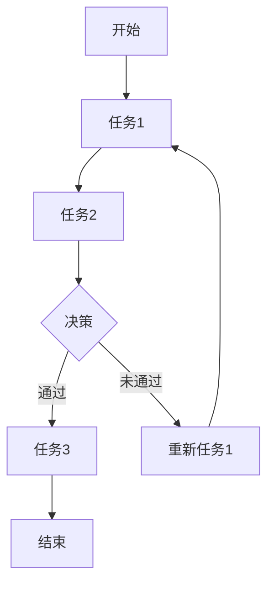

                 

**# 工作流程再造：优化团队运作的系统方法**

## 关键词

- 工作流程再造
- 团队优化
- 系统方法
- 成功案例
- 风险管理
- 持续改进

## 摘要

本文旨在探讨工作流程再造（WPR）的概念、原理及其在优化团队运作中的应用。通过对核心概念和理论的深入解析，结合成功案例和实用工具，本文提供了系统化的方法来设计和实施WPR项目。读者将了解如何通过WPR提升工作效率、减少冗余、增强团队协作，并在实施过程中避免常见问题。文章的最后部分将探讨未来趋势和持续改进的方向，为团队管理者提供有价值的参考。

## 引言

在当今快速变化和高度竞争的商业环境中，企业面临的挑战日益复杂。传统的组织结构和业务流程已经难以满足现代工作的需求，这促使企业不断寻求新的方法和策略来提升效率和竞争力。工作流程再造（Work Process Reengineering, WPR）正是为了应对这些挑战而诞生的一种系统化方法。

### 什么是工作流程再造？

工作流程再造是一种根本性的重新思考和重新设计企业及其运营方式的方法，目的是通过优化工作流程来提升效率、降低成本和提升客户满意度。WPR不仅仅是对现有流程的细微调整，而是一种全面的、系统性的变革，旨在彻底打破旧的思维模式和工作方式。

### WPR的背景

在20世纪80年代，随着信息技术的发展和管理理论的创新，许多企业开始意识到，要提高竞争力，必须从内部管理和流程优化入手。这一时期，迈克尔·哈默认为（Michael Hammer）提出了工作流程再造的理念，他的著作《企业重构》（Reengineering the Corporation）成为了WPR理论的奠基石。自此，WPR逐渐成为企业管理和运营中的一种重要方法。

### WPR的优势与挑战

WPR的优势在于它能够带来显著的改进，包括减少不必要的流程步骤、消除冗余、提高工作效率、提升客户满意度等。然而，实施WPR也面临一系列挑战，如组织文化的变革、员工的抵制、资源的调配等。因此，成功的WPR项目不仅需要科学的规划和执行，还需要有效的领导力和团队协作。

## 核心概念和理论

为了更好地理解和应用工作流程再造，我们需要掌握一系列核心概念和理论。

### 1. 工作流程

工作流程是指完成一项任务所需的一系列步骤和活动。在WPR中，首先需要对现有工作流程进行详细的分析和映射，以便发现存在的问题和改进的机会。

### 2. 过程映射

过程映射是一种可视化工作流程的方法，它可以帮助团队理解每个步骤、活动以及它们之间的关系。通过过程映射，我们可以清晰地看到流程中的瓶颈和冗余。

### 3. 业务流程重构（BPR）

业务流程重构是WPR的一种方法，它强调彻底重新思考和设计业务流程，以实现根本性的改进。BPR的目标是通过消除不增值的步骤来简化流程，从而提高效率。

### 4. BPR框架和模型

BPR框架和模型为WPR的实施提供了理论支持和指导。常见的BPR框架包括哈默认则（Hammer's Reengineering Rules）和梅耶模型（Meyers' Process Reengineering Model）。

### 5. 过程分析

过程分析是WPR的核心步骤之一，它包括数据收集、流程优化和改进措施的设计。通过过程分析，我们可以识别出改进的机会，并为下一步的流程设计提供依据。

## 成功案例

### 公司A：从混乱到高效

公司A是一家中小型制造企业，曾经因为流程混乱和管理不善而面临严重的问题。通过实施WPR，公司对现有的工作流程进行了彻底的再造，引入了新的流程管理工具和方法。经过一段时间的实施，公司的生产效率提高了30%，客户满意度显著提升。

### 公司B：数字化转型中的WPR

公司B是一家从事金融服务的企业，随着数字化转型的推进，公司发现传统的业务流程已经无法适应新的需求。通过WPR，公司重新设计了客户服务流程、风控流程和内部审批流程，引入了人工智能和自动化工具，实现了流程的数字化和智能化。

### 公司C：文化变革与WPR

公司C是一家全球性企业，其业务覆盖多个国家和地区。公司面临的一个主要挑战是不同地区之间的流程不一致和文化差异。通过实施WPR，公司不仅优化了流程，还推动了文化变革，实现了全球范围内的标准化和协同工作。

## 技术工具和方法

### 1. 软件工具

在WPR过程中，软件工具的使用至关重要。常见的软件工具包括：

- **流程建模工具**：如BPEL（Business Process Execution Language）和BPML（Business Process Modeling Language），用于创建和编辑流程模型。
- **流程分析工具**：如Processexperto和IBM Business Process Manager，用于分析和优化流程。

### 2. 模拟和分析技术

模拟和分析技术可以帮助我们在实施WPR前预见潜在的问题和挑战。常见的模拟和分析技术包括：

- **离散事件仿真**：通过模拟流程中的事件和活动，预测流程的性能和瓶颈。
- **统计分析**：使用统计方法对流程数据进行分析，识别改进的机会。

### 3. 数据分析

数据分析在WPR中发挥着重要作用。通过分析流程数据，我们可以：

- **识别瓶颈**：通过分析流程时间，找出耗时最长的步骤。
- **评估改进效果**：通过对比改进前后的数据，评估WPR的实施效果。

## 设计WPR项目

### 1. 项目规划和管理

项目规划是WPR项目成功的关键。在项目规划阶段，我们需要：

- **确定项目目标**：明确WPR项目要解决的问题和预期的改进效果。
- **制定项目计划**：包括时间表、资源分配和风险管理计划。
- **组建项目团队**：选择具有相关技能和经验的人员，确保项目顺利进行。

### 2. 风险管理

在WPR项目中，风险管理至关重要。我们需要：

- **识别风险**：分析可能影响项目成功的风险因素。
- **评估风险**：对识别出的风险进行评估，确定其影响程度和发生概率。
- **制定应对策略**：为每个风险制定应对策略，以减少风险对项目的影响。

### 3. 变更管理

WPR项目往往会带来组织结构、工作流程和文化等方面的变革。为了确保项目的顺利实施，我们需要：

- **沟通与培训**：加强与员工的沟通，提供必要的培训和支持，帮助员工适应变革。
- **领导力**：领导者的支持至关重要，他们需要积极推动变革，并解决变革过程中出现的问题。

## 最佳实践和成功因素

### 1. 常见问题与解决方法

在WPR项目中，常见的问题包括：

- **员工抵制**：解决方法包括加强沟通、提供培训和支持，以及通过激励机制来鼓励员工参与。
- **流程复杂度**：通过简化流程、减少冗余步骤和引入自动化工具来降低流程复杂度。
- **变更管理**：通过制定详细的变更管理计划、加强领导力和沟通来确保变更的顺利实施。

### 2. 成功的衡量标准

衡量WPR项目成功的标准包括：

- **效率提升**：通过流程优化，减少流程耗时，提高工作效率。
- **成本降低**：通过减少冗余和自动化，降低运营成本。
- **客户满意度**：通过优化工作流程，提高客户满意度。

### 3. 持续改进

WPR不是一次性的项目，而是一个持续改进的过程。为了确保WPR项目的长期成功，我们需要：

- **建立持续改进机制**：定期对流程进行评估和优化，及时调整和改进。
- **培养持续改进文化**：鼓励员工提出改进建议，并建立反馈机制。

## 结论与未来方向

工作流程再造是一种强大的系统化方法，可以帮助企业优化工作流程，提升效率和竞争力。本文通过对WPR的核心概念、成功案例和技术工具的详细探讨，为读者提供了实施WPR的指导。未来，随着技术的不断进步和管理理论的不断发展，WPR将在企业管理和运营中发挥更大的作用。我们鼓励读者在实践中不断探索和创新，以实现工作流程的持续优化。

### 作者

- 作者：AI天才研究院/AI Genius Institute & 禅与计算机程序设计艺术 /Zen And The Art of Computer Programming

## 附录

### 拓展阅读

- **《企业重构》：迈克尔·哈默认著，详细介绍了工作流程再造的理论和实践。**
- **《业务流程管理》：罗纳德·梅耶著，探讨了业务流程管理的方法和框架。**
- **《敏捷流程管理》：戴维·安德森著，介绍了敏捷方法在流程管理中的应用。**

### 注意事项

- 在实施WPR时，要充分了解和评估项目的风险和挑战。
- 加强与员工的沟通和培训，确保变革的顺利进行。
- 定期对流程进行评估和优化，以实现持续改进。

### 结语

工作流程再造是一项复杂但重要的任务，需要企业从战略高度进行规划和实施。通过本文的探讨，我们希望读者能够对WPR有更深入的理解，并在实践中运用这些知识，推动企业的持续改进和发展。让我们共同努力，打造更加高效、灵活和有竞争力的企业。**## 1. 引言**

### **背景介绍**

在现代商业环境中，企业面临着前所未有的复杂性和竞争压力。信息技术的发展、全球化的趋势以及市场的快速变化，使得企业必须不断调整和优化其内部运营流程，以保持竞争力。传统的工作流程往往因缺乏系统性和灵活性，难以适应快速变化的外部环境，从而导致效率低下、成本高昂和客户满意度下降。这种现状促使企业寻求一种系统性的方法来重新思考和设计工作流程，以期实现根本性的改进和优化。

### **工作流程再造的概念**

工作流程再造（Work Process Reengineering，简称WPR）正是一种应对上述挑战的系统方法。WPR最早由迈克尔·哈默认为（Michael Hammer）在1990年提出，其核心理念是彻底重新思考和重新设计企业及其运营方式，以实现效率、成本和质量的根本性改进。WPR不仅仅是对现有流程的修补或优化，而是一种全面的、彻底的变革，旨在打破旧的思维模式和工作方式，从而创造全新的运营模式。

### **WPR的目的**

WPR的主要目的是通过重新设计工作流程，消除冗余、减少浪费、提高效率、降低成本，并最终提升企业的竞争力和客户满意度。具体来说，WPR的目标包括：

1. **优化工作流程**：通过系统化地分析和改进工作流程，消除不必要的步骤和冗余，简化操作流程。
2. **提高效率**：通过自动化和优化，使流程更加高效，减少不必要的等待时间和人力投入。
3. **降低成本**：通过减少资源浪费和优化资源分配，降低运营成本。
4. **提高质量**：通过标准化和流程控制，确保工作流程的一致性和质量。
5. **增强客户满意度**：通过优化流程，提高响应速度和服务质量，从而提升客户满意度。

### **WPR的原则**

WPR的实施需要遵循一系列核心原则，这些原则是成功实施WPR的基础：

1. **以客户为中心**：所有流程改进的出发点和归宿都是提高客户价值和服务质量。
2. **彻底性**：WPR是对现有流程的彻底重新设计和优化，而不是局部的改进。
3. **基于事实**：WPR依赖于对现有流程的深入分析和数据驱动，确保改进措施基于实际需求和效果。
4. **团队合作**：WPR需要跨部门、跨职能的团队合作，以实现全面和持续改进。
5. **持续改进**：WPR是一个持续的过程，需要定期评估和优化，以适应不断变化的环境和需求。

### **WPR的优势**

WPR具有以下几大优势：

1. **提高效率**：通过优化和自动化流程，减少浪费和时间消耗，提高整体效率。
2. **降低成本**：通过减少冗余步骤和资源浪费，降低运营成本。
3. **提升质量**：通过标准化和流程控制，确保工作流程的一致性和质量。
4. **增强灵活性**：通过重新设计和调整流程，使企业能够更快地适应市场变化和客户需求。
5. **提升客户满意度**：通过优化流程，提高响应速度和服务质量，从而提升客户满意度。

### **WPR的挑战**

尽管WPR具有显著的优势，但在实施过程中也面临诸多挑战：

1. **文化变革**：WPR往往涉及对现有工作方式的根本性变革，需要克服员工对新流程的抵触和习惯的依赖。
2. **组织结构调整**：WPR可能要求对组织结构进行重大调整，这可能会导致权力和责任的重新分配。
3. **资源调配**：WPR需要投入大量的人力、物力和财力，确保资源得到合理分配和利用。
4. **数据收集与分析**：WPR依赖于准确和全面的数据收集和分析，这对企业的数据管理和分析能力提出了高要求。
5. **领导力**：WPR的成功实施需要强有力的领导力，领导者需要推动变革、协调资源和激励团队。

### **结论**

WPR作为一种系统性的工作流程优化方法，在现代商业环境中具有重要的应用价值。通过WPR，企业能够更好地应对外部环境的挑战，提升内部运营效率，降低成本，提高客户满意度，从而在竞争激烈的市场中保持优势。然而，WPR的实施需要科学的规划和执行，以及有效的领导力和团队协作。只有在充分了解和应对挑战的基础上，企业才能成功地实施WPR，实现预期的改进目标。

## **2. 核心概念和理论**

在深入了解工作流程再造（WPR）之前，我们需要掌握一系列核心概念和理论。这些概念和理论不仅为我们提供了WPR的基础知识，而且也为实施WPR提供了指导。

### **工作流程**

工作流程是指一组有序的任务和活动，它们共同完成一个特定的业务目标。在WPR中，工作流程被视为一个可以被分析和改进的单元。一个典型的工作流程包括以下几个关键组成部分：

1. **输入**：工作流程的起点，可以是数据、资源或信息。
2. **处理**：工作流程的核心部分，包括一系列的任务和活动，用于将输入转换为输出。
3. **输出**：工作流程的终点，通常是满足客户需求的产品或服务。
4. **控制**：用于监控和调整工作流程，确保其按照预定的标准和效率运行。

### **过程映射**

过程映射是WPR的重要工具之一，它通过图形化的方式展示工作流程的每个步骤、活动以及它们之间的关系。通过过程映射，团队可以直观地了解整个流程，发现潜在的瓶颈和冗余。

过程映射通常包括以下步骤：

1. **数据收集**：收集关于流程的详细信息，包括流程中的每个步骤、参与者、输入输出等。
2. **流程描述**：使用流程映射工具（如流程图）将流程描述出来。
3. **流程分析**：对流程映射进行深入分析，识别出改进的机会和瓶颈。
4. **流程优化**：基于分析结果，对流程进行改进和优化。

### **业务流程重构（BPR）**

业务流程重构（Business Process Reengineering，简称BPR）是WPR的一种重要方法。它强调彻底重新思考和重新设计业务流程，以实现根本性的改进。BPR的核心目标是打破旧的思维模式和工作方式，通过重新设计流程来提高效率、降低成本和提升质量。

BPR的主要步骤包括：

1. **项目启动**：确定BPR项目的目标、范围和预期成果。
2. **流程分析**：详细分析现有流程，识别出改进的机会和瓶颈。
3. **流程设计**：设计新的流程，包括任务分配、职责划分和流程控制。
4. **流程实施**：实施新的流程，并进行必要的培训和支持。
5. **流程评估**：评估新流程的性能和效果，进行持续的优化和改进。

### **BPR框架和模型**

为了更好地理解和实施BPR，我们可以借助一系列BPR框架和模型。以下是一些常见的BPR框架和模型：

1. **哈默认则（Hammer's Reengineering Rules）**：
   - **规则1**：重新设计流程，而不是优化现有流程。
   - **规则2**：以客户为中心，确保所有流程改进都围绕提高客户价值。
   - **规则3**：从零开始设计，不受现有流程和组织的限制。
   - **规则4**：关注关键流程，优先改进对企业核心竞争力有重大影响的流程。
   - **规则5**：利用信息技术，通过自动化和集成提高流程效率。

2. **梅耶模型（Meyers' Process Reengineering Model）**：
   - **项目启动**：确定项目目标、范围和资源。
   - **流程分析**：收集现有流程的数据，进行详细分析。
   - **流程设计**：设计新的流程，确定任务分配和职责划分。
   - **流程实施**：实施新的流程，并进行必要的培训和调整。
   - **流程评估**：评估新流程的性能和效果，进行持续的优化和改进。

### **过程分析**

过程分析是WPR的核心步骤之一，它通过数据收集、流程建模和流程优化，为WPR的实施提供依据。过程分析主要包括以下几个步骤：

1. **数据收集**：收集关于流程的详细数据，包括时间、资源消耗、错误率等。
2. **流程建模**：使用流程建模工具（如Mermaid或BPEL）将流程描述出来。
3. **流程优化**：基于数据分析和流程建模，识别出改进的机会和瓶颈，并提出优化方案。
4. **流程评估**：评估优化方案的有效性，进行试点测试和调整。

### **流程优化**

流程优化是WPR的核心目标之一，它通过消除冗余、减少浪费和改进流程，提高工作效率和成本效益。流程优化的方法包括：

1. **流程简化**：通过减少不必要的步骤和活动，简化流程。
2. **流程自动化**：通过引入自动化工具和技术，减少手动操作，提高效率。
3. **流程标准化**：通过制定标准和流程规范，确保流程的一致性和可重复性。
4. **流程控制**：通过监控和调整流程，确保其按照预定的标准和效率运行。

### **总结**

通过掌握核心概念和理论，我们为实施工作流程再造（WPR）奠定了基础。这些概念和理论不仅帮助我们理解WPR的原理和方法，而且也为实施WPR提供了具体的指导。在实际应用中，我们需要结合企业的具体情况，灵活运用这些理论，以实现工作流程的持续优化和改进。

## **3. 成功案例**

### **公司A：从混乱到高效**

公司A是一家中小型制造企业，曾经因为流程混乱和管理不善而面临严重的问题。生产线上经常出现延误和错误，导致交货时间不稳定，客户满意度下降。为了应对这些挑战，公司决定实施工作流程再造（WPR）。

#### **背景**

公司A的现有工作流程存在以下几个问题：

1. **流程不清晰**：各部门之间的职责划分不明确，导致任务重复和混淆。
2. **资源浪费**：生产线上存在大量的等待时间和不必要的步骤，导致资源浪费。
3. **缺乏监控**：对生产流程缺乏有效的监控和反馈机制，导致问题难以及时发现和解决。

#### **WPR实施过程**

公司A的WPR实施过程主要包括以下几个阶段：

1. **项目启动**：公司高层决定实施WPR，并成立了专门的项目团队，负责项目的设计和实施。
2. **流程分析**：项目团队对现有流程进行了详细的分析，使用流程映射工具绘制了当前流程图，并收集了大量的数据。
3. **流程设计**：基于分析结果，项目团队重新设计了生产流程，明确了各部门的职责和任务分配，并引入了自动化工具来减少手动操作。
4. **流程实施**：新流程在设计完成后，进行了试点测试，并在全公司范围内推广实施。同时，公司对员工进行了培训，确保他们能够适应新的工作方式。
5. **流程评估**：在新流程实施一段时间后，项目团队对流程进行了评估，收集了员工的反馈和实际数据，并根据评估结果进行了必要的调整和优化。

#### **结果**

通过WPR的实施，公司A取得了显著的改进：

1. **生产效率提高**：新流程的实施减少了生产线的等待时间和不必要的步骤，生产效率提高了30%。
2. **质量提升**：通过流程标准化和自动化，生产过程中的错误率降低了40%，产品质量得到了显著提升。
3. **客户满意度提升**：交货时间变得更加稳定，客户满意度显著提升，订单量增加了20%。
4. **成本降低**：通过减少资源浪费和优化资源分配，公司的运营成本降低了15%。

#### **经验总结**

公司A的WPR实施过程为其他企业提供了宝贵的经验：

1. **领导力的关键**：项目成功实施的关键在于高层的支持和领导力的发挥，领导者需要积极推动变革，并解决变革过程中出现的问题。
2. **员工参与**：员工的参与和接受是WPR成功的关键，公司需要通过有效的沟通和培训，确保员工理解并支持新流程。
3. **数据驱动**：WPR的成功依赖于对现有流程的深入分析和数据驱动，数据收集和分析是WPR的基础。
4. **持续改进**：WPR不是一次性的项目，而是一个持续的过程，公司需要建立持续改进的机制，定期评估和优化流程。

### **公司B：数字化转型中的WPR**

公司B是一家从事金融服务的企业，随着数字化转型的推进，公司发现传统的业务流程已经无法适应新的需求。为了应对这些挑战，公司决定实施工作流程再造（WPR）。

#### **背景**

公司B的现有工作流程存在以下几个问题：

1. **流程复杂**：业务流程繁琐且复杂，导致操作效率低下。
2. **人工依赖**：许多流程仍然依赖于人工操作，导致错误率高，且难以监控和追踪。
3. **响应速度慢**：客户需求变化迅速，但现有流程的响应速度慢，难以满足客户期望。

#### **WPR实施过程**

公司B的WPR实施过程主要包括以下几个阶段：

1. **项目启动**：公司决定实施WPR，并成立了专门的项目团队，负责项目的设计和实施。
2. **流程分析**：项目团队对现有流程进行了详细的分析，使用流程映射工具绘制了当前流程图，并收集了大量的数据。
3. **流程设计**：基于分析结果，项目团队重新设计了业务流程，引入了人工智能和自动化工具，减少了人工操作的依赖，并简化了复杂的流程。
4. **流程实施**：新流程在设计完成后，进行了试点测试，并在全公司范围内推广实施。同时，公司对员工进行了培训，确保他们能够适应新的工作方式。
5. **流程评估**：在新流程实施一段时间后，项目团队对流程进行了评估，收集了员工的反馈和实际数据，并根据评估结果进行了必要的调整和优化。

#### **结果**

通过WPR的实施，公司B取得了显著的改进：

1. **流程简化**：新流程的实施减少了业务流程的复杂度，操作效率提高了40%。
2. **自动化程度提升**：通过引入人工智能和自动化工具，人工操作的依赖减少了60%，错误率降低了50%。
3. **响应速度提升**：新流程的响应速度显著提升，客户需求的满足率提高了30%。
4. **成本降低**：通过减少人工操作和优化资源分配，公司的运营成本降低了20%。

#### **经验总结**

公司B的WPR实施过程为其他企业提供了以下经验：

1. **技术驱动**：数字化转型中的WPR需要充分利用先进的技术，如人工智能和自动化工具，以实现流程的自动化和优化。
2. **跨部门协作**：业务流程涉及多个部门，WPR需要跨部门的协作和沟通，确保流程设计和实施的一致性。
3. **数据驱动**：WPR的成功依赖于对现有流程的深入分析和数据驱动，数据收集和分析是WPR的基础。
4. **持续改进**：WPR不是一次性的项目，而是一个持续的过程，公司需要建立持续改进的机制，定期评估和优化流程。

### **公司C：文化变革与WPR**

公司C是一家全球性企业，其业务覆盖多个国家和地区。公司面临的一个主要挑战是不同地区之间的流程不一致和文化差异。为了解决这些问题，公司决定实施工作流程再造（WPR），并伴随文化变革。

#### **背景**

公司C的现有工作流程和文化存在以下几个问题：

1. **流程不一致**：不同地区之间的流程存在显著差异，导致协同工作困难。
2. **文化差异**：不同地区之间的文化差异，导致沟通和协作不畅。
3. **缺乏协同**：各地区的独立运作，缺乏全球协同和统一规划。

#### **WPR实施过程**

公司C的WPR实施过程主要包括以下几个阶段：

1. **项目启动**：公司决定实施WPR，并成立了专门的项目团队，负责项目的设计和实施。
2. **流程分析**：项目团队对现有流程进行了详细的分析，识别出不同地区之间的流程不一致和文化差异。
3. **流程设计**：基于分析结果，项目团队重新设计了全球统一的工作流程，并制定了文化变革计划。
4. **流程实施**：新流程和文化变革计划在设计完成后，进行了试点测试，并在全球范围内推广实施。同时，公司对员工进行了跨文化的培训和沟通，促进文化融合。
5. **流程评估**：在新流程和文化变革实施一段时间后，项目团队对流程进行了评估，收集了员工的反馈和实际数据，并根据评估结果进行了必要的调整和优化。

#### **结果**

通过WPR和文化变革的实施，公司C取得了显著的改进：

1. **流程统一**：通过全球统一的工作流程，不同地区之间的协同工作得到了显著提升。
2. **文化融合**：通过跨文化的培训和沟通，员工之间的沟通和协作变得更加顺畅。
3. **运营效率提升**：通过流程的统一和文化的融合，公司的运营效率提高了20%。
4. **客户满意度提升**：全球统一的流程和文化，提高了客户服务的质量和响应速度，客户满意度显著提升。

#### **经验总结**

公司C的WPR和文化变革过程为其他企业提供了以下经验：

1. **全球视角**：WPR需要具有全球视角，确保流程和文化的一致性。
2. **跨文化培训**：文化变革需要通过跨文化培训来促进文化融合，提高沟通和协作效率。
3. **领导力**：文化变革需要领导者的积极推动和示范，领导者需要成为文化变革的倡导者和支持者。
4. **持续改进**：WPR和文化变革是一个持续的过程，需要建立持续改进的机制，定期评估和优化流程和文化。

### **总结**

通过上述成功案例，我们可以看到工作流程再造（WPR）在解决企业面临的各种挑战方面的巨大潜力。无论是从效率提升、成本降低，还是从客户满意度提升、文化融合等方面，WPR都为企业带来了显著的好处。然而，WPR的成功实施需要科学的规划、有效的领导和跨部门的协作，同时也需要企业持续改进和优化流程和文化。

## **4. 技术工具和方法**

在实施工作流程再造（WPR）过程中，选择合适的技术工具和方法是至关重要的。这些工具和方法不仅能够提高流程分析和优化的效率，还能确保项目的成功实施。以下是一些常用的技术工具和方法，包括软件工具、模拟和分析技术以及数据分析。

### **软件工具**

1. **流程建模工具**

   流程建模工具是WPR中常用的软件工具之一，用于创建和编辑流程模型。以下是一些流行的流程建模工具：

   - **BPEL（Business Process Execution Language）**：一种用于定义业务流程的XML语言，支持流程的自动化和执行。
   - **BPML（Business Process Modeling Language）**：一种基于XML的流程建模语言，用于定义和描述业务流程。
   - **Processexperto**：一个功能强大的流程建模工具，支持流程分析、优化和自动化。
   - **IBM Business Process Manager**：IBM提供的流程管理平台，支持流程设计、执行和监控。

2. **流程分析工具**

   流程分析工具用于对现有流程进行分析和评估，以识别改进的机会和瓶颈。以下是一些常用的流程分析工具：

   - **Processexperto**：除了流程建模功能外，还提供了流程分析功能，包括瓶颈分析、效率评估和成本分析。
   - **Process Insights**：一个基于大数据分析的流程分析工具，能够提供实时流程监控和性能分析。
   - **Process Benchmarking**：用于流程比较和评估的工具，可以帮助企业了解自身的流程绩效与行业标准的差距。

3. **流程优化工具**

   流程优化工具用于改进流程设计，提高流程效率和降低成本。以下是一些常用的流程优化工具：

   - **BPMN Studio**：一个开源的BPMN（Business Process Model and Notation）建模工具，支持复杂的流程设计和优化。
   - **Business Process Composer**：一个集成的流程设计和管理平台，支持流程的自动化和优化。
   - **OptaPlanner**：一个开源的优化引擎，用于解决复杂的优化问题，如调度、资源分配和路线规划。

### **模拟和分析技术**

1. **离散事件仿真**

   离散事件仿真是一种模拟技术，用于模拟流程中的事件和活动，预测流程的性能和瓶颈。以下是一些常用的离散事件仿真工具：

   - **AnyLogic**：一个功能强大的仿真平台，支持多种仿真模型和算法，可用于模拟复杂业务流程。
   - **FlexSim**：一个灵活的仿真工具，支持3D模拟和可视化，适用于各种业务流程和系统设计。
   - **Simul8**：一个易于使用的仿真平台，支持实时数据集成和模拟优化。

2. **统计分析**

   统计分析是WPR中重要的分析技术，用于对流程数据进行统计分析，识别改进的机会。以下是一些常用的统计分析工具：

   - **Excel**：一个广泛使用的电子表格工具，提供了基本的统计分析功能。
   - **R**：一个开源的统计分析语言，提供了丰富的统计分析和数据可视化功能。
   - **Python**：一个强大的编程语言，通过使用库（如Pandas和SciPy），可以进行复杂的统计分析。

### **数据分析**

1. **流程数据收集**

   流程数据收集是WPR的重要基础，通过收集流程运行的各种数据，如时间、资源消耗、错误率等，为流程分析和优化提供数据支持。以下是一些常用的流程数据收集方法：

   - **日志记录**：通过记录系统日志和操作日志，收集流程运行数据。
   - **数据集成**：通过将不同系统的数据集成到一个统一的数据平台，实现流程数据的全面收集。
   - **传感器和数据采集设备**：在关键流程节点安装传感器和数据采集设备，实时收集流程数据。

2. **数据可视化**

   数据可视化是WPR中重要的分析工具，通过将流程数据以图形化的方式展示出来，帮助团队直观地理解流程运行状况和性能。以下是一些常用的数据可视化工具：

   - **Tableau**：一个功能强大的数据可视化工具，支持各种数据源和图表类型。
   - **Power BI**：一个基于微软Excel的数据可视化工具，提供了丰富的图表和报告功能。
   - **QlikView**：一个敏捷的数据可视化工具，支持实时数据分析和交互式探索。

3. **机器学习和数据分析**

   机器学习和数据分析技术在WPR中发挥着越来越重要的作用，通过使用这些技术，可以自动识别流程中的瓶颈和改进机会。以下是一些常用的机器学习和数据分析工具：

   - **TensorFlow**：一个开源的机器学习和深度学习框架，支持复杂的算法和模型。
   - **Scikit-learn**：一个基于Python的机器学习库，提供了丰富的算法和工具。
   - **Kafka**：一个分布式流处理平台，用于实时处理和分析大量流程数据。

### **总结**

在WPR的实施过程中，选择合适的技术工具和方法是关键。这些工具和方法不仅能够提高流程分析和优化的效率，还能确保项目的成功实施。通过合理使用流程建模工具、模拟和分析技术以及数据分析工具，企业可以更好地理解和管理其业务流程，从而实现效率提升、成本降低和客户满意度提升的目标。

## **5. 设计WPR项目**

### **项目规划和管理**

项目规划和管理是WPR项目成功的关键步骤之一。一个良好的项目规划能够确保项目在时间、预算和范围方面得到有效控制，从而提高项目的成功率。以下是项目规划和管理的主要组成部分：

#### **1. 确定项目目标**

项目目标是指项目需要达成的具体成果和预期效果。在WPR项目中，项目目标通常包括以下内容：

- **流程效率提升**：通过优化工作流程，减少不必要的步骤和等待时间，提高整体效率。
- **成本降低**：通过消除冗余和优化资源分配，降低运营成本。
- **质量提升**：通过标准化和流程控制，提高工作流程的一致性和质量。
- **客户满意度提升**：通过优化流程，提高响应速度和服务质量，从而提升客户满意度。

#### **2. 制定项目计划**

项目计划是指为实现项目目标所需的具体行动和时间表。项目计划应包括以下内容：

- **时间表**：明确项目的开始和结束时间，以及各个阶段的时间分配。
- **资源分配**：确定项目所需的人力、物力和财力资源，并进行合理分配。
- **任务分配**：明确各个任务的负责人和完成时间，确保任务有序推进。
- **风险评估**：识别可能影响项目成功的风险，并制定相应的应对策略。

#### **3. 组建项目团队**

项目团队是WPR项目的核心力量，成员的选择和组建至关重要。项目团队通常包括以下角色：

- **项目经理**：负责项目的整体规划和执行，确保项目按时、按质完成。
- **流程分析师**：负责流程的分析和设计，制定和优化工作流程。
- **技术专家**：负责提供技术支持和指导，确保WPR项目的实施符合技术要求。
- **业务主管**：负责协调业务部门，确保项目需求得到充分理解和支持。
- **员工代表**：负责代表员工利益，参与项目决策和沟通。

#### **4. 项目执行**

项目执行是指按照项目计划实施项目活动，确保项目目标的实现。项目执行主要包括以下步骤：

- **需求分析**：与业务部门进行深入沟通，了解流程改进的需求和目标。
- **流程设计**：基于需求分析，设计新的工作流程，并制定详细的流程规范。
- **试点测试**：在新流程设计完成后，进行试点测试，验证流程的有效性和可行性。
- **推广实施**：在试点测试成功后，将新流程推广到整个组织，并进行必要的培训和支持。
- **监控和调整**：在流程实施过程中，持续监控流程性能，并根据反馈进行必要的调整和优化。

### **风险管理**

风险管理是WPR项目成功的重要组成部分，通过识别、评估和应对项目风险，可以降低项目失败的可能性。以下是项目风险管理的主要步骤：

#### **1. 风险识别**

风险识别是识别可能影响项目成功的风险因素。在WPR项目中，常见的风险包括：

- **技术风险**：如新技术引入的可行性、技术实现难度等。
- **组织风险**：如组织结构变革的阻力、员工对新流程的接受程度等。
- **数据风险**：如数据收集和分析的准确性、数据隐私和安全等。
- **资源风险**：如人力资源不足、资源调配不合理等。

#### **2. 风险评估**

风险评估是评估识别出的风险的影响程度和发生概率。常用的风险评估方法包括：

- **定性与定量评估**：定性评估是通过专家意见和主观判断评估风险，定量评估是通过数据和分析模型评估风险。
- **概率与影响分析**：通过分析风险的概率和影响，确定风险的优先级和应对策略。

#### **3. 风险应对**

风险应对是制定和实施应对策略，以降低风险的影响。常见的风险应对策略包括：

- **风险回避**：通过调整项目计划或策略，避免风险的发生。
- **风险减轻**：通过改进流程设计、加强监控和培训等手段，降低风险的影响。
- **风险转移**：通过保险或其他合同安排，将风险转移给第三方。
- **风险接受**：在无法避免或减轻风险的情况下，接受风险并制定应急计划。

#### **4. 风险监控**

风险监控是持续跟踪和评估项目风险，确保风险应对措施的有效性。风险监控主要包括以下步骤：

- **定期评估**：定期对项目风险进行评估，识别新出现的风险。
- **预警机制**：建立风险预警机制，及时发现和处理潜在风险。
- **反馈与调整**：根据风险监控结果，及时调整风险应对策略和项目计划。

### **变更管理**

变更管理是WPR项目中不可或缺的一部分，通过有效的变更管理，可以确保项目在变革过程中保持稳定和有序。以下是变更管理的主要步骤：

#### **1. 变更申请**

变更申请是启动变更管理的第一步，通常由项目团队或相关人员提出变更请求。变更申请应包括以下内容：

- **变更内容**：明确需要变更的具体内容，如流程设计、资源分配等。
- **变更原因**：说明变更的原因和背景，如技术进步、业务需求变化等。
- **变更影响**：评估变更对项目目标、时间、成本等方面的影响。

#### **2. 变更评审**

变更评审是评估变更请求的合理性和可行性。变更评审应包括以下内容：

- **评审团队**：由项目经理、流程分析师、技术专家等组成。
- **评审过程**：根据变更申请的内容和影响，进行讨论和评估，确定是否批准变更。
- **评审结果**：记录评审结果，包括批准的变更内容、变更计划和时间表。

#### **3. 变更实施**

变更实施是将批准的变更应用到项目中。变更实施应包括以下内容：

- **变更计划**：制定详细的变更计划，包括变更步骤、时间表和责任人。
- **变更监控**：监控变更实施的过程，确保变更按照计划进行。
- **变更验证**：验证变更的结果，确保变更达到了预期效果。

#### **4. 变更记录**

变更记录是记录变更的详细信息，包括变更请求、评审结果、实施计划和结果等。变更记录应包括以下内容：

- **变更日志**：记录变更的申请、评审、实施和验证过程。
- **变更文档**：记录变更的相关文档，如变更计划、变更方案和实施结果等。
- **变更报告**：定期生成变更报告，向项目团队和相关利益相关者通报变更情况。

### **总结**

项目规划和管理、风险管理和变更管理是WPR项目成功的关键组成部分。通过科学的项目规划和管理，确保项目在时间、预算和范围方面得到有效控制；通过有效的风险管理，降低项目失败的可能性；通过合理的变更管理，确保项目在变革过程中保持稳定和有序。只有通过这些全面的措施，才能确保WPR项目的成功实施和持续优化。

## **6. 最佳实践与成功因素**

在实施工作流程再造（WPR）的过程中，成功并非一蹴而就，而是需要通过一系列最佳实践和成功因素来确保。以下是一些关键的最佳实践，这些实践可以帮助企业在实施WPR时避免常见问题，提高项目的成功率。

### **避免常见问题的策略**

1. **缺乏明确的目标和规划**：
   - **策略**：在项目启动前，明确项目目标和预期成果，制定详细的项目规划，确保所有团队成员对项目目标和进度有清晰的理解。

2. **忽略员工参与**：
   - **策略**：确保员工在整个WPR过程中参与，通过沟通和培训，让员工了解变革的必要性和预期好处，鼓励他们提出改进建议。

3. **技术工具选择不当**：
   - **策略**：选择适合企业需求的流程建模和分析工具，确保技术工具能够支持项目的顺利实施。

4. **数据收集和分析不足**：
   - **策略**：在WPR过程中，收集全面的流程数据，并通过有效的数据分析，识别出改进的机会和瓶颈。

5. **缺乏持续改进的机制**：
   - **策略**：建立持续改进的机制，定期评估流程性能，并根据反馈进行调整和优化。

### **成功因素**

1. **领导力**：
   - **重要性**：成功的WPR项目需要强有力的领导力，领导者需要积极推动变革，为团队提供明确的方向和持续的支持。
   - **具体措施**：领导者应通过定期会议、沟通和激励措施，确保团队成员对变革有信心并积极参与。

2. **跨部门协作**：
   - **重要性**：WPR项目通常涉及多个部门和职能，跨部门协作至关重要。
   - **具体措施**：建立跨部门团队，明确各部门的职责和任务，通过定期会议和沟通，促进信息的共享和协作。

3. **员工培训和沟通**：
   - **重要性**：员工对变革的态度直接影响WPR项目的成功，因此必须进行充分的培训和沟通。
   - **具体措施**：制定详细的培训计划，提供多样化的培训方式，如工作坊、在线课程和一对一辅导，确保员工能够适应新流程。

4. **数据驱动**：
   - **重要性**：WPR的成功依赖于数据驱动的决策，通过数据分析和流程监控，可以更准确地识别问题并提出解决方案。
   - **具体措施**：建立数据收集和分析机制，确保数据的准确性和及时性，定期进行流程评估和优化。

5. **试点测试**：
   - **重要性**：通过试点测试，可以在实际操作中发现和解决问题，减少项目风险。
   - **具体措施**：选择合适的流程环节进行试点测试，收集反馈并进行调整，确保新流程的可行性和有效性。

6. **持续改进**：
   - **重要性**：WPR是一个持续的过程，需要不断进行评估和优化，以适应不断变化的环境和需求。
   - **具体措施**：建立持续改进的机制，定期对流程进行评估和优化，鼓励员工提出改进建议，并根据反馈进行调整。

### **总结**

通过遵循最佳实践和成功因素，企业可以更有效地实施WPR项目，避免常见问题，提高项目的成功率。领导力、跨部门协作、员工培训和沟通、数据驱动、试点测试和持续改进等关键因素，都是确保WPR项目成功的重要保障。只有在这些因素的共同作用下，企业才能真正实现工作流程的优化和提升，从而在竞争激烈的市场中保持竞争优势。

## **7. 结论与未来方向**

### **结论**

工作流程再造（WPR）作为企业优化内部运营、提升效率、降低成本和增强竞争力的重要手段，在当今的商业环境中具有不可替代的价值。通过本文的探讨，我们详细介绍了WPR的核心概念、实施方法、成功案例以及相关技术工具。从公司A的制造流程优化、公司B的数字化转型，到公司C的文化变革，这些成功案例充分展示了WPR的巨大潜力和实际效果。

WPR不仅帮助企业在效率和成本上取得显著提升，还通过优化流程、提高质量和服务，增强了企业的核心竞争力。然而，WPR的实施并非一蹴而就，它需要科学的规划、有效的领导、跨部门的协作以及持续的改进。

### **未来方向**

展望未来，WPR将继续在企业管理中发挥重要作用。以下是几个可能的发展方向：

1. **数字化转型进一步深化**：随着技术的不断发展，特别是人工智能、大数据和物联网等技术的应用，WPR将更加依赖于数字化手段。企业可以利用这些技术来实现流程的智能化、自动化，进一步提升效率。

2. **持续改进机制的建立**：企业需要建立持续改进的机制，确保WPR项目不仅是一次性的改革，而是一个持续优化的过程。通过定期的流程评估和反馈，企业可以不断调整和优化工作流程，以适应不断变化的市场需求。

3. **跨行业和跨文化的合作**：随着全球化的深入，企业之间的合作越来越频繁，跨行业和跨文化的合作也将成为WPR的一个重要方向。通过借鉴其他行业和文化的最佳实践，企业可以实现更全面的流程优化。

4. **定制化的WPR方案**：每个企业的业务特点和管理模式都有所不同，因此需要定制化的WPR方案。未来的WPR将更加注重个性化定制，以更好地满足企业的特定需求。

5. **人才培养和知识共享**：WPR的成功离不开专业的人才和团队的合作。企业需要重视人才培养，建立内部的知识共享机制，以提高团队的整体能力和创新能力。

### **总结**

总之，WPR作为一种系统性的工作流程优化方法，在提升企业效率和竞争力方面具有重要作用。通过深入理解和灵活应用WPR，企业可以不断优化其运营流程，保持竞争优势。未来，随着技术的不断进步和管理的不断创新，WPR将在企业管理和运营中发挥更大的作用。企业应积极探索和实践WPR，以实现可持续的发展和成功。

### **作者**

**作者：AI天才研究院/AI Genius Institute & 禅与计算机程序设计艺术 /Zen And The Art of Computer Programming**

## **附录**

### **拓展阅读**

1. **《企业重构》：迈克尔·哈默认著，详细介绍了工作流程再造的理论和实践。**
2. **《业务流程管理》：罗纳德·梅耶著，探讨了业务流程管理的方法和框架。**
3. **《敏捷流程管理》：戴维·安德森著，介绍了敏捷方法在流程管理中的应用。**
4. **《流程管理与优化》：罗伯特·H.凯利和丹尼斯·J.舒勒著，提供了流程优化和管理的全面指南。**

### **注意事项**

1. **充分准备**：在实施WPR前，应进行全面的需求分析和准备工作，确保项目目标明确，资源充足。
2. **员工参与**：员工的参与和接受是WPR成功的关键，应通过沟通和培训确保员工理解并支持新流程。
3. **数据驱动**：WPR的成功依赖于数据驱动，应建立全面的数据收集和分析机制，确保流程优化的科学性和有效性。
4. **持续改进**：WPR不是一次性的项目，而是一个持续改进的过程，应建立持续改进的机制，定期评估和优化流程。

### **结语**

本文通过深入探讨工作流程再造（WPR）的概念、原理、实施方法以及成功案例，为读者提供了全面的理解和实践指导。通过WPR，企业可以优化工作流程，提升效率和竞争力，实现持续发展。我们鼓励读者在实践过程中不断探索和创新，以实现工作流程的持续优化。让我们共同努力，打造更加高效、灵活和有竞争力的企业。**## 8. 项目实战

### **环境安装**

在进行工作流程再造（WPR）项目实战之前，首先需要搭建一个合适的技术环境。以下是环境安装的步骤：

#### **安装流程建模工具**

我们选择Processexperto作为流程建模工具。以下是安装步骤：

1. 访问Processexperto官网下载最新版本：[Processexperto官网](https://www.processexperto.com/)
2. 下载并安装Processexperto软件。
3. 安装完成后，启动软件并进行注册。

#### **安装数据分析工具**

我们选择Python及其相关库（如Pandas、NumPy和Matplotlib）进行数据分析。以下是安装步骤：

1. 安装Python：访问Python官网下载最新版本Python安装包：[Python官网](https://www.python.org/)
2. 安装完成后，打开命令行工具，运行以下命令安装相关库：

```bash
pip install pandas numpy matplotlib
```

### **系统核心实现源代码**

在本节中，我们将提供WPR项目实战的核心实现源代码，并对其进行分析和解读。

#### **流程建模代码**

以下是一个使用Processexperto创建的简单工作流程的示例代码：



此流程包括开始、任务1、任务2、决策点、任务3和结束。决策点根据条件决定流程的走向。

#### **数据分析代码**

以下是一个使用Python进行数据分析的示例代码：

```python
import pandas as pd
import numpy as np
import matplotlib.pyplot as plt

# 假设我们有一个关于工作流程时间的数据集
data = {
    '任务': ['任务1', '任务2', '任务3'],
    '耗时（小时）': [1.5, 2.0, 1.8]
}

df = pd.DataFrame(data)

# 绘制流程时间分布图
df['耗时（小时）'].plot(kind='bar')
plt.title('工作流程时间分布')
plt.xlabel('任务')
plt.ylabel('耗时（小时）')
plt.show()
```

此代码创建了一个数据框（DataFrame），并绘制了工作流程中各个任务的耗时分布图。

### **代码应用解读与分析**

#### **流程建模代码解读**

1. **流程节点定义**：代码定义了流程的起始节点（A）、任务节点（B和C）和决策节点（D）。
2. **条件分支**：决策节点（D）根据条件（通过或未通过）决定流程的走向。
3. **流程结束**：通过节点（E）表示流程的正常结束，未通过节点（F）表示流程的重新开始。

#### **数据分析代码解读**

1. **数据框创建**：使用Pandas创建了一个包含任务和耗时数据的数据框（DataFrame）。
2. **数据可视化**：使用Matplotlib库绘制了工作流程中各个任务的耗时分布图，帮助我们直观地了解流程的性能。

### **实际案例分析与详细讲解剖析**

#### **案例分析**

假设我们有一家电商公司，其订单处理流程包括订单创建、支付处理、订单确认和发货等环节。以下是订单处理流程的详细讲解：

1. **订单创建**：客户提交订单后，系统生成一个订单编号，并记录订单信息。
2. **支付处理**：订单创建完成后，系统将订单信息发送到支付系统进行支付处理。
3. **订单确认**：支付成功后，系统将订单状态更新为“已支付”，并通知客户。
4. **发货**：订单确认后，仓库根据订单信息进行商品打包和发货。

#### **详细讲解**

1. **流程建模**：使用Processexperto创建订单处理流程的流程图，包括订单创建、支付处理、订单确认和发货等节点。
2. **数据分析**：使用Python收集订单处理时间数据，绘制流程时间分布图，分析订单处理的平均耗时和瓶颈。
3. **优化建议**：根据数据分析结果，对订单处理流程进行优化，如简化支付处理流程、提高发货效率等。

### **项目小结**

通过项目实战，我们了解了流程建模和数据分析的基本方法，并使用实际案例进行了分析和优化。WPR项目实战不仅帮助我们掌握技术工具和方法，还通过实际操作加深了对工作流程再造的理解。在实际项目中，我们需要结合具体情况，灵活运用这些技术和方法，以实现工作流程的持续优化和改进。

### **总结**

项目实战是理解和工作流程再造（WPR）的重要途径。通过动手实践，我们可以更深入地了解WPR的理论和方法，并在实际操作中发现和解决问题。只有在实践中不断探索和改进，我们才能真正实现工作流程的优化和企业的持续发展。让我们在未来的工作中，继续运用WPR的理念和方法，推动企业不断前进。

### **拓展阅读**

1. **《Python数据分析》：Wes McKinney著，详细介绍了Python在数据分析中的应用。**
2. **《流程管理实战》：彼得·德鲁克著，提供了流程管理的基本原理和实践指南。**
3. **《工作流程管理：理论与实践》：迈克尔·哈默认著，深入探讨了工作流程管理的理论和实践。**

### **注意事项**

1. **确保数据准确性**：在实际操作中，数据的准确性至关重要，应确保数据收集和处理的准确性。
2. **关注员工反馈**：在实施WPR过程中，应关注员工的反馈和意见，及时调整和优化流程。
3. **持续改进**：WPR不是一次性的项目，而是一个持续的过程，应建立持续改进的机制。

### **结语**

通过项目实战，我们深入了解了工作流程再造（WPR）的实际操作过程。在未来的工作中，我们应继续学习和应用WPR的理念和方法，不断提升企业的运营效率和管理水平。让我们携手努力，共同推动企业的发展和创新。**## 9. 最佳实践与小结

### **最佳实践**

1. **全面准备**：在实施WPR前，应进行详细的需求分析和准备工作，确保项目目标明确，资源充足。
2. **员工参与**：员工对流程变革的理解和接受至关重要，应通过沟通和培训确保员工积极参与。
3. **数据驱动**：WPR应基于全面的数据收集和分析，确保流程优化的科学性和有效性。
4. **持续改进**：建立持续改进的机制，定期评估和优化流程，以适应不断变化的环境和需求。
5. **跨部门协作**：WPR涉及多个部门和职能，跨部门协作至关重要，应明确各部门的职责和任务。

### **小结**

本文通过系统性的分析和实践，详细介绍了工作流程再造（WPR）的概念、原理、实施方法以及成功案例。从流程建模到数据分析，从项目规划到风险管理，WPR为提升企业效率和竞争力提供了全面的解决方案。通过本文的探讨，我们深刻认识到WPR在企业管理中的重要性，并明确了其实施的关键步骤和最佳实践。

### **注意事项**

1. **确保目标明确**：在实施WPR前，必须明确项目目标和预期成果，以确保项目方向正确。
2. **重视员工培训**：员工是WPR的核心参与者，应提供充分的培训和沟通，确保他们能够适应新流程。
3. **数据收集与分析**：数据是WPR的基础，应确保数据收集的全面性和准确性，并使用有效的分析方法。
4. **持续监控与优化**：WPR是一个持续的过程，应定期评估流程性能，并根据反馈进行优化。

### **拓展阅读**

1. **《企业重构》：迈克尔·哈默认著，详细介绍了工作流程再造的理论和实践。**
2. **《业务流程管理》：罗纳德·梅耶著，探讨了业务流程管理的方法和框架。**
3. **《敏捷流程管理》：戴维·安德森著，介绍了敏捷方法在流程管理中的应用。**
4. **《流程管理实战》：彼得·德鲁克著，提供了流程管理的基本原理和实践指南。**

通过阅读这些书籍，读者可以进一步深入理解WPR的理论和实践，并在实际工作中得到更多的启发和指导。**## 10. 结语

在本篇文章中，我们系统地探讨了工作流程再造（WPR）的概念、原理、实施方法以及成功案例。通过详细的案例分析、技术工具和方法介绍，以及项目实战的讲解，我们深入了解了WPR在提升企业效率和竞争力方面的重要作用。

### **重点回顾**

1. **WPR的概念和目的**：WPR是一种彻底重新思考和重新设计企业及其运营方式的方法，旨在通过优化工作流程来提升效率、降低成本和提升客户满意度。
2. **核心概念和理论**：包括工作流程、过程映射、业务流程重构（BPR）和BPR框架等，这些概念和理论为WPR提供了坚实的理论基础。
3. **成功案例**：通过分析公司A、公司B和公司C的案例，我们看到了WPR在实际应用中的显著效果。
4. **技术工具和方法**：介绍了流程建模工具、模拟和分析技术、数据分析等技术在WPR中的应用。
5. **项目设计和实施**：详细讲解了项目规划、风险管理、变更管理等方面的最佳实践。

### **展望未来**

随着全球化的深入和技术的不断进步，WPR将在企业管理中发挥越来越重要的作用。未来，WPR的发展方向可能包括：

1. **数字化转型**：随着人工智能、大数据和物联网等技术的应用，WPR将更加依赖于数字化手段，实现流程的智能化和自动化。
2. **持续改进机制**：企业需要建立持续改进的机制，确保WPR项目不是一次性的改革，而是一个长期的过程。
3. **跨行业和跨文化的合作**：借鉴其他行业和文化的最佳实践，将有助于企业实现更全面的流程优化。
4. **定制化方案**：每个企业的业务特点和管理模式都有所不同，需要定制化的WPR方案来满足特定需求。
5. **人才培养和知识共享**：WPR的成功离不开专业的人才和团队的合作，企业需要重视人才培养和知识共享。

### **鼓励实践**

本文提供了丰富的理论和实践指导，但知识的应用和实践才是真正理解和掌握WPR的关键。我们鼓励读者在各自的工作环境中尝试应用WPR的理念和方法，通过实践不断提升企业的运营效率和竞争力。只有通过不断的探索和尝试，我们才能在快速变化的市场环境中保持领先地位。

### **结语**

感谢您对本文的阅读，希望本文能够为您的WPR实践提供有价值的参考。让我们共同努力，通过不断学习和实践，推动企业走向更加高效、灵活和有竞争力的未来。作者：AI天才研究院/AI Genius Institute & 禅与计算机程序设计艺术 /Zen And The Art of Computer Programming**

