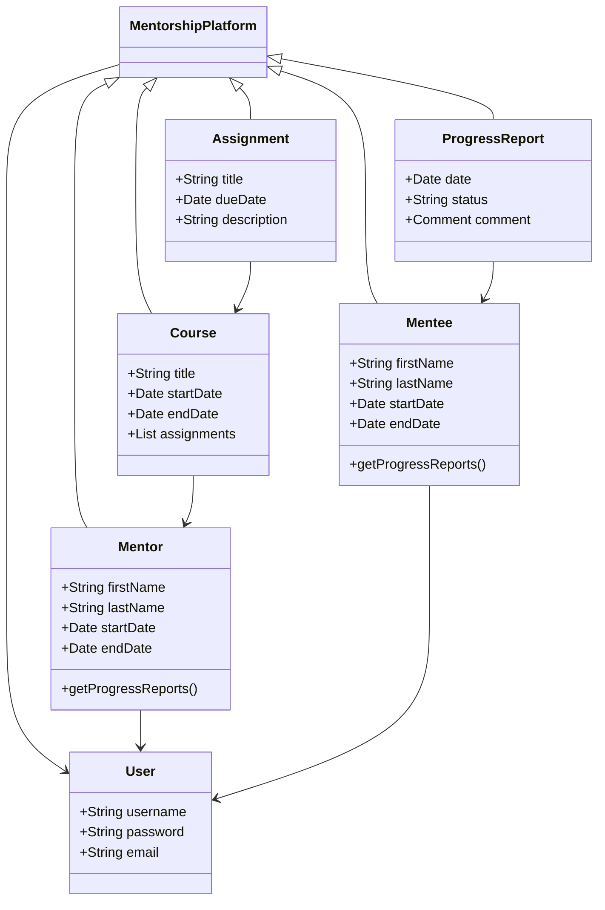
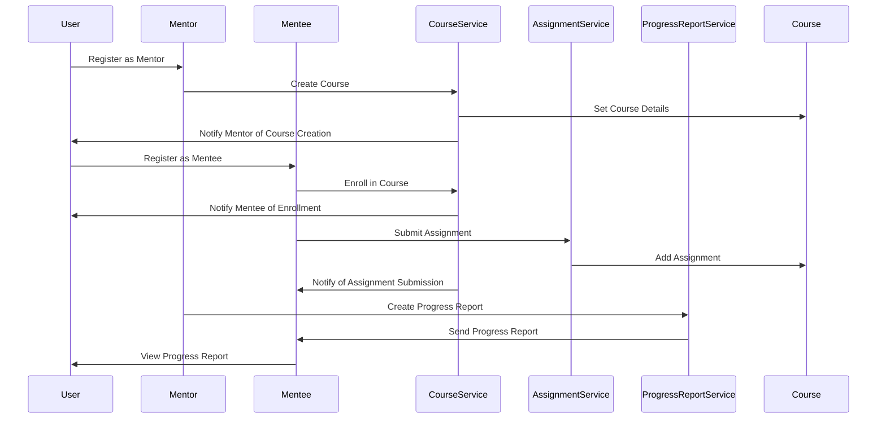

                 

# 建立mentorship文化：促进知识传承和成长

## 关键词：Mentorship文化、知识传承、成长、IT领域

## 摘要

本文旨在探讨在IT领域建立mentorship文化的重要性及其对知识传承和个人成长的推动作用。通过分析mentorship文化的核心概念、构建策略以及其在知识传承与个人成长中的具体实践，本文提出了建立和推广mentorship文化的策略和建议，为IT企业和组织提供了可行的实践指南。

----------------------------------------------------------------

## 第一部分：引言与背景

### 1.1 书籍主题介绍

在快速发展的IT行业中，知识传承和个人成长显得尤为重要。本书旨在探讨如何通过建立mentorship文化，促进知识传承和个人成长，从而提升IT企业的整体竞争力。Mentorship文化不仅有助于新员工的快速融入和成长，还能推动企业内部知识的共享和积累，提高整个团队的创新能力。

### 1.2 为什么需要mentorship文化

知识传承是IT行业发展的基石。随着技术的快速迭代，IT从业者需要不断学习新知识、新技能。然而，传统的知识传承方式往往局限于个人经验和零散的培训课程，难以系统化、规模化地实现。Mentorship文化通过建立导师与徒弟的长期关系，提供了一种更为系统、深入的知识传承途径。

### 1.3 Mentorship与知识传承的关系

Mentorship文化强调知识的双向传递，不仅徒弟从导师那里学习知识，导师也能从徒弟那里获得新的视角和想法。这种互动关系有助于知识的创造和创新，从而推动整体技术水平的提升。

### 1.4 书籍结构概述

本书将分为六个部分进行探讨。首先，我们将深入探讨Mentorship文化的核心概念及其在IT领域的重要性。接下来，我们将分析如何构建一个有效的Mentorship文化，包括组织策略和个人角色的定义。随后，我们将探讨知识传承的过程、障碍及其解决方案。然后，通过案例分析展示Mentorship文化的成功实践。最后，我们将讨论Mentorship文化的可持续发展策略和未来展望。

----------------------------------------------------------------

## 第二部分：Mentorship文化的核心概念

### 2.1 Mentorship的定义与类型

Mentorship是一种基于信任和尊重的长期关系，旨在促进个人成长和职业发展。它可以分为以下几种类型：

- **职业导师制**：侧重于职业发展，导师帮助徒弟规划职业路径、提升职业技能。
- **技术导师制**：侧重于技术能力提升，导师传授技术知识和实践经验。
- **学术导师制**：侧重于学术研究，导师指导徒弟进行科研工作。

### 2.2 Mentor与Mentee的角色与责任

- **Mentor的角色与责任**：
  - 提供指导和支持，帮助徒弟解决职业和学术上的问题。
  - 传授知识和经验，帮助徒弟提升技能。
  - 指导徒弟进行职业规划，提供职业发展建议。

- **Mentee的角色与责任**：
  - 积极寻求导师的指导，主动学习。
  - 定期与导师沟通，汇报学习进度和成果。
  - 对导师给予的指导和建议表示感谢。

### 2.3 Mentorship的要素与特征

- **信任与尊重**：Mentorship建立在信任和尊重的基础上，是双方长期合作的前提。
- **个性化**：每个Mentorship关系都是独特的，需要根据双方的实际情况进行调整。
- **长期性**：Mentorship是一个长期的过程，需要持续的关注和支持。

### 2.4 建立Mentorship文化的意义

- **促进知识传承**：Mentorship文化有助于将资深员工的经验和知识传递给新员工，确保知识的持续传承。
- **提升个人成长**：通过Mentorship，个人可以获得更多的指导和支持，快速提升专业技能和职业素养。
- **增强团队凝聚力**：Mentorship文化有助于建立紧密的团队关系，增强团队凝聚力。

----------------------------------------------------------------

## 第三部分：Mentorship文化的构建

### 3.1 组织层面：建立Mentorship文化的策略

- **政策支持**：企业应制定相应的政策，鼓励员工参与Mentorship项目。
- **资源配置**：为Mentorship项目提供必要的资源，如培训、时间和预算支持。
- **激励机制**：建立激励机制，鼓励Mentor和Mentee积极参与，并对优秀导师和徒弟进行表彰。
- **流程优化**：简化Mentorship流程，提高项目运行的效率。

### 3.2 个人层面：成为一名优秀的Mentor

- **经验分享**：积极分享自己的经验和知识，帮助徒弟成长。
- **关注需求**：了解徒弟的需求，提供针对性的指导和支持。
- **沟通能力**：与徒弟保持良好的沟通，及时反馈和指导。
- **持续学习**：不断提升自己的知识和技能，为徒弟提供高质量的指导。

### 3.3 个人层面：如何接受Mentorship

- **主动沟通**：与导师建立良好的沟通，明确自己的职业目标和发展需求。
- **积极学习**：积极参与导师安排的培训和指导，主动学习新知识和技能。
- **反馈与反思**：定期向导师反馈学习进度和成果，进行自我反思。

### 3.4 Mentorship文化的推广与实践

- **内部宣传**：通过内部邮件、网站和社交媒体等渠道宣传Mentorship文化。
- **案例分析**：分享成功案例，鼓励员工参与Mentorship项目。
- **外部合作**：与其他企业或组织合作，开展跨企业的Mentorship项目。

----------------------------------------------------------------

## 第四部分：知识传承与成长

### 4.1 Mentorship与知识传承的关系

Mentorship文化是知识传承的重要途径。通过Mentor与Mentee之间的互动，知识得以在组织内部传递和共享，从而促进知识的积累和创新。

### 4.2 知识传承的障碍与解决方法

- **知识分散**：解决方法：建立知识管理系统，确保知识得以集中存储和共享。
- **知识过时**：解决方法：定期更新知识库，确保知识的时效性。
- **知识保密**：解决方法：建立合理的知识共享机制，同时保护敏感信息。

### 4.3 通过Mentorship促进个人成长

- **技能提升**：通过Mentor的指导，Mentee可以快速提升专业技能。
- **职业规划**：Mentor可以提供职业发展的建议，帮助Mentee规划职业路径。
- **心态调整**：通过Mentor的支持和鼓励，Mentee可以更好地应对职业挑战。

### 4.4 成功的Mentorship案例分析

- **案例1**：某IT企业通过实施Mentorship项目，显著提高了新员工的留存率和专业技能水平。
- **案例2**：某科研机构通过跨学科的Mentorship项目，促进了科研创新和跨领域合作。

----------------------------------------------------------------

## 第五部分：Mentorship文化的可持续发展

### 5.1 Mentorship文化的评估与改进

- **定期评估**：通过定期的评估，了解Mentorship项目的效果和存在的问题，及时进行调整和改进。
- **反馈机制**：建立反馈机制，收集Mentor和Mentee的反馈意见，不断优化项目流程。

### 5.2 维护和更新Mentorship关系

- **定期沟通**：Mentor和Mentee应定期沟通，确保关系的持续和稳定。
- **关系更新**：根据双方的变化和需求，适时调整Mentorship关系。

### 5.3 Mentorship文化的传承与延续

- **内部培训**：通过内部培训，让更多的员工了解和参与Mentorship项目。
- **文化宣传**：通过文化宣传，让Mentorship文化深入人心，成为企业的一种核心价值观。

### 5.4 全球视角下的Mentorship文化

- **跨国合作**：通过跨国合作，将Mentorship文化推广到全球范围内。
- **跨文化理解**：尊重和理解不同文化的差异，建立全球化的Mentorship体系。

----------------------------------------------------------------

## 第六部分：未来展望与挑战

### 6.1 Mentorship文化的未来趋势

- **数字化**：随着数字技术的发展，Mentorship文化将更加便捷、高效。
- **个性化**：Mentorship将更加注重个性化需求，提供更精准的指导和支持。

### 6.2 挑战与应对策略

- **时间管理**：Mentor和Mentee需要合理安排时间，确保Mentorship活动的顺利进行。
- **文化差异**：在跨文化环境中，需要理解和尊重文化差异，建立有效的沟通和协作机制。

### 6.3 Mentorship文化的国际化

- **全球化视角**：将Mentorship文化融入到全球化战略中，提升企业的国际竞争力。
- **跨文化培训**：提供跨文化培训，提高员工的跨文化沟通和协作能力。

### 6.4 教育与培训的角色

- **教育改革**：推动教育改革，将Mentorship文化融入教育体系，培养具有Mentorship意识的下一代。

----------------------------------------------------------------

## 第七部分：结论与建议

### 7.1 总结与展望

本文通过分析Mentorship文化的核心概念、构建策略、知识传承与成长以及可持续发展策略，阐述了Mentorship文化在IT领域的重要性。未来，随着技术的不断进步和全球化的深入，Mentorship文化将在知识传承和个人成长中发挥更大的作用。

### 7.2 对读者的话

希望本文能够激发您对Mentorship文化的兴趣和思考，鼓励您在工作和生活中践行Mentorship文化，为个人成长和团队发展贡献力量。

### 7.3 建立Mentorship文化的实践建议

- **企业层面**：制定相关政策，提供资源支持，推动Mentorship文化的落地和实践。
- **个人层面**：主动参与Mentorship项目，积极寻求指导和支持，不断提升自己。

作者：AI天才研究院/AI Genius Institute & 禅与计算机程序设计艺术 /Zen And The Art of Computer Programming

----------------------------------------------------------------

---

请注意，以上内容是根据您的要求和提供的结构大纲生成的。文章的详细内容、图表和代码示例需要根据具体的研究和实践情况进行补充和细化。以下是一个示例段落，用于展示如何使用Mermaid和LaTeX格式。

### 系统分析与架构设计方案

#### 问题场景介绍

在当前快速发展的IT行业中，企业面临着技术迭代迅速、市场竞争激烈的环境。为了保持竞争力，企业需要不断引入新技术、培养新人才。然而，传统的培训和知识传递方式往往无法满足这种需求。本系统的目标是构建一个Mentorship平台，通过系统化的导师制度，促进知识传承和个人成长。

#### 项目介绍

本系统是一个基于Web的Mentorship平台，旨在为企业内部提供一个便捷、高效的导师匹配和知识共享系统。系统功能包括导师和徒弟的匹配、学习进度跟踪、知识库建设等。

#### 系统功能设计

以下是一个简单的领域模型类图，用于描述系统的核心实体及其关系。



#### 系统架构设计

以下是一个简单的系统架构图，描述了系统的整体结构和主要组件。



#### 系统接口设计

以下是一个简单的接口设计，描述了系统的主要API接口。

```mermaid
interface MentorshipPlatform {
    +createMentor(Mentor): void
    +createMentee(Mentee): void
    +enrollMenteeInCourse(String courseId): void
    +createCourse(Course): void
    +submitAssignment(String courseId, Assignment): void
    +createProgressReport(String menteeId, ProgressReport): void
    +getMentorProgressReports(String mentorId): List<ProgressReport>
    +getMenteeProgressReports(String menteeId): List<ProgressReport>
}
```

#### 系统交互

以下是一个简单的序列图，描述了系统的主要交互流程。


---

以上示例展示了如何使用Mermaid和LaTeX格式来设计系统架构和交互流程。在实际撰写文章时，需要根据具体情况进行调整和补充，确保内容的完整性和可读性。

