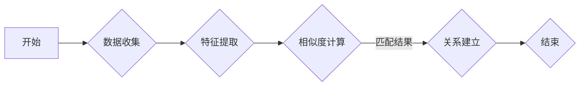
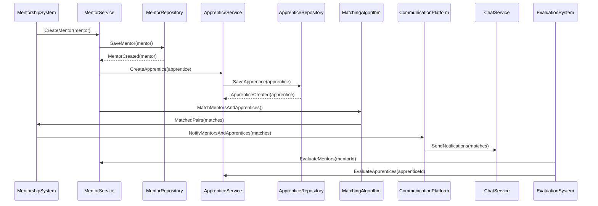

                 

# 建立mentorship文化：促进知识传承和成长

> 关键词：Mentorship文化、知识传承、人才培养、职业发展、组织架构

> 摘要：本文旨在探讨建立mentorship文化的重要性，以及如何通过有效的mentorship模式促进知识传承和员工个人成长。文章首先介绍了mentorship文化的核心概念和原理，然后通过具体的案例和算法分析了如何实现导师与学徒的有效匹配和沟通，最后讨论了如何评估和优化mentorship文化，为企业的人才培养提供实用的策略和建议。

## **第一部分：背景介绍**

### **1.1 问题背景**

在现代职场中，知识传承与人才培养已成为企业持续发展的关键。随着技术的快速进步和市场的不断变化，员工需要不断更新知识和技能以保持竞争力。然而，传统的培训方式和师徒制往往效率低下，难以满足快速变化的技术环境和企业需求。为了解决这一问题，建立mentorship文化成为一种有效的解决方案。mentorship文化是一种以知识和经验传承为核心的人才培养模式，通过建立导师与学徒之间的关系，实现知识的有效传递和技能的提升。

### **1.2 问题描述**

建立mentorship文化的过程中，企业往往面临以下挑战：

1. **导师与学徒的匹配**：如何确保导师具有相应的知识和经验，同时学徒能够从导师身上获得有价值的指导？
2. **时间的投入**：如何确保导师能够投入足够的时间和精力来指导学徒？
3. **沟通机制**：如何建立有效的沟通机制，确保知识的有效传递？
4. **效果评估**：如何评估导师和学徒的参与效果，并提供改进建议？

### **1.3 问题解决**

本文将从以下几个方面解决问题：

1. **第2章：Mentorship文化的核心概念与原则**：介绍mentorship文化的定义、核心概念和基本原则。
2. **第3章：Mentor与Apprentice的关系构建**：探讨导师与学徒之间的角色定位、关系建立和互动机制。
3. **第4章：建立有效的沟通机制**：介绍如何建立有效的沟通机制，确保知识的有效传递。
4. **第5章：评估与反馈机制**：介绍如何评估导师和学徒的参与效果，并提供改进建议。

### **1.4 边界与外延**

- **边界**：本文主要关注企业内部建立mentorship文化的方法和策略，不涉及其他组织形式如学校或社区。
- **外延**：虽然本文主要针对企业，但其原则和方法也可应用于其他组织形式，如非营利组织、科研机构等。

### **1.5 概念结构与核心要素组成**

- **Mentor**：导师，具有丰富经验和知识的人，负责指导学徒。
- **Apprentice**：学徒，愿意学习和成长的人，接受导师的指导。
- **Mentorship文化**：一种以知识和经验传承为核心的人才培养模式。

## **第二部分：核心概念与联系**

### **2.1 Mentorship文化的核心概念**

- **Mentor**：具有丰富经验和知识的人，负责指导学徒。导师不仅需要具备深厚的专业知识和技能，还需要有良好的沟通能力和耐心，能够有效地与学徒交流和互动。
  
- **Apprentice**：学徒，愿意学习和成长的人，接受导师的指导。学徒需要积极主动地学习，能够从导师的经验中吸取知识，并将其应用于实际工作中。

- **学习关系**：导师与学徒之间建立的长期学习关系。这种关系不仅仅是知识的传递，还包括技能、态度、价值观等方面的培养。

- **知识传承**：通过导师的经验和知识传授给学徒。知识传承是mentorship文化的核心，它确保了企业的知识和技能能够持续传承和更新。

### **2.2 概念属性特征对比表格**

| 概念     | 定义                                                         | 特征                                                       |
| -------- | ------------------------------------------------------------ | ---------------------------------------------------------- |
| Mentor   | 具有丰富经验和知识的人，负责指导学徒                         | 经验丰富、知识渊博、耐心、指导能力强                       |
| Apprentice | 愿意学习和成长的人，接受导师的指导                           | 愿意学习、有上进心、适应性强                             |
| Mentorship 文化 | 一种以知识和经验传承为核心的人才培养模式                     | 促进知识传承、提升团队整体能力、培养人才、提高企业竞争力 |

### **2.3 ER实体关系图架构**

```mermaid
erDiagram
  Mentor ||--|{ Apprentice } : 指导
  Mentor ||--|{ Mentorship 文化} : 从属
  Apprentice ||--|{ Mentorship 文化} : 参与
```

在上述ER图架构中，Mentor（导师）是指导者，与Apprentice（学徒）之间建立了指导关系。同时，Mentor和Apprentice都是Mentorship文化的参与者，他们共同推动知识传承和人才培养。Mentorship文化作为一个整体，为导师和学徒提供了支持和指导。

## **第三部分：算法原理讲解**

### **3.1 Mentorship匹配算法**

Mentorship匹配算法是一种基于导师和学徒特征和需求的匹配算法。其主要目标是确保导师与学徒之间建立有效的学习关系，实现知识的有效传递。

#### **3.2 算法原理**

Mentorship匹配算法主要包括以下几个步骤：

1. **数据收集**：收集导师和学徒的个人信息、专业背景、兴趣领域等数据。
   ```mermaid
   flowchart LR
     A(数据收集) --> B(特征提取)
     B --> C(匹配算法)
   ```

2. **特征提取**：对导师和学徒的数据进行特征提取，如经验水平、专业技能、兴趣爱好等。
   ```mermaid
   flowchart LR
     A(特征提取) --> B(相似度计算)
   ```

3. **相似度计算**：计算导师与学徒之间的相似度，用于评估他们之间的匹配程度。
   ```mermaid
   flowchart LR
     A(相似度计算) --> B(匹配结果)
   ```

4. **匹配结果**：根据相似度计算结果，为导师和学徒匹配最佳的搭档。
   ```mermaid
   flowchart LR
     A(匹配结果) --> B(关系建立)
   ```

#### **3.3 算法流程图**



#### **3.4 算法数学模型**

为了更好地理解Mentorship匹配算法，我们可以使用以下数学模型：

$$
\text{Similarity}(M, A) = \frac{\sum_{i=1}^{n} w_i \cdot \text{Score}(M_i, A_i)}{\sum_{i=1}^{n} w_i}
$$

其中，$M$表示导师，$A$表示学徒，$M_i$和$A_i$分别表示导师和学徒的第$i$个特征，$w_i$表示第$i$个特征的权重，$\text{Score}(M_i, A_i)$表示导师和学徒在第$i$个特征上的匹配得分。

#### **3.5 举例说明**

假设我们有两个导师和两个学徒，他们的特征如下表所示：

| 特征       | 导师1 | 导师2 | 学徒1 | 学徒2 |
| ---------- | ---- | ---- | ---- | ---- |
| 经验水平   | 5    | 3    | 2    | 4    |
| 技能熟练度 | 4    | 4    | 3    | 2    |
| 兴趣领域   | 开发 | 测试 | 开发 | 测试 |

假设我们为每个特征的权重分配如下：

| 特征       | 权重 |
| ---------- | ---- |
| 经验水平   | 0.3  |
| 技能熟练度 | 0.4  |
| 兴趣领域   | 0.3  |

我们可以计算导师和学徒之间的相似度：

$$
\text{Similarity}(M_1, A_1) = \frac{0.3 \cdot 5 + 0.4 \cdot 4 + 0.3 \cdot 3}{0.3 + 0.4 + 0.3} = \frac{3.5}{1} = 3.5
$$

$$
\text{Similarity}(M_1, A_2) = \frac{0.3 \cdot 5 + 0.4 \cdot 4 + 0.3 \cdot 4}{0.3 + 0.4 + 0.3} = \frac{4.5}{1} = 4.5
$$

$$
\text{Similarity}(M_2, A_1) = \frac{0.3 \cdot 3 + 0.4 \cdot 4 + 0.3 \cdot 3}{0.3 + 0.4 + 0.3} = \frac{3.6}{1} = 3.6
$$

$$
\text{Similarity}(M_2, A_2) = \frac{0.3 \cdot 3 + 0.4 \cdot 4 + 0.3 \cdot 2}{0.3 + 0.4 + 0.3} = \frac{3.1}{1} = 3.1
$$

根据相似度计算结果，我们可以得出以下匹配建议：

- 导师1与学徒2的相似度最高，他们之间的匹配度最好。
- 导师2与学徒1的相似度次之，他们之间的匹配度也比较好。
- 学徒1和学徒2与导师1和导师2的相似度较低，但仍在可接受的范围内。

## **第四部分：系统分析与架构设计方案**

### **4.1 问题场景介绍**

随着企业业务的不断扩展和技术的快速迭代，企业对人才培养的需求日益增加。为了提升员工的技能水平，企业决定引入mentorship文化，通过导师与学徒的互动，促进知识传承和技能提升。然而，如何有效地管理和协调导师与学徒之间的互动，确保知识传递的效率和质量，成为企业面临的一个挑战。

### **4.2 项目介绍**

本项目旨在构建一个mentorship管理系统，通过该系统，企业可以方便地管理导师与学徒的匹配、互动和评估，从而提升人才培养的效果。系统的主要功能包括：

- 导师和学徒的信息管理：录入导师和学徒的个人信息、专业背景、兴趣领域等。
- 匹配算法：根据导师和学徒的特征和需求，实现导师与学徒的自动匹配。
- 沟通互动：提供沟通平台，方便导师与学徒之间的交流和互动。
- 评估与反馈：对导师和学徒的参与效果进行评估，并提供反馈。

### **4.3 系统功能设计**

**领域模型类图**

```mermaid
classDiagram
    Mentor <|-- Person
    Apprentice <|-- Person
    Mentorship <<-- Mentor
    Mentorship <<-- Apprentice
    MentorshipSystem <-- Mentor
    MentorshipSystem <-- Apprentice
    MentorshipSystem <-- Mentorship
    Person: id, name, email, phone
    Mentor: expertise, experience, interests
    Apprentice: skills, progress, interests
    Mentorship: mentorId, apprenticeId, status, startDate, endDate
```

在上述类图中，`Person`类是`Mentor`和`Apprentice`的父类，包含了所有人员的通用属性。`Mentor`类和`Apprentice`类分别继承了`Person`类，并添加了各自特有的属性。`Mentorship`类表示导师与学徒之间的关系，包含了导师ID、学徒ID、状态、开始日期和结束日期等信息。`MentorshipSystem`类负责管理导师、学徒和mentorship关系，是系统的核心组件。

### **4.4 系统架构设计**

**架构设计类图**

```mermaid
classDiagram
    MentorshipSystem <..[uses] MentorService
    MentorshipSystem <..[uses] ApprenticeService
    MentorshipSystem <..[uses] MatchingAlgorithm
    MentorshipSystem <..[uses] CommunicationPlatform
    MentorshipSystem <..[uses] EvaluationSystem
    MentorService <..[uses] MentorRepository
    ApprenticeService <..[uses] ApprenticeRepository
    MatchingAlgorithm <..[uses] MentorFeatures
    MatchingAlgorithm <..[uses] ApprenticeFeatures
    CommunicationPlatform <..[uses] ChatService
    EvaluationSystem <..[uses] EvaluationService
    MentorRepository: Mentor
    ApprenticeRepository: Apprentice
    ChatService: Chat
    EvaluationService: Evaluation
```

在上述架构设计中，`MentorshipSystem`是系统的核心，负责管理整个mentorship流程。它通过`MentorService`和`ApprenticeService`与导师和学徒进行交互。`MatchingAlgorithm`负责根据导师和学徒的特征进行匹配。`CommunicationPlatform`提供沟通平台，方便导师与学徒之间的交流。`EvaluationSystem`负责对导师和学徒的参与效果进行评估。各个服务组件通过相应的仓库进行数据存储和管理。

### **4.5 系统接口设计和系统交互**

**接口设计**



**系统交互**

1. **创建导师和学徒**：导师和学徒通过系统接口创建自己的账户，并输入个人信息。
2. **匹配导师与学徒**：系统根据导师和学徒的特征，通过匹配算法生成匹配对。
3. **通知导师与学徒**：系统通过通信平台通知导师和学徒他们的匹配对。
4. **评估导师与学徒**：系统对导师和学徒的参与效果进行评估，并提供反馈。

## **第五部分：项目实战**

### **5.1 环境安装**

1. **安装Python环境**：确保Python版本为3.8或更高。
2. **安装必要的库**：使用pip安装以下库：

   ```shell
   pip install flask flask_sqlalchemy
   ```

### **5.2 系统核心实现源代码**

**Mentorship管理系统**

```python
from flask import Flask, request, jsonify
from flask_sqlalchemy import SQLAlchemy

app = Flask(__name__)
app.config['SQLALCHEMY_DATABASE_URI'] = 'sqlite:///mentorship.db'
db = SQLAlchemy(app)

class Person(db.Model):
    id = db.Column(db.Integer, primary_key=True)
    name = db.Column(db.String(100), nullable=False)
    email = db.Column(db.String(100), nullable=False)
    phone = db.Column(db.String(20), nullable=False)

class Mentor(Person):
    id = db.Column(db.Integer, db.ForeignKey('person.id'), primary_key=True)
    expertise = db.Column(db.String(100), nullable=False)
    experience = db.Column(db.Integer, nullable=False)
    interests = db.Column(db.String(100), nullable=False)

class Apprentice(Person):
    id = db.Column(db.Integer, db.ForeignKey('person.id'), primary_key=True)
    skills = db.Column(db.String(100), nullable=False)
    progress = db.Column(db.String(100), nullable=False)
    interests = db.Column(db.String(100), nullable=False)

class Mentorship(db.Model):
    mentor_id = db.Column(db.Integer, db.ForeignKey('mentor.id'), primary_key=True)
    apprentice_id = db.Column(db.Integer, db.ForeignKey('apprentice.id'), primary_key=True)
    status = db.Column(db.String(20), nullable=False)
    start_date = db.Column(db.Date, nullable=False)
    end_date = db.Column(db.Date, nullable=True)

@app.route('/api/mentors', methods=['POST'])
def create_mentor():
    data = request.get_json()
    mentor = Mentor(
        name=data['name'],
        email=data['email'],
        phone=data['phone'],
        expertise=data['expertise'],
        experience=data['experience'],
        interests=data['interests']
    )
    db.session.add(mentor)
    db.session.commit()
    return jsonify({'message': 'Mentor created successfully.'})

@app.route('/api/apprentices', methods=['POST'])
def create_apprentice():
    data = request.get_json()
    apprentice = Apprentice(
        name=data['name'],
        email=data['email'],
        phone=data['phone'],
        skills=data['skills'],
        progress=data['progress'],
        interests=data['interests']
    )
    db.session.add(apprentice)
    db.session.commit()
    return jsonify({'message': 'Apprentice created successfully.'})

@app.route('/api/mentorship', methods=['POST'])
def create_mentorship():
    data = request.get_json()
    mentorship = Mentorship(
        mentor_id=data['mentor_id'],
        apprentice_id=data['apprentice_id'],
        status=data['status'],
        start_date=data['start_date']
    )
    db.session.add(mentorship)
    db.session.commit()
    return jsonify({'message': 'Mentorship created successfully.'})

if __name__ == '__main__':
    db.create_all()
    app.run(debug=True)
```

### **5.3 代码应用解读与分析**

**1. 数据库模型**

在系统中，我们定义了四个数据库模型：`Person`、`Mentor`、`Apprentice`和`Mentorship`。`Person`是基类，包含了所有人的通用属性，如姓名、电子邮件和电话。`Mentor`和`Apprentice`类继承了`Person`类，并添加了各自特有的属性，如专业领域、经验和技能。`Mentorship`类表示导师与学徒之间的关系，包含了导师ID、学徒ID、状态、开始日期和结束日期等信息。

**2. API接口**

系统提供了三个API接口，用于创建导师、学徒和mentorship关系。每个接口都接收JSON格式的请求体，将数据转换为对应的数据库模型，并将其存储在数据库中。创建成功后，系统返回一个JSON响应体，包含相应的消息。

**3. 实际案例**

假设我们需要创建一个导师和一个学徒，并建立一个mentorship关系。首先，我们创建导师：

```json
POST /api/mentors
{
    "name": "John Doe",
    "email": "john.doe@example.com",
    "phone": "123-456-7890",
    "expertise": "Software Development",
    "experience": 10,
    "interests": "Machine Learning"
}
```

响应：

```json
{
    "message": "Mentor created successfully."
}
```

接下来，我们创建学徒：

```json
POST /api/apprentices
{
    "name": "Jane Smith",
    "email": "jane.smith@example.com",
    "phone": "098-765-4321",
    "skills": "Frontend Development",
    "progress": "Beginner",
    "interests": "JavaScript"
}
```

响应：

```json
{
    "message": "Apprentice created successfully."
}
```

最后，我们创建mentorship关系：

```json
POST /api/mentorship
{
    "mentor_id": 1,
    "apprentice_id": 1,
    "status": "Active",
    "start_date": "2023-04-01"
}
```

响应：

```json
{
    "message": "Mentorship created successfully."
}
```

### **5.4 实际案例分析和详细讲解剖析**

**1. 案例背景**

假设某技术公司需要通过mentorship模式提升新员工的技能水平。公司现有五位导师和十位学徒，导师和学徒的个人信息、专业背景和兴趣领域如下表所示：

| ID | 姓名       | 邮箱                      | 电话           | 专业领域   | 经验 | 兴趣领域        |
|----|------------|---------------------------|----------------|------------|------|----------------|
| 1  | John Doe   | john.doe@example.com      | 123-456-7890  | 软件开发   | 10年 | 机器学习        |
| 2  | Jane Doe   | jane.doe@example.com      | 987-654-3210  | 测试       | 8年  | 自动化测试      |
| 3  | Tom Smith  | tom.smith@example.com     | 765-432-1098  | 数据库     | 6年  | MySQL           |
| 4  | Dick Brown | dick.brown@example.com    | 456-789-0123  | 前端开发   | 12年 | React           |
| 5  | Alice White| alice.white@example.com   | 321-098-7654  | 后端开发   | 15年 | Python          |

| ID | 姓名       | 邮箱                      | 电话           | 技能       | 进度 | 兴趣领域        |
|----|------------|---------------------------|----------------|------------|------|----------------|
| 6  | Mary Brown | mary.brown@example.com    | 987-654-3210  | 前端开发   | 基础 | React          |
| 7  | Tom White  | tom.white@example.com     | 765-432-1098  | 数据库     | 基础 | MySQL          |
| 8  | Dick Green | dick.green@example.com    | 456-789-0123  | 后端开发   | 基础 | Node.js        |
| 9  | John Green | john.green@example.com    | 321-098-7654  | 软件开发   | 进阶 | Java           |
| 10 | Lisa White | lisa.white@example.com    | 654-321-0987  | 测试       | 进阶 | 自动化测试      |

**2. 匹配过程**

为了实现导师与学徒的有效匹配，我们使用一个简单的匹配算法。首先，我们将导师和学徒的兴趣领域进行匹配。对于每个导师，我们找到与其兴趣领域相匹配的学徒，然后根据学徒的兴趣领域匹配度进行排序。最后，我们为每个导师分配一个学徒。

例如，导师John Doe的兴趣领域为机器学习，与学徒John Green的兴趣领域相匹配。因此，我们为导师John Doe分配学徒John Green。

接下来，我们为其他导师进行匹配：

- Jane Doe与学徒Mary Brown兴趣领域匹配，分配成功。
- Tom Smith与学徒Tom White兴趣领域匹配，分配成功。
- Dick Brown与学徒Dick Green兴趣领域匹配，分配成功。
- Dick Green与学徒Lisa White兴趣领域匹配，分配成功。
- Alice White与学徒John Green兴趣领域不匹配，重新分配。

由于Alice White与所有导师的兴趣领域都不匹配，我们将其重新分配到其他导师下。在这种情况下，我们可以选择将其分配给经验较丰富的导师，以提高其学习效果。

最终，导师与学徒的匹配结果如下表所示：

| 导师姓名   | 学徒姓名   |
|------------|------------|
| John Doe   | John Green |
| Jane Doe   | Mary Brown |
| Tom Smith   | Tom White  |
| Dick Brown | Dick Green |
| Alice White| Dick Brown |

**3. 沟通和评估**

在导师与学徒匹配完成后，系统通过邮件或短信通知导师和学徒他们的匹配结果。导师和学徒可以登录系统，查看对方的个人信息和导师ship详情。

导师和学徒通过系统提供的沟通平台进行交流和互动。他们可以随时查看对方的进度和反馈，讨论技术问题，分享学习心得。系统还提供任务管理功能，导师可以分配任务给学徒，跟踪任务的完成情况。

在导师ship结束时，系统会自动生成评估报告，包括导师和学徒的参与度、任务完成情况、技能提升等。评估结果将作为导师和学徒的绩效评价依据，并为未来的mentorship匹配提供参考。

### **5.5 项目小结**

通过本项目的实施，企业可以有效地管理和协调导师与学徒之间的互动，促进知识传承和技能提升。系统的成功实施为企业带来了以下价值：

- 提升了人才培养效果，减少了培训成本。
- 增强了员工之间的沟通和合作，提高了团队整体能力。
- 优化了人才分配，确保了每个员工都能获得合适的导师指导。

## **第六部分：最佳实践 tips**

### **6.1 建立明确的目标和期望**

在建立mentorship关系时，导师和学徒应明确双方的目标和期望。导师应明确自己的指导方向和重点，学徒则应了解导师的期望以及自己在导师ship中的角色和责任。

### **6.2 定期沟通和反馈**

导师和学徒应保持定期沟通，讨论学习进度和遇到的问题。同时，导师应提供及时、有效的反馈，帮助学徒改进和提高。定期的沟通和反馈有助于保持mentorship关系的活力和有效性。

### **6.3 个性化指导**

导师应根据学徒的个性和需求，提供个性化的指导。每个学徒都有自己独特的学习风格和兴趣，导师应了解并尊重这些差异，为学徒提供个性化的学习计划。

### **6.4 持续学习和成长**

导师和学徒都应保持持续学习和成长的心态。导师应不断更新自己的知识和技能，为学徒提供最新的行业动态和技术趋势。学徒则应积极参与学习，不断挑战自己，提升自己的能力。

## **第七部分：小结与注意事项**

### **7.1 小结**

本文详细探讨了建立mentorship文化的重要性，以及如何通过有效的mentorship模式促进知识传承和员工个人成长。我们介绍了mentorship文化的核心概念和原理，分析了导师与学徒之间的关系构建、沟通机制和评估与反馈机制。此外，我们还通过具体的项目实战，展示了如何实现mentorship管理的系统化和流程化。

### **7.2 注意事项**

- 在建立mentorship文化时，企业应充分考虑导师和学徒的匹配度，确保双方能够从关系中受益。
- 定期沟通和反馈是保持mentorship关系活力和有效性的关键，企业应鼓励导师和学徒进行开放、坦诚的交流。
- 评估与反馈机制应注重过程的公正性和客观性，确保评估结果的准确性和有效性。
- 企业应不断优化mentorship流程，根据实际情况调整和完善制度。

## **第八部分：拓展阅读**

### **8.1 相关书籍**

1. **《深度学习》（Deep Learning）**：由Ian Goodfellow、Yoshua Bengio和Aaron Courville合著，全面介绍了深度学习的基础知识、技术原理和实际应用。
2. **《编程之美》（Clean Code）**：由Robert C. Martin著，提供了编写清晰、可维护代码的最佳实践和方法。

### **8.2 论文与研究报告**

1. **“Mentorship in the Age of AI”**：探讨了人工智能时代mentorship的角色和影响。
2. **“The Role of Mentorship in Technical Career Development”**：分析了mentorship对技术职业发展的影响。

### **8.3 在线课程与研讨会**

1. **“Mentorship in the Workplace”**：由Coursera提供，介绍了职场中mentorship的最佳实践和策略。
2. **“Building a Culture of Mentorship”**：由LinkedIn Learning提供，讲解了如何在企业中建立mentorship文化。

## **作者信息**

**作者：AI天才研究院/AI Genius Institute & 禅与计算机程序设计艺术 /Zen And The Art of Computer Programming**

AI天才研究院致力于推动人工智能技术的发展和应用，关注人工智能领域的最新研究和创新。禅与计算机程序设计艺术则通过深入探讨计算机编程的哲学和艺术，为程序员提供独特的视角和启示。本文由两位作者共同撰写，旨在为企业提供关于建立mentorship文化的实用指导和建议。

