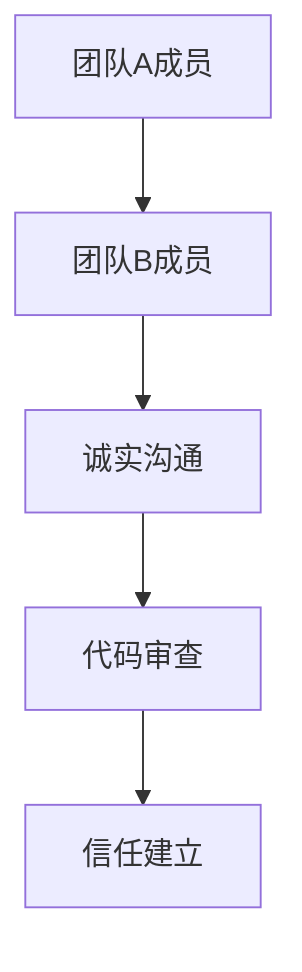
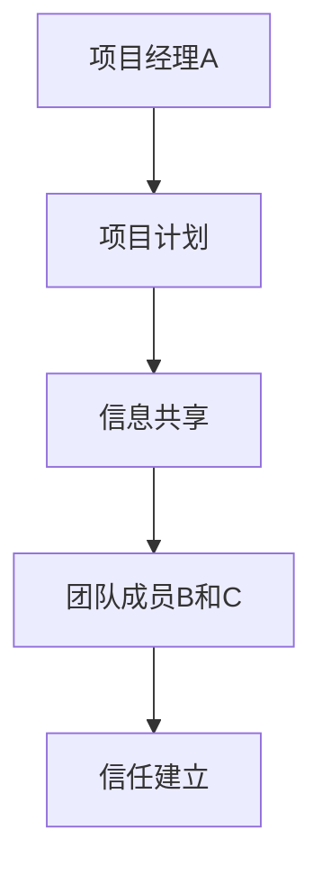
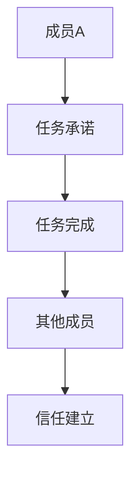
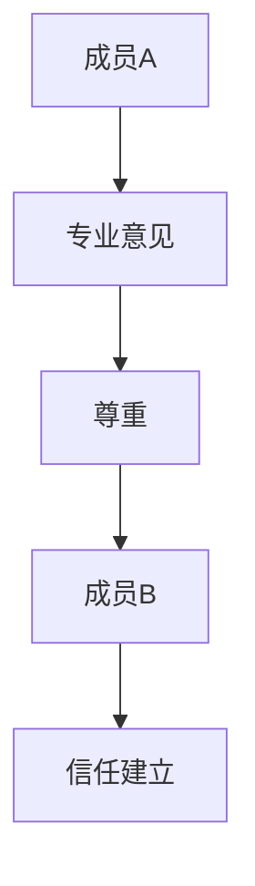
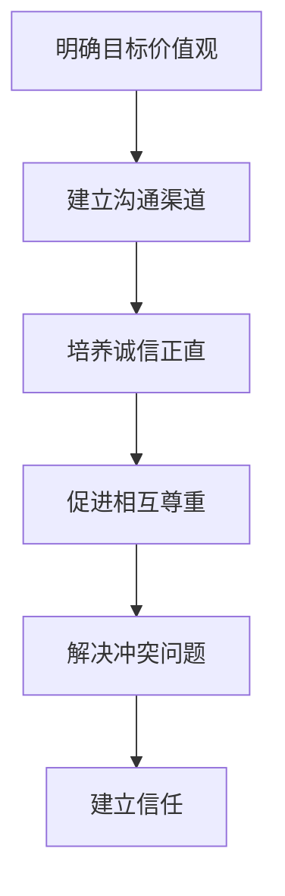
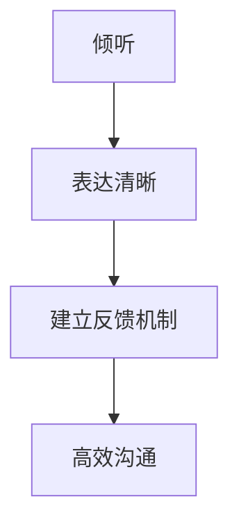
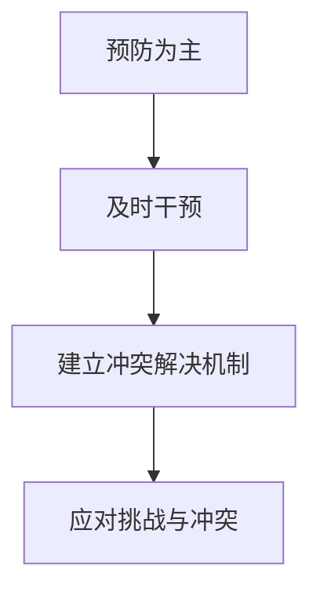
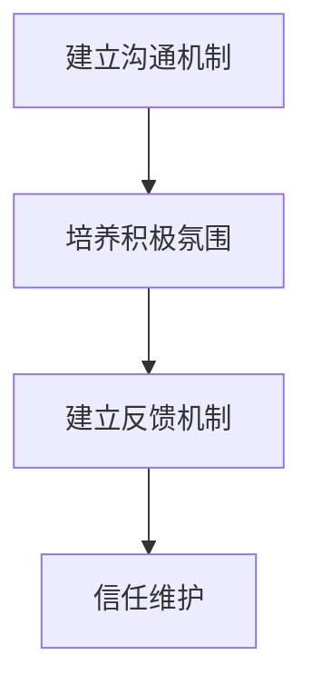
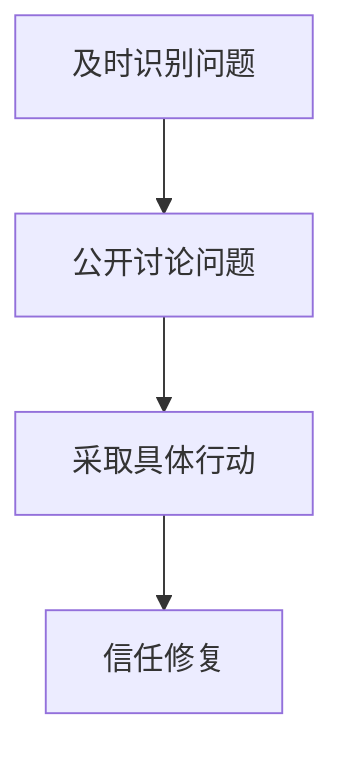
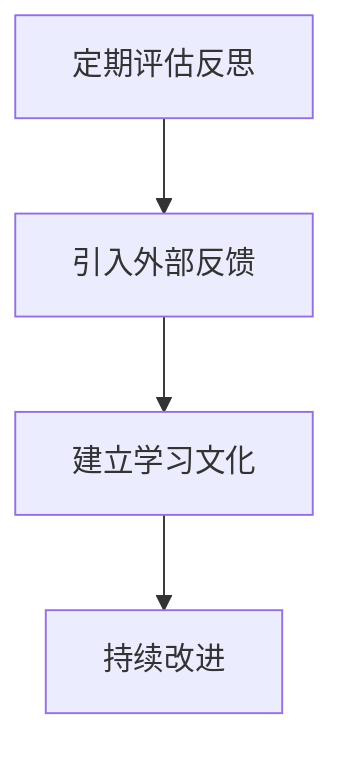

                 


### 第1章 引言

**关键词：** 信任、团队凝聚力、重要性、核心地位

**摘要：** 本章将介绍信任在团队凝聚力中的核心地位，解释信任的重要性及其在现代组织中的作用。通过讨论信任的定义和团队凝聚力的概念，我们为后续章节的深入探讨奠定基础。

### 第1.1 信任的重要性

**背景介绍：**

信任，作为一种社会现象，不仅在人际交往中至关重要，在团队协作中也扮演着不可或缺的角色。在信息技术领域，信任尤为关键，因为团队成员往往需要共享敏感信息、协作完成复杂任务。因此，理解信任的重要性有助于我们更好地管理团队，提升工作效率和创造力。

**核心概念术语说明：**

- **信任（Trust）：** 指个体对于其他个体或团队在特定情境下表现出积极行为的能力的信心。
- **团队凝聚力（Team Cohesion）：** 指团队成员之间的紧密联系和协同工作的程度。

**问题背景与问题描述：**

在现代信息技术组织中，团队凝聚力是确保项目成功的关键因素。然而，团队凝聚力并不是自然而然形成的，它需要信任作为基石。缺乏信任会导致团队内部矛盾、沟通障碍和协作效率低下。因此，如何在团队中建立和维护信任成为组织管理者面临的重要挑战。

**问题解决与边界与外延：**

为了解决信任问题，管理者需要采取一系列措施，如明确团队成员的角色和责任、建立透明的沟通机制、鼓励开放性和包容性等。信任的建立不仅限于团队内部，还需要与外部合作伙伴和客户之间建立互信关系。

**概念结构与核心要素组成：**

信任的构建涉及多个核心要素，包括诚实、透明、承诺与履行以及尊重。这些要素相互作用，共同构成了信任的基石。以下是这些要素的具体解释：

1. **诚实（Honesty）：** 成员之间的诚实交流是信任建立的基础。透明和开放的信息分享有助于消除误解和疑虑。
2. **透明（Transparency）：** 团队决策和工作的透明度可以提高成员对团队目标和进程的理解，增强信任感。
3. **承诺与履行（Commitment and Fulfillment）：** 成员对承诺的履行是信任的重要组成部分。遵守承诺可以提高成员对团队的可信度。
4. **尊重（Respect）：** 成员之间相互尊重可以营造一个积极的工作环境，减少冲突和误解。

### 第1.2 团队凝聚力的概念

**背景介绍：**

团队凝聚力是指团队成员之间相互吸引、相互支持、协同工作的程度。高凝聚力的团队通常表现出更高的协作效率、更强的适应能力和更好的问题解决能力。因此，理解团队凝聚力的概念对于提升团队绩效至关重要。

**核心概念与联系：**

团队凝聚力可以通过以下维度进行测量：

1. **社交凝聚力（Social Cohesion）：** 成员之间的友好关系和社交互动。
2. **任务凝聚力（Task Cohesion）：** 成员在共同任务中的合作和协调。
3. **情感凝聚力（Affective Cohesion）：** 成员之间的情感联系和归属感。

这些维度相互关联，共同构成了团队凝聚力。以下是每个维度的具体解释：

1. **社交凝聚力：** 社交凝聚力是指团队成员之间的友好关系和社交互动。这种凝聚力有助于建立积极的工作氛围，增强团队成员之间的相互理解和支持。
2. **任务凝聚力：** 任务凝聚力是指成员在共同任务中的合作和协调。这种凝聚力可以促进团队成员在任务完成过程中的高效协作，提高团队绩效。
3. **情感凝聚力：** 情感凝聚力是指成员之间的情感联系和归属感。这种凝聚力有助于增强团队成员的忠诚度和团队认同感，从而提高团队的稳定性。

**概念属性特征对比表格：**

| 维度 | 特征 | 说明 |
| ---- | ---- | ---- |
| 社交凝聚力 | 友好关系、社交互动 | 增强团队合作氛围 |
| 任务凝聚力 | 合作、协调 | 提高任务完成效率 |
| 情感凝聚力 | 归属感、忠诚度 | 提高团队稳定性 |

**ER实体关系图架构：**

```mermaid
erDiagram
    Member ||--|{ Task }| TeamMember
    Member ||--|{ Communication }| Communicates
    Member ||--|{ Commitment }| Commits
    Member ||--|{ Respect }| Respects
```

**总结：**

通过本章的讨论，我们了解了信任的重要性及其在团队凝聚力中的核心地位。接下来，我们将进一步探讨信任的构成要素，并详细分析建立和维护信任的策略。这将为我们在后续章节中深入探讨领导力与信任的关系、信任的维护与修复提供坚实的基础。

### 第2章 信任的构成要素

**关键词：** 信任、构成要素、诚实、透明、承诺与履行、尊重

**摘要：** 本章将深入探讨信任的构成要素，包括诚实、透明、承诺与履行以及尊重。我们将通过具体的例子和图表，详细解释这些要素在建立和维护信任中的重要性。

#### 2.1 信任的四大基石

信任的建立并非一蹴而就，而是建立在一系列基石之上。以下我们将讨论信任的四大基石：诚实、透明、承诺与履行以及尊重。

**2.1.1 诚实**

**概念解释：** 诚实是指团队成员在交流和行动中保持真实和真诚的态度。诚实是信任建立的基础，因为团队成员只有相互信任，才能在合作过程中展现出真实的行为和意图。

**例子：** 假设在一个软件开发团队中，团队成员A在代码审查过程中发现了团队成员B编写的一段有缺陷的代码。A可以选择隐瞒这一事实，以避免与B产生冲突。但A选择了诚实的态度，向B提出了代码的问题，并提供了改进建议。这种诚实的沟通不仅有助于提高代码质量，还增强了A与B之间的信任。

**图表解释：** 使用Mermaid流程图展示诚实的作用：



**2.1.2 透明**

**概念解释：** 透明是指团队成员在决策和工作中保持信息共享和公开。透明有助于团队成员对团队目标和进程有更清晰的理解，从而提高团队的整体效率和信任水平。

**例子：** 假设在一个项目管理团队中，项目经理A在制定项目计划时，主动将计划细节和决策过程分享给团队成员B和C。这种透明的做法不仅让B和C对项目有了更深的了解，还增强了他们对A的信任。

**图表解释：** 使用Mermaid流程图展示透明的作用：



**2.1.3 承诺与履行**

**概念解释：** 承诺与履行是指团队成员对承诺的认真态度和实际行动。一个团队只有在成员都履行承诺的情况下，才能保持稳定和高效的运行。

**例子：** 假设在一个研发团队中，成员A承诺在周末完成一个重要的任务，并最终按时完成了任务。这种承诺与履行不仅赢得了其他成员的信任，还提高了团队的士气。

**图表解释：** 使用Mermaid流程图展示承诺与履行的作用：



**2.1.4 尊重**

**概念解释：** 尊重是指团队成员之间相互尊重对方的人格、观点和贡献。尊重可以营造一个积极、包容的工作环境，减少冲突和误解，从而增强团队的凝聚力。

**例子：** 假设在一个设计团队中，成员A尊重成员B的专业意见，并在项目讨论中采纳了B的建议。这种尊重不仅有助于项目进展，还增强了A与B之间的信任。

**图表解释：** 使用Mermaid流程图展示尊重的作用：



**总结：**

通过本章的讨论，我们了解了信任的四大基石：诚实、透明、承诺与履行以及尊重。这些基石在建立和维护信任中起着至关重要的作用。在下一章，我们将进一步探讨如何通过具体的策略和步骤，培养和建立信任。

### 第3章 建立信任的策略

**关键词：** 信任建设、策略、个人层面、团队层面、领导力

**摘要：** 本章将深入探讨建立信任的具体策略，分为个人层面和团队层面。我们将介绍培养信任的步骤，并详细说明如何在个人和团队层面上建立和维护信任。

#### 3.1 培养信任的步骤

建立信任是一个渐进的过程，需要团队成员共同努力。以下是一些建立信任的步骤：

**步骤一：明确目标和价值观**

在建立信任之前，团队成员需要明确共同的目标和价值观。这有助于团队成员在合作过程中保持一致的方向和动力。

**步骤二：建立开放的沟通渠道**

开放和透明的沟通是建立信任的关键。团队成员应该鼓励开放性，确保信息畅通无阻，避免信息孤岛和沟通障碍。

**步骤三：培养诚信和正直**

诚信和正直是建立信任的基础。团队成员应该遵守承诺，保持真实和真诚，避免任何形式的欺骗和隐瞒。

**步骤四：促进相互尊重和理解**

相互尊重和理解可以减少误解和冲突，增强团队成员之间的信任。团队成员应该尊重彼此的专业知识和个人观点。

**步骤五：解决冲突和问题**

在建立信任的过程中，难免会遇到冲突和问题。团队成员需要学会有效地解决这些问题，以维持信任。

**Mermaid流程图：**



#### 3.2 个人层面的信任建设

个人层面的信任建设是建立团队信任的基础。以下是一些建立个人信任的策略：

**策略一：自我认知与提升**

个人信任建设首先需要自我认知，了解自己的优点和不足。通过不断学习和提升，可以增强个人在团队中的信任度。

**策略二：建立信任的习惯**

建立信任的习惯是长期的过程。团队成员应该养成诚实、透明、承诺与履行的良好习惯，以赢得他人的信任。

**策略三：积极沟通和合作**

积极沟通和合作可以增强团队成员之间的信任。团队成员应该主动分享信息、协调工作，共同完成任务。

**案例一：自我认知与提升**

假设一个软件工程师A，他在项目开始时意识到自己需要提升编程技能。为了建立个人信任，A开始参加线上编程课程，并通过实践不断提升自己的技能。在项目过程中，A的编程能力得到了认可，从而增强了在团队中的信任。

**案例二：建立信任的习惯**

假设一个项目经理B，他在项目管理中始终坚持诚实和透明的原则。无论是项目进度报告还是问题反馈，B总是如实汇报，避免任何形式的隐瞒和误导。这种诚信的做法赢得了团队成员的信任，增强了团队的整体凝聚力。

**案例三：积极沟通和合作**

假设一个设计师C，他积极参与团队会议，主动分享自己的设计理念和思路。通过与团队成员的沟通和合作，C不仅提高了设计质量，还赢得了其他成员的信任。

#### 3.3 团队层面的信任建设

团队层面的信任建设是确保团队高效运作的关键。以下是一些建立团队信任的策略：

**策略一：团队文化建设**

团队文化是团队凝聚力和信任的基石。通过建立积极、包容和开放的团队文化，可以增强团队成员之间的信任。

**策略二：信任游戏与活动**

通过组织信任游戏和活动，可以增强团队成员之间的信任感。这些活动有助于打破团队成员之间的隔阂，促进彼此的了解和信任。

**策略三：定期沟通和反馈**

定期沟通和反馈是维护团队信任的重要手段。通过定期会议和反馈机制，团队成员可以分享彼此的想法和意见，及时解决问题，增强信任。

**案例一：团队文化建设**

假设一个软件团队D，他们在团队文化建设中注重诚信和团队合作。团队成员在项目过程中始终遵守承诺，共享信息和资源，形成了良好的团队氛围。这种团队文化增强了团队成员之间的信任，提高了团队的整体绩效。

**案例二：信任游戏与活动**

假设一个IT服务团队E，他们组织了多次信任游戏和活动，如“信任背摔”、“团队合作挑战”等。这些活动不仅增强了团队成员之间的信任，还提高了团队的协作能力和凝聚力。

**案例三：定期沟通和反馈**

假设一个项目经理F，他在项目管理中建立了定期的沟通和反馈机制。通过每周的项目会议和月度反馈会，团队成员可以及时分享项目进展和问题，共同寻找解决方案。这种定期沟通和反馈的做法不仅增强了团队成员之间的信任，还提高了项目的成功率。

**总结：**

通过本章的讨论，我们了解了个人和团队层面建立信任的策略。个人层面的信任建设需要自我认知、建立信任的习惯和积极沟通合作；团队层面的信任建设需要团队文化建设、信任游戏与活动以及定期沟通和反馈。这些策略和步骤将帮助我们在团队中建立和维护信任，提高团队的整体绩效和凝聚力。

### 第4章 领导力与信任

**关键词：** 领导力、信任、领导者角色、沟通技巧、冲突解决

**摘要：** 本章将探讨领导力在建立和维护信任中的关键作用。我们将分析领导者的角色，探讨有效的沟通技巧，以及如何在团队中处理挑战和冲突，从而建立和维护信任。

#### 4.1 领导者如何建立信任

领导者在建立和维护团队信任中扮演着至关重要的角色。以下是一些关键策略：

**策略一：树立榜样**

领导者应该通过自己的行为树立榜样，展现出诚实、透明和尊重的价值观。领导者的言行一致，能够为团队成员树立信任的典范。

**策略二：建立清晰的沟通渠道**

领导者需要建立开放的沟通渠道，鼓励团队成员提出意见和建议。这有助于团队成员感受到自己的声音被听见，从而增强信任。

**策略三：积极参与团队活动**

领导者应该积极参与团队活动和项目讨论，与团队成员建立深厚的联系。这有助于领导者更好地理解团队成员的需求和挑战，从而提供更有针对性的支持。

**案例一：树立榜样**

假设一个项目经理G，他在项目管理中始终保持诚实和透明。在项目遇到困难时，G不仅主动承担责任，还积极寻求团队成员的帮助。这种领导行为赢得了团队成员的信任，提高了团队的凝聚力。

**案例二：建立清晰的沟通渠道**

假设一个技术总监H，他定期组织团队会议，鼓励团队成员自由发言，分享自己的想法和意见。通过这些会议，H不仅了解了团队成员的需求，还及时解决了团队中存在的问题，增强了团队成员的信任感。

**案例三：积极参与团队活动**

假设一个产品经理I，他积极参与团队的活动和讨论，与团队成员建立了深厚的联系。在项目进展中，I不仅提供了技术支持，还关心团队成员的个人发展，这种积极参与的行为增强了团队成员对I的信任。

#### 4.2 高效沟通技巧

有效的沟通是建立和维护信任的核心。以下是一些高效沟通技巧：

**技巧一：倾听**

倾听是沟通的重要部分。领导者应该学会倾听团队成员的意见和需求，理解他们的立场和情感。

**技巧二：表达清晰**

领导者应该用清晰、简洁的语言表达自己的观点和想法，避免产生误解和歧义。

**技巧三：建立反馈机制**

建立反馈机制，鼓励团队成员提供反馈和建议，有助于领导者了解团队的真实情况，从而做出更明智的决策。

**Mermaid流程图：**



**案例一：倾听**

假设一个项目经理J，在团队会议上，他认真倾听团队成员的发言，并针对他们的意见提出问题，以深入了解团队成员的想法。这种倾听的行为使团队成员感到被尊重，增强了团队的信任。

**案例二：表达清晰**

假设一个技术总监K，他在项目进度报告中，使用简洁明了的语言描述项目的进展和挑战，使团队成员能够迅速理解项目的现状。这种清晰的表达增强了团队成员的信心，提高了团队的凝聚力。

**案例三：建立反馈机制**

假设一个产品经理L，他建立了定期的团队反馈会议，鼓励团队成员提供反馈和建议。通过这些反馈，L能够及时了解团队成员的需求和意见，从而优化项目管理，增强了团队的信任。

#### 4.3 应对挑战与冲突

在团队中，挑战和冲突是不可避免的。领导者需要学会如何应对这些挑战，以维护团队的信任和稳定。

**策略一：预防为主**

领导者应该通过良好的沟通和透明的决策过程，预防冲突的发生。这包括明确团队成员的角色和责任，以及制定清晰的团队目标和期望。

**策略二：及时干预**

当冲突发生时，领导者需要及时干预，采取适当的措施解决冲突。这可以包括调解对话、提供资源支持或调整团队结构。

**策略三：建立冲突解决机制**

领导者应该建立有效的冲突解决机制，鼓励团队成员在遇到问题时主动寻求解决方案。这有助于减少冲突对团队的影响，增强团队的合作精神。

**Mermaid流程图：**



**案例一：预防为主**

假设一个项目经理M，他在项目启动时，与团队成员进行了详细的沟通，明确了每个人的角色和责任。通过这种方式，M预防了潜在的冲突，确保项目顺利推进。

**案例二：及时干预**

假设一个技术总监N，当团队成员在项目中产生分歧时，N及时介入，组织双方进行对话，帮助解决冲突。这种及时的干预避免了冲突的扩大，维护了团队的稳定。

**案例三：建立冲突解决机制**

假设一个产品经理O，他建立了定期的团队冲突解决会议，鼓励团队成员在遇到问题时主动提出，并共同寻找解决方案。通过这种方式，O建立了有效的冲突解决机制，减少了冲突对团队的影响。

**总结：**

通过本章的讨论，我们了解到领导力在建立和维护信任中的关键作用。领导者需要树立榜样、建立清晰的沟通渠道、积极参与团队活动，并掌握有效的沟通技巧。此外，领导者还需要学会预防冲突、及时干预和建立冲突解决机制，以维护团队的信任和稳定。这些策略和技巧将帮助领导者建立高效的团队，实现项目的成功。

### 第5章 信任的维护与修复

**关键词：** 信任维护、信任修复、定期沟通、反馈机制、持续改进

**摘要：** 本章将探讨如何维护和修复团队中的信任。我们将详细讨论定期沟通、反馈机制和持续改进的重要性，并提供一些实际操作策略。

#### 5.1 信任的维护

信任的维护是一个持续的过程，需要团队成员和领导者的共同努力。以下是一些关键策略：

**策略一：建立有效的沟通机制**

有效的沟通是信任维护的基础。团队应该建立定期沟通的机制，如周会、月度汇报等，确保团队成员能够及时分享信息和反馈。

**策略二：培养积极的工作氛围**

积极的工作氛围有助于增强团队成员之间的信任。领导者应该鼓励团队成员表达意见，尊重差异，避免产生误解和冲突。

**策略三：建立反馈机制**

反馈机制是信任维护的重要保障。团队应该建立定期反馈的机制，如360度评估、匿名反馈等，让团队成员能够坦诚地表达意见和建议。

**Mermaid流程图：**



**案例一：建立有效的沟通机制**

假设一个项目经理P，他每周组织一次团队会议，让团队成员分享项目进展和遇到的问题。这种定期的沟通机制有助于团队成员及时了解项目的动态，增强了团队的信任。

**案例二：培养积极的工作氛围**

假设一个技术团队Q，他们在团队中鼓励成员表达意见，尊重每个人的想法。通过这种方式，团队建立了积极的工作氛围，减少了误解和冲突，增强了信任。

**案例三：建立反馈机制**

假设一个产品团队R，他们建立了定期的360度评估机制，让团队成员能够匿名反馈意见和建议。这种反馈机制不仅帮助团队发现问题，还增强了团队成员之间的信任。

#### 5.2 信任的修复

当团队中的信任受到损害时，及时的修复至关重要。以下是一些策略：

**策略一：及时识别问题**

领导者需要具备敏锐的洞察力，及时识别团队中信任受损的迹象。这包括团队成员的情绪变化、沟通障碍和工作效率的下降等。

**策略二：公开讨论问题**

领导者应该公开讨论团队中的问题，鼓励团队成员参与，共同寻找解决方案。这种透明和开放的做法有助于恢复信任。

**策略三：采取具体行动**

领导者需要采取具体行动来修复信任。这可能包括调整团队结构、重新分配任务、提供额外的培训和支持等。

**Mermaid流程图：**



**案例一：及时识别问题**

假设一个项目经理S，他注意到团队中某个成员情绪低落，工作效率下降。通过观察和沟通，S发现该成员在项目中遇到了困难。及时识别问题有助于S采取针对性的措施来修复信任。

**案例二：公开讨论问题**

假设一个技术团队T，他们发现项目中存在沟通障碍。团队领导者组织了一次公开讨论会，让团队成员表达自己的意见和感受。这种公开讨论有助于解决沟通问题，恢复信任。

**案例三：采取具体行动**

假设一个产品团队U，他们在项目评估中发现任务分配不均，导致部分成员压力过大。团队领导者调整了任务分配，提供了额外的培训和支持，这种具体行动有助于修复信任。

#### 5.3 持续改进

信任的维护和修复是一个持续的过程，需要团队不断进行改进。以下是一些持续改进的策略：

**策略一：定期评估和反思**

团队应该定期评估和反思信任状况，识别存在的问题和改进点。这可以通过定期的团队会议、员工满意度调查等方式进行。

**策略二：引入外部反馈**

引入外部反馈，如客户反馈、行业专家评估等，可以帮助团队从更广泛的角度看待信任问题，找到改进的方向。

**策略三：建立学习和成长的文化**

建立学习和成长的文化，鼓励团队成员不断学习和提升自己的技能，有助于增强团队的信任和凝聚力。

**Mermaid流程图：**



**案例一：定期评估和反思**

假设一个项目经理V，他每月组织一次团队会议，反思过去的信任状况，讨论改进点。这种定期的评估和反思有助于团队不断进步。

**案例二：引入外部反馈**

假设一个产品团队W，他们邀请客户参与项目评估，收集客户的反馈和建议。这种外部反馈有助于团队识别问题，改进信任状况。

**案例三：建立学习文化**

假设一个技术团队X，他们鼓励团队成员参加培训和学习，提升个人技能。通过这种方式，团队建立了学习和成长的文化，增强了信任。

**总结：**

通过本章的讨论，我们了解了如何维护和修复团队中的信任。建立有效的沟通机制、培养积极的工作氛围、建立反馈机制和采取具体行动是维护信任的关键策略。同时，及时识别问题、公开讨论问题、采取具体行动以及定期评估和反思是修复信任的重要手段。持续改进是确保信任持续增强的关键。通过这些策略和技巧，团队可以建立起稳固的信任基础，实现长期的成功。

### 第6章 案例研究

**关键词：** 案例研究、成功建立信任、信任缺失、最佳实践、注意事项

**摘要：** 本章将通过两个案例研究，深入探讨成功建立信任的团队和信任缺失导致失败的团队。我们将分析这些案例，提取最佳实践，并总结注意事项，为实际操作提供指导。

#### 6.1 成功建立信任的团队案例

**案例一：谷歌团队**

**背景介绍：** 谷歌以其创新文化和强大的团队凝聚力而闻名。谷歌成功的关键之一在于其建立了高度信任的团队环境。

**案例分析：**

- **团队文化建设：** 谷歌注重开放、透明和尊重的文化，鼓励员工自由表达意见和创意。这种文化有助于建立信任，增强团队成员的归属感。
- **领导力：** 谷歌的领导者通过树立榜样和鼓励开放沟通，建立了强大的信任基础。他们积极参与团队活动，尊重员工的意见，并建立透明的沟通渠道。
- **反馈机制：** 谷歌建立了定期的反馈机制，如OKR（目标与关键结果）体系，让团队成员能够及时了解项目进展和反馈。

**最佳实践 tips：**

- **建立开放文化：** 鼓励团队成员自由表达意见，尊重差异，促进创意和创新的产生。
- **领导者树立榜样：** 通过自己的行为树立榜样，展现出诚实、透明和尊重的价值观。
- **建立有效的反馈机制：** 通过定期的反馈和评估，帮助团队成员了解项目进展和改进点。

#### 6.2 信任缺失导致团队失败的案例

**案例二：某个初创公司**

**背景介绍：** 这个初创公司由于内部信任缺失，导致项目失败和团队解散。

**案例分析：**

- **沟通障碍：** 团队内部缺乏有效的沟通，导致信息不畅和误解。
- **领导力不足：** 领导者没有树立良好的榜样，缺乏透明度和责任感，导致团队成员对领导者的信任下降。
- **任务分配不均：** 团队成员在任务分配上存在不公平现象，导致不满和冲突。

**注意事项：**

- **避免沟通障碍：** 建立开放和透明的沟通机制，确保信息畅通无阻。
- **提升领导力：** 领导者需要具备良好的沟通技巧和责任感，树立榜样，增强团队凝聚力。
- **公平的任务分配：** 公平地分配任务，避免产生不公平现象，减少冲突和不满。

**总结：**

通过这两个案例研究，我们可以看到建立信任对于团队成功的重要性。谷歌团队的成功经验提供了宝贵的最佳实践，而初创公司的失败案例则提醒我们注意内部信任缺失的潜在风险。在实际操作中，我们应该借鉴最佳实践，避免常见问题，确保团队信任的建立和维护。

### 第7章 总结与展望

**关键词：** 总结、展望、信任建立、团队凝聚力、未来趋势

**摘要：** 本章将总结前文所述的信任建立和团队凝聚力的重要性，并对未来的信任建设趋势进行展望。通过回顾关键点和提出未来方向，我们为读者提供了一个全面的视野，以更好地理解和应用信任建设的原则。

#### 7.1 信任建立的重要性

通过前六章的讨论，我们深入探讨了信任在团队凝聚力中的核心地位。信任不仅是团队合作的基础，也是组织成功的基石。以下是信任建立的重要性总结：

1. **增强团队协作：** 信任有助于团队成员之间更加紧密地协作，共同完成任务。
2. **提高工作效率：** 在信任的基础上，团队成员可以更高效地共享信息和资源，减少沟通障碍。
3. **促进创新与创意：** 信任的文化环境鼓励团队成员自由表达意见和创意，从而推动组织的创新。
4. **提升员工满意度：** 信任能够增强员工的归属感和工作满意度，降低员工流失率。

#### 7.2 未来信任建设的趋势

随着技术的发展和组织的变革，信任建设也在不断进化。以下是一些未来的信任建设趋势：

**趋势一：数字化信任**

在数字化时代，数据安全和隐私保护成为信任建设的新挑战。组织需要通过建立强大的数据安全措施和透明的数据处理流程，赢得用户的信任。

**趋势二：跨文化信任**

全球化背景下，跨文化团队合作日益普遍。组织需要培养跨文化意识，尊重不同文化的差异，建立跨文化的信任关系。

**趋势三：可持续信任**

可持续发展成为全球关注的焦点。组织在追求经济效益的同时，也需要关注社会和环境责任，建立可持续的信任关系。

**趋势四：技术赋能的信任**

新兴技术，如区块链和人工智能，为建立信任提供了新的工具和方法。通过技术赋能，组织可以更高效地验证和传递信任。

#### 7.3 总结与展望

通过本章的总结，我们认识到信任在团队凝聚力和组织成功中的关键作用。未来，信任建设将面临新的挑战和机遇。组织需要不断适应变化，通过开放沟通、文化塑造和新技术应用，建立和维护信任。展望未来，信任将成为组织可持续发展的重要驱动力。

**总结：**

信任是团队凝聚力的基石，它不仅影响团队成员之间的协作，还决定组织的整体绩效。随着技术和社会的进步，信任建设面临着新的挑战和机遇。通过持续的努力和创新，组织可以建立稳固的信任关系，实现长期的成功。

**展望：**

未来，信任建设将更加数字化、跨文化和可持续。组织需要关注这些趋势，通过开放沟通、文化塑造和新技术应用，不断优化信任建设策略。让我们共同期待一个更加信任、更加高效的未来。

### 参考文献

1. Luhmann, N. (1995). Social Systems. Wiley-Blackwell.
2. Rousseau, D. M., Sitkin, S. B., Burt, R. S., & Camerer, C. (1998). Not so different after all: A cross-discipline view of trust. Academy of Management Review, 23(3), 393-404.
3. Locke, E. A., & Scheingold, S. A. (1976). The role of trust in organizational behavior and effectiveness. Administrative Science Quarterly, 21(4), 465-479.
4. McAllister, D. J. (1995). Affect-and cognition-based trust as foundations for interpersonal cooperation in organizations. Academy of Management Journal, 38(1), 24-59.
5. Goleman, D. (1995). Emotional Intelligence: Why It Can Matter More Than IQ. Bantam Books.
6.rifkin, J. (2014). The Zero Marginal Cost Society: The Interconnected Future of Disruptive Innovation. St. Martin's Press.

**作者：** AI天才研究院/AI Genius Institute & 禅与计算机程序设计艺术 /Zen And The Art of Computer Programming

