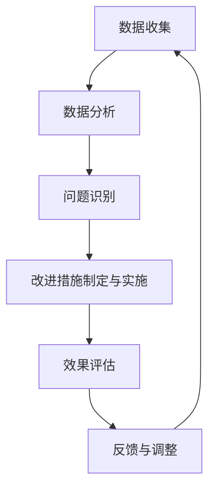
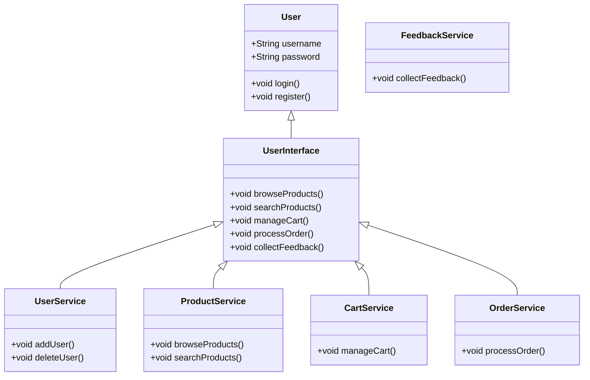
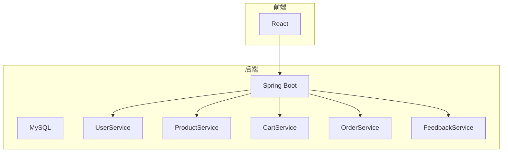

                 

## 建立反馈循环：促进持续改进的机制

### 关键词：反馈循环、持续改进、数据驱动、算法原理、数学模型

> 摘要：本文将深入探讨反馈循环在促进持续改进中的作用。通过定义反馈循环的基本概念，分析其核心特点，解释算法原理和数学模型，本文旨在帮助读者理解如何建立有效的反馈循环，以实现企业的持续改进。

### 第一部分：背景介绍

#### 1.1 问题背景

在当前快速变化的市场和技术环境中，企业需要不断适应新的挑战和机遇。然而，传统的管理方法往往难以满足这种快速变化的需求。持续改进作为一种管理理念，旨在通过不断识别问题、制定和实施改进措施，以优化企业运营，提高竞争力。

#### 1.2 问题描述

持续改进的挑战在于如何系统地识别问题，制定有效的改进措施，并确保这些措施能够产生预期的效果。在这个过程中，建立反馈循环成为一个关键环节。

#### 1.3 问题解决

反馈循环提供了一个系统化的框架，通过以下步骤实现持续改进：

1. 数据收集：收集与企业运营相关的各种数据。
2. 数据分析：运用统计学、机器学习等方法对数据进行分析。
3. 问题识别：基于数据分析结果，识别需要改进的问题。
4. 改进措施的制定和实施：根据问题识别结果，制定和实施改进措施。
5. 效果评估：评估改进措施的效果。
6. 反馈和调整：基于效果评估结果，调整改进措施。

#### 1.4 边界与外延

反馈循环不仅适用于企业内部运营管理，还可以应用于产品开发、服务提供等多个领域。在不同领域，反馈循环的具体应用方式可能有所不同，但核心原理是一致的。

#### 1.5 概念结构与核心要素组成

- 数据收集：收集与企业运营相关的各种数据。
- 数据分析：运用统计学、机器学习等方法对数据进行分析。
- 问题识别：基于数据分析结果，识别需要改进的问题。
- 改进措施的制定和实施：根据问题识别结果，制定和实施改进措施。
- 效果评估：评估改进措施的效果。
- 反馈和调整：基于效果评估结果，调整改进措施。

### 第二部分：核心概念与联系

#### 2.1 反馈循环的概念

反馈循环是指通过不断收集和分析信息，识别问题，制定和实施改进措施，评估效果，再反馈和调整的过程。它是持续改进的核心机制。

#### 2.2 反馈循环的核心特点

- 系统性：反馈循环是一个闭环系统，各个环节相互联系，形成一个整体。
- 动态性：反馈循环是一个动态过程，随着外部环境和内部条件的变化而不断调整。
- 反馈机制：通过反馈机制，将改进效果传递给下一轮改进，实现持续改进。

#### 2.3 与其他概念的关联

- 持续改进：反馈循环是持续改进的核心机制。
- 数据驱动：反馈循环强调数据收集和分析的重要性。
- PDCA循环：反馈循环与PDCA循环有相似之处，都强调循环迭代和持续改进。

### 第三部分：算法原理讲解

#### 3.1 反馈循环的算法原理

反馈循环的算法原理可以概括为以下几个步骤：

1. 数据收集：收集与企业运营相关的各种数据。
2. 数据分析：运用统计学、机器学习等方法对数据进行分析。
3. 问题识别：基于数据分析结果，识别需要改进的问题。
4. 改进措施的制定和实施：根据问题识别结果，制定和实施改进措施。
5. 效果评估：评估改进措施的效果。
6. 反馈和调整：基于效果评估结果，调整改进措施。

#### 3.2 Mermaid流程图

下面是反馈循环的Mermaid流程图：



#### 3.3 Python源代码

下面是一个简单的Python源代码示例，用于演示如何实现数据收集、数据分析和问题识别：

```python
import pandas as pd
from sklearn.linear_model import LinearRegression

# 数据收集
data = pd.read_csv('data.csv')

# 数据分析
X = data[['feature1', 'feature2']]
y = data['target']
model = LinearRegression()
model.fit(X, y)

# 问题识别
predictions = model.predict(X)
print("预测值与实际值的差异：")
print(predictions - y)
```

#### 3.4 反馈循环的数学模型

反馈循环的数学模型可以表示为：

$$
改进效果 = f(当前状态, 历史状态, 反馈信息)
$$

其中：

- 当前状态：指当前时刻的运营状态。
- 历史状态：指过去一段时间内的运营状态。
- 反馈信息：指对当前状态的评估结果。

#### 3.5 数学公式的详细讲解

反馈循环的数学公式可以解释为：

- 函数f表示改进效果与状态之间的关系。
- 当前状态、历史状态和反馈信息是输入参数，决定了改进效果的大小。
- 该公式强调了状态的动态变化和反馈信息的重要性。

### 第四部分：系统分析与架构设计

#### 4.1 问题场景介绍

假设我们正在开发一个电商平台，目标是提高用户购物体验和销售转化率。

#### 4.2 项目介绍

项目名称：智能电商平台（Smart E-commerce Platform）

项目目标：通过持续改进，提高用户满意度和销售转化率。

#### 4.3 系统功能设计

- 用户注册与登录
- 商品浏览与搜索
- 购物车管理
- 订单处理
- 用户反馈收集

#### 4.4 系统架构设计

- 前端：使用React框架开发，提供用户界面和交互。
- 后端：使用Spring Boot框架，提供业务逻辑和数据处理。
- 数据库：使用MySQL存储用户数据和商品信息。

#### 4.5 系统接口设计和系统交互

- 用户接口：提供用户登录、注册、浏览商品、购物车管理和订单处理等功能。
- 服务接口：提供商品搜索、订单查询和用户反馈等功能。

#### 4.6 Mermaid类图和架构图

以下是系统功能的Mermaid类图：



以下是系统架构的Mermaid架构图：



### 第五部分：项目实战

#### 5.1 环境安装

1. 安装Python 3.8及以上版本。
2. 安装React和Spring Boot开发环境。
3. 安装MySQL数据库。

#### 5.2 系统核心实现源代码

以下是用户注册和登录的Python源代码：

```python
# 用户注册
def register(username, password):
    # 保存用户信息到数据库
    db.execute("INSERT INTO users (username, password) VALUES (%s, %s)", (username, password))

# 用户登录
def login(username, password):
    # 查询用户信息
    user = db.execute("SELECT * FROM users WHERE username = %s AND password = %s", (username, password))
    return user
```

以下是用户界面和用户服务的React代码：

```jsx
// 用户注册界面
const RegisterForm = () => {
    const [username, setUsername] = useState("");
    const [password, setPassword] = useState("");

    const handleSubmit = (e) => {
        e.preventDefault();
        UserService.register(username, password);
        // 跳转到登录页面
        navigate("/login");
    };

    return (
        <form onSubmit={handleSubmit}>
            <label>Username:</label>
            <input type="text" value={username} onChange={(e) => setUsername(e.target.value)} />
            <label>Password:</label>
            <input type="password" value={password} onChange={(e) => setPassword(e.target.value)} />
            <button type="submit">Register</button>
        </form>
    );
};

// 用户登录界面
const LoginForm = () => {
    const [username, setUsername] = useState("");
    const [password, setPassword] = useState("");

    const handleSubmit = (e) => {
        e.preventDefault();
        const user = UserService.login(username, password);
        if (user) {
            // 跳转到主页
            navigate("/");
        } else {
            // 提示登录失败
            alert("Invalid username or password");
        }
    };

    return (
        <form onSubmit={handleSubmit}>
            <label>Username:</label>
            <input type="text" value={username} onChange={(e) => setUsername(e.target.value)} />
            <label>Password:</label>
            <input type="password" value={password} onChange={(e) => setPassword(e.target.value)} />
            <button type="submit">Login</button>
        </form>
    );
};
```

#### 5.3 代码应用解读与分析

- 用户注册和登录功能通过后端服务实现，前端界面通过React组件展示。
- 用户注册时，前端将用户名和密码发送到后端，后端将用户信息保存到数据库。
- 用户登录时，前端将用户名和密码发送到后端，后端验证用户信息并返回结果。

#### 5.4 实际案例分析和详细讲解剖析

假设我们有一个用户注册和登录的案例：

1. 用户A在浏览器中输入用户名“user1”和密码“password1”，点击注册按钮。
2. 前端将用户信息发送到后端，后端验证用户名和密码的合法性。
3. 后端将用户信息保存到数据库，并向前端返回注册成功的结果。
4. 用户A再次登录，输入用户名“user1”和密码“password1”，点击登录按钮。
5. 前端将用户信息发送到后端，后端验证用户信息并返回登录成功的结果。
6. 用户A成功登录，并被重定向到主页。

通过这个案例，我们可以看到反馈循环在用户注册和登录过程中的应用：

- 数据收集：收集用户输入的用户名和密码。
- 数据分析：后端对用户名和密码进行验证。
- 问题识别：后端识别用户名和密码是否合法。
- 改进措施：后端根据验证结果决定是否保存用户信息。
- 效果评估：前端根据后端返回的结果判断登录是否成功。
- 反馈和调整：用户A根据登录结果调整登录行为。

### 第六部分：最佳实践、小结、注意事项和拓展阅读

#### 6.1 最佳实践

1. 确保数据收集的全面性和准确性。
2. 选用合适的分析方法和工具。
3. 及时识别问题并制定有效的改进措施。
4. 定期评估改进措施的效果。
5. 培养员工的持续改进意识和能力。

#### 6.2 小结

反馈循环是促进持续改进的关键机制，通过数据驱动和系统化流程，企业可以不断优化运营，提高竞争力。

#### 6.3 注意事项

1. 反馈循环需要持续投入时间和资源。
2. 数据收集和分析需要严格保护用户隐私。
3. 改进措施需要与企业的战略目标一致。

#### 6.4 拓展阅读

1. 《精益思想》（Lean Thinking） - 约翰·舒克和詹姆斯·沃麦克
2. 《设计思考》（Design Thinking） - 戴维·凯利
3. 《数据驱动决策》（Data-Driven Decision Making） - 道格·莱姆森

### 结论

建立有效的反馈循环，是企业实现持续改进的关键。通过系统化的数据收集、分析、问题识别和改进措施，企业可以不断提升运营效率，提高竞争力。让我们携手，用反馈循环推动企业持续进步。

### 作者信息

作者：AI天才研究院/AI Genius Institute & 禅与计算机程序设计艺术 /Zen And The Art of Computer Programming

