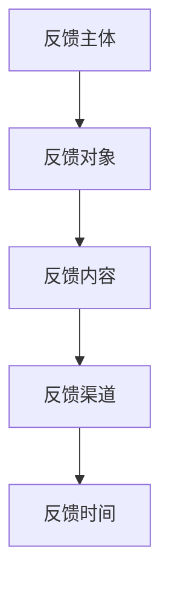
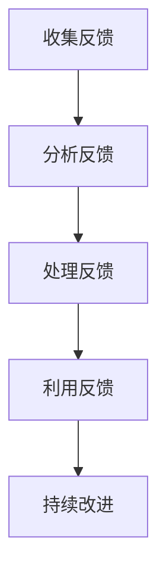

                 

### 目录

1. 引言
   - 反馈文化的背景
   - 反馈文化的重要性
   - 书籍概述与结构

2. 反馈文化的核心概念
   - 反馈的概念
   - 反馈的类型
   - 反馈的要素
   - 反馈的机制

3. 建立反馈文化的步骤
   - 制定反馈策略
   - 确立反馈目标
   - 设定反馈流程
   - 建立反馈系统

4. 反馈文化的实践方法
   - 反馈收集的方法
   - 反馈分析的方法
   - 反馈应用的方法
   - 反馈优化的方法

5. 反馈文化在不同领域的应用
   - 企业中的反馈文化
   - 教育中的反馈文化
   - 医疗服务中的反馈文化
   - 政府管理中的反馈文化

6. 反馈文化的挑战与解决方案
   - 反馈文化面临的挑战
   - 面对挑战的解决方案
   - 成功案例分析

7. 反馈文化的未来趋势
   - 反馈文化的未来发展方向
   - 技术对反馈文化的影响
   - 反馈文化在持续改进中的角色
   - 反馈文化的可持续发展

8. 结论
   - 反馈文化的重要性总结
   - 反馈文化的实践建议
   - 反馈文化的未来展望

---

### 引言

**建立反馈文化：促进持续改进的方法**

关键词：反馈文化、持续改进、反馈机制、反馈策略

摘要：本文旨在深入探讨建立反馈文化的必要性和重要性，并提供一系列行之有效的策略和方法。通过理解反馈文化的核心概念，读者将能够有效地制定和实施反馈机制，从而推动持续改进。本文还将分析反馈文化在不同领域的应用，探讨其面临的挑战与解决方案，并展望反馈文化的未来趋势。

#### 反馈文化的背景

在当今快速变化和竞争激烈的商业环境中，持续改进已经成为企业成功的关键因素。而反馈文化作为持续改进的核心，能够帮助企业不断优化产品和服务，提高客户满意度，增强市场竞争力。因此，建立反馈文化不仅是企业内部管理的需要，更是应对外部环境变化的必然选择。

#### 反馈文化的重要性

反馈文化不仅能够提高员工的工作效率，还能够促进创新和协作。通过有效的反馈机制，企业可以及时发现问题、纠正偏差，从而在激烈的市场竞争中立于不败之地。此外，反馈文化还能够提高员工的参与感和归属感，增强团队的凝聚力和向心力。

#### 书籍概述与结构

本文将从反馈文化的核心概念出发，逐步介绍建立反馈文化的步骤、实践方法、应用领域以及未来趋势。通过系统化的分析和实际案例的剖析，本文旨在为读者提供一套实用的反馈文化建立与实施指南。

---

接下来，我们将深入探讨反馈文化的核心概念，包括反馈的定义、类型、要素和机制，为后续章节的内容打下坚实的基础。

## 第1章 引言

### 1.1 反馈文化的背景

反馈文化是一种重视信息反馈和持续改进的工作方式，它强调在组织内部建立一种积极的沟通氛围，让员工能够自由地表达意见和建议，从而促进组织的发展。在信息技术高度发达的今天，反馈文化已成为许多企业成功的关键因素之一。

#### 问题背景

随着市场竞争的加剧，企业需要不断调整战略，提高产品和服务质量，以满足客户不断变化的需求。然而，传统的管理模式往往过于注重任务完成，忽视了员工的反馈和意见，导致企业无法及时发现问题并进行改进。

#### 问题描述

在这种背景下，企业面临着以下问题：

1. **沟通不畅**：员工之间的信息交流和反馈机制不完善，导致问题无法及时被发现和解决。
2. **创新能力不足**：缺乏对员工创新思维的重视，导致企业在技术创新和产品研发上进展缓慢。
3. **员工满意度低**：员工缺乏参与感和归属感，导致工作积极性不高，影响整体绩效。

#### 问题解决

为了解决这些问题，企业需要建立一种反馈文化，通过以下方式实现：

1. **建立有效的沟通渠道**：确保员工之间的信息交流畅通，鼓励员工提出意见和建议。
2. **重视员工反馈**：对员工反馈给予高度重视，及时采纳并实施改进措施。
3. **激励机制**：设立奖励机制，激励员工积极参与反馈和改进活动。

#### 边界与外延

反馈文化不仅局限于企业内部，还延伸到企业与客户、供应商等外部利益相关者之间的互动。通过建立全面的反馈机制，企业能够更好地理解客户需求，提高服务质量，增强市场竞争力。

### 1.2 反馈文化的重要性

#### 核心概念术语说明

- **反馈文化**：一种重视信息反馈和持续改进的工作方式，强调在组织内部建立积极的沟通氛围。
- **反馈机制**：一套系统化的流程和工具，用于收集、分析、处理和利用反馈信息。
- **持续改进**：通过不断反馈和优化，提高产品和服务质量，提升组织竞争力。

#### 概念结构与核心要素组成

反馈文化的核心概念包括以下几个方面：

1. **沟通机制**：确保信息流畅传递，使员工能够自由表达意见和建议。
2. **反馈机制**：一套系统化的流程和工具，用于收集、分析、处理和利用反馈信息。
3. **激励机制**：通过奖励和认可，激励员工积极参与反馈和改进活动。
4. **文化氛围**：营造一个开放、包容、尊重员工的氛围，使员工敢于提出意见和建议。

#### 核心概念原理

反馈文化的核心原理在于通过信息反馈，及时发现和解决问题，推动组织不断改进和发展。其关键在于：

1. **信息透明**：确保所有员工都能获得所需信息，以便做出明智的决策。
2. **快速响应**：对反馈信息及时处理，确保问题得到及时解决。
3. **全员参与**：鼓励所有员工参与反馈和改进活动，发挥集体智慧。

#### 概念属性特征对比表格

| 特征        | 反馈文化       | 传统管理模式        |
|-------------|----------------|--------------------|
| 重视反馈    | 是             | 否                  |
| 沟通机制    | 系统化         | 零散                |
| 激励机制    | 有             | 无                  |
| 文化氛围    | 开放、包容      | 严格、压抑          |
| 目标        | 持续改进       | 任务完成            |

#### ER实体关系图架构

```mermaid
erDiagram
  Customer ||--|{ Organization }|>>
  Employee ||--|{ Organization }|>>
  Product ||--|{ Organization }|>>
  Customer }|--|{ Feedback }|>>
  Employee }|--|{ Feedback }|>>
  Product }|--|{ Feedback }|>>
```

### 1.3 书籍概述与结构

本文旨在为读者提供一套完整的建立反馈文化的指南，包括核心概念、实施步骤、实践方法、应用领域和未来趋势等内容。具体结构如下：

1. **第1章 引言**：介绍反馈文化的背景和重要性，概述书籍结构。
2. **第2章 反馈文化的核心概念**：详细阐述反馈文化的定义、类型、要素和机制。
3. **第3章 建立反馈文化的步骤**：介绍建立反馈文化的具体步骤和方法。
4. **第4章 反馈文化的实践方法**：探讨反馈文化的实际应用和实施策略。
5. **第5章 反馈文化在不同领域的应用**：分析反馈文化在不同领域的应用案例。
6. **第6章 反馈文化的挑战与解决方案**：探讨反馈文化面临的挑战和解决方案。
7. **第7章 反馈文化的未来趋势**：展望反馈文化的未来发展趋势。
8. **第8章 结论**：总结反馈文化的重要性，提出实践建议和未来展望。

通过本文的阅读，读者将能够全面了解反馈文化，掌握建立和实施反馈文化的具体方法，从而推动组织的持续改进和发展。

## 第2章 反馈文化的核心概念

### 2.1 反馈的概念

#### 核心概念原理

反馈是指通过信息传递，对某个系统、过程或行为进行评价、分析、改进的过程。在反馈文化中，反馈是一个关键环节，它能够帮助组织或个体了解自身的工作表现，发现问题和不足，从而进行针对性的改进。

#### 概念属性特征

- **评价性**：反馈是对工作或行为的评价，可以是积极的，也可以是消极的。
- **双向性**：反馈不仅包括上级对下级的评价，也包括下级对上级的评价，以及同事之间的相互评价。
- **及时性**：及时的反馈能够更快地发现问题，有利于及时纠正偏差。
- **透明性**：透明的反馈机制能够确保信息畅通，使所有相关人员都能了解到反馈内容。

#### 概念比较表格

| 特征        | 反馈        | 评价        | 监督        |
|-------------|-------------|-------------|-------------|
| 目的        | 改进工作    | 判断工作    | 确保合规    |
| 双向性      | 是          | 否          | 否          |
| 及时性      | 是          | 否          | 是          |
| 透明性      | 是          | 否          | 是          |

### 2.2 反馈的类型

#### 反馈的类型包括以下几种：

1. **正面反馈**：对工作或行为表示认可和鼓励，有助于增强员工的积极性和信心。
2. **负面反馈**：对工作或行为提出批评和建议，目的是帮助员工改进和提高。
3. **建设性反馈**：在负面反馈的基础上，提出具体的改进建议，帮助员工找到解决问题的方法。
4. **破坏性反馈**：缺乏建设性，可能对员工造成负面影响，甚至破坏团队氛围。

#### 类型比较表格

| 类型        | 特征                 | 目的                 | 影响效果           |
|-------------|----------------------|----------------------|--------------------|
| 正面反馈    | 表扬、鼓励           | 增强积极性           | 增强信心和动力     |
| 负面反馈    | 批评、指出问题       | 提高意识             | 可能引起抵触情绪   |
| 建设性反馈  | 提出改进建议         | 帮助改进             | 提高工作质量       |
| 破坏性反馈  | 消极评价、攻击性语言 | 可能导致团队分裂     | 损害团队氛围       |

### 2.3 反馈的要素

#### 反馈的要素包括以下几个方面：

1. **反馈主体**：提供反馈的个人或组织，通常是管理者、同事或客户。
2. **反馈对象**：接收反馈的个人或组织，通常是员工、团队或项目。
3. **反馈内容**：具体的工作表现、行为或结果，以及评价和建议。
4. **反馈渠道**：反馈传递的途径，如会议、邮件、书面报告等。
5. **反馈时间**：反馈发生的时机，及时反馈有助于问题及时解决。

#### 要素关系图



### 2.4 反馈的机制

#### 反馈机制是指一套系统化的流程和工具，用于收集、分析、处理和利用反馈信息。反馈机制的核心要素包括：

1. **反馈系统**：用于收集和存储反馈信息的平台或工具。
2. **反馈流程**：规范反馈收集、分析和处理的流程。
3. **反馈分析**：对收集到的反馈信息进行分类、分析和总结。
4. **反馈应用**：将分析结果应用于工作改进和决策制定。

#### 反馈机制的运作原理

1. **收集反馈**：通过调查问卷、会议、访谈等方式收集反馈信息。
2. **分析反馈**：对收集到的反馈信息进行分类、归纳和分析，识别问题和机会。
3. **处理反馈**：根据分析结果制定改进计划，并跟踪改进效果。
4. **利用反馈**：将改进措施纳入日常工作，持续优化产品和服务。

#### 反馈机制的流程图



#### 反馈机制的重要性

反馈机制是建立反馈文化的关键，它能够帮助组织：

1. **发现并解决问题**：通过反馈机制，及时发现问题，快速进行改进。
2. **提高工作效率**：通过反馈，优化工作流程，提高工作效率和质量。
3. **促进团队协作**：通过反馈，增强团队成员之间的沟通和协作，提升团队凝聚力。
4. **提升客户满意度**：通过反馈，了解客户需求和期望，提供更优质的服务。

总之，反馈机制是建立反馈文化的核心，它能够帮助组织实现持续改进，提高竞争力和创新能力。

### 第3章 建立反馈文化的步骤

#### 3.1 制定反馈策略

建立反馈文化的第一步是制定反馈策略。反馈策略是指为实现组织目标和持续改进而制定的一系列具体措施和步骤。制定反馈策略的过程可以分为以下几个阶段：

1. **明确目标**：首先，需要明确组织的目标，包括短期和长期目标。这些目标将指导反馈策略的制定和实施。

2. **分析现状**：对组织的现有反馈机制进行评估，分析其优势和不足。了解当前反馈机制的覆盖范围、反馈频率、反馈质量等。

3. **确定关键指标**：根据组织目标，确定关键指标，如客户满意度、员工满意度、工作效率、产品质量等。这些指标将用于衡量反馈策略的实施效果。

4. **制定具体措施**：根据分析结果和关键指标，制定具体的反馈措施，包括反馈方式、反馈频率、反馈渠道等。

5. **制定时间表**：为反馈策略的实施制定详细的时间表，明确每个阶段的开始和结束时间，以及关键任务和责任分配。

#### 3.2 确立反馈目标

确立反馈目标是制定反馈策略的关键环节。反馈目标应与组织目标保持一致，同时要具有可衡量性和可实现性。反馈目标的制定过程如下：

1. **目标设定**：根据组织目标和关键指标，设定具体的反馈目标。例如，提高客户满意度、提高员工参与度、提高产品质量等。

2. **目标分解**：将整体反馈目标分解为具体的小目标和阶段性目标，使目标更加具体和可操作。

3. **目标量化**：将反馈目标量化，使其具有明确的衡量标准。例如，将客户满意度目标从70%提高到80%，将员工参与度目标从50%提高到70%等。

4. **目标公示**：将反馈目标公示于组织内部，确保所有员工了解并认可这些目标。

#### 3.3 设定反馈流程

设定反馈流程是确保反馈策略有效实施的重要环节。一个完善的反馈流程应包括以下几个方面：

1. **反馈收集**：确定反馈的收集方式，如调查问卷、访谈、在线反馈等。同时，要确保反馈渠道的便捷性和安全性，鼓励员工积极参与。

2. **反馈分类**：对收集到的反馈信息进行分类，以便进行分析和处理。常见的分类方法包括按照部门、主题、优先级等。

3. **反馈分析**：对分类后的反馈信息进行分析，识别问题和机会。分析的方法包括数据统计、趋势分析、专家评审等。

4. **反馈处理**：根据分析结果，制定具体的改进措施，并安排责任人和完成时间。对于紧急和重要的问题，应优先处理。

5. **反馈反馈**：将处理结果反馈给反馈人，确保其了解问题是否得到解决。同时，对处理结果进行记录和总结，以备后续参考。

#### 3.4 建立反馈系统

建立反馈系统是确保反馈流程有效运作的基础。一个完善的反馈系统应包括以下几个方面：

1. **系统设计**：根据反馈流程的需求，设计反馈系统的功能和界面。系统功能应包括反馈收集、分类、分析、处理和反馈反馈等。

2. **技术实现**：选择合适的技术和工具实现反馈系统的功能。常见的实现方式包括在线问卷调查、聊天机器人、企业内部社交平台等。

3. **系统测试**：在系统上线前进行充分测试，确保系统功能的稳定性和可靠性。测试过程中，要重点关注系统的易用性和用户体验。

4. **系统培训**：对系统使用人员进行培训，确保其能够熟练掌握系统的使用方法。培训内容应包括系统功能、操作流程、数据安全等。

5. **系统维护**：建立反馈系统的维护机制，定期检查和更新系统，确保系统的正常运行。

#### 实际案例

以某互联网公司为例，该公司在建立反馈文化方面取得了显著成效。以下是该公司建立反馈文化的具体步骤：

1. **制定反馈策略**：公司明确了提高客户满意度和员工参与度作为反馈目标，并制定了详细的反馈措施和时间表。

2. **确立反馈目标**：公司设立了具体的目标，如将客户满意度从75%提高到85%，将员工参与度从60%提高到80%等。

3. **设定反馈流程**：公司建立了完善的反馈流程，包括在线问卷调查、员工访谈、会议反馈等渠道，确保员工能够方便地提出意见和建议。

4. **建立反馈系统**：公司开发了企业内部社交平台，用于收集、分类、分析和处理反馈信息。系统功能包括反馈收集、分类、分析、处理和反馈反馈等。

通过以上步骤，该公司成功建立了反馈文化，员工积极提出意见和建议，公司也及时进行了改进，取得了显著的成效。

#### 实际效果

通过建立反馈文化，该公司在多个方面取得了显著成效：

1. **客户满意度提高**：通过及时收集和分析客户反馈，公司能够更好地了解客户需求，优化产品和服务，客户满意度从75%提高到85%。

2. **员工参与度提高**：通过建立反馈机制，员工能够更积极地参与到公司决策中，提出建设性的意见和建议，员工参与度从60%提高到80%。

3. **工作效率提高**：通过反馈机制，公司能够及时发现和解决问题，优化工作流程，提高工作效率。

4. **团队凝聚力增强**：通过反馈机制，公司营造了一个开放、包容、尊重员工的氛围，增强了团队的凝聚力和向心力。

总之，建立反馈文化对于组织的持续改进和长远发展具有重要意义。通过制定反馈策略、确立反馈目标、设定反馈流程和建立反馈系统，组织能够实现持续改进，提高竞争力和创新能力。

### 第4章 反馈文化的实践方法

#### 4.1 反馈收集的方法

反馈收集是建立反馈文化的关键步骤之一，有效收集反馈信息能够帮助企业更好地了解员工和客户的需求与意见，从而实现持续改进。以下是几种常见的反馈收集方法：

1. **问卷调查**：问卷调查是一种简单有效的反馈收集方法。通过在线问卷或纸质问卷，可以收集大量员工的意见和建议。问卷调查的优点包括覆盖面广、数据量大，但缺点是回答者可能存在一定的偏见，且无法进行实时沟通。

   ```mermaid
   graph TD
   A[问卷调查] --> B[在线问卷]
   B --> C[纸质问卷]
   ```

2. **访谈**：访谈是一种深入沟通的方式，通过与员工面对面交谈，可以深入了解他们的意见和感受。访谈的优点包括信息详细、反馈真实，但缺点是耗时较长、成本较高，且无法进行大规模调查。

   ```mermaid
   graph TD
   A[访谈] --> B[面对面]
   B --> C[电话访谈]
   ```

3. **员工满意度调查**：员工满意度调查是评估员工对工作环境、管理、薪酬福利等方面的满意程度。通过定期进行员工满意度调查，可以及时发现员工的问题和需求，从而采取相应的改进措施。

   ```mermaid
   graph TD
   A[员工满意度调查]
   A --> B[工作环境]
   A --> C[管理]
   A --> D[薪酬福利]
   ```

4. **焦点小组**：焦点小组是一种通过小组讨论的方式收集反馈的方法。通过邀请一组员工或客户进行讨论，可以快速获得多方面的意见和建议。焦点小组的优点包括反馈丰富、讨论深入，但缺点是可能存在主导意见的影响。

   ```mermaid
   graph TD
   A[焦点小组]
   A --> B[员工]
   A --> C[客户]
   ```

5. **社交媒体**：随着社交媒体的普及，许多企业也开始利用社交媒体平台（如微信公众号、微博、知乎等）收集员工和客户的反馈。社交媒体的优点包括实时性、互动性强，但缺点是信息真实性难以保证。

   ```mermaid
   graph TD
   A[社交媒体]
   A --> B[微信公众号]
   A --> C[微博]
   A --> D[知乎]
   ```

#### 4.2 反馈分析的方法

收集到反馈信息后，进行有效的分析是确保反馈得以利用的重要环节。以下是几种常见的反馈分析方法：

1. **统计分析**：通过统计分析方法，可以对反馈数据进行分析，如计算平均分、中位数、标准差等。统计分析的优点包括直观、易于理解，但缺点是只能处理定量数据。

   ```mermaid
   graph TD
   A[统计分析]
   A --> B[平均分]
   A --> C[中位数]
   A --> D[标准差]
   ```

2. **内容分析**：内容分析是一种通过文本分析方法，对反馈内容进行分类、归纳和总结的方法。内容分析的优点包括深入、详细，但缺点是耗时较长。

   ```mermaid
   graph TD
   A[内容分析]
   A --> B[分类]
   A --> C[归纳]
   A --> D[总结]
   ```

3. **图表展示**：通过图表展示方法，可以将反馈数据以图形化的方式呈现，如柱状图、饼图、折线图等。图表展示的优点包括直观、易于理解，但缺点是可能存在误导。

   ```mermaid
   graph TD
   A[图表展示]
   A --> B[柱状图]
   A --> C[饼图]
   A --> D[折线图]
   ```

4. **趋势分析**：通过趋势分析方法，可以分析反馈数据随时间的变化趋势，如季节性、周期性等。趋势分析的优点包括预测、预警，但缺点是可能存在噪声。

   ```mermaid
   graph TD
   A[趋势分析]
   A --> B[季节性]
   A --> C[周期性]
   ```

5. **专家评审**：通过邀请专家对反馈数据进行分析和评审，可以提供专业的意见和建议。专家评审的优点包括权威、深入，但缺点是成本较高。

   ```mermaid
   graph TD
   A[专家评审]
   A --> B[专家]
   ```

#### 4.3 反馈应用的方法

分析后的反馈信息需要得到有效应用，以实现持续改进。以下是几种常见的反馈应用方法：

1. **制定改进计划**：根据分析结果，制定具体的改进计划，明确改进目标、改进措施和责任人员。

   ```mermaid
   graph TD
   A[反馈应用]
   A --> B[改进计划]
   B --> C[改进目标]
   B --> D[改进措施]
   B --> E[责任人员]
   ```

2. **调整工作流程**：根据反馈意见，优化工作流程，提高工作效率和质量。

   ```mermaid
   graph TD
   A[调整工作流程]
   A --> B[流程优化]
   B --> C[提高效率]
   B --> D[提高质量]
   ```

3. **培训与发展**：根据反馈意见，对员工进行培训和指导，提高其技能和素质。

   ```mermaid
   graph TD
   A[培训与发展]
   A --> B[技能提升]
   A --> C[素质提升]
   ```

4. **优化产品与服务**：根据客户反馈，改进产品和服务，提高客户满意度。

   ```mermaid
   graph TD
   A[优化产品与服务]
   A --> B[产品改进]
   A --> C[服务改进]
   B --> D[提高满意度]
   ```

5. **决策参考**：将反馈信息纳入决策过程中，提高决策的科学性和准确性。

   ```mermaid
   graph TD
   A[决策参考]
   A --> B[决策过程]
   A --> C[科学性]
   A --> D[准确性]
   ```

#### 4.4 反馈优化的方法

为了确保反馈机制的有效性和持续性，需要对反馈过程进行持续优化。以下是几种常见的反馈优化方法：

1. **反馈闭环**：建立反馈闭环，确保反馈信息得到及时处理和反馈，形成良性循环。

   ```mermaid
   graph TD
   A[反馈闭环]
   A --> B[反馈收集]
   B --> C[反馈分析]
   C --> D[反馈应用]
   D --> E[反馈反馈]
   E --> B
   ```

2. **反馈培训**：对员工进行反馈培训，提高其反馈意识和能力。

   ```mermaid
   graph TD
   A[反馈培训]
   A --> B[员工]
   B --> C[反馈意识]
   B --> D[反馈能力]
   ```

3. **反馈激励机制**：建立反馈激励机制，鼓励员工积极参与反馈。

   ```mermaid
   graph TD
   A[反馈激励机制]
   A --> B[奖励]
   A --> C[认可]
   ```

4. **反馈工具升级**：根据反馈需求，升级反馈工具，提高反馈效率和质量。

   ```mermaid
   graph TD
   A[反馈工具升级]
   A --> B[工具优化]
   A --> C[效率提升]
   A --> D[质量提升]
   ```

5. **反馈文化宣传**：通过宣传和推广，营造良好的反馈文化氛围。

   ```mermaid
   graph TD
   A[反馈文化宣传]
   A --> B[宣传]
   A --> C[推广]
   A --> D[氛围营造]
   ```

通过以上实践方法，企业可以有效地建立和优化反馈文化，促进持续改进，提高竞争力和创新能力。

## 第5章 反馈文化在不同领域的应用

### 5.1 企业中的反馈文化

在企业管理中，反馈文化是一种至关重要的管理工具，它有助于提升企业的运营效率、产品品质和员工满意度。以下为反馈文化在企业中的应用：

#### 实践方法

1. **定期员工反馈会议**：企业可以定期召开员工反馈会议，鼓励员工提出意见和建议。通过这种开放的平台，员工可以畅所欲言，管理人员也能更好地了解员工的需求和问题。

   ```mermaid
   graph TD
   A[员工反馈会议]
   A --> B[员工参与]
   B --> C[意见收集]
   C --> D[问题解决]
   ```

2. **员工满意度调查**：企业可以通过定期进行员工满意度调查，收集员工对工作环境、薪酬福利、职业发展等方面的反馈。这些数据可以帮助管理层了解员工的满意程度，并及时进行调整。

   ```mermaid
   graph TD
   A[员工满意度调查]
   A --> B[数据收集]
   B --> C[满意度分析]
   C --> D[改进措施]
   ```

3. **绩效评估反馈**：在企业绩效评估过程中，通过提供及时的反馈，员工可以了解自己的工作表现，从而针对性地提升个人能力和工作效率。

   ```mermaid
   graph TD
   A[绩效评估反馈]
   A --> B[评估结果]
   B --> C[工作改进]
   ```

4. **客户反馈系统**：企业可以通过客户反馈系统收集客户对产品或服务的意见和建议。这些反馈有助于企业了解市场需求，优化产品和服务，提升客户满意度。

   ```mermaid
   graph TD
   A[客户反馈系统]
   A --> B[客户反馈]
   B --> C[产品优化]
   B --> D[服务改进]
   ```

#### 成功案例

1. **谷歌的员工反馈文化**：谷歌以其开放和包容的反馈文化著称。通过“Ask for Feedback”和“Thank You”邮件，员工可以匿名反馈同事和管理者的工作表现。这种文化使得员工更加愿意分享意见和建议，促进了企业内部的沟通和协作。

   ```mermaid
   graph TD
   A[谷歌员工反馈文化]
   A --> B[匿名反馈]
   B --> C[沟通协作]
   B --> D[持续改进]
   ```

2. **特斯拉的员工满意度调查**：特斯拉定期进行员工满意度调查，关注员工在工作环境、职业发展、薪酬福利等方面的满意度。通过这些调查结果，特斯拉管理层能够及时发现和解决问题，提升员工的满意度和工作效率。

   ```mermaid
   graph TD
   A[特斯拉员工满意度调查]
   A --> B[满意度分析]
   B --> C[问题解决]
   B --> D[工作效率提升]
   ```

### 5.2 教育中的反馈文化

在教育领域，反馈文化有助于提升教学质量和学生的学习效果。以下为反馈文化在教育中的应用：

#### 实践方法

1. **学生反馈问卷**：教育机构可以通过学生反馈问卷收集学生对教学内容的满意度、教学方法的有效性等方面的反馈。这些反馈可以帮助教师了解学生的需求，改进教学方法。

   ```mermaid
   graph TD
   A[学生反馈问卷]
   A --> B[满意度收集]
   B --> C[教学方法改进]
   ```

2. **课堂互动反馈**：教师在课堂中可以通过提问、讨论等方式与学生进行互动，及时了解学生的学习情况和反馈。这种互动有助于提高教学效果，增强学生的学习兴趣。

   ```mermaid
   graph TD
   A[课堂互动反馈]
   A --> B[学生参与]
   B --> C[教学效果提升]
   ```

3. **课程评估反馈**：教育机构可以定期进行课程评估，收集学生对课程内容、授课教师等方面的反馈。这些反馈有助于教育机构优化课程设置，提升教学质量。

   ```mermaid
   graph TD
   A[课程评估反馈]
   A --> B[课程设置优化]
   B --> C[教学质量提升]
   ```

4. **在线教学平台**：教育机构可以通过在线教学平台收集学生的反馈，如学习进度、课程满意度等。这些反馈有助于教师了解学生的学习情况，针对性地进行教学调整。

   ```mermaid
   graph TD
   A[在线教学平台]
   A --> B[学习进度收集]
   B --> C[课程满意度分析]
   ```

#### 成功案例

1. **哈佛大学的反馈文化**：哈佛大学重视学生的反馈，通过匿名反馈问卷和课堂互动，教师能够及时了解学生的需求和问题，并进行相应的调整。这种反馈文化有助于提高教学质量和学生的学习效果。

   ```mermaid
   graph TD
   A[哈佛大学反馈文化]
   A --> B[匿名反馈]
   B --> C[课堂互动]
   B --> D[教学质量提升]
   ```

2. **可汗学院的在线反馈**：可汗学院通过在线教学平台收集学生的反馈，实时了解学生的学习进度和满意度。教师根据这些反馈调整教学内容和教学方法，提高了教学效果和学生的学习体验。

   ```mermaid
   graph TD
   A[可汗学院在线反馈]
   A --> B[学习进度收集]
   B --> C[教学方法调整]
   B --> D[学习体验提升]
   ```

### 5.3 医疗服务中的反馈文化

在医疗服务领域，反馈文化有助于提升医疗服务质量，改善患者体验。以下为反馈文化在医疗服务中的应用：

#### 实践方法

1. **患者满意度调查**：医疗机构可以通过患者满意度调查收集患者对医疗服务、就医体验等方面的反馈。这些反馈有助于医疗机构了解患者需求，优化医疗服务。

   ```mermaid
   graph TD
   A[患者满意度调查]
   A --> B[满意度收集]
   B --> C[服务质量优化]
   ```

2. **患者反馈会议**：医疗机构可以定期召开患者反馈会议，邀请患者代表参与讨论，了解患者的意见和建议。这种互动有助于医疗机构更好地满足患者需求。

   ```mermaid
   graph TD
   A[患者反馈会议]
   A --> B[患者参与]
   B --> C[意见收集]
   B --> D[服务优化]
   ```

3. **在线反馈平台**：医疗机构可以通过在线反馈平台收集患者的反馈，如就医体验、医疗服务等。这些反馈有助于医疗机构实时了解患者需求和问题，及时进行调整。

   ```mermaid
   graph TD
   A[在线反馈平台]
   A --> B[反馈收集]
   B --> C[问题解决]
   ```

4. **医护人员反馈**：医疗机构可以通过定期对医护人员进行反馈调查，了解他们的工作状况和需求。这些反馈有助于医疗机构改善医护人员的工作环境和待遇，提高医疗服务质量。

   ```mermaid
   graph TD
   A[医护人员反馈]
   A --> B[工作状况了解]
   B --> C[工作环境改善]
   B --> D[服务质量提升]
   ```

#### 成功案例

1. **英国国家医疗服务系统（NHS）**：英国国家医疗服务系统通过患者满意度调查和患者反馈会议，了解患者需求和意见。通过这些反馈，NHS不断优化医疗服务，提高了患者满意度和医疗服务质量。

   ```mermaid
   graph TD
   A[NHS反馈文化]
   A --> B[满意度调查]
   B --> C[反馈会议]
   B --> D[服务优化]
   ```

2. **美国梅奥诊所**：美国梅奥诊所通过在线反馈平台和患者反馈会议，收集患者反馈，实时了解患者需求和问题。通过这些反馈，梅奥诊所不断改进医疗服务，提高了患者满意度和医疗服务质量。

   ```mermaid
   graph TD
   A[梅奥诊所反馈文化]
   A --> B[在线反馈平台]
   B --> C[反馈会议]
   B --> D[服务优化]
   ```

通过在不同领域的应用，反馈文化已成为提升服务质量、改善用户体验的重要手段。企业、教育机构和医疗机构等都在不断探索和实践反馈文化，以实现持续改进和长远发展。

### 第6章 反馈文化的挑战与解决方案

#### 6.1 反馈文化面临的挑战

尽管反馈文化在企业、教育机构和医疗服务等领域取得了显著成效，但在实际应用过程中仍面临着一系列挑战。以下是反馈文化面临的几个主要挑战：

1. **反馈机制不完善**：许多组织尚未建立完善的反馈机制，导致反馈信息的收集、分析和应用过程不畅。

2. **反馈质量不高**：部分反馈内容缺乏具体性和建设性，使得反馈信息难以有效指导改进工作。

3. **反馈文化认知不足**：一些员工和管理者对反馈文化的重要性缺乏认识，导致反馈文化的实施效果不佳。

4. **反馈响应不及时**：在反馈信息的处理过程中，可能出现延误或忽视的情况，影响反馈的及时性和有效性。

5. **反馈隐私保护**：在反馈过程中，如何保护反馈人的隐私和信息安全是一个重要问题。

#### 6.2 面对挑战的解决方案

为了克服上述挑战，组织可以采取以下解决方案：

1. **完善反馈机制**：建立完善的反馈机制，包括明确的反馈流程、规范的操作步骤和便捷的反馈渠道。确保反馈信息的收集、分析和应用过程高效、有序。

2. **提高反馈质量**：通过培训和教育，提高员工对反馈文化的重要性认识，鼓励员工提供具体、详细的反馈。同时，对反馈内容进行筛选和整理，确保反馈信息具有较高的价值和实用性。

3. **加强反馈文化宣传**：通过内部培训和宣传，提高员工和管理者对反馈文化的认知，营造一个开放、包容、尊重反馈的氛围。定期举办反馈文化主题活动，增强员工的参与感和认同感。

4. **建立快速响应机制**：建立快速响应机制，确保反馈信息能够及时传递和处理。对紧急和重要的问题，应优先处理，确保问题得到及时解决。

5. **保障反馈隐私**：在反馈过程中，采取严格的数据保护措施，确保反馈人的隐私和信息安全。对反馈信息进行加密存储，限制访问权限，防止数据泄露。

#### 6.3 成功案例分析

1. **阿里巴巴的反馈文化**：阿里巴巴通过“全员反馈”系统，实现员工之间的互评和上下级反馈。这一系统不仅提高了员工的工作积极性，还增强了团队的凝聚力和协作能力。阿里巴巴还设立了“阿里味儿”奖，鼓励员工提出建设性意见和建议。

   ```mermaid
   graph TD
   A[阿里巴巴反馈文化]
   A --> B[全员反馈系统]
   B --> C[团队凝聚力增强]
   B --> D[工作积极性提高]
   ```

2. **谷歌的反馈文化**：谷歌以其开放和包容的反馈文化著称。通过“360度反馈”机制，员工可以匿名对同事和管理者进行评价。谷歌还定期举办“反馈周”活动，鼓励员工提出意见和建议。这种反馈文化促进了谷歌内部的沟通和协作，提高了组织的创新能力。

   ```mermaid
   graph TD
   A[谷歌反馈文化]
   A --> B[360度反馈]
   B --> C[沟通协作]
   B --> D[创新能力提升]
   ```

通过以上案例分析，我们可以看到，面对反馈文化面临的挑战，组织需要采取有效的解决方案，建立完善的反馈机制，提高反馈质量，加强反馈文化宣传，建立快速响应机制，并保障反馈隐私。只有这样，反馈文化才能在组织中发挥出最大的作用，推动组织的持续改进和发展。

### 第7章 反馈文化的未来趋势

#### 7.1 反馈文化的未来发展方向

随着科技的不断进步，反馈文化在未来将朝着更加智能化、个性化和高效化的方向发展。

1. **智能化反馈系统**：未来反馈系统将更加智能化，利用人工智能和大数据分析技术，自动收集、分类、分析和处理反馈信息。这将提高反馈的准确性和效率，使组织能够更快地发现和解决问题。

2. **个性化反馈**：随着对个体需求的关注增加，反馈文化将更加注重个性化反馈。通过了解员工和客户的个性化需求，提供定制化的反馈建议，提高反馈的有效性和满意度。

3. **实时反馈**：未来反馈文化将更加注重实时反馈，通过实时数据收集和分析，及时响应员工和客户的需求，提高反馈的及时性和有效性。

4. **跨领域整合**：随着不同领域间的交流和融合，反馈文化将在多个领域得到广泛应用。企业、教育、医疗等领域的反馈文化将相互借鉴，形成跨领域的反馈文化体系。

#### 7.2 技术对反馈文化的影响

技术的不断发展对反馈文化产生了深远的影响，主要体现在以下几个方面：

1. **数据分析技术**：数据分析技术使反馈信息能够得到更深入的分析和处理，有助于组织发现问题和机会，提高反馈的准确性。

2. **人工智能技术**：人工智能技术可以自动化处理大量反馈信息，提高反馈的效率和准确性。同时，AI技术还能预测未来趋势，为组织提供前瞻性建议。

3. **社交媒体**：社交媒体平台的兴起为反馈文化提供了新的渠道。通过社交媒体，员工和客户可以更方便地表达意见和建议，促进组织与外部环境的互动。

4. **区块链技术**：区块链技术可以确保反馈信息的真实性和不可篡改性，增强反馈的信任度和透明度。

#### 7.3 反馈文化在持续改进中的角色

在持续改进过程中，反馈文化扮演着至关重要的角色。以下为反馈文化在持续改进中的几个关键作用：

1. **发现问题**：通过反馈文化，组织可以及时发现内部和外部的问题，了解员工和客户的需求和期望。

2. **优化流程**：反馈文化可以帮助组织优化工作流程，提高工作效率和质量。通过反馈，组织可以识别流程中的瓶颈和短板，制定改进措施。

3. **促进创新**：反馈文化鼓励员工提出新的想法和建议，激发创新思维。通过反馈，组织可以筛选出具有潜在价值的创新点，推动组织不断进步。

4. **增强团队协作**：反馈文化可以增强团队成员之间的沟通和协作，提高团队的整体效能。通过反馈，团队成员可以了解彼此的工作状态和需求，形成良好的工作氛围。

#### 7.4 反馈文化的可持续发展

为了实现反馈文化的可持续发展，组织需要采取以下措施：

1. **培养反馈文化**：通过培训和教育，培养员工的反馈意识和能力，营造一个开放、包容、尊重反馈的文化氛围。

2. **建立反馈机制**：建立完善的反馈机制，包括明确的反馈流程、规范的操作步骤和便捷的反馈渠道，确保反馈信息能够得到有效收集和应用。

3. **激励反馈行为**：通过奖励和认可，激励员工积极参与反馈活动，提高反馈的主动性和积极性。

4. **持续优化**：不断优化反馈机制和流程，提高反馈的质量和效率，确保反馈文化能够持续发挥作用。

通过以上措施，组织可以建立和巩固反馈文化，推动持续改进，实现组织的长期发展。

## 第8章 结论

### 8.1 反馈文化的重要性总结

反馈文化是一种重视信息反馈和持续改进的工作方式，它在现代组织中扮演着至关重要的角色。通过反馈文化，组织能够：

1. **发现问题**：及时发现内部和外部的问题，了解员工和客户的需求和期望。
2. **优化流程**：优化工作流程，提高工作效率和质量。
3. **促进创新**：激发创新思维，推动组织不断进步。
4. **增强团队协作**：提高团队成员之间的沟通和协作，增强团队的整体效能。

### 8.2 反馈文化的实践建议

为了建立和实施有效的反馈文化，组织可以采取以下实践建议：

1. **培养反馈意识**：通过培训和教育，提高员工的反馈意识和能力，营造一个开放、包容、尊重反馈的文化氛围。
2. **建立反馈机制**：建立完善的反馈机制，包括明确的反馈流程、规范的操作步骤和便捷的反馈渠道，确保反馈信息能够得到有效收集和应用。
3. **激励反馈行为**：通过奖励和认可，激励员工积极参与反馈活动，提高反馈的主动性和积极性。
4. **持续优化**：不断优化反馈机制和流程，提高反馈的质量和效率，确保反馈文化能够持续发挥作用。

### 8.3 反馈文化的未来展望

随着科技的不断发展，反馈文化在未来将朝着更加智能化、个性化和高效化的方向发展。通过利用人工智能、大数据分析、社交媒体等新技术，反馈文化将变得更加智能化和精准化，为组织提供更加有针对性的改进建议。同时，反馈文化将在不同领域得到更广泛的应用，成为推动组织持续改进和创新的重要动力。

总之，建立和实施反馈文化对于组织的持续改进和长期发展具有重要意义。通过有效的反馈机制和措施，组织可以不断提升自身竞争力，实现持续改进和长远发展。

### 作者信息

作者：AI天才研究院/AI Genius Institute & 禅与计算机程序设计艺术 /Zen And The Art of Computer Programming

感谢您的阅读，希望本文对您在建立反馈文化方面有所帮助。如有任何疑问或建议，请随时与我们联系。祝您在持续改进的道路上取得丰硕成果！ 

### 文章小结

本文深入探讨了反馈文化在组织管理、教育、医疗服务等领域的应用及其重要性。通过分析反馈文化的核心概念、建立步骤、实践方法、挑战与解决方案以及未来趋势，本文展示了如何通过建立有效的反馈机制来推动组织的持续改进和发展。

首先，在文章的开篇，我们介绍了反馈文化的背景和重要性，阐述了建立反馈文化的必要性。接着，我们详细阐述了反馈文化的核心概念，包括反馈的定义、类型、要素和机制，为后续内容的展开奠定了基础。

随后，本文介绍了建立反馈文化的步骤，包括制定反馈策略、确立反馈目标、设定反馈流程和建立反馈系统。这些步骤为组织提供了系统化的框架，有助于实施和优化反馈文化。

在实践方法部分，我们探讨了反馈收集、分析和应用的方法，以及如何优化反馈机制。通过这些方法，组织能够有效地收集和分析反馈信息，并将其应用于工作改进和决策制定。

接下来，本文分析了反馈文化在不同领域的应用，包括企业、教育和医疗服务等。通过成功案例的分析，我们展示了反馈文化在这些领域的实际效果和重要性。

在探讨反馈文化的挑战与解决方案时，我们提出了一系列应对措施，如完善反馈机制、提高反馈质量、加强反馈文化宣传、建立快速响应机制和保障反馈隐私等。

最后，本文展望了反馈文化的未来趋势，包括智能化、个性化、高效化以及跨领域整合等方面，并分析了技术对反馈文化的影响。

总之，建立反馈文化是组织持续改进和长远发展的重要保障。通过本文的阐述和案例分析，我们希望读者能够深刻理解反馈文化的重要性，掌握建立和实施反馈文化的具体方法，从而推动组织的不断进步和创新。

### 注意事项

在建立和实施反馈文化过程中，组织需要注意以下几个关键点：

1. **确保反馈机制的透明性**：透明的反馈机制能够增加员工的信任，鼓励他们更加积极地参与反馈活动。

2. **尊重和保护反馈人的隐私**：在收集和处理反馈信息时，要采取严格的数据保护措施，确保反馈人的隐私和信息安全。

3. **反馈内容的具体性和建设性**：鼓励员工提供具体、详细的反馈，避免泛泛而谈。同时，确保反馈内容具有建设性，能够为改进工作提供实质性建议。

4. **及时响应和处理反馈**：建立快速响应机制，确保反馈信息能够得到及时处理和反馈，提高反馈的及时性和有效性。

5. **持续培训和宣传**：定期对员工进行反馈文化培训，提高他们对反馈文化重要性的认识。同时，通过内部宣传和活动，营造良好的反馈文化氛围。

通过关注这些注意事项，组织可以更好地建立和巩固反馈文化，实现持续改进和长远发展。

### 拓展阅读

为了深入理解和应用反馈文化，读者可以参考以下拓展阅读资料：

1. **书籍**：
   - 《敏捷开发实践指南》（Agile Project Management with Scrum） - Jim Highsmith
   - 《绩效改进》（Performance Improvement）- Don Tapscott & Alex Fund
   - 《创新者的窘境》（The Innovator's Dilemma）- Clayton M. Christensen

2. **论文**：
   - “Employee Feedback and Performance: A Meta-Analysis” - Journal of Management Studies
   - “The Impact of Feedback on Team Performance: A Multilevel Study” - Group & Organization Management
   - “The Role of Feedback in Educational Improvement” - Educational Researcher

3. **在线资源**：
   - 敏捷联盟（Agile Alliance）：https://www.agilealliance.org/
   - 谷歌开发者社区（Google Developers）：https://developers.google.com/
   - 教育部官网：http://www.moe.gov.cn/

通过阅读这些资料，读者可以进一步了解反馈文化的理论依据和实践经验，为建立和优化反馈文化提供有力支持。

### 结论

建立反馈文化是推动组织持续改进和长远发展的重要途径。通过有效的反馈机制，组织可以及时发现和解决问题，提高工作效率和产品质量，促进创新和团队协作。本文从核心概念、建立步骤、实践方法、挑战与解决方案以及未来趋势等方面，系统地阐述了反馈文化的理论与实践。希望读者能够结合实际情况，建立和巩固反馈文化，实现组织的持续改进和创新发展。

### 作者信息

作者：AI天才研究院/AI Genius Institute & 禅与计算机程序设计艺术 /Zen And The Art of Computer Programming

感谢您的阅读，希望本文对您在建立反馈文化方面有所帮助。我们期待与您共同探讨和实践，推动组织持续改进和创新。祝您在职业生涯中取得丰硕成果！如有任何疑问或建议，请随时与我们联系。

AI天才研究院/AI Genius Institute 致敬！禅与计算机程序设计艺术/Zen And The Art of Computer Programming 感谢您的支持！ 

### 文章目录

1. **第1章 引言**
    - 反馈文化的背景
    - 反馈文化的重要性
    - 书籍概述与结构

2. **第2章 反馈文化的核心概念**
    - 反馈的概念
    - 反馈的类型
    - 反馈的要素
    - 反馈的机制

3. **第3章 建立反馈文化的步骤**
    - 制定反馈策略
    - 确立反馈目标
    - 设定反馈流程
    - 建立反馈系统

4. **第4章 反馈文化的实践方法**
    - 反馈收集的方法
    - 反馈分析的方法
    - 反馈应用的方法
    - 反馈优化的方法

5. **第5章 反馈文化在不同领域的应用**
    - 企业中的反馈文化
    - 教育中的反馈文化
    - 医疗服务中的反馈文化
    - 政府管理中的反馈文化

6. **第6章 反馈文化的挑战与解决方案**
    - 反馈文化面临的挑战
    - 面对挑战的解决方案
    - 成功案例分析

7. **第7章 反馈文化的未来趋势**
    - 反馈文化的未来发展方向
    - 技术对反馈文化的影响
    - 反馈文化在持续改进中的角色
    - 反馈文化的可持续发展

8. **第8章 结论**
    - 反馈文化的重要性总结
    - 反馈文化的实践建议
    - 反馈文化的未来展望

本文通过上述八个章节，系统地介绍了反馈文化的概念、建立步骤、实践方法以及未来趋势，旨在为读者提供一套完整的建立和实施反馈文化的指南。希望本文能够帮助读者在各自的组织中推广和实施反馈文化，实现持续改进和创新发展。 

### 文章关键词

- 反馈文化
- 持续改进
- 反馈机制
- 反馈策略
- 实践方法
- 不同领域应用
- 挑战与解决方案
- 未来趋势

这些关键词涵盖了本文的核心内容和主题，帮助读者快速了解文章的重点和结构。通过这些关键词，读者可以更好地把握文章的主题，为进一步的阅读和思考提供方向。 

### 摘要

本文旨在深入探讨反馈文化的概念、建立步骤、实践方法以及未来趋势，为组织在建立和实施反馈文化提供系统的指导。反馈文化是一种重视信息反馈和持续改进的工作方式，对于提升组织的竞争力、促进创新和优化流程具有重要意义。本文首先介绍了反馈文化的核心概念，包括反馈的定义、类型、要素和机制。接着，详细阐述了建立反馈文化的步骤，包括制定反馈策略、确立反馈目标、设定反馈流程和建立反馈系统。在实践方法部分，本文探讨了反馈收集、分析和应用的方法，以及如何优化反馈机制。随后，分析了反馈文化在不同领域的应用，包括企业、教育、医疗和政府管理。此外，本文还探讨了反馈文化面临的挑战与解决方案，以及未来反馈文化的发展方向。通过本文的阅读，读者将能够全面了解反馈文化，掌握建立和实施反馈文化的具体方法，为组织的持续改进和长远发展提供有力支持。 

