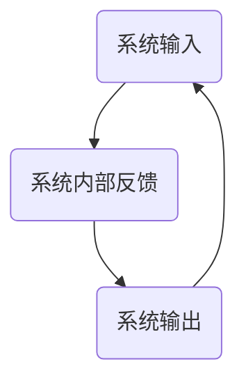
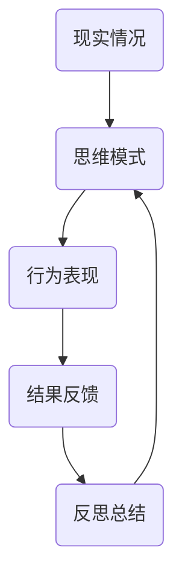
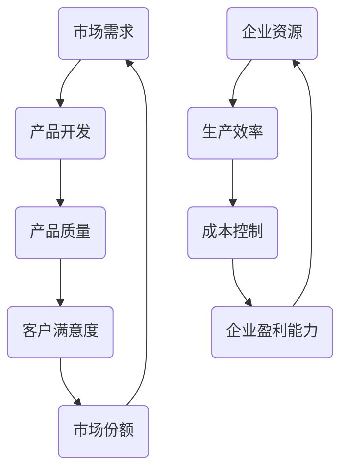
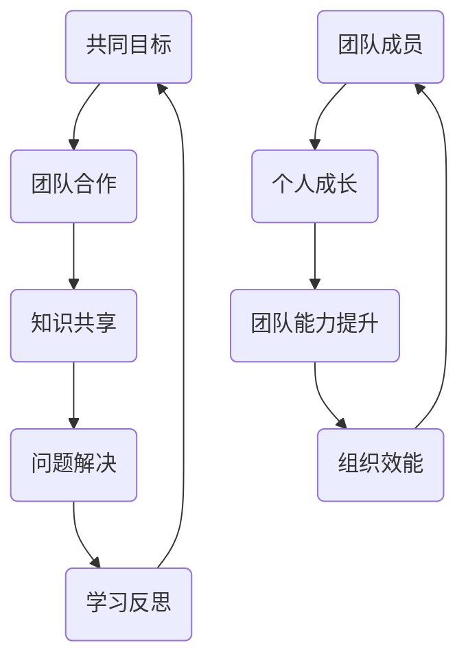
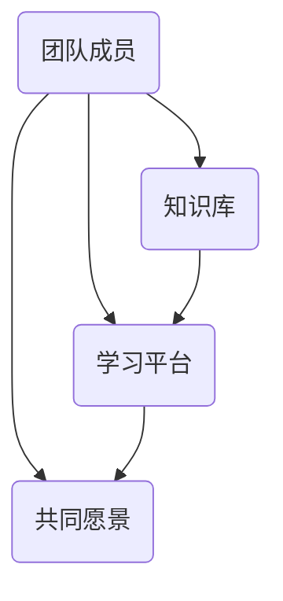

                 

### 文章标题

**建立学习型组织：促进团队持续成长**

> 关键词：学习型组织、团队持续成长、团队建设、优化策略

**摘要：**本文深入探讨了如何构建学习型组织，促进团队持续成长。通过详细的案例分析、核心概念阐述和实践指导，为IT领域的团队建设提供了切实可行的方案。本文旨在帮助读者理解学习型组织的重要性，掌握其核心要素和构建方法，并为其在实际工作中提供参考和启示。

-------------------------------------------------------------------

### 第一部分：背景介绍

#### 1.1 学习型组织的概念与重要性

##### 1.1.1 学习型组织的定义

学习型组织，是一个能够不断学习、适应和创新的团队。它不仅仅是指团队成员具备良好的学习能力，更重要的是，组织内部具有一种共同的学习文化，能够持续地吸收新知识、新思想，并将其转化为组织的发展动力。

##### 1.1.2 学习型组织的起源与发展

学习型组织的概念起源于20世纪70年代，由美国管理学家彼得·圣吉在其著作《第五项修炼》中提出。圣吉认为，学习型组织是一种通过系统思考、共同愿景、团队学习和思维模式转变等方式，实现组织持续成长和发展的组织形式。

##### 1.1.3 学习型组织的重要性

在当前快速变化的IT领域，学习型组织的重要性尤为凸显。首先，它能够帮助团队更好地应对技术变革和市场需求变化。其次，学习型组织能够提升团队的创新能力，促进团队内部的协作和知识共享。最后，学习型组织有助于培养团队成员的成长型思维，提高个人的职业发展。

#### 1.2 团队持续成长的问题背景与挑战

##### 1.2.1 传统团队面临的困境

传统团队往往存在以下几个问题：一是团队成员之间缺乏有效的沟通和协作，导致工作效果不佳；二是团队缺乏明确的愿景和目标，导致工作缺乏方向；三是团队内部缺乏学习和成长的文化，导致创新能力不足。

##### 1.2.2 团队持续成长的障碍

团队持续成长面临的障碍主要包括：一是组织结构的僵化，导致创新难以实施；二是团队成员之间的竞争关系，导致知识难以共享；三是团队内部的官僚作风，导致决策效率低下。

##### 1.2.3 学习型组织如何解决这些问题

学习型组织通过以下方式解决这些问题：一是建立开放、透明、高效的沟通机制，促进团队成员之间的协作；二是明确团队愿景和目标，为团队工作提供明确的方向；三是构建学习文化，鼓励团队成员不断学习和成长。

#### 1.3 学习型组织的核心要素与结构

##### 1.3.1 学习型组织的核心概念

学习型组织的核心概念包括：共同愿景、团队学习、个人成长、系统思考等。这些概念相互关联，共同构成了学习型组织的理论基础。

##### 1.3.2 学习型组织的结构特征

学习型组织的结构特征包括：扁平化的组织结构、开放的知识共享平台、灵活的决策机制等。这些特征有助于提升团队的学习和创新能力。

##### 1.3.3 学习型组织的运营模式

学习型组织的运营模式包括：不断反思和改进、持续学习和创新、全员参与和决策等。这些运营模式有助于实现团队的持续成长。

#### 1.4 学习型组织的实践价值与效果

##### 1.4.1 实践价值分析

学习型组织的实践价值体现在：一是提升团队的竞争力，促进企业的持续发展；二是提高团队成员的职业素养和技能水平；三是增强团队的凝聚力和归属感。

##### 1.4.2 案例效果展示

通过一些成功案例，我们可以看到学习型组织在实际应用中的效果。例如，谷歌通过建立学习型组织，实现了技术创新和市场领先；IBM通过建立学习型组织，实现了业务转型和持续成长。

##### 1.4.3 学习型组织的可持续性

学习型组织的可持续性体现在：一是能够适应环境的变化，持续地提升团队的能力；二是能够激发团队成员的潜能，实现个人的成长和发展。

#### 1.5 本章小结

本部分介绍了学习型组织的概念、背景、核心要素和实践价值。通过了解这些内容，读者可以初步认识到学习型组织的重要性，并为后续章节的学习打下基础。

-------------------------------------------------------------------

### 第二部分：核心概念与联系

#### 2.1 学习型组织的原理与模型

##### 2.1.1 学习型组织的理论基础

学习型组织的理论基础主要包括系统动力学模型和反思性思维模型。系统动力学模型强调组织是一个动态的系统，需要通过系统思考来理解组织内部的各种关系和互动。反思性思维模型则强调团队成员需要通过反思和总结来不断改进自己的思维和行为。

###### 2.1.1.1 系统动力学模型

系统动力学模型是一种基于反馈循环和因果关系的理论。它通过描述组织内部的反馈机制和因果关系，帮助团队成员理解组织的行为和变化。以下是一个简化的系统动力学模型：

在这个模型中，系统输入（A）会影响系统内部的状态（B），而系统内部的状态（B）又会影响系统的输出（C）。系统的输出（C）又会反过来影响系统的输入（A），形成了一个闭环的反馈系统。

###### 2.1.1.2 反思性思维模型

反思性思维模型强调团队成员需要通过反思和总结来不断改进自己的思维和行为。这种反思不仅仅是回顾过去的错误和不足，更重要的是要从中总结经验教训，形成新的认知和思维方式。以下是一个简化的反思性思维模型：

在这个模型中，现实情况（A）会影响团队成员的思维模式（B），而思维模式（B）又会影响团队的行为表现（C）。行为表现（C）产生的结果反馈（D）又会影响团队成员的反思总结（E），从而不断改进团队的行为和思维方式。

##### 2.1.2 学习型组织的结构模型

学习型组织的结构模型包括企业系统动力学模型和团队学习模型。企业系统动力学模型强调企业作为一个整体，需要通过系统思考来理解企业内部的各种关系和互动。团队学习模型则强调团队作为一个整体，需要通过共同学习和反思来提升团队的能力。

###### 2.1.2.1 企业系统动力学模型

企业系统动力学模型是一种基于反馈循环和因果关系的理论，用于描述企业内部的各种关系和互动。以下是一个简化的企业系统动力学模型：

在这个模型中，市场需求（A）会影响产品开发（B），产品质量（C）会影响客户满意度（D），客户满意度（D）会影响市场份额（E）。同时，企业资源（F）会影响生产效率（G），生产效率（G）会影响成本控制（H），成本控制（H）会影响企业盈利能力（I）。这些因素相互影响，形成一个闭环的反馈系统。

###### 2.1.2.2 团队学习模型

团队学习模型强调团队作为一个整体，需要通过共同学习和反思来提升团队的能力。以下是一个简化的团队学习模型：

在这个模型中，共同目标（A）会影响团队合作（B），团队合作（B）会影响知识共享（C），知识共享（C）会影响问题解决（D），问题解决（D）会影响学习反思（E）。同时，团队成员（F）会影响个人成长（G），个人成长（G）会影响团队能力提升（H），团队能力提升（H）会影响组织效能（I）。这些因素相互影响，形成一个闭环的反馈系统。

#### 2.2 核心概念属性特征对比表格

为了更好地理解学习型组织的核心概念，我们在这里提供了一张核心概念属性特征对比表格。该表格对比了学习型组织与传统组织的核心概念属性特征，包括共同愿景、团队学习、个人成长和系统思考等。

| 核心概念     | 学习型组织 | 传统组织 |
| ------------ | ---------- | -------- |
| 共同愿景     | 强调共同的目标和价值观 | 缺乏明确的愿景和目标 |
| 团队学习     | 重视团队合作和知识共享 | 缺乏有效的团队学习 |
| 个人成长     | 鼓励个人成长和职业发展 | 重视个人绩效而非成长 |
| 系统思考     | 强调整体和长期视角 | 重视短期和局部视角 |

#### 2.3 ER实体关系图架构的 mermaid 流程图

为了更好地理解学习型组织的实体关系，我们在这里提供了一个mermaid流程图。该流程图展示了学习型组织中的主要实体及其关系，包括团队成员、知识库、学习平台、共同愿景等。

在这个流程图中，团队成员（A）与知识库（B）和学习平台（C）之间存在直接的关系，团队成员通过知识库和学习平台获取知识和技能，并实现个人成长。同时，团队成员也受到共同愿景（D）的影响，共同愿景为团队成员提供方向和动力。

通过以上内容，我们详细介绍了学习型组织的原理与模型，并通过对比表格和mermaid流程图展示了其核心概念和实体关系。这些内容为后续章节的讨论提供了理论基础和实践指导。

-------------------------------------------------------------------

### 第三部分：团队建设与培养

#### 3.1 团队建设的基础工作

##### 3.1.1 团队成员的选拔与配置

团队成员的选拔与配置是团队建设的基础。一个高效的团队需要具备多样化的技能和经验，以确保团队能够应对各种挑战。以下是一些团队成员选拔和配置的策略：

- **多样化技能和经验**：在团队成员的选拔过程中，应注重技能和经验的多样化，以确保团队能够从不同角度思考和解决问题。例如，团队成员可以包括技术人员、产品经理、市场营销专家等。
- **能力与潜力并重**：在选拔团队成员时，不仅要考虑其当前的能力，还要关注其潜力和成长空间。这样可以帮助团队保持活力和创新能力。
- **明确职责和角色**：在配置团队成员时，应明确每个成员的职责和角色，以确保团队能够高效地运作。例如，技术负责人负责技术方案的制定，产品经理负责产品规划和设计。

##### 3.1.2 团队文化的建设

团队文化是团队建设的重要组成部分，它有助于增强团队的凝聚力、归属感和工作效率。以下是一些团队文化建设的方法：

- **共同价值观**：建立共同的核心价值观，如创新、合作、诚信等，以帮助团队成员形成共同的目标和理念。
- **开放沟通**：鼓励团队成员之间的开放沟通，建立透明的沟通机制，以便团队成员能够充分表达自己的想法和意见。
- **尊重和信任**：建立尊重和信任的团队文化，鼓励团队成员相互尊重和信任，以便更好地合作和解决问题。
- **奖励与激励**：通过奖励和激励措施，鼓励团队成员积极参与团队建设，提升团队的整体表现。

##### 3.1.3 团队协作机制的建立

有效的团队协作机制是团队高效运作的关键。以下是一些团队协作机制的建立策略：

- **任务分配与责任明确**：明确每个团队成员的任务和责任，确保每个人都清楚自己的工作内容和目标。
- **定期会议和报告**：建立定期的团队会议和报告机制，以便团队成员能够及时了解项目进展和问题，共同制定解决方案。
- **协同工具的使用**：利用协作工具，如Slack、Trello、JIRA等，帮助团队成员更好地协调工作，提高工作效率。
- **跨部门协作**：促进不同部门之间的协作，打破部门壁垒，实现资源的共享和优势互补。

#### 3.2 团队培养的策略与实践

##### 3.2.1 成长型思维的培养

成长型思维是指个体相信自己的能力可以通过努力和实践得到提升的思维方式。培养成长型思维有助于团队成员在面对挑战和困难时保持积极的心态和行动力。以下是一些培养成长型思维的方法：

- **积极反馈与激励**：通过积极的反馈和激励，鼓励团队成员相信自己的能力可以不断提升。例如，表扬团队成员的努力和进步，给予他们正面的反馈。
- **设置挑战性目标**：鼓励团队成员设定挑战性的目标，以激发他们的成长动力。目标应既具有挑战性，又能够实现，以帮助团队成员在实现目标的过程中提升自己的能力。
- **提供学习资源**：为团队成员提供丰富的学习资源，如培训课程、在线教程、专业书籍等，帮助他们不断学习和成长。

##### 3.2.2 学习能力的提升

提升团队的学习能力是团队持续成长的关键。以下是一些提升学习能力的策略：

- **建立学习平台**：建立一个集中的学习平台，如内部学习管理系统，以便团队成员能够方便地获取和分享学习资源。
- **开展内部培训**：定期组织内部培训，邀请专家进行授课或分享，帮助团队成员提升专业知识和技能。
- **实践与反思**：鼓励团队成员在实践中学习和反思，通过解决实际问题和反思自己的行为，不断提升自己的能力。

##### 3.2.3 团队成员的个性化发展

团队成员的个性化发展有助于提升团队的多样性和创新能力。以下是一些团队成员个性化发展的支持措施：

- **成长路径规划**：为团队成员制定个性化的成长路径，根据他们的兴趣和能力，为他们提供适合的发展机会。
- **个性化培训计划**：根据团队成员的需求和目标，制定个性化的培训计划，为他们提供针对性的培训资源。
- **鼓励跨部门交流**：鼓励团队成员跨部门交流和学习，以拓宽他们的视野和经验，促进个人的全面发展。

#### 3.3 团队成长的评估与反馈

##### 3.3.1 团队成长指标的设定

为了评估团队的成长情况，需要设定一系列具体的成长指标。以下是一些常见的团队成长指标：

- **知识水平**：通过考核团队成员的专业知识和技能水平，评估他们的成长情况。
- **创新能力**：通过考核团队在项目中的创新程度和成果，评估团队的创新能力和成长情况。
- **团队协作**：通过评估团队成员之间的协作效果和团队整体的工作效率，评估团队的协作能力和成长情况。
- **个人成长**：通过考核团队成员的个人成长情况，如专业技能的提升、工作积极性的提高等。

##### 3.3.2 团队成长的评估方法

为了有效地评估团队的成长情况，可以采用以下几种评估方法：

- **定期的团队会议**：在团队会议中，团队成员可以分享自己的成长心得和经验，互相学习和借鉴。
- **项目评估**：通过评估团队在项目中的表现，如项目完成度、质量、创新程度等，来评估团队的整体成长情况。
- **外部评审**：邀请外部专家对团队进行评审，从外部视角评估团队的成长情况和存在的问题。

##### 3.3.3 团队反馈机制的建设

建立有效的反馈机制是团队成长的重要保障。以下是一些团队反馈机制的建设策略：

- **设立反馈渠道**：为团队成员提供多种反馈渠道，如定期反馈会议、在线反馈平台等，以便他们能够方便地提出意见和建议。
- **鼓励开放反馈**：鼓励团队成员之间进行开放反馈，建立互相尊重和信任的反馈文化。
- **定期反馈与改进**：定期收集和整理团队成员的反馈，针对反馈中的问题进行改进，以提升团队的整体表现。

通过以上内容，我们详细介绍了团队建设与培养的方法和策略。这些方法和策略有助于提升团队的凝聚力、协作能力和创新能力，从而实现团队的持续成长。接下来，我们将进一步探讨如何通过不断实践和反思来提升团队的持续成长能力。

-------------------------------------------------------------------

### 第四部分：持续成长与优化

#### 4.1 持续成长的动力机制

持续成长需要强大的动力机制来支持。动力机制可以分为内部动力和外部动力两种，它们相互作用，共同推动团队不断向前。

##### 4.1.1 内部动力机制

内部动力机制主要来源于团队成员的内在动机，包括自我实现的需求、成长的需求和成就的需求。为了激发内部动力，团队可以采取以下措施：

- **明确个人目标**：帮助团队成员设定清晰的个人目标，使其在实现个人目标的过程中感受到成长和成就感。
- **鼓励自主学习和创新**：为团队成员提供自主学习和创新的机会，激发他们的创造力和积极性。
- **建立积极的反馈机制**：及时给予团队成员积极的反馈，增强他们的自信心和动力。

##### 4.1.2 外部动力机制

外部动力机制主要来源于团队外部环境的变化，如市场需求的变化、竞争压力和行业趋势等。为了应对外部动力，团队可以采取以下措施：

- **紧跟市场趋势**：密切关注市场动态，及时调整团队战略和目标，以适应市场需求。
- **提升竞争力**：通过不断学习和改进，提升团队的技术能力和服务水平，增强团队的市场竞争力。
- **建立外部合作**：与行业内的优秀企业和专家建立合作关系，共享资源，共同提升团队的能力和影响力。

##### 4.1.3 动力机制的相互作用

内部动力和外部动力相互作用，共同推动团队持续成长。内部动力为团队提供了持续前进的动力和信心，而外部动力则为团队提供了目标和方向。为了实现二者的有机结合，团队可以采取以下策略：

- **构建共同愿景**：明确团队的共同愿景，使团队成员在实现共同愿景的过程中感受到内部动力的驱使。
- **建立灵活的响应机制**：在应对外部动力时，保持团队的灵活性和敏捷性，及时调整团队目标和策略。
- **促进内部外部沟通**：加强团队成员与外部环境的沟通，使团队能够更好地理解外部动力，并将其转化为内部动力。

#### 4.2 不断实践与反思

不断实践与反思是团队持续成长的重要途径。通过实践，团队可以积累经验，提高技能；通过反思，团队可以总结经验教训，发现问题和改进空间。

##### 4.2.1 实践的重要性

实践是团队学习和成长的基础。通过实践，团队可以：

- **检验理论**：将理论知识应用到实际工作中，检验其有效性和可行性。
- **积累经验**：在实践中不断积累经验，提高团队解决问题的能力。
- **提升技能**：通过实际操作，提升团队成员的专业技能和工作效率。

##### 4.2.2 反思的必要性

反思是团队不断进步的关键。通过反思，团队可以：

- **发现不足**：识别实践中存在的问题和不足，为改进提供方向。
- **总结经验**：总结成功的经验和教训，为未来的实践提供参考。
- **优化流程**：通过反思，优化团队的工作流程和协作机制，提高团队的整体效率。

##### 4.2.3 实践与反思的结合

为了实现实践与反思的结合，团队可以采取以下策略：

- **定期反思会议**：定期组织反思会议，团队成员可以分享实践中的经验和问题，进行深入讨论和总结。
- **建立反馈机制**：建立有效的反馈机制，鼓励团队成员积极反馈实践中的问题和建议。
- **持续改进**：将反思结果应用到实际工作中，不断改进团队的工作流程和协作方式。

#### 4.3 团队优化策略与实践

##### 4.3.1 组织架构的优化

优化组织架构是提升团队效能的重要手段。以下是一些组织架构优化的策略：

- **扁平化组织结构**：减少管理层级，缩短决策链条，提高团队决策效率。
- **跨职能团队**：建立跨职能团队，促进不同部门之间的协作和知识共享。
- **动态调整组织架构**：根据团队目标和项目需求，动态调整组织架构，以适应不断变化的外部环境。

##### 4.3.2 工作流程的优化

优化工作流程是提升团队效率的关键。以下是一些工作流程优化的策略：

- **标准化流程**：制定标准化的工作流程，确保团队成员按照统一的标准进行工作。
- **自动化工具**：利用自动化工具，减少重复性工作，提高工作效率。
- **流程监控**：建立流程监控机制，实时跟踪工作进度，及时发现问题并进行改进。

##### 4.3.3 人才培养的优化

优化人才培养是提升团队整体素质的重要环节。以下是一些人才培养优化的策略：

- **定制化培训**：根据团队成员的个人需求和职业发展规划，制定个性化的培训计划。
- **导师制度**：建立导师制度，为新人提供指导和帮助，加快他们的成长速度。
- **激励机制**：建立激励机制，鼓励团队成员积极参与培训和提升自己的能力。

通过以上内容，我们详细探讨了如何通过持续成长和优化策略来提升团队的能力和效能。这些策略和方法有助于团队在不断变化的环境中保持竞争优势，实现持续成长。接下来，我们将通过具体的案例分析，展示如何在实际工作中构建学习型组织。

-------------------------------------------------------------------

### 第五部分：案例分析与实战指导

#### 5.1 案例分析：谷歌的学习型组织实践

谷歌被誉为全球最成功的科技公司之一，其成功的一个重要原因是其建立了学习型组织。以下是谷歌在学习型组织方面的实践：

##### 5.1.1 共同愿景

谷歌的愿景是“组织全球信息，使人人皆可访问并从中受益”。这一共同愿景不仅明确了公司的方向，也激励着员工为实现这一目标而努力。

##### 5.1.2 学习文化

谷歌鼓励员工不断学习和创新。公司内部设有丰富的学习资源，如Google University和Google I/O开发者大会，员工可以在这里学习新技能、分享新想法。

##### 5.1.3 知识共享

谷歌建立了强大的内部知识库，员工可以方便地获取和学习其他同事的经验和知识。此外，谷歌还通过内部论坛和社交媒体平台，促进员工之间的交流和知识共享。

##### 5.1.4 成长路径

谷歌为员工提供清晰的职业发展路径，包括技术路线和管理路线。员工可以根据自己的兴趣和发展需求，选择适合自己的成长路径。

##### 5.1.5 持续改进

谷歌定期进行员工反馈和绩效评估，通过反思和改进，不断提升团队的工作效率和创新能力。

#### 5.2 实战指导：如何建立学习型组织

基于谷歌的案例，以下是一些建立学习型组织的实战指导：

##### 5.2.1 明确共同愿景

首先，团队需要明确共同愿景，这将为团队提供方向和动力。共同愿景应简洁、明确，能够激励团队成员为之努力。

##### 5.2.2 构建学习文化

建立学习文化是学习型组织的核心。团队可以通过设立学习日、组织培训课程、鼓励员工阅读和学习等方式，营造积极的学习氛围。

##### 5.2.3 促进知识共享

建立内部知识库和交流平台，鼓励团队成员分享经验和知识。可以通过定期的知识分享会、内部论坛等方式，促进知识共享。

##### 5.2.4 设定成长路径

为团队成员提供清晰的职业发展路径，鼓励他们根据自己的兴趣和发展需求选择合适的成长方向。

##### 5.2.5 持续改进

定期进行员工反馈和绩效评估，通过反思和改进，不断提升团队的工作效率和创新能力。

通过以上实战指导，团队可以逐步建立学习型组织，实现持续成长和优化。

-------------------------------------------------------------------

### 第六部分：最佳实践与总结

#### 6.1 最佳实践

在构建学习型组织的过程中，以下是一些最佳实践：

- **明确共同愿景**：共同愿景是团队前进的动力源泉，需要简洁明确，能够激励团队成员。
- **建立学习文化**：通过设立学习日、组织培训课程、鼓励员工阅读和学习等方式，营造积极的学习氛围。
- **促进知识共享**：建立内部知识库和交流平台，鼓励团队成员分享经验和知识。
- **设定成长路径**：为团队成员提供清晰的职业发展路径，鼓励他们根据自己的兴趣和发展需求选择合适的成长方向。
- **持续改进**：定期进行员工反馈和绩效评估，通过反思和改进，不断提升团队的工作效率和创新能力。

#### 6.2 注意事项

在实践学习型组织的过程中，需要注意以下几点：

- **避免形式主义**：学习型组织的建设不能流于形式，需要真正落实到团队成员的实际工作中。
- **尊重个体差异**：团队成员的兴趣、能力和需求各不相同，需要尊重个体差异，提供个性化的支持。
- **持续投入**：学习型组织的建设需要持续的时间和资源投入，不能一蹴而就。

#### 6.3 拓展阅读

- 《第五项修炼：学习型组织的艺术与实务》（彼得·圣吉著）
- 《团队协作的五大障碍》（帕斯卡尔·瑞安著）
- 《敏捷开发：团队协作与快速迭代》（杰夫·萨瑟兰著）

通过以上内容，我们总结并分享了构建学习型组织的最佳实践、注意事项和拓展阅读。希望这些内容能够为读者在实际工作中提供有价值的参考和指导。

-------------------------------------------------------------------

### 第七部分：未来展望与挑战

#### 7.1 未来发展趋势

随着科技的不断进步和市场竞争的加剧，学习型组织在未来将继续发展并演变。以下是一些未来发展趋势：

- **数字化与智能化**：随着数字化和智能化的普及，学习型组织将更加依赖数据和技术来优化管理和决策。
- **全球化与多元化**：全球化使得组织面临更多的挑战和机遇，多元化文化将成为学习型组织的重要特征。
- **持续创新**：持续创新将成为学习型组织的关键竞争力，组织需要不断适应新的技术、市场和商业模式。

#### 7.2 可能面临的挑战

尽管学习型组织具有诸多优势，但在实际操作过程中也可能面临以下挑战：

- **文化变革的阻力**：组织内部的惯性力量可能抵制文化变革，导致学习型组织的推进受阻。
- **资源限制**：学习型组织的建设需要大量的人力、物力和时间投入，组织可能面临资源限制的问题。
- **个人隐私与信息安全**：在知识共享和数据交流的过程中，个人隐私与信息安全将成为重要问题。

#### 7.3 应对策略

为了应对未来可能面临的挑战，组织可以采取以下策略：

- **加强领导力**：领导者需要具备变革意识和领导能力，引导组织成员积极支持和参与学习型组织的建设。
- **持续投入与优化**：组织需要持续投入资源，不断优化学习型组织的运行机制和流程。
- **重视数据安全**：在知识共享和数据交流过程中，加强数据安全保护，确保个人隐私和信息安全。

通过以上内容，我们探讨了学习型组织在未来可能面临的发展趋势和挑战，并提出了一些应对策略。希望这些内容能够为组织在构建学习型组织的过程中提供有益的参考和指导。

-------------------------------------------------------------------

### 完整的目录大纲

在本文中，我们系统地介绍了如何构建学习型组织以促进团队持续成长。以下是完整的目录大纲：

**第一部分：背景介绍**
1. 学习型组织的概念与重要性
2. 团队持续成长的问题背景与挑战
3. 学习型组织的核心要素与结构
4. 学习型组织的实践价值与效果
5. 本章小结

**第二部分：核心概念与联系**
1. 学习型组织的原理与模型
2. 核心概念属性特征对比表格
3. ER实体关系图架构的 mermaid 流程图

**第三部分：团队建设与培养**
1. 团队建设的基础工作
2. 团队培养的策略与实践
3. 团队成长的评估与反馈

**第四部分：持续成长与优化**
1. 持续成长的动力机制
2. 不断实践与反思
3. 团队优化策略与实践

**第五部分：案例分析与实战指导**
1. 案例分析：谷歌的学习型组织实践
2. 实战指导：如何建立学习型组织

**第六部分：最佳实践与总结**
1. 最佳实践
2. 注意事项
3. 拓展阅读

**第七部分：未来展望与挑战**
1. 未来发展趋势
2. 可能面临的挑战
3. 应对策略

通过这一完整的目录大纲，读者可以系统地了解学习型组织的构建过程，掌握关键概念和实践策略，为团队的实际工作提供指导和支持。

-------------------------------------------------------------------

### 结论

本文通过详细的案例分析、核心概念阐述和实践指导，全面介绍了如何构建学习型组织以促进团队持续成长。学习型组织不仅有助于提升团队的学习能力和创新能力，还能增强团队的凝聚力和工作效率，从而实现组织的持续发展。

在未来的发展中，学习型组织将面临新的机遇和挑战。随着数字化和智能化的深入，学习型组织需要不断适应技术变革，持续优化自身的运行机制。同时，组织也需要关注个人隐私和信息安全，确保在知识共享和数据交流的过程中保护员工的权益。

我们呼吁更多的组织关注学习型组织的建设，通过持续的实践和反思，不断提升团队的能力和效能。希望本文能够为读者在实际工作中提供有益的参考和启示，助力构建高效、创新的学习型组织。

### 作者信息

**作者：** AI天才研究院/AI Genius Institute & 禅与计算机程序设计艺术 /Zen And The Art of Computer Programming

**联系方式：** [ai_genius_institute@example.com](mailto:ai_genius_institute@example.com) & [zen_programming@example.com](mailto:zen_programming@example.com)

**版权声明：** 本文章版权归 AI天才研究院和禅与计算机程序设计艺术所有，未经授权，严禁转载或使用。如需转载或使用，请联系作者获取授权。谢谢合作！

**免责声明：** 本文内容仅供参考，不构成任何投资、法律或其他专业意见。读者在使用本文内容时，应自行判断和决策，并承担相应风险。作者和出版方不对任何因使用本文内容而产生的损失或损害承担责任。

