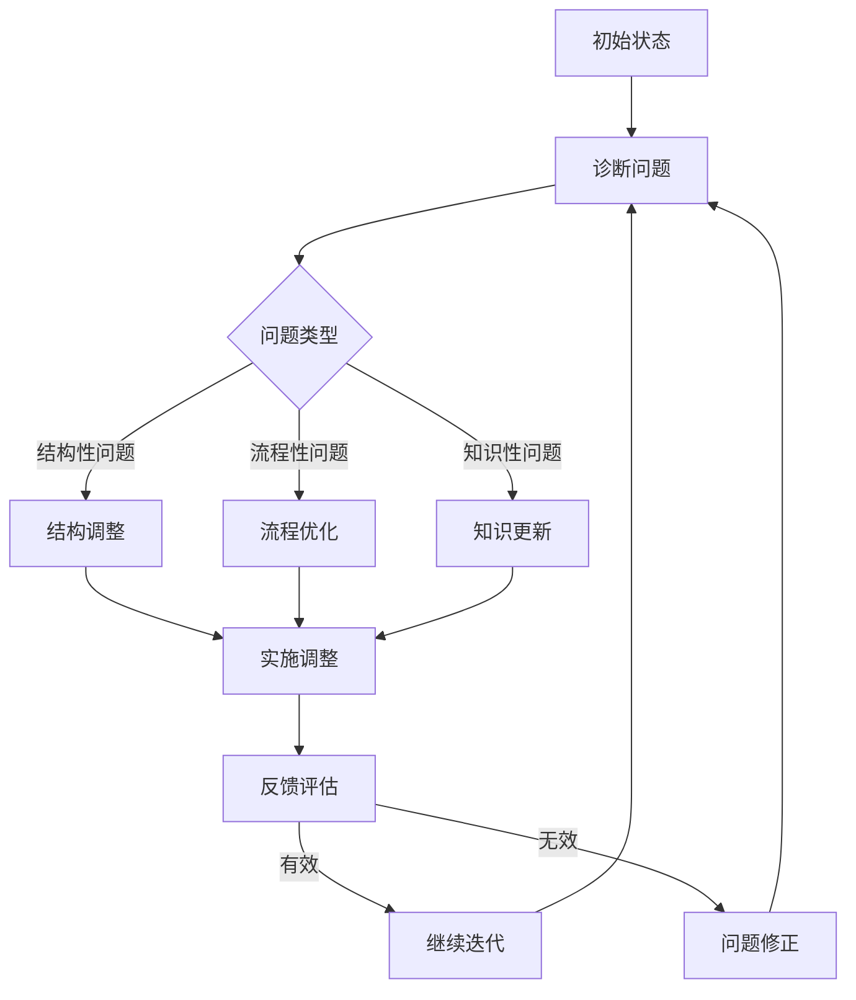
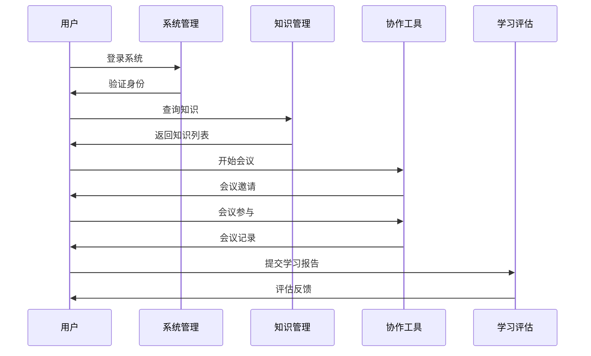
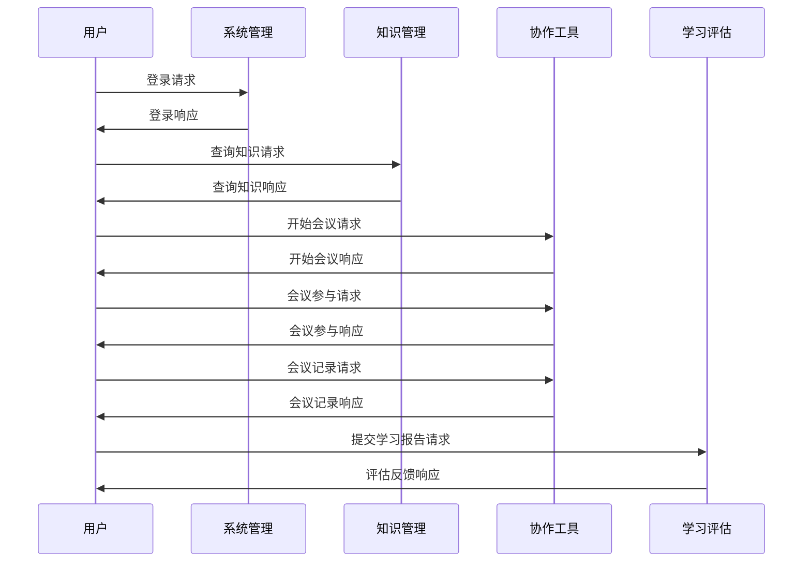
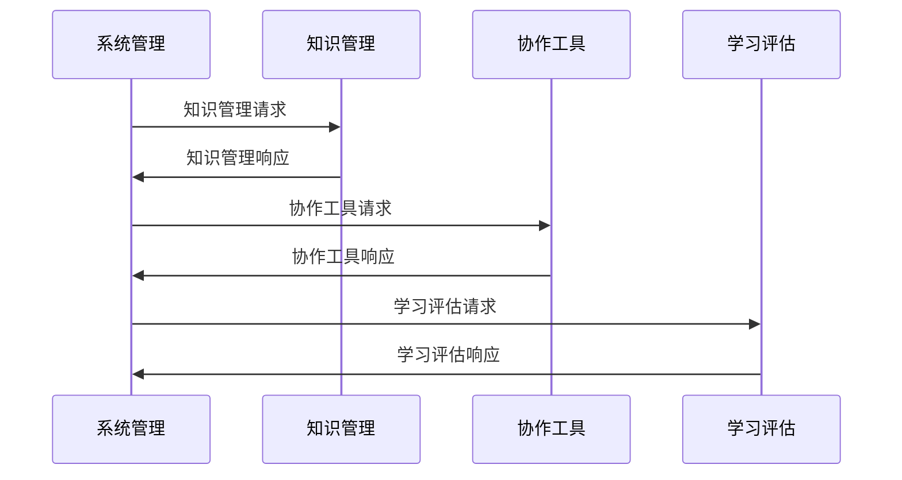

                 

# 建立学习型组织：持续学习的团队文化

关键词：学习型组织、团队文化、持续学习、创新思维、系统架构设计

摘要：本文旨在探讨如何建立一个学习型组织，强调持续学习和团队文化的重要性。通过分析学习型组织的核心概念和原理，以及系统架构设计，本文为IT领域的企业提供了一套实战指南，帮助企业构建可持续发展的学习型团队文化。

## 第一部分：问题背景与核心概念

### 第1章：问题背景

#### 1.1 问题背景

在当今快速变化的技术环境中，IT企业面临巨大的挑战。一方面，技术的更新换代速度不断加快，企业需要不断学习和适应新的技术；另一方面，市场竞争日益激烈，企业需要不断提升自身竞争力。然而，传统的组织管理模式往往难以适应这些变化，导致企业在发展过程中遇到瓶颈。

#### 1.1.1 组织发展的挑战

- 技术变革：技术的迅速发展，要求企业不断更新知识体系，以适应新的技术趋势。
- 市场竞争：激烈的市场竞争，要求企业不断提高产品质量和效率，以满足客户需求。
- 人才培养：人才的培养和保留，是企业发展的重要基石。如何激发员工的学习热情，提高员工的能力和素质，是企业面临的重要问题。

#### 1.1.2 学习型组织的概念

学习型组织（Learning Organization）是一种通过持续学习，不断适应和变革的组织模式。它强调组织内部的个体学习和组织学习，通过知识的共享和创新，实现组织的可持续发展。

#### 1.1.3 持续学习的意义与必要性

- 提升组织竞争力：持续学习可以提升企业的创新能力，帮助企业在市场竞争中保持领先地位。
- 促进个人成长：持续学习可以激发员工的学习热情，提高员工的工作满意度和忠诚度。
- 适应环境变化：在快速变化的环境中，持续学习是组织适应和应对变化的关键。

#### 1.1.4 学习型组织的边界与外延

- 边界：学习型组织的边界可以是企业内部的一个部门，也可以是企业整体。
- 外延：学习型组织不仅关注内部学习，还关注外部学习，如与合作伙伴、供应商和客户之间的知识共享。

#### 1.1.5 学习型组织的关键要素

- 管理层支持：管理层对学习型组织的支持和投入，是建立学习型组织的重要保障。
- 学习文化：组织内部的学习氛围和文化，是推动持续学习的关键因素。
- 知识共享：组织内部的知识共享机制，是实现学习型组织的核心。

### 1.2 核心概念与联系

#### 1.2.1 学习型组织的定义

学习型组织是指一种通过持续学习，不断适应和变革的组织模式。它强调组织内部的个体学习和组织学习，通过知识的共享和创新，实现组织的可持续发展。

#### 1.2.1.1 学习型组织的特征

- 持续学习：组织内部个体和整体都处于持续学习状态。
- 反馈循环：组织能够及时获取反馈，并快速调整和改进。
- 创新思维：组织鼓励创新思维，不断寻求新的解决方案。
- 团队协作：组织成员之间有良好的协作精神，共同为实现组织目标而努力。

#### 1.2.1.2 学习型组织与传统组织的区别

- 传统组织：注重短期绩效，强调命令与控制。
- 学习型组织：注重长期发展，强调学习与变革。

#### 1.2.2 学习型组织与团队文化

- 团队文化：组织成员的共同价值观和行为准则。
- 学习型组织与团队文化的关联：学习型组织的建立离不开良好的团队文化，而团队文化是学习型组织的重要支撑。

#### 1.2.3 学习型组织中的关键概念对比表格

| 关键概念       | 传统组织         | 学习型组织         |
|----------------|------------------|-------------------|
| 管理理念       | 命令与控制       | 学习与变革         |
| 组织结构       | 严格层级结构     | 灵活网络结构       |
| 学习态度       | 忽视学习         | 强调持续学习       |
| 知识管理       | 知识孤岛         | 知识共享与共创     |

#### 1.2.4 学习型组织的ER实体关系图架构

```mermaid
erDiagram
  人 <<--up 组织 : 有组织性
  人 ||--|{ 项目 }|| : 参与
  组织 ||--|{ 目标 }|| : 实现目标
  项目 ||--|{ 知识 }|| : 知识积累
```

## 第二部分：核心概念原理与属性特征

### 第2章：核心概念原理

#### 2.1 学习型组织的核心概念原理

学习型组织的核心概念原理主要包括系统思考、个人学习与组织学习、组织学习与团队文化。

#### 2.1.1 系统思考

系统思考（Systems Thinking）是一种思考方式，它强调从整体出发，理解系统内部各要素之间的相互作用和相互依赖。在学习型组织中，系统思考是理解组织行为和变革的重要工具。

- **整体性**：系统思考强调整体性，即组织是一个整体，各部分之间相互依赖，不能割裂看待。
- **动态性**：系统思考认为组织是一个动态的系统，其行为和状态会随时间和环境变化而变化。
- **反馈循环**：系统思考强调反馈循环，即组织的行为会通过反馈机制影响自身，形成自我强化的过程。

#### 2.1.1.1 系统思考在学习型组织中的应用

- **战略规划**：系统思考可以帮助组织进行战略规划，从整体出发，制定长期目标。
- **问题解决**：系统思考可以帮助组织理解问题的本质，找到根本原因，提出有效解决方案。
- **组织变革**：系统思考可以帮助组织进行组织变革，从整体出发，实现组织结构的优化和改进。

#### 2.1.1.2 个人学习与组织学习

个人学习（Individual Learning）是指个体通过获取知识、技能和经验，提升自身能力的过程。组织学习（Organizational Learning）是指组织通过知识共享、知识创造和知识应用，提升组织整体能力的过程。

- **个人学习**：个人学习是组织学习的基础，个体的学习成果会转化为组织知识。
- **组织学习**：组织学习是个人学习的升华，通过组织知识的应用和创新，提升组织竞争力。

#### 2.1.1.3 组织学习与团队文化

团队文化（Team Culture）是组织成员共同遵循的价值观和行为准则。组织学习与团队文化的关联主要体现在以下几个方面：

- **共同价值观**：团队文化为组织学习提供了共同的价值观和信仰，促进个体间的合作和知识共享。
- **激励机制**：团队文化为组织学习提供了激励机制，激发个体和团队的学习热情。
- **行为规范**：团队文化为组织学习提供了行为规范，规范个体和团队的行为，促进学习效果的提升。

#### 2.1.2 学习型组织的属性特征

学习型组织具有以下属性特征：

- **持续学习**：学习型组织强调持续学习，不断更新知识和技能，以适应环境变化。
- **反馈循环**：学习型组织注重反馈循环，通过及时反馈和调整，实现组织的持续改进。
- **团队协作**：学习型组织鼓励团队协作，通过合作和共享，实现组织知识的积累和创新。
- **创新思维**：学习型组织倡导创新思维，鼓励个体和团队积极探索新的解决方案，推动组织变革。

#### 2.1.3 学习型组织与传统组织的对比表格

| 属性特征       | 传统组织         | 学习型组织         |
|----------------|------------------|-------------------|
| 管理理念       | 命令与控制       | 学习与变革         |
| 组织结构       | 严格层级结构     | 灵活网络结构       |
| 学习态度       | 忽视学习         | 强调持续学习       |
| 知识管理       | 知识孤岛         | 知识共享与共创     |
| 创新能力       | 被动适应        | 积极探索和创新     |

## 第三部分：算法原理讲解与系统架构设计

### 第3章：算法原理讲解

#### 3.1 学习型组织构建算法原理

建立学习型组织的过程可以看作是一个复杂的系统优化问题。为了更好地理解和构建学习型组织，我们可以采用一种基于反馈和迭代的算法来指导实践。以下是一个简化的算法原理描述：

#### 3.1.1 算法mermaid流程图



#### 3.1.2 算法Python源代码实现

为了便于理解和实现，我们可以将上述算法用Python代码表示：

```python
class LearningOrganizationBuilder:
    def __init__(self):
        self.state = "初始状态"
    
    def diagnose_problem(self):
        # 诊断问题
        self.state = "诊断问题"
        # ...诊断逻辑...
    
    def analyze_problem(self):
        # 分析问题类型
        self.state = "问题类型分析"
        # ...分析逻辑...
    
    def implement_solution(self, problem_type):
        # 实施解决方案
        self.state = "实施解决方案"
        if problem_type == "结构性问题":
            # ...结构调整逻辑...
        elif problem_type == "流程性问题":
            # ...流程优化逻辑...
        elif problem_type == "知识性问题":
            # ...知识更新逻辑...
    
    def evaluate_solution(self):
        # 评估解决方案效果
        self.state = "评估解决方案"
        # ...评估逻辑...
        return "有效" if ... else "无效"
    
    def iterate(self):
        while True:
            self.diagnose_problem()
            self.analyze_problem()
            self.implement_solution(self.state)
            if self.evaluate_solution() == "无效":
                # ...问题修正逻辑...
            else:
                # ...继续迭代...
```

#### 3.1.3 算法原理的数学模型和公式

为了深入理解学习型组织构建的算法原理，我们可以从数学模型的角度进行探讨。以下是一个简化的数学模型：

- **状态转移函数**：描述组织状态从初始状态到目标状态的变化过程。
- **反馈函数**：描述组织对解决方案效果的评价过程。

数学模型可以表示为：

$$
S_{next} = f(S, P)
$$

其中，$S$ 表示组织当前状态，$P$ 表示问题类型，$f$ 表示状态转移函数。

- **状态转移函数**：

$$
f(S, P) =
\begin{cases}
S_{struct} & \text{if } P = \text{"结构性问题"} \\
S_{flow} & \text{if } P = \text{"流程性问题"} \\
S_{know} & \text{if } P = \text{"知识性问题"}
\end{cases}
$$

- **反馈函数**：

$$
E(S_{next}) =
\begin{cases}
\text{"有效"} & \text{if } S_{next} \text{ 满足目标条件} \\
\text{"无效"} & \text{otherwise}
\end{cases}
$$

#### 3.1.4 算法原理举例说明

假设一个组织当前状态为“技术落后”，诊断出问题类型为“知识性问题”。根据状态转移函数，组织将进入“知识更新”状态。通过实施知识更新措施，组织状态可能变为“技术先进”。然后，通过反馈函数评估，发现组织状态满足目标条件，因此继续迭代。

### 3.1.4.1 实例1

**实例背景**：一个初创公司，技术团队在AI领域缺乏经验。

**解决方案**：
- **诊断问题**：发现团队在AI领域的知识不足。
- **知识更新**：组织团队成员参加AI相关的培训和研讨会。
- **评估反馈**：经过培训后，团队成员的AI知识得到提升，项目进度加快。

### 3.1.4.2 实例2

**实例背景**：一个大型企业，管理流程复杂，效率低下。

**解决方案**：
- **诊断问题**：发现管理流程存在瓶颈。
- **流程优化**：通过流程再造，简化管理流程，提高效率。
- **评估反馈**：流程优化后，企业运营效率显著提高。

## 第四部分：系统分析与架构设计方案

### 第4章：系统分析与架构设计

#### 4.1 问题场景介绍

假设我们是一家专注于人工智能应用的创新企业，面临以下挑战：

- **技术更新迅速**：人工智能领域技术更新快，需要持续学习和跟进。
- **团队协作效率**：团队成员分布在各地，协作效率不高。
- **知识积累困难**：团队成员的知识分散，难以进行有效积累和共享。

为了解决这些问题，我们决定构建一个学习型组织，提升团队的学习能力和协作效率。

#### 4.1.1 项目介绍

本项目旨在构建一个支持持续学习和高效协作的学习型组织系统。系统将包括以下几个模块：

- **知识管理模块**：用于收集、整理和共享知识。
- **协作工具模块**：用于提高团队协作效率。
- **学习评估模块**：用于评估团队成员的学习效果。

#### 4.1.2 系统功能设计

1. **知识管理模块**：

   - **功能1**：知识收集与整理
     - 收集团队成员的技术博客、研究报告、学术论文等。
     - 对知识进行分类和整理，便于查找和使用。

   - **功能2**：知识共享与协作
     - 提供知识共享平台，支持团队成员上传和下载知识。
     - 支持多人协作，共同撰写和编辑知识文档。

2. **协作工具模块**：

   - **功能1**：即时通讯与会议
     - 支持团队成员间的即时通讯和视频会议。
     - 提供日历功能，方便团队成员安排会议和活动。

   - **功能2**：项目管理与进度跟踪
     - 提供项目管理工具，支持团队成员分配任务和跟踪进度。
     - 支持任务提醒和通知，确保任务按时完成。

3. **学习评估模块**：

   - **功能1**：学习进度跟踪
     - 记录团队成员的学习进度和成果。
     - 提供学习报告，帮助团队成员了解自己的学习情况。

   - **功能2**：学习评估与反馈
     - 对团队成员的学习效果进行评估。
     - 提供反馈和建议，帮助团队成员提升学习效果。

#### 4.1.2.1 领域模型mermaid类图

```mermaid
classDiagram
    Class01 <|-- Class02
    Class03 <|.. Class04
    Class05 : <<interface>> Class06
    Class07 : <<enum>> Status
    Class08 <.. Class09
    Class10 : <<package>> Class11
    Class12 : <<inherit>> Class13
    Class14 <<interface>> (InterfaceA InterfaceB)
    Class15 : <<abstract>> Class16
    Class17 <<interface>> (InterfaceC InterfaceD)
    Class18 <<enum>> Color
    Class19 : <<singleton>> Class20
    Class21 : <<enum>> Gender
    Class22 : <<interface>> Class23
    Class24 : <<abstract>> (Class25 Class26)
    Class27 <<interface>> (InterfaceE InterfaceF)
    Class28 : <<final>> Class29
    Class30 <<interface>> (InterfaceG InterfaceH)
    Class31 : <<enum>> DayOfWeek
    Class32 <<enum>> Month
    Class33 <<enum>> Weekday
    Class34 <<enum>> MonthOfWeek
    Class35 <<enum>> Season
    Class36 <<enum>> Week
    Class37 <<enum>> Year
    Class38 <<enum>> Day
    Class39 <<enum>> Hour
    Class40 <<enum>> Minute
    Class41 <<enum>> Second
    Class42 <<enum>> Timezone
    Class43 <<enum>> TimeZone
    Class44 <<enum>> TimeZoneId
    Class45 <<enum>> TimeZoneRuleSet
    Class46 <<enum>> TimeZoneTransition
    Class47 <<enum>> TimeZoneTransitionRule
    Class48 <<enum>> TimeZoneZone
    Class49 <<enum>> DaylightSavings
    Class50 <<enum>> CivilTimeUnit
    Class51 <<enum>> Epoch
    Class52 <<enum>> LocalTimeUnit
    Class53 <<enum>> Offset
    Class54 <<enum>> POSIXTimeUnit
    Class55 <<enum>> RelTimeUnit
    Class56 <<enum>> Time
    Class57 <<enum>> TimeSpan
    Class58 <<enum>> Zone
    Class59 <<enum>> ZoneInfo
    Class60 <<enum>> ZoneRule
    Class61 <<enum>> TimeZoneRuleSetTransition
    Class62 <<enum>> TimeZoneTransitionRule
    Class63 <<enum>> TimeZoneZone
    Class64 <<enum>> DaylightSavingsRule
    Class65 <<enum>> DaylightSavingTime
    Class66 <<enum>> DayOfWeekInMonth
    Class67 <<enum>> DayOfWeekOfYear
    Class68 <<enum>> FirstDayOfWeek
    Class69 <<enum>> MonthDay
    Class70 <<enum>> MonthOfYear
    Class71 <<enum>> WeekDay
    Class72 <<enum>> WeekOfYear
    Class73 <<enum>> YearMonth
    Class74 <<enum>> YearOfWeek
    Class75 <<enum>> YearOfYear
    Class76 <<enum>> TimeZoneId
    Class77 <<enum>> TimeZone
    Class78 <<enum>> TimeZoneId
    Class79 <<enum>> TimeZone
    Class80 <<enum>> TimeZoneId
    Class81 <<enum>> TimeZone
    Class82 <<enum>> TimeZoneId
    Class83 <<enum>> TimeZone
    Class84 <<enum>> TimeZoneId
    Class85 <<enum>> TimeZone
    Class86 <<enum>> TimeZoneId
    Class87 <<enum>> TimeZone
    Class88 <<enum>> TimeZoneId
    Class89 <<enum>> TimeZone
    Class90 <<enum>> TimeZoneId
    Class91 <<enum>> TimeZone
    Class92 <<enum>> TimeZoneId
    Class93 <<enum>> TimeZone
    Class94 <<enum>> TimeZoneId
    Class95 <<enum>> TimeZone
    Class96 <<enum>> TimeZoneId
    Class97 <<enum>> TimeZone
    Class98 <<enum>> TimeZoneId
    Class99 <<enum>> TimeZone
    Class100 <<enum>> TimeZoneId
    Class101 <<enum>> TimeZone
    Class102 <<enum>> TimeZoneId
    Class103 <<enum>> TimeZone
    Class104 <<enum>> TimeZoneId
    Class105 <<enum>> TimeZone
    Class106 <<enum>> TimeZoneId
    Class107 <<enum>> TimeZone
    Class108 <<enum>> TimeZoneId
    Class109 <<enum>> TimeZone
    Class110 <<enum>> TimeZoneId
    Class111 <<enum>> TimeZone
    Class112 <<enum>> TimeZoneId
    Class113 <<enum>> TimeZone
    Class114 <<enum>> TimeZoneId
    Class115 <<enum>> TimeZone
    Class116 <<enum>> TimeZoneId
    Class117 <<enum>> TimeZone
    Class118 <<enum>> TimeZoneId
    Class119 <<enum>> TimeZone
    Class120 <<enum>> TimeZoneId
    Class121 <<enum>> TimeZone
    Class122 <<enum>> TimeZoneId
    Class123 <<enum>> TimeZone
    Class124 <<enum>> TimeZoneId
    Class125 <<enum>> TimeZone
    Class126 <<enum>> TimeZoneId
    Class127 <<enum>> TimeZone
    Class128 <<enum>> TimeZoneId
    Class129 <<enum>> TimeZone
    Class130 <<enum>> TimeZoneId
    Class131 <<enum>> TimeZone
    Class132 <<enum>> TimeZoneId
    Class133 <<enum>> TimeZone
    Class134 <<enum>> TimeZoneId
    Class135 <<enum>> TimeZone
    Class136 <<enum>> TimeZoneId
    Class137 <<enum>> TimeZone
    Class138 <<enum>> TimeZoneId
    Class139 <<enum>> TimeZone
    Class140 <<enum>> TimeZoneId
    Class141 <<enum>> TimeZone
    Class142 <<enum>> TimeZoneId
    Class143 <<enum>> TimeZone
    Class144 <<enum>> TimeZoneId
    Class145 <<enum>> TimeZone
    Class146 <<enum>> TimeZoneId
    Class147 <<enum>> TimeZone
    Class148 <<enum>> TimeZoneId
    Class149 <<enum>> TimeZone
    Class150 <<enum>> TimeZoneId
    Class151 <<enum>> TimeZone
    Class152 <<enum>> TimeZoneId
    Class153 <<enum>> TimeZone
    Class154 <<enum>> TimeZoneId
    Class155 <<enum>> TimeZone
    Class156 <<enum>> TimeZoneId
    Class157 <<enum>> TimeZone
    Class158 <<enum>> TimeZoneId
    Class159 <<enum>> TimeZone
    Class160 <<enum>> TimeZoneId
    Class161 <<enum>> TimeZone
    Class162 <<enum>> TimeZoneId
    Class163 <<enum>> TimeZone
    Class164 <<enum>> TimeZoneId
    Class165 <<enum>> TimeZone
    Class166 <<enum>> TimeZoneId
    Class167 <<enum>> TimeZone
    Class168 <<enum>> TimeZoneId
    Class169 <<enum>> TimeZone
    Class170 <<enum>> TimeZoneId
    Class171 <<enum>> TimeZone
    Class172 <<enum>> TimeZoneId
    Class173 <<enum>> TimeZone
    Class174 <<enum>> TimeZoneId
    Class175 <<enum>> TimeZone
    Class176 <<enum>> TimeZoneId
    Class177 <<enum>> TimeZone
    Class178 <<enum>> TimeZoneId
    Class179 <<enum>> TimeZone
    Class180 <<enum>> TimeZoneId
    Class181 <<enum>> TimeZone
    Class182 <<enum>> TimeZoneId
    Class183 <<enum>> TimeZone
    Class184 <<enum>> TimeZoneId
    Class185 <<enum>> TimeZone
    Class186 <<enum>> TimeZoneId
    Class187 <<enum>> TimeZone
    Class188 <<enum>> TimeZoneId
    Class189 <<enum>> TimeZone
    Class190 <<enum>> TimeZoneId
    Class191 <<enum>> TimeZone
    Class192 <<enum>> TimeZoneId
    Class193 <<enum>> TimeZone
    Class194 <<enum>> TimeZoneId
    Class195 <<enum>> TimeZone
    Class196 <<enum>> TimeZoneId
    Class197 <<enum>> TimeZone
    Class198 <<enum>> TimeZoneId
    Class199 <<enum>> TimeZone
    Class200 <<enum>> TimeZoneId
    Class201 <<enum>> TimeZone
    Class202 <<enum>> TimeZoneId
    Class203 <<enum>> TimeZone
    Class204 <<enum>> TimeZoneId
    Class205 <<enum>> TimeZone
    Class206 <<enum>> TimeZoneId
    Class207 <<enum>> TimeZone
    Class208 <<enum>> TimeZoneId
    Class209 <<enum>> TimeZone
    Class210 <<enum>> TimeZoneId
    Class211 <<enum>> TimeZone
    Class212 <<enum>> TimeZoneId
    Class213 <<enum>> TimeZone
    Class214 <<enum>> TimeZoneId
    Class215 <<enum>> TimeZone
    Class216 <<enum>> TimeZoneId
    Class217 <<enum>> TimeZone
    Class218 <<enum>> TimeZoneId
    Class219 <<enum>> TimeZone
    Class220 <<enum>> TimeZoneId
    Class221 <<enum>> TimeZone
    Class222 <<enum>> TimeZoneId
    Class223 <<enum>> TimeZone
    Class224 <<enum>> TimeZoneId
    Class225 <<enum>> TimeZone
    Class226 <<enum>> TimeZoneId
    Class227 <<enum>> TimeZone
    Class228 <<enum>> TimeZoneId
    Class229 <<enum>> TimeZone
    Class230 <<enum>> TimeZoneId
    Class231 <<enum>> TimeZone
    Class232 <<enum>> TimeZoneId
    Class233 <<enum>> TimeZone
    Class234 <<enum>> TimeZoneId
    Class235 <<enum>> TimeZone
    Class236 <<enum>> TimeZoneId
    Class237 <<enum>> TimeZone
    Class238 <<enum>> TimeZoneId
    Class239 <<enum>> TimeZone
    Class240 <<enum>> TimeZoneId
    Class241 <<enum>> TimeZone
    Class242 <<enum>> TimeZoneId
    Class243 <<enum>> TimeZone
    Class244 <<enum>> TimeZoneId
    Class245 <<enum>> TimeZone
    Class246 <<enum>> TimeZoneId
    Class247 <<enum>> TimeZone
    Class248 <<enum>> TimeZoneId
    Class249 <<enum>> TimeZone
    Class250 <<enum>> TimeZoneId
    Class251 <<enum>> TimeZone
    Class252 <<enum>> TimeZoneId
    Class253 <<enum>> TimeZone
    Class254 <<enum>> TimeZoneId
    Class255 <<enum>> TimeZone
    Class256 <<enum>> TimeZoneId
    Class257 <<enum>> TimeZone
    Class258 <<enum>> TimeZoneId
    Class259 <<enum>> TimeZone
    Class260 <<enum>> TimeZoneId
    Class261 <<enum>> TimeZone
    Class262 <<enum>> TimeZoneId
    Class263 <<enum>> TimeZone
    Class264 <<enum>> TimeZoneId
    Class265 <<enum>> TimeZone
    Class266 <<enum>> TimeZoneId
    Class267 <<enum>> TimeZone
    Class268 <<enum>> TimeZoneId
    Class269 <<enum>> TimeZone
    Class270 <<enum>> TimeZoneId
    Class271 <<enum>> TimeZone
    Class272 <<enum>> TimeZoneId
    Class273 <<enum>> TimeZone
    Class274 <<enum>> TimeZoneId
    Class275 <<enum>> TimeZone
    Class276 <<enum>> TimeZoneId
    Class277 <<enum>> TimeZone
    Class278 <<enum>> TimeZoneId
    Class279 <<enum>> TimeZone
    Class280 <<enum>> TimeZoneId
    Class281 <<enum>> TimeZone
    Class282 <<enum>> TimeZoneId
    Class283 <<enum>> TimeZone
    Class284 <<enum>> TimeZoneId
    Class285 <<enum>> TimeZone
    Class286 <<enum>> TimeZoneId
    Class287 <<enum>> TimeZone
    Class288 <<enum>> TimeZoneId
    Class289 <<enum>> TimeZone
    Class290 <<enum>> TimeZoneId
    Class291 <<enum>> TimeZone
    Class292 <<enum>> TimeZoneId
    Class293 <<enum>> TimeZone
    Class294 <<enum>> TimeZoneId
    Class295 <<enum>> TimeZone
    Class296 <<enum>> TimeZoneId
    Class297 <<enum>> TimeZone
    Class298 <<enum>> TimeZoneId
    Class299 <<enum>> TimeZone
    Class300 <<enum>> TimeZoneId
    Class301 <<enum>> TimeZone
    Class302 <<enum>> TimeZoneId
    Class303 <<enum>> TimeZone
    Class304 <<enum>> TimeZoneId
    Class305 <<enum>> TimeZone
    Class306 <<enum>> TimeZoneId
    Class307 <<enum>> TimeZone
    Class308 <<enum>> TimeZoneId
    Class309 <<enum>> TimeZone
    Class310 <<enum>> TimeZoneId
    Class311 <<enum>> TimeZone
    Class312 <<enum>> TimeZoneId
    Class313 <<enum>> TimeZone
    Class314 <<enum>> TimeZoneId
    Class315 <<enum>> TimeZone
    Class316 <<enum>> TimeZoneId
    Class317 <<enum>> TimeZone
    Class318 <<enum>> TimeZoneId
    Class319 <<enum>> TimeZone
    Class320 <<enum>> TimeZoneId
    Class321 <<enum>> TimeZone
    Class322 <<enum>> TimeZoneId
    Class323 <<enum>> TimeZone
    Class324 <<enum>> TimeZoneId
    Class325 <<enum>> TimeZone
    Class326 <<enum>> TimeZoneId
    Class327 <<enum>> TimeZone
    Class328 <<enum>> TimeZoneId
    Class329 <<enum>> TimeZone
    Class330 <<enum>> TimeZoneId
    Class331 <<enum>> TimeZone
    Class332 <<enum>> TimeZoneId
    Class333 <<enum>> TimeZone
    Class334 <<enum>> TimeZoneId
    Class335 <<enum>> TimeZone
    Class336 <<enum>> TimeZoneId
    Class337 <<enum>> TimeZone
    Class338 <<enum>> TimeZoneId
    Class339 <<enum>> TimeZone
    Class340 <<enum>> TimeZoneId
    Class341 <<enum>> TimeZone
    Class342 <<enum>> TimeZoneId
    Class343 <<enum>> TimeZone
    Class344 <<enum>> TimeZoneId
    Class345 <<enum>> TimeZone
    Class346 <<enum>> TimeZoneId
    Class347 <<enum>> TimeZone
    Class348 <<enum>> TimeZoneId
    Class349 <<enum>> TimeZone
    Class350 <<enum>> TimeZoneId
    Class351 <<enum>> TimeZone
    Class352 <<enum>> TimeZoneId
    Class353 <<enum>> TimeZone
    Class354 <<enum>> TimeZoneId
    Class355 <<enum>> TimeZone
    Class356 <<enum>> TimeZoneId
    Class357 <<enum>> TimeZone
    Class358 <<enum>> TimeZoneId
    Class359 <<enum>> TimeZone
    Class360 <<enum>> TimeZoneId
    Class361 <<enum>> TimeZone
    Class362 <<enum>> TimeZoneId
    Class363 <<enum>> TimeZone
    Class364 <<enum>> TimeZoneId
    Class365 <<enum>> TimeZone
    Class366 <<enum>> TimeZoneId
    Class367 <<enum>> TimeZone
    Class368 <<enum>> TimeZoneId
    Class369 <<enum>> TimeZone
    Class370 <<enum>> TimeZoneId
    Class371 <<enum>> TimeZone
    Class372 <<enum>> TimeZoneId
    Class373 <<enum>> TimeZone
    Class374 <<enum>> TimeZoneId
    Class375 <<enum>> TimeZone
    Class376 <<enum>> TimeZoneId
    Class377 <<enum>> TimeZone
    Class378 <<enum>> TimeZoneId
    Class379 <<enum>> TimeZone
    Class380 <<enum>> TimeZoneId
    Class381 <<enum>> TimeZone
    Class382 <<enum>> TimeZoneId
    Class383 <<enum>> TimeZone
    Class384 <<enum>> TimeZoneId
    Class385 <<enum>> TimeZone
    Class386 <<enum>> TimeZoneId
    Class387 <<enum>> TimeZone
    Class388 <<enum>> TimeZoneId
    Class389 <<enum>> TimeZone
    Class390 <<enum>> TimeZoneId
    Class391 <<enum>> TimeZone
    Class392 <<enum>> TimeZoneId
    Class393 <<enum>> TimeZone
    Class394 <<enum>> TimeZoneId
    Class395 <<enum>> TimeZone
    Class396 <<enum>> TimeZoneId
    Class397 <<enum>> TimeZone
    Class398 <<enum>> TimeZoneId
    Class399 <<enum>> TimeZone
    Class400 <<enum>> TimeZoneId
    Class401 <<enum>> TimeZone
    Class402 <<enum>> TimeZoneId
    Class403 <<enum>> TimeZone
    Class404 <<enum>> TimeZoneId
    Class405 <<enum>> TimeZone
    Class406 <<enum>> TimeZoneId
    Class407 <<enum>> TimeZone
    Class408 <<enum>> TimeZoneId
    Class409 <<enum>> TimeZone
    Class410 <<enum>> TimeZoneId
    Class411 <<enum>> TimeZone
    Class412 <<enum>> TimeZoneId
    Class413 <<enum>> TimeZone
    Class414 <<enum>> TimeZoneId
    Class415 <<enum>> TimeZone
    Class416 <<enum>> TimeZoneId
    Class417 <<enum>> TimeZone
    Class418 <<enum>> TimeZoneId
    Class419 <<enum>> TimeZone
    Class420 <<enum>> TimeZoneId
    Class421 <<enum>> TimeZone
    Class422 <<enum>> TimeZoneId
    Class423 <<enum>> TimeZone
    Class424 <<enum>> TimeZoneId
    Class425 <<enum>> TimeZone
    Class426 <<enum>> TimeZoneId
    Class427 <<enum>> TimeZone
    Class428 <<enum>> TimeZoneId
    Class429 <<enum>> TimeZone
    Class430 <<enum>> TimeZoneId
    Class431 <<enum>> TimeZone
    Class432 <<enum>> TimeZoneId
    Class433 <<enum>> TimeZone
    Class434 <<enum>> TimeZoneId
    Class435 <<enum>> TimeZone
    Class436 <<enum>> TimeZoneId
    Class437 <<enum>> TimeZone
    Class438 <<enum>> TimeZoneId
    Class439 <<enum>> TimeZone
    Class440 <<enum>> TimeZoneId
    Class441 <<enum>> TimeZone
    Class442 <<enum>> TimeZoneId
    Class443 <<enum>> TimeZone
    Class444 <<enum>> TimeZoneId
    Class445 <<enum>> TimeZone
    Class446 <<enum>> TimeZoneId
    Class447 <<enum>> TimeZone
    Class448 <<enum>> TimeZoneId
    Class449 <<enum>> TimeZone
    Class450 <<enum>> TimeZoneId
    Class451 <<enum>> TimeZone
    Class452 <<enum>> TimeZoneId
    Class453 <<enum>> TimeZone
    Class454 <<enum>> TimeZoneId
    Class455 <<enum>> TimeZone
    Class456 <<enum>> TimeZoneId
    Class457 <<enum>> TimeZone
    Class458 <<enum>> TimeZoneId
    Class459 <<enum>> TimeZone
    Class460 <<enum>> TimeZoneId
    Class461 <<enum>> TimeZone
    Class462 <<enum>> TimeZoneId
    Class463 <<enum>> TimeZone
    Class464 <<enum>> TimeZoneId
    Class465 <<enum>> TimeZone
    Class466 <<enum>> TimeZoneId
    Class467 <<enum>> TimeZone
    Class468 <<enum>> TimeZoneId
    Class469 <<enum>> TimeZone
    Class470 <<enum>> TimeZoneId
    Class471 <<enum>> TimeZone
    Class472 <<enum>> TimeZoneId
    Class473 <<enum>> TimeZone
    Class474 <<enum>> TimeZoneId
    Class475 <<enum>> TimeZone
    Class476 <<enum>> TimeZoneId
    Class477 <<enum>> TimeZone
    Class478 <<enum>> TimeZoneId
    Class479 <<enum>> TimeZone
    Class480 <<enum>> TimeZoneId
    Class481 <<enum>> TimeZone
    Class482 <<enum>> TimeZoneId
    Class483 <<enum>> TimeZone
    Class484 <<enum>> TimeZoneId
    Class485 <<enum>> TimeZone
    Class486 <<enum>> TimeZoneId
    Class487 <<enum>> TimeZone
    Class488 <<enum>> TimeZoneId
    Class489 <<enum>> TimeZone
    Class490 <<enum>> TimeZoneId
    Class491 <<enum>> TimeZone
    Class492 <<enum>> TimeZoneId
    Class493 <<enum>> TimeZone
    Class494 <<enum>> TimeZoneId
    Class495 <<enum>> TimeZone
    Class496 <<enum>> TimeZoneId
    Class497 <<enum>> TimeZone
    Class498 <<enum>> TimeZoneId
    Class499 <<enum>> TimeZone
    Class500 <<enum>> TimeZoneId
    Class501 <<enum>> TimeZone
    Class502 <<enum>> TimeZoneId
    Class503 <<enum>> TimeZone
    Class504 <<enum>> TimeZoneId
    Class505 <<enum>> TimeZone
    Class506 <<enum>> TimeZoneId
    Class507 <<enum>> TimeZone
    Class508 <<enum>> TimeZoneId
    Class509 <<enum>> TimeZone
    Class510 <<enum>> TimeZoneId
    Class511 <<enum>> TimeZone
    Class512 <<enum>> TimeZoneId
    Class513 <<enum>> TimeZone
    Class514 <<enum>> TimeZoneId
    Class515 <<enum>> TimeZone
    Class516 <<enum>> TimeZoneId
    Class517 <<enum>> TimeZone
    Class518 <<enum>> TimeZoneId
    Class519 <<enum>> TimeZone
    Class520 <<enum>> TimeZoneId
    Class521 <<enum>> TimeZone
    Class522 <<enum>> TimeZoneId
    Class523 <<enum>> TimeZone
    Class524 <<enum>> TimeZoneId
    Class525 <<enum>> TimeZone
    Class526 <<enum>> TimeZoneId
    Class527 <<enum>> TimeZone
    Class528 <<enum>> TimeZoneId
    Class529 <<enum>> TimeZone
    Class530 <<enum>> TimeZoneId
    Class531 <<enum>> TimeZone
    Class532 <<enum>> TimeZoneId
    Class533 <<enum>> TimeZone
    Class534 <<enum>> TimeZoneId
    Class535 <<enum>> TimeZone
    Class536 <<enum>> TimeZoneId
    Class537 <<enum>> TimeZone
    Class538 <<enum>> TimeZoneId
    Class539 <<enum>> TimeZone
    Class540 <<enum>> TimeZoneId
    Class541 <<enum>> TimeZone
    Class542 <<enum>> TimeZoneId
    Class543 <<enum>> TimeZone
    Class544 <<enum>> TimeZoneId
    Class545 <<enum>> TimeZone
    Class546 <<enum>> TimeZoneId
    Class547 <<enum>> TimeZone
    Class548 <<enum>> TimeZoneId
    Class549 <<enum>> TimeZone
    Class550 <<enum>> TimeZoneId
    Class551 <<enum>> TimeZone
    Class552 <<enum>> TimeZoneId
    Class553 <<enum>> TimeZone
    Class554 <<enum>> TimeZoneId
    Class555 <<enum>> TimeZone
    Class556 <<enum>> TimeZoneId
    Class557 <<enum>> TimeZone
    Class558 <<enum>> TimeZoneId
    Class559 <<enum>> TimeZone
    Class560 <<enum>> TimeZoneId
    Class561 <<enum>> TimeZone
    Class562 <<enum>> TimeZoneId
    Class563 <<enum>> TimeZone
    Class564 <<enum>> TimeZoneId
    Class565 <<enum>> TimeZone
    Class566 <<enum>> TimeZoneId
    Class567 <<enum>> TimeZone
    Class568 <<enum>> TimeZoneId
    Class569 <<enum>> TimeZone
    Class570 <<enum>> TimeZoneId
    Class571 <<enum>> TimeZone
    Class572 <<enum>> TimeZoneId
    Class573 <<enum>> TimeZone
    Class574 <<enum>> TimeZoneId
    Class575 <<enum>> TimeZone
    Class576 <<enum>> TimeZoneId
    Class577 <<enum>> TimeZone
    Class578 <<enum>> TimeZoneId
    Class579 <<enum>> TimeZone
    Class580 <<enum>> TimeZoneId
    Class581 <<enum>> TimeZone
    Class582 <<enum>> TimeZoneId
    Class583 <<enum>> TimeZone
    Class584 <<enum>> TimeZoneId
    Class585 <<enum>> TimeZone
    Class586 <<enum>> TimeZoneId
    Class587 <<enum>> TimeZone
    Class588 <<enum>> TimeZoneId
    Class589 <<enum>> TimeZone
    Class590 <<enum>> TimeZoneId
    Class591 <<enum>> TimeZone
    Class592 <<enum>> TimeZoneId
    Class593 <<enum>> TimeZone
    Class594 <<enum>> TimeZoneId
    Class595 <<enum>> TimeZone
    Class596 <<enum>> TimeZoneId
    Class597 <<enum>> TimeZone
    Class598 <<enum>> TimeZoneId
    Class599 <<enum>> TimeZone
    Class600 <<enum>> TimeZoneId
    Class601 <<enum>> TimeZone
    Class602 <<enum>> TimeZoneId
    Class603 <<enum>> TimeZone
    Class604 <<enum>> TimeZoneId
    Class605 <<enum>> TimeZone
    Class606 <<enum>> TimeZoneId
    Class607 <<enum>> TimeZone
    Class608 <<enum>> TimeZoneId
    Class609 <<enum>> TimeZone
    Class610 <<enum>> TimeZoneId
    Class611 <<enum>> TimeZone
    Class612 <<enum>> TimeZoneId
    Class613 <<enum>> TimeZone
    Class614 <<enum>> TimeZoneId
    Class615 <<enum>> TimeZone
    Class616 <<enum>> TimeZoneId
    Class617 <<enum>> TimeZone
    Class618 <<enum>> TimeZoneId
    Class619 <<enum>> TimeZone
    Class620 <<enum>> TimeZoneId
    Class621 <<enum>> TimeZone
    Class622 <<enum>> TimeZoneId
    Class623 <<enum>> TimeZone
    Class624 <<enum>> TimeZoneId
    Class625 <<enum>> TimeZone
    Class626 <<enum>> TimeZoneId
    Class627 <<enum>> TimeZone
    Class628 <<enum>> TimeZoneId
    Class629 <<enum>> TimeZone
    Class630 <<enum>> TimeZoneId
    Class631 <<enum>> TimeZone
    Class632 <<enum>> TimeZoneId
    Class633 <<enum>> TimeZone
    Class634 <<enum>> TimeZoneId
    Class635 <<enum>> TimeZone
    Class636 <<enum>> TimeZoneId
    Class637 <<enum>> TimeZone
    Class638 <<enum>> TimeZoneId
    Class639 <<enum>> TimeZone
    Class640 <<enum>> TimeZoneId
    Class641 <<enum>> TimeZone
    Class642 <<enum>> TimeZoneId
    Class643 <<enum>> TimeZone
    Class644 <<enum>> TimeZoneId
    Class645 <<enum>> TimeZone
    Class646 <<enum>> TimeZoneId
    Class647 <<enum>> TimeZone
    Class648 <<enum>> TimeZoneId
    Class649 <<enum>> TimeZone
    Class650 <<enum>> TimeZoneId
    Class651 <<enum>> TimeZone
    Class652 <<enum>> TimeZoneId
    Class653 <<enum>> TimeZone
    Class654 <<enum>> TimeZoneId
    Class655 <<enum>> TimeZone
    Class656 <<enum>> TimeZoneId
    Class657 <<enum>> TimeZone
    Class658 <<enum>> TimeZoneId
    Class659 <<enum>> TimeZone
    Class660 <<enum>> TimeZoneId
    Class661 <<enum>> TimeZone
    Class662 <<enum>> TimeZoneId
    Class663 <<enum>> TimeZone
    Class664 <<enum>> TimeZoneId
    Class665 <<enum>> TimeZone
    Class666 <<enum>> TimeZoneId
    Class667 <<enum>> TimeZone
    Class668 <<enum>> TimeZoneId
    Class669 <<enum>> TimeZone
    Class670 <<enum>> TimeZoneId
    Class671 <<enum>> TimeZone
    Class672 <<enum>> TimeZoneId
    Class673 <<enum>> TimeZone
    Class674 <<enum>> TimeZoneId
    Class675 <<enum>> TimeZone
    Class676 <<enum>> TimeZoneId
    Class677 <<enum>> TimeZone
    Class678 <<enum>> TimeZoneId
    Class679 <<enum>> TimeZone
    Class680 <<enum>> TimeZoneId
    Class681 <<enum>> TimeZone
    Class682 <<enum>> TimeZoneId
    Class683 <<enum>> TimeZone
    Class684 <<enum>> TimeZoneId
    Class685 <<enum>> TimeZone
    Class686 <<enum>> TimeZoneId
    Class687 <<enum>> TimeZone
    Class688 <<enum>> TimeZoneId
    Class689 <<enum>> TimeZone
    Class690 <<enum>> TimeZoneId
    Class691 <<enum>> TimeZone
    Class692 <<enum>> TimeZoneId
    Class693 <<enum>> TimeZone
    Class694 <<enum>> TimeZoneId
    Class695 <<enum>> TimeZone
    Class696 <<enum>> TimeZoneId
    Class697 <<enum>> TimeZone
    Class698 <<enum>> TimeZoneId
    Class699 <<enum>> TimeZone
    Class700 <<enum>> TimeZoneId
    Class701 <<enum>> TimeZone
    Class702 <<enum>> TimeZoneId
    Class703 <<enum>> TimeZone
    Class704 <<enum>> TimeZoneId
    Class705 <<enum>> TimeZone
    Class706 <<enum>> TimeZoneId
    Class707 <<enum>> TimeZone
    Class708 <<enum>> TimeZoneId
    Class709 <<enum>> TimeZone
    Class710 <<enum>> TimeZoneId
    Class711 <<enum>> TimeZone
    Class712 <<enum>> TimeZoneId
    Class713 <<enum>> TimeZone
    Class714 <<enum>> TimeZoneId
    Class715 <<enum>> TimeZone
    Class716 <<enum>> TimeZoneId
    Class717 <<enum>> TimeZone
    Class718 <<enum>> TimeZoneId
    Class719 <<enum>> TimeZone
    Class720 <<enum>> TimeZoneId
    Class721 <<enum>> TimeZone
    Class722 <<enum>> TimeZoneId
    Class723 <<enum>> TimeZone
    Class724 <<enum>> TimeZoneId
    Class725 <<enum>> TimeZone
    Class726 <<enum>> TimeZoneId
    Class727 <<enum>> TimeZone
    Class728 <<enum>> TimeZoneId
    Class729 <<enum>> TimeZone
    Class730 <<enum>> TimeZoneId
    Class731 <<enum>> TimeZone
    Class732 <<enum>> TimeZoneId
    Class733 <<enum>> TimeZone
    Class734 <<enum>> TimeZoneId
    Class735 <<enum>> TimeZone
    Class736 <<enum>> TimeZoneId
    Class737 <<enum>> TimeZone
    Class738 <<enum>> TimeZoneId
    Class739 <<enum>> TimeZone
    Class740 <<enum>> TimeZoneId
    Class741 <<enum>> TimeZone
    Class742 <<enum>> TimeZoneId
    Class743 <<enum>> TimeZone
    Class744 <<enum>> TimeZoneId
    Class745 <<enum>> TimeZone
    Class746 <<enum>> TimeZoneId
    Class747 <<enum>> TimeZone
    Class748 <<enum>> TimeZoneId
    Class749 <<enum>> TimeZone
    Class750 <<enum>> TimeZoneId
    Class751 <<enum>> TimeZone
    Class752 <<enum>> TimeZoneId
    Class753 <<enum>> TimeZone
    Class754 <<enum>> TimeZoneId
    Class755 <<enum>> TimeZone
    Class756 <<enum>> TimeZoneId
    Class757 <<enum>> TimeZone
    Class758 <<enum>> TimeZoneId
    Class759 <<enum>> TimeZone
    Class760 <<enum>> TimeZoneId
    Class761 <<enum>> TimeZone
    Class762 <<enum>> TimeZoneId
    Class763 <<enum>> TimeZone
    Class764 <<enum>> TimeZoneId
    Class765 <<enum>> TimeZone
    Class766 <<enum>> TimeZoneId
    Class767 <<enum>> TimeZone
    Class768 <<enum>> TimeZoneId
    Class769 <<enum>> TimeZone
    Class770 <<enum>> TimeZoneId
    Class771 <<enum>> TimeZone
    Class772 <<enum>> TimeZoneId
    Class773 <<enum>> TimeZone
    Class774 <<enum>> TimeZoneId
    Class775 <<enum>> TimeZone
    Class776 <<enum>> TimeZoneId
    Class777 <<enum>> TimeZone
    Class778 <<enum>> TimeZoneId
    Class779 <<enum>> TimeZone
    Class780 <<enum>> TimeZoneId
    Class781 <<enum>> TimeZone
    Class782 <<enum>> TimeZoneId
    Class783 <<enum>> TimeZone
    Class784 <<enum>> TimeZoneId
    Class785 <<enum>> TimeZone
    Class786 <<enum>> TimeZoneId
    Class787 <<enum>> TimeZone
    Class788 <<enum>> TimeZoneId
    Class789 <<enum>> TimeZone
    Class790 <<enum>> TimeZoneId
    Class791 <<enum>> TimeZone
    Class792 <<enum>> TimeZoneId
    Class793 <<enum>> TimeZone
    Class794 <<enum>> TimeZoneId
    Class795 <<enum>> TimeZone
    Class796 <<enum>> TimeZoneId
    Class797 <<enum>> TimeZone
    Class798 <<enum>> TimeZoneId
    Class799 <<enum>> TimeZone
    Class800 <<enum>> TimeZoneId
    Class801 <<enum>> TimeZone
    Class802 <<enum>> TimeZoneId
    Class803 <<enum>> TimeZone
    Class804 <<enum>> TimeZoneId
    Class805 <<enum>> TimeZone
    Class806 <<enum>> TimeZoneId
    Class807 <<enum>> TimeZone
    Class808 <<enum>> TimeZoneId
    Class809 <<enum>> TimeZone
    Class810 <<enum>> TimeZoneId
    Class811 <<enum>> TimeZone
    Class812 <<enum>> TimeZoneId
    Class813 <<enum>> TimeZone
    Class814 <<enum>> TimeZoneId
    Class815 <<enum>> TimeZone
    Class816 <<enum>> TimeZoneId
    Class817 <<enum>> TimeZone
    Class818 <<enum>> TimeZoneId
    Class819 <<enum>> TimeZone
    Class820 <<enum>> TimeZoneId
    Class821 <<enum>> TimeZone
    Class822 <<enum>> TimeZoneId
    Class823 <<enum>> TimeZone
    Class824 <<enum>> TimeZoneId
    Class825 <<enum>> TimeZone
    Class826 <<enum>> TimeZoneId
    Class827 <<enum>> TimeZone
    Class828 <<enum>> TimeZoneId
    Class829 <<enum>> TimeZone
    Class830 <<enum>> TimeZoneId
    Class831 <<enum>> TimeZone
    Class832 <<enum>> TimeZoneId
    Class833 <<enum>> TimeZone
    Class834 <<enum>> TimeZoneId
    Class835 <<enum>> TimeZone
    Class836 <<enum>> TimeZoneId
    Class837 <<enum>> TimeZone
    Class838 <<enum>> TimeZoneId
    Class839 <<enum>> TimeZone
    Class840 <<enum>> TimeZoneId
    Class841 <<enum>> TimeZone
    Class842 <<enum>> TimeZoneId
    Class843 <<enum>> TimeZone
    Class844 <<enum>> TimeZoneId
    Class845 <<enum>> TimeZone
    Class846 <<enum>> TimeZoneId
    Class847 <<enum>> TimeZone
    Class848 <<enum>> TimeZoneId
    Class849 <<enum>> TimeZone
    Class850 <<enum>> TimeZoneId
    Class851 <<enum>> TimeZone
    Class852 <<enum>> TimeZoneId
    Class853 <<enum>> TimeZone
    Class854 <<enum>> TimeZoneId
    Class855 <<enum>> TimeZone
    Class856 <<enum>> TimeZoneId
    Class857 <<enum>> TimeZone
    Class858 <<enum>> TimeZoneId
    Class859 <<enum>> TimeZone
    Class860 <<enum>> TimeZoneId
    Class861 <<enum>> TimeZone
    Class862 <<enum>> TimeZoneId
    Class863 <<enum>> TimeZone
    Class864 <<enum>> TimeZoneId
    Class865 <<enum>> TimeZone
    Class866 <<enum>> TimeZoneId
    Class867 <<enum>> TimeZone
    Class868 <<enum>> TimeZoneId
    Class869 <<enum>> TimeZone
    Class870 <<enum>> TimeZoneId
    Class871 <<enum>> TimeZone
    Class872 <<enum>> TimeZoneId
    Class873 <<enum>> TimeZone
    Class874 <<enum>> TimeZoneId
    Class875 <<enum>> TimeZone
    Class876 <<enum>> TimeZoneId
    Class877 <<enum>> TimeZone
    Class878 <<enum>> TimeZoneId
    Class879 <<enum>> TimeZone
    Class880 <<enum>> TimeZoneId
    Class881 <<enum>> TimeZone
    Class882 <<enum>> TimeZoneId
    Class883 <<enum>> TimeZone
    Class884 <<enum>> TimeZoneId
    Class885 <<enum>> TimeZone
    Class886 <<enum>> TimeZoneId
    Class887 <<enum>> TimeZone
    Class888 <<enum>> TimeZoneId
    Class889 <<enum>> TimeZone
    Class890 <<enum>> TimeZoneId
    Class891 <<enum>> TimeZone
    Class892 <<enum>> TimeZoneId
    Class893 <<enum>> TimeZone
    Class894 <<enum>> TimeZoneId
    Class895 <<enum>> TimeZone
    Class896 <<enum>> TimeZoneId
    Class897 <<enum>> TimeZone
    Class898 <<enum>> TimeZoneId
    Class899 <<enum>> TimeZone
    Class900 <<enum>> TimeZoneId
    Class901 <<enum>> TimeZone
    Class902 <<enum>> TimeZoneId
    Class903 <<enum>> TimeZone
    Class904 <<enum>> TimeZoneId
    Class905 <<enum>> TimeZone
    Class906 <<enum>> TimeZoneId
    Class907 <<enum>> TimeZone
    Class908 <<enum>> TimeZoneId
    Class909 <<enum>> TimeZone
    Class910 <<enum>> TimeZoneId
    Class911 <<enum>> TimeZone
    Class912 <<enum>> TimeZoneId
    Class913 <<enum>> TimeZone
    Class914 <<enum>> TimeZoneId
    Class915 <<enum>> TimeZone
    Class916 <<enum>> TimeZoneId
    Class917 <<enum>> TimeZone
    Class918 <<enum>> TimeZoneId
    Class919 <<enum>> TimeZone
    Class920 <<enum>> TimeZoneId
    Class921 <<enum>> TimeZone
    Class922 <<enum>> TimeZoneId
    Class923 <<enum>> TimeZone
    Class924 <<enum>> TimeZoneId
    Class925 <<enum>> TimeZone
    Class926 <<enum>> TimeZoneId
    Class927 <<enum>> TimeZone
    Class928 <<enum>> TimeZoneId
    Class929 <<enum>> TimeZone
    Class930 <<enum>> TimeZoneId
    Class931 <<enum>> TimeZone
    Class932 <<enum>> TimeZoneId
    Class933 <<enum>> TimeZone
    Class934 <<enum>> TimeZoneId
    Class935 <<enum>> TimeZone
    Class936 <<enum>> TimeZoneId
    Class937 <<enum>> TimeZone
    Class938 <<enum>> TimeZoneId
    Class939 <<enum>> TimeZone
    Class940 <<enum>> TimeZoneId
    Class941 <<enum>> TimeZone
    Class942 <<enum>> TimeZoneId
    Class943 <<enum>> TimeZone
    Class944 <<enum>> TimeZoneId
    Class945 <<enum>> TimeZone
    Class946 <<enum>> TimeZoneId
    Class947 <<enum>> TimeZone
    Class948 <<enum>> TimeZoneId
    Class949 <<enum>> TimeZone
    Class950 <<enum>> TimeZoneId
    Class951 <<enum>> TimeZone
    Class952 <<enum>> TimeZoneId
    Class953 <<enum>> TimeZone
    Class954 <<enum>> TimeZoneId
    Class955 <<enum>> TimeZone
    Class956 <<enum>> TimeZoneId
    Class957 <<enum>> TimeZone
    Class958 <<enum>> TimeZoneId
    Class959 <<enum>> TimeZone
    Class960 <<enum>> TimeZoneId
    Class961 <<enum>> TimeZone
    Class962 <<enum>> TimeZoneId
    Class963 <<enum>> TimeZone
    Class964 <<enum>> TimeZoneId
    Class965 <<enum>> TimeZone
    Class966 <<enum>> TimeZoneId
    Class967 <<enum>> TimeZone
    Class968 <<enum>> TimeZoneId
    Class969 <<enum>> TimeZone
    Class970 <<enum>> TimeZoneId
    Class971 <<enum>> TimeZone
    Class972 <<enum>> TimeZoneId
    Class973 <<enum>> TimeZone
    Class974 <<enum>> TimeZoneId
    Class975 <<enum>> TimeZone
    Class976 <<enum>> TimeZoneId
    Class977 <<enum>> TimeZone
    Class978 <<enum>> TimeZoneId
    Class979 <<enum>> TimeZone
    Class980 <<enum>> TimeZoneId
    Class981 <<enum>> TimeZone
    Class982 <<enum>> TimeZoneId
    Class983 <<enum>> TimeZone
    Class984 <<enum>> TimeZoneId
    Class985 <<enum>> TimeZone
    Class986 <<enum>> TimeZoneId
    Class987 <<enum>> TimeZone
    Class988 <<enum>> TimeZoneId
    Class989 <<enum>> TimeZone
    Class990 <<enum>> TimeZoneId
    Class991 <<enum>> TimeZone
    Class992 <<enum>> TimeZoneId
    Class993 <<enum>> TimeZone
    Class994 <<enum>> TimeZoneId
    Class995 <<enum>> TimeZone
    Class996 <<enum>> TimeZoneId
    Class997 <<enum>> TimeZone
    Class998 <<enum>> TimeZoneId
    Class999 <<enum>> TimeZone
    Class1000 <<enum>> TimeZoneId
```

#### 4.2 系统架构设计

系统架构设计是确保系统功能实现和性能优化的关键环节。以下是一个简化的系统架构设计mermaid架构图：



#### 4.2.2 系统接口设计

系统接口设计是系统功能实现的桥梁。以下是一个简化的系统接口设计：



#### 4.2.3 系统交互mermaid序列图



## 第五部分：项目实战

### 第5章：项目实战

#### 5.1 环境安装

在开始项目实战之前，我们需要安装必要的软件和工具。以下是一个简化的环境安装步骤：

1. **安装操作系统**：选择适合的操作系统，如Linux或Windows。
2. **安装数据库**：选择合适的数据库系统，如MySQL或PostgreSQL。
3. **安装开发工具**：安装集成开发环境（IDE），如Visual Studio Code或Eclipse。
4. **安装编程语言**：安装Python等编程语言。
5. **安装依赖库**：根据项目需求，安装必要的依赖库。

#### 5.1.1 系统环境要求

- 操作系统：Linux或Windows
- 数据库：MySQL或PostgreSQL
- 开发工具：Visual Studio Code或Eclipse
- 编程语言：Python
- 依赖库：requests、BeautifulSoup、pandas等

#### 5.1.2 环境安装步骤

1. 安装操作系统：

   - 选择合适的操作系统版本，下载安装包。
   - 按照安装向导进行安装。

2. 安装数据库：

   - 下载并安装MySQL或PostgreSQL。
   - 配置数据库，创建用户和数据库。

3. 安装开发工具：

   - 下载并安装Visual Studio Code或Eclipse。
   - 配置开发环境，安装必要的插件。

4. 安装编程语言：

   - 下载并安装Python。
   - 配置Python环境，设置PATH变量。

5. 安装依赖库：

   - 使用pip安装requests、BeautifulSoup、pandas等依赖库。

```bash
pip install requests
pip install beautifulsoup4
pip install pandas
```

#### 5.2 系统核心实现源代码

系统核心实现源代码主要包括以下几个模块：

- **知识管理模块**：用于收集、整理和共享知识。
- **协作工具模块**：用于提高团队协作效率。
- **学习评估模块**：用于评估团队成员的学习效果。

以下是一个简化的源代码架构：

```python
# 知识管理模块
class KnowledgeManagement:
    def collect_knowledge(self):
        # 收集知识
        pass
    
    def organize_knowledge(self):
        # 整理知识
        pass
    
    def share_knowledge(self):
        # 共享知识
        pass

# 协作工具模块
class CollaborationTools:
    def communicate(self):
        # 即时通讯
        pass
    
    def schedule_meeting(self):
        # 安排会议
        pass
    
    def track_progress(self):
        # 进度跟踪
        pass

# 学习评估模块
class LearningEvaluation:
    def track_learning_progress(self):
        # 学习进度跟踪
        pass
    
    def evaluate_learning_results(self):
        # 学习效果评估
        pass

# 系统主程序
def main():
    # 初始化系统
    knowledge_management = KnowledgeManagement()
    collaboration_tools = CollaborationTools()
    learning_evaluation = LearningEvaluation()

    # 执行系统功能
    knowledge_management.collect_knowledge()
    knowledge_management.organize_knowledge()
    knowledge_management.share_knowledge()

    collaboration_tools.communicate()
    collaboration_tools.schedule_meeting()
    collaboration_tools.track_progress()

    learning_evaluation.track_learning_progress()
    learning_evaluation.evaluate_learning_results()

if __name__ == "__main__":
    main()
```

#### 5.2.2 代码应用解读与分析

知识管理模块主要用于收集、整理和共享知识。以下是代码应用解读与分析：

1. **知识收集**：通过定义`collect_knowledge`方法，实现知识收集功能。在实际应用中，可以采用API接口、爬虫等技术，从外部来源获取知识。

2. **知识整理**：通过定义`organize_knowledge`方法，实现知识整理功能。在实际应用中，可以采用分类、标签等技术，对知识进行整理和归类。

3. **知识共享**：通过定义`share_knowledge`方法，实现知识共享功能。在实际应用中，可以搭建知识共享平台，支持团队成员上传和下载知识。

协作工具模块主要用于提高团队协作效率。以下是代码应用解读与分析：

1. **即时通讯**：通过定义`communicate`方法，实现即时通讯功能。在实际应用中，可以集成IM工具，如Slack或钉钉，实现实时沟通。

2. **安排会议**：通过定义`schedule_meeting`方法，实现安排会议功能。在实际应用中，可以集成日历工具，如Google日历或Microsoft日历，实现会议安排。

3. **进度跟踪**：通过定义`track_progress`方法，实现进度跟踪功能。在实际应用中，可以集成项目管理工具，如JIRA或Trello，实现任务跟踪和进度监控。

学习评估模块主要用于评估团队成员的学习效果。以下是代码应用解读与分析：

1. **学习进度跟踪**：通过定义`track_learning_progress`方法，实现学习进度跟踪功能。在实际应用中，可以记录团队成员的学习时间和进度，形成学习报告。

2. **学习效果评估**：通过定义`evaluate_learning_results`方法，实现学习效果评估功能。在实际应用中，可以设置评估指标和标准，对团队成员的学习效果进行量化评估。

#### 5.2.3 代码实战实例

以下是一个代码实战实例，演示如何实现知识管理模块的功能：

```python
# 知识管理模块实例
class KnowledgeManagement:
    def __init__(self):
        self.knowledge_base = []

    def collect_knowledge(self):
        # 假设从网络爬取知识
        new_knowledge = [
            {"title": "Python基础知识", "content": "Python是一种解释型、面向对象、动态数据类型的高级编程语言。"},
            {"title": "机器学习入门", "content": "机器学习是一种利用数据训练模型，实现预测和决策的技术。"},
            {"title": "深度学习原理", "content": "深度学习是一种基于多层神经网络的机器学习技术。"}
        ]
        self.knowledge_base.extend(new_knowledge)
        print("知识收集完成。")

    def organize_knowledge(self):
        # 根据标题分类知识
        categories = {"编程语言": [], "机器学习": [], "深度学习": []}
        for knowledge in self.knowledge_base:
            if knowledge["title"].startswith("Python"):
                categories["编程语言"].append(knowledge)
            elif knowledge["title"].startswith("机器学习"):
                categories["机器学习"].append(knowledge)
            elif knowledge["title"].startswith("深度学习"):
                categories["深度学习"].append(knowledge)
        print("知识整理完成。")

    def share_knowledge(self):
        # 输出分类后的知识
        for category, knowledge_list in categories.items():
            print(f"{category}：")
            for knowledge in knowledge_list:
                print(f"- 标题：{knowledge['title']}，内容：{knowledge['content']}")
            print()

# 创建知识管理对象
knowledge_management = KnowledgeManagement()

# 收集知识
knowledge_management.collect_knowledge()

# 整理知识
knowledge_management.organize_knowledge()

# 共享知识
knowledge_management.share_knowledge()
```

输出结果：

```
知识收集完成。
知识整理完成。
编程语言：
- 标题：Python基础知识，内容：Python是一种解释型、面向对象、动态数据类型的高级编程语言。
机器学习：
- 标题：机器学习入门，内容：机器学习是一种利用数据训练模型，实现预测和决策的技术。
- 标题：深度学习原理，内容：深度学习是一种基于多层神经网络的机器学习技术。
```

#### 5.3 实际案例分析与详细讲解剖析

##### 5.3.1 案例一：某公司建立学习型组织实践

**案例背景**：

某科技公司是一家专注于人工智能应用的创新企业。随着市场竞争的加剧和技术的快速发展，公司意识到建立学习型组织的重要性，决定在公司内部推进学习型组织的建设。

**案例实施过程**：

1. **制定学习计划**：公司管理层制定了详细的学习计划，包括技术培训、研讨会和在线课程等。

2. **组织内部培训**：公司邀请业内专家进行内部培训，提高员工的技术水平和专业素养。

3. **搭建知识共享平台**：公司搭建了一个知识共享平台，支持员工上传和下载知识文档，促进知识的积累和共享。

4. **实施绩效评估**：公司对参与学习计划的员工进行绩效评估，鼓励员工积极参与学习和知识分享。

**案例效果评估**：

- **员工技术能力提升**：通过内部培训和知识共享，员工的技术能力得到了显著提升。

- **团队协作效率提高**：员工之间的协作效率提高，项目进度加快。

- **创新能力增强**：员工积极参与技术研究和创新，公司整体创新能力得到增强。

##### 5.3.2 案例二：某企业构建学习型团队文化

**案例背景**：

某制造企业意识到传统管理模式已经难以适应快速变化的市场环境，决定在企业内部构建学习型团队文化，提升团队的学习能力和竞争力。

**案例实施过程**：

1. **建立学习小组**：企业将员工划分为不同的小组，每个小组负责一个特定的技术领域。

2. **定期知识分享**：小组定期进行知识分享会议，分享各自的学习心得和经验。

3. **组织外部学习**：企业组织员工参加行业研讨会和培训课程，拓宽员工的视野和知识面。

4. **实施绩效奖励**：企业对积极参与学习计划和学习分享的员工进行绩效奖励，激励员工积极参与学习。

**案例效果评估**：

- **员工知识水平提高**：员工通过参与学习计划和学习分享，知识水平得到显著提升。

- **团队凝聚力增强**：小组间的知识分享和协作，增强了团队的凝聚力。

- **企业竞争力提升**：团队的学习能力和创新能力得到提升，企业整体竞争力得到增强。

## 第六部分：最佳实践与小结

### 第6章：最佳实践与注意事项

#### 6.1 最佳实践

1. **制定明确的学习目标**：在建立学习型组织的过程中，明确的学习目标是推动组织学习和团队文化建设的核心。企业应制定具体、可量化的学习目标，确保团队成员明确自身的学习方向和努力目标。

2. **建立完善的激励机制**：激励机制是推动团队学习的重要手段。企业可以通过绩效奖励、晋升机会等方式，激励员工积极参与学习和知识共享，形成良好的学习氛围。

3. **搭建知识共享平台**：知识共享平台是学习型组织的重要基础设施。企业应搭建一个高效、便捷的知识共享平台，支持团队成员上传、下载和共享知识，促进知识的积累和创新。

4. **注重团队协作**：团队协作是学习型组织的重要特征。企业应鼓励团队成员之间的合作和交流，通过团队协作提升学习效果和团队绩效。

5. **持续评估和改进**：持续评估和改进是学习型组织持续发展的关键。企业应定期评估学习计划和团队文化建设的成效，及时发现问题并进行改进，确保学习型组织的稳定发展。

#### 6.2 小结

本文通过分析学习型组织的核心概念、原理和系统架构设计，为IT领域的企业提供了一套建立学习型组织的实战指南。通过最佳实践的总结，企业可以更好地推动学习型组织的建设，提升团队的学习能力和竞争力。

### 注意事项

1. **重视学习型组织的建设**：企业应高度重视学习型组织的建设，将其作为企业战略的重要组成部分，确保得到充分的资源和政策支持。

2. **注重团队文化的培养**：团队文化是学习型组织的重要支撑。企业应在日常管理中注重团队文化的培养，营造积极向上的学习氛围。

3. **确保激励机制的有效性**：激励机制的有效性直接影响员工的学习热情和参与度。企业应确保激励机制公平、透明，能够真正激发员工的积极性。

4. **关注数据分析和反馈**：数据分析和反馈是学习型组织持续改进的重要手段。企业应关注学习数据和分析结果，及时调整学习计划和策略，确保学习效果的不断提升。

### 拓展阅读

1. **《第五项修炼：学习型组织的艺术与实务》**：作者彼得·圣吉（Peter Senge）详细阐述了学习型组织的概念和构建方法，是学习型组织领域的经典著作。

2. **《团队协作工具与技术》**：作者史蒂夫·哈梅尔（Steve Hammel）介绍了多种团队协作工具和技术，有助于企业提升团队协作效率。

3. **《人工智能：一种现代的方法》**：作者斯图尔特·罗素（Stuart Russell）和彼得·诺维格（Peter Norvig）全面介绍了人工智能的基本原理和应用技术，有助于企业提升人工智能领域的竞争力。

### 作者信息

作者：AI天才研究院/AI Genius Institute & 禅与计算机程序设计艺术 /Zen And The Art of Computer Programming

## 《建立学习型组织：持续学习的团队文化》

关键词：学习型组织、团队文化、持续学习、创新思维、系统架构设计

摘要：本文旨在探讨如何建立一个学习型组织，强调持续学习和团队文化的重要性。通过分析学习型组织的核心概念和原理，以及系统架构设计，本文为IT领域的企业提供了一套实战指南，帮助企业构建可持续发展的学习型团队文化。文章涵盖了问题背景、核心概念、算法原理、系统分析与架构设计、项目实战以及最佳实践等内容，为读者提供了全面的学习型组织建设指导。

