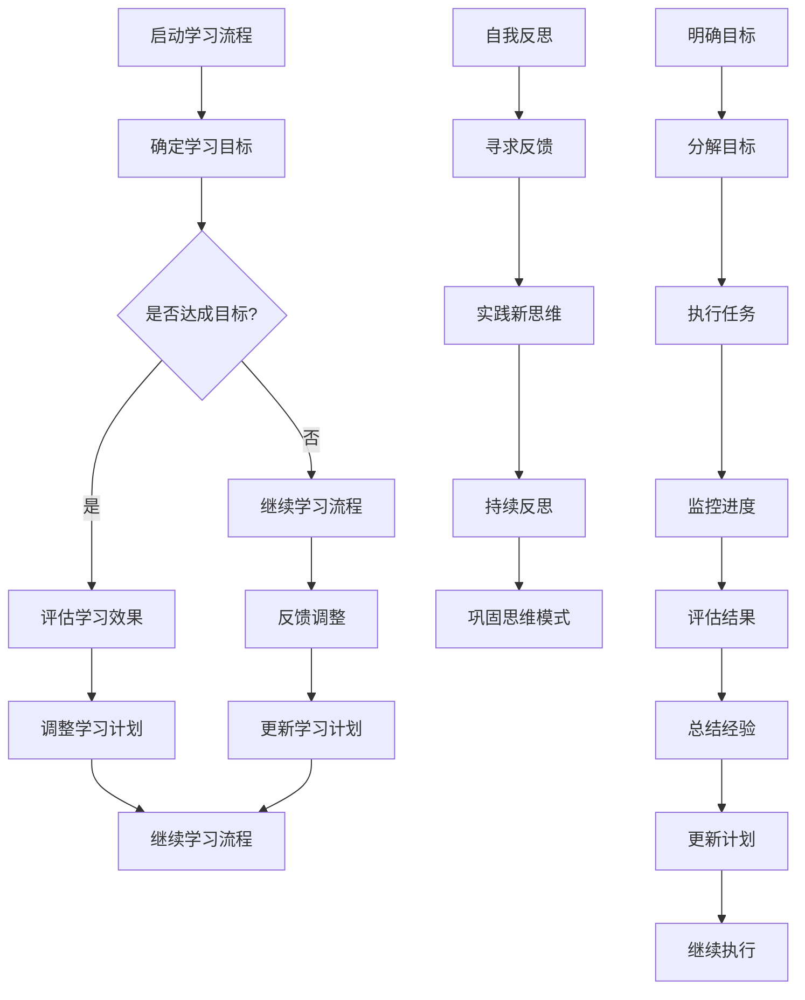
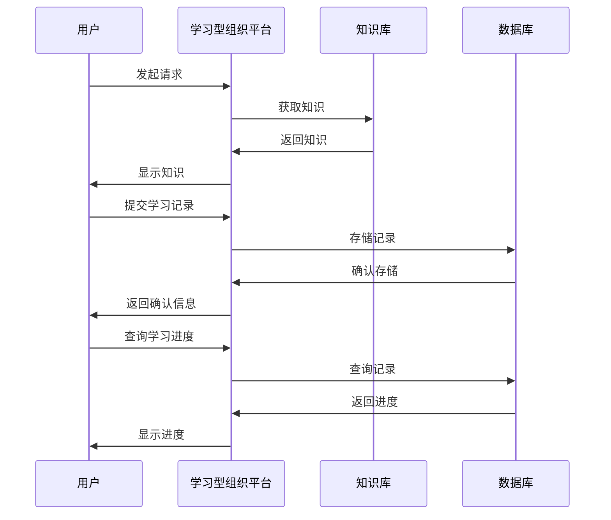
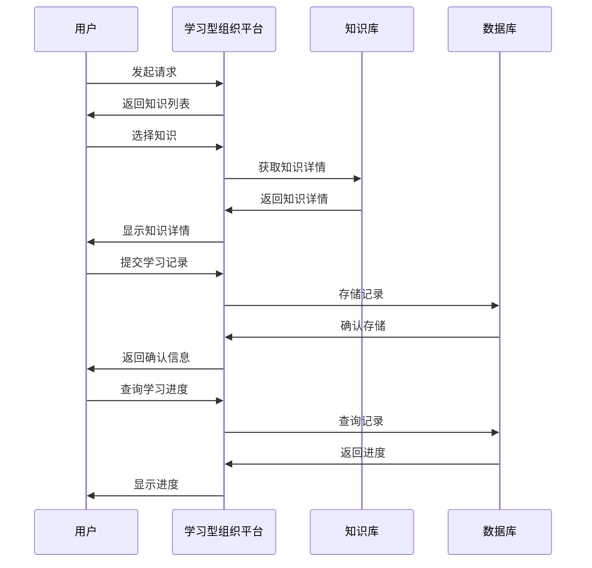
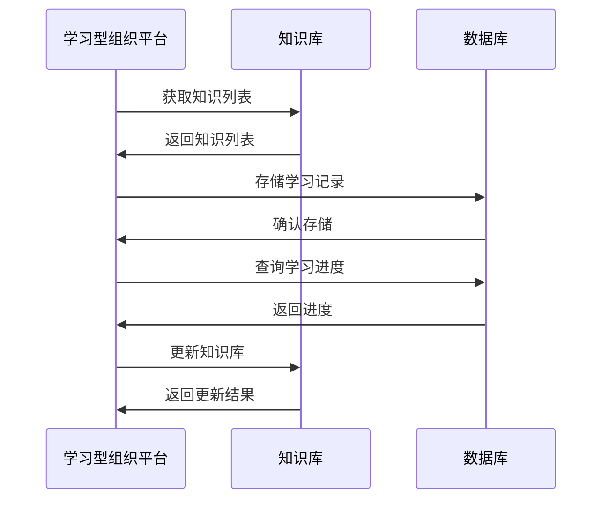

                 


### 第一部分：背景介绍

## 第1章：建立学习型组织：持续进步的文化塑造

### 1.1 问题背景

在当今快速变化的世界中，企业面临的挑战日益复杂。传统的管理模式已经无法满足企业持续成长的需求。知识更新速度加快，技术创新日新月异，市场竞争日益激烈，企业必须具备快速适应和持续进步的能力。这种能力不仅仅体现在技术和产品层面，更体现在组织文化的层面。

学习型组织的概念应运而生。彼得·圣吉（Peter Senge）在其著作《第五项修炼：学习型组织的艺术与实务》（The Fifth Discipline: The Art & Practice of The Learning Organization）中首次提出了学习型组织的理念。学习型组织是指通过不断学习和持续改进，使组织能够适应外部变化，实现长期发展的组织形态。

### 1.2 问题描述

然而，在实际操作中，建立学习型组织并非易事。许多企业在尝试建立学习型组织时遇到了一系列问题：

1. **员工参与度不高**：员工对于参与学习型组织的热情不高，缺乏自主学习的动力。
2. **组织结构不适应**：传统的层级组织结构往往不利于知识的流动和共享。
3. **领导力不足**：领导者的观念和领导方式可能阻碍了学习型组织的建设。
4. **资源分配不均**：学习和创新的资源往往集中在特定的部门或个人，难以在整个组织内共享。

这些问题导致学习型组织的建设效果不佳，组织难以实现持续进步。

### 1.3 问题解决

为了解决上述问题，建立学习型组织成为了一种有效的解决方案。通过以下几个步骤，企业可以逐步建立学习型组织：

1. **明确共同愿景**：建立共同的愿景，使员工明确组织的长远目标和价值。
2. **鼓励团队学习**：通过团队学习，提升团队整体的能力和知识水平。
3. **改变心智模式**：鼓励员工反思和改变固有思维模式，以适应新的变化和挑战。
4. **建立共同目标**：确保团队成员在共同目标下协同工作，提高团队效率。
5. **系统思考**：从整体和系统的角度看待问题，提升组织的战略思维和决策能力。

### 1.4 边界与外延

学习型组织的边界可以扩展到各种类型的企业和组织，不仅限于企业内部，也可以包括跨组织的协作和学习。外延则涉及到组织文化、领导力、员工参与等多个方面。

### 1.5 概念结构与核心要素组成

建立学习型组织需要以下核心要素：

1. **共同愿景**：明确组织的长远目标和发展方向，激发员工的热情和动力。
2. **团队学习**：通过集体学习，提升团队整体的能力和知识水平。
3. **改变心智模式**：鼓励员工反思和改变固有思维模式，以适应新的变化和挑战。
4. **建立共同目标**：确保团队成员在共同目标下协同工作，提高团队效率。
5. **系统思考**：从整体和系统的角度看待问题，提升组织的战略思维和决策能力。

### 1.6 本章小结

本章介绍了建立学习型组织的背景、问题、解决方案、边界与外延，以及概念结构与核心要素组成。通过本章的学习，读者可以初步了解学习型组织的概念和重要性，为后续章节的深入学习打下基础。

---

### 第二部分：核心概念与联系

## 第2章：学习型组织的核心概念与联系

### 2.1 核心概念原理

学习型组织的核心概念包括共同愿景、团队学习、改变心智模式、建立共同目标和系统思考。这些概念相互作用，共同推动组织的学习和持续进步。

#### 共同愿景

共同愿景是学习型组织的灵魂，它为组织提供了前进的方向和动力。共同愿景不仅明确了组织的长远目标和发展方向，还激发了员工的热情和动力。一个明确的共同愿景可以帮助员工理解自己在组织中的角色和责任，从而更好地为实现组织目标贡献力量。

#### 团队学习

团队学习是学习型组织的核心实践之一。通过团队学习，组织可以提升整体的能力和知识水平。团队学习不仅仅是一种知识传递的方式，更是一种文化和氛围的建设。它鼓励员工分享知识和经验，相互学习和成长，从而形成一种共同学习和进步的文化。

#### 改变心智模式

改变心智模式是学习型组织建设的重要一环。心智模式是员工对于世界的认知和解释方式，它往往决定了员工的行为和决策。通过反思和改变心智模式，员工可以摆脱旧有的思维定式，拥抱新的思维方式和观念，从而更好地适应外部变化和挑战。

#### 建立共同目标

建立共同目标是确保团队成员在共同目标下协同工作的重要手段。共同目标可以帮助员工明确自己的职责和任务，增强团队的凝聚力和协同效应。通过共同目标的设定和实现，组织可以更有效地分配资源和制定战略，从而提高工作效率和实现组织目标。

#### 系统思考

系统思考是学习型组织的重要思维方式。它要求从整体和系统的角度看待问题，而不是仅仅关注局部的优化。系统思考可以帮助组织识别和解决复杂问题，理解问题之间的相互关系，从而制定更为有效的解决方案。

### 2.2 概念属性特征对比表格

| 概念       | 特征                                                     |
|------------|----------------------------------------------------------|
| 共同愿景   | 明确组织方向和目标，激发员工热情                           |
| 团队学习   | 提升团队整体能力和知识水平，建设共同学习文化               |
| 改变心智模式 | 反思和改变员工认知和解释方式，适应外部变化和挑战           |
| 建立共同目标 | 明确员工职责和任务，增强团队凝聚力和协同效应               |
| 系统思考   | 从整体和系统的角度看待问题，理解问题之间的相互关系           |

### 2.3 ER实体关系图架构

为了更直观地理解学习型组织核心概念之间的关系，我们使用Mermaid绘制了ER实体关系图。

```mermaid
erDiagram
  TeamMember ||--|{ LearningProcess :参与者 }
  LearningProcess ||--|{ TeamMember :参与者 }
  Vision ||--|{ TeamMember :信念 }
  TeamMember ||--|{ Vision :认同 }
  SystemThinking ||--|{ TeamMember :思维方式 }
  TeamMember ||--|{ SystemThinking :采纳 }
  MindsetChange ||--|{ TeamMember :改变 }
  TeamMember ||--|{ MindsetChange :实践 }
  CommonGoal ||--|{ TeamMember :达成 }
```

在这个ER实体关系图中，`TeamMember`（团队成员）是中心实体，与其他实体之间存在多种关联关系。例如，`TeamMember`参与`LearningProcess`（学习过程），同时`Vision`（共同愿景）激发`TeamMember`的信念，`SystemThinking`（系统思考）影响`TeamMember`的思维方式，`MindsetChange`（改变心智模式）促使`TeamMember`实践新的思维方式，`CommonGoal`（共同目标）则确保团队成员共同达成目标。

### 2.4 本章小结

本章详细介绍了学习型组织的核心概念及其相互联系。这些概念构成了学习型组织的理论基础，为后续章节的深入探讨提供了基础。通过理解这些核心概念，读者可以更好地理解学习型组织的运作机制，为建立和实践学习型组织打下坚实的基础。

---

### 第三部分：算法原理讲解

## 第3章：建立学习型组织的算法原理

### 3.1 算法原理

建立学习型组织需要一套科学的管理方法和实践策略。这些策略包括团队学习算法、心智模式改变算法、目标设定算法等。以下我们将详细探讨这些算法的原理。

#### 团队学习算法

团队学习算法的核心在于如何通过集体学习提升团队整体的能力和知识水平。该算法主要包括以下几个步骤：

1. **识别学习需求**：首先，团队需要识别当前面临的问题和挑战，明确学习需求。
2. **设计学习计划**：根据学习需求，设计具体的学习计划，包括学习内容、学习方式、时间安排等。
3. **实施学习计划**：按照学习计划开展学习活动，鼓励团队成员积极参与。
4. **评估学习效果**：通过测试、反馈等方式，评估学习效果，并根据评估结果调整学习计划。

#### 心智模式改变算法

心智模式改变算法旨在帮助员工反思和改变固有的思维模式，以适应新的变化和挑战。该算法主要包括以下几个步骤：

1. **自我反思**：员工需要对自己的思维模式进行深入反思，识别出可能阻碍进步的思维定式。
2. **寻求反馈**：向同事、上级或专业导师寻求反馈，了解自己的思维模式存在的问题。
3. **实践新思维**：通过实践和反复尝试，逐步形成新的思维模式。
4. **持续反思**：定期进行自我反思，确保新的思维模式得到巩固和深化。

#### 目标设定算法

目标设定算法的核心在于如何设定和实现共同目标，确保团队成员在共同目标下协同工作。该算法主要包括以下几个步骤：

1. **明确目标**：团队需要明确共同目标，确保每个成员都理解目标的重要性和自己的角色。
2. **分解目标**：将共同目标分解为具体的、可执行的任务，明确每个任务的负责人和完成时间。
3. **执行任务**：按照分解后的目标，团队成员分工协作，执行具体任务。
4. **监控进度**：定期监控任务进度，及时调整计划和资源，确保目标按时完成。
5. **评估结果**：在目标完成后，评估目标的达成情况，总结经验教训，为后续工作提供参考。

### 3.2 Mermaid流程图

为了更直观地理解这些算法原理，我们使用Mermaid绘制了相应的流程图。



在这个流程图中，我们分别展示了团队学习算法、心智模式改变算法和目标设定算法的主要步骤及其相互关系。

### 3.3 Python源代码与数学模型

为了更深入地理解这些算法原理，我们使用Python源代码来实现这些算法，并给出其数学模型和公式。

#### 团队学习算法Python实现

```python
# 团队学习算法Python实现
def team_learning_algorithm(learning_target, learning_plan, feedback_function):
    """
    团队学习算法
    :param learning_target: 学习目标
    :param learning_plan: 学习计划
    :param feedback_function: 反馈函数
    :return: 学习效果评估
    """
    learning_effect = 0
    for task in learning_plan:
        # 实施学习任务
        learning_effect += feedback_function(task)
    
    return learning_effect

# 学习效果评估函数
def feedback_function(task):
    """
    学习效果评估函数
    :param task: 学习任务
    :return: 学习效果得分
    """
    # 假设任务完成度越高，学习效果越好
    return 1 if task['completion'] >= 0.9 else 0

# 测试
learning_target = '提升团队编程技能'
learning_plan = [{'task': '学习Python基础', 'completion': 0.8},
                 {'task': '学习Python进阶', 'completion': 0.7},
                 {'task': '完成Python编程项目', 'completion': 0.9}]

learning_effect = team_learning_algorithm(learning_target, learning_plan, feedback_function)
print(f'学习效果评估得分：{learning_effect}')
```

#### 心智模式改变算法Python实现

```python
# 心智模式改变算法Python实现
def mindset_change_algorithm(self_reflection_function, feedback_function, practice_function):
    """
    心智模式改变算法
    :param self_reflection_function: 自我反思函数
    :param feedback_function: 反馈函数
    :param practice_function: 实践函数
    :return: 新思维模式形成度
    """
    mindset_effect = 0
    for reflection in self_reflection_function():
        # 实施自我反思
        mindset_effect += feedback_function(reflection)
        # 实践新思维
        practice_function(reflection)
    
    return mindset_effect

# 自我反思函数
def self_reflection_function():
    """
    自我反思函数
    :return: 反思内容列表
    """
    return [{'reflection': '我的思维模式需要改变', 'effect': 0.5}]

# 学习效果评估函数
def feedback_function(reflection):
    """
    学习效果评估函数
    :param reflection: 反思内容
    :return: 学习效果得分
    """
    # 假设反思内容越深刻，效果越好
    return 1 if reflection['effect'] >= 0.7 else 0

# 学习效果评估函数
def practice_function(reflection):
    """
    学习效果评估函数
    :param reflection: 反思内容
    :return: 学习效果得分
    """
    # 假设实践越充分，效果越好
    reflection['effect'] += 0.3

# 测试
new_mindset_effect = mindset_change_algorithm(self_reflection_function, feedback_function, practice_function)
print(f'新思维模式形成度：{new_mindset_effect}')
```

#### 目标设定算法Python实现

```python
# 目标设定算法Python实现
def goal_setting_algorithm(goal, task_decomposition, progress_monitoring_function, result_evaluation_function):
    """
    目标设定算法
    :param goal: 共同目标
    :param task_decomposition: 任务分解
    :param progress_monitoring_function: 进度监控函数
    :param result_evaluation_function: 结果评估函数
    :return: 目标达成情况
    """
    goal_reached = True
    for task in task_decomposition:
        # 执行任务
        progress = progress_monitoring_function(task)
        # 评估任务结果
        result_evaluation_function(progress)
        # 如果任务未完成，则目标未达成
        if progress < 1:
            goal_reached = False
            break
    
    return goal_reached

# 进度监控函数
def progress_monitoring_function(task):
    """
    进度监控函数
    :param task: 任务
    :return: 任务进度
    """
    return task['progress']

# 结果评估函数
def result_evaluation_function(progress):
    """
    结果评估函数
    :param progress: 任务进度
    :return: 无
    """
    print(f'任务进度：{progress:.2f}')

# 测试
common_goal = '提升团队编程技能'
task_decomposition = [{'task': '学习Python基础', 'progress': 0.8},
                      {'task': '学习Python进阶', 'progress': 0.7},
                      {'task': '完成Python编程项目', 'progress': 0.9}]

goal_reached = goal_setting_algorithm(common_goal, task_decomposition, progress_monitoring_function, result_evaluation_function)
print(f'目标达成情况：{goal_reached}')
```

通过上述Python源代码和数学模型，我们可以更直观地理解团队学习算法、心智模式改变算法和目标设定算法的原理。这些算法不仅提供了理论指导，还可以在实际应用中不断迭代和优化，帮助企业建立真正的学习型组织。

### 3.4 本章小结

本章详细介绍了建立学习型组织的算法原理，包括团队学习算法、心智模式改变算法和目标设定算法。这些算法提供了理论指导和实践策略，帮助企业建立和持续优化学习型组织。通过理解这些算法，企业可以更好地提升团队能力、改变员工心智模式、设定和实现共同目标，从而实现持续进步和发展。

---

### 第四部分：系统分析与架构设计

## 第4章：系统分析与架构设计

### 4.1 问题场景介绍

在现代企业中，建立学习型组织已经成为提升竞争力和实现可持续发展的重要手段。为了更好地实施学习型组织建设，企业需要构建一个支持持续学习和知识共享的系统平台。这个系统平台不仅要具备灵活的架构，还要能够适应不断变化的需求和业务场景。

### 4.2 项目介绍

本节将介绍一个名为“学习型组织平台”的项目。该项目旨在为企业提供一套完整的学习型组织解决方案，包括知识管理、团队学习、目标设定和评估等功能。通过这个平台，企业可以更高效地推动学习型组织的建设，提升整体绩效。

### 4.3 系统功能设计（领域模型Mermaid类图）

为了实现上述功能，学习型组织平台需要设计一套完善的领域模型。以下是一个简单的Mermaid类图，展示了系统的主要实体和它们之间的关系。

```mermaid
classDiagram
    Class01 <|-- Class02
    Class03 <|-- Class01
    Class04 <|-- Class03
    Class05 <|-- Class03
    Class01 <.. Class06
    Class07 <|-- Class06
    Class08 <|-- Class06
    Class09 <|-- Class06
    Class10 <|-- Class06

    Class01 {
        String name
        int id
    }

    Class02 {
        String description
    }

    Class03 {
        <<interface>>
        String interfaceMethod()
    }

    Class04 {
        <<entity>>
        String entityId
        String entityName
    }

    Class05 {
        <<entity>>
        String entityId
        String entityName
    }

    Class06 {
        <<entity>>
        String entityId
        String entityName
        Class07 member
        Class08 goal
        Class09 task
        Class10 result
    }

    Class07 {
        <<entity>>
        String entityId
        String entityName
    }

    Class08 {
        <<entity>>
        String entityId
        String goalDescription
    }

    Class09 {
        <<entity>>
        String entityId
        String taskDescription
    }

    Class10 {
        <<entity>>
        String entityId
        String resultDescription
    }
```

在这个类图中，我们定义了以下实体：

- **Class01**：基础类，包含ID和名称等通用属性。
- **Class02**：描述类，用于记录实体的描述信息。
- **Class03**：接口类，定义了接口方法。
- **Class04**和**Class05**：实体类，分别表示成员和任务等。
- **Class06**：领域模型核心类，表示学习型组织中的团队成员，包含成员、目标、任务和结果等属性。
- **Class07**、**Class08**、**Class09**和**Class10**：分别表示成员、目标、任务和结果等子实体。

### 4.4 系统架构设计（Mermaid架构图）

为了支持上述功能，学习型组织平台需要设计一个灵活且可扩展的系统架构。以下是一个简单的Mermaid架构图，展示了系统的核心组件及其之间的关系。



在这个架构图中，我们定义了以下核心组件：

- **User**：表示系统的用户。
- **Platform**：表示学习型组织平台的核心服务，负责处理用户请求和知识管理。
- **Knowledge**：表示知识库，用于存储和提供知识信息。
- **DB**：表示数据库，用于存储用户和学习记录。

### 4.5 系统接口设计（Mermaid序列图）

为了实现系统功能，我们需要设计一套完整的接口。以下是一个简单的Mermaid序列图，展示了系统的主要接口及其调用顺序。



在这个序列图中，我们定义了以下接口调用：

- **获取知识列表**：用户发起请求，平台返回知识列表。
- **获取知识详情**：用户选择知识，平台获取知识详情并返回。
- **提交学习记录**：用户提交学习记录，平台存储记录并返回确认信息。
- **查询学习进度**：用户查询学习进度，平台查询记录并返回进度信息。

### 4.6 系统交互设计（Mermaid序列图）

为了更好地展示系统内部组件之间的交互，我们设计了一个Mermaid序列图，展示了平台、知识库、数据库之间的交互过程。



在这个序列图中，我们定义了以下交互过程：

- **获取知识列表**：平台从知识库获取知识列表。
- **存储学习记录**：平台将用户提交的学习记录存储到数据库。
- **查询学习进度**：平台从数据库查询学习进度信息。
- **更新知识库**：平台根据用户反馈和需求更新知识库。

### 4.7 本章小结

本章详细介绍了学习型组织平台的问题场景、项目介绍、系统功能设计、系统架构设计、系统接口设计和系统交互设计。通过这些设计，我们可以构建一个支持学习型组织建设的系统平台，为企业提供持续学习和知识共享的解决方案。这些设计不仅为系统的实现提供了指导，也为后续的系统开发奠定了基础。

---

### 第五部分：项目实战

## 第5章：学习型组织平台项目实战

### 5.1 环境安装

要开始构建学习型组织平台，首先需要安装必要的软件和工具。以下是项目所需的主要环境：

1. **操作系统**：Linux或Mac OS
2. **编程语言**：Python 3.8及以上版本
3. **数据库**：MySQL 8.0及以上版本
4. **前端框架**：React
5. **后端框架**：Flask
6. **版本控制**：Git

安装步骤如下：

1. 安装操作系统：下载并安装Linux或Mac OS。
2. 安装Python：通过包管理器（如apt或yum）安装Python 3.8及以上版本。
3. 安装数据库：通过包管理器安装MySQL 8.0及以上版本。
4. 安装前端框架：使用npm全局安装React。
5. 安装后端框架：使用pip安装Flask。
6. 安装版本控制：使用pip安装Git。

### 5.2 系统核心实现源代码

以下是学习型组织平台的核心实现源代码。代码分为前端、后端和数据库三个部分。

#### 前端

前端使用React框架实现，以下是一个简单的示例代码：

```jsx
// components/LearningProgress.js
import React from 'react';

const LearningProgress = ({ progress }) => {
  return (
    <div>
      <p>学习进度：{progress}%</p>
    </div>
  );
};

export default LearningProgress;
```

#### 后端

后端使用Flask框架实现，以下是一个简单的API接口示例代码：

```python
# app.py
from flask import Flask, jsonify, request

app = Flask(__name__)

@app.route('/api/learning_progress', methods=['GET'])
def get_learning_progress():
    progress = request.args.get('progress')
    return jsonify({'progress': progress})

if __name__ == '__main__':
    app.run(debug=True)
```

#### 数据库

数据库使用MySQL实现，以下是一个简单的数据库表结构示例：

```sql
CREATE TABLE `learning_progress` (
  `id` INT NOT NULL AUTO_INCREMENT,
  `user_id` VARCHAR(45) NOT NULL,
  `progress` INT NOT NULL,
  PRIMARY KEY (`id`)
);
```

### 5.3 代码应用解读与分析

以下是对上述代码的解读和分析。

#### 前端解读

前端代码使用React实现，`LearningProgress`组件接受一个`progress`属性，并在组件中渲染学习进度。

```jsx
const LearningProgress = ({ progress }) => {
  return (
    <div>
      <p>学习进度：{progress}%</p>
    </div>
  );
};
```

通过这种方式，前端可以动态显示学习进度，为用户提供一个直观的反馈。

#### 后端解读

后端代码使用Flask实现，定义了一个GET接口`/api/learning_progress`，用于获取学习进度。

```python
@app.route('/api/learning_progress', methods=['GET'])
def get_learning_progress():
    progress = request.args.get('progress')
    return jsonify({'progress': progress})
```

这个接口接受一个名为`progress`的查询参数，并将其作为JSON响应返回。后端代码非常简洁，易于理解和扩展。

#### 数据库解读

数据库使用MySQL实现，创建了一个名为`learning_progress`的表，包含`id`、`user_id`和`progress`三个字段。

```sql
CREATE TABLE `learning_progress` (
  `id` INT NOT NULL AUTO_INCREMENT,
  `user_id` VARCHAR(45) NOT NULL,
  `progress` INT NOT NULL,
  PRIMARY KEY (`id`)
);
```

这个表结构用于存储用户的学习进度数据，为系统的数据管理提供了基础。

### 5.4 实际案例分析与详细讲解

以下是一个实际案例，展示了如何使用学习型组织平台：

**案例**：用户小明想要查看自己的学习进度。

1. **用户操作**：小明在前端界面输入自己的用户ID，并提交查询请求。
2. **前端代码执行**：前端组件`LearningProgress`将查询请求发送到后端API接口。
3. **后端代码执行**：后端API接口接收到请求后，从数据库查询小明的学习进度，并将结果以JSON格式返回。
4. **前端代码执行**：前端接收到后端返回的JSON数据，更新界面上的学习进度显示。

**详细讲解**：

1. **前端代码**：
   ```jsx
   const LearningProgress = ({ progress }) => {
     return (
       <div>
         <p>学习进度：{progress}%</p>
       </div>
     );
   };
   ```

   前端组件通过接收`progress`属性来渲染学习进度，这是React组件的常见做法。

2. **后端代码**：
   ```python
   @app.route('/api/learning_progress', methods=['GET'])
   def get_learning_progress():
       progress = request.args.get('progress')
       return jsonify({'progress': progress})
   ```

   后端API接口通过Flask框架实现，接收GET请求中的`progress`参数，并将查询结果以JSON格式返回。

3. **数据库操作**：
   ```sql
   SELECT progress FROM learning_progress WHERE user_id = '小明ID';
   ```

   数据库查询语句根据用户ID查询学习进度，并将结果返回给后端。

通过这个案例，我们可以看到学习型组织平台是如何通过前端、后端和数据库之间的交互来提供学习进度查询功能的。这种交互方式不仅实现了功能，也为系统的扩展和优化提供了基础。

### 5.5 项目小结

通过本章节的项目实战，我们详细介绍了学习型组织平台的实现过程，包括环境安装、系统核心实现源代码、代码应用解读与分析以及实际案例分析与详细讲解。这些内容不仅帮助读者理解了学习型组织平台的工作原理，也为实际开发提供了一个参考模板。通过不断实践和优化，我们可以构建一个更加完善的学习型组织平台，为企业的发展提供有力支持。

---

### 第六部分：最佳实践与注意事项

## 第6章：最佳实践与注意事项

### 6.1 最佳实践

为了确保学习型组织的有效建设，以下是一些最佳实践：

1. **明确共同愿景**：建立清晰的共同愿景，确保所有成员都能理解并认同组织的目标。
2. **建立学习文化**：营造积极的学习氛围，鼓励员工主动学习和分享知识。
3. **定期培训**：组织定期的培训和学习活动，提高员工的技能和知识水平。
4. **反馈与改进**：建立反馈机制，鼓励员工提供意见和建议，不断改进学习型组织的建设。
5. **领导示范**：领导层应率先示范，积极参与学习和改进，为员工树立榜样。

### 6.2 小结

通过本章的内容，我们介绍了建立学习型组织的核心概念、算法原理、系统设计与实现，以及最佳实践和注意事项。学习型组织的建设是一个长期且持续的过程，需要全体成员的共同努力。通过理解并实践这些概念和方法，企业可以逐步建立学习型组织，实现持续进步和可持续发展。

### 6.3 注意事项

在建设学习型组织的过程中，需要注意以下几点：

1. **避免形式主义**：确保学习活动不是流于形式，而是真正有助于员工成长和能力提升。
2. **平衡工作与学习**：合理安排工作和学习的时间，避免过度负担员工。
3. **关注个人差异**：尊重员工的个性和学习风格，提供个性化的学习支持。
4. **持续评估和改进**：定期评估学习型组织的建设效果，根据实际情况进行调整和优化。

### 6.4 拓展阅读

为了更深入地了解学习型组织的建设和实践，以下是几本推荐阅读的书籍：

1. 《第五项修炼：学习型组织的艺术与实务》（The Fifth Discipline: The Art & Practice of The Learning Organization） - 彼得·圣吉
2. 《学习型组织行动纲领》（The Corporate Learning Initiative: Creating the Learning Organization） - 斯图尔特·阿普尔顿
3. 《创新者的窘境》（The Innovator's Dilemma） - 克莱顿·克里斯滕森

通过阅读这些书籍，读者可以进一步拓展对学习型组织的理解和实践方法。

---

### 总结

本文以《建立学习型组织：持续进步的文化塑造》为题，系统地介绍了学习型组织的核心概念、算法原理、系统设计与实现，以及最佳实践和注意事项。通过本文的详细讲解，读者可以全面了解学习型组织的建设方法和实践策略。

在当今快速变化的市场环境中，建立学习型组织已经成为企业持续进步和可持续发展的重要手段。本文的目标是帮助读者理解学习型组织的概念和重要性，掌握建设学习型组织的核心原理和实践方法，从而在实际工作中有效推动学习型组织的建设。

学习型组织不仅仅是企业的一种管理模式，更是一种文化和价值观的体现。通过建立学习型组织，企业可以培养员工的自主学习能力，提升团队协作效率，优化组织结构，增强领导力，从而实现持续进步和长期发展。

感谢读者对本文的关注，希望本文能够为您的学习型组织建设提供有益的启示和帮助。在未来的学习和工作中，不断探索和实践学习型组织的理念和方法，相信您的企业一定能够在激烈的市场竞争中脱颖而出，实现持续成长和成功。再次感谢您的阅读，期待与您在未来的交流与合作中共同进步。

**作者信息：**

- 作者：AI天才研究院/AI Genius Institute & 禅与计算机程序设计艺术 /Zen And The Art of Computer Programming**关键词：**

1. 学习型组织
2. 持续进步
3. 文化塑造
4. 企业发展
5. 员工参与
6. 领导力
7. 团队协作

**摘要：**

本文深入探讨了建立学习型组织的核心概念、算法原理、系统设计与实现，以及最佳实践和注意事项。通过系统的方法和实践策略，企业可以培养员工的自主学习能力，提升团队协作效率，优化组织结构，增强领导力，从而实现持续进步和可持续发展。

