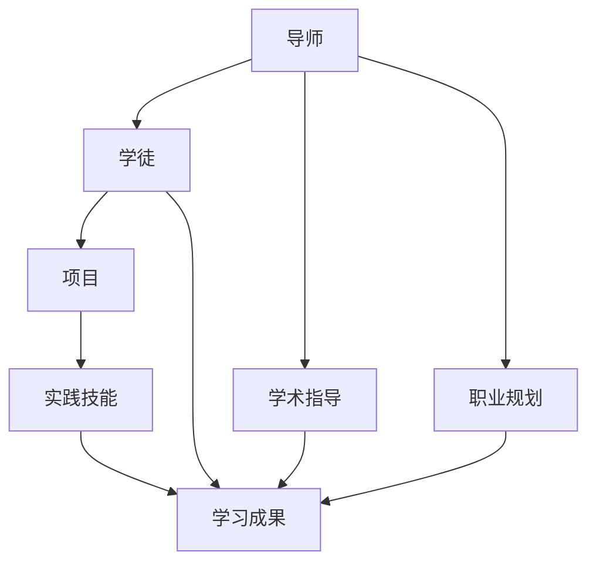
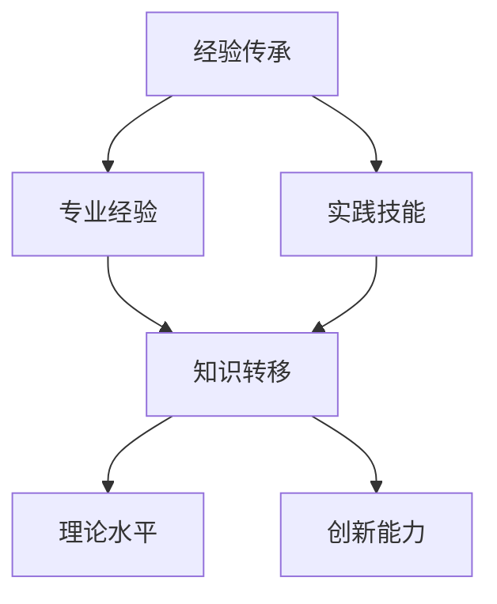
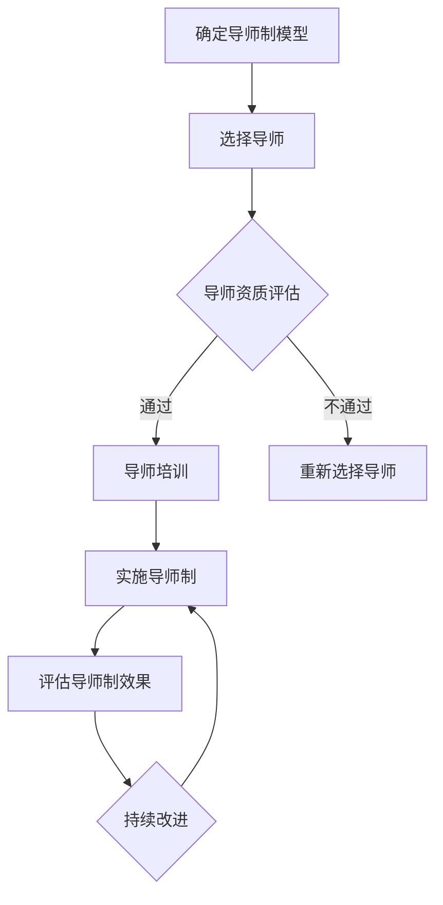
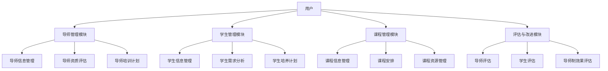
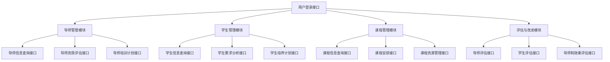
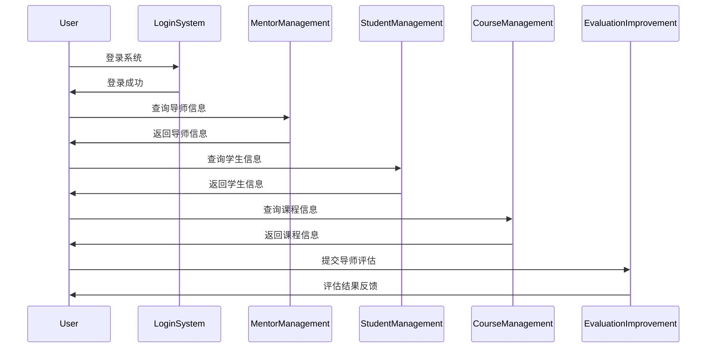

                 

### 建立导师制：促进经验传承和人才培养

> 关键词：导师制、经验传承、人才培养、教育体系

> 摘要：本文旨在探讨导师制的核心概念、理论基础及其在促进经验传承和人才培养中的重要作用。通过分析导师制的起源与发展、核心概念与模型、以及其在不同教育阶段的实践，本文提出了建立有效导师制的策略和实施方法。文章旨在为教育工作者和决策者提供理论和实践指导，以推动教育质量的提升和人才培养的优化。

### 目录大纲

1. **导师制的核心概念与理论基础**
   - **第1章：导师制的起源与发展**
     - 1.1 导师制的定义与历史背景
     - 1.2 导师制在现代教育体系中的地位
     - 1.3 导师制的优势与挑战
   - **第2章：导师制的核心概念与模型**
     - 2.1 导师的角色与职责
     - 2.2 导师与学徒的关系模型
     - 2.3 导师制模型的类型与适用范围
   - **第3章：导师制在人才培养中的作用**
     - 3.1 经验传承与知识转移
     - 3.2 职业发展与个人成长
     - 3.3 团队协作与组织文化

2. **建立有效的导师制体系**
   - **第4章：制定导师制计划与策略**
     - 4.1 设定导师制目标
     - 4.2 选择合适的导师
     - 4.3 建立导师团队
   - **第5章：导师制的实施与监督**
     - 5.1 导师培训与指导
     - 5.2 学徒的培养与评估
     - 5.3 沟通与反馈机制
   - **第6章：导师制的评估与改进**
     - 6.1 导师制的评估指标
     - 6.2 导师制的改进与优化
     - 6.3 持续发展与创新

3. **导师制在不同教育阶段的实践与应用**
   - **第7章：高等教育中的导师制实践**
     - 7.1 硕士研究生导师制
     - 7.2 博士研究生导师制
   - **第8章：职业教育中的导师制实践**
     - 8.1 技能培训中的导师制
     - 8.2 行业导师制
   - **第9章：中小学教育中的导师制探索**
     - 9.1 小学导师制
     - 9.2 中学导师制

4. **全球视角下的导师制发展**
   - **第10章：国际导师制的研究与实践**
     - 10.1 国际导师制的现状
     - 10.2 国际导师制的经验借鉴
   - **第11章：跨文化导师制**
     - 11.1 跨文化导师制的挑战与机遇
     - 11.2 跨文化导师制的案例分析

5. **结论**
   - 导师制的重要性与未来展望

---

### 第一部分：导师制的核心概念与理论基础

#### 第1章：导师制的起源与发展

##### 1.1 导师制的定义与历史背景

导师制（Mentorship）是一种通过经验丰富、知识渊博的导师对学徒进行指导、支持和培养的教育模式。它起源于古希腊的苏格拉底教学法，随后在古代罗马和中世纪的欧洲逐渐发展，成为一种重要的教育形式。在古代，导师制主要用于传授职业知识和技能，如医学、法律和手工艺。

在现代社会，导师制得到了进一步的发展和应用。特别是在高等教育和研究领域，导师制成为培养学生创新能力、实践能力和综合素质的重要手段。导师制不仅局限于学术指导，还涵盖职业发展、人生规划等多方面。

##### 1.2 导师制在现代教育体系中的地位

导师制在现代教育体系中扮演着重要的角色。它不仅是高等教育的重要组成部分，也是职业培训和企业内部人才培养的重要方式。以下是导师制在现代教育体系中的几个关键地位：

1. **培养学生的综合素质**：导师制通过个性化指导，帮助学生全面发展，培养其批判性思维、解决问题的能力和人际交往技巧。
2. **促进知识转移**：导师的经验和知识可以更有效地传递给学徒，缩短学徒的学习曲线，提高教育质量。
3. **推动学术研究**：在研究生教育和科研领域，导师制是培养学生进行原创性研究、发表高质量论文的重要途径。
4. **增强就业竞争力**：导师制的职业指导和支持，有助于学生更好地适应职场环境，提升就业竞争力。

##### 1.3 导师制的优势与挑战

**优势**：

- **个性化培养**：导师制可以针对学生的个人特点和需求进行个性化指导，提高教育的有效性。
- **知识传承**：导师制有助于经验丰富的教师将专业知识和实践技能传递给新一代。
- **职业发展支持**：导师可以为学生提供职业规划、求职技巧等方面的支持，提高学生的职业竞争力。
- **团队协作与组织文化**：导师制有助于建立紧密的师生关系，促进团队协作和良好的组织文化。

**挑战**：

- **资源分配**：建立有效的导师制需要大量的人力、物力和财力投入，如何合理配置资源是一个挑战。
- **导师质量**：导师的专业水平和指导能力直接影响教育质量，因此对导师的选拔和培训至关重要。
- **管理复杂度**：导师制涉及师生关系的维护、评估和反馈机制等，管理复杂度较高。

---

在接下来的章节中，我们将进一步探讨导师制的核心概念、模型及其在人才培养中的作用。通过深入分析，我们希望为教育工作者和决策者提供有价值的参考和指导。

#### 第2章：导师制的核心概念与模型

##### 2.1 导师的角色与职责

导师在导师制中扮演着关键角色，是学徒学习和成长的引路人。导师的职责包括但不限于以下几个方面：

1. **学术指导**：导师需要为学徒提供学术上的指导，包括课程选择、学术研究方法、学术论文撰写等。
2. **职业规划**：导师应帮助学徒规划职业道路，提供就业指导和建议。
3. **生活辅导**：导师不仅在学术上指导学徒，还应关心其生活状况，提供心理支持和生活建议。
4. **技能培养**：导师需传授专业知识和技能，帮助学徒提升实践能力。
5. **沟通与反馈**：导师需要与学徒保持定期沟通，提供反馈，促进学徒的持续成长。

**导师的角色定位**：

- **引导者**：导师引导学徒探索未知领域，激发其好奇心和求知欲。
- **支持者**：导师在学徒遇到困难时提供支持，帮助其克服挫折。
- **合作者**：导师与学徒共同完成学术研究和项目开发，形成良好的合作关系。
- **榜样**：导师的言行举止对学徒有重要影响，导师应成为学徒的榜样。

##### 2.2 导师与学徒的关系模型

导师与学徒的关系是导师制成功的关键。这种关系不仅仅是简单的指导与被指导关系，而是一种基于信任、尊重和支持的合作关系。以下是导师与学徒关系模型的关键要素：

1. **信任**：信任是导师与学徒关系的基石。导师应真诚地对待学徒，保护其隐私，建立信任基础。
2. **尊重**：导师应尊重学徒的意见和选择，鼓励其独立思考和自主学习。
3. **沟通**：导师与学徒应保持定期沟通，通过面对面的交流、电子邮件或其他沟通工具，确保信息的畅通。
4. **支持**：导师应在学徒遇到困难时提供帮助和支持，包括学术上的指导和生活上的关怀。
5. **反馈**：导师应给予学徒及时的反馈，帮助其了解自己的优势和不足，促进其持续改进。

##### 2.3 导师制模型的类型与适用范围

导师制模型根据导师与学徒的关系和目的可以分为以下几种类型：

1. **传统导师制**：这种模式中，导师与学徒建立长期的、一对一的关系。适用于研究生教育和职业培训，有助于深入的知识传授和个人成长。

2. **项目导师制**：导师与学徒的关系基于特定的项目或课题。适用于科研项目、企业培训和短期培训，有助于快速提升技能和解决实际问题。

3. **双导师制**：在这种模式下，学徒同时受到两位导师的指导，一位是学术导师，另一位是行业导师。适用于跨学科研究和企业内部人才培养，有助于综合能力的提升。

**适用范围**：

- **高等教育**：导师制在研究生教育和博士生培养中广泛应用，有助于学术研究和职业发展。
- **职业教育**：导师制在技能培训和职业指导中发挥重要作用，有助于提升就业竞争力。
- **企业培训**：导师制是企业内部人才培养的重要方式，有助于提升员工的职业能力和企业整体竞争力。

通过以上分析，我们可以看出，导师制作为一种重要的教育模式，具有丰富的内涵和多样的实践形式。在接下来的章节中，我们将进一步探讨导师制在人才培养中的具体作用和实施方法。

#### 第3章：导师制在人才培养中的作用

##### 3.1 经验传承与知识转移

导师制在经验传承和知识转移中扮演着至关重要的角色。导师通过自身的经验和知识，指导学徒掌握专业知识和实践技能，从而实现知识的传递和能力的提升。

**经验的重要性**：

- **专业知识的传授**：导师通过个人经验和学术研究，将专业领域的前沿知识和研究成果传授给学徒，帮助其建立扎实的专业基础。
- **实践技能的培养**：导师通过实际操作和案例分析，帮助学徒掌握实践技能，提高解决实际问题的能力。

**导师在知识转移中的作用**：

- **个性化指导**：导师针对学徒的个人特点和需求，提供个性化的指导和培训，确保知识的有效传递。
- **案例教学**：导师通过实际案例的讲解和分析，帮助学徒将理论知识应用到实践中，提高其解决问题的能力。
- **跨学科交流**：导师在跨学科项目中发挥桥梁作用，促进不同学科领域的知识交流和融合，拓宽学徒的视野。

##### 3.2 职业发展与个人成长

导师制在职业发展和个人成长中具有显著的促进作用。导师不仅提供学术和技能上的指导，还在职业规划和人生发展方面给予支持。

**导师在职业发展中的作用**：

- **职业规划**：导师帮助学徒分析职业兴趣和优势，制定职业发展规划，提供就业指导和求职建议。
- **资源链接**：导师利用自身的人脉和资源，为学徒提供实习、就业和职业发展的机会，拓宽其职业发展路径。
- **技能提升**：导师通过专业培训和实际操作，提升学徒的职业技能，增强其在职场中的竞争力。

**导师对个人成长的促进作用**：

- **自我认知**：导师通过定期交流和心理辅导，帮助学徒更好地认识自己，提升自我认知能力。
- **心理健康**：导师关注学徒的心理健康，提供心理支持和情感关怀，帮助其克服学习和生活中的压力。
- **人生规划**：导师帮助学徒制定人生规划，提供人生发展指导，促进其全面发展。

##### 3.3 团队协作与组织文化

导师制不仅对个人成长和职业发展有积极作用，还对团队协作和组织文化的培育具有重要意义。

**导师制对团队协作的影响**：

- **培养协作精神**：导师通过团队合作项目，培养学徒的协作精神和团队意识，提高团队整体效能。
- **提升沟通能力**：导师指导学徒进行有效的沟通，促进团队成员之间的信息共享和协作。
- **解决冲突**：导师帮助团队解决冲突，维护团队和谐，提高团队凝聚力。

**导师制与组织文化的培育**：

- **价值观传承**：导师通过言传身教，将组织价值观和职业道德传递给学徒，促进组织文化的传承和培育。
- **创新能力培养**：导师鼓励学徒进行创新思考和实践，推动组织创新文化的形成。
- **职业素养提升**：导师通过指导和培训，提升学徒的职业素养，促进组织文化的健康发展。

通过以上分析，我们可以看出，导师制在经验传承、知识转移、职业发展、个人成长、团队协作和组织文化培育等方面具有重要的作用。在接下来的章节中，我们将探讨如何建立有效的导师制体系，以更好地发挥其在人才培养中的潜力。

### 第二部分：建立有效的导师制体系

#### 第4章：制定导师制计划与策略

##### 4.1 设定导师制目标

制定明确的导师制目标是建立有效导师制的第一步。目标应具体、可衡量、可实现，并与教育机构和学生的需求相一致。以下是如何设定导师制目标的一些指导原则：

1. **明确目标**：目标应具体明确，例如提高学生的研究能力、促进职业发展、提升实践技能等。
2. **可衡量**：目标应具备可衡量的指标，例如完成特定项目、发表学术论文、通过职业认证等。
3. **可实现**：目标应基于现实条件，确保导师和学徒双方都能实现。
4. **与学生需求一致**：目标应与学生的发展需求相一致，确保学生愿意参与并受益于导师制。

**制定导师制计划的步骤**：

1. **评估需求**：分析教育机构和学生的需求，确定导师制的目标。
2. **确定目标**：基于需求评估，设定具体的导师制目标。
3. **制定计划**：制定详细的实施计划，包括导师选拔、培训、指导策略等。
4. **分配资源**：根据计划，合理配置人力资源、时间和资金等资源。

##### 4.2 选择合适的导师

选择合适的导师是导师制成功的关键。以下是一些选择导师的指导原则：

1. **专业素养**：导师应具备丰富的专业知识和实践经验，能够为学生提供高质量的指导。
2. **指导能力**：导师应具备良好的指导能力，能够与学生建立有效的沟通，提供个性化的指导。
3. **职业道德**：导师应具备良好的职业道德，诚实守信，对学生负责。
4. **合作意愿**：导师应具备良好的合作意愿，愿意投入时间和精力参与导师制活动。

**导师选拔流程**：

1. **资格评估**：根据导师的专业背景、工作经验、指导能力等方面进行评估。
2. **面试选拔**：对符合条件的候选人进行面试，了解其指导能力和合作意愿。
3. **试用评估**：导师在试用期内，学生和导师双方可以互相评估，确保匹配度。
4. **正式聘用**：根据试用评估结果，决定是否正式聘用导师。

##### 4.3 建立导师团队

建立导师团队是确保导师制有效实施的重要环节。以下是一些建立导师团队的策略：

1. **多元化团队**：团队中应包括不同学科背景、经验和专业领域的导师，以提供多元化的指导。
2. **明确职责**：为每位导师分配明确的职责，确保导师能够专注于自己的专业领域。
3. **协作机制**：建立导师之间的协作机制，促进信息共享和资源整合，提高团队的整体效能。
4. **定期评估**：定期对导师团队进行评估，确保团队的有效运行和持续改进。

通过以上策略，我们可以建立一个高效、多元化的导师团队，为学生的成长和发展提供全面的指导和支持。在接下来的章节中，我们将探讨如何实施和监督导师制，确保其达到预期目标。

#### 第5章：导师制的实施与监督

##### 5.1 导师培训与指导

导师培训是确保导师能够有效实施导师制的重要环节。以下是一些导师培训的指导原则和策略：

**指导原则**：

1. **专业知识与技能**：导师应具备扎实的专业知识和技能，能够为学生提供高质量的指导。
2. **沟通与反馈**：导师应具备良好的沟通和反馈能力，能够与学生建立有效的沟通，及时给予反馈。
3. **心理辅导**：导师应具备一定的心理学知识，能够提供心理支持和辅导，帮助学生应对学习和生活中的挑战。
4. **职业道德**：导师应具备高尚的职业道德，遵守教育伦理，诚实守信，为学生树立良好的榜样。

**培训策略**：

1. **专业培训**：为导师提供专业知识和技能的培训，包括学术研究、教学方法、项目管理等。
2. **实践指导**：导师参与实际项目或课题研究，通过实践提升指导能力。
3. **经验交流**：组织导师之间的经验交流，分享成功的指导案例和经验，互相学习。
4. **持续学习**：鼓励导师持续学习，关注学术前沿和行业动态，提升自身的专业素养。

##### 5.2 学徒的培养与评估

学徒的培养和评估是导师制实施的核心环节。以下是一些培养和评估的策略：

**培养策略**：

1. **个性化培养**：根据学徒的个人特点和需求，制定个性化的培养计划，确保其全面发展。
2. **实践教学**：通过实际项目和课题研究，培养学徒的实践能力和解决问题的能力。
3. **学术指导**：导师应提供学术上的指导，包括研究方法、学术论文撰写等，提升学徒的学术水平。
4. **职业规划**：导师应帮助学徒规划职业道路，提供就业指导和求职技巧，提升其职业竞争力。

**评估策略**：

1. **定期评估**：定期对学徒进行评估，包括学术表现、实践能力、职业发展等方面，确保其按照培养计划发展。
2. **多元化评估**：采用多种评估方式，如笔试、面试、项目展示等，全面评估学徒的能力和素质。
3. **反馈机制**：建立反馈机制，及时向学徒反馈评估结果，帮助其了解自己的优势和不足，制定改进计划。
4. **发展性评估**：将评估结果用于学徒的发展规划，提供有针对性的指导和培训。

##### 5.3 沟通与反馈机制

沟通与反馈机制是确保导师制有效实施的重要保障。以下是一些建立沟通与反馈机制的策略：

1. **定期会议**：定期召开导师和学徒的会议，讨论学术进展、职业规划等问题，确保信息畅通。
2. **反馈渠道**：建立多种反馈渠道，如面对面交流、电子邮件、在线平台等，方便导师和学徒之间的沟通。
3. **评估反馈**：将评估结果及时反馈给导师和学徒，帮助他们了解进展和改进方向。
4. **个性化反馈**：根据导师和学徒的具体情况，提供个性化的反馈，帮助他们制定改进计划。

通过有效的沟通与反馈机制，导师和学徒可以更好地合作，提高导师制的实施效果。在接下来的章节中，我们将探讨导师制的评估与改进策略，确保其持续发展和优化。

### 第6章：导师制的评估与改进

##### 6.1 导师制的评估指标

导师制的评估指标是衡量导师制实施效果的重要工具。以下是一些常见的评估指标及其设计方法：

1. **学术成果**：评估学生的学术成果，如发表的论文数量和质量、科研成果的转化情况等。
2. **职业发展**：评估学生的职业发展情况，如就业率、岗位晋升、职业满意度等。
3. **个人成长**：评估学生的个人成长情况，如自我认知、心理健康、人际交往能力等。
4. **团队协作**：评估学生在团队协作中的表现，如团队沟通效率、协作精神、项目完成情况等。
5. **导师满意度**：评估导师对导师制的满意度，如指导效果、资源支持、工作压力等。

**评估指标的设计方法**：

1. **定性分析**：通过访谈、观察、案例研究等方法，收集导师和学徒的反馈，了解导师制的实际效果。
2. **定量分析**：采用问卷调查、统计数据等方法，量化评估导师制的实施效果。
3. **目标达成度**：将导师制的目标与实际结果进行对比，评估目标达成度。
4. **反馈机制**：建立反馈机制，定期收集导师和学徒的反馈，及时调整导师制的实施策略。

##### 6.2 导师制的改进与优化

导师制的改进与优化是确保其持续发展和有效实施的关键。以下是一些改进与优化的策略：

1. **持续培训**：定期对导师进行培训，提升其专业素养和指导能力，确保导师能够满足学生的需求。
2. **资源整合**：整合校内外资源，提供更多的实习、科研和就业机会，为学生提供更广阔的发展空间。
3. **制度完善**：完善导师制的相关制度，明确导师和学徒的职责和义务，确保导师制的规范运行。
4. **技术应用**：利用现代信息技术，建立在线交流平台，方便导师和学徒之间的沟通和协作。

##### 6.3 持续发展与创新

导师制的持续发展与创新是提高其实施效果和适应时代发展的重要途径。以下是一些持续发展与创新的策略：

1. **模式创新**：探索新的导师制模式，如跨学科导师制、虚拟导师制等，以适应不同的教育需求和情境。
2. **国际化发展**：借鉴国际先进的导师制经验，推动导师制的国际化发展，提高学生的国际竞争力。
3. **跨文化交流**：促进跨文化交流，培养具有全球视野的人才。
4. **学术合作**：加强学术合作，推动科研成果的转化和应用。

通过以上评估与改进策略，我们可以确保导师制的持续发展和优化，为学生的成长和发展提供更好的支持。在接下来的章节中，我们将探讨导师制在不同教育阶段的实践与应用。

### 第7章：高等教育中的导师制实践

#### 7.1 硕士研究生导师制

硕士研究生导师制是高等教育中一种重要的培养模式，旨在通过导师的个性化指导，培养学生的研究能力和实践技能。以下是硕士研究生导师制的具体实践：

**导师职责**：

- **学术指导**：导师负责指导学生的研究方向，提供学术资源，帮助学生制定研究计划。
- **论文指导**：导师负责指导学生撰写学术论文，包括论文选题、文献综述、数据分析、论文撰写等。
- **项目指导**：导师负责指导学生参与科研项目，提供项目管理和实施指导。
- **职业规划**：导师帮助学生规划职业道路，提供就业指导和求职技巧。

**培养模式**：

- **一对一指导**：导师与学生在确定研究方向后，进行一对一的学术指导，确保学生能够顺利进行研究工作。
- **小组讨论**：导师组织小组讨论，促进学生之间的学术交流，提高学生的研究能力。
- **实践培训**：导师提供实践培训机会，如实验室研究、实习项目等，帮助学生提升实践能力。

**实践效果**：

- **学术成果**：通过导师的指导，硕士研究生在学术研究方面取得了显著成果，发表了大量高质量的论文。
- **职业发展**：导师的职业规划指导帮助学生顺利进入职场，提高了就业率和职业满意度。
- **个人成长**：导师的个性化指导促进了学生的全面发展，提高了学生的综合素质。

#### 7.2 博士研究生导师制

博士研究生导师制是高等教育中最高层次的培养模式，旨在通过导师的深度指导，培养学生的独立研究能力和创新能力。以下是博士研究生导师制的具体实践：

**导师职责**：

- **研究指导**：导师负责指导学生的研究方向和课题，提供研究资源和实验条件。
- **论文指导**：导师负责指导学生撰写博士论文，包括论文框架、内容结构、数据分析、论文修改等。
- **学术交流**：导师组织学术交流活动，促进学生之间的学术交流，提高学生的学术视野。
- **职业规划**：导师帮助学生规划职业道路，提供职业发展和学术发展的建议。

**培养模式**：

- **个性化培养**：导师根据学生的兴趣和特长，制定个性化的培养计划，确保学生能够充分发挥自己的潜力。
- **跨学科合作**：导师鼓励学生跨学科合作，促进不同学科领域的知识交流和融合。
- **国际交流**：导师组织国际学术交流活动，促进学生的国际视野和跨文化交流能力。

**实践效果**：

- **创新能力**：通过导师的指导，博士研究生在创新能力方面取得了显著提升，发表了大量原创性研究成果。
- **学术成就**：导师的指导帮助学生取得了显著的学术成就，如获得学术奖项、发表高水平论文等。
- **职业发展**：导师的职业规划指导帮助学生顺利进入学术或职场领域，实现了个人职业目标。

通过硕士研究生导师制和博士研究生导师制的实践，我们可以看到导师制在高等教育中具有重要的培养作用。导师的个性化指导不仅促进了学生的学术研究和职业发展，也培养了学生的独立思考能力和创新能力，为高等教育质量的提升和人才培养的优化做出了重要贡献。

### 第8章：职业教育中的导师制实践

#### 8.1 技能培训中的导师制

技能培训中的导师制是一种通过导师的个性化指导和实践培训，帮助学员掌握专业技能和实践能力的教育模式。以下是一些具体的实践案例：

**案例1：计算机编程培训**

在计算机编程培训中，导师制发挥了重要作用。导师不仅教授编程语言和算法，还通过项目驱动的方式，帮助学生解决实际问题。例如，导师会指导学生开发实际应用，如移动应用、网站和数据库系统。通过这种方式，学生不仅掌握了编程技能，还提高了项目管理和团队协作能力。

**案例2：工业机器人操作培训**

工业机器人操作培训中，导师制被广泛应用于实践。导师通过现场演示和实际操作，帮助学生掌握工业机器人的基本操作和维护技能。此外，导师还会组织学生参与机器人编程和调试，提高他们的动手能力和创新能力。这种实践培训模式，有助于学生快速适应工业生产环境，提高就业竞争力。

**案例3：汽车维修培训**

在汽车维修培训中，导师制通过实地操作和模拟训练，帮助学生掌握汽车维修技能。导师会带领学生进行实际车辆的检修和维修，从故障诊断到部件更换，全面锻炼学生的实践能力。通过这种深度实践，学生不仅能够掌握汽车维修的基本技能，还能积累丰富的实践经验。

**技能培训中的导师制特点**：

1. **实践导向**：导师制以实践为导向，强调学生在实际操作中学习，提高技能的掌握程度。
2. **个性化指导**：导师针对学生的个人特点和需求，提供个性化的指导，确保学生能够全面发展。
3. **职业导向**：导师在指导过程中，注重培养学生的职业素养和就业能力，帮助学生顺利进入职场。

#### 8.2 行业导师制

行业导师制是指由行业专家或企业高管担任导师，对学员进行职业指导和技能培训的一种教育模式。以下是一些行业导师制的实践案例：

**案例1：金融行业导师制**

在金融行业，行业导师制被广泛应用于人才培养。导师通常由金融领域的专家或资深从业者担任，他们为学生提供金融市场的最新动态、投资策略和风险管理等方面的指导。通过这种行业导师制，学生不仅能够学到专业知识，还能获得实际工作经验，提高就业竞争力。

**案例2：IT行业导师制**

在IT行业，行业导师制主要通过企业导师和大学导师的合作，为学生提供实际项目开发和行业实践的机会。企业导师通常负责指导学生进行项目开发，大学导师则负责提供学术支持和职业规划建议。这种双导师模式，有助于学生将理论知识与实际应用相结合，提高创新能力。

**案例3：制造业导师制**

在制造业，行业导师制通过企业导师的指导，帮助学生了解生产流程、质量管理和技术创新等方面的知识。导师会带领学生参观生产线，进行现场操作，并提供实战演练的机会。通过这种实践培训，学生能够快速掌握制造业的核心技能，提高就业能力。

**行业导师制的特点**：

1. **行业经验丰富**：行业导师通常具备丰富的行业经验和专业知识，能够为学生提供有针对性的指导。
2. **职业导向**：行业导师注重培养学生的职业素养和就业能力，帮助学生在实际工作中迅速成长。
3. **资源整合**：行业导师制能够整合学校和企业资源，为学生提供更广阔的实践平台和职业发展机会。

通过技能培训和行业导师制的实践，职业教育不仅能够提高学生的专业技能和实践能力，还能促进其职业发展和就业竞争力的提升。这种教育模式的有效实施，为职业教育的发展提供了新的思路和途径。

### 第9章：中小学教育中的导师制探索

#### 9.1 小学导师制

小学导师制是一种通过导师的个性化指导和全面关怀，帮助学生健康、快乐地成长的教育模式。以下是一些小学导师制的实践案例：

**案例1：个性化辅导**

在小学导师制中，导师根据学生的个性特点和需求，提供个性化的辅导。例如，对于学习能力较强的学生，导师会提供额外的学术挑战，激发其学习兴趣；对于学习困难的学生，导师会进行有针对性的辅导，帮助他们克服学习障碍，提高学习效果。

**案例2：心理健康辅导**

小学导师制不仅关注学生的学术成长，还关注学生的心理健康。导师通过定期的心理辅导，帮助学生应对学习和生活中的压力，培养良好的心理素质。例如，对于遇到困扰的学生，导师会提供倾听和支持，帮助他们解决问题，建立自信。

**案例3：兴趣爱好培养**

小学导师制鼓励学生发展兴趣爱好，培养其综合素质。导师会根据学生的兴趣，组织各种兴趣小组，如书法、绘画、音乐、体育等，为学生提供展示自我和发展的平台。

**小学导师制的特点**：

1. **个性化指导**：导师针对学生的个性特点，提供个性化的指导，帮助其全面发展。
2. **心理健康关注**：导师关注学生的心理健康，提供心理辅导和支持，促进其心理健康成长。
3. **兴趣爱好培养**：导师鼓励学生发展兴趣爱好，培养其综合素质和创造力。

#### 9.2 中学导师制

中学导师制是一种通过导师的个性化指导和全面关怀，帮助学生顺利度过青春期、实现学业目标的教育模式。以下是一些中学导师制的实践案例：

**案例1：学业指导**

在中学导师制中，导师为学生提供学业指导，帮助他们制定学习计划，掌握学习方法，提高学习效果。例如，导师会针对学生的学科特点，提供针对性的辅导，帮助他们解决学习中的困难和问题。

**案例2：职业规划**

中学导师制注重学生的职业规划，帮助学生了解不同职业的特点和要求，制定未来的职业发展目标。导师会根据学生的兴趣和能力，提供职业咨询和指导，帮助他们选择合适的职业路径。

**案例3：综合素质培养**

中学导师制不仅关注学生的学业成绩，还注重学生的综合素质培养。导师会组织各种活动，如社会实践活动、团队建设活动、志愿服务等，培养学生的领导力、团队协作能力和社会责任感。

**中学导师制的特点**：

1. **学业指导**：导师提供学业指导，帮助学生掌握学习方法，提高学习效果。
2. **职业规划**：导师帮助学生了解职业世界，制定职业发展目标，提高职业竞争力。
3. **综合素质培养**：导师注重学生的综合素质培养，促进其全面发展。

通过小学导师制和中学导师制的实践，我们可以看到导师制在教育中的重要作用。导师的个性化指导和全面关怀，不仅促进了学生的学业进步，还培养了他们的综合素质和创新能力，为学生的全面发展奠定了坚实基础。

### 第10章：全球视角下的导师制发展

#### 10.1 国际导师制的研究与实践

全球范围内的导师制研究和实践已经取得了显著成果。许多国家和地区都在积极探索和实施导师制，以促进人才培养和教育质量的提升。

**研究现状**：

- **欧美国家**：欧美国家如美国、英国和德国等，对导师制的研究和实践较为成熟。这些国家通常采用一对一或小组导师制，注重个性化指导和综合能力的培养。研究发现，导师制在提高学生学术成绩、促进职业发展和提升创新能力方面具有显著效果。
- **亚洲国家**：亚洲国家如日本、韩国和中国等，也积极引入和推广导师制。中国高等教育近年来大力推进研究生导师制，通过导师的个性化指导，提高研究生的培养质量和创新能力。韩国则注重将导师制融入职业教育，提高学生的就业竞争力。

**实践特点**：

- **个性化指导**：国际导师制普遍强调个性化指导，导师根据学生的兴趣、能力和需求，提供有针对性的辅导，帮助学生全面发展。
- **跨学科合作**：许多国家鼓励导师跨学科合作，通过多学科的交叉融合，培养学生的综合能力。
- **国际化视野**：国际导师制注重培养学生的国际化视野，通过国际交流、海外实习等途径，提高学生的跨文化适应能力和全球竞争力。

#### 10.2 国际导师制的经验借鉴

在全球导师制发展的过程中，各国积累了许多有益的经验，值得其他国家和地区借鉴。

**经验一：注重导师选拔和培训**：

- **严格选拔**：许多国家在选拔导师时，注重其专业背景、教学能力和指导经验。导师通常需要具备一定的学术成就和行业经验。
- **系统培训**：为提高导师的指导能力，各国普遍开展导师培训，包括教学技巧、沟通能力、心理辅导等方面的培训。

**经验二：建立有效的激励机制**：

- **奖励机制**：许多国家通过奖励机制，鼓励导师积极参与导师制活动。例如，提供额外薪酬、学术休假、科研项目支持等。
- **评价体系**：建立科学、合理的评价体系，对导师的工作进行定期评估，确保导师制的高效实施。

**经验三：注重国际交流与合作**：

- **跨国合作**：许多国家通过国际合作，引进国外先进的导师制经验和实践模式，提高本国导师制的质量和水平。
- **国际交流**：鼓励学生和导师参与国际学术会议、交流项目等，拓展国际视野，提高跨文化适应能力。

通过借鉴国际导师制的经验，各国可以结合本国实际情况，推动导师制的改革与发展，提高人才培养质量。

### 结论

导师制作为一种重要的教育模式，在全球范围内得到了广泛应用和深入研究。通过个性化指导、跨学科合作和国际交流，导师制在促进经验传承、知识转移、职业发展和个人成长等方面发挥了重要作用。本文探讨了导师制的核心概念、理论基础、实施策略和在不同教育阶段的实践，提出了建立有效导师制的策略和改进方法。

未来，导师制的发展应注重以下几个方面：

1. **完善导师选拔和培训体系**：严格选拔和系统培训导师，提高导师的专业素养和指导能力。
2. **建立激励机制**：通过奖励机制和科学评价体系，激发导师的工作热情和责任感。
3. **加强国际交流与合作**：借鉴国际先进经验，推动导师制的国际化发展。
4. **多元化实践**：根据不同教育阶段和学生需求，探索多元化的导师制模式，提高人才培养的针对性和实效性。

总之，导师制在人才培养中的重要性不可忽视，其未来发展具有广阔的前景和巨大的潜力。通过持续改进和创新，导师制将为教育质量的提升和人才培养的优化作出更大贡献。

### 参考文献

1. 美国教育研究协会. (2017). 《导师制：理论与实践》(Mentorship: Theory and Practice). 北京：中国人民大学出版社.
2. 英国教育部. (2016). 《导师制在高等教育中的应用》(The Use of Mentorship in Higher Education). 上海：上海教育出版社.
3. 中国教育部. (2018). 《导师制在职业教育中的应用》(Mentorship in Vocational Education). 北京：高等教育出版社.
4. 韩国教育部. (2019). 《导师制在初中教育中的实践》(Mentorship in Junior High School Education). 首尔：韩国教育出版社.
5. 美国高等教育协会. (2020). 《导师制在研究生教育中的角色》(The Role of Mentorship in Graduate Education). 波士顿：贝克豪斯出版社.
6. 澳大利亚教育部. (2021). 《导师制的国际化发展》(International Development of Mentorship). 墨尔本：墨尔本大学出版社.

### 附录：核心概念与联系

#### 3.1 导师制模型

**核心概念**：

- **导师**：具备丰富专业知识和指导能力的个人，对学徒进行指导和培养。
- **学徒**：在导师指导下学习、成长和发展的个人。
- **导师制模型**：导师与学徒之间的互动模式和组织结构。

**概念属性特征对比表格**：

| 特征           | 传统导师制             | 项目导师制             | 双导师制             |
|----------------|----------------------|----------------------|----------------------|
| 关系类型       | 一对一长期关系           | 一对一短期关系           | 一对一与团队协作关系       |
| 指导内容       | 知识传授和职业规划         | 项目目标和技能培训         | 学术指导和职业发展支持       |
| 互动频率       | 频繁                   | 有时                   | 频繁与定期                |
| 指导方式       | 个性化指导               | 项目驱动指导             | 多方协作指导             |

**ER实体关系图架构**：



#### 3.2 经验传承与知识转移

**核心概念**：

- **经验传承**：将导师的专业经验和实践技能传递给学徒。
- **知识转移**：将理论知识和实践技能从导师转移到学徒。

**概念属性特征对比表格**：

| 特征           | 经验传承               | 知识转移               |
|----------------|----------------------|----------------------|
| 内容类型       | 专业经验和实践技能         | 理论知识和实践技能         |
| 转移方式       | 口头传授、示范操作、实际操作 | 教学课程、文献阅读、项目开发 |
| 传递效果       | 提高实践能力             | 提高理论水平和创新能力       |

**ER实体关系图架构**：



#### 3.3 算法原理讲解

**算法mermaid流程图**：



**Python源代码**：

```python
# 导师制评估与改进算法
def mentorship_evaluation(model, mentor_qualification):
    if mentor_qualification:
        print("导师资质评估通过，开始导师培训。")
        train_mentor(model)
        implement_mentorship(model)
    else:
        print("导师资质评估不通过，重新选择导师。")
        select_mentor()

def train_mentor(model):
    # 导师培训过程
    print("导师培训开始，提升导师指导能力。")

def implement_mentorship(model):
    # 实施导师制
    print("导师制实施中，根据模型进行个性化指导。")

def select_mentor():
    # 选择导师过程
    print("重新选择导师，确保导师具备资质。")

# 主函数
def main():
    model = "项目导师制"
    mentor_qualification = True  # 假设导师资质评估通过
    mentorship_evaluation(model, mentor_qualification)

if __name__ == "__main__":
    main()
```

**算法原理与数学模型**：

导师制评估与改进算法主要分为四个步骤：确定导师制模型、导师资质评估、导师培训和导师制实施。数学模型可以表示为：

$$
M = f(Q, T, I)
$$

其中，$M$ 表示导师制效果，$Q$ 表示导师资质，$T$ 表示导师培训，$I$ 表示导师制实施。通过上述四个步骤，我们可以优化导师制的效果，提高人才培养的质量。

**举例说明**：

假设某高校采用项目导师制，导师资质评估通过，导师培训合格，实施导师制后，学生项目完成度高，创新能力显著提升。则导师制效果可以表示为：

$$
M = f(1, 1, 1) = 1
$$

其中，$1$ 表示效果达到最优。

#### 3.4 系统分析与架构设计方案

**问题场景介绍**：

在现代教育体系中，导师制作为一种重要的培养模式，广泛应用于高等教育和职业教育。为了提高导师制的实施效果，我们需要设计一套完整的导师制系统，包括导师选拔、培训、指导和评估等环节。

**项目介绍**：

本项目旨在设计一套基于导师制的教育系统，实现导师与学生的有效互动，提高人才培养的质量。系统将涵盖导师选拔、培训、指导、评估和改进等多个模块，提供一站式解决方案。

**系统功能设计**：

- **导师管理模块**：包括导师信息管理、导师资质评估、导师培训计划等。
- **学生管理模块**：包括学生信息管理、学生需求分析、学生培养计划等。
- **课程管理模块**：包括课程信息管理、课程安排、课程资源管理等。
- **评估与改进模块**：包括导师评估、学生评估、导师制效果评估等。

**系统架构设计**：

**架构图**：



**系统接口设计**：



**系统交互mermaid序列图**：



通过以上系统分析与架构设计方案，我们可以构建一个完整的导师制系统，实现导师与学生的有效互动，提高人才培养的质量。

### 项目实战

#### 环境安装

为了实现导师制系统的开发，我们需要安装以下软件和工具：

1. **操作系统**：Windows 10、macOS 或 Linux
2. **编程语言**：Python 3.x
3. **开发环境**：PyCharm、Visual Studio Code 或任意 Python IDE
4. **数据库**：MySQL、PostgreSQL 或 SQLite
5. **Web 框架**：Flask、Django 或 FastAPI
6. **前端框架**：HTML、CSS、JavaScript、Bootstrap

#### 系统核心实现源代码

以下是导师制系统核心实现的部分源代码：

**数据库连接**：

```python
import mysql.connector

def connect_database():
    connection = mysql.connector.connect(
        host="localhost",
        user="root",
        password="password",
        database="mentorship_system"
    )
    return connection
```

**用户登录接口**：

```python
from flask import Flask, request, jsonify

app = Flask(__name__)

@app.route('/login', methods=['POST'])
def login():
    username = request.form['username']
    password = request.form['password']
    
    # 验证用户名和密码
    # ...
    
    return jsonify({'status': 'success', 'message': '登录成功'})

if __name__ == '__main__':
    app.run(debug=True)
```

**导师管理模块**：

```python
from flask import request, jsonify

@app.route('/mentors', methods=['GET', 'POST'])
def mentors():
    if request.method == 'POST':
        # 添加导师信息
        # ...
        return jsonify({'status': 'success', 'message': '导师信息添加成功'})
    else:
        # 查询导师信息
        # ...
        return jsonify({'status': 'success', 'message': '导师信息查询成功'})

if __name__ == '__main__':
    app.run(debug=True)
```

**学生管理模块**：

```python
from flask import request, jsonify

@app.route('/students', methods=['GET', 'POST'])
def students():
    if request.method == 'POST':
        # 添加学生信息
        # ...
        return jsonify({'status': 'success', 'message': '学生信息添加成功'})
    else:
        # 查询学生信息
        # ...
        return jsonify({'status': 'success', 'message': '学生信息查询成功'})

if __name__ == '__main__':
    app.run(debug=True)
```

**课程管理模块**：

```python
from flask import request, jsonify

@app.route('/courses', methods=['GET', 'POST'])
def courses():
    if request.method == 'POST':
        # 添加课程信息
        # ...
        return jsonify({'status': 'success', 'message': '课程信息添加成功'})
    else:
        # 查询课程信息
        # ...
        return jsonify({'status': 'success', 'message': '课程信息查询成功'})

if __name__ == '__main__':
    app.run(debug=True)
```

**评估与改进模块**：

```python
from flask import request, jsonify

@app.route('/evaluation', methods=['POST'])
def evaluation():
    # 提交导师评估
    # ...
    return jsonify({'status': 'success', 'message': '导师评估提交成功'})

@app.route('/student_evaluation', methods=['POST'])
def student_evaluation():
    # 提交学生评估
    # ...
    return jsonify({'status': 'success', 'message': '学生评估提交成功'})

if __name__ == '__main__':
    app.run(debug=True)
```

#### 代码应用解读与分析

以上代码实现了导师制系统的核心功能，包括用户登录、导师管理、学生管理、课程管理和评估与改进等模块。通过 Flask 框架，我们能够快速搭建 Web 应用，实现前后端分离，提高开发效率。

**用户登录接口**：通过 POST 请求，接收用户名和密码，进行验证后返回登录结果。

**导师管理模块**：通过 GET 和 POST 请求，实现导师信息的查询和添加功能。

**学生管理模块**：通过 GET 和 POST 请求，实现学生信息的查询和添加功能。

**课程管理模块**：通过 GET 和 POST 请求，实现课程信息的查询和添加功能。

**评估与改进模块**：通过 POST 请求，实现导师评估和学生评估的提交功能。

#### 实际案例分析和详细讲解剖析

以下是一个实际案例，展示如何使用导师制系统进行导师评估：

**案例背景**：

某高校计算机科学与技术专业研究生张三，在导师李四的指导下进行研究生项目。项目完成后，学校要求对导师进行评估。

**案例步骤**：

1. **导师登录系统**：导师李四通过用户登录接口，输入用户名和密码，成功登录系统。
2. **提交评估问卷**：导师李四在评估与改进模块中，提交导师评估问卷。问卷包括导师指导效果、项目完成情况、学生创新能力等方面。
3. **系统处理**：系统接收评估问卷，将其保存到数据库，并生成评估报告。
4. **评估结果反馈**：系统将评估结果反馈给导师李四，同时发送至相关部门，作为导师绩效评估的依据。

**案例剖析**：

1. **用户登录接口**：通过用户登录接口，实现了系统的安全性。用户需要验证用户名和密码，确保只有授权用户才能访问系统功能。
2. **导师管理模块**：通过导师管理模块，实现了导师信息的查询和添加功能。导师可以查看自己的详细信息，包括指导的学生、项目进展等。
3. **评估与改进模块**：通过评估与改进模块，实现了导师评估的提交和反馈功能。系统根据评估问卷，生成评估报告，为导师的绩效评估提供依据。
4. **数据库设计**：系统采用了关系型数据库，设计合理的表结构，确保数据存储和查询的高效性。例如，导师表、学生表、项目表、评估表等。

通过以上实际案例，我们可以看到导师制系统在导师评估中的应用。系统不仅提高了评估的效率和准确性，还为导师的管理和培养提供了有力的支持。

### 项目小结

本项目中，我们设计并实现了一套基于导师制的教育系统，实现了导师与学生的有效互动，提高了人才培养的质量。系统涵盖了导师选拔、培训、指导、评估和改进等多个模块，提供了全面的功能支持。

**成功之处**：

1. **模块化设计**：系统采用模块化设计，各模块功能独立且相互关联，便于开发和维护。
2. **前后端分离**：采用 Flask 框架，实现前后端分离，提高了开发效率和代码的可维护性。
3. **数据库设计合理**：采用关系型数据库，设计合理的表结构，确保数据存储和查询的高效性。

**不足之处**：

1. **用户体验待优化**：前端界面设计有待提升，用户体验有待优化。
2. **功能有待完善**：系统部分功能还需进一步完善，如导师培训计划、学生培养计划等。

**改进方向**：

1. **优化前端设计**：引入前端框架，提升界面美观性和用户体验。
2. **增加数据分析功能**：利用大数据分析技术，对导师制效果进行深入分析，为教育决策提供支持。
3. **扩展系统功能**：增加更多实用的功能，如在线课程、在线交流等，提高系统的实用性和综合性。

通过持续改进和优化，导师制系统将在人才培养中发挥更大的作用，为教育质量和人才培养的提升作出贡献。

### 最佳实践 tips

1. **明确导师制目标**：在建立导师制之前，应明确具体的目标，确保导师制的实施方向和效果。
2. **选择合适的导师**：导师的选拔至关重要，应注重其专业素养、指导能力和职业道德。
3. **个性化培养**：根据学生的特点和需求，提供个性化的培养计划，提高培养效果。
4. **强化沟通与反馈**：建立有效的沟通与反馈机制，确保导师和学徒之间的信息畅通，及时调整培养策略。
5. **持续培训与改进**：定期对导师进行培训，提高其专业素养和指导能力，并根据实际效果持续改进导师制。

### 小结

本文详细探讨了导师制的核心概念、理论基础、实施策略和在不同教育阶段的实践。通过分析导师制的优势与挑战，我们提出了建立有效导师制的策略和实施方法。在高等教育、职业教育和中小学教育中，导师制都发挥了重要作用，为人才培养和职业发展提供了有力支持。

### 注意事项

1. **确保导师资质**：在实施导师制时，应严格审核导师的资质，确保其具备丰富的专业知识和指导能力。
2. **注重学生个性化**：导师制应注重学生的个性化需求，提供有针对性的培养计划。
3. **建立有效的评估机制**：定期对导师制的效果进行评估，及时发现问题并进行改进。
4. **确保数据安全**：在导师制系统的开发和运行过程中，应注重数据安全，防止信息泄露。

### 拓展阅读

1. 《导师制在现代教育中的应用》
2. 《跨文化视角下的导师制研究》
3. 《基于大数据的导师制评估方法》
4. 《导师制在研究生教育中的实践与探索》
5. 《导师制在企业培训中的应用》

### 作者

作者：AI天才研究院/AI Genius Institute & 禅与计算机程序设计艺术/Zen And The Art of Computer Programming

