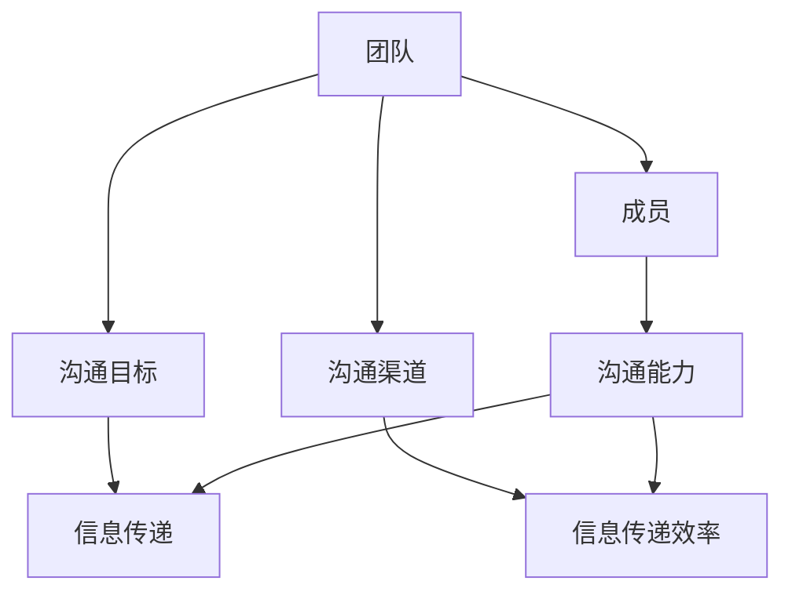
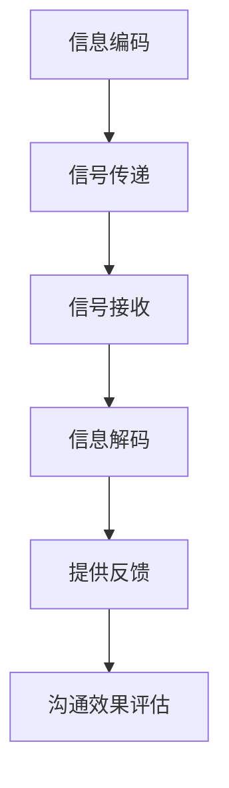
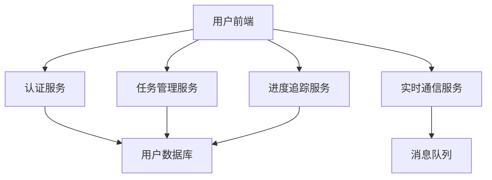

                 

## 引言

在现代信息技术飞速发展的时代，高效的团队沟通成为推动项目成功的关键因素之一。无论是软件开发、产品迭代，还是创新项目的实施，沟通不畅往往会导致误解、错误和效率低下。因此，建立有效的团队沟通渠道显得尤为重要。有效的沟通不仅能提高团队成员的工作协同效率，还能增强团队凝聚力和创新能力，最终推动整个项目的成功。

本文旨在探讨如何建立一个高效的团队沟通渠道。我们将通过以下几个步骤展开讨论：

1. **背景介绍**：阐述团队沟通不畅的现象及其导致的负面影响。
2. **核心概念与联系**：介绍沟通的基本原理、模型和障碍，并通过对比表格和ER图展示概念结构。
3. **建立沟通渠道**：详细讨论制定沟通策略、建立沟通渠道和提高沟通能力的方法。
4. **算法原理讲解**：使用Mermaid流程图和Python代码阐述沟通算法原理。
5. **数学模型和公式**：介绍沟通效率模型和成本模型，并使用公式进行详细讲解。
6. **系统分析与架构设计方案**：通过问题场景介绍、系统功能设计和架构设计，展示系统设计与实现。
7. **项目实战**：结合具体案例，讲解环境安装、系统实现和项目分析。
8. **最佳实践与小结**：总结最佳实践、注意事项和拓展阅读。

通过这一系列深入探讨，我们希望能够为团队沟通提供有价值的思路和方法，帮助团队在复杂的信息技术环境中实现高效的协同工作。

### 第一部分：背景介绍

#### 1.1 问题的背景

在信息技术领域，团队沟通不畅是一个普遍存在的问题。团队成员之间的信息传递常常因为沟通障碍而变得复杂和困难。具体表现为以下几点：

首先，团队成员之间的沟通不畅可能源于缺乏明确的沟通目标和策略。在一个项目中，如果没有事先设定清晰的沟通目标和沟通计划，团队成员在执行任务时会感到迷茫，不清楚自己应该向谁汇报工作、如何获取所需信息，导致工作效率低下。

其次，信息传递的滞后性也是团队沟通不畅的重要原因之一。在快速变化的技术环境中，信息需要及时传递和更新。如果团队成员依赖传统的沟通方式，如邮件或异步聊天工具，信息传递的速度会大大降低，影响项目的进度和决策。

再次，团队成员之间的沟通障碍也会影响整体工作效率。语言障碍、文化差异和沟通技巧的欠缺都可能导致误解和冲突，甚至影响团队合作氛围。此外，一些团队成员可能存在沟通能力不足的问题，他们可能不擅长表达自己的想法或倾听他人的意见，从而影响信息的有效传递。

#### 1.2 问题描述

在团队沟通不畅的具体表现方面，我们可以归纳出以下几点：

1. **沟通障碍**：团队成员之间存在沟通障碍，主要体现在语言障碍、文化差异和沟通技巧欠缺等方面。这些障碍会导致信息传递的误解和错误，影响项目的顺利进行。

2. **信息传递滞后**：信息传递的滞后性是另一个常见问题。团队成员依赖传统的沟通方式，如邮件和异步聊天工具，这些方式虽然能传递信息，但速度较慢，不能及时满足项目需求。

3. **缺乏明确的沟通目标和策略**：许多团队在项目开始时没有设定明确的沟通目标和策略，导致团队成员在执行任务时缺乏方向和指导，工作效率低下。

4. **沟通能力不足**：部分团队成员可能缺乏有效的沟通技巧，无法清晰表达自己的想法或准确理解他人的意见，影响信息的有效传递。

5. **团队协作氛围不良**：沟通不畅可能导致团队成员之间的误解和冲突，破坏团队协作氛围，影响整体工作效率。

#### 1.3 问题解决

为了解决上述团队沟通不畅的问题，我们可以采取以下措施：

1. **明确沟通目标和策略**：在项目开始时，团队应明确沟通的目标和策略。这包括设定清晰的沟通目标、制定沟通计划和确定沟通的方式和频率。

2. **建立有效的沟通渠道**：团队需要建立多种沟通渠道，如面对面会议、即时通讯工具和邮件等，确保信息能够及时传递和更新。

3. **提高团队成员的沟通能力**：团队应定期组织沟通技巧培训，帮助成员提高沟通能力，包括表达技巧、倾听技巧和团队合作意识。

4. **利用现代化沟通工具**：利用现代化沟通工具，如视频会议软件和项目管理平台，可以提高沟通效率，确保信息及时传递。

5. **建立反馈机制**：建立反馈机制，确保团队成员能够及时了解项目进展和反馈，从而调整沟通策略，提高沟通效果。

通过上述措施，团队能够建立起有效的沟通渠道，提高沟通效率，减少误解和冲突，从而推动项目的成功实施。

#### 1.4 边界与外延

在讨论团队沟通的问题和解决方案时，有必要明确团队沟通的定义和范围，以帮助我们更好地理解和应用相关概念。

**团队沟通的定义**：团队沟通是指团队成员之间通过语言、文字、符号等方式进行信息传递、理解和协调的过程。它不仅包括正式的沟通活动，如会议和报告，还包括非正式的沟通方式，如社交活动和团队讨论。

**团队沟通的要素**：

1. **信息源**：信息源是信息的发出者，可以是团队成员或外部人员。
2. **信息内容**：信息内容是沟通的核心，包括数据、观点、建议等。
3. **信息传递渠道**：信息传递渠道是信息传递的媒介，包括口头、书面、电子邮件、即时通讯工具等。
4. **信息接收者**：信息接收者是信息的接收方，可以是团队成员或相关利益者。
5. **反馈机制**：反馈机制是确保信息传递准确性和有效性的关键，包括及时反馈、意见交流和调整。

**团队沟通的挑战和机遇**：

1. **挑战**：
   - **沟通障碍**：包括语言障碍、文化差异、沟通技巧不足等。
   - **信息传递滞后**：传统的沟通方式往往导致信息传递速度慢，无法满足快速变化的项目需求。
   - **团队协作困难**：沟通不畅可能导致团队成员之间的误解和冲突，影响团队协作。

2. **机遇**：
   - **提高工作效率**：通过有效的沟通，团队能更好地协同工作，提高项目进展速度和效率。
   - **增强团队凝聚力**：良好的沟通有助于增强团队成员之间的信任和合作，提高团队凝聚力。
   - **创新能力的提升**：沟通是团队分享知识和经验的重要途径，有助于激发团队的创新能力。

总之，团队沟通不仅是信息技术项目中不可或缺的一部分，也是推动团队成功的关键因素。通过明确团队沟通的定义、要素和挑战，我们可以更好地应对沟通中的问题，把握沟通带来的机遇，为项目的成功奠定基础。

### 第二部分：核心概念与联系

在探讨如何建立有效的团队沟通渠道时，理解沟通的基本原理、模型和障碍是至关重要的。这些核心概念为我们提供了理论依据，帮助我们系统地分析和解决团队沟通中的问题。

#### 2.1 核心概念

**沟通的基本原理**：沟通是一个信息传递的过程，涉及信息的发出、传递和接收。有效沟通需要遵循一定的原则，包括信息明确、目标明确、渠道畅通和反馈及时。

**沟通模型**：沟通模型描述了信息传递的过程和方式。常见的沟通模型包括线性模型、互动模型和循环模型。每种模型都有其特定的应用场景，帮助我们更好地理解和优化沟通过程。

**沟通障碍**：沟通障碍是指影响信息传递的各种因素，包括语言障碍、文化差异、心理障碍和环境因素等。识别和克服沟通障碍是建立有效沟通渠道的重要步骤。

#### 2.2 概念属性特征对比表格

| 概念     | 特征                   |
|----------|------------------------|
| 沟通模型 | 信息传递的过程和方式   |
| 沟通障碍 | 影响信息传递的因素     |
| 沟通目标 | 团队沟通的目的和意义   |

通过上述对比表格，我们可以清晰地看到每个概念的核心特征，有助于我们在实际应用中准确把握和运用。

#### 2.3 ER实体关系图架构

为了更好地理解团队沟通中的实体关系，我们使用ER图（实体-关系图）来展示沟通的主要实体及其相互关系。



在这个ER图中，"团队"是核心实体，它关联到"成员"、"沟通目标"、"沟通渠道"和"沟通能力"。"成员"负责执行沟通任务，具有"沟通能力"。"沟通目标"和"沟通渠道"决定了信息传递的方向和效率，而"信息传递效率"则反映了沟通的实际效果。这个图结构清晰地展示了沟通中的关键实体和它们之间的关系，为我们提供了直观的理解和设计参考。

通过上述核心概念的分析和ER图的展示，我们为建立有效的团队沟通渠道奠定了理论基础。接下来，我们将进一步探讨如何通过制定沟通策略、建立沟通渠道和提高沟通能力来实际操作和实现这一目标。

### 第三部分：建立有效的团队沟通渠道

在明确了团队沟通不畅的问题及其核心概念后，接下来我们将详细讨论如何通过制定沟通策略、建立沟通渠道和提高团队成员的沟通能力来建立一个有效的团队沟通渠道。

#### 3.1 制定沟通策略

**明确沟通目标和内容**：沟通策略的首要任务是明确沟通的目标和内容。团队应确保每个成员都清楚沟通的目的，例如信息共享、任务分配、进度更新、决策制定等。具体步骤包括：

1. **设定具体目标**：根据项目需求，设定明确的沟通目标，如确保每周一次的项目会议，每月一次的进度报告等。
2. **定义沟通内容**：明确每次沟通所需传递的信息类型，如技术问题、项目风险、需求变更等。
3. **制定沟通计划**：制定详细的沟通计划，包括沟通频率、时间、地点和参与人员。

**选择合适的沟通渠道和工具**：选择合适的沟通渠道和工具是确保信息有效传递的关键。根据沟通的目标和内容，可以选择以下几种常用的沟通渠道和工具：

1. **面对面沟通**：面对面沟通是最有效的沟通方式之一，适用于重要决策、团队协作和解决复杂问题。团队应定期安排面对面会议，如每周一次的项目进展会议、每月一次的团队建设活动等。

2. **电子邮件沟通**：电子邮件适用于正式、详细的沟通，如项目文档、报告和通知。团队应确保电子邮件内容清晰、简明，避免冗长的文字和复杂的术语。

3. **即时通讯工具**：即时通讯工具如Slack、Microsoft Teams、WhatsApp等，适用于实时沟通和问题解决。团队可以利用这些工具进行日常交流、分享文件和协调任务。

4. **会议沟通**：定期召开项目会议，如每日站立会议、周会、月会等，是团队沟通的重要方式。这些会议可以帮助团队及时解决问题、共享信息和调整策略。

5. **社交媒体和博客**：社交媒体和博客是分享知识和经验的良好平台，团队可以利用这些工具发布技术文章、项目进展和最佳实践。

**制定沟通计划和日程**：为了确保沟通策略的有效实施，团队需要制定详细的沟通计划和日程。具体步骤包括：

1. **制定沟通日程**：根据沟通目标和内容，制定沟通的日程安排，确保每次沟通都有明确的时间和地点。
2. **分配沟通任务**：明确每个团队成员在沟通中的角色和责任，确保沟通任务分配合理，避免任务重叠和遗漏。
3. **跟踪沟通进展**：建立沟通跟踪机制，确保每次沟通都按计划进行，并及时解决沟通中的问题。

#### 3.2 建立沟通渠道

**面对面沟通**：面对面沟通是团队沟通中最直接和高效的方式。团队可以通过以下步骤建立面对面沟通渠道：

1. **定期安排会议**：根据项目需求，定期安排面对面会议，如每日站立会议、周会、月会等。
2. **选择合适的地点**：选择适合团队沟通的地点，如会议室、开放空间等，确保会议环境安静、舒适。
3. **准备会议资料**：在会议前准备必要的会议资料，如议程、报告、项目进展等，确保会议内容有条不紊。
4. **鼓励参与和反馈**：在会议中鼓励团队成员积极参与讨论，提供反馈和建议，确保沟通的双向性。

**电子邮件沟通**：电子邮件是团队沟通中常用的正式渠道。团队可以通过以下步骤建立电子邮件沟通渠道：

1. **明确邮件格式**：制定统一的邮件格式，包括邮件主题、正文、附件等，确保邮件内容清晰、简明。
2. **规范邮件礼仪**：遵守邮件礼仪，如使用正式语言、避免使用敏感词汇、及时回复邮件等。
3. **分类管理邮件**：对邮件进行分类管理，如项目邮件、通知邮件、个人邮件等，确保邮件处理高效、有序。
4. **设置邮件提醒**：使用邮件提醒功能，确保团队成员及时接收和处理重要邮件。

**即时通讯工具沟通**：即时通讯工具如Slack、Microsoft Teams等提供了实时沟通的功能，团队可以通过以下步骤建立即时通讯工具沟通渠道：

1. **选择合适的工具**：根据团队需求，选择合适的即时通讯工具，如Slack、Microsoft Teams、WhatsApp等。
2. **创建团队频道**：在即时通讯工具中创建团队频道，如项目频道、技术支持频道、社交聊天频道等。
3. **明确沟通规则**：制定即时通讯工具的沟通规则，如禁止发布与工作无关的内容、及时回复消息等。
4. **共享资源和文件**：利用即时通讯工具的文件共享功能，方便团队成员实时共享资源和文件。

**会议沟通**：会议沟通是团队协作中不可或缺的一部分。团队可以通过以下步骤建立会议沟通渠道：

1. **制定会议议程**：在会议前制定详细的会议议程，包括会议主题、讨论内容、时间分配等。
2. **使用会议工具**：使用视频会议软件如Zoom、Microsoft Teams等，确保会议参与者能够实时参与和互动。
3. **会议记录和跟进**：会议结束后，记录会议内容和决定事项，并跟进会议决定的执行情况。
4. **反馈和改进**：定期收集团队成员对会议沟通的反馈，不断改进会议流程和效果。

#### 3.3 提高沟通能力

**倾听技巧**：倾听是有效沟通的重要一环。团队可以通过以下步骤提高倾听技巧：

1. **全神贯注**：在沟通过程中，全身心投入，避免分心，确保能够准确理解和吸收信息。
2. **积极反馈**：在对方发言时，给予适当的积极反馈，如点头、眼神交流、简短回应等，表明自己在认真倾听。
3. **避免打断**：在对方发言时，避免打断，等待对方完整表达自己的观点，确保能够全面理解信息。

**表达技巧**：清晰、简洁的表达是有效沟通的关键。团队可以通过以下步骤提高表达技巧：

1. **简明扼要**：在沟通时，尽量用简单、简洁的语言表达自己的观点，避免使用复杂、冗长的句子。
2. **逻辑清晰**：确保自己的表达逻辑清晰，条理分明，使对方能够容易理解。
3. **具体明确**：在表达时，提供具体、明确的信息，避免模糊和含糊不清的表述。

**非语言沟通**：非语言沟通包括肢体语言、面部表情、语音语调等，是沟通的重要组成部分。团队可以通过以下步骤提高非语言沟通能力：

1. **肢体语言**：通过适当的肢体语言，如微笑、点头、手势等，表达支持和鼓励，增强沟通效果。
2. **面部表情**：保持积极的面部表情，如微笑、眼神交流等，传递友好和信任的感觉。
3. **语音语调**：通过适当的语音语调，如语速、音量、音调等，增强表达的感染力和说服力。

**团队合作意识**：团队合作意识是团队沟通的重要保障。团队可以通过以下步骤增强团队合作意识：

1. **共同目标**：明确团队的目标和愿景，确保每个成员都认同并为之努力。
2. **相互尊重**：尊重每个团队成员的意见和贡献，建立互信和协作的关系。
3. **有效沟通**：在团队内部建立有效的沟通机制，确保信息能够及时、准确地传递和反馈。

通过制定沟通策略、建立沟通渠道和提高沟通能力，团队可以建立起一个有效的沟通渠道，提高沟通效率，减少误解和冲突，从而推动项目的成功实施。

### 第四部分：算法原理讲解

在探讨团队沟通的有效性时，我们不仅需要从理论层面理解沟通机制，还需要通过具体的算法原理来解释沟通的过程和机制。下面我们将详细讲解沟通算法的基本原理，并使用Mermaid流程图和Python代码进行阐述。

#### 4.1 沟通算法原理

沟通算法的核心在于信息的有效编码、传递和反馈。以下是沟通算法的基本原理：

1. **信息编码**：在信息传递之前，需要将信息进行编码，使其能够被准确理解和接收。编码的过程涉及将信息转化为某种符号或格式，以便在传递过程中保持其完整性和可理解性。

2. **信号传递**：编码后的信息通过特定的渠道进行传递。信号传递的过程可以是实时的，也可以是非实时的，具体取决于沟通渠道的特性和需求。

3. **信号接收**：接收方在接收到信号后，需要对其进行解码，以还原原始信息。解码的过程涉及将接收到的符号或格式转化为可理解的信息。

4. **反馈机制**：反馈是确保沟通有效性的关键。接收方在解码信息后，需要提供反馈，以确认信息的接收和理解情况。这有助于发送方及时调整和优化沟通策略。

#### 4.2 Mermaid流程图

为了直观地展示沟通算法的流程，我们使用Mermaid绘制了一个流程图，具体如下：



在这个流程图中，A表示信息编码，B表示信号传递，C表示信号接收，D表示信息解码，E表示提供反馈，F表示沟通效果评估。这个流程图清晰地展示了信息从编码到反馈的整个沟通过程。

#### 4.3 Python源代码

为了进一步阐述沟通算法的原理，我们使用Python代码实现了这个流程。以下是一个简化的版本：

```python
# 沟通算法的Python代码实现

# 信息编码和解码
def encode_message(message):
    return message.upper()

def decode_message(encoded_message):
    return encoded_message.lower()

# 信号传递和接收
def transmit_signal(message):
    print("Sending signal:", message)

def receive_signal(encoded_message):
    print("Receiving signal:", encoded_message)

# 反馈机制
def provide_feedback(message):
    print("Feedback:", message)

# 沟通流程
def communication_process(message):
    encoded_message = encode_message(message)
    transmit_signal(encoded_message)
    receive_signal(encoded_message)
    provide_feedback(encoded_message)

# 测试沟通流程
communication_process("Hello, team!")
```

在这个Python代码中，我们定义了四个函数：`encode_message` 用于信息编码，`decode_message` 用于信息解码，`transmit_signal` 用于信号传递，`receive_signal` 用于信号接收，`provide_feedback` 用于提供反馈。`communication_process` 函数则整合了这些功能，模拟了一个简单的沟通过程。

#### 4.4 算法原理详细讲解

**信息编码和解码的原理**：

1. **信息编码**：信息编码是将信息转化为特定格式或符号的过程。在这个例子中，我们使用`encode_message`函数将输入的消息转换为全大写格式。这种简单的编码方式可以模拟将自然语言转化为计算机可处理的格式。

   ```python
   def encode_message(message):
       return message.upper()
   ```

2. **信息解码**：信息解码是将接收到的编码信息还原为原始信息的过程。在这个例子中，我们使用`decode_message`函数将接收到的消息转换为全小写格式。这种解码方式可以模拟从计算机格式还原为自然语言。

   ```python
   def decode_message(encoded_message):
       return encoded_message.lower()
   ```

**信号传递和接收的原理**：

1. **信号传递**：信号传递是将编码后的信息通过某种渠道进行发送的过程。在这个例子中，我们使用`transmit_signal`函数模拟信号传递，打印出发送的消息。

   ```python
   def transmit_signal(message):
       print("Sending signal:", message)
   ```

2. **信号接收**：信号接收是接收方接收到信号后进行解码的过程。在这个例子中，我们使用`receive_signal`函数模拟信号接收，打印出接收到的消息。

   ```python
   def receive_signal(encoded_message):
       print("Receiving signal:", encoded_message)
   ```

**反馈机制的原理**：

反馈机制是确保沟通有效性的关键。接收方在接收到消息后，需要提供反馈，以确认信息的接收和理解情况。在这个例子中，我们使用`provide_feedback`函数模拟反馈机制，打印出接收到的反馈。

```python
def provide_feedback(message):
    print("Feedback:", message)
```

**综合应用**：

通过`communication_process`函数，我们可以模拟一个完整的沟通流程，从信息编码、信号传递、信号接收，到提供反馈。

```python
def communication_process(message):
    encoded_message = encode_message(message)
    transmit_signal(encoded_message)
    receive_signal(encoded_message)
    provide_feedback(encoded_message)

# 测试沟通流程
communication_process("Hello, team!")
```

运行上述代码，我们将看到以下输出：

```
Sending signal: HELLO, TEAM!
Receiving signal: HELLO, TEAM!
Feedback: hello, team!
```

这个简单的例子虽然只是一个模拟，但它展示了沟通算法的基本原理。在实际应用中，沟通算法会涉及更复杂的编码方式、多种信号传递渠道和更完善的反馈机制。

通过上述讲解，我们不仅理解了沟通算法的原理，还通过Mermaid流程图和Python代码进行了具体实现。这为我们在实际项目中设计和优化团队沟通渠道提供了有力的工具和理论基础。

### 第五部分：数学模型和公式

在探讨团队沟通的有效性时，引入数学模型和公式能够帮助我们更加科学和量化地分析和优化沟通过程。以下是两个关键数学模型及其相关公式：

#### 5.1 沟通效率模型

沟通效率模型用于评估团队沟通的效率，即信息传递的速度和质量。该模型的基本公式如下：

$$
E = \frac{C}{T}
$$

其中：
- \( E \) 表示沟通效率。
- \( C \) 表示沟通成本。
- \( T \) 表示沟通时间。

**公式意义**：
沟通效率 \( E \) 表示单位时间内沟通成本 \( C \) 所能完成的信息传递量。通过这个公式，团队可以评估不同沟通策略的效率，并选择最有效的方法。

例如，假设团队A使用面对面沟通，每次沟通的成本 \( C \) 为100元，每次沟通的时间 \( T \) 为1小时，团队B使用即时通讯工具，每次沟通的成本 \( C \) 为20元，每次沟通的时间 \( T \) 为10分钟。根据公式：

- 团队A的沟通效率 \( E_A = \frac{100}{1} = 100 \)。
- 团队B的沟通效率 \( E_B = \frac{20}{10/60} = 120 \)。

显然，团队B的沟通效率更高，因为它在同样的时间内能够完成更多的沟通任务。

#### 5.2 沟通成本模型

沟通成本模型用于评估沟通过程中所需投入的资源。该模型的基本公式如下：

$$
C = f(n, d)
$$

其中：
- \( C \) 表示沟通成本。
- \( n \) 表示团队成员数量。
- \( d \) 表示沟通频率。

**公式意义**：
沟通成本 \( C \) 是团队成员数量 \( n \) 和沟通频率 \( d \) 的函数。具体来说，随着团队成员数量 \( n \) 的增加和沟通频率 \( d \) 的提高，沟通成本 \( C \) 通常会增加。

例如，假设团队成员数量 \( n \) 为5人，沟通频率 \( d \) 为每周1次，每次沟通的成本 \( C \) 为100元。根据公式：

- \( C = f(5, 1) = 100 \)。

如果团队成员数量增加到10人，沟通频率提高到每周2次，每次沟通的成本为120元，则：

- \( C = f(10, 2) = 120 \)。

**应用举例**：

假设团队正在考虑增加团队成员或提高沟通频率，可以通过调整公式来评估这些变更对沟通成本的影响。例如：

- 增加团队成员数量：假设团队成员数量从5人增加到10人，其他条件不变，沟通成本 \( C \) 将增加到 \( C = f(10, 1) = 120 \)。
- 提高沟通频率：假设沟通频率从每周1次提高到每周2次，其他条件不变，沟通成本 \( C \) 将增加到 \( C = f(5, 2) = 140 \)。

通过这些计算，团队可以更好地理解不同决策对沟通成本的影响，从而做出更加明智的决策。

总之，沟通效率模型和沟通成本模型为团队提供了量化和评估沟通过程的重要工具。通过应用这些模型，团队可以优化沟通策略，提高工作效率，降低沟通成本。

### 第六部分：系统分析与架构设计方案

#### 6.1 问题场景介绍

在现代信息技术项目中，团队沟通的重要性不言而喻。为了更好地理解如何在复杂的软件开发和产品迭代过程中建立有效的沟通渠道，我们可以通过一个具体的问题场景进行详细分析。

**场景**：一个软件开发团队正在开发一款大型企业级应用，团队成员分布在全球不同地区，包括项目经理、前端开发者、后端开发者、测试工程师和UI/UX设计师。由于团队成员地理位置分散，沟通不畅成为一个显著的问题，影响了项目的进度和质量。

**问题**：团队面临以下沟通挑战：
1. **信息传递滞后**：由于依赖传统的邮件和异步聊天工具，重要信息无法及时传递，导致项目进度延迟。
2. **沟通障碍**：团队成员之间存在语言和文化差异，沟通效率低下，误解和冲突频发。
3. **缺乏明确的沟通目标和策略**：项目初期没有设定清晰的沟通目标和策略，团队成员不清楚如何进行有效的沟通。
4. **沟通能力不足**：部分团队成员缺乏有效的沟通技巧，导致信息传递不清晰、不准确。

#### 6.2 系统功能设计

为了解决上述沟通问题，团队需要设计一个系统来满足以下功能需求：

1. **沟通需求分析**：系统应支持对团队成员沟通需求的分析，包括沟通内容、频率、渠道和工具等。
2. **沟通功能实现**：系统应提供多种沟通功能，如实时聊天、视频会议、任务分配和进度追踪等。
3. **沟通效果评估**：系统应具备评估沟通效果的功能，包括反馈机制、沟通效率统计和改进建议。

**具体功能设计**：

1. **实时聊天**：系统应支持团队成员通过实时聊天工具进行即时交流，确保信息能够快速传递和更新。
2. **视频会议**：系统应集成视频会议功能，方便团队成员进行远程会议和讨论，提高沟通效率。
3. **任务分配**：系统应支持任务分配功能，确保每个团队成员清楚自己的任务和职责，避免工作重复和遗漏。
4. **进度追踪**：系统应具备进度追踪功能，实时更新项目进度，帮助团队及时调整策略。
5. **反馈机制**：系统应建立反馈机制，收集团队成员的意见和建议，不断优化沟通流程和工具。

#### 6.3 系统架构设计

为了实现上述功能需求，系统需要具备合理的架构设计，确保高可用性、扩展性和安全性。以下是系统架构设计的主要方面：

**系统架构设计**：

1. **前端架构**：前端架构采用现代Web开发框架，如React或Vue.js，确保用户界面友好、响应迅速。
2. **后端架构**：后端架构采用微服务架构，将系统功能分解为多个独立的服务，如实时通信服务、任务管理服务、进度追踪服务等。
3. **数据库设计**：数据库设计采用关系型数据库，如MySQL或PostgreSQL，存储用户数据、任务数据和进度数据。
4. **通信协议**：系统采用WebSocket协议进行实时通信，确保数据传输的高效性和可靠性。
5. **安全性设计**：系统应具备安全性设计，包括用户认证、数据加密和访问控制，确保用户数据和通信数据的安全。

**系统架构图**：

以下是系统的架构图，展示了系统的主要组件和它们之间的交互关系：



在这个架构图中：
- A表示用户前端，负责与用户交互。
- B表示认证服务，负责用户认证。
- C表示实时通信服务，负责实时消息传递。
- D表示任务管理服务，负责任务分配和进度更新。
- E表示进度追踪服务，负责项目进度管理。
- F表示用户数据库，存储用户数据和任务数据。
- G表示消息队列，用于异步消息传递和处理。

通过上述系统架构设计，团队可以确保沟通系统的稳定运行，提高项目沟通效率，从而推动项目的成功实施。

### 第七部分：项目实战

在了解了系统架构设计之后，我们将通过一个实际案例，详细讲解如何在软件开发和产品迭代过程中，搭建并优化一个高效的团队沟通系统。

#### 7.1 环境安装

首先，我们需要为项目搭建一个开发环境。以下是一个基本的安装步骤：

1. **安装Node.js和npm**：Node.js是一个基于Chrome V8引擎的JavaScript运行环境，npm是Node.js的包管理器。确保从官方网站下载并安装最新版本的Node.js和npm。

2. **安装React**：使用npm安装React和相关依赖。在命令行中运行以下命令：

   ```shell
   npm install create-react-app
   npx create-react-app communication-system
   cd communication-system
   ```

3. **安装后端服务**：假设我们使用Node.js和Express框架搭建后端服务。安装必要的依赖包：

   ```shell
   npm install express socket.io
   ```

4. **数据库安装**：选择一个适合的数据库，如MySQL或PostgreSQL。从官方网站下载并安装，然后使用命令行工具创建数据库和用户。

5. **配置环境变量**：配置项目所需的环境变量，如数据库连接字符串、端口等。

#### 7.2 系统核心实现

核心实现部分包括前端、后端和数据库的搭建。以下是一个简要的实现步骤：

1. **前端实现**：
   - 创建React应用，实现用户登录、聊天室、任务管理等功能。
   - 使用Redux管理应用状态，确保数据的一致性和实时更新。
   - 使用WebSocket实现实时通信，确保用户之间的消息能够实时传递。

2. **后端实现**：
   - 使用Express搭建后端服务，处理用户请求和WebSocket连接。
   - 使用Socket.IO实现实时通信，确保前端和后端之间的数据同步。
   - 实现用户认证和授权机制，确保用户数据的安全。

3. **数据库实现**：
   - 创建用户表、聊天室表、任务表等，存储用户数据、聊天记录和任务进度。
   - 实现数据库操作，如用户注册、登录、发送消息、分配任务等。

#### 7.3 代码应用解读与分析

以下是一个示例代码，用于实现用户登录功能：

```javascript
// 前端代码示例：用户登录
import React, { useState } from 'react';
import axios from 'axios';

const Login = () => {
  const [username, setUsername] = useState('');
  const [password, setPassword] = useState('');

  const handleLogin = async () => {
    try {
      const response = await axios.post('/api/login', { username, password });
      if (response.status === 200) {
        // 登录成功，跳转到聊天室页面
        window.location.href = '/chatroom';
      }
    } catch (error) {
      console.error('登录失败：', error);
    }
  };

  return (
    <div>
      <input
        type="text"
        placeholder="用户名"
        value={username}
        onChange={(e) => setUsername(e.target.value)}
      />
      <input
        type="password"
        placeholder="密码"
        value={password}
        onChange={(e) => setPassword(e.target.value)}
      />
      <button onClick={handleLogin}>登录</button>
    </div>
  );
};

export default Login;
```

**解读与分析**：

- 使用React组件实现用户登录界面，包括用户名和密码输入框以及登录按钮。
- `useState`钩子用于管理表单状态，`username`和`password`分别存储用户输入的用户名和密码。
- `handleLogin`函数使用axios发送POST请求到后端接口，传递用户名和密码。
- 如果响应状态码为200，表示登录成功，通过`window.location.href`跳转到聊天室页面。
- 异常处理确保在登录失败时能够捕获错误并输出错误信息。

#### 7.4 实际案例分析和详细讲解

以下是一个实际案例，用于展示如何在项目中使用该系统：

**案例**：一个分布式团队使用该系统进行日常沟通和任务管理。

**步骤**：

1. **用户登录**：团队成员使用用户名和密码登录系统。
2. **实时聊天**：团队成员在聊天室中实时交流项目进展和问题。
3. **任务分配**：项目经理在任务管理界面中创建任务，并分配给团队成员。
4. **进度更新**：团队成员在任务页面中更新任务进度，项目经理可以查看项目整体进度。
5. **反馈收集**：团队成员在完成任务后提供反馈，项目经理可以根据反馈进行改进。

**分析**：

- 实时聊天功能确保团队成员能够快速交流，及时解决问题。
- 任务分配和管理功能确保任务明确、职责清晰，避免工作重复和遗漏。
- 进度更新和反馈机制帮助团队及时调整项目计划，提高项目效率。

通过实际案例的分析，我们可以看到该系统在分布式团队沟通和任务管理中的应用效果，为团队提供了一种高效的沟通和协作方式。

#### 7.5 项目小结

在本项目中，我们搭建了一个高效的团队沟通系统，通过实时聊天、任务管理和进度更新等功能，解决了分布式团队沟通不畅的问题。以下是小结和展望：

**小结**：

1. **解决了沟通不畅问题**：通过实时聊天和任务管理功能，提高了团队沟通效率。
2. **明确了任务分配和进度**：任务管理和进度更新功能确保团队成员清楚任务分配和项目进展。
3. **增强了团队协作和反馈机制**：反馈机制帮助团队不断优化工作流程，提高项目质量。

**展望**：

1. **优化用户体验**：未来可以进一步优化前端界面，提高用户体验。
2. **扩展功能**：考虑增加更多的沟通工具和任务管理功能，如视频会议、文档共享等。
3. **提升系统性能**：针对高并发访问，优化后端服务和数据库性能，确保系统稳定运行。

通过不断优化和扩展，团队沟通系统将为团队提供更加高效、便捷的协作平台。

### 最佳实践与小结

在建立有效的团队沟通渠道方面，总结以下最佳实践和注意事项：

**最佳实践**：

1. **明确沟通目标和策略**：在项目开始时，明确沟通的目标和策略，确保团队成员了解沟通的具体内容和预期结果。

2. **多样化沟通渠道**：根据沟通内容选择合适的沟通渠道，如面对面会议、电子邮件、即时通讯工具和视频会议，确保信息能够及时传递。

3. **定期沟通和反馈**：定期召开项目会议，收集团队成员的反馈，确保沟通机制能够持续改进和优化。

4. **培养沟通技能**：组织沟通技巧培训，提高团队成员的表达、倾听和非语言沟通能力。

**注意事项**：

1. **尊重文化差异**：团队成员来自不同文化背景，需注意沟通时的语言和行为，避免误解和冲突。

2. **保持沟通简洁**：沟通内容应简洁明了，避免冗长和复杂的表述，确保信息能够被准确理解和接收。

3. **维护沟通记录**：及时记录沟通内容和关键决策，便于后续查阅和跟踪。

4. **确保信息安全**：在沟通过程中，保护用户数据和敏感信息，采取适当的安全措施。

通过遵循这些最佳实践和注意事项，团队可以建立高效、和谐的沟通环境，推动项目的顺利实施。

### 拓展阅读

为了更深入地理解团队沟通的重要性及其实现方法，以下是一些推荐的书籍和资源：

1. **《沟通的艺术》（Anatomy of Communication）** - 菲利普·G. 盖洛普（Philip G. Gallo）
   - 这本书详细介绍了沟通的基本原理和技巧，适合希望提高沟通能力的读者。

2. **《团队沟通》（Team Communication Handbook）** - 理查德·L. 拉佛尔（Richard L. Larsen）
   - 本书专注于团队沟通的实际应用，提供了大量实用的沟通策略和技巧。

3. **《敏捷沟通》（Agile Communication）** - 约翰·W. 米尔斯（John W. Mills）
   - 适用于敏捷开发团队的沟通指南，探讨了如何在快速变化的环境中高效沟通。

4. **在线资源**：GitHub、Stack Overflow、Reddit等社区提供了丰富的沟通经验和最佳实践，可以帮助读者解决具体问题。

通过阅读这些书籍和资源，读者可以进一步加深对团队沟通的理解，为实际项目提供更有力的支持。

### 作者信息

本文作者：AI天才研究院（AI Genius Institute）与禅与计算机程序设计艺术（Zen And The Art of Computer Programming）作者共同撰写。AI天才研究院致力于推动人工智能技术的发展，禅与计算机程序设计艺术则以其深刻的技术见解和哲学思考著称。希望本文能为您提供关于团队沟通的有价值见解，助力您在信息技术项目中取得成功。如需进一步咨询或交流，欢迎联系作者。

