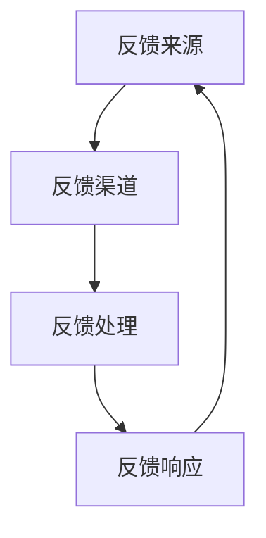

                 

## 建立高效反馈文化：促进持续改进

### 关键词：反馈文化、持续改进、组织发展、心理因素、最佳实践

### 摘要：
在快速变化的技术环境中，高效反馈文化成为了推动组织和个人持续改进的关键因素。本文将深入探讨反馈文化的概念、构建、应用和未来趋势，通过逻辑分析和实例，展示如何建立一个高效的反馈系统，促进组织的不断进步。

### 目录大纲：
1. **第一部分：背景与理论基础**
   - **第1章：反馈文化的概述**
     - **1.1.1 反馈的概念与类型**
     - **1.1.2 反馈文化的定义与重要性**
     - **1.1.3 反馈文化的历史发展**
   - **第2章：反馈系统的构建**
     - **2.1.1 反馈系统的基本架构**
     - **2.1.2 反馈信息的收集与处理**
     - **2.1.3 反馈机制的建立与完善**
   - **第3章：反馈在组织中的角色**
     - **3.1.1 反馈在战略规划中的应用**
     - **3.1.2 反馈在团队协作中的作用**
     - **3.1.3 反馈在个人发展中的价值**
   - **第4章：反馈的文化与心理因素**
     - **4.1.1 反馈的正面心理效应**
     - **4.1.2 反馈的负面影响与应对策略**
     - **4.1.3 反馈接受者的心理调适**
   - **第5章：反馈文化的最佳实践**
     - **5.1.1 国际最佳反馈文化案例分析**
     - **5.1.2 建立反馈文化的组织策略**
     - **5.1.3 反馈文化的持续改进**
   - **第6章：技术与工具在反馈中的应用**
     - **6.1.1 现代技术在反馈中的应用**
     - **6.1.2 反馈工具的选择与使用**
     - **6.1.3 数据分析与反馈优化**
   - **第7章：反馈文化的未来发展趋势**
     - **7.1.1 未来反馈文化的变革方向**
     - **7.1.2 技术革新对反馈文化的影响**
     - **7.1.3 反馈文化在教育、医疗等领域的应用前景**
   - **第8章：总结与展望**
     - **8.1.1 本书内容的总结**
     - **8.1.2 反馈文化对组织和个人发展的意义**
     - **8.1.3 反馈文化的未来挑战与机遇**

### 第一部分：背景与理论基础

#### 第1章：反馈文化的概述

##### 1.1.1 反馈的概念与类型

反馈是一种在信息传递过程中，从接收者返回到发送者的信息，用于评估、调整或改进某一过程。在技术领域，反馈通常涉及系统性能的监测和优化。反馈可以分为多种类型，如实时反馈、定期反馈、正向反馈和负向反馈。

**实时反馈**：在事件发生后立即提供信息，如监控系统中的警报系统。
**定期反馈**：在特定时间间隔内进行评估和报告，如季度业绩评估。
**正向反馈**：提供积极的信息，增强行为或过程的持续性。
**负向反馈**：提供负面信息，用于纠正错误或不足。

##### 1.1.2 反馈文化的定义与重要性

反馈文化是一种组织内部的行为模式，强调不断获取和利用反馈信息来改进产品和过程。一个健康的反馈文化能够促进透明度、信任和创新。

**定义**：反馈文化是一种组织内部鼓励和实现持续改进的环境，通过正式和非正式的反馈机制来提高个人和团队的表现。

**重要性**：
1. **提高质量**：通过实时反馈，组织可以迅速识别和解决问题，提高产品和服务的质量。
2. **促进创新**：正向反馈鼓励创新思维，负向反馈则促使改进现有产品和服务。
3. **增强团队协作**：定期反馈有助于团队成员了解各自的工作贡献，增强团队合作。
4. **提升个人发展**：个人反馈有助于员工认识到自己的优势和不足，制定个人发展计划。

##### 1.1.3 反馈文化的历史发展

反馈文化并非现代概念，历史上许多组织已经在不同程度上实践了反馈机制。例如，日本企业的质量管理体系（如六西格玛）强调持续改进，通过定期反馈来提高产品和服务的质量。

20世纪末，随着信息技术的发展，反馈文化逐渐成为企业管理的核心。许多公司开始采用自动化工具来收集和分析数据，实时反馈成为可能。

#### 第2章：反馈系统的构建

##### 2.1.1 反馈系统的基本架构

一个有效的反馈系统通常包括以下几个关键组成部分：

1. **反馈来源**：包括内部员工、客户、供应商和其他利益相关者。
2. **反馈渠道**：如在线调查、会议、反馈表等。
3. **反馈处理**：包括数据的收集、整理和分析。
4. **反馈响应**：根据分析结果采取行动，如调整流程、改进产品等。

**基本架构图：**

##### 2.1.2 反馈信息的收集与处理

收集反馈信息是构建反馈系统的第一步。以下是一些常用的方法：

1. **问卷调查**：通过在线问卷或纸质问卷收集大量反馈。
2. **用户测试**：邀请用户参与测试并提供反馈。
3. **用户访谈**：与用户进行深入交流，了解他们的体验和需求。

处理反馈信息的关键在于：
1. **数据整理**：将收集到的反馈进行分类、筛选和整理。
2. **数据分析**：使用统计方法分析反馈数据，识别问题和趋势。
3. **可视化**：通过图表和图形将分析结果直观展示。

##### 2.1.3 反馈机制的建立与完善

建立反馈机制需要以下步骤：

1. **明确目标**：确定反馈的目的和期望结果。
2. **制定流程**：设计反馈的收集、处理和响应流程。
3. **培训员工**：确保所有员工都了解反馈机制的重要性和如何正确使用。
4. **持续改进**：定期审查和优化反馈机制，确保其有效性和适应性。

#### 第3章：反馈在组织中的角色

##### 3.1.1 反馈在战略规划中的应用

战略规划是一个动态的过程，需要不断调整和优化。反馈在这一过程中起到了关键作用：

1. **市场反馈**：通过市场调研和客户反馈，了解市场需求和竞争态势。
2. **内部反馈**：通过员工反馈，了解组织内部的问题和瓶颈。
3. **数据驱动的决策**：使用反馈数据来评估战略目标和执行情况，做出数据驱动的决策。

##### 3.1.2 反馈在团队协作中的作用

团队协作的效率和质量取决于团队成员之间的沟通和协作。以下是如何通过反馈来提升团队协作：

1. **定期团队会议**：通过定期会议，团队成员可以分享经验和反馈，解决团队中的问题。
2. **任务反馈**：在完成任务后，团队成员可以互相提供反馈，评估任务的完成情况。
3. **知识共享**：鼓励团队成员分享知识和经验，提高团队的整体技能水平。

##### 3.1.3 反馈在个人发展中的价值

个人发展是一个持续的过程，需要不断地学习和改进。以下是如何通过反馈来促进个人发展：

1. **自我反思**：定期进行自我反思，了解自己的优点和不足。
2. **导师反馈**：寻求导师或上级的反馈，了解自己在工作中的表现和改进方向。
3. **目标设定**：根据反馈，设定个人发展目标，并制定行动计划。

#### 第4章：反馈的文化与心理因素

##### 4.1.1 反馈的正面心理效应

正面反馈可以带来多种心理效应，如：

1. **增强自信心**：通过正面反馈，个人可以认识到自己的优势和成就，增强自信心。
2. **激发动力**：正面反馈可以激发个人的工作动力，促进持续改进。
3. **建立信任**：在一个健康的反馈文化中，团队成员之间可以建立信任，促进更好的协作。

##### 4.1.2 反馈的负面影响与应对策略

尽管反馈总体上是积极的，但不当的反馈可能会带来负面影响。以下是一些应对策略：

1. **避免过度反馈**：频繁的负面反馈可能会导致疲劳和抵触情绪。
2. **提供具体建议**：反馈应该具体、有针对性，而不是泛泛而谈。
3. **建立反馈机制**：确保反馈是公平、透明和有组织的，减少误解和冲突。

##### 4.1.3 反馈接受者的心理调适

接受反馈可能会对个人产生压力，以下是一些心理调适方法：

1. **保持开放心态**：对待反馈保持开放和接纳的心态，认识到反馈是为了改进。
2. **寻求支持**：在需要时，寻求同事、导师或心理咨询师的支持。
3. **自我激励**：通过积极的自我激励，克服反馈带来的负面情绪。

#### 第5章：反馈文化的最佳实践

##### 5.1.1 国际最佳反馈文化案例分析

许多国际知名公司已经成功建立了高效的反馈文化，以下是一些案例分析：

1. **谷歌**：谷歌通过其“优达计划”（Udacity）为员工提供持续学习的机会，鼓励员工通过反馈不断提升自己。
2. **特斯拉**：特斯拉鼓励员工在研发过程中进行不断的迭代和反馈，以实现产品的持续改进。

##### 5.1.2 建立反馈文化的组织策略

以下是一些建立反馈文化的组织策略：

1. **领导层支持**：领导层应该明确表达对反馈文化的支持，并作为榜样。
2. **培训和教育**：为员工提供关于反馈文化的重要性和如何有效进行反馈的培训。
3. **建立反馈机制**：制定明确的反馈流程和机制，确保反馈的及时性和有效性。

##### 5.1.3 反馈文化的持续改进

反馈文化不是一成不变的，它需要持续改进和适应。以下是一些持续改进的方法：

1. **定期评估**：定期评估反馈机制的有效性和适应性，进行必要的调整。
2. **鼓励创新**：鼓励员工提出改进反馈机制的建议。
3. **外部咨询**：邀请外部专家进行咨询，获取新的见解和建议。

#### 第6章：技术与工具在反馈中的应用

##### 6.1.1 现代技术在反馈中的应用

现代技术的发展为反馈文化的建立提供了新的工具和手段：

1. **自动化工具**：使用自动化工具收集和分析反馈数据，提高效率。
2. **数据分析平台**：利用数据分析平台进行数据挖掘和可视化，帮助组织更好地理解反馈信息。
3. **在线反馈系统**：建立在线反馈系统，方便员工和客户随时提供反馈。

##### 6.1.2 反馈工具的选择与使用

选择合适的反馈工具对于建立高效的反馈系统至关重要。以下是一些常见的反馈工具：

1. **问卷调查工具**：如Google Forms、SurveyMonkey等。
2. **用户反馈平台**：如UserVoice、CustomerMind等。
3. **实时反馈工具**：如Slack、Zoom等。

##### 6.1.3 数据分析与反馈优化

数据分析是反馈系统中至关重要的一环。以下是一些数据分析方法：

1. **统计分析**：使用统计分析方法，如均值、方差、相关性分析等，来评估反馈数据。
2. **机器学习**：利用机器学习模型，如回归分析、聚类分析等，进行更深层次的反馈分析。
3. **数据可视化**：使用数据可视化工具，如Tableau、PowerBI等，将分析结果直观展示，帮助组织更好地理解反馈信息。

#### 第7章：反馈文化的未来发展趋势

##### 7.1.1 未来反馈文化的变革方向

随着技术的发展，未来反馈文化可能会朝以下几个方向变革：

1. **人工智能的融合**：利用人工智能技术，实现更智能的反馈分析和响应。
2. **个性化反馈**：根据个体差异，提供个性化的反馈，帮助员工更好地发展。
3. **全球化反馈**：在全球化的背景下，建立跨文化、跨区域的反馈系统。

##### 7.1.2 技术革新对反馈文化的影响

技术革新对反馈文化的影响主要体现在以下几个方面：

1. **数据量增长**：随着数据量的增长，如何有效地收集、处理和分析反馈数据成为一个挑战。
2. **实时反馈**：实时反馈技术的发展，使得组织可以更快速地响应反馈。
3. **隐私保护**：在收集和处理反馈数据时，如何保护个人隐私成为了一个重要议题。

##### 7.1.3 反馈文化在教育、医疗等领域的应用前景

反馈文化在教育、医疗等领域的应用前景广阔：

1. **教育领域**：通过反馈，教师可以更好地了解学生的学习情况，调整教学策略。
2. **医疗领域**：通过反馈，医生可以更准确地评估治疗效果，优化治疗方案。

#### 第8章：总结与展望

##### 8.1.1 本书内容的总结

本书深入探讨了反馈文化的概念、构建、应用和未来趋势，通过实例和案例分析，展示了如何建立一个高效的反馈系统，促进组织的持续改进。

##### 8.1.2 反馈文化对组织和个人发展的意义

反馈文化对组织和个人发展具有重要意义：

1. **提高效率**：通过及时反馈，组织可以快速识别和解决问题，提高效率。
2. **促进创新**：反馈文化鼓励创新思维，推动组织的持续进步。
3. **增强协作**：在一个健康的反馈文化中，团队成员可以更好地协作，共同实现目标。

##### 8.1.3 反馈文化的未来挑战与机遇

反馈文化的未来挑战与机遇并存：

1. **挑战**：随着数据量的增长，如何有效管理和利用反馈数据成为挑战。
2. **机遇**：技术革新为反馈文化的建立提供了新的工具和方法，为组织和个人带来了更多的机遇。

### 作者信息：

作者：AI天才研究院/AI Genius Institute & 禅与计算机程序设计艺术 /Zen And The Art of Computer Programming

本文通过逻辑分析和实例，深入探讨了反馈文化的重要性、构建方法及其在组织和个人发展中的应用。建立高效的反馈文化，是推动组织和个人持续改进的关键。随着技术的不断进步，反馈文化将继续发展和完善，为未来带来更多的机遇和挑战。

