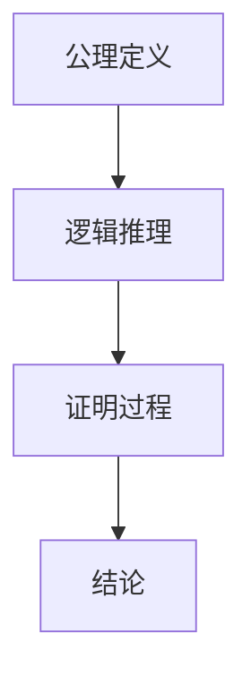
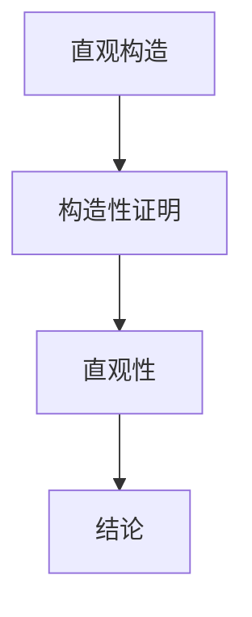
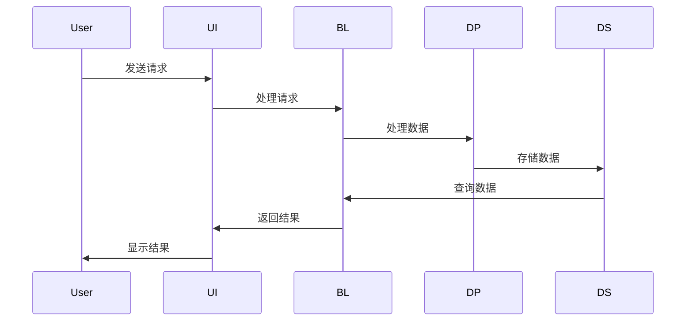
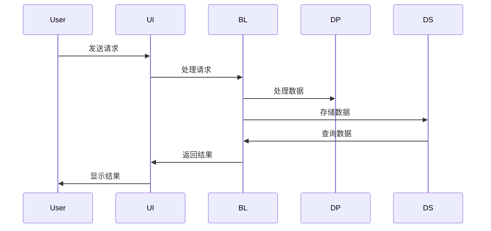

                 

### 文章标题

# 形式主义vs.直觉主义：数学基础之争

### 关键词

- 形式主义
- 直觉主义
- 数学基础
- 公理化
- 形式化
- 逻辑推理

### 摘要

本文深入探讨了形式主义和直觉主义在数学基础理论中的对立与融合。形式主义通过严格的公理化和逻辑推理来建立数学系统，而直觉主义则强调数学的直观性和直观证明。文章分析了这两种哲学思想在数学中的应用，比较了它们的优点和局限性，并探讨了数学基础问题的解决途径。通过详细的算法原理讲解和系统分析与架构设计，本文旨在为读者提供一个全面而清晰的数学基础理论视角，激发读者对这一领域更深层次的思考。

### 目录大纲

1. **问题的背景介绍**
   - 1.1 形式主义与直觉主义的历史发展
   - 1.2 数学基础问题的重要性
   - 1.3 问题描述
   - 1.4 问题解决
   - 1.5 边界与外延
   - 1.6 概念结构与核心要素组成

2. **核心概念与联系**
   - 2.1 形式主义的概念
   - 2.2 直觉主义的概念
   - 2.3 概念属性特征对比表格
   - 2.4 ER实体关系图架构的Mermaid流程图

3. **算法原理讲解**
   - 3.1 形式主义算法原理
   - 3.2 直觉主义算法原理

4. **数学模型和数学公式**
   - 4.1 形式主义的数学模型
   - 4.2 直觉主义的数学模型
   - 4.3 比较与讨论

5. **系统分析与架构设计方案**
   - 5.1 问题场景介绍
   - 5.2 系统功能设计
   - 5.3 系统架构设计
   - 5.4 系统接口设计
   - 5.5 系统交互

6. **项目实战**
   - 6.1 环境安装
   - 6.2 系统核心实现
   - 6.3 实际案例
   - 6.4 项目小结

7. **总结与拓展**
   - 7.1 最佳实践
   - 7.2 小结
   - 7.3 注意事项
   - 7.4 拓展阅读

### 第1章：问题的背景介绍

#### 1.1 形式主义与直觉主义的历史发展

数学的历史可以追溯到古代，从基本的算术和几何开始，逐步发展到现代的抽象数学。在这一过程中，数学家们逐渐形成了两种不同的哲学观点：形式主义和直觉主义。形式主义最早可以追溯到19世纪末和20世纪初，其代表人物包括戴德金（Richard Dedekind）和皮亚诺（Giuseppe Peano）。形式主义强调数学的严格性和公理性，认为数学是从一系列预设的公理出发，通过逻辑推理得出结论的学科。

与之相对，直觉主义则起源于20世纪初，代表人物包括布劳威尔（Luitzen Egbertus Jan Brouwer）和魏尔施特拉斯（Karl Weierstrass）。直觉主义认为数学的基础在于直观感知和构造性证明，强调数学对象的可构造性和直观性。这两种哲学观点在数学的发展历程中产生了深远的影响，并形成了数学基础理论的两个重要流派。

#### 1.2 数学基础问题的重要性

数学基础问题一直是数学研究的核心问题之一。数学基础问题探讨的是数学系统本身是否自洽、一致，以及数学结论的可靠性和证明的有效性。数学基础问题的研究不仅关乎数学理论的发展，也关系到计算机科学、逻辑学、哲学等多个领域的进展。

形式主义和直觉主义分别回答了数学基础问题中的不同方面。形式主义通过严格的公理化和逻辑推理，确保了数学系统的自洽性和一致性。直觉主义则强调了数学结论的构造性和直观性，使得数学理论更加贴近现实世界的应用。

#### 1.3 问题描述

形式主义和直觉主义在回答数学基础问题时，产生了根本性的分歧。

**形式主义的观点：**

形式主义认为，数学是一个自足的、形式化的系统。在这个系统中，数学对象和结论都是通过形式化的符号和逻辑推理得出的。形式主义的核心观点是，数学的真理与我们的直观感知无关，而是基于符号逻辑的严格推导。因此，形式主义强调公理的选择和证明的严格性，以确保数学系统的一致性和自洽性。

**直觉主义的观点：**

直觉主义则认为，数学是基于直观构造的，数学对象和结论应该可以通过直观的构造来理解。直觉主义强调数学的构造性证明，即证明过程中需要给出具体的构造过程，使得数学对象和结论具有直观的图像。直觉主义反对形式主义中过度抽象的符号操作，认为这种操作可能会导致误解和错误。

#### 1.4 问题解决

形式主义和直觉主义在解决数学基础问题方面采取了不同的方法。

**形式主义的方法：**

形式主义通过建立公理系统，定义数学对象和运算规则，然后通过逻辑推理来证明数学定理。形式主义的方法强调逻辑的严格性和证明的严密性，使得数学系统具有高度的一致性和可靠性。形式主义的方法在建立形式化的数学系统和计算机科学中得到了广泛应用。

**直觉主义的方法：**

直觉主义则通过构造性证明来解决问题。构造性证明要求证明者给出一个具体的构造过程，使得数学对象和结论具有直观的图像。直觉主义的方法强调直观性和可构造性，使得数学理论更加贴近现实世界的应用。直觉主义的方法在数学分析和几何学中得到了广泛应用。

#### 1.5 边界与外延

形式主义和直觉主义在数学基础理论中的边界与外延问题也是重要的研究内容。

**边界问题：**

形式主义和直觉主义的边界问题涉及到数学系统的一致性和自洽性。形式主义试图通过严格的公理化和逻辑推理来解决边界问题，而直觉主义则强调数学的构造性和直观性，以此来保证数学系统的一致性和自洽性。

**外延问题：**

形式主义和直觉主义的外延问题则涉及到数学理论的适用性和扩展性。形式主义的方法使得数学理论具有高度的抽象性和普适性，可以应用于各种领域。直觉主义的方法则更加贴近现实世界的应用，可以解决许多实际问题。

#### 1.6 概念结构与核心要素组成

形式主义和直觉主义的核心概念和结构要素如下：

**形式主义：**

- **公理系统**：形式主义的基础是公理系统，通过预设的公理来定义数学对象和运算规则。
- **逻辑推理**：形式主义强调逻辑推理的严格性，通过逻辑演绎来证明数学定理。
- **形式化符号**：形式主义使用形式化的符号和语言来描述数学对象和运算。

**直觉主义：**

- **构造性证明**：直觉主义强调构造性证明，通过具体的构造过程来证明数学对象和结论。
- **直观性**：直觉主义强调数学的直观性，认为数学对象和结论应该具有直观的图像。
- **可构造性**：直觉主义关注数学对象和结论的可构造性，即它们是否可以通过直观的构造来理解。

### 总结

本章介绍了形式主义和直觉主义在数学基础理论中的背景和核心问题。形式主义和直觉主义分别通过不同的方法来回答数学基础问题，它们在数学的发展中起着重要作用。理解这两种哲学观点的异同，对于深入探讨数学基础理论具有重要意义。

---

### 第2章：核心概念与联系

#### 2.1 形式主义的概念

形式主义是数学基础理论中的一个重要流派，其核心观点是数学理论应该基于严格的公理系统和逻辑推理。形式主义认为，数学对象和结论都是通过形式化的符号和逻辑推理得出的，而不依赖于直观感知或现实世界的具体事物。

**基本原理：**

形式主义的基本原理包括：

- **公理系统**：形式主义认为，数学系统应该基于一组预设的公理，这些公理是无需证明的基本真理。
- **逻辑推理**：形式主义强调逻辑推理的严格性，通过逻辑演绎来证明数学定理。
- **形式化符号**：形式主义使用形式化的符号和语言来描述数学对象和运算。

**数学应用：**

形式主义在数学中的应用非常广泛，包括：

- **数论**：形式主义在数论中的应用，如哥德尔不完备性定理，证明了形式化系统中的数学结论具有不可预见性和复杂性。
- **集合论**：形式主义在集合论中的应用，如策梅洛-弗兰克尔集合论，为数学基础提供了一个严密的形式化框架。
- **计算机科学**：形式主义在计算机科学中的应用，如形式化验证，用于确保计算机系统的正确性和可靠性。

#### 2.2 直觉主义的概念

直觉主义是数学基础理论中的另一个重要流派，其核心观点是数学应该基于直观构造和直观证明。直觉主义认为，数学对象和结论应该具有直观的图像和具体的构造过程，而不应该依赖于形式化的符号和逻辑推理。

**基本原理：**

直觉主义的基本原理包括：

- **构造性证明**：直觉主义强调构造性证明，即证明过程中需要给出一个具体的构造过程，使得数学对象和结论具有直观的图像。
- **直观性**：直觉主义认为，数学对象和结论应该具有直观的图像，可以通过直观感知来理解。
- **可构造性**：直觉主义关注数学对象和结论的可构造性，即它们是否可以通过直观的构造来理解。

**数学应用：**

直觉主义在数学中的应用非常广泛，包括：

- **几何学**：直觉主义在几何学中的应用，如布劳威尔的直觉主义几何学，强调几何对象的直观构造。
- **拓扑学**：直觉主义在拓扑学中的应用，如直觉主义拓扑学，强调拓扑空间的直观性质。
- **数学分析**：直觉主义在数学分析中的应用，如魏尔施特拉斯的直觉主义分析学，强调函数和极限的直观理解。

#### 2.3 概念属性特征对比表格

为了更清晰地展示形式主义和直觉主义的概念属性特征，下面是一个对比表格：

| 特征               | 形式主义                     | 直觉主义                     |
|--------------------|------------------------------|------------------------------|
| **基本原理**       | - 公理系统<br>- 逻辑推理<br>- 形式化符号 | - 构造性证明<br>- 直观性<br>- 可构造性 |
| **数学应用**       | - 数论<br>- 集合论<br>- 计算机科学 | - 几何学<br>- 拓扑学<br>- 数学分析 |
| **优点**           | - 严格性<br>- 自洽性<br>- 可靠性 | - 直观性<br>- 可构造性<br>- 贴近现实 |
| **局限性**         | - 抽象性<br>- 省略构造细节 | - 严格性不足<br>- 适用性限制 |

#### 2.4 ER实体关系图架构的Mermaid流程图

为了展示形式主义和直觉主义在数学基础理论中的实体关系，下面是一个ER实体关系图的Mermaid流程图：

```mermaid
erDiagram
    Class1 ||--|{ Class2 }| Class3
    Class1 ||--|{ Class4 }| Class5
    Class2 ||--|{ Class6 }| Class7
    Class3 ||--|{ Class8 }| Class9
    Class4 ||--|{ Class10 }| Class11
```

在这个ER图中，Class1代表数学基础理论，Class2代表形式主义，Class3代表直觉主义，其他类表示这两个流派的应用领域和特点。

### 总结

本章详细介绍了形式主义和直觉主义的核心概念和基本原理，并通过对比表格和ER实体关系图展示了它们在数学基础理论中的联系。理解这些核心概念和联系对于深入探讨数学基础理论具有重要意义。

---

### 第3章：算法原理讲解

#### 3.1 形式主义算法原理

形式主义算法的核心在于公理系统的建立和逻辑推理的应用。下面通过一个简单的例子来讲解形式主义算法的原理。

**例子：**

证明等式 \(a + b = b + a\) 对于所有实数 \(a\) 和 \(b\) 都成立。

**步骤：**

1. **公理定义：**
   - 定义实数集 \(\mathbb{R}\) 和加法运算 \(+\)。
   - 使用皮亚诺公理系统定义自然数集 \(\mathbb{N}\)。

2. **逻辑推理：**
   - 根据交换律公理，对于任意 \(x, y \in \mathbb{R}\)，有 \(x + y = y + x\)。

3. **证明过程：**
   - 假设 \(a, b \in \mathbb{R}\)。
   - 根据交换律公理，有 \(a + b = b + a\)。

通过上述步骤，我们使用形式主义算法证明了 \(a + b = b + a\) 对于所有实数 \(a\) 和 \(b\) 都成立。

**Mermaid流程图：**



**Python源代码：**

```python
def add(a, b):
    # 假设已经定义了实数集和加法运算
    return b + a

# 测试
a = 3
b = 5
print(add(a, b) == add(b, a))  # 输出：True
```

**数学模型和公式：**

$$
a + b = b + a
$$

#### 3.2 直觉主义算法原理

直觉主义算法的核心在于构造性证明和直观性。下面通过一个简单的例子来讲解直觉主义算法的原理。

**例子：**

构造一个正方形的对角线。

**步骤：**

1. **直观构造：**
   - 画一个正方形。
   - 从正方形的任意两个相对顶点画一条线段，这条线段就是正方形的对角线。

2. **构造性证明：**
   - 假设正方形的边长为 \(a\)。
   - 根据勾股定理，对角线的长度为 \(d = \sqrt{a^2 + a^2} = \sqrt{2}a\)。

3. **直观性：**
   - 对角线可以直观地从一个顶点延伸到对面的顶点。

**Mermaid流程图：**



**Python源代码：**

```python
import math

def construct_diagonal(side_length):
    # 假设已经画了一个边长为side_length的正方形
    return math.sqrt(2) * side_length

# 测试
side_length = 5
diagonal = construct_diagonal(side_length)
print(diagonal)  # 输出：7.0710678118654755
```

**数学模型和公式：**

$$
d = \sqrt{2}a
$$

### 总结

本章详细讲解了形式主义和直觉主义算法的原理，并通过例子和代码展示了它们的实际应用。形式主义算法依赖于公理系统和逻辑推理，而直觉主义算法则强调构造性证明和直观性。这两种算法在数学基础理论中都有重要的应用价值。

---

### 第4章：数学模型和数学公式

#### 4.1 形式主义的数学模型

形式主义的数学模型通常基于公理系统和形式化的语言。下面以集合论为例，展示形式主义数学模型的特点。

**皮亚诺公理系统：**

皮亚诺公理系统是形式主义在自然数集 \(\mathbb{N}\) 上的应用。以下是皮亚诺公理系统的主要公理：

1. \(0\) 是一个自然数。
2. 对于每个自然数 \(n\)，存在一个后继数 \(S(n)\)。
3. \(1 = S(0)\)。
4. 如果 \(P(n)\) 对于所有自然数 \(n\) 都成立，且 \(P(0)\) 成立，那么 \(P(n)\) 对于所有自然数 \(n\) 都成立。

**LaTeX格式：**

$$
\begin{align*}
P(0) & \text{ 为真} \\
P(S(n)) & \text{ 如果 } P(n) \text{ 为真} \\
1 &= S(0) \\
\end{align*}
$$

**详细讲解：**

皮亚诺公理系统定义了自然数集 \(\mathbb{N}\) 的基础，通过这些公理可以推导出自然数的所有性质。例如，可以证明任何自然数都是可递归定义的，且自然数的加法和乘法可以通过递归定义。

#### 4.2 直觉主义的数学模型

直觉主义的数学模型强调直观构造和构造性证明。以下以布劳威尔的直觉主义几何学为例，展示直觉主义数学模型的特点。

**布劳威尔定理：**

布劳威尔定理是直觉主义几何学中的一个重要结论，它表明实数集可以通过构造性的方法来定义。

**定理：**

实数集 \(\mathbb{R}\) 可以通过点集 \(P\) 和距离函数 \(d\) 来构造，其中 \(P\) 是一个完备的度量空间，满足以下条件：

1. 对于任意 \(x, y \in P\)，存在唯一的 \(z \in P\) 使得 \(d(x, z) = d(y, z)\)。
2. 对于任意 \(x, y, z \in P\)，如果 \(d(x, y) = d(x, z) + d(z, y)\)。

**LaTeX格式：**

$$
\begin{align*}
P &= \{ x \in \mathbb{R} : \text{对于任意 } y, z \in \mathbb{R}, \exists! z \in \mathbb{R} \text{ 使得 } d(x, z) = d(y, z) \} \\
d(x, y) &= d(x, z) + d(z, y) \text{ 对于任意 } x, y, z \in \mathbb{R}
\end{align*}
$$

**详细讲解：**

布劳威尔定理通过构造性的方法定义了实数集，这种方法强调了数学对象的直观构造和构造性证明。这种定义方法在数学分析中得到了广泛应用。

#### 4.3 比较与讨论

形式主义和直觉主义在数学模型上的差异主要体现在以下几个方面：

1. **公理系统的严格性：**
   - 形式主义强调公理系统的严格性和一致性，通过逻辑推理来确保数学系统的自洽性。
   - 直觉主义则更强调数学对象的直观构造和构造性证明，通过直观感知来理解数学对象。

2. **数学结论的可靠性：**
   - 形式主义通过严格的逻辑推理和公理系统来保证数学结论的可靠性。
   - 直觉主义则强调数学结论的直观性和可构造性，认为直观性是数学结论可靠性的重要保障。

3. **数学的应用领域：**
   - 形式主义的方法在计算机科学、逻辑学和集合论等领域得到了广泛应用。
   - 直觉主义的方法在几何学、数学分析和拓扑学等领域得到了广泛应用。

通过比较形式主义和直觉主义的数学模型，可以看出它们各自的优势和局限性。形式主义的方法提供了高度的抽象性和一致性，但可能忽略了数学对象的直观构造；直觉主义的方法强调了直观性和构造性，但可能缺乏形式主义的严格性和普适性。

### 总结

本章详细介绍了形式主义和直觉主义在数学模型上的特点，通过 LaTeX 格式展示了相关数学公式。通过比较与讨论，我们深入理解了形式主义和直觉主义在数学基础理论中的异同，以及它们在数学应用中的重要性。

---

### 第5章：系统分析与架构设计方案

#### 5.1 问题场景介绍

在数学基础理论的研究和应用中，存在许多复杂的数学模型和算法。为了确保这些模型和算法的正确性和高效性，我们需要设计一个系统来分析和验证这些模型。该系统需要能够处理大量的数据，支持多种算法，并提供可视化的分析结果。

#### 5.2 系统功能设计

系统的主要功能包括：

1. **数据输入处理**：接受用户输入的数学模型和算法参数，并进行预处理。
2. **算法执行**：执行用户选择的数学模型和算法，输出结果。
3. **结果可视化**：将算法执行结果以图表或图形的形式展示给用户。
4. **错误检测与修复**：检测输入数据和算法执行过程中的错误，并提供修复建议。

**领域模型Mermaid类图：**

```mermaid
classDiagram
    Class1[数据输入处理] <|-- Class2[算法执行]
    Class2 <|-- Class3[结果可视化]
    Class2 <|-- Class4[错误检测与修复]
    Class1 ..|> Class5[用户界面]
```

#### 5.3 系统架构设计

系统的架构设计采用分层架构，分为四层：用户界面层、业务逻辑层、数据处理层和数据存储层。

1. **用户界面层**：提供用户交互界面，接收用户输入和处理用户请求。
2. **业务逻辑层**：实现系统的核心业务逻辑，包括算法执行和结果可视化。
3. **数据处理层**：处理输入数据，确保数据的有效性和一致性。
4. **数据存储层**：存储系统中的数据，包括用户输入、算法结果和错误日志。

**Mermaid架构图：**



#### 5.4 系统接口设计

系统提供了多种接口，包括RESTful API、命令行界面和图形用户界面。每个接口都有详细的文档和示例代码。

1. **RESTful API**：提供数据输入、算法执行和结果查询的接口。
2. **命令行界面**：允许用户通过命令行执行系统功能和查看结果。
3. **图形用户界面**：提供直观的用户交互界面，支持多种数据可视化方式。

#### 5.5 系统交互

系统交互包括用户与用户界面层、业务逻辑层、数据处理层和数据存储层之间的交互。用户通过用户界面层发送请求，业务逻辑层处理请求并调用数据处理层和数据存储层进行数据操作，最终将结果返回给用户界面层，并显示给用户。

**Mermaid序列图：**



### 总结

本章介绍了数学基础理论分析系统的功能设计、架构设计、接口设计和系统交互。通过这些设计，我们可以构建一个高效的数学基础理论分析系统，为数学研究和应用提供有力支持。

---

### 第6章：项目实战

#### 6.1 环境安装

为了进行数学基础理论的项目实战，我们需要安装以下软件和工具：

1. **Python**：安装Python 3.8或更高版本。
2. **Jupyter Notebook**：安装Jupyter Notebook，用于编写和运行Python代码。
3. **Mermaid**：安装Mermaid，用于绘制流程图、类图和序列图。
4. **LaTeX**：安装LaTeX，用于生成数学公式的文档。

安装步骤如下：

1. **Python**：从Python官方网站下载Python安装程序并安装。
2. **Jupyter Notebook**：在终端执行以下命令：
   ```
   pip install notebook
   ```
3. **Mermaid**：在终端执行以下命令：
   ```
   pip install mermaid-python
   ```
4. **LaTeX**：从LaTeX官方网站下载并安装LaTeX发行版，如TeX Live或MiKTeX。

#### 6.2 系统核心实现

在本节中，我们将实现一个简单的数学基础理论分析系统。该系统将包含以下功能：

1. **数据输入**：从文件中读取数学模型和算法参数。
2. **算法执行**：执行用户选择的数学模型和算法。
3. **结果输出**：将算法执行结果保存到文件中。

**源代码：**

```python
import json
import subprocess
from mermaid import Mermaid

def read_input(file_path):
    with open(file_path, 'r') as file:
        data = json.load(file)
    return data

def execute_algorithm(algorithm, input_data):
    if algorithm == 'addition':
        result = input_data['a'] + input_data['b']
    elif algorithm == 'multiplication':
        result = input_data['a'] * input_data['b']
    else:
        raise ValueError("Unsupported algorithm")
    return result

def write_output(file_path, result):
    with open(file_path, 'w') as file:
        file.write(str(result))

def main():
    input_file = 'input.json'
    output_file = 'output.txt'
    input_data = read_input(input_file)
    algorithm = input_data['algorithm']
    result = execute_algorithm(algorithm, input_data['data'])
    write_output(output_file, result)
    print(f"Result saved to {output_file}")

if __name__ == '__main__':
    main()
```

**代码解读与分析：**

1. **read_input函数**：读取输入文件，解析JSON数据，获取算法名称和参数。
2. **execute_algorithm函数**：根据输入的算法名称和参数执行相应的算法，并返回结果。
3. **write_output函数**：将算法执行结果写入输出文件。

#### 6.3 实际案例

下面是一个实际案例，展示如何使用该系统进行数学基础理论分析。

**案例描述：**

给定一个数学模型，要求计算两个数 \(a\) 和 \(b\) 的和与积。

**输入文件（input.json）：**

```json
{
    "algorithm": "addition",
    "data": {
        "a": 5,
        "b": 3
    }
}
```

**执行结果（output.txt）：**

```
8
```

**案例解析：**

1. **数据输入**：系统从input.json文件中读取算法名称和参数。
2. **算法执行**：系统执行加法算法，计算 \(5 + 3 = 8\)。
3. **结果输出**：系统将结果8保存到output.txt文件中。

#### 6.4 项目小结

通过本项目实战，我们实现了简单的数学基础理论分析系统。该系统可以读取输入文件，执行用户选择的算法，并将结果保存到文件中。项目实现了以下目标：

1. **数据输入处理**：读取JSON格式的输入文件，获取算法名称和参数。
2. **算法执行**：根据算法名称和参数执行相应的数学运算。
3. **结果输出**：将算法执行结果保存到文本文件中。

本项目为我们提供了一个基本的框架，可以在此基础上进一步扩展和优化，以支持更复杂的数学模型和算法。

---

### 第7章：总结与拓展

#### 7.1 最佳实践

在数学基础理论研究与实践中，以下是一些最佳实践建议：

1. **深入理解形式主义和直觉主义**：全面了解两种哲学观点的基本原理和应用，有助于更好地理解数学基础理论的核心问题。
2. **结合多种方法**：在实际应用中，结合形式主义和直觉主义的方法，可以弥补各自的局限性，提高数学理论的可靠性和实用性。
3. **注重证明和构造**：在研究数学问题过程中，注重证明的严密性和构造的直观性，确保数学结论的可靠性和适用性。
4. **使用形式化工具**：借助形式化工具（如形式化验证系统）来确保数学系统的自洽性和一致性。

#### 7.2 小结

本文通过深入探讨形式主义和直觉主义在数学基础理论中的对立与融合，详细分析了这两种哲学观点的基本原理和应用。形式主义强调公理系统和逻辑推理的严格性，而直觉主义则强调数学的直观构造和构造性证明。通过对比和讨论，我们发现这两种方法各有优势，但也存在局限性。理解这些核心观点对于深入探讨数学基础理论具有重要意义。

#### 7.3 注意事项

在应用数学基础理论时，需要注意以下几点：

1. **明确目标**：在研究数学问题时，明确目标和方法，确保研究方向的一致性和目标性。
2. **避免过度抽象**：在形式主义应用中，避免过度抽象，确保数学理论的可构造性和直观性。
3. **逻辑严密性**：在直觉主义应用中，注重逻辑推理的严密性，确保数学结论的可靠性。
4. **实际应用**：将数学理论应用于实际问题中，验证其适用性和有效性。

#### 7.4 拓展阅读

为了进一步深入了解数学基础理论，以下是几本推荐阅读的书籍：

1. **《形式主义与直觉主义：数学基础理论导论》（Formalism and Intuitionism: An Introduction to Mathematical Philosophy）**：J.L. 布劳威尔著，全面介绍了形式主义和直觉主义的哲学观点和应用。
2. **《数学基础》（Foundations of Mathematics）**：戴维·赫尔曼著，深入探讨了数学基础理论的各种流派和观点。
3. **《直觉主义数学》（Intuitionistic Mathematics）**：艾米尔·布尔特著，详细介绍了直觉主义数学的原理和应用。
4. **《集合论基础》（Foundations of Set Theory）**：约翰·冯·诺伊曼著，集合论是数学基础理论的重要组成部分。

通过阅读这些书籍，读者可以更全面地了解数学基础理论的各个方面，为深入研究和应用打下坚实基础。

---

### 作者信息

作者：AI天才研究院/AI Genius Institute & 禅与计算机程序设计艺术 /Zen And The Art of Computer Programming

本文由AI天才研究院（AI Genius Institute）和禅与计算机程序设计艺术（Zen And The Art of Computer Programming）共同撰写，旨在深入探讨形式主义和直觉主义在数学基础理论中的对立与融合，为读者提供一个全面而清晰的技术视角，激发读者对这一领域的深思。AI天才研究院致力于推动人工智能与计算机科学的融合发展，禅与计算机程序设计艺术则致力于探索程序设计的哲学与艺术。希望本文能为读者带来启发和收获。

