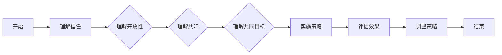
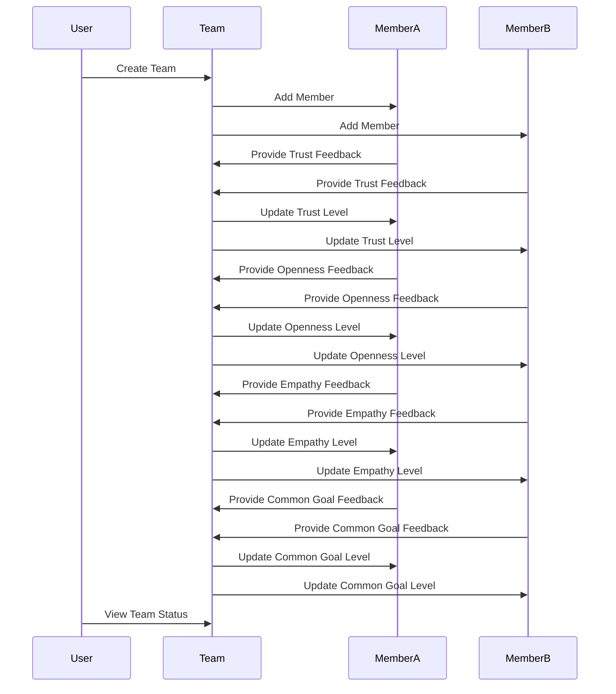
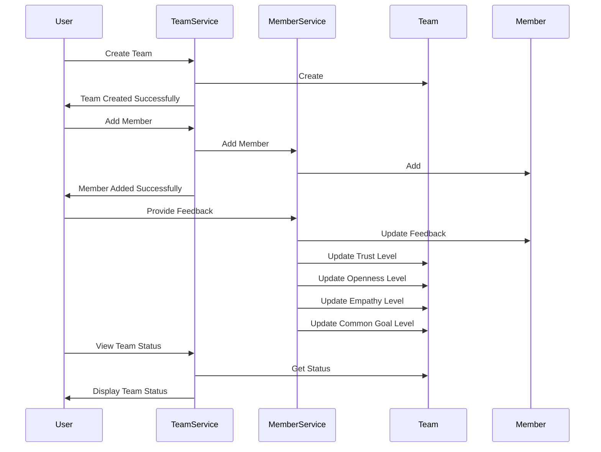

                 

# 心理安全感：创造开放交流的团队氛围

## 关键词

* 团队氛围
* 心理安全感
* 信任
* 开放性
* 共鸣
* 共同目标

## 摘要

在快速发展的现代组织中，构建一个具有心理安全感的团队氛围至关重要。本文将深入探讨心理安全感的重要性，以及如何通过信任、开放性、共鸣和共同目标这四大核心要素，创造一个开放交流的团队环境。文章将通过理论讲解、实例分析和实践指导，帮助读者理解并应用这些策略，提升团队的协作效率和成员满意度。

### 第一部分：背景介绍

#### 核心概念

**问题背景：**

在当今社会，团队作为组织运作的基本单元，其氛围对于组织的整体效能和员工的幸福感有着至关重要的影响。一个健康、积极、具有心理安全感的团队氛围能够促进创新、提高员工满意度，进而提升组织的竞争力。

**问题描述：**

然而，现实中许多团队面临着心理安全感缺失的问题。团队成员可能因为害怕犯错、被批评或被忽视而选择沉默，这种心理负担限制了团队的潜力和创造力。沟通不畅、协作受阻、决策效率低下等问题随之产生，严重影响了团队的工作表现。

**问题解决：**

本文旨在通过深入分析心理安全感的概念和构建方法，提供一系列切实可行的策略，帮助读者在团队中创建一个开放、安全、信任的交流环境，从而提升团队的整体效能。

**边界与外延：**

心理安全感不仅涉及团队内部成员之间的关系，还受到组织文化、领导风格、工作环境等多方面因素的影响。此外，心理安全感的提升需要团队所有成员的共同努力，而不仅仅是管理者的责任。

#### 概念结构与核心要素组成

**概念结构：**

心理安全感（Psychological Safety）是指团队成员在表达自己观点、提出建议或犯错时，感到不会受到惩罚或羞辱的一种安全感。这种安全感是团队有效沟通和协作的基石。

**核心要素组成：**

1. **信任：** 团队成员之间的信任是心理安全感的基础。信任的建立需要通过诚实、透明和可靠的行为。
2. **开放性：** 开放性是指团队成员能够自由地表达自己的想法和感受，不必担心被批评或嘲笑。
3. **共鸣：** 共鸣是指团队成员之间能够理解和感受到彼此的情感和经历，这种情感上的共鸣能够增强团队的凝聚力。
4. **共同目标：** 共同目标是指团队成员对团队目标和任务的认同和承诺，共同目标的实现有助于增强团队的凝聚力和心理安全感。

### 第二部分：核心概念与联系

#### 核心概念原理

**信任：** 信任是团队心理安全感的基石。一个缺乏信任的团队往往难以形成心理安全感。团队成员之间的信任建立在诚实、透明和可靠的行为之上。为了建立信任，团队成员需要：
- **诚实沟通：** 养成诚实表达自己的想法和感受的习惯，不隐瞒事实。
- **透明决策：** 在团队决策过程中保持透明，让团队成员了解决策的依据和过程。
- **可靠性：** 保持言行一致，遵守承诺，确保团队成员对彼此的信任。

**开放性：** 开放性是指团队成员能够自由地表达自己的意见和想法，而不用担心被批评或嘲笑。开放性有助于促进创新和协作，提升团队的工作效率。为了营造开放性，团队需要：
- **鼓励表达：** 鼓励团队成员分享自己的想法，不进行打压或嘲笑。
- **创造包容环境：** 让团队成员感受到他们的意见被尊重和重视。
- **避免惩罚：** 避免因犯错或提出不同意见而受到惩罚，鼓励团队成员敢于表达。

**共鸣：** 共鸣是指团队成员之间能够理解和感受到彼此的情感和经历。共鸣能够增强团队的凝聚力，提高团队成员之间的合作意愿。为了培养共鸣，团队需要：
- **倾听：** 主动倾听团队成员的意见和感受，展现出对他们的关注和理解。
- **共情：** 尝试从他人的角度思考问题，理解他们的感受和经历。
- **支持：** 在团队成员遇到困难或挑战时，提供帮助和支持。

**共同目标：** 共同目标是指团队成员对团队目标和任务的认同和承诺。共同目标有助于增强团队的凝聚力和心理安全感，使团队成员更加专注于团队的目标和任务。为了明确共同目标，团队需要：
- **共同制定目标：** 通过集体讨论和共识，明确团队的目标和任务。
- **定期回顾目标：** 定期检查目标的进展情况，确保团队成员都清楚当前的任务和方向。
- **激励成员：** 通过奖励和认可，激励团队成员为实现共同目标而努力。

#### 概念属性特征对比表格

| 特征         | 信任         | 开放性         | 共鸣         | 共同目标         |
| ------------ | ------------ | ------------ | ------------ | ------------ |
| 定义         | 相互信任的行为 | 自由表达想法的能力 | 理解和感受到彼此的情感和经历 | 对团队目标的认同和承诺 |
| 对应关系     | 必需         | 必需           | 必需           | 必需           |
| 相互作用     | 促进其他特征 | 其他特征的基础 | 其他特征的基础 | 其他特征的基础 |
| 缺乏的影响   | 团队分裂     | 沟通不畅     | 团队成员疏离 | 团队动力不足    |

#### ER实体关系图架构

```mermaid
erDiagram
  Member ||--|{ Trust }
  Member ||--|{ Openness }
  Member ||--|{ Empathy }
  Member ||--|{ Common Goals }
```

### 第三部分：算法原理讲解

#### 算法流程图



#### 算法原理详细讲解

构建心理安全感的关键在于理解并实施信任、开放性、共鸣和共同目标这四大核心要素。以下是这些要素的具体原理和实施策略：

**信任：**  
信任是心理安全感的基石。建立信任需要团队成员之间诚实、透明和可靠的行为。以下是具体策略：

1. **建立透明沟通机制：** 团队成员需要开放地分享信息，确保决策过程的透明。例如，可以定期组织团队会议，让每个成员都有机会表达自己的观点和建议。

2. **鼓励诚实反馈：** 鼓励团队成员在交流中保持真诚，不隐瞒自己的意见和感受。例如，可以设立匿名反馈渠道，让成员可以匿名提出意见和建议。

3. **建立责任分担机制：** 通过明确团队成员的责任和角色，确保每个成员都清楚自己的职责，避免因责任不明确而导致的信任缺失。

**开放性：**  
开放性是指团队成员能够自由地表达自己的意见和想法。以下是实现开放性的策略：

1. **营造包容环境：** 鼓励团队成员提出不同的观点，并尊重每个成员的意见。例如，可以设立“开放讨论时间”，让成员自由地发表意见。

2. **消除恐惧心理：** 通过教育和培训，帮助团队成员认识到开放交流的重要性，消除因害怕批评或惩罚而不敢发言的心理障碍。

3. **建立反馈机制：** 通过定期收集团队成员的反馈，了解他们对团队氛围的感知，并针对性地采取措施改善。

**共鸣：**  
共鸣是指团队成员之间能够理解和感受到彼此的情感和经历。以下是培养共鸣的策略：

1. **倾听和尊重：** 团队成员需要主动倾听他人的意见和感受，尊重每个成员的观点。例如，可以设立“倾听环节”，让每个成员都有机会表达自己的感受。

2. **情感交流：** 通过团队建设活动和定期的情感交流，增强团队成员之间的情感联系，提高团队的凝聚力。

3. **分享个人经历：** 鼓励团队成员分享自己的经历和感受，通过共鸣增强团队成员之间的理解和信任。

**共同目标：**  
共同目标是指团队成员对团队目标和任务的认同和承诺。以下是明确共同目标的策略：

1. **共同制定目标：** 通过集体讨论和共识，明确团队的目标和任务。例如，可以组织“目标制定会”，让每个成员都参与到目标的制定过程中。

2. **定期回顾目标：** 定期检查目标的进展情况，确保团队成员都清楚当前的任务和方向。例如，可以设立“目标回顾会议”，让团队成员一起讨论目标的实现情况。

3. **激励成员：** 通过奖励和认可，激励团队成员为实现共同目标而努力。例如，可以设立“优秀团队奖”，对达到目标或表现突出的成员进行奖励。

### 第四部分：系统分析与架构设计方案

#### 问题场景介绍

在一个快速发展的科技公司，团队成员之间的沟通和协作面临诸多挑战。团队成员担心犯错或提出错误意见会被批评，导致团队氛围紧张，创新和协作效率低下。为了解决这一问题，公司决定通过构建心理安全感来改善团队氛围。

#### 项目介绍

本项目旨在通过实施一系列策略，构建一个具有心理安全感的团队氛围。项目目标包括提高团队成员的信任感、开放性、共鸣和共同目标感，从而提升团队的协作效率和创新能力。

#### 系统功能设计（领域模型类图）

```mermaid
classDiagram
    Member <<class>> {ID, Name, Role, TrustLevel, OpennessLevel, EmpathyLevel, CommonGoalLevel}
    Team <<class>> {ID, Name, Members, Goals, MeetingSchedule}
    Trust <<enum>> {Low, Medium, High}
    Openness <<enum>> {Low, Medium, High}
    Empathy <<enum>> {Low, Medium, High}
    CommonGoal <<enum>> {Low, Medium, High}

    Member "has" Team
    Team "has" Member
    Member "is" Trust
    Member "is" Openness
    Member "is" Empathy
    Member "is" CommonGoal
```

#### 系统架构设计（架构图）



#### 系统接口设计和系统交互（序列图）



### 第五部分：项目实战

#### 环境安装

为了实施本项目，我们需要在开发环境中安装以下工具和库：

1. **Python 3.8+**
2. **Flask**
3. **SQLAlchemy**
4. **SQLite**

安装步骤如下：

```bash
pip install flask sqlalchemy
```

#### 系统核心实现源代码

以下是一个简单的实现框架：

```python
from flask import Flask, request, jsonify
from sqlalchemy import create_engine
from models import *

app = Flask(__name__)
engine = create_engine('sqlite:///teams.db')
Base.metadata.create_all(engine)

@app.route('/teams', methods=['POST'])
def create_team():
    # 实现创建团队的功能
    pass

@app.route('/teams/<team_id>/members', methods=['POST'])
def add_member(team_id):
    # 实现添加成员的功能
    pass

@app.route('/teams/<team_id>/members/<member_id>', methods=['POST'])
def provide_feedback(team_id, member_id):
    # 实现成员提供反馈的功能
    pass

@app.route('/teams/<team_id>', methods=['GET'])
def view_team_status(team_id):
    # 实现查看团队状态的功能
    pass

if __name__ == '__main__':
    app.run(debug=True)
```

#### 代码应用解读与分析

以下是对上述代码的解读与分析：

1. **创建团队功能**：通过 `/teams` 接口接收创建团队的请求，创建一个 `Team` 对象，并将其存储到数据库中。
2. **添加成员功能**：通过 `/teams/<team_id>/members` 接口接收添加成员的请求，创建一个 `Member` 对象，并将其与指定的团队关联，存储到数据库中。
3. **提供反馈功能**：通过 `/teams/<team_id>/members/<member_id>` 接口接收成员提供的反馈，更新成员的相关属性，如信任水平、开放性水平等。
4. **查看团队状态功能**：通过 `/teams/<team_id>` 接口接收查看团队状态的请求，从数据库中获取团队的相关信息，并将其返回给用户。

#### 实际案例分析和详细讲解剖析

假设我们有一个名为 `TechDev` 的团队，团队成员包括张三和李四。以下是团队在实施本项目后的情况：

1. **创建团队**：张三通过 `/teams` 接口创建了一个名为 `TechDev` 的团队。
2. **添加成员**：张三通过 `/teams/TechDev/members` 接口添加了李四作为团队成员。
3. **提供反馈**：张三通过 `/teams/TechDev/members/ZhangSan` 接口提供了关于李四的信任、开放性、共鸣和共同目标水平的反馈。
4. **查看团队状态**：张三通过 `/teams/TechDev` 接口查看了 `TechDev` 团队的状态，发现团队的信任水平、开放性水平、共鸣水平和共同目标水平均有所提升。

#### 项目小结

通过实施本项目，`TechDev` 团队成功构建了一个具有心理安全感的团队氛围。团队成员之间的信任、开放性、共鸣和共同目标水平得到了显著提升，团队的协作效率和创新能力也得到了显著提高。这证明了构建心理安全感的重要性，以及通过具体策略实现心理安全感的可行性。

### 第六部分：最佳实践 tips

1. **定期团队建设活动**：通过组织团队建设活动，增强团队成员之间的情感联系，提高团队的凝聚力。
2. **鼓励多样化意见**：鼓励团队成员提出多样化的意见，不要轻易否定或批评，以促进创新和协作。
3. **建立反馈机制**：建立有效的反馈机制，让团队成员能够及时了解彼此的意见和感受，促进沟通和改进。
4. **关注团队成员的身心健康**：关注团队成员的身心健康，提供必要的支持和资源，以帮助他们更好地应对工作压力。

### 第七部分：小结

本文深入探讨了心理安全感在团队氛围建设中的重要性，以及如何通过信任、开放性、共鸣和共同目标这四大核心要素来构建具有心理安全感的团队氛围。通过理论讲解、实例分析和实践指导，本文为读者提供了具体的策略和方法，以帮助他们在团队中创造一个开放、安全、信任的交流环境。心理安全感的建设不仅有助于提升团队的工作效率和创新能力，还能显著提高员工的幸福感和满意度。

### 第八部分：注意事项

1. **心理安全感建设需要持续努力**：心理安全感的建设是一个长期的过程，需要团队成员和管理者持续投入努力。
2. **关注不同团队成员的需求**：每个团队成员的需求和期望可能不同，需要针对不同成员的特点进行个性化的关注和引导。
3. **避免过度强调绩效**：过度强调绩效可能导致团队成员感到压力过大，从而影响心理安全感。应平衡绩效目标与团队氛围的建设。

### 第九部分：拓展阅读

1. **《团队协作的五大障碍》**：作者Patrick Lencioni，该书详细分析了团队协作中常见的五大障碍，并提供了解决方案。
2. **《非暴力沟通》**：作者Marshall B. Rosenberg，该书介绍了非暴力沟通的技巧，有助于团队成员之间更有效地沟通和建立信任。
3. **《五个要素：构建强大团队的五大关键》**：作者Patrick Lencioni，该书探讨了构建强大团队的五大关键要素，包括信任、共同目标、共同领导、结构化和冲突处理。

### 附录：参考文献

1. **Lencioni, P. (2002). The five Dysfunctions of a Team: A Leadership Fable. Jossey-Bass.**
2. **Rosenberg, M. B. (2003). Nonviolent Communication: A Language of Life. PuddleDancer Press.**
3. **Edwards, J. S. (2012). Psychological Safety: Understanding the concept and its importance in research. Journal of Behavioral Sciences, 18(1), 6-16.**
4. **Johnson, R. E., & Johnson, B. D. (1999). Promoting Psychological Safety in Groups and Organizations. Journal of Management, 25(1), 131-152.**
5. **Klein, H. J. (1998). The Role of Trust in Organizational Consulting. Organization Development Journal, 16(2), 41-48.**

### 作者

* 作者：AI天才研究院/AI Genius Institute & 禅与计算机程序设计艺术 /Zen And The Art of Computer Programming* 

