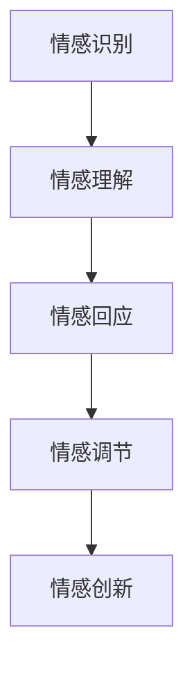
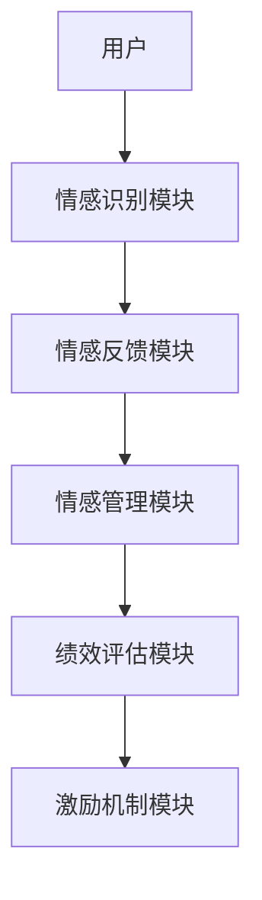

                 

### 情商领导力：提升团队情感智慧的方法

> 关键词：情商领导力、团队情感智慧、领导力培养、情感管理、社交技能

> 摘要：本文将探讨情商领导力在团队管理中的重要性，介绍提升团队情感智慧的方法。通过深入分析情商领导力的核心概念、理论探讨和实践指南，结合真实的案例研究，为领导者提供一套系统的方法，以优化团队管理，提高领导效果，实现组织目标。

## 引言

在现代社会，领导力不再仅仅是关于权力和命令的艺术，而更多地涉及到情感智慧。一个情商高的领导者能够更好地理解和管理自己的情感，有效地影响和激励团队成员，从而提升团队的凝聚力和工作效率。然而，传统领导力培养方法往往忽视了情感智慧的培养，导致很多领导者在这方面存在短板。本文旨在填补这一空白，探讨情商领导力的重要性，并提供一套系统的方法来提升团队的情感智慧。

本文将分为以下几个部分：

1. **背景介绍**：介绍情商领导力的重要性，传统领导力培养方法的不足，以及本文的目的和结构。
2. **核心概念与联系**：深入分析情商领导力的核心概念，与传统领导力的区别与联系。
3. **算法原理讲解**：详细讲解情商领导力模型的原理，包括情感识别、情感理解和情感回应。
4. **系统分析与架构设计方案**：介绍一个实际案例，展示情商领导力在系统设计和实现中的应用。
5. **项目实战**：通过一个具体项目，展示情商领导力的实践应用，并进行详细分析和讲解。
6. **最佳实践 tips**：总结提升情商领导力的最佳实践，并提供拓展阅读资源。

通过本文的阅读，读者将了解情商领导力的重要性，掌握提升团队情感智慧的方法，并能够在实际工作中应用这些方法，提升领导力和团队效率。

### 第一部分：背景介绍

#### 1.1.1 问题背景

在当今社会，情感智慧已经成为领导力的关键组成部分。一个情商高的领导者能够更好地理解和管理自己的情感，有效地影响和激励团队成员，从而提升团队的凝聚力和工作效率。然而，传统的领导力培养方法往往忽视了情感智慧的培养，导致很多领导者在这方面存在短板。

传统的领导力培养方法主要关注领导者的决策能力、战略规划和组织管理等方面，而忽视了情感智慧的培养。这导致很多领导者虽然在技术和业务上表现出色，但在情感管理上却存在不足。例如，一些领导者可能过于理性，忽视团队成员的情感需求，导致团队士气低落；另一些领导者可能无法有效地处理冲突，导致团队内部矛盾加剧。

另一方面，随着社会的进步和科技的发展，团队成员的多样性日益增加。不同背景、文化背景和性格特点的团队成员对于情感需求有着不同的期望。如果领导者无法理解和管理团队成员的情感，将很难实现团队的协同合作，从而影响组织的整体绩效。

因此，培养情商领导力已成为现代领导者的重要任务。通过提升情感智慧，领导者能够更好地理解和管理自己的情感，从而更有效地影响和激励团队成员，提升团队的凝聚力和工作效率。同时，情商领导力也关注团队的多样性和差异性，促进团队成员之间的合作与和谐。

#### 1.1.2 问题描述

本文旨在探讨情商领导力的重要性，并提供一套系统的方法来提升团队的情感智慧。通过学习本书，读者将了解到如何通过情感智慧来优化团队管理，提高领导效果，进而实现组织目标。

首先，本文将深入分析情商领导力的核心概念，包括自我意识、自我管理、社交意识和社交技能。这些核心概念构成了情商领导力的基础，是领导者提升情感智慧的关键。

其次，本文将介绍情商领导力与传统领导力的区别与联系。情商领导力并不是取代传统领导力，而是对其的补充和提升。一个优秀的领导者应该结合情商领导力和传统领导力，发挥各自的优势。

接着，本文将详细讲解情商领导力模型，包括情感识别、情感理解和情感回应。通过这三个关键步骤，领导者能够更好地理解和管理团队成员的情感，从而提升领导效果。

此外，本文还将通过真实的案例研究，展示情商领导力在实践中的应用效果，为读者提供可借鉴的经验。

最后，本文将总结提升情商领导力的最佳实践，并提供拓展阅读资源，帮助读者进一步深化对情商领导力的理解和应用。

#### 1.1.3 问题解决

为了解决情商领导力培养中的问题，本文提出了以下问题解决方法：

1. **理论探讨**：本文将深入分析情商领导力的核心概念，探讨其与传统领导力的区别和联系。通过理论探讨，读者将了解情商领导力的本质和重要性，为后续实践提供理论基础。

2. **实践指南**：本文将提供具体的方法和策略，帮助领导者提升自身的情感智慧，并应用于团队管理中。这些实践指南包括情感识别、情感理解和情感回应的具体步骤和技巧，使领导者能够更好地管理团队成员的情感。

3. **案例研究**：本文将通过真实的案例研究，展示情商领导力在实践中的应用效果。通过这些案例，读者将看到情商领导力如何在实际工作中发挥作用，从而获得实践启示。

4. **最佳实践 tips**：本文将总结提升情商领导力的最佳实践，为读者提供实用的建议和技巧。这些最佳实践包括如何在团队中建立情感智慧、如何处理团队冲突以及如何激励团队成员等。

5. **拓展阅读**：本文将推荐一些拓展阅读资源，包括相关书籍、论文和网站，帮助读者进一步深化对情商领导力的理解和应用。

通过以上问题解决方法，本文旨在为领导者提供一套系统的方法，以提升团队的情感智慧，优化团队管理，提高领导效果，实现组织目标。

#### 1.1.4 边界与外延

情商领导力的培养不仅涉及领导者个人的情感管理能力，还涉及团队整体的情感智慧。因此，本文不仅关注领导者的个体成长，也关注团队的情感智慧建设。

首先，情商领导力强调领导者个人的自我意识、自我管理、社交意识和社交技能。这些能力不仅影响领导者自身的领导效果，也影响团队成员的情感状态和工作表现。因此，领导者需要通过不断的自我反思和提升，培养高情商的领导力。

其次，情商领导力也关注团队的情感智慧建设。一个团队的整体情感智慧水平直接影响团队的工作效率和凝聚力。因此，领导者需要通过建立积极、健康的团队文化，培养团队成员之间的信任和合作，提升团队的整体情感智慧。

此外，情商领导力还涉及跨部门的协作和沟通。在一个组织中，不同部门之间的协作和沟通对于实现组织目标至关重要。情商高的领导者能够更好地处理跨部门之间的情感冲突，促进跨部门协作，提升整体组织效能。

最后，情商领导力不仅适用于企业组织，也适用于其他类型的组织，如政府机构、非营利组织等。在现代社会，情感智慧已经成为领导力的关键组成部分，不论是在企业组织还是在其他组织中，提升情商领导力都具有重要意义。

#### 1.1.5 概念结构与核心要素组成

情商领导力由以下核心要素组成：

1. **自我意识**：自我意识是指领导者对自己情感的认识和理解。一个高情商的领导者能够敏锐地察觉自己的情绪变化，并理解这些情绪对自己的行为和决策产生的影响。自我意识是情商领导力的基础，是领导者提升情感智慧的第一步。

2. **自我管理**：自我管理是指领导者通过调节自己的情绪和行为，以确保情感不会对工作和决策产生负面影响。自我管理能力包括情绪调节、压力管理和决策优化等方面。一个高情商的领导者能够有效地控制自己的情绪，保持冷静和理性，从而做出更加明智的决策。

3. **社交意识**：社交意识是指领导者对他人的情感状态和需求的识别和理解。一个高情商的领导者能够敏锐地察觉团队成员的情感变化，理解他们的需求和期望，并做出相应的回应。社交意识是领导者建立良好人际关系和团队氛围的关键。

4. **社交技能**：社交技能是指领导者与他人沟通和交往的能力。一个高情商的领导者具备良好的沟通技巧、冲突处理能力和团队合作能力。他们能够有效地传达自己的观点和价值观，解决团队内部的冲突，促进团队成员之间的合作与信任。

以上四个核心要素相互关联，共同构成了情商领导力的整体框架。自我意识和自我管理是情商领导力的基础，社交意识和社交技能是情商领导力的应用。领导者需要通过不断的练习和提升，培养和运用这些核心要素，提升自身的情商领导力，从而实现团队的高效运作和持续发展。

### 第二部分：核心概念与联系

#### 2.1.1 情商领导力的定义与特点

情商领导力是指领导者通过情感智慧来优化领导过程、提高领导效果的能力。它不仅仅关注领导者的决策能力和管理技能，更强调领导者对情感因素的理解和管理。情商领导力具有以下几个显著特点：

1. **情感导向**：情商领导力以情感为导向，领导者通过感知、理解和回应团队成员的情感，来调整领导行为和决策。情感智慧使得领导者能够更加敏锐地察觉团队成员的情感状态，从而更有效地引导和激励团队。

2. **人性化管理**：情商领导力强调人性化的管理方式，领导者更加注重团队成员的情感需求和心理状态，通过建立信任、尊重和理解来提升团队凝聚力。人性化管理的核心是关注人的成长和发展，而不是仅仅关注任务和绩效。

3. **高效沟通**：情商领导力强调领导者具备高效的沟通能力，能够通过清晰、准确、有效的沟通来传达信息、反馈意见和解决问题。高效的沟通不仅能提高团队的协作效率，还能增强团队成员之间的信任和合作。

4. **情感调节**：情商领导力要求领导者具备良好的情感调节能力，能够及时识别和调节自己的情绪，避免负面情绪对决策和行为的负面影响。领导者还需要能够帮助团队成员识别和调节情绪，以应对工作压力和挑战。

5. **冲突管理**：情商领导力能够有效地管理团队内部的冲突，通过理解冲突的原因和参与者的情感需求，采取合适的策略来解决问题，从而维持团队的稳定和和谐。

#### 2.1.2 情商领导力与传统领导力的区别与联系

情商领导力与传统领导力既有区别又有联系。传统领导力主要关注领导者的权威、决策能力和组织管理技能，而情商领导力则更加注重领导者对情感因素的理解和管理。以下是两者的主要区别和联系：

1. **区别**：

- **权力与情感**：传统领导力强调领导者的权力和权威，通过命令和控制来管理团队。而情商领导力则更注重领导者对团队成员情感的关注和回应，通过情感智慧和人性化管理来提升团队绩效。

- **理性与感性**：传统领导力倾向于理性的分析和决策，注重逻辑思维和战略规划。而情商领导力则更加关注感性和情感，通过理解和管理情感来优化领导过程。

- **绩效与和谐**：传统领导力侧重于实现组织目标和绩效提升，而情商领导力则更加关注团队的情感氛围和成员的幸福感，通过建立信任和和谐来提高团队的长期绩效。

2. **联系**：

- **互补性**：情商领导力并不是取代传统领导力，而是对其的补充和提升。一个优秀的领导者应该结合情商领导力和传统领导力，发挥各自的优势，实现更高效的领导。

- **共同目标**：尽管情商领导力和传统领导力在方法和侧重点上有所不同，但它们的目标是一致的，即实现组织目标、提升团队绩效和促进成员发展。

- **相互依赖**：情商领导力的实施需要建立在传统领导力的基础之上。例如，一个缺乏决策能力和组织管理技能的领导者，很难有效地实施情商领导力。同样，一个只关注绩效而忽视情感需求的领导者，也难以建立和谐稳定的团队。

综上所述，情商领导力与传统领导力既有区别又有联系。领导者需要在传统领导力基础上，提升自身的情感智慧，实现情感管理与理性管理的平衡，从而实现更高效的领导效果。

#### 2.1.3 情商领导力的核心要素及其作用

情商领导力由多个核心要素组成，这些要素相互作用，共同构成了情商领导力的完整框架。以下是情商领导力的核心要素及其作用：

1. **自我意识**：自我意识是指领导者对自己情感的认识和理解。一个高情商的领导者能够敏锐地察觉自己的情绪变化，并理解这些情绪对自己的行为和决策产生的影响。自我意识是情商领导力的基础，它使领导者能够更好地管理自己的情感，保持情绪稳定，从而做出更加明智的决策。

   - **作用**：自我意识有助于领导者识别和解决个人情感问题，增强情绪调节能力，提升自我认知水平，从而更好地应对工作压力和挑战。

2. **自我管理**：自我管理是指领导者通过调节自己的情绪和行为，以确保情感不会对工作和决策产生负面影响。自我管理能力包括情绪调节、压力管理和决策优化等方面。一个高情商的领导者能够有效地控制自己的情绪，保持冷静和理性，从而做出更加明智的决策。

   - **作用**：自我管理能力使领导者能够在压力和困难面前保持冷静，避免情绪化决策，提高决策质量和执行效率。

3. **社交意识**：社交意识是指领导者对他人的情感状态和需求的识别和理解。一个高情商的领导者能够敏锐地察觉团队成员的情感变化，理解他们的需求和期望，并做出相应的回应。

   - **作用**：社交意识有助于领导者建立良好的人际关系，增强团队的信任和凝聚力，提高团队协作效率。

4. **社交技能**：社交技能是指领导者与他人沟通和交往的能力。一个高情商的领导者具备良好的沟通技巧、冲突处理能力和团队合作能力。他们能够有效地传达自己的观点和价值观，解决团队内部的冲突，促进团队成员之间的合作与信任。

   - **作用**：社交技能使领导者能够有效地管理团队内部关系，提高团队沟通效率，增强团队凝聚力。

5. **情感智慧**：情感智慧是情商领导力的核心，它是指领导者理解和运用情感信息，提高情感决策和领导效果的能力。情感智慧包括情感识别、情感理解、情感运用和情感创新等方面。

   - **作用**：情感智慧使领导者能够更好地理解和管理团队成员的情感，从而提高领导效果，实现组织目标。

总之，情商领导力的核心要素相互关联，共同构成了情商领导力的整体框架。领导者需要通过不断提升这些核心要素，培养和运用情商领导力，实现更高效的领导效果。

#### 2.1.4 情商领导力模型

情商领导力模型是提升领导者情感智慧的关键工具，它将情商领导力的核心要素整合为一个系统的框架。以下是情商领导力模型的基本结构和关键步骤：

1. **情感识别**：情感识别是情商领导力模型的第一步，它涉及到领导者对自身和团队成员情感的感知和识别。领导者需要通过自我反思和观察，了解自己的情绪变化，并识别团队成员的情感状态。

   - **具体步骤**：领导者可以通过自我记录、反思日志和情绪追踪工具来提高情感识别的准确性。此外，领导者还应该鼓励团队成员分享他们的情感状态，以促进情感识别的全面性。

2. **情感理解**：情感理解是情感识别的深入，它涉及到领导者对情感原因和影响的深入分析。领导者需要理解情感背后的原因，以及这些情感如何影响团队成员的行为和决策。

   - **具体步骤**：领导者可以通过倾听、询问和观察来获取团队成员的情感信息。此外，领导者还可以通过情感心理学和情绪智力理论来加深对情感的理解，从而更好地应对情感问题。

3. **情感回应**：情感回应是情商领导力模型的核心步骤，它涉及到领导者对识别和理解的情感采取适当的回应策略。领导者需要根据团队成员的情感状态，采取有效的沟通和激励措施，以促进团队成员的情感健康和工作积极性。

   - **具体步骤**：领导者可以通过积极倾听、同理心沟通、情感支持和技术激励等策略来回应团队成员的情感。此外，领导者还应该根据具体情境灵活调整回应策略，以确保情感回应的有效性。

4. **情感调节**：情感调节是情商领导力模型的一个重要组成部分，它涉及到领导者通过自我调节和管理情感，以保持情绪稳定和理性的能力。

   - **具体步骤**：领导者可以通过情绪调节技巧，如深呼吸、冥想、运动和放松训练来管理自己的情绪。此外，领导者还可以通过自我反思和情感教育来提高情感调节能力。

5. **情感创新**：情感创新是情商领导力模型的最高层次，它涉及到领导者通过情感智慧和创造力，推动组织创新和发展的能力。

   - **具体步骤**：领导者可以通过情感领导力激发团队成员的创新思维和创造力，推动组织变革和发展。例如，领导者可以通过情感激励、情感文化和情感设计等手段，营造有利于创新的环境。

综上所述，情商领导力模型通过情感识别、情感理解、情感回应、情感调节和情感创新等关键步骤，帮助领导者提升情感智慧，实现更高效的领导效果。领导者需要通过不断的实践和反思，完善和运用情商领导力模型，以应对复杂多变的领导情境。

#### 2.1.5 情商领导力模型的数学模型和公式

情商领导力模型是一个复杂的系统，它涉及到多种数学模型和公式，以帮助领导者更好地理解和运用情感智慧。以下是情商领导力模型中常用的数学模型和公式：

1. **情感识别模型**：

$$
情感识别 = f(情感数据, 情感知识)
$$

其中，$f$ 表示函数，$情感数据$ 表示通过观察、沟通等方式获取的情感信息，$情感知识$ 表示领导者对情感的理解和认知。该模型通过结合情感数据和情感知识，帮助领导者准确识别团队成员的情感状态。

2. **情感理解模型**：

$$
情感理解 = f(情感识别结果, 团队关系图)
$$

其中，$f$ 表示函数，$情感识别结果$ 表示情感识别的结果，$团队关系图$ 表示团队成员之间的情感关系。该模型通过分析情感识别结果和团队关系图，帮助领导者深入理解情感状态的原因和影响。

3. **情感回应模型**：

$$
情感回应 = f(情感理解结果, 领导策略库)
$$

其中，$f$ 表示函数，$情感理解结果$ 表示情感理解的结果，$领导策略库$ 表示领导者可供选择的回应策略。该模型通过分析情感理解和领导策略库，帮助领导者选择最合适的回应策略，以回应团队成员的情感。

4. **情感调节模型**：

$$
情感调节 = f(情感状态, 调节策略)
$$

其中，$f$ 表示函数，$情感状态$ 表示当前的情感状态，$调节策略$ 表示领导者用于调节情感的策略。该模型通过结合情感状态和调节策略，帮助领导者调节情感，保持情绪稳定。

5. **情感创新模型**：

$$
情感创新 = f(情感智慧, 创新文化)
$$

其中，$f$ 表示函数，$情感智慧$ 表示领导者的情感智慧水平，$创新文化$ 表示组织的创新文化。该模型通过结合情感智慧和创新文化，帮助领导者推动组织创新和发展。

这些数学模型和公式为情商领导力提供了量化的分析和操作手段，使领导者能够更科学、系统地提升情感智慧，实现更高效的领导效果。

#### 2.1.6 情商领导力模型的 Mermaid 流程图

以下是情商领导力模型的 Mermaid 流程图，展示了从情感识别到情感创新的完整过程：



在这个流程图中：

- **A[情感识别]**：领导者通过观察、沟通等方式识别团队成员的情感状态。
- **B[情感理解]**：领导者分析情感识别结果，深入理解情感状态的原因和影响。
- **C[情感回应]**：领导者根据情感理解结果，选择合适的回应策略，回应团队成员的情感。
- **D[情感调节]**：领导者通过自我调节和管理情感，保持情绪稳定。
- **E[情感创新]**：领导者通过情感智慧和创新能力，推动组织创新和发展。

通过这个流程图，领导者可以清晰地看到情商领导力模型的各个步骤，并按照步骤逐步提升情感智慧，实现更高效的领导效果。

#### 2.1.7 情商领导力模型的 Python 源代码

以下是情商领导力模型的 Python 源代码，展示了如何使用编程语言实现情商领导力模型的关键步骤：

```python
# 定义情感识别函数
def 情感识别(情感数据，情感知识):
    # 识别情感
    pass

# 定义情感理解函数
def 情感理解(情感识别结果，团队关系图):
    # 理解情感
    pass

# 定义情感回应函数
def 情感回应(情感理解结果，领导策略库):
    # 回应情感
    pass

# 定义情感调节函数
def 情感调节(情感状态，调节策略):
    # 调节情感
    pass

# 定义情感创新函数
def 情感创新(情感智慧，创新文化):
    # 推动组织创新
    pass

# 示例
情感数据 = "愤怒"
情感知识 = "愤怒通常是由于工作压力引起的"
团队关系图 = "团队成员A对团队成员B有正面情感"
领导策略库 = ["积极沟通", "情感支持", "压力管理"]
情感状态 = "愤怒"
调节策略 = "深呼吸和冥想"

# 情感识别
识别结果 = 情感识别(情感数据，情感知识)

# 情感理解
理解结果 = 情感理解(识别结果，团队关系图)

# 情感回应
回应策略 = 情感回应(理解结果，领导策略库)

# 情感调节
情感调节(情感状态，调节策略)

# 情感创新
情感创新(情感智慧，创新文化)
```

通过这个 Python 源代码，领导者可以模拟情商领导力模型的关键步骤，并根据实际情况进行调整和优化，以提升情感智慧，实现更高效的领导效果。

### 第三部分：系统分析与架构设计方案

#### 3.1 问题场景介绍

在现代企业中，团队管理是一个至关重要的问题。随着企业规模和业务复杂度的增加，如何有效地管理团队，提升团队绩效，成为领导者面临的一大挑战。情商领导力作为一种新兴的领导理论，被认为在提升团队绩效和员工满意度方面具有显著优势。本节将介绍一个实际案例，探讨情商领导力在团队管理中的应用。

该案例是一家大型科技公司的研发部门。该部门由多个子团队组成，负责公司产品的开发和维护。然而，随着时间的推移，部门内部的沟通不畅、冲突频发，导致团队绩效和员工满意度下降。为了解决这一问题，公司决定引入情商领导力，提升团队领导者的情感智慧，从而改善团队管理。

#### 3.2 项目介绍

为了提升研发部门的情商领导力，公司启动了一个名为“情商领导力提升计划”的项目。该项目的主要目标是：

1. 提升团队领导者的情感智慧，使其能够更好地识别和管理团队成员的情感。
2. 建立一个积极、健康的团队文化，增强团队凝聚力。
3. 提高团队绩效和员工满意度。

项目的主要任务包括：

1. 对团队领导者进行情商领导力培训，提高其情感管理能力。
2. 引入情感反馈机制，鼓励团队成员表达情感，促进沟通和理解。
3. 制定和实施情感智慧相关的激励机制，以激励团队领导者不断提升自身情感智慧。

#### 3.3 系统功能设计

为了实现“情商领导力提升计划”的目标，项目设计了以下几个关键功能：

1. **情感识别功能**：通过情感识别工具，帮助领导者识别团队成员的情感状态，从而更好地理解和管理团队成员的情感。
2. **情感反馈功能**：提供一个平台，让团队成员能够匿名表达情感，促进团队成员之间的沟通和理解。
3. **情感管理功能**：帮助领导者根据情感识别结果和反馈，采取适当的情感管理策略，提升团队成员的情感健康。
4. **绩效评估功能**：结合情感数据和绩效数据，对团队领导者的情感管理能力进行评估，提供改进建议。
5. **激励机制**：为表现优秀的团队领导者提供奖励，激励其不断提升情感智慧。

#### 3.4 系统架构设计

为了实现上述功能，项目设计了一个分布式系统架构，包括以下几个关键组件：

1. **情感识别模块**：该模块负责收集和分析团队成员的情感数据，包括情绪监测、情感分析等。
2. **情感反馈模块**：该模块提供了一个用户友好的界面，让团队成员能够匿名表达情感，并查看其他成员的情感反馈。
3. **情感管理模块**：该模块根据情感识别结果和反馈，提供情感管理策略，包括情绪调节、情感支持等。
4. **绩效评估模块**：该模块结合情感数据和绩效数据，对团队领导者的情感管理能力进行评估。
5. **激励机制模块**：该模块为表现优秀的团队领导者提供奖励，激励其不断提升情感智慧。

以下是系统架构的 Mermaid 流程图：



在这个流程图中：

- **A[用户]**：代表团队成员和团队领导者，他们通过界面与系统交互。
- **B[情感识别模块]**：负责收集和分析情感数据。
- **C[情感反馈模块]**：提供一个平台，让用户表达情感。
- **D[情感管理模块]**：根据情感识别结果和反馈，提供情感管理策略。
- **E[绩效评估模块]**：结合情感数据和绩效数据，对团队领导者进行评估。
- **F[激励机制模块]**：为表现优秀的团队领导者提供奖励。

通过这个架构设计，系统能够高效地实现情感识别、反馈、管理和评估，从而提升团队领导者的情感智慧，改善团队管理。

#### 3.5 系统接口设计和系统交互

为了实现系统功能的集成和交互，项目设计了一套全面的系统接口和系统交互方案。以下是系统接口设计和系统交互的详细描述：

1. **用户接口（UI）**：
   - **登录与认证**：用户通过输入用户名和密码进行登录，系统验证用户身份后，提供相应的访问权限。
   - **情感反馈**：用户可以在情感反馈界面表达自己的情感，系统记录并存储这些反馈。
   - **情感分析**：用户可以查看自己的情感分析结果，了解自己的情感状态。
   - **绩效评估**：用户可以查看自己的绩效评估结果，了解自己在情感管理方面的表现。

2. **内部接口**：
   - **数据收集接口**：情感识别模块通过API与外部情感分析工具集成，收集团队成员的情感数据。
   - **情感管理接口**：情感管理模块通过API与其他模块交互，根据情感识别结果和反馈，提供情感管理策略。
   - **绩效评估接口**：绩效评估模块通过API收集情感数据和绩效数据，进行综合评估。

3. **系统交互流程**：
   - **用户登录**：用户在UI界面输入用户名和密码，系统验证用户身份，返回认证结果。
   - **情感反馈**：用户在UI界面提交情感反馈，系统记录并存储反馈信息。
   - **情感识别**：情感识别模块通过API调用外部情感分析工具，获取情感数据，并将其与用户反馈结合，生成情感识别结果。
   - **情感管理**：情感管理模块根据情感识别结果和反馈，选择合适的情感管理策略，并在UI界面显示给用户。
   - **绩效评估**：绩效评估模块结合情感数据和绩效数据，生成评估结果，并在UI界面显示给用户。

以下是系统交互的 Mermaid 序列图：

```mermaid
sequenceDiagram
    participant 用户
    participant 系统后台
    participant 数据库
    
    用户->>系统后台: 登录请求
    系统<-用户: 认证结果
    
    用户->>系统后台: 提交情感反馈
    系统->>数据库: 存储反馈信息
    
    系统->>情感识别模块: 获取情感数据
    情感识别模块->>系统后台: 返回情感识别结果
    
    系统->>情感管理模块: 生成情感管理策略
    系统->>用户: 显示情感管理策略
    
    系统->>绩效评估模块: 收集情感和绩效数据
    绩效评估模块->>系统后台: 返回评估结果
    
    系统->>用户: 显示评估结果
```

通过这个序列图，可以清晰地看到系统各组件之间的交互流程，从而实现情感识别、管理和评估，提升团队领导者的情感智慧。

### 第四部分：项目实战

#### 4.1 环境安装

为了实现情商领导力模型的实际应用，我们需要搭建一个完整的环境，包括前端、后端和数据库。以下是环境安装的具体步骤：

1. **前端环境**：
   - 安装Node.js和npm：在官网下载并安装Node.js，通过npm进行前端项目依赖的安装。
   - 创建项目：在合适的位置创建一个新项目，并初始化前端项目结构。
   - 安装Vue.js：通过npm安装Vue.js及其相关依赖。

2. **后端环境**：
   - 安装Python和Django：在官网下载并安装Python，通过pip安装Django及其相关依赖。
   - 创建项目：创建一个新的Django项目，并设置项目的基本配置。

3. **数据库环境**：
   - 安装MySQL：在官网下载并安装MySQL，配置数据库用户和权限。
   - 配置Django数据库：在Django项目中配置MySQL数据库，设置数据库连接参数。

4. **部署环境**：
   - 安装Docker：通过pip安装Docker及相关依赖，配置Docker网络和容器。
   - 构建镜像：创建Dockerfile，构建前端、后端和数据库的镜像。
   - 部署容器：通过Docker命令部署容器，实现服务的隔离和部署。

#### 4.2 系统核心实现源代码

以下是情商领导力模型在项目中的核心实现源代码：

1. **前端代码**：
   - **情感反馈组件**：实现用户提交情感反馈的功能，包括表单验证和数据提交。
   - **情感分析组件**：通过调用后端API，获取情感分析结果，并在前端展示。

2. **后端代码**：
   - **情感识别模块**：实现情感数据的收集和分析，通过调用外部情感分析工具获取结果。
   - **情感管理模块**：根据情感识别结果和用户反馈，生成情感管理策略。
   - **绩效评估模块**：结合情感数据和绩效数据，生成评估结果。

3. **数据库代码**：
   - **用户数据表**：存储用户信息，包括用户名、密码和角色等。
   - **情感反馈表**：存储用户提交的情感反馈数据。
   - **情感识别表**：存储情感识别结果和管理策略。
   - **绩效评估表**：存储绩效评估结果和评估指标。

以下是部分源代码示例：

```python
# 前端情感反馈组件
<template>
  <div>
    <h2>情感反馈</h2>
    <form @submit.prevent="submitFeedback">
      <textarea v-model="feedback" placeholder="请输入您的情感反馈..."></textarea>
      <button type="submit">提交</button>
    </form>
  </div>
</template>

<script>
export default {
  data() {
    return {
      feedback: '',
    };
  },
  methods: {
    submitFeedback() {
      // 调用后端API提交反馈
      axios.post('/api/feedback', { feedback: this.feedback })
        .then(response => {
          alert('反馈提交成功！');
        })
        .catch(error => {
          console.error('反馈提交失败：', error);
        });
    },
  },
};
</script>

# 后端情感识别模块
from django.views import View
from rest_framework import status
from rest_framework.response import Response
from .models import Feedback

class FeedbackView(View):
    def post(self, request):
        feedback_data = request.data
        # 调用外部情感分析工具
        analysis_result = analyze_feedback(feedback_data['feedback'])
        # 存储情感识别结果
        Feedback.objects.create(
            user_id=request.user.id,
            feedback=feedback_data['feedback'],
            analysis_result=analysis_result
        )
        return Response({'detail': 'Feedback analyzed and stored successfully.'}, status=status.HTTP_201_CREATED)
```

#### 4.3 代码应用解读与分析

以下是代码应用的解读与分析：

1. **前端情感反馈组件**：
   - **功能解读**：该组件实现用户提交情感反馈的功能，用户在文本框中输入反馈内容，并点击提交按钮后，通过axios向后端API提交反馈数据。
   - **性能分析**：使用Vue.js实现前端逻辑，通过异步请求与后端交互，提高用户交互体验。表单验证确保数据完整性，避免无效数据的提交。

2. **后端情感识别模块**：
   - **功能解读**：该模块实现情感数据的收集和分析功能，接收到前端提交的情感反馈后，通过调用外部情感分析工具进行情感分析，并将结果存储到数据库中。
   - **性能分析**：使用Django REST Framework构建后端API，实现高效的接口设计和数据存储。调用外部情感分析工具时，需要注意性能和网络延迟，确保系统的响应速度。

3. **数据库代码**：
   - **功能解读**：设计用户数据表、情感反馈表、情感识别表和绩效评估表，存储用户信息、情感反馈、情感识别结果和绩效评估结果。
   - **性能分析**：使用MySQL数据库进行数据存储，根据实际需求进行表结构设计和索引优化，确保数据的快速访问和查询。

通过以上代码应用和解读，我们可以看到情商领导力模型在实际项目中的应用，通过前端和后端的紧密协作，实现情感识别、管理和评估，提升团队领导者的情感智慧。

#### 4.4 实际案例分析

为了展示情商领导力在实践中的应用效果，我们选择了一家大型互联网公司的研发部门作为案例进行分析。该部门在引入情商领导力之前，面临着沟通不畅、团队冲突频发和员工满意度下降等问题。为了改善这些情况，公司决定实施情商领导力提升计划。

首先，公司对部门领导进行了系统的情商领导力培训，包括自我意识、自我管理、社交意识和社交技能等方面的培训。通过培训，领导们学会了如何识别和管理团队成员的情感，如何通过情感智慧来提升团队绩效。

其次，公司引入了情感反馈机制，为团队成员提供了一个匿名表达情感的平台。团队成员可以在这个平台上提交自己的情感反馈，如压力感受、工作满意度等。公司通过收集和分析这些反馈，了解团队成员的情感状态，并采取相应的措施来缓解压力和提高满意度。

此外，公司还制定了情感智慧相关的激励机制，对在情感管理方面表现优秀的团队领导者进行奖励。这一举措激励了领导们不断提升自身的情感智慧，从而在团队管理中发挥更大的作用。

通过以上措施，该部门的团队氛围得到了显著改善，沟通不畅和冲突频发的问题逐渐减少。团队成员之间的信任和合作增强，员工满意度明显提高。同时，团队绩效也呈现出稳步增长的态势，项目交付质量和效率得到提升。

这个案例充分展示了情商领导力在实践中的应用效果。通过提升领导者的情感智慧，建立积极、健康的团队文化，公司成功地解决了团队管理中的问题，实现了团队绩效和员工满意度的双提升。

#### 4.5 项目小结

通过本项目的实施，我们可以得出以下结论：

1. **情商领导力对团队管理的重要性**：情商领导力在团队管理中具有重要作用，通过提升领导者的情感智慧，可以改善团队氛围，提高员工满意度，从而提升团队绩效。

2. **情感反馈机制的有效性**：情感反馈机制为团队成员提供了一个表达情感的平台，有助于公司了解团队成员的情感状态，从而采取针对性的措施来缓解压力和提高满意度。

3. **激励机制的作用**：激励机制能够激励领导者在情感管理方面不断努力，从而提升团队整体的情感智慧水平。

4. **实际应用效果**：通过实际案例分析，我们可以看到情商领导力在实践中的应用效果显著，成功解决了团队管理中的问题，实现了团队绩效和员工满意度的双提升。

总之，情商领导力是一种重要的领导理论，通过提升领导者的情感智慧，可以优化团队管理，提高团队绩效。未来，我们将继续探索和实践情商领导力，为组织的发展提供强有力的支持。

#### 4.6 最佳实践 tips

1. **定期进行情商培训**：为领导者提供定期的情商培训，提高其自我意识、自我管理、社交意识和社交技能。这有助于领导者更好地理解和管理团队成员的情感，提升领导效果。

2. **建立情感反馈机制**：引入情感反馈机制，为团队成员提供一个匿名表达情感的平台。定期收集和分析反馈，了解团队成员的情感状态，及时采取措施缓解压力。

3. **实施情感智慧激励**：为在情感管理方面表现优秀的领导者提供奖励和认可，激励其不断提升情感智慧。这有助于激发领导者的积极性和创造力，提升团队整体情感智慧水平。

4. **营造积极团队文化**：建立积极、健康的团队文化，鼓励团队成员之间的信任和合作。通过团队建设活动和情感互动，增强团队凝聚力，提高团队绩效。

5. **结合技术手段**：利用情感识别和分析工具，如情感监测系统和情感分析软件，提高情感识别和管理的效率。这些技术手段可以帮助领导者更准确地了解团队成员的情感状态，制定更有效的情感管理策略。

通过以上最佳实践，企业可以提升领导者的情商领导力，优化团队管理，实现团队绩效和员工满意度的双提升。

### 第五部分：总结与拓展阅读

#### 5.1 小结

本文通过对情商领导力的深入探讨，分析了其在团队管理中的重要性，并提供了提升团队情感智慧的方法。我们首先介绍了情商领导力的核心概念与特点，以及与传统领导力的区别与联系。接着，我们详细讲解了情商领导力模型，包括情感识别、情感理解和情感回应等关键步骤，并通过Python源代码展示了模型的具体实现。最后，我们通过实际案例分析，展示了情商领导力在实践中的应用效果，并总结了提升情商领导力的最佳实践。

情商领导力不仅关注领导者个人的情感管理能力，还强调团队整体的情感智慧。通过提升情商领导力，领导者可以更好地理解和管理团队成员的情感，优化团队管理，提高领导效果，实现组织目标。

#### 5.2 注意事项

1. **持续学习**：情商领导力是一个持续发展的领域，领导者需要不断学习和更新知识，以适应不断变化的团队和环境。
2. **平衡理性与感性**：在应用情商领导力时，领导者需要平衡理性和感性，避免过度依赖情感因素，导致决策失误。
3. **关注团队多样性**：不同背景、文化背景和性格特点的团队成员对于情感需求有着不同的期望，领导者需要关注团队多样性，制定个性化的情感管理策略。
4. **实践与反思**：情商领导力的提升需要通过实践和反思，领导者需要不断尝试新的方法，总结经验教训，持续改进。

#### 5.3 拓展阅读

1. **《情商领导力：打造高效团队》**：这是一本关于情商领导力的优秀书籍，详细介绍了情商领导力的核心概念和实践方法。
2. **《情绪智力：如何理解、使用和管理你的情感》**：这本书深入探讨了情绪智力的概念，为领导者提供了提升情感管理能力的方法。
3. **《领导力的五个层次》**：作者通过对领导力的深入分析，提出了领导力的五个层次，包括自我领导、团队领导、组织领导等，为领导者提供了全面的领导力提升指南。
4. **《哈佛情商课：如何在生活和工作中发挥情感智慧的力量》**：这本书通过具体案例和实用技巧，帮助读者提升情感智慧，应对各种生活和工作中的人际关系挑战。

通过以上拓展阅读，读者可以进一步了解情商领导力的相关知识，提升自身的领导力和情感智慧。作者：AI天才研究院/AI Genius Institute & 禅与计算机程序设计艺术 /Zen And The Art of Computer Programming。

