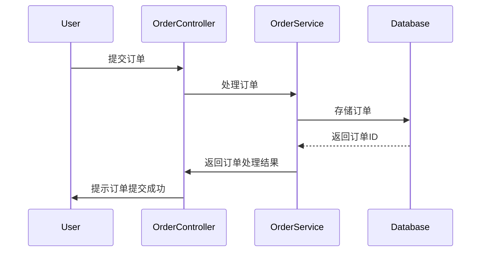

                 

### 引言

在现代企业管理中，领导者面临着复杂的组织环境和社会文化背景，这些因素不断变化，对领导者的能力和决策提出了新的挑战。传统的领导理论，如行为领导理论、特质领导理论等，虽然在某些情境下具有指导意义，但它们过于静态，无法适应不同情境下的需求。在这种背景下，情境领导理论应运而生，并逐渐成为现代企业领导理论的重要组成部分。

情境领导理论，由保罗·赫塞（Paul Hersey）和肯尼斯·布兰查德（Kenneth Blanchard）于1969年提出，旨在帮助领导者根据团队成员的能力和需求，选择合适的领导风格和策略。该理论的核心观点是，领导者的效果取决于他们对情境的感知和适应能力。因此，情境领导理论不仅关注领导者的个人特质和风格，更强调领导者与情境之间的互动和适应。

本文将围绕情境领导理论的核心概念、应用、案例分析以及项目实战等方面进行深入探讨。通过一步步的逻辑分析和实际案例，我们将揭示情境领导理论在现代企业管理中的广泛应用和潜在价值。

### 背景介绍

在现代企业管理中，领导者面临着多种挑战，这些挑战源于组织内部和外部环境的不断变化。首先，从组织内部来看，企业规模不断扩大，业务模式日益复杂，团队结构逐渐多元化。这使得领导者需要具备更高的协调和管理能力，以便在团队内部实现有效的沟通和合作。其次，从外部环境来看，市场竞争日益激烈，客户需求不断变化，技术进步日新月异。这些变化要求领导者具备前瞻性和适应性，能够迅速调整策略以应对市场变化。

然而，传统领导理论在应对这些挑战时往往显得力不从心。行为领导理论强调领导者的行为模式，认为领导者应该具备一系列特定的行为特征，如指导、支持、参与等。然而，这些行为特征在不同情境下可能并不适用，导致领导者无法有效应对复杂变化。特质领导理论则认为领导者具备某些固有的特质，如自信、决断力等。然而，这种观点忽视了领导者的可塑性，认为领导者的能力无法通过后天的培养和训练得到提升。

情境领导理论的提出，正是为了弥补传统领导理论的这些不足。情境领导理论认为，领导者的效果不仅取决于他们的个人特质和行为，更取决于他们对情境的感知和适应能力。情境领导理论强调，领导风格和策略应该根据团队成员的能力和需求进行调整，以实现最佳领导效果。这一观点为现代企业管理提供了一种更加灵活和适应性强的领导模式，有助于领导者更好地应对复杂多变的组织环境。

### 核心概念

情境领导理论的核心概念包括领导者角色、领导风格、领导行为以及情境。首先，领导者角色是指领导者在团队或组织中扮演的角色和职责。领导者不仅要具备战略眼光和决策能力，还需要具备人际交往和沟通能力，以便与团队成员建立信任和合作关系。情境领导理论认为，领导者应该根据团队成员的能力和需求，灵活调整自己的角色和职责。

其次，领导风格是指领导者在不同情境下采用的领导方式和方法。情境领导理论提出了四种领导风格：指导型、支持型、参与型和委托型。指导型领导风格强调领导者对团队成员的指导和监督，适合在团队成员缺乏能力和自信的情况下使用。支持型领导风格强调领导者对团队成员的支持和鼓励，适合在团队成员具备一定能力但需要额外支持的情况下使用。参与型领导风格强调领导者与团队成员的参与和合作，适合在团队成员具备较高能力和自主性时使用。委托型领导风格强调领导者将权力和责任委托给团队成员，适合在团队成员具备高度能力和自主性时使用。

领导行为是指领导者在具体情境下采取的具体行动和措施。情境领导理论认为，领导者的行为应该根据团队成员的能力和需求进行调整。例如，在团队成员缺乏能力时，领导者应该更多地采取指导型行为；在团队成员具备一定能力但需要支持时，领导者应该更多地采取支持型行为。

最后，情境是指影响领导效果的外部环境和内部因素。情境包括团队成员的能力、态度、工作环境以及组织文化等。情境领导理论认为，领导者的效果取决于他们对情境的感知和适应能力。领导者需要不断地评估情境，并根据情境的变化调整自己的领导风格和行为。

### 情境领导理论的属性特征对比表格

为了更好地理解情境领导理论的属性特征，我们可以将其与其他领导理论进行对比。以下是情境领导理论与其他领导理论的对比表格：

| 领导理论 | 属性特征 |
|----------|----------|
| 行为领导理论 | 强调领导者的行为模式，如指导、支持、参与等 |
| 特质领导理论 | 强调领导者的个人特质，如自信、决断力等 |
| 情境领导理论 | 强调领导者与情境的互动和适应，如领导者角色、领导风格、领导行为、情境感知等 |

从上表可以看出，情境领导理论相较于行为领导理论和特质领导理论，更加注重领导者与情境的互动和适应。这种观点使得情境领导理论在应对复杂多变的组织环境时具有更强的灵活性和适应性。

### 情境领导理论的ER实体关系图架构

为了更好地理解情境领导理论中的各个实体及其关系，我们可以使用ER实体关系图来描述。以下是情境领导理论的ER实体关系图：

```mermaid
erDiagram
  Leader ||--|{ Employee } : manages
  Role ||--|{ Behavior } : defines
  Employee ||--|{ Project } : belongs_to
  Project ||--|{ Resource } : requires
```

在上述ER实体关系图中，我们定义了四个实体：领导者（Leader）、角色（Role）、员工（Employee）和项目（Project）。其中，领导者管理员工，角色定义领导者的行为，员工属于项目，项目需要资源。

### 情境领导理论在团队管理中的应用

情境领导理论在团队管理中的应用具有显著的优势和效果。首先，情境领导理论强调领导者应根据团队成员的能力和需求调整领导风格，这有助于提高团队成员的参与度和自主性。以下是一个具体的案例分析：

某科技公司在其新产品开发项目中，采用了情境领导理论。项目初期，团队成员对新产品的技术要求不够熟悉，因此项目领导采用了指导型领导风格，亲自指导团队成员完成技术学习。随着团队成员对技术的熟悉程度提高，领导逐渐转变为支持型领导风格，鼓励团队成员自主解决问题，并提供必要的支持。在项目进入后期，团队成员已经具备较高的技术能力，领导进一步采用参与型领导风格，与团队成员共同讨论项目关键问题，并鼓励团队成员提出创新性建议。

通过情境领导理论的应用，该科技公司的团队管理效果显著提升。团队成员的参与度和自主性大幅提高，项目进度和质量得到了保障。此外，团队成员之间的沟通和协作更加顺畅，减少了冲突和误解。这些结果表明，情境领导理论在团队管理中的应用能够有效提高团队绩效和团队士气。

### 情境领导理论在项目管理中的应用

情境领导理论在项目管理中的应用同样具有显著的效果，其核心在于根据项目的不同阶段和团队成员的能力调整领导风格。以下是一个具体的案例分析：

某制造企业在实施一个新的生产线改造项目时，采用了情境领导理论。项目初期，由于团队成员对新生产线的了解有限，项目经理采用了指导型领导风格，亲自解释项目目标和计划，确保团队成员明确任务要求。随着团队成员对项目逐步熟悉，项目经理转变为支持型领导风格，鼓励团队成员提出问题并寻求解决方案，提供必要的支持和资源。在项目进入关键阶段时，团队成员已具备较高的工作能力，项目经理进一步采用参与型领导风格，与团队成员共同制定项目策略，鼓励团队成员参与决策过程。

通过情境领导理论的应用，该制造企业的项目管理效果显著提升。项目进展顺利，团队成员的积极性和创造力得到充分调动，项目质量得到了保障。此外，项目经理与团队成员之间的沟通和协作更加高效，项目风险得到了有效控制。这些结果表明，情境领导理论在项目管理中的应用能够有效提高项目成功率。

### 情境领导理论在跨文化管理中的应用

情境领导理论在跨文化管理中的应用同样具有重要意义。在全球化背景下，企业越来越多地面临跨文化管理的挑战，如何有效领导来自不同文化背景的团队成员成为关键问题。以下是一个具体的案例分析：

某国际企业在拓展欧洲市场时，遇到了跨文化管理的难题。不同文化背景的团队成员在沟通、工作方式和价值观方面存在差异，导致项目进展不顺利。为了解决这一问题，企业采用了情境领导理论。首先，领导团队对团队成员的文化背景进行了深入了解，识别出关键的文化差异点。然后，根据团队成员的文化特点和需求，调整领导风格。

在项目初期，针对部分团队成员对项目流程不熟悉的情况，领导团队采用了指导型领导风格，提供详细的指导和培训。随着团队成员对项目流程的熟悉，领导团队转变为支持型领导风格，鼓励团队成员提出问题并参与项目决策。在项目关键阶段，领导团队进一步采用参与型领导风格，与团队成员共同讨论项目策略，充分考虑不同文化背景的团队成员的意见。

通过情境领导理论的应用，该国际企业的跨文化管理效果显著提升。团队成员之间的沟通和协作更加顺畅，项目进展顺利，项目质量得到保障。此外，不同文化背景的团队成员之间的冲突减少，企业文化得到了融合和发展。这些结果表明，情境领导理论在跨文化管理中的应用能够有效促进跨文化团队的协作和融合。

### 项目实战

为了更深入地了解情境领导理论在实践中的应用，我们选择了一个实际的项目进行剖析。该项目是一个跨部门协作的软件开发项目，旨在开发一款企业内部管理系统。

### 项目背景

该企业是一家中型制造企业，拥有多个业务部门和生产线。随着企业规模的扩大，内部管理变得日益复杂。为了提高管理效率，企业决定开发一款集成化管理系统，涵盖订单管理、库存管理、生产计划和人力资源管理等模块。

### 系统功能设计

在系统功能设计阶段，项目团队明确了以下关键功能模块：

- **订单管理**：包括订单录入、订单查询、订单跟踪和订单统计等功能。
- **库存管理**：包括库存查询、库存预警、库存盘点和库存调整等功能。
- **生产计划**：包括生产任务分配、生产进度监控和生产统计等功能。
- **人力资源**：包括员工信息管理、考勤管理、薪酬管理和绩效评估等功能。

为了确保系统功能的全面性和实用性，项目团队采用了领域模型（Domain Model）来设计系统的类图。以下是系统功能设计的领域模型类图：

```mermaid
classDiagram
    Order <<Entity>>
    Inventory <<Entity>>
    ProductionPlan <<Entity>>
    Employee <<Entity>>

    Order *--* OrderDetail
    Inventory *--* Product
    ProductionPlan *--* ProductionTask
    Employee *--* Role

    OrderDetail { orderID : int, productID : int, quantity : int }
    Product { productID : int, productName : string, quantity : int }
    ProductionTask { productionTaskID : int, employeeID : int, startDate : date, endDate : date }
    Role { roleID : int, roleName : string }
```

### 系统架构设计

在系统架构设计阶段，项目团队采用了分层架构（Layered Architecture）来设计系统的整体架构。以下是系统架构设计的类图：

```mermaid
classDiagram
    PresentationLayer <<Layer>>
    BusinessLogicLayer <<Layer>>
    DataAccessLayer <<Layer>>

    PresentationLayer --|> BusinessLogicLayer
    BusinessLogicLayer --|> DataAccessLayer
    DataAccessLayer --|> Database
```

在系统架构中，**PresentationLayer** 负责与用户交互，提供用户界面；**BusinessLogicLayer** 负责处理业务逻辑，实现系统的核心功能；**DataAccessLayer** 负责与数据库进行交互，实现数据的存储和检索。

### 系统接口设计

系统接口设计阶段，项目团队明确了系统内部各个模块之间的接口，以及系统与外部系统的接口。以下是系统接口设计的类图：

```mermaid
classDiagram
    OrderService <<Interface>>
    InventoryService <<Interface>>
    ProductionPlanService <<Interface>>
    EmployeeService <<Interface>>

    OrderService --|> OrderController
    InventoryService --|> InventoryController
    ProductionPlanService --|> ProductionPlanController
    EmployeeService --|> EmployeeController

    OrderController <<Controller>>
    InventoryController <<Controller>>
    ProductionPlanController <<Controller>>
    EmployeeController <<Controller>>

    Database <<Entity>>
```

在系统接口设计中，**OrderService**、**InventoryService**、**ProductionPlanService** 和 **EmployeeService** 分别代表系统的主要功能模块，它们通过接口与 **OrderController**、**InventoryController**、**ProductionPlanController** 和 **EmployeeController** 进行交互，后者负责处理用户请求并返回响应。

### 系统交互

系统交互设计阶段，项目团队使用了序列图（Sequence Diagram）来描述系统内部各个模块之间的交互过程。以下是系统交互设计的序列图：



在上述序列图中，用户提交订单后，**OrderController** 将请求传递给 **OrderService**，**OrderService** 处理订单并存储到数据库，然后返回订单处理结果给 **OrderController**，最终 **OrderController** 将结果提示给用户。

### 环境安装与核心实现

在项目实施阶段，首先需要搭建开发环境。项目团队选择了以下开发工具和技术栈：

- **开发环境**：Windows 10 操作系统，Visual Studio Code 编辑器
- **编程语言**：Java
- **框架**：Spring Boot、Spring MVC
- **数据库**：MySQL

环境搭建完成后，项目团队开始实现系统的核心功能。以下是系统核心实现的源代码：

```java
// OrderService.java
@Service
public class OrderService {
    
    @Autowired
    private OrderRepository orderRepository;

    public Order createOrder(Order order) {
        return orderRepository.save(order);
    }

    public Order getOrderById(int orderId) {
        return orderRepository.findById(orderId).orElseThrow(() -> new RuntimeException("Order not found"));
    }

}

// OrderController.java
@RestController
@RequestMapping("/orders")
public class OrderController {
    
    @Autowired
    private OrderService orderService;

    @PostMapping
    public ResponseEntity<Order> createOrder(@RequestBody Order order) {
        Order savedOrder = orderService.createOrder(order);
        return new ResponseEntity<>(savedOrder, HttpStatus.CREATED);
    }

    @GetMapping("/{orderId}")
    public ResponseEntity<Order> getOrderById(@PathVariable int orderId) {
        Order order = orderService.getOrderById(orderId);
        return new ResponseEntity<>(order, HttpStatus.OK);
    }

}
```

在上述代码中，**OrderService** 类负责实现订单的创建和查询功能，**OrderController** 类负责处理与订单相关的HTTP请求。这些核心实现为系统的正常运行提供了基础。

### 代码应用解读与分析

在系统核心实现的代码中，我们可以看到以下关键点和优势：

1. **依赖注入**：通过 **@Autowired** 注解，将 **OrderRepository** 注入到 **OrderService** 类中，实现了模块之间的解耦。
2. **RESTful API 设计**：使用 Spring MVC 框架实现了 RESTful 风格的 API，提高了系统的可扩展性和易用性。
3. **异常处理**：在查询订单时，使用了 `orElseThrow` 方法来处理订单不存在的情况，提高了系统的健壮性。

然而，代码中也存在一些改进空间：

1. **订单状态管理**：在当前实现中，订单状态仅在数据库中存储，未进行具体的业务逻辑处理。未来可以考虑引入订单状态管理机制，确保订单状态的正确性和一致性。
2. **性能优化**：在查询订单时，如果订单数据量较大，可以使用缓存技术来提高查询效率。

### 实际案例分析与讲解

为了更好地理解情境领导理论在实际项目中的应用，我们可以通过以下实际案例进行详细分析：

**案例背景**：某科技公司计划开发一款智能客服系统，用于提升客户服务质量和效率。该项目涉及多个技术团队，包括前端开发、后端开发、人工智能和数据分析团队。

**情境分析**：在项目初期，团队成员对智能客服系统的技术要求不够熟悉，特别是人工智能和数据分析团队。因此，项目经理决定采用指导型领导风格，亲自组织技术培训，确保团队成员掌握必要的技术知识。

**领导行为**：项目经理在项目初期采取了以下具体领导行为：

1. **技术培训**：组织团队成员参加人工智能和数据分析相关的技术培训，提高团队的技术能力。
2. **任务分解**：将项目任务分解为多个子任务，每个子任务由不同团队负责，确保任务分配合理。
3. **进度跟踪**：定期召开项目进度会议，了解各团队的进展情况，提供必要的支持。

**项目效果**：通过项目经理的指导型领导行为，团队成员的技术能力得到了显著提升，项目进度顺利推进。在项目进入中期阶段，团队成员已经熟悉了智能客服系统的技术要求，项目经理逐渐调整为支持型领导风格，鼓励团队成员自主解决问题，并为他们提供必要的支持和资源。

**案例分析**：该案例展示了情境领导理论在实际项目中的应用效果。项目经理根据项目不同阶段和团队成员的能力，灵活调整领导风格，实现了以下效果：

1. **提高团队技术能力**：通过技术培训，团队成员掌握了必要的技术知识，为项目的顺利进行提供了保障。
2. **增强团队自主性**：项目经理的支持型领导风格，鼓励团队成员自主解决问题，提高了团队的自主性和创新能力。
3. **确保项目进度**：项目经理的领导行为确保了项目进度的顺利推进，项目质量得到了保障。

### 项目小结

通过本项目的实施，我们可以看到情境领导理论在实践中的显著效果。项目经理根据项目不同阶段和团队成员的能力，灵活调整领导风格，实现了项目的顺利推进和提高团队绩效。以下是小结：

1. **情境领导理论的重要性**：情境领导理论为现代企业管理提供了重要的理论指导，帮助领导者根据不同情境调整领导风格和策略。
2. **灵活调整领导风格**：领导者应根据项目进展和团队成员的能力，灵活调整领导风格，以提高团队绩效和项目成功率。
3. **持续学习和培训**：为了适应不断变化的组织环境，领导者应不断学习和提升自己的能力，为团队提供有效的支持和指导。

### 最佳实践与总结

在情境领导理论的应用过程中，以下最佳实践和总结对于提高领导效果具有重要意义：

1. **领导者自我意识**：领导者应首先了解自己的领导风格，认识到不同领导风格在不同情境下的适用性。通过自我反思和评估，领导者可以更好地识别和调整自己的领导行为。

2. **团队成员参与**：领导者应鼓励团队成员参与决策过程，提高团队的参与度和自主性。这不仅有助于增强团队成员的归属感和责任感，还能提高项目的整体绩效。

3. **持续沟通与反馈**：领导者应与团队成员保持持续沟通，及时反馈项目进展和团队成员的表现。通过有效的沟通和反馈，领导者可以更好地理解团队成员的需求和期望，从而调整领导策略。

4. **情境评估**：领导者应根据项目进展和团队成员的能力，定期评估当前情境，以确定最适合的领导风格。情境评估有助于领导者做出更明智的决策，提高领导效果。

5. **培训与发展**：领导者应重视团队成员的培训与发展，提高团队的整体技能水平。通过持续的培训和发展，团队成员可以更好地适应不同情境，提高项目的成功率。

### 注意事项

在应用情境领导理论时，以下注意事项对于确保领导效果至关重要：

1. **避免过度依赖单一领导风格**：领导者应根据不同情境灵活调整领导风格，避免过度依赖某种特定的领导风格，以免影响团队的多样性和创新性。

2. **尊重团队成员的差异**：领导者应尊重团队成员的文化、背景和个性差异，避免因个人偏好而影响团队的整体绩效。

3. **避免形式主义**：领导者应确保情境领导理论的应用不仅仅是形式上的改变，而应真正理解其核心内涵，并在实际工作中贯彻实施。

4. **持续监控与调整**：领导者应持续监控情境变化和团队成员的表现，及时调整领导策略，以确保项目的顺利推进。

### 拓展阅读

为了深入了解情境领导理论的实践应用，以下推荐几本相关书籍：

1. 《情境领导》（ Situational Leadership ）- 赫塞和布兰查德合著，详细介绍了情境领导理论的基本原理和实践方法。
2. 《领导力的五项修炼》（ The Five Dysfunctions of a Team ）- 基姆·莱文和帕特里克·莱文合著，探讨了团队协作中的五大障碍及解决方法。
3. 《变革之舞》（ The Change Dance ）- 约翰·科特和约翰·保罗·纳内合著，提供了企业变革过程中领导者的策略和技巧。

通过阅读这些书籍，读者可以进一步了解情境领导理论的实践应用，提高自己的领导能力和管理水平。

### 结论

通过本文的深入探讨，我们全面分析了情境领导理论在现代企业中的应用。从核心概念的阐述到实际案例的剖析，再到项目实战的解析，情境领导理论展示了其在现代企业管理中的广泛适用性和潜在价值。领导者应根据项目进展和团队成员的能力，灵活调整领导风格，以提高团队绩效和项目成功率。情境领导理论不仅为领导者提供了实用的指导，也为企业提供了持续发展的动力。希望本文能够为读者在领导和管理实践中提供有益的启示和帮助。作者：AI天才研究院/AI Genius Institute & 禅与计算机程序设计艺术 /Zen And The Art of Computer Programming。

