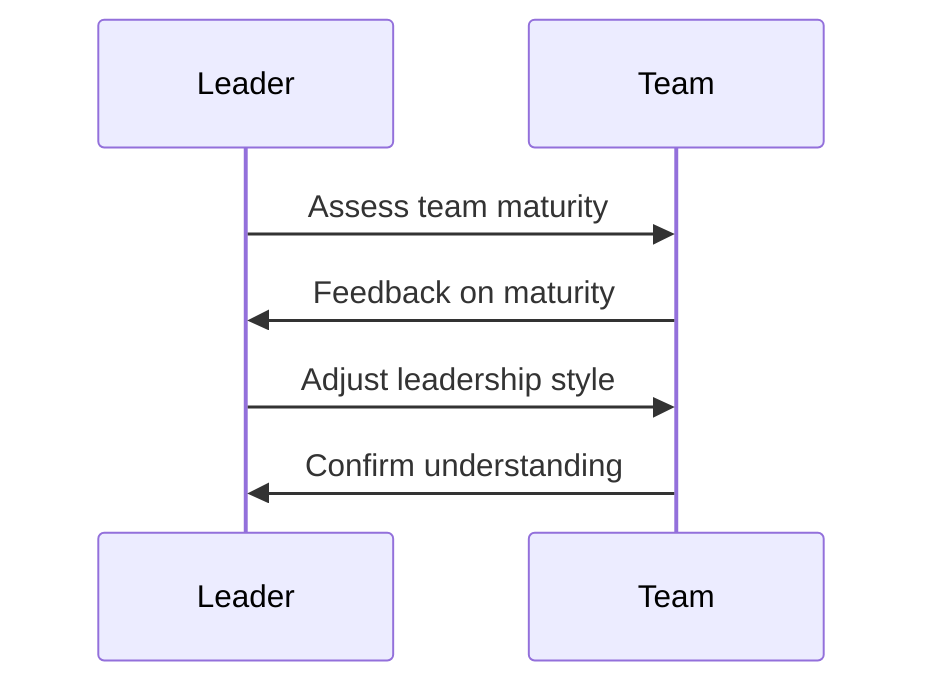

                 

# 情境领导：根据团队成熟度调整领导风格

> 关键词：领导风格、团队成熟度、情境领导、领导艺术、团队协作

> 摘要：本文将深入探讨情境领导理论，分析团队成熟度对领导风格的影响，提供实际案例，并总结调整领导风格的策略与技巧。通过这篇文章，读者将了解如何根据团队成熟度调整领导风格，以实现高效团队协作。

## 引言

领导风格是指领导者引导和管理团队的方式，它直接影响团队的工作效率和发展。不同的领导风格适用于不同情境和不同成熟度的团队。情境领导理论是由保罗·赫塞（Paul Hersey）和肯尼斯·布兰查德（Kenneth Blanchard）提出的，旨在帮助领导者根据团队成熟度调整领导风格，提高团队绩效。

团队成熟度是指团队在完成任务过程中的能力水平和心理状态。一个成熟度高的团队具备较强的自主性和协作能力，而成熟度低的团队则需要更多的指导和支持。情境领导理论认为，领导者的风格应随着团队成熟度的变化而变化。

本文将分为以下几个部分：

1. 引言：情境领导理论概述
2. 团队成熟度模型解析
3. 不同成熟度阶段的领导风格
4. 实际案例分析
5. 调整领导风格的策略与技巧
6. 跨文化团队的情境领导
7. 情境领导在敏捷团队中的应用
8. 总结与展望

## 步骤一：情境领导理论概述

### 1.1 领导风格的概念

领导风格是指领导者对待下属、处理问题和指导团队的方式。根据不同的领导者特征，可以分为以下几种常见的领导风格：

- 指导型领导：领导者明确指示团队成员的任务和目标，提供详细的指导和支持。
- 教练型领导：领导者帮助团队成员提高技能和自信心，鼓励他们独立完成任务。
- 支持型领导：领导者关注团队成员的情感需求，提供积极的反馈和支持。
- 委托型领导：领导者信任团队成员，给予他们较大的自主权和决策权。

### 1.2 团队成熟度的定义

团队成熟度是指团队在完成任务过程中的能力水平和心理状态。赫塞和布兰查德将团队成熟度分为四个阶段：

- 成熟度1（依赖型）：团队成员缺乏技能和自信，需要领导者的指导。
- 成熟度2（较依赖型）：团队成员具备一定的技能，但缺乏自信，需要领导者的支持和鼓励。
- 成熟度3（独立型）：团队成员具备较强的技能和自信，能够独立完成任务。
- 成熟度4（成熟型）：团队成员具备高度的自我管理能力和协作能力，能够自主解决问题。

### 1.3 情境领导理论的背景

情境领导理论是在20世纪60年代由赫塞和布兰查德提出的。最初，他们提出的是“情境领导模型1”，后来在1977年，他们进一步发展了这一理论，提出了情境领导模型2。这一理论的核心思想是，领导者的风格应根据团队成熟度的变化而调整。

## 步骤二：团队成熟度模型解析

### 2.1 传统成熟度模型的演变

传统的团队成熟度模型主要关注团队成员的技能水平和心理状态。在情境领导理论之前，一些学者提出了类似的模型，如伯恩斯（Burns）的“领导者成熟度模型”和斯托格迪尔（Stogdill）的“领导者特征模型”。这些模型都强调了领导者应根据团队成员的特点调整领导风格。

### 2.2 情境领导模型的核心要素

情境领导模型2由四个核心要素组成：

- 领导者的风格：领导者如何指导、支持和激励团队成员。
- 团队成员的成熟度：团队成员的技能水平和心理状态。
- 团队的情境：团队面临的具体任务和环境。
- 团队绩效：团队在完成任务过程中的表现。

### 2.3 团队成熟度的评估方法

评估团队成熟度是调整领导风格的第一步。赫塞和布兰查德提出了一种名为“领导风格量表”（Leadership Style Survey）的工具，用于评估团队成员的成熟度。该量表包括一系列问题，如“团队成员是否具备完成任务所需的技能？”和“团队成员是否愿意承担责任？”等。

## 步骤三：不同成熟度阶段的领导风格

### 3.1 成熟度1：指导型领导风格

在成熟度1阶段，团队成员缺乏技能和自信，需要领导者的明确指导和支持。此时，领导者应采用指导型领导风格，具体包括：

- 明确任务和目标：为团队成员提供清晰的指示，确保他们了解任务的目标和要求。
- 提供具体指导：为团队成员提供详细的操作步骤和指导，帮助他们完成任务。
- 监督和反馈：定期检查团队成员的工作进度，提供及时的反馈和建议。

### 3.2 成熟度2：教练型领导风格

在成熟度2阶段，团队成员具备一定的技能，但缺乏自信，需要领导者的支持和鼓励。此时，领导者应采用教练型领导风格，具体包括：

- 提供支持：关注团队成员的情感需求，提供积极的心理支持。
- 鼓励自主学习：鼓励团队成员独立思考和解决问题，提高他们的自信心。
- 提供反馈：及时给予团队成员反馈，帮助他们了解自己的优点和改进方向。

### 3.3 成熟度3：支持型领导风格

在成熟度3阶段，团队成员具备较强的技能和自信，能够独立完成任务。此时，领导者应采用支持型领导风格，具体包括：

- 支持团队决策：给予团队成员较大的自主权，鼓励他们参与决策。
- 提供资源：确保团队成员能够获取完成任务所需的资源和信息。
- 激励团队：关注团队成员的成就，及时给予表扬和奖励。

### 3.4 成熟度4：委托型领导风格

在成熟度4阶段，团队成员具备高度的自我管理能力和协作能力，能够自主解决问题。此时，领导者应采用委托型领导风格，具体包括：

- 放手让权：完全信任团队成员，让他们自主决策和执行任务。
- 提供反馈：定期与团队成员沟通，了解他们的工作进展和需求。
- 鼓励创新：鼓励团队成员尝试新的方法和想法，提高团队的创新能力。

## 步骤四：实际案例分析

### 4.1 案例一：从指导型到教练型转变

某互联网公司的新项目经理小王负责一个新产品开发项目。在项目初期，小王采用指导型领导风格，为团队成员提供详细的指导和支持。然而，随着项目的进展，团队成员逐渐掌握了项目技能，开始表现出独立工作的意愿。为了更好地激发团队的潜力，小王决定从指导型领导风格转变为教练型领导风格。

小王开始关注团队成员的情感需求，鼓励他们独立思考和解决问题。他还定期组织团队讨论，分享项目经验和教训。通过这些措施，团队成员的自信心和自主性得到了显著提高，项目进度也取得了显著的进展。

### 4.2 案例二：如何适应成熟度3的团队

某科技公司成立了一个新项目团队，团队成员大多是刚毕业的年轻人。在项目初期，团队成员缺乏经验，需要领导者的指导和帮助。项目经理李先生意识到，如果一直采用指导型领导风格，可能会阻碍团队成员的成长。因此，他决定根据团队成熟度调整领导风格，采用支持型领导风格。

李先生为团队成员提供了大量的支持和资源，鼓励他们自主学习。他还定期与团队成员沟通，了解他们的需求和建议。通过这些措施，团队成员逐渐掌握了项目技能，团队士气也高涨。

### 4.3 案例三：如何激励成熟度4的团队

某知名科技公司的一个成熟团队已经完成了多个大型项目，团队成员具备高度的自我管理能力和协作能力。为了保持团队的活力和创新，项目经理张先生决定采用委托型领导风格，完全信任团队成员。

张先生为团队成员提供了广泛的决策权，鼓励他们尝试新的方法和想法。他还定期组织团队讨论，分享项目经验和成果。通过这些措施，团队成员的创新能力得到了显著提高，团队绩效也达到了新的高度。

## 步骤五：调整领导风格的策略与技巧

### 5.1 识别团队成熟度的步骤

要调整领导风格，首先需要识别团队成熟度。以下是一些识别团队成熟度的步骤：

- 观察团队成员的表现：了解团队成员的技能水平、工作态度和团队合作能力。
- 收集反馈：与团队成员沟通，了解他们对团队和领导风格的看法。
- 进行评估：使用领导风格量表等工具对团队成熟度进行评估。

### 5.2 根据团队特点调整领导风格

在识别团队成熟度后，领导者应根据团队特点调整领导风格。以下是一些调整策略：

- 指导型领导风格：适用于成熟度1和2的团队，为团队成员提供明确的指导和帮助。
- 教练型领导风格：适用于成熟度2的团队，帮助团队成员提高技能和自信心。
- 支持型领导风格：适用于成熟度3的团队，支持团队成员的自主决策和团队合作。
- 委托型领导风格：适用于成熟度4的团队，完全信任团队成员，鼓励他们自主解决问题。

### 5.3 领导风格转变的障碍与解决策略

在调整领导风格的过程中，可能会遇到一些障碍。以下是一些常见的障碍和解决策略：

- 团队成员的抵触情绪：领导者需要耐心沟通，解释调整领导风格的原因和好处。
- 领导者的习惯性思维：领导者需要意识到自己的习惯性思维，并努力克服。
- 团队氛围的改变：领导者需要营造积极的团队氛围，鼓励团队成员积极参与。

## 步骤六：跨文化团队的情境领导

### 6.1 跨文化团队的挑战

跨文化团队的情境领导面临着一系列挑战，如文化差异、沟通障碍、团队合作问题等。以下是一些应对策略：

- 增强跨文化意识：领导者需要了解不同文化的特点，提高跨文化沟通能力。
- 建立共同目标：通过明确共同的目标，增强团队成员的凝聚力。
- 促进有效沟通：使用简单明了的语言，避免使用过于专业的术语。

### 6.2 跨文化情境领导的原则

跨文化情境领导应遵循以下原则：

- 尊重文化差异：领导者应尊重团队成员的文化背景，避免文化冲突。
- 适应文化环境：领导者应根据不同文化的特点，调整领导风格。
- 沟通与反馈：保持开放的沟通渠道，及时给予团队成员反馈。

### 6.3 跨文化情境领导案例分析

某跨国公司在中国设立了研发中心，团队成员来自不同的国家。为了有效管理这个跨文化团队，项目经理王先生采用了一种灵活的领导风格，充分尊重团队成员的文化差异。他定期组织团队活动，增强团队成员的凝聚力。他还建立了一个跨文化的沟通平台，鼓励团队成员分享不同文化的经验和见解。通过这些措施，团队的工作效率得到了显著提高。

## 步骤七：情境领导在敏捷团队中的应用

### 7.1 敏捷团队的特点

敏捷团队具有以下特点：

- 灵活性：敏捷团队能够快速响应变化，灵活调整工作计划。
- 自组织：敏捷团队成员自主决策，自我管理。
- 沟通协作：敏捷团队强调团队成员之间的沟通和协作。
- 客户参与：敏捷团队与客户保持紧密合作，确保项目满足客户需求。

### 7.2 敏捷团队中的领导风格

在敏捷团队中，领导者应采用以下领导风格：

- 支持型领导：领导者为团队成员提供支持和资源，鼓励他们自主决策。
- 沟通车轮：领导者与团队成员保持密切沟通，了解团队的需求和问题。
- 激励创新：领导者鼓励团队成员尝试新的方法和想法，提高团队的创新能力。

### 7.3 情境领导在敏捷实践中的应用案例

某科技公司采用敏捷方法开发新产品。项目经理刘先生意识到，在敏捷团队中，领导风格应更加灵活和开放。他采用支持型领导风格，为团队成员提供充分的自主权，鼓励他们积极参与项目决策。他还定期组织团队讨论，收集团队成员的意见和建议。通过这些措施，团队的创新能力得到了显著提高，项目也取得了成功。

## 步骤八：总结与展望

### 8.1 情境领导的核心原则

情境领导的核心原则是，领导者应根据团队成熟度调整领导风格，以实现团队的高效协作。具体原则包括：

- 灵活调整领导风格：领导者应根据团队成熟度的变化，灵活调整领导风格。
- 关注团队成员的需求：领导者应关注团队成员的情感需求，提供支持和帮助。
- 促进团队协作：领导者应促进团队成员之间的沟通和协作，提高团队绩效。

### 8.2 领导者的持续成长

领导者需要不断学习和成长，以提高自己的领导能力。以下是一些建议：

- 学习领导理论：领导者应学习各种领导理论，了解不同领导风格的适用场景。
- 反思自身行为：领导者应反思自己的领导行为，不断改进自己的领导风格。
- 积累实践经验：领导者应积极参与实际项目，积累实践经验，提高自己的领导能力。

### 8.3 未来领导风格的发展趋势

未来领导风格的发展趋势包括：

- 数字化领导：随着数字化技术的发展，领导者需要掌握数字化领导技能，如数据分析、人工智能等。
- 灵活领导：随着工作方式的多样化，领导者需要更加灵活和开放，适应不同的工作环境。
- 个性化领导：领导者需要根据团队成员的特点和需求，提供个性化的领导和支持。

## 作者信息

作者：AI天才研究院/AI Genius Institute & 禅与计算机程序设计艺术 /Zen And The Art of Computer Programming

本文基于情境领导理论，分析了团队成熟度对领导风格的影响，并提供了一系列实际案例和调整策略。通过本文的阅读，读者将了解如何根据团队成熟度调整领导风格，实现高效团队协作。在未来，领导者需要不断学习和成长，以应对不断变化的工作环境。希望本文对您在领导实践中的启发和帮助。

## 附录：相关概念、术语、对比表格和Mermaid流程图

### 1. 领导风格对比表格

| 领导风格 | 特点 |
| :--: | :--: |
| 指导型 | 明确指示任务和目标，提供详细指导和支持 |
| 教练型 | 帮助团队成员提高技能和自信心，鼓励独立完成任务 |
| 支持型 | 关注团队成员的情感需求，提供积极反馈和支持 |
| 委托型 | 信任团队成员，给予自主权和决策权 |

### 2. 团队成熟度ER实体关系图

```mermaid
erDiagram
    Customer ||--|{ Order } : "places"
    "Payment" ||--|{ Order } : "pays for"
    Product &&<.. Customer : "purchases"
    Product &&<.. "Payment" : "relates to"
```

### 3. 情境领导模型流程图



### 4. 调整领导风格策略流程图

```mermaid
sequenceDiagram
    Participant Leader
    Participant Team
    Leader->>Team: Identify team maturity
    alt 指导型成熟度
    Leader->>Team: Provide clear instructions and support
    else 教练型成熟度
    Leader->>Team: Facilitate skill development and confidence
    else 支持型成熟度
    Leader->>Team: Offer emotional support and encouragement
    else 委托型成熟度
    Leader->>Team: Delegate decision-making authority
    Team->>Leader: Acknowledge and follow
```

通过上述表格和流程图，我们可以更清晰地理解领导风格、团队成熟度和情境领导模型，为实际应用提供指导。希望这些内容能够帮助读者更好地理解本文的核心观点和概念。

